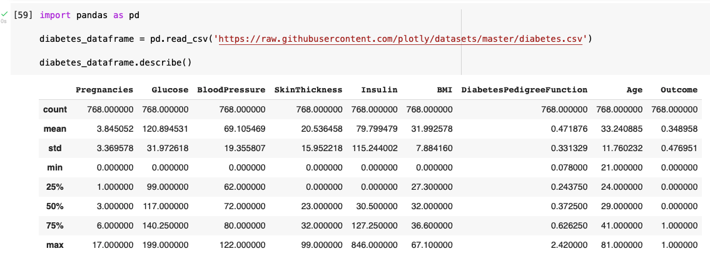
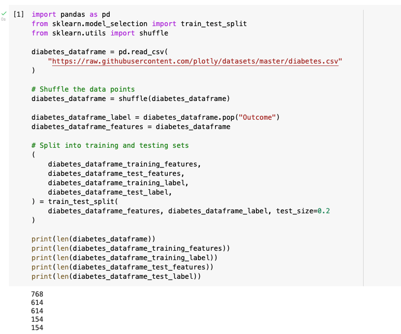
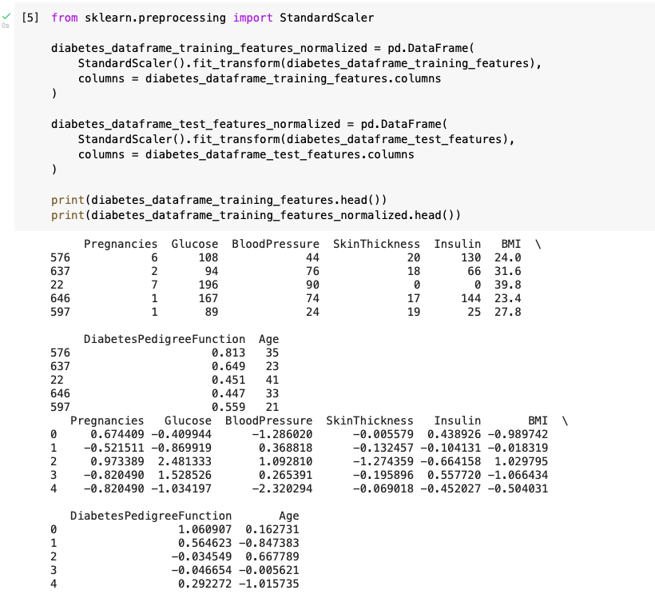
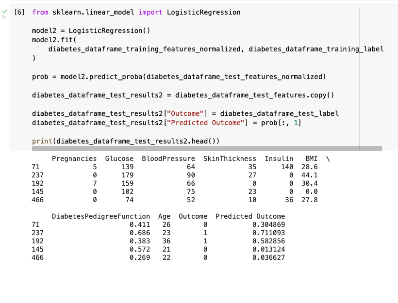

I investigated whether it is possible to predict if a person will develop diabetes based on their Pregnancy Count, Glucose level, Blood Pressure, Skin Thickness, Insulin, BMI, DiabetesPedigreeFunction and Age.

*I reviewed the summary of the diabetes data*

There are 768 data items in the diabetes data.

I split the 768 data items into a training set and a testing set.

The "Outcome" column showed me which people had been diagnosed with diabetes.

I removed the Outcome column from the training set (using "pop").

*I split the data into training and testing dataframes*

## Normalize

Then I normalized the feature columns.

(I noted that one way to normalize numeric data is to calculate the mean of each column and then replace the original value in each cell with the number of standard deviations the original value was from the mean of that column.)

*I reviewed the training data X*

## Training the sklearn model

I trained a sklearn model using the normalized features in the training set and the labels in the training set.

The actual and predicted results are shown below

*Training the sklearn model and predicting results*