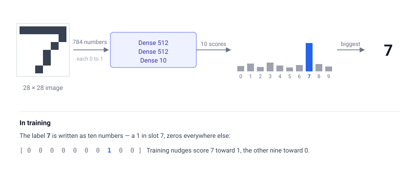
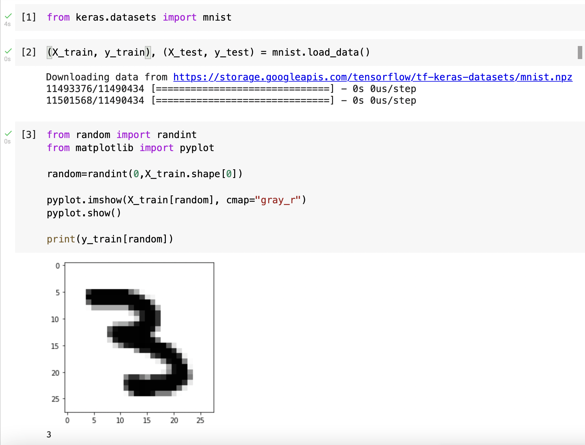
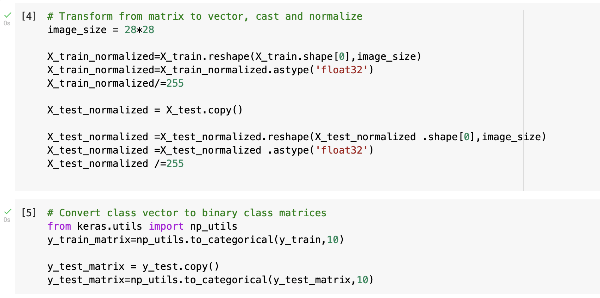
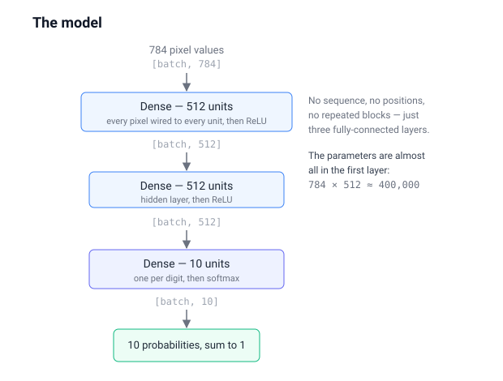
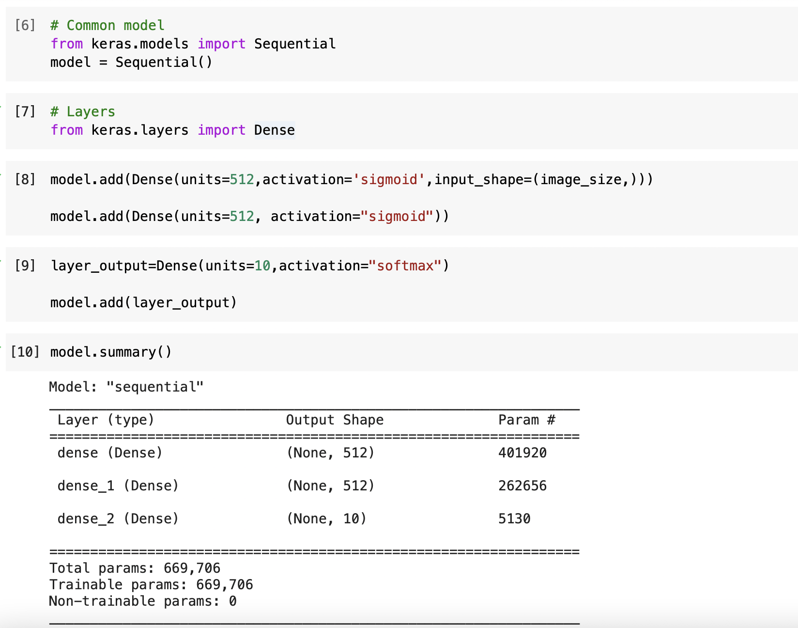
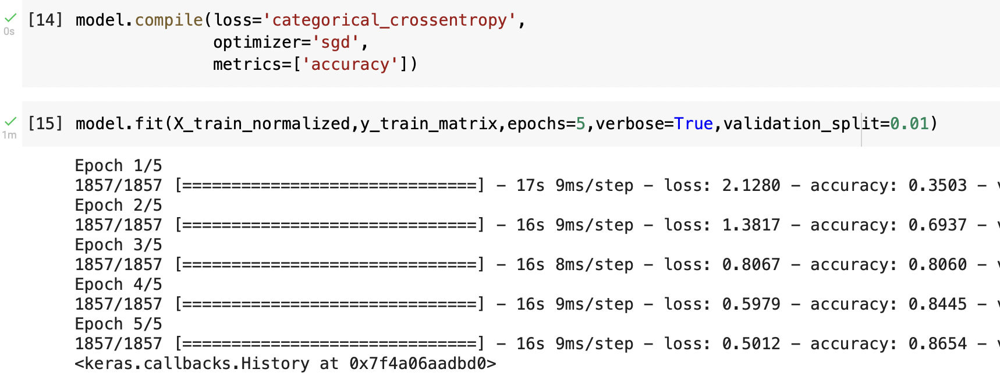
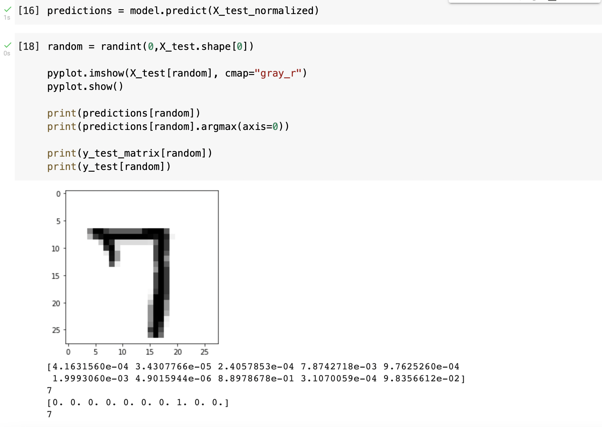

The MNIST database of handwritten digits has a training set of 60,000 examples, and a test set of 10,000 examples.

The digits have been size-normalized and centered in a fixed-size image.

## What goes in, what comes out

The task is to turn a picture of a digit into the digit itself. The picture is a 28 by 28 grid, so 784 numbers. The answer is one of ten choices, 0 to 9.

So the model takes 784 numbers in and produces 10 numbers out — a score for each possible digit. To read off the answer you take the biggest: if the score for 7 is the highest, the model has recognised a 7.

*784 pixel values in, 10 scores out, pick the biggest. During training the correct answer is written as ten numbers too — a 1 in the right slot and zeros elsewhere*

I found that Keras is aware of the MNIST database. I loaded the database using the mnist.load_data() function.

I viewed a random image from the MNIST database using the pyplot.imshow() function.

*I viewed an image from the MNIST database*

## normalization

Normalization refers to a process that makes something more normal or regular.

I converted each image pixel value (0-255) to a float value between 0 and 1.

I converted each label (an integer between 0 and 9) to a matrix of eight zeros and a single one.

*I normalized the data*

## model

The keras Sequential model is commonly used.

I added a Dense layer with 512 units and 784 (28*28) inputs (there are 784 pixels in each image).
I added a Dense hidden layer with 512 units.
I added a Dense output layer with 10 units (each unit corresponding to a category value from 0 to 9).

*The whole model: three fully-connected layers turning 784 pixel values into 10 probabilities. Every pixel is wired to every unit in the first layer — there is no notion of sequence or position*

*I created the model*

## compile and fit

After creating the model I configured and trained it.

I used the compile() function to configure the model.

I used the fit() function to train the model.

*I compiled and fit the model*

## predict

I used the predict() function to "recognize" the test images.

*predict (recognizing the handwritten digits)*