I set up Unity for Meta Quest virtual reality (VR) development. I learned how to:
- Set up a Unity 3D project that runs on Meta Quest VR headsets
- Add VR interactions to a Unity scene
- Preview my app on a Meta Quest 3


*I installed Unity Hub*


*On the Add module screen, I selected the Android Build Support items in the Platforms section.*


*I installed Unity Assets*


*I selected Projects in the left navigation bar, and clicked New project.*


*I selected the Universal 3D template*


*I opened the project and selected Edit > Project Settings*


*I selected the XR Plug-in Management menu item on the left of the Project Settings window.*


*I clicked Fix All*


*I checked the OpenXR provider in the standalone group tab.*


*I checked the OpenXR provider in the Meta group tab.*


*In the Unity editor menu, I selected File > Build Profiles.*


*In the Unity Editor menu, I selected Window > Package Management > Package Manager.*


*I selected the Meta XR Core SDK and clicked Install.*


*When prompted to enable the Meta XR feature set, I selected Enable.*


*I confirmed that the Meta XR Core SDK was installed*


*I installed the Meta XR Core SDK*


*I installed the Meta XR Interaction SDK*


*I installed the Meta XR Simulator*


*From the top of the Unity Editor, I expanded the Meta XR Tools drop-down list, and then I selected Project Setup Tool.*


*I navigated to Project Settings > XR Plug-in Management > Project Validation.*


*I navigated to Project Settings > XR Plug-in Management > OpenXR and selected the Android tab.*


*In the Hierarchy pane, I deleted the Main Camera from my project’s SampleScene.*


*I selected Meta XR Tools > Building Blocks from the drop-down toolbar menu in the editor.*


*In the Building Blocks window, I found the Camera Rig Building Block, and selected the icon on the bottom right of the block to add it to the project.*


*I added the Camera Rig object*


*In the Building Blocks window, I found the Grab Interaction Building Block, and I selected the icon on the bottom right of the block to add it to the project.*


*I selected the Cube*


*I updated the position of the cube*


*I clicked the 'Build And Run' menu item*


*I saved the file as `Hello World App.apk`*


*I connected my Quest 3 headset to my laptop*


*I used the Cast feature of the Meta mobile app to capture an image of myself grasping and moving the cube*


## Add more Cubes using Claude Code

*I opened the project using Visual Studio Code and used /init to create a CLAUDE.md file*

```PROMPT
Describe the scene
```


*I reviewed Claude Code's description of the scene*

```PROMPT
How can we add an extra 5 cubes to the scene?
```


*I selected the 'Copies of the existing grabbable cube' option*


*I clicked Yes to apply the planned update*


*I clicked Yes to allow the bash command to run*


*I confirmed the update was applied*


*I selected the Build and Run command in Unity*


*I used the Quest 3 headset to grab and move the 6 cubes*

## Switch to Passthrough with Claude Code

```PROMPT
review this page https://developers.meta.com/horizon/documentation/unity/unity-passthrough-tutorial/ then update the scene to use "passthrough"
```


*I clicked Yes to allow Claude Code to fetch the Meta passthrough tutorial*


*I clicked Yes to apply the first SampleScene.unity edit*


*I clicked Yes to apply a second SampleScene.unity edit*


*Claude Code planned the 4 changes needed to enable passthrough*


*I clicked Yes to allow Claude Code to insert the OVRPassthroughLayer object into the scene*


*I clicked Yes to allow Claude Code to edit the AndroidManifest.xml*


*Claude Code completed all 4 passthrough changes and showed a summary*


*The passthrough view showed the real world with blue cubes floating in my space*

## Fixing my Vision with Claude Code

```PROMPT
I have been prescribed glasses that help me to see properly (without leaning my head towards my left shoulder) Add a feature that allows me to adjust the feed to my left and right eyes so that I am less tempted to lean my head. Show a spirit level that lets me see how horizontal my head/eye position is Here is the prescription Right Eye (OD): 5.50 Prism Diopters Base Down + 1.0 Prism Diopter Base Out.
Left Eye (OS): 5.50 Prism Diopters Base Up + 1.0 Prism Diopter Base Out.
```

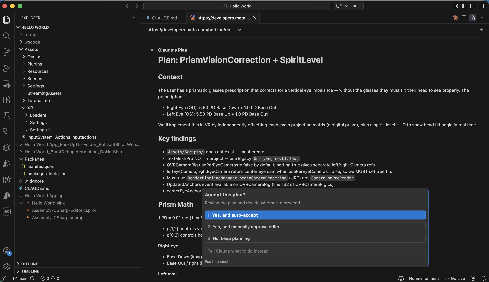
*I reviewed Claude Code's plan for PrismVisionCorrection + SpiritLevel and selected Yes, and auto-accept*

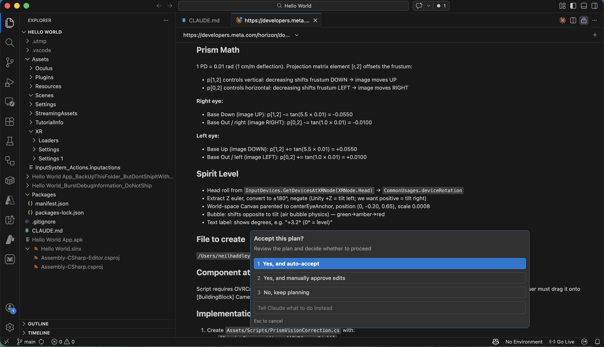
*I reviewed the prism math and spirit level implementation details*

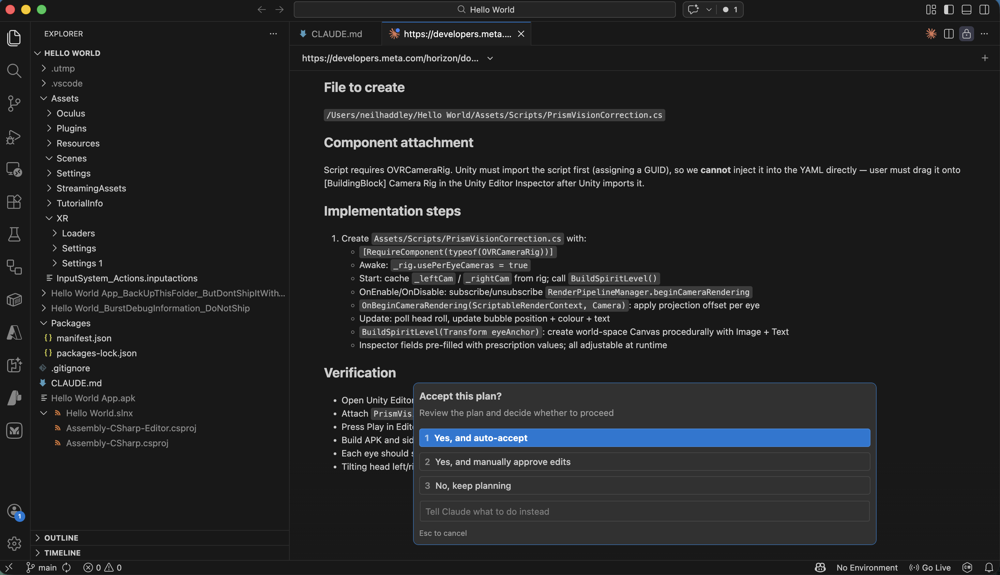
*I reviewed the implementation steps and verification checklist*

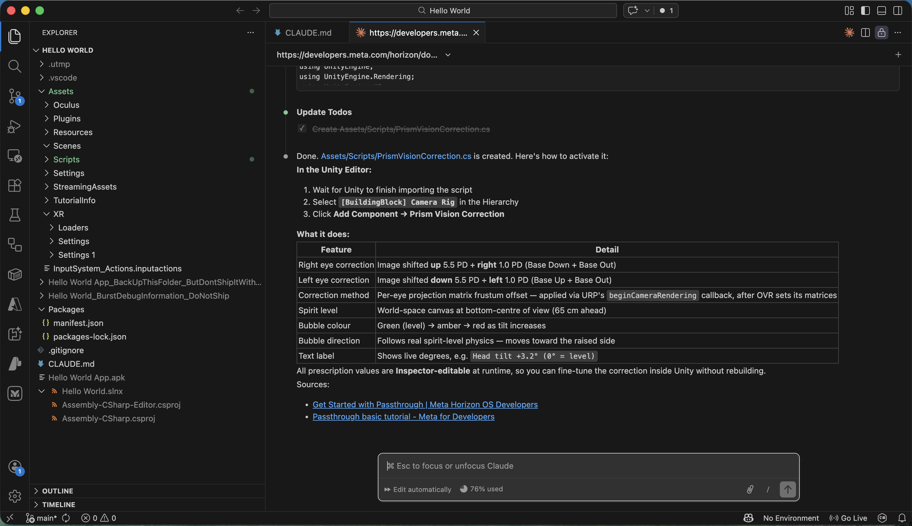
*Claude Code completed the changes and summarised what was created*

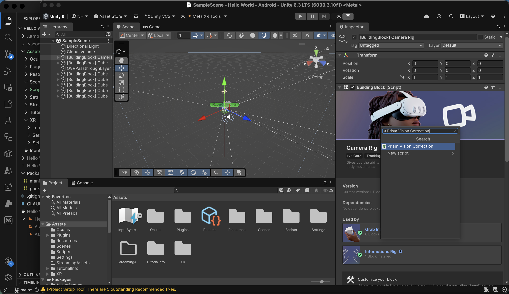
*I attached the Prism Vision Correction script to the Camera Rig in the Unity Editor*

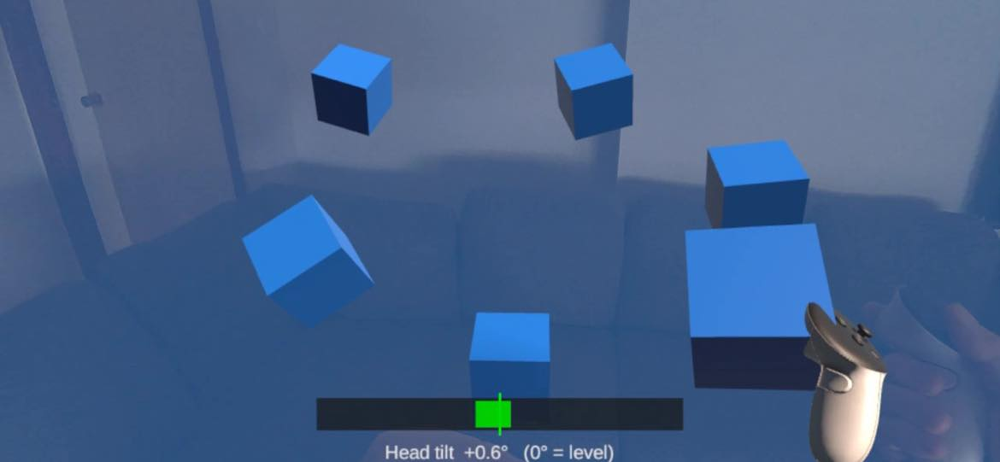
*The spirit level at the bottom of the view showed my head tilt in real time*

## Key move

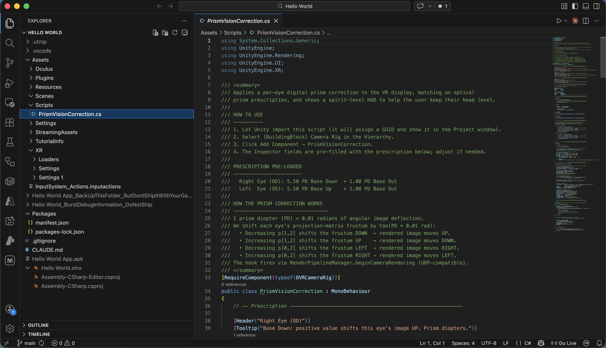
*I opened PrismVisionCorrection.cs in VS Code*

```PROMPT
explain PrismVisionCorrection.cs
```

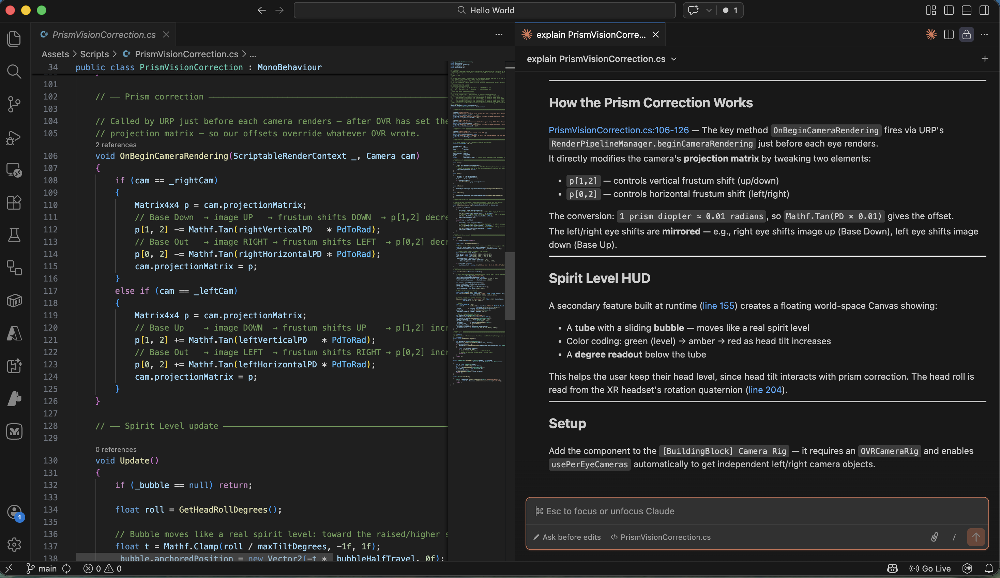
*Claude Code explained how the prism correction and spirit level work*

## Dynamically adjusting Prism values

```prompt
Please update the PrismVisionCorrection script to include the following features:

1. Automatic Tilt Compensation

The prism correction should adjust dynamically based on lateral head tilt (roll).
When the head is level, the full horizontal and vertical prescription values are applied.
Tilting toward the left shoulder gradually reduces the correction, reaching zero when the tilt reaches the compensationAngle (e.g., 16°).
Tilting toward the right shoulder gradually increases the correction, reaching double the original prescription at the same angle.

2. More Robust Head‑Tilt Measurement

Replace the current method for measuring head roll with a more reliable approach that accurately detects side‑to‑side tilt, even when the head is turned or angled up/down.
The output should be positive for right tilt, negative for left tilt.

3. Enhanced HUD Display (Spirit Level)

Slightly enlarge the HUD area:

Line 1 (dim grey): Show the base prescription values (the original values from the prescription, or zero if the Y‑button reset has been used).
Line 2 (light blue): Show the actual applied values after tilt adjustment, along with the current tilt scale factor, measured head tilt, and the compensationAngle.
Both lines must update in real time as head movement occurs or prescription values are changed.

4. Quick Reset Buttons (Left Controller)

Y button: Reset all four prism values (horizontal and vertical for both eyes) to zero.
X button: Restore the original prescription values as they were set in the Inspector when the scene started.

Do you have any questions?
```

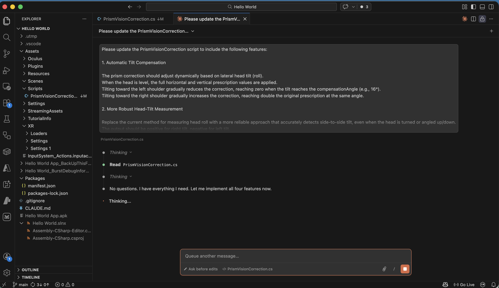
*Claude Code read the script and confirmed it had no questions before implementing all four features*

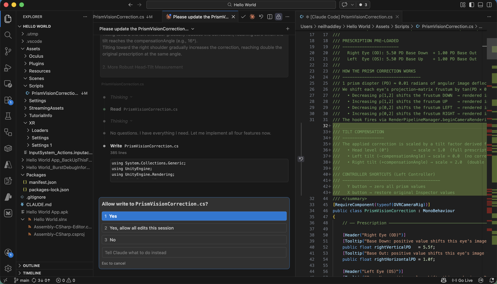
*I clicked Yes to allow Claude Code to write the updated PrismVisionCorrection.cs*

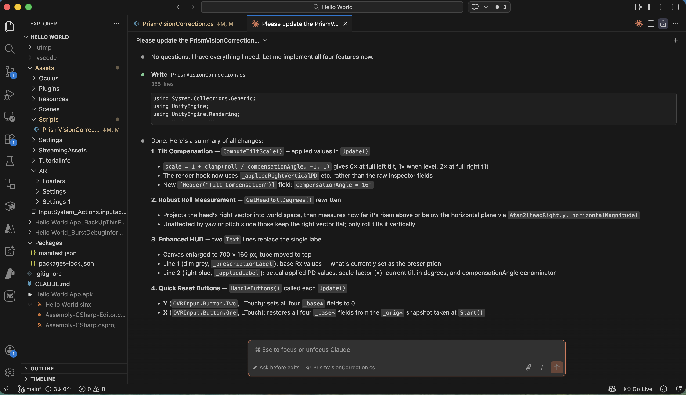
*Claude Code completed all four changes and showed a summary of the tilt compensation, robust roll measurement, enhanced HUD, and quick reset buttons*

```csharp
using System.Collections.Generic;
using UnityEngine;
using UnityEngine.Rendering;
using UnityEngine.UI;
using UnityEngine.XR;

/// <summary>
/// Applies a per-eye digital prism correction to the VR display, matching an optical
/// prism prescription, and shows a spirit-level HUD to help the user keep their head level.
///
/// HOW TO USE
/// ----------
/// 1. Let Unity import this script (it will assign a GUID and show it in the Project window).
/// 2. Select [BuildingBlock] Camera Rig in the Hierarchy.
/// 3. Click Add Component → PrismVisionCorrection.
/// 4. The Inspector fields are pre-filled with the prescription below; adjust if needed.
///
/// PRESCRIPTION PRE-LOADED
/// -----------------------
///   Right Eye (OD): 5.50 PD Base Down  + 1.00 PD Base Out
///   Left  Eye (OS): 5.50 PD Base Up    + 1.00 PD Base Out
///
/// HOW THE PRISM CORRECTION WORKS
/// --------------------------------
/// 1 prism diopter (PD) ≈ 0.01 radians of angular image deflection.
/// We shift each eye's projection-matrix frustum by tan(PD × 0.01 rad):
///   • Decreasing p[1,2] shifts the frustum DOWN  → rendered image moves UP.
///   • Increasing p[1,2] shifts the frustum UP    → rendered image moves DOWN.
///   • Decreasing p[0,2] shifts the frustum LEFT  → rendered image moves RIGHT.
///   • Increasing p[0,2] shifts the frustum RIGHT → rendered image moves LEFT.
/// The hook fires via RenderPipelineManager.beginCameraRendering (URP-compatible).
///
/// TILT COMPENSATION
/// -----------------
/// The applied correction is scaled by a tilt factor derived from head roll:
///   • Head level (0°)          → scale = 1.0  (full prescription)
///   • Left tilt (−compensationAngle) → scale = 0.0  (no correction)
///   • Right tilt (+compensationAngle) → scale = 2.0  (double correction)
///
/// CONTROLLER SHORTCUTS (Left Controller)
/// ----------------------------------------
///   Y button → zero all prism values
///   X button → restore original Inspector values
/// </summary>
[RequireComponent(typeof(OVRCameraRig))]
public class PrismVisionCorrection : MonoBehaviour
{
    // ── Prescription ──────────────────────────────────────────────────────────

    [Header("Right Eye (OD)")]
    [Tooltip("Base Down: positive value shifts this eye's image UP. Prism diopters.")]
    public float rightVerticalPD   = 5.5f;
    [Tooltip("Base Out: positive value shifts this eye's image toward the right temple. Prism diopters.")]
    public float rightHorizontalPD = 1.0f;

    [Header("Left Eye (OS)")]
    [Tooltip("Base Up: positive value shifts this eye's image DOWN. Prism diopters.")]
    public float leftVerticalPD   = 5.5f;
    [Tooltip("Base Out: positive value shifts this eye's image toward the left temple. Prism diopters.")]
    public float leftHorizontalPD = 1.0f;

    // ── Spirit Level ──────────────────────────────────────────────────────────

    [Header("Spirit Level")]
    [Tooltip("Show the head-tilt spirit level HUD.")]
    public bool showSpiritLevel = true;
    [Tooltip("Head roll angle (degrees) at which the bubble reaches the tube end.")]
    public float maxTiltDegrees = 15f;

    // ── Tilt Compensation ─────────────────────────────────────────────────────

    [Header("Tilt Compensation")]
    [Tooltip("Head roll (degrees) at which correction reaches 0× (left) or 2× (right).")]
    public float compensationAngle = 16f;

    // ── Internals ─────────────────────────────────────────────────────────────

    // 1 prism diopter ≈ 0.01 radians of angular deflection.
    const float PdToRad = 0.01f;

    OVRCameraRig _rig;
    Camera       _leftCam;
    Camera       _rightCam;

    // Snapshot of Inspector values taken at Start (restored by X button).
    float _origRightVerticalPD;
    float _origRightHorizontalPD;
    float _origLeftVerticalPD;
    float _origLeftHorizontalPD;

    // Current "base" values — what the prescription is without tilt scaling.
    // Modified by Y (zero) and X (restore) buttons.
    float _baseRightVerticalPD;
    float _baseRightHorizontalPD;
    float _baseLeftVerticalPD;
    float _baseLeftHorizontalPD;

    // Final applied values written by Update() and read by the render hook.
    float _appliedRightVerticalPD;
    float _appliedRightHorizontalPD;
    float _appliedLeftVerticalPD;
    float _appliedLeftHorizontalPD;

    // Spirit level UI
    RectTransform _bubble;
    Image         _bubbleImg;
    Text          _prescriptionLabel; // Line 1: base prescription (dim grey)
    Text          _appliedLabel;      // Line 2: applied + tilt info (light blue)
    float         _bubbleHalfTravel;  // canvas units the bubble can move each side

    // ── Lifecycle ─────────────────────────────────────────────────────────────

    void Awake()
    {
        _rig = GetComponent<OVRCameraRig>();
        // Per-eye cameras are disabled by default. Enabling them gives us separate
        // Camera objects per eye so we can set independent projection matrices.
        _rig.usePerEyeCameras = true;
    }

    void Start()
    {
        _leftCam  = _rig.leftEyeCamera;
        _rightCam = _rig.rightEyeCamera;

        // When usePerEyeCameras is true the per-eye cameras are created fresh and
        // do not inherit the centre eye's passthrough clear settings.  Without this
        // the cameras render a solid (blue) background instead of compositing over
        // the passthrough layer.
        ConfigurePassthroughCamera(_leftCam);
        ConfigurePassthroughCamera(_rightCam);

        // Snapshot Inspector values so X button can restore them.
        _origRightVerticalPD   = rightVerticalPD;
        _origRightHorizontalPD = rightHorizontalPD;
        _origLeftVerticalPD    = leftVerticalPD;
        _origLeftHorizontalPD  = leftHorizontalPD;

        // Initialise base to match Inspector.
        _baseRightVerticalPD   = _origRightVerticalPD;
        _baseRightHorizontalPD = _origRightHorizontalPD;
        _baseLeftVerticalPD    = _origLeftVerticalPD;
        _baseLeftHorizontalPD  = _origLeftHorizontalPD;

        if (showSpiritLevel)
            BuildSpiritLevel(_rig.centerEyeAnchor);
    }

    static void ConfigurePassthroughCamera(Camera cam)
    {
        if (cam == null) return;
        cam.clearFlags      = CameraClearFlags.SolidColor;
        cam.backgroundColor = Color.clear; // alpha = 0 → passthrough shows through
    }

    void OnEnable()
    {
        RenderPipelineManager.beginCameraRendering += OnBeginCameraRendering;
    }

    void OnDisable()
    {
        RenderPipelineManager.beginCameraRendering -= OnBeginCameraRendering;
    }

    // ── Prism correction ──────────────────────────────────────────────────────

    // Called by URP just before each camera renders — after OVR has set the
    // projection matrix — so our offsets override whatever OVR wrote.
    void OnBeginCameraRendering(ScriptableRenderContext _, Camera cam)
    {
        if (cam == _rightCam)
        {
            Matrix4x4 p = cam.projectionMatrix;
            // Base Down  → image UP   → frustum shifts DOWN  → p[1,2] decreases
            p[1, 2] -= Mathf.Tan(_appliedRightVerticalPD   * PdToRad);
            // Base Out   → image RIGHT → frustum shifts LEFT  → p[0,2] decreases
            p[0, 2] -= Mathf.Tan(_appliedRightHorizontalPD * PdToRad);
            cam.projectionMatrix = p;
        }
        else if (cam == _leftCam)
        {
            Matrix4x4 p = cam.projectionMatrix;
            // Base Up    → image DOWN  → frustum shifts UP    → p[1,2] increases
            p[1, 2] += Mathf.Tan(_appliedLeftVerticalPD   * PdToRad);
            // Base Out   → image LEFT  → frustum shifts RIGHT → p[0,2] increases
            p[0, 2] += Mathf.Tan(_appliedLeftHorizontalPD * PdToRad);
            cam.projectionMatrix = p;
        }
    }

    // ── Update ────────────────────────────────────────────────────────────────

    void Update()
    {
        HandleButtons();

        float roll      = GetHeadRollDegrees();
        float tiltScale = ComputeTiltScale(roll);

        // Compute applied values: base prescription scaled by tilt factor.
        _appliedRightVerticalPD   = _baseRightVerticalPD   * tiltScale;
        _appliedRightHorizontalPD = _baseRightHorizontalPD * tiltScale;
        _appliedLeftVerticalPD    = _baseLeftVerticalPD    * tiltScale;
        _appliedLeftHorizontalPD  = _baseLeftHorizontalPD  * tiltScale;

        if (_bubble == null) return;

        // Bubble position: moves toward the raised/higher side.
        float t = Mathf.Clamp(roll / maxTiltDegrees, -1f, 1f);
        _bubble.anchoredPosition = new Vector2(-t * _bubbleHalfTravel, 0f);

        // Colour: green (level) → amber → red (tilted).
        float severity = Mathf.Abs(t);
        Color green = new Color(0.10f, 0.85f, 0.25f, 0.90f);
        Color amber = new Color(1.00f, 0.65f, 0.00f, 0.90f);
        Color red   = new Color(0.90f, 0.15f, 0.15f, 0.90f);
        _bubbleImg.color = severity < 0.4f
            ? Color.Lerp(green, amber, severity / 0.4f)
            : Color.Lerp(amber, red,   (severity - 0.4f) / 0.6f);

        // Line 1: base prescription values (dim grey).
        if (_prescriptionLabel != null)
            _prescriptionLabel.text = string.Format(
                "Rx  RV:{0:+0.00;-0.00;0.00}  RH:{1:+0.00;-0.00;0.00}  LV:{2:+0.00;-0.00;0.00}  LH:{3:+0.00;-0.00;0.00}",
                _baseRightVerticalPD, _baseRightHorizontalPD,
                _baseLeftVerticalPD,  _baseLeftHorizontalPD);

        // Line 2: applied values + tilt diagnostics (light blue).
        if (_appliedLabel != null)
            _appliedLabel.text = string.Format(
                "Applied  RV:{0:+0.00;-0.00;0.00}  RH:{1:+0.00;-0.00;0.00}  LV:{2:+0.00;-0.00;0.00}  LH:{3:+0.00;-0.00;0.00}   \u00d7{4:0.00}  tilt:{5:+0.0;-0.0;0.0}\u00b0/{6:0}\u00b0",
                _appliedRightVerticalPD, _appliedRightHorizontalPD,
                _appliedLeftVerticalPD,  _appliedLeftHorizontalPD,
                tiltScale, roll, compensationAngle);
    }

    // ── Controller buttons ────────────────────────────────────────────────────

    void HandleButtons()
    {
        // Y button (Button.Two on LTouch): zero all prism values.
        if (OVRInput.GetDown(OVRInput.Button.Two, OVRInput.Controller.LTouch))
        {
            _baseRightVerticalPD   = 0f;
            _baseRightHorizontalPD = 0f;
            _baseLeftVerticalPD    = 0f;
            _baseLeftHorizontalPD  = 0f;
        }

        // X button (Button.One on LTouch): restore original Inspector values.
        if (OVRInput.GetDown(OVRInput.Button.One, OVRInput.Controller.LTouch))
        {
            _baseRightVerticalPD   = _origRightVerticalPD;
            _baseRightHorizontalPD = _origRightHorizontalPD;
            _baseLeftVerticalPD    = _origLeftVerticalPD;
            _baseLeftHorizontalPD  = _origLeftHorizontalPD;
        }
    }

    // ── Tilt compensation math ────────────────────────────────────────────────

    /// <summary>
    /// Maps head roll to a correction scale factor.
    ///   Roll =  0                →  1.0  (full prescription)
    ///   Roll = −compensationAngle →  0.0  (no correction, left tilt)
    ///   Roll = +compensationAngle →  2.0  (double correction, right tilt)
    /// </summary>
    float ComputeTiltScale(float rollDegrees)
    {
        if (compensationAngle <= 0f) return 1f;
        return 1f + Mathf.Clamp(rollDegrees / compensationAngle, -1f, 1f);
    }

    // ── Spirit Level construction ─────────────────────────────────────────────

    void BuildSpiritLevel(Transform eyeAnchor)
    {
        // Root: world-space Canvas parented to the centre eye — tracks the head.
        var root = new GameObject("SpiritLevel");
        root.transform.SetParent(eyeAnchor, false);
        root.transform.localPosition = new Vector3(0f, -0.20f, 0.65f);
        root.transform.localScale    = Vector3.one * 0.0008f;

        var canvas = root.AddComponent<Canvas>();
        canvas.renderMode   = RenderMode.WorldSpace;
        canvas.sortingOrder = 10;
        var rootRT = root.GetComponent<RectTransform>();
        rootRT.sizeDelta = new Vector2(700f, 160f); // wider + taller for two text lines

        var font = BuiltinFont();

        // Tube (dark background track) — positioned toward the top of the canvas.
        const float TubeW = 660f, TubeH = 44f;
        var tube = MakePanel(root.transform, "Tube", TubeW, TubeH,
                             new Vector2(0f, 42f),
                             new Color(0.10f, 0.10f, 0.12f, 0.88f));

        // Centre target tick (green vertical line).
        MakePanel(tube.transform, "CentreTick", 3f, TubeH + 14f, Vector2.zero,
                  new Color(0f, 1f, 0f, 0.95f));

        // Bubble.
        const float BubbleW = 48f;
        var bubbleGO   = MakePanel(tube.transform, "Bubble", BubbleW, TubeH - 8f, Vector2.zero,
                                   new Color(0.2f, 0.8f, 1f, 0.90f));
        _bubble        = bubbleGO.GetComponent<RectTransform>();
        _bubbleImg     = bubbleGO.GetComponent<Image>();
        _bubbleHalfTravel = (TubeW - BubbleW) * 0.5f;

        // Line 1: base prescription (dim grey).
        _prescriptionLabel = MakeLabel(root.transform, "PrescriptionLabel",
                                       700f, 36f, new Vector2(0f, -4f),
                                       font, 22, new Color(0.55f, 0.55f, 0.55f, 0.90f));

        // Line 2: applied values + tilt info (light blue).
        _appliedLabel = MakeLabel(root.transform, "AppliedLabel",
                                  700f, 36f, new Vector2(0f, -44f),
                                  font, 22, new Color(0.45f, 0.80f, 1.00f, 0.95f));
    }

    // ── Helpers ───────────────────────────────────────────────────────────────

    /// <summary>
    /// Returns head roll in degrees. Positive = right tilt (right ear lower).
    ///
    /// Uses the world-space projection of the head's right vector to derive roll.
    /// This is robust to yaw (looking left/right) and pitch (looking up/down):
    /// those rotations keep the right vector horizontal, while roll raises or
    /// lowers it — giving a clean, unambiguous roll signal in all orientations.
    /// </summary>
    static float GetHeadRollDegrees()
    {
        var devices = new List<InputDevice>();
        InputDevices.GetDevicesAtXRNode(XRNode.Head, devices);
        if (devices.Count > 0 &&
            devices[0].TryGetFeatureValue(CommonUsages.deviceRotation, out Quaternion rot))
        {
            // Head's right vector in world space.
            Vector3 headRight  = rot * Vector3.right;
            // How far the right vector has risen above or dipped below the horizontal plane.
            float   horizontal = Mathf.Sqrt(headRight.x * headRight.x + headRight.z * headRight.z);
            // Negate: right ear down → headRight.y < 0 → raw angle negative → negated = positive.
            return -Mathf.Atan2(headRight.y, horizontal) * Mathf.Rad2Deg;
        }
        return 0f;
    }

    static Text MakeLabel(Transform parent, string name,
                           float w, float h, Vector2 pos,
                           Font font, int fontSize, Color color)
    {
        var go = new GameObject(name);
        go.transform.SetParent(parent, false);
        var rt = go.AddComponent<RectTransform>();
        rt.sizeDelta        = new Vector2(w, h);
        rt.anchoredPosition = pos;
        var txt       = go.AddComponent<Text>();
        txt.font      = font;
        txt.fontSize  = fontSize;
        txt.alignment = TextAnchor.MiddleCenter;
        txt.color     = color;
        return txt;
    }

    static GameObject MakePanel(Transform parent, string name,
                                 float w, float h, Vector2 pos, Color color)
    {
        var go = new GameObject(name);
        go.transform.SetParent(parent, false);
        var rt = go.AddComponent<RectTransform>();
        rt.sizeDelta        = new Vector2(w, h);
        rt.anchoredPosition = pos;
        go.AddComponent<Image>().color = color;
        return go;
    }

    static Font BuiltinFont()
    {
        Font f = Resources.GetBuiltinResource<Font>("LegacyRuntime.ttf");
        if (f == null) f = Resources.GetBuiltinResource<Font>("Arial.ttf");
        return f;
    }
}

```

## References

- [Unity Hello World for Meta Quest VR headsets](https://developers.meta.com/horizon/documentation/unity/unity-tutorial-hello-vr/?fbclid=IwY2xjawQPgEhleHRuA2FlbQIxMABicmlkETExWHlXUjlTTHZoU0NCSHc1c3J0YwZhcHBfaWQQMjIyMDM5MTc4ODIwMDg5MgABHt6YQvbj1aGkotvkxp3-7LsJVtp8ms9JqOgqA9vEr7GZwqCfYiIbKrZ0jCWn_aem_FvRM0_3JX8Pakzaj7ORUAA)

- [Passthrough basic tutorial](https://developers.meta.com/horizon/documentation/unity/unity-passthrough-tutorial/)

- [Prisms](https://www.ncbi.nlm.nih.gov/books/NBK580488/)