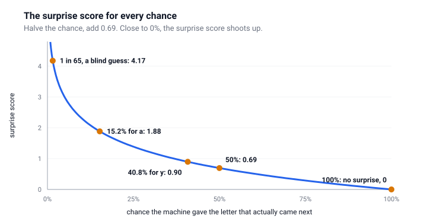
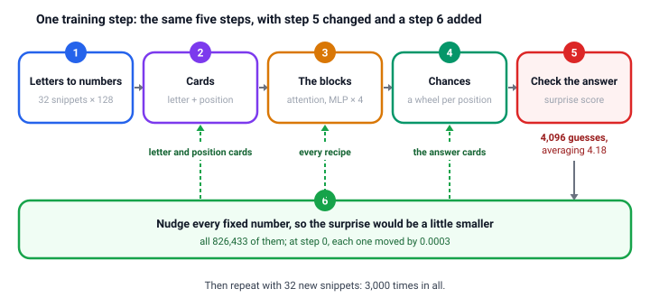
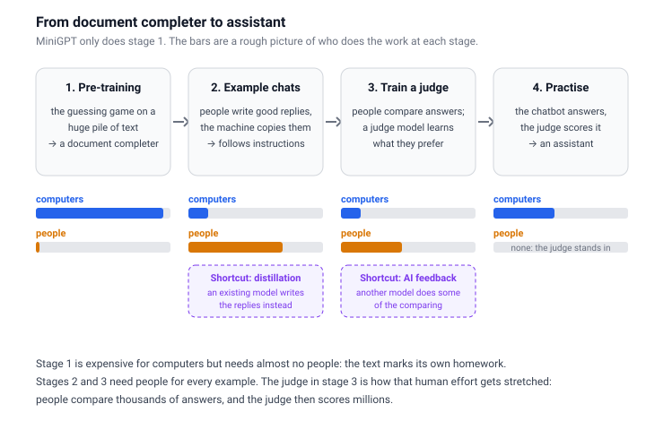
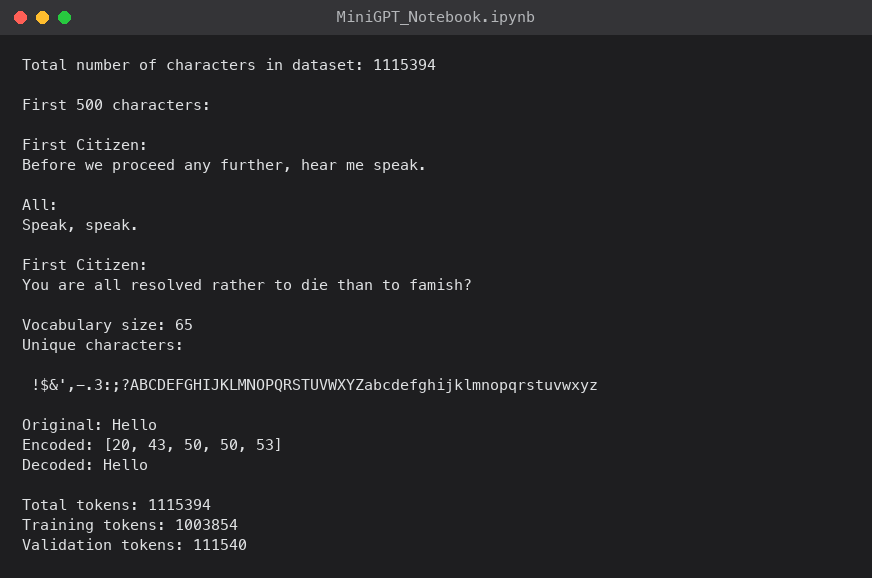
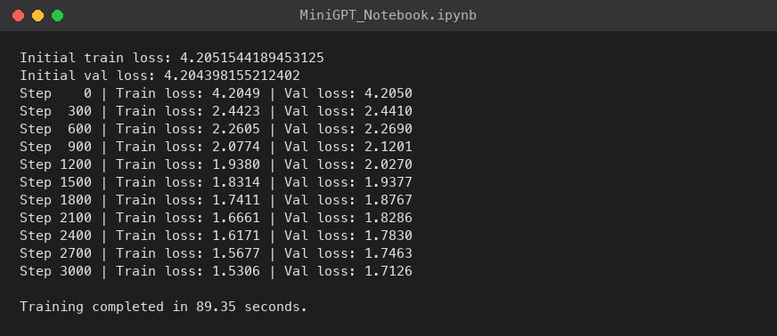
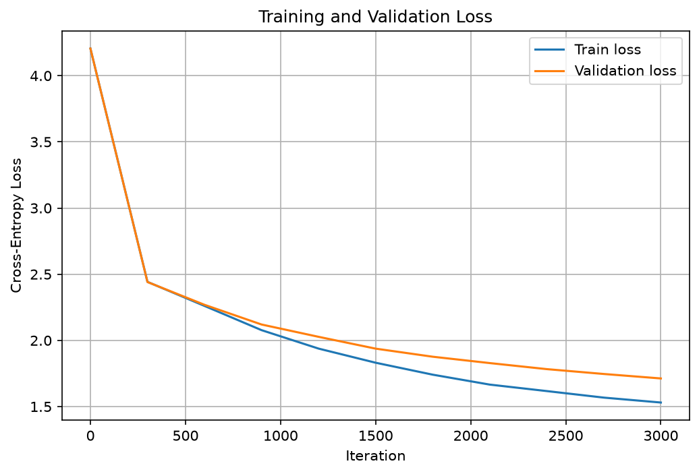
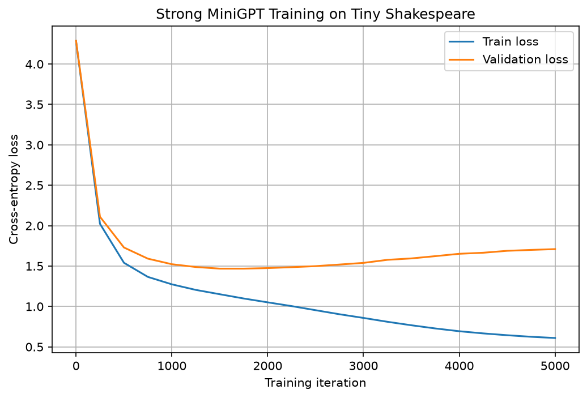
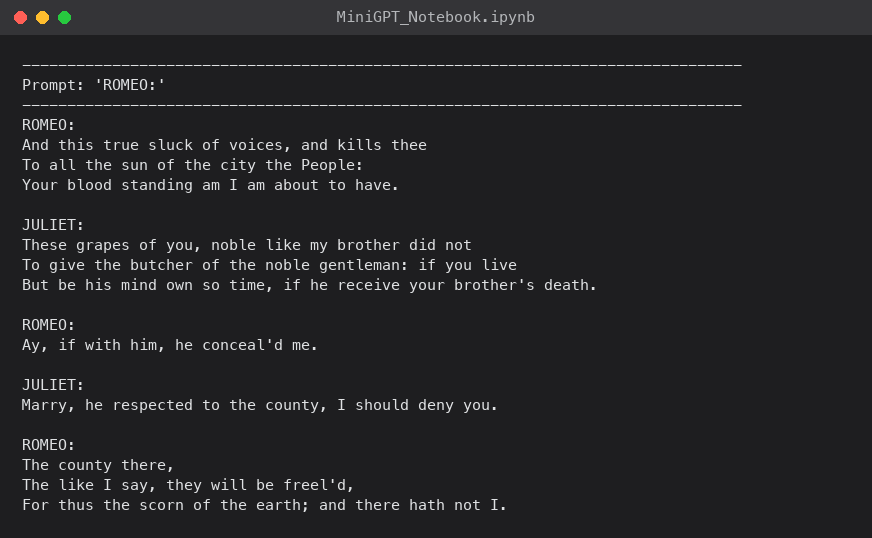

In [the first post](/posts/minigpt/), I took a trained MiniGPT apart while it was running: the letter and position cards, attention, the MLPs, and the 65 answer cards. Every number in it came from one model, my exhibit. This post answers the obvious next question: where did those numbers come from? Nobody typed them in. They were grown, and here I grow them again from scratch, on my Mac, and end up with exactly the same numbers.

In Part 1, writing one letter took [five steps](/posts/minigpt/#the-five-steps): letters to numbers, cards, the blocks, chances, and spin the wheel. Growing the machine uses exactly the same steps, with step 5 changed and one step added. So if Part 1 made sense, most of this post will already feel familiar.

One promise, the same as last time: no magic. Every number in this post is either worked out in front of you, or comes from a run on my own Mac Studio.

## Growing a GPT, in plain English

### Starting from nothing

Build Part 1's machine, but put random numbers on every card and in every recipe, and run its five steps. Step 4 then gives an almost even wheel: every slice about the same size, 1 in 65. So what it writes is pure noise. I asked the untrained MiniGPT model from the notebook to carry on from `ROMEO:`, and this is what it wrote:

```
ROMEO:dHrNUBK.!oWffHGBTyysS:hvnRyuZtONMQhv,dAw$xBM.VQu.!nhulODzyrBM;sta'fy,dlAvIzRlwMl
```

Every letter in that line was a near-random spin. The untrained model's chances were all between about 1% and 3%, close to an even 1 in 65.

That is the whole secret of training. The machine is never taught a rule like "a capital letter starts a name" or "`q` is followed by `u`". Training only reshapes the wheel, one tiny nudge at a time, until the slices for letters that tend to come next in Shakespeare are bigger than the rest. Shape it well enough, and the spins start to look like writing.

### Keeping score: the surprise score

How do you tell a good forecaster from a bad one? You wait to see what the weather actually does, and then you look at the chance they gave it. A forecaster who said "90% chance of rain" on a day it rained did well. One who said "5% chance of rain" on a day it poured did badly. A good forecaster should not be surprised.

The machine is marked in exactly the same way. Once the real next letter is revealed, I look up the chance the machine gave *that one letter*, ignore all the others, and turn it into a **surprise score**: a number for how surprised the machine should be by what actually happened. A high chance gives a low surprise score, and a low chance gives a high one.

**How the surprise score is worked out: the halving rule.** The surprise score follows one simple rule:

- If the machine gave the right letter 100%, the surprise score is 0. It was certain, and it was right, so it is not surprised at all.
- Every time that chance is cut in half, add the same amount to the surprise score: 0.69.

So the surprise score climbs one step of 0.69 for every halving:

| Chance the machine gave the right letter | Halvings from 100% | Surprise score |
|---|---|---|
| 100% | 0 | 0 |
| 50% | 1 | 0.69 |
| 25% | 2 | 1.39 |
| 12.5% | 3 | 2.08 |
| 6.25% | 4 | 2.77 |
| 3.1% | 5 | 3.47 |
| 1.6% (1 in 64) | 6 | 4.16 |

Chances that fall between two rows get a surprise score between those two rows. Take my trained model's real chances after `good m`, as in *good my lord* or *good madam*: `y` 40.8%, `e` 26.9%, and `a` 15.2%.

- If the next letter turns out to be `y`, the machine gave it 40.8%. That is a little less than 50%, so the surprise score is a little more than one step: **0.90**.
- If it turns out to be `a`, the machine gave it only 15.2%. That falls between 25% and 12.5%, so the surprise score lands between 1.39 and 2.08: **1.88**. A bigger surprise.


*The halving rule drawn as a curve. Near 100% the surprise score barely moves; near 0% it shoots up*

Why add 0.69 for each halving, and not a round 1? There is no deep reason. Adding 1 for each halving would work just as well: every surprise score would come out about 1.44 times bigger, and the machine would learn exactly the same thing. The maths in the notebook happens to use 0.69, so I use it too, which means the surprise scores in this post match the numbers the notebook prints.

A score of 0 means the machine gave the right answer 100%: it was certain, and it was right. It cannot do better than that. In the other direction there is no limit: every further halving adds another 0.69, so give almost 0% to the letter that actually turns up, and the surprise score shoots up. That is how the game punishes a machine for being confidently wrong.

This one number is what the whole project is about. Training means making the machine's *average* surprise score, over millions of guesses, as small as possible.

A machine that knows nothing at all gives the same 1-in-65 chance to every letter. 1 in 65 is almost exactly 1 in 64, the bottom row of the table: six halvings from 100%. So whatever comes next, its surprise score is about 6 × 0.69, or 4.17 to be exact. That is almost exactly where my exhibit started: 4.18 on its very first step.

:::under-the-hood Where the surprise numbers come from
The halving rule is exactly what a logarithm does. The surprise score is the natural logarithm of one over the chance, written ln(1 ÷ chance), and every scientific calculator has an `ln` button. The step of 0.69 is ln(2): the cost of one halving.

- A chance of 40.8%: ln(1 ÷ 0.408) = 0.90
- A chance of 15.2%: ln(1 ÷ 0.152) = 1.88
- A chance of 1 in 65: ln(65) = 4.17
- A chance of 100%: ln(1) = 0

To add 1 for each halving instead, swap ln for log₂, the logarithm that counts halvings directly. Then the blind guess scores log₂(65) = 6.02: just over the six halvings in the table.
:::

:::watch-it
No real machine can get a surprise score of 0 on real text, however clever it is. After `good m`, the next letter really could be `y`, `e`, `a`, or comma, or an `s`. Even a perfect reader of Shakespeare has to spread its chances over the possibilities, so some surprise is built into the text itself. The aim is to get the surprise score as low as the text allows, not to reach 0.
:::

There is a friendlier way to read the surprise score. Turn it back into a sentence (in the maths, raise *e*, about 2.718, to the power of the surprise score): "the machine was as unsure as if it were choosing between *N* equally likely letters". At the start, *N* is 65. After my small model had trained for 90 seconds, *N* was about 5.5. After the bigger model, it was about 4.3. That is the whole scoreboard for this project: from 65 down to 4.

### Growing it: the same five steps, then check and nudge

Everything Part 1 called fixed, the letter cards, the position cards, every recipe in the blocks, the stretch and shift in every normalisation, and the answer cards, comes down to numbers. I think of each number as a dial. The small model has 826,433 dials, and the bigger model has 10.77 million. Growing the machine means finding good settings for all of them, and it uses the five steps from Part 1, with one change and one addition:


*One training step. Steps 1 to 4 are exactly the steps the machine takes when it writes; step 5 checks instead of spinning, and step 6 is new*

| Step | When the machine writes (Part 1) | When the machine grows |
|---|---|---|
| 1. Letters to numbers | the text so far | 32 random snippets of practice text, each 128 letters long: exactly enough to fill every position |
| 2. Cards | a letter card plus a position card, for each letter | exactly the same, except that the cards start as random numbers |
| 3. The blocks | attention, then the MLP, four times | exactly the same |
| 4. Chances | a wheel for the last position only | a wheel for every position: 32 × 128 = 4,096 wheels, because in practice text, every position's next letter is already known |
| 5. | **spin the wheel**, and write whatever comes up | **check the answer**: look up the chance each wheel gave the real next letter, turn it into a surprise score, and average all 4,096 |
| 6. | | **nudge** every one of the 826,433 fixed numbers a tiny amount, in whichever direction would make that average surprise smaller |

Each pass through all six steps is one training *step*. Then the machine does it all again with 32 new snippets: 3,000 times in all.

Here is the very first step of growing my exhibit, with the real numbers:

- **Steps 1 to 4.** One of the 32 snippets begins " guess who caused yo". Its first working card has seen only the space, and its wheel gives the real next letter, `g`, a chance of 0.87%.
- **Step 5.** That one guess has a surprise score of 4.74. Averaged over all 4,096 guesses, the surprise is 4.18: almost exactly the 4.17 of an even wheel, because the machine knows nothing yet.
- **Step 6.** Almost every one of the 826,433 numbers moves by 0.0003. The `g` card's first number goes from −0.04793 to −0.04823, the position 1 card's from 0.02622 to 0.02592, and the `d` answer card's from 0.01135 to 0.01105. (On the very first step, every number with a slope moves almost exactly the same distance, because the training method, *AdamW*, starts with equal-sized steps. Later on, it sizes each number's step separately. The exceptions are 5 letter cards, which you will meet [below](#who-gets-nudged-and-when).)

:::watch-it
One step is tiny, and it is aimed at the *average* surprise over those 4,096 guesses, not at any one example. After this first step, the chance of `d` after `goo` actually went *down*, from 2.008% to 1.995%, even though `goo` was in the batch: one of the snippets contains "my good unc". That was one guess out of 4,096, and the step served the average. Only over thousands of steps, and millions of guesses, do the nudges add up to the 96.6% from Part 1.
:::

:::watch-it Fixed or changing?
Part 1 said the cards and recipes are fixed, and while the machine is writing, they are. Training is the only time they change: step 6 is the only step that ever touches them. Everything else is the same as in Part 1: the working cards, and the query, key, and value cards, are made fresh every step and thrown away afterwards.
:::

### Watching it grow

To see what those steps do, I grew the exhibit model from [the first post](/posts/minigpt/) again, and stopped it five times along the way to write from the same prompt. Nothing changes between the frames except the numbers on the dials:


*From babbling to Shakespeare in one training run. After 100 steps it has found spaces and line breaks; after 1,000, short words and a speaker's name; after 3,000, lines that look like Shakespeare*

This is what I meant at the start by a model being *grown* rather than built. Nobody wrote anything into the dials between those frames. The guessing game did it.

### The payoff: growing the exhibit, exactly

Every number in [the first post](/posts/minigpt/) came from one trained model, my exhibit. Here is where they came from. The exhibit is exactly the training loop above: 3,000 steps of 32 snippets, with the notebook's settings. I ran it on my Mac's CPU rather than its GPU, with the random choices fixed in advance, because a CPU does its arithmetic in exactly the same order every time. That makes the whole run repeatable to the last digit: run it again, and you get the same machine. It takes about 6 minutes.

Here is one card, and one guess, growing:

| Training step | The back of the `g` card begins | Chance of `d` after `goo` |
|---|---|---|
| 0, all random | −0.048, 0.010, −0.012, −0.008, … | 2.0% |
| 100 | −0.044, 0.013, −0.002, 0.008, … | 3.8% |
| 300 | −0.043, 0.015, 0.000, 0.010, … | 3.4% |
| 1,000 | −0.034, 0.005, −0.021, 0.010, … | 39.5% |
| 3,000, finished | **−0.049, 0.032, 0.014, 0.030, …** | **96.6%** |

At step 0, the chance of `d` after `goo` is 2.0%, little better than a blind 1-in-65 guess. By step 3,000, it is the 96.6% from the first post's guessing game, and the `g` card is the one from its step 2. I checked the whole machine, not just these two examples: every one of the 826,433 numbers matches the exhibit exactly. Nobody typed any of them in. They grew.

You can grow it yourself. My follow-along workbook runs this exact training loop, reproduces the table above, and then compares every number it grew with my published exhibit: [open it in Colab](https://colab.research.google.com/github/Haddley/minigpt-series/blob/main/part2-growing/minigpt_follow_along_2.ipynb), or [download it](https://github.com/Haddley/minigpt-series/blob/main/part2-growing/minigpt_follow_along_2.ipynb). On my Mac Studio's CPU it takes about 6 minutes and matches the exhibit exactly. On a different computer, which does some of its arithmetic in a slightly different order, expect a machine that is very close but not identical to the last digit.

## How does it know which way to nudge?

826,433 numbers, and every one of them could be turned up or down. It sounds overwhelming: how could the training code possibly know which ones to turn, and which way?

The answer is that it never searches or guesses. For each number, it asks just one question: *if this number went up a tiny bit, would the average surprise go up or down, and how fast?* That answer is the number's **slope**. Then step 6 moves every number a tiny step against its own slope: down if raising it would raise the surprise, up if raising it would lower the surprise.

What makes this possible is that every one of steps 2 to 5 is a chain of small, simple calculations: adding a letter card to a position card, multiplying a card by a recipe, sharing out attention, scoring against an answer card, and taking the surprise. Each small calculation comes with a simple rule for passing *blame* backwards. Take a multiplication, *score = a × b*: if the score needs to go up, then *a* gets blamed in proportion to *b*, and *b* in proportion to *a*.

So the code starts at the surprise score and walks back through the chain: from step 5 to the answer cards, back through the four blocks, and finally to the letter cards and position cards, passing blame along at each calculation. This is called **backpropagation**, and it is why PyTorch quietly records every calculation the machine makes while it trains: the records are the chain it walks back along.

One trip back gives every one of the 826,433 numbers its slope. On my Mac's CPU, for a batch of 32 snippets, the trip forward took 83 milliseconds and the trip back took 48. Trying each number up and down, one at a time, would take 826,433 trips.

What does the whole set of slopes look like? It is simply a second copy of the machine: 826,433 numbers, one slope for every dial, in exactly the same shape. There is a slope card for every letter card, a slope grid for every recipe, and a slope card for every answer card. Step 6 takes the machine and moves each number a little way along its slope.

One way to picture it is a hilly landscape, where your position is set by the 826,433 numbers and the height is the average surprise. The slopes say which way is downhill from exactly where you stand, and each training step takes one small step that way. Nobody can draw a landscape with 826,433 directions, but the idea is the same as walking downhill in fog: you cannot see the valley, but you can always feel which way the ground slopes under your feet.

:::pencil Follow the blame
Part of one calculation multiplies a dial, *w*, by a number on a working card, 2, to make a score. Suppose that when the score goes up by 1, the surprise goes down by 0.3. If *w* goes up by 1, what happens to the surprise? So which way should step 6 nudge *w*?

:::answer
If *w* goes up by 1, the score goes up by 2, because *w* is multiplied by 2. Each 1 of score lowers the surprise by 0.3, so the surprise goes down by 2 × 0.3 = 0.6. *w*'s slope is −0.6: raising it lowers the surprise, so step 6 nudges *w* up. That multiplying of slopes along the chain is the whole trick, repeated for all 826,433 numbers.
:::
:::

### Following the blame back, with real numbers

Here is the last link of the chain, worked by hand, using my exhibit and one guess from Part 1: the letter after `good m`. The real next letter is `y`, and the wheel gave it 40.81%, so the surprise score is ln(1 / 0.4081) = 0.896. Three rules carry the blame back from that surprise score to the answer cards.

**Rule 1, the wheel and the surprise score: the blame on each letter's score is its chance, minus 1 for the real letter.**

| Letter | Score | Chance | Blame on its score |
|---|---|---|---|
| `y` (the real next letter) | 8.438 | 40.81% | 0.4081 − 1 = **−0.592** |
| `e` | 8.021 | 26.90% | **+0.269** |
| `a` | 7.451 | 15.21% | **+0.152** |
| `o` | 6.679 | 7.03% | **+0.070** |
| `z` | −3.737 | 0.00% | **+0.000** |

A negative blame means that raising the score would *lower* the surprise. So `y`'s score should go up, and every other letter's should go down, in proportion to the chance it took. A letter with no chance, like `z`, gets no blame at all.

**Rule 2, multiplying: the blame on one number is scaled by the *other* number.** Each score is an answer card multiplied by the working card, number by number, and added up. The working card's first number is −1.081, so:

- the `y` answer card's first number gets −0.592 × −1.081 = **+0.640**. A positive slope means step 6 turns it *down*, from −0.046 towards −1.081: the `y` card is pulled *towards* the working card.
- the `e` answer card's first number gets +0.269 × −1.081 = **−0.291**, so it is turned *up*, from −0.094, *away* from the working card.

**Rule 3, adding: the blame passes on unchanged.** Each answer card's bias is simply added to its score, so the `y` bias gets −0.592, and is turned up.

The blame keeps going. The working card's numbers were multiplied by all 65 answer cards, so by rule 2 its first number collects each answer card's first number times that card's blame, added up: −0.014. From there, the blame passes back through the final normalisation, and then through the four blocks. Every block *added* its results onto the working cards, so by rule 3 the blame passes straight through each addition, both into the block and past it: the clear route back that Part 1's "add, never replace" promised.

To check my arithmetic, I worked out these three rules in Python for all 65 answer cards, and compared the results with PyTorch's own `loss.backward()`:

```python
p = F.softmax(scores, dim=-1)                       # the wheel: 65 chances
blame_scores = p.clone()
blame_scores[target] -= 1                           # rule 1: chance, minus 1 for the real letter
blame_cards = torch.outer(blame_scores, card)       # rule 2: each answer card's blame, scaled by the working card
blame_biases = blame_scores                         # rule 3: added, so passed on unchanged
blame_card = model.lm_head.weight.T @ blame_scores  # rule 2 again: back to the working card

loss.backward()                                     # PyTorch walks the whole chain
print((blame_cards - model.lm_head.weight.grad).abs().max())
```

The biggest difference, across all 8,385 answer-card numbers, was 0.00000003: rounding. These four lines are the key moves of backpropagation, and `loss.backward()` repeats them link by link, all the way back to the letter cards. It knows the chain because PyTorch recorded every calculation on the way forward: 229 records for this one guess, plus one more for each of the 70 named sets of dials, where their slopes are collected.

Nobody wrote these backward steps for MiniGPT. Every operation the model code uses, such as `+`, `@`, `F.softmax`, and `F.cross_entropy`, comes with its own blame rule built into PyTorch, so writing the trip forward is all it takes to get the trip back. That is also why Part 1 switched the records off with `requires_grad_(False)`: a machine that is only writing never needs to walk back.

:::under-the-hood The records PyTorch walks back along
Following the main line back from the surprise score, the records are:

| Record | What it is |
|---|---|
| `NllLossBackward0`, `LogSoftmaxBackward0` | step 5 and the wheel: rule 1 |
| `AddmmBackward0` | the answer cards: multiply and add the bias, rules 2 and 3 |
| `NativeLayerNormBackward0` | the final normalisation |
| `AddBackward0`, 8 times | the 8 additions: attention and the MLP, in each of 4 blocks |
| `AddBackward0` | the letter card plus the position card |
| `EmbeddingBackward0` | the `g`, `o`, `o`, `d`, space, and `m` letter cards |
:::

### Who gets nudged, and when

Every number gets a slope on every step, but not every slope is the same, and some are exactly zero. Here is every dial the machine has, all 826,433 of them, with what each one does and what happened on the very first step of growing my exhibit:

| Dials | What they do | Numbers | Given a direction at step 0 |
|---|---|---|---|
| letter cards | one card of 128 numbers for each of the 65 letters | 8,320 | 60 of the 65 cards |
| position cards | one card for each of the 128 positions | 16,384 | all 128 cards |
| query, key, and value recipes | in each block, three grids, plus biases, that make the scratch cards | 198,144 | all |
| mixing the heads | in each block, one grid, plus biases, that combines what the four heads found | 66,048 | all |
| the MLPs | in each block, two grids, plus biases, that rework each working card on its own | 526,848 | all |
| normalising | a stretch and a shift for each of the 128 numbers, before every attention step and MLP, and once at the end | 2,304 | all |
| answer cards | one card of 128 numbers, plus a bias, for each of the 65 letters | 8,385 | all 65 cards |

- **A letter card only gets a slope when its letter is in the batch.** The 32 snippets in the first step happened to contain no `$`, `&`, `3`, `X`, or `z`, so those 5 letter cards played no part in any calculation, and their slope was exactly 0. (That does not mean they stood still on later steps: see the watch-it below.)
- **Every position card gets a slope on every step**, because every snippet fills all 128 positions.
- **Every recipe, and every normalising dial, gets a slope on every step**, because every working card in every snippet passes through every block. How *big* those slopes are is another matter: the query and key recipes' slopes start out tiny, for reasons explained [below](#why-the-query-and-key-recipes-wake-up-late).
- **Every answer card is nudged on every step,** because every guess scores all 65 of them. As the worked example showed, the real next letter's card is pulled towards the working card, and every other card is pushed away, harder the bigger the chance it took.

:::watch-it A slope of zero does not mean standing still
On the first step, the 5 missing letter cards had a slope of exactly 0, and they barely moved: by 0.00000017, against 0.0003 for everything else. That tiny move is AdamW's *weight decay*, which shrinks every number very slightly on every step, to stop any of them growing too big. But on later steps, a missing letter's card keeps moving. `z` was missing from 953 of the exhibit's 3,000 batches, and on those steps its card still moved by about 0.0002, almost as much as on the steps that had a `z`. That is AdamW's *momentum*: it keeps a running average of each number's recent slopes, so a number keeps rolling in the direction it was going, like a ball on a hill, even on a step where its own slope is 0.
:::

:::watch-it Dials that training never turns
Not everything that shapes the machine is a dial. I chose these before training began, and training never changes them: the number of blocks (4), heads (4), and numbers on a card (128); the 128 positions; the size of the MLP (512); the bend in the MLP, GELU; the learning rate and the batch of 32 snippets; and the "only earlier positions" rule, the causal mask. The checkpoint even stores four copies of that mask, 65,536 `True` and `False` values, but it stores them as a fixed *buffer*, not as dials, so they get no slope. Settings like these are called *hyperparameters*, and choosing them well is the subject of [section 3.3](#33-stronger-hyperparameter-configuration). The wheel's temperature and top-k, from Part 1, are not even in the checkpoint: they are only chosen when the machine writes.
:::

### Why the query and key recipes wake up late

The query and key recipes are nudged on every step, but for the first few hundred steps, hardly at all. Nobody planned that. The training code does exactly the same thing on every step, to every number: `loss.backward()` works out every slope by the same rules, and `optimizer.step()` follows them. The late start falls out of the arithmetic. To see how, I followed the blame into attention, measuring the slopes on the same 32 snippets as the exhibit grew.

Attention scores a match by multiplying a query card by a key card, number by number, and adding up. Multiplying is the rule from the pencil exercise above: when a score is multiplied, the blame for one number is scaled by the *other* number. So a query number's slope comes down to two things multiplied together:

1. **How much the surprise cares about the shares of attention.** If moving attention from one earlier position to another would not change the guess, nothing gets blamed.
2. **The size of the key it is matched against.** Every query number's slope is scaled by a key number, and every key number's slope by a query number.

At the start, both are tiny:

- **The keys and queries start small.** Every recipe starts as tiny random numbers, so every number on a key or query card is about 0.23. Every match scores close to 0, so the shares of attention are almost even.
- **The easy wins need no looking back.** On the first steps, the quickest way to lower the surprise is to learn which letters are common at all. The letter cards, answer cards, and biases can do that without attention, so the surprise fell from 4.17 to 3.51 in 10 steps while the blame on the shares *shrank* to a fifth. Only when the easy wins run out is looking at the right earlier letters the best way left to lower the surprise, and the blame on the shares grows.

Then it snowballs. As the key recipe grows its keys, the query recipe's slopes grow; as the query recipe grows its queries, the key recipe's slopes grow. Each one waits for the other, and then each one speeds the other up:

| Step | Average surprise | Query recipes' slope | Key recipes' slope | Size of a key number | Biggest share of attention |
|---|---|---|---|---|---|
| 0 | 4.17 | 0.011 | 0.011 | 0.23 | 2% (an even share would be 1.8%) |
| 10 | 3.51 | 0.0025 | 0.0024 | 0.23 | 2% |
| 100 | 2.64 | 0.016 | 0.012 | 0.36 | 3% |
| 300 | 2.46 | 0.060 | 0.082 | 0.54 | 6% |
| 1,000 | 2.04 | 0.080 | 0.161 | 0.95 | 22% |

To check the snowball, I grew the machine again with the key recipes frozen at their random start. The keys stayed small, about 0.23 to 0.27, and at step 1,000 the query recipes' slope was 0.049 instead of 0.080. Attention's biggest share reached only 11% instead of 22%, and the surprise was 2.20 instead of 2.04.

:::watch-it My first guess was wrong
I first guessed that the query and key recipes were waiting for the *value* cards to carry something worth finding. So I tested it: I grew the machine again with the value recipes frozen at their random start. It made almost no difference. At step 1,000, the query and key slopes were 0.071 and 0.140, attention's biggest share was 22%, and the surprise was 2.07 instead of 2.04. Value cards are made from the working cards, and the letter and position cards were improving anyway, so even a random value recipe passes on something useful. The real wait is the queries and keys waiting for each other, and for the easy wins to run out.
:::

:::fireside-chat Tonight: an answer card and a letter card, on who works harder
**Answer card for `d`:** I get nudged on every single step. Every guess, either I am the right answer and I am pulled in, or I am the wrong one and I am pushed away.

**Letter card for `z`:** I only get a slope when someone writes a `z`. Which, in Shakespeare, is not always.

**Answer card for `d`:** So I learn faster.

**Letter card for `z`:** You learn about every guess. I only learn about the guesses where I was in the text. On the first step, I was not even in the batch: my slope was exactly zero, and I barely moved.

**Answer card for `d`:** And on later steps without a `z`?

**Letter card for `z`:** Then I keep rolling. AdamW remembers which way I was going.

**Answer card for `d`:** And when you are nudged, how do you know which way?

**Letter card for `z`:** The same way you do. The blame comes back down the chain to me: through the answer cards, through four blocks, through attention, and into my numbers.

**Answer card for `d`:** So nobody decides anything.

**Letter card for `z`:** Nobody. Every number just asks the same question: if I went up a little, would the surprise go up or down?
:::

:::no-dumb-questions
**Q: My [handwritten-digit network](/posts/machinelearning9/) trained with one call to `fit()`. Is that the same thing?**

A: Exactly the same thing. Inside `fit()`, the network makes its guesses, scores them with the same surprise score, walks the blame back to find every number's slope, and nudges every number, over and over. MiniGPT just has more kinds of calculation in its chain, such as attention, and the same blame-passing rules handle each one. Recognising digits and guessing letters are learned the same way.

**Q: Does a step always make things better?**

A: For the average surprise on that step's 4,096 guesses, usually, because the step is small and points downhill. For any one example, not necessarily: after the first step, the chance of `d` after `goo` went slightly *down*. The improvements are in the average, and they add up over thousands of steps.

**Q: 3,000 steps does not sound like many, for 826,433 dials. Is it enough?**

A: It is more than it sounds, for two reasons. First, a step does not set one dial at a time: every step nudges *all* 826,433 of them at once, so 3,000 steps make about 2.5 billion nudges. Second, each step's directions are worked out from 4,096 guesses at once, so the 3,000 steps learn from about 12.3 million guesses: about 12 times as many letters as the million-letter practice text holds. But it is also true that 3,000 steps is not *enough* to finish the job. My exhibit still writes words like "stisficemed", and the stronger run in section 3.3 kept improving its exam score until step 1,500 of 5,000, with a bigger machine and bigger steps. Big language models take hundreds of thousands of steps, each one learning from millions of words.

**Q: Why not take big steps, and train faster?**

A: Because the slope only tells you which way is downhill *right here*. Take too big a step, and you can stride straight past the valley onto the opposite slope, and the surprise goes up. My exhibit's steps were 0.0003 for each number at the start.
:::

:::bullet-points Growing, in short
- Growing uses Part 1's five steps, with step 5 checking the real answer, and a step 6 that nudges every number.
- Each number's slope says whether raising it would raise or lower the average surprise.
- Backpropagation finds all 826,433 slopes in one trip back along the chain of calculations.
- Every recipe, normalising dial, position card, and answer card gets a slope on every step; a letter card only when its letter is in the batch, though AdamW's momentum keeps it moving.
- Nothing is scheduled: the query and key recipes start late only because each one's slope is scaled by the other's size, and both start small.
- Thousands of tiny steps downhill turn random numbers into the exhibit.
:::

## Beyond the guessing game

### The student who memorised the textbook

Before training starts, the notebook locks away the last 10% of the Shakespeare text. The machine never practises on it. Every so often, it sits an exam on that locked-away text instead. If its practice scores keep improving while its exam scores get worse, it has started learning the textbook by heart instead of learning how to write. The notebook's bigger machine does exactly that, in [section 3.10](#310-plot-training-loss-curves) below, and the fix is simple: keep a copy of the machine whenever it sets a new best exam score, and use the best copy at the end.

### Expensive for computers, cheap for people

Notice who is missing from the learning loop: a teacher. The text marks its own homework. Every time the machine guesses, the answer is simply the next letter of Shakespeare, already sitting there on the page. Nobody has to write questions, check answers, or label anything. All it takes is a pile of text and a computer to grind through it.

The grinding is the expensive part, and it is the *learning* that takes the time, not the guessing. My small model's 12.3 million practice guesses took 90 seconds on my Mac Studio's GPU; the bigger model's 82 million took 47 minutes. Once a model is trained, writing one new letter is a single guess, which takes a tiny fraction of a second. The models behind today's chatbots play the same learning game on a large slice of the internet, on thousands of GPUs, for weeks or months. That bill is paid in electricity and hardware, not in people's time, which is why it can be scaled up so far. This first stage of learning is the "Pre-trained" in Generative Pre-trained Transformer.

A machine trained only this way is not a chatbot, though. It is a *document completer*: give it the start of any text, and it writes the most likely continuation. Ask it a question and it may simply carry on writing more questions, because carrying on the text is all it knows how to do. The simplest trick needs no extra training at all: start the text with a pretend conversation, a line beginning "User:" and then a line beginning "Assistant:", so that the most likely way to carry on is to write the assistant's reply. That works, after a fashion. Turning it into something you can properly chat with takes a second stage, and that stage needs people. They write example conversations showing how a helpful assistant should reply, and the machine is trained to copy them. That is the same guessing game, played on a much smaller pile of much more carefully chosen text.

Copying examples only goes so far, so there is usually a third and fourth stage, and they contain the cleverest trick in the whole process. People are shown two of the machine's answers to the same question and asked which is better. Their choices are used to train a second model, a *judge*, whose only job is to predict which answer people would prefer. Then the chatbot practises: it writes answers, the judge scores them, and the dials are nudged towards answers the judge scores highly. People compare thousands of answers, and the judge then scores millions, so it stretches their effort a very long way.


*The four stages from a document completer to an assistant. MiniGPT only does stage 1. The purple boxes are the shortcuts, where another model stands in for people*

Even so, the human work in stages 2 and 3 is slow and costly for every example. These stages use far less data than pre-training, but far more human effort.

There is also a shortcut: let an existing chat model write the example conversations, and train the new model on its answers instead of on people's. This is called *distillation*, and I wrote about it in [Distillation (Part 1)](/posts/distillation/) and [Distillation (Part 2)](/posts/distillation2/).

A different kind of distillation, where a small model learns from a bigger model's chances for whatever comes next during pre-training, is the subject of [MiniGPT (Part 6)](/posts/minigpt5/). MiniGPT itself stops at pre-training, so everything in this post is the cheap-for-people, expensive-for-computers half.

:::brain-power
My best model writes text that looks like Shakespeare and says nothing at all. Suppose a much bigger model wrote *perfect* Shakespeare: every line metrically correct, every word real. Would it be useful? What would you want it to do that the guessing game, on its own, does not teach it?
:::

### The jargon decoder

Here are the comparisons for growing the machine, next to the names the notebook uses. The ones for the machine itself are in [the first post](/posts/minigpt/#the-jargon-decoder).

| What I called it | What the experts call it |
|---|---|
| learning from the text itself, with no people marking answers | *self-supervised* learning, or *pre-training* |
| people writing example conversations for the machine to copy | *supervised fine-tuning* (SFT) |
| people comparing answers, to train a judge | the *reward model* |
| practising against the judge | *reinforcement learning from human feedback* (RLHF), often using a method called *PPO* |
| letting another model do some of the comparing | *reinforcement learning from AI feedback* (RLAIF) |
| letting an existing model write the examples, or teach its chances | *distillation* |
| the surprise score | the *loss* (cross-entropy loss) |
| "as unsure as choosing between *N* letters" | *perplexity* |
| working out which way to turn every dial | *backpropagation* |
| nudging every number a little in its direction | an *optimiser step* (here, with *AdamW*) |
| AdamW's running average of recent slopes | *momentum* |
| shrinking every number very slightly on every step | *weight decay* |
| the locked-away exam text | the *validation set* |
| memorising the textbook | *overfitting* |
| keeping the best copy | *checkpoint selection* |
| walking downhill on the surprise-score landscape | *gradient descent* |

## Opening the notebook

The setup is in [the first post](/posts/minigpt/#opening-the-notebook). The notebook's part 1 builds the machine; its parts 2 and 3, below, grow it.

### Using the Mac's GPU

Training on a CPU is slow, so for my notebook runs I made one change, so that it would use the Mac Studio's GPU. The notebook's device line only checks for CUDA, NVIDIA's GPU platform, so on a Mac it falls straight through to the CPU. I replaced it with a version that tries Metal Performance Shaders (MPS), Apple's GPU backend for PyTorch, first:

```python
device = (
    "cuda" if torch.cuda.is_available()
    else "mps" if torch.backends.mps.is_available()
    else "cpu"
)
```

:::watch-it
The line appears twice: once in the first code cell, and again at the top of section 3.3. Change only the first, and the main training run quietly goes back to the CPU, with nothing to warn you except a much longer wait.
:::

Nothing else needed changing: the notebook's mixed-precision code only switches on for CUDA, so on MPS it trains in full precision. (The exhibit itself was grown on the CPU, because only the CPU repeats its arithmetic exactly.)

## Notebook part 2: the training pipeline

The notebook is in parts of its own, and its section numbers below are its own too. Its part 2 loads the text, turns it into numbers, and trains the model from its part 1 at baseline settings. Loading the text and turning letters into numbers are [step 1 of the first post](/posts/minigpt/#the-five-steps), so I skip sections 2.1 and 2.2.

### 2.3 Convert Text to Token Tensor and Split into Train/Validation Sets

The whole text becomes one long list of letter IDs. I keep the first 90% for practice, and the last 10% becomes the locked-away exam text.

```python
data = torch.tensor(encode(text), dtype=torch.long)
n = int(0.9 * len(data))
train_data, val_data = data[:n], data[n:]   # 90 / 10 split
```


*The notebook printed the 65 letters and the practice and exam split*

### 2.5 Create Minibatches for Next-Token Prediction

Each snippet is `block_size` letters long. The answers are the same snippet shifted one position to the right, so every position has its real next letter.

```python
def get_batch(split):
    d = train_data if split == "train" else val_data
    ix = torch.randint(len(d) - block_size, (batch_size,))
    x = torch.stack([d[i : i + block_size] for i in ix])
    y = torch.stack([d[i + 1 : i + block_size + 1] for i in ix])
    return x.to(device), y.to(device)
```

If the snippet is `goo`, the answers are `ood`.

This is where the four lessons from [the first post's "Putting it together"](/posts/minigpt/#putting-it-together-choosing-the-next-letter) come from: every position in the window is checked against the letter that really came next.

### 2.9 Training Loop (baseline)

This is the training step from [the introduction](#growing-it-the-same-five-steps-then-check-and-nudge), in code. Inside the loop, with the progress checks taken out, the six steps are five lines:

```python
# step 1: 32 snippets of 128 letter IDs, and the real next letter at every position
xb, yb = get_batch("train")

# steps 2 to 5: cards, the blocks, a wheel for every position, and the average surprise score
logits, loss = model(xb, yb)

# step 6: work out which way to turn every number, then turn it a little
optimizer.zero_grad(set_to_none=True)
loss.backward()
optimizer.step()
```

- **`get_batch`** (section 2.5) picks 32 random starting points in the practice text, and takes 128 letter IDs from each as `xb`. `yb` is the same 128 letters shifted one place along, so that it holds the real next letter for every position.
- **`model(xb, yb)`** runs exactly the code from [Part 1's walk-through](/posts/minigpt/#the-code-in-the-order-the-machine-runs): the letter and position cards, the four blocks, and the answer cards, for every position at once. Because it is given `yb`, it also does step 5, in the lines Part 1 left out: `F.cross_entropy` looks up the chance each wheel gave the real next letter and averages the 4,096 surprise scores into one number, `loss`.
- **`loss.backward()`** is the maths that works backwards from the surprise score, through every calculation, and works out which way to turn each of the 826,433 numbers. `optimizer.zero_grad` first clears the directions left over from the last step.
- **`optimizer.step()`** is the nudge: AdamW turns every number a little in its direction.

The rest of the loop only records progress: every few hundred steps, `estimate_loss` (section 2.8) scores the machine on both the practice text and the locked-away exam text, without nudging anything.

The first configuration is deliberately tiny: the exhibit's settings.

| Setting | Baseline |
|---|---|
| Layers / heads / embedding dim | 4 / 4 / 128 |
| Context length | 128 |
| Parameters | 826,433 |
| Batch size | 32 |
| Optimiser | AdamW, fixed learning rate 3 × 10⁻⁴ |
| Iterations | 3,000 |
| Checkpoint | final step |

Both surprise scores, on the practice text and on the exam text, start near 4.20, roughly an even wheel's 4.17, and then fall steadily.


*The baseline training log: the surprise score on the practice and exam text, every few hundred steps*

### 2.10 Plot Training and Validation Loss (baseline)


*My reproduction of the paper's Figure 1: the practice and exam scores fall to about 1.53 and 1.71 by step 3,000, with no sign of memorising*

By step 3,000, my exam score was 1.71: as unsure as choosing between about 5.5 letters. The run took 89 seconds on my Mac Studio's GPU. The output is not good Shakespeare yet, but every part of the pipeline works.

:::bullet-points Notebook part 2
- Tiny Shakespeare has 65 distinct letters, so each letter is its own token.
- 90% of the text is for practice and 10% is the locked-away exam.
- Every snippet gives one lesson per position: `good` teaches what follows `g`, `go`, `goo`, and `good`.
- The surprise score starts near 4.2, which is pure guessing among 65 letters, and the baseline brings it down to about 1.7 in 90 seconds.
:::

## Notebook part 3: a bigger machine

The notebook's part 3 keeps the same text and model code, but grows a much bigger machine, keeps the best copy, and judges the result by reading what it writes.

### 3.3 Stronger Hyperparameter Configuration

The second configuration is close to nanoGPT's small Shakespeare setup.

| Setting | Stronger |
|---|---|
| Layers / heads / embedding dim | 6 / 6 / 384 |
| Context length | 256 |
| Parameters | 10.77M |
| Batch size | 64 |
| Dropout | 0.2 |
| Optimiser | AdamW, betas (0.9, 0.99), weight decay 0.1 on 2‑D tensors only |
| Learning rate | 100 warmup steps to 10⁻³, cosine decay to 10⁻⁴ over 5,000 steps |
| Also | gradient clipping at 1.0, and [weight tying](/posts/minigpt2/): the letter cards double as the answer cards |
| Checkpoint | best validation loss |

### 3.9 Training Loop with Best Checkpoint

The exam score starts at 4.29 and drops fast. It was best at **step 1,500**, at **1.47**: as unsure as choosing between about 4.3 letters. The whole run took 47 minutes on my Mac Studio's GPU.

### 3.10 Plot Training Loss Curves

This is [the student who memorised the textbook](#the-student-who-memorised-the-textbook), caught in the act.


*My reproduction of the paper's Figure 2: the exam score is best at step 1,500 (step 1,750 in the paper), then gets worse while the practice score keeps improving*

What happens after step 1,500 is the most useful part of the experiment. The practice score keeps improving, down to 0.61 by step 5,000, but the exam score climbs back to 1.71, no better than the tiny baseline's. The machine is memorising the practice text. The last copy is not the best one, which is why the notebook keeps the copy with the best exam score.

### 3.13 Generate High-Quality Samples

Prompted with `ROMEO:`, at the notebook's [temperature](/posts/minigpt/#step-5-spin-the-wheel) of 0.8, my best copy wrote this (shortened):

```
ROMEO:
And this true sluck of voices, and kills thee
To all the sun of the city the People:
Your blood standing am I am about to have.

JULIET:
These grapes of you, noble like my brother did not
To give the butcher of the noble gentleman: if you live
But be his mind own so time, if he receive your brother's death.

ROMEO:
Ay, if with him, he conceal'd me.
```

It is not coherent, but the shape is unmistakable: speaker names in capitals, colons, line breaks, verse-like line lengths, plausible Shakespearean vocabulary. A machine that only ever sees one letter at a time picked all of that up from 1 MB of text, in under an hour.


*I generated 800 letters from the "ROMEO:" prompt using the best copy*

### My runs against the paper's

| | The paper (Colab A100) | My runs (Mac Studio, MPS) |
|---|---|---|
| Baseline, step 3,000: practice and exam scores | 1.5304 and 1.7236 | 1.5306 and 1.7126 |
| Baseline time | 50.79 seconds | 89.35 seconds |
| Bigger machine: best step | 1,750 | 1,500 |
| Bigger machine: best exam score | 1.4780 | 1.4679 |
| Bigger machine: whole run | 4.76 minutes | 46.98 minutes |

:::bullet-points Notebook part 3
- The stronger model is the same code with bigger numbers: 6 blocks, 6 heads, 384 numbers per letter, and a 256-letter window.
- Its exam score was best at step 1,500, and got worse after that while its practice score kept improving.
- Keeping the best copy, not the last one, is what stops the model shipping as a memoriser.
:::

## What I took from it

Running MiniGPT end to end took under an hour on my own machine and cost nothing. A few things stuck with me:

- **Growing is writing, plus two steps.** Check the answer, and nudge every number. Everything else is the machine from Part 1.
- **Nobody decides anything.** Every number follows its own slope, and behaviour like attention waking up late emerges from the arithmetic.
- **Overfitting is not an edge case.** The stronger model's best validation loss arrived at step 1,500 out of 5,000 on my run (step 1,750 in the paper). Without validation-based checkpoint selection the notebook would have shipped a worse model that scored well on its own training text.
- **Scale is doing the heavy lifting elsewhere.** MiniGPT is honest that it is a reproducibility study, not a competitive model. The same training idea, with far more data, compute, and parameters, is what produces the models I use every day.

To get a feel for "far more", here is my small model next to GPT-3, the 2020 model whose family the first ChatGPT grew out of, using the figures from its paper:

| | My small MiniGPT | GPT-3 (2020) | How much bigger |
|---|---|---|---|
| Dials | 826,433 | 175 billion | about 200,000 times |
| Practice text | 1 million letters | about 300 billion pieces of words, roughly 1.2 trillion letters | about 1 million times |
| Blocks | 4 | 96 | 24 times |
| Numbers on each card | 128 | 12,288 | 96 times |

If all of Tiny Shakespeare were one book on a shelf, GPT-3's practice text would fill a shelf tens of kilometres long. And the models behind today's chatbots are bigger again, though most companies no longer publish their sizes.

The value of a paper like this is not a benchmark number. It is that the path from raw text to generated samples is now something I have run rather than something I have read about.

## Try it yourself

- My follow-along workbook: [open it in Colab](https://colab.research.google.com/github/Haddley/minigpt-series/blob/main/part2-growing/minigpt_follow_along_2.ipynb). It grows the exhibit from random numbers and reproduces this post's numbers
- Running the finished model: the [first post's workbook](https://colab.research.google.com/github/Haddley/minigpt-series/blob/main/part1-running/minigpt_follow_along.ipynb)
- The notebook: [github.com/jibin10/MiniGPT](https://github.com/jibin10/MiniGPT)

## References

- [MiniGPT: Rebuilding GPT from First Principles — Jibin Joseph, 2026](https://arxiv.org/abs/2605.17398)
- [nanoGPT — Andrej Karpathy](https://github.com/karpathy/nanoGPT)
- [minGPT — Andrej Karpathy](https://github.com/karpathy/minGPT)
- [char-rnn and the Tiny Shakespeare dataset — Andrej Karpathy](https://github.com/karpathy/char-rnn)
- [Let's build GPT: from scratch, in code, spelled out — Andrej Karpathy](https://www.youtube.com/watch?v=kCc8FmEb1nY)
- [Attention in transformers, visually explained — 3Blue1Brown](https://www.3blue1brown.com/lessons/attention)
- [Visualizing transformers and attention — Grant Sanderson, TNG Big Tech Day 2024](https://www.youtube.com/watch?v=KJtZARuO3JY)
- [What Is ChatGPT Doing … and Why Does It Work? — Stephen Wolfram, 2023](https://writings.stephenwolfram.com/2023/02/what-is-chatgpt-doing-and-why-does-it-work/)
- [The Illustrated GPT-2 — Jay Alammar](https://jalammar.github.io/illustrated-gpt2/)
- [MicroGPT Visualized — James Tauber](https://microgpt.jtauber.com/)
- [Transformer Explainer — Georgia Tech Polo Club](https://poloclub.github.io/transformer-explainer/)
- [LLM Visualization — Brendan Bycroft](https://bbycroft.net/llm)
- [Generative AI exists because of the transformer — Financial Times, 2023](https://ig.ft.com/generative-ai/)
- [Attention Is All You Need — Vaswani et al., 2017](https://arxiv.org/abs/1706.03762)
- [Scaling Laws for Neural Language Models — Kaplan et al., 2020](https://arxiv.org/abs/2001.08361)
- [The Curious Case of Neural Text Degeneration — Holtzman et al., 2020](https://arxiv.org/abs/1904.09751)
