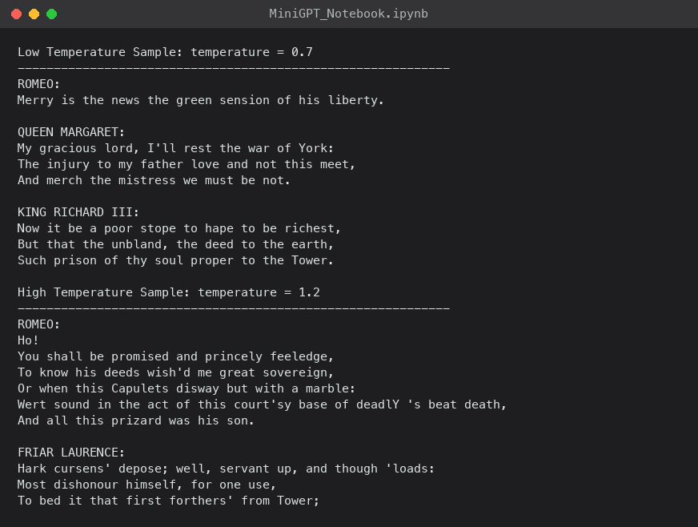

In [the first post](/posts/minigpt/), I took a trained MiniGPT apart while it was running: the letter and position cards, attention, the MLPs, and the 65 answer cards. Every number in it came from one model, my exhibit. This post answers the obvious next question: where did those numbers come from? Nobody typed them in. They were grown, and here I grow them again from scratch, on my Mac, and end up with exactly the same numbers.

One promise, the same as last time: no magic. Every number in this post is either worked out in front of you, or comes from a run on my own Mac Studio.

## Growing a GPT, in plain English

### Starting from nothing

A machine that knows nothing has an even wheel: every slice is the same size, 1 in 65. So what it writes is pure noise. I asked the untrained MiniGPT model from the notebook to carry on from `ROMEO:`, and this is what it wrote:

```
ROMEO:dHrNUBK.!oWffHGBTyysS:hvnRyuZtONMQhv,dAw$xBM.VQu.!nhulODzyrBM;sta'fy,dlAvIzRlwMl
```

Every letter in that line was a near-random spin. The untrained model's chances were all between about 1% and 3%, close to an even 1 in 65.

That is the whole secret of training. The machine is never taught a rule like "a capital letter starts a name" or "`q` is followed by `u`". Training only reshapes the wheel, one tiny nudge at a time, until the slices for letters that tend to come next in Shakespeare are bigger than the rest. Shape it well enough, and the spins start to look like writing.

### Keeping score: the surprise score

How do you tell a good forecaster from a bad one? You wait to see what the weather actually does, and then you look at the chance they gave it. A forecaster who said "90% chance of rain" on a day it rained did well. One who said "5% chance of rain" on a day it poured did badly. A good forecaster should not be surprised.

The machine is marked in exactly the same way. Once the real next letter is revealed, I look up the chance the machine gave *that one letter*, ignore all the others, and turn it into a **surprise score**: a number for how surprised the machine should be by what actually happened. A high chance gives a low surprise score, and a low chance gives a high one.

**How the surprise score is worked out: the halving rule.** The surprise score follows one simple rule:

- If the machine gave the right letter 100%, the surprise score is 0. It was certain, and it was right, so it is not surprised at all.
- Every time that chance is cut in half, add the same amount to the surprise score: 0.69.

So the surprise score climbs one step of 0.69 for every halving:

| Chance the machine gave the right letter | Halvings from 100% | Surprise score |
|---|---|---|
| 100% | 0 | 0 |
| 50% | 1 | 0.69 |
| 25% | 2 | 1.39 |
| 12.5% | 3 | 2.08 |
| 6.25% | 4 | 2.77 |
| 3.1% | 5 | 3.47 |
| 1.6% (1 in 64) | 6 | 4.16 |

Chances that fall between two rows get a surprise score between those two rows. Take my trained model's real chances after `good m`, as in *good my lord* or *good madam*: `y` 40.8%, `e` 26.9%, and `a` 15.2%.

- If the next letter turns out to be `y`, the machine gave it 40.8%. That is a little less than 50%, so the surprise score is a little more than one step: **0.90**.
- If it turns out to be `a`, the machine gave it only 15.2%. That falls between 25% and 12.5%, so the surprise score lands between 1.39 and 2.08: **1.88**. A bigger surprise.


*The halving rule drawn as a curve. Near 100% the surprise score barely moves; near 0% it shoots up*

Why add 0.69 for each halving, and not a round 1? There is no deep reason. Adding 1 for each halving would work just as well: every surprise score would come out about 1.44 times bigger, and the machine would learn exactly the same thing. The maths in the notebook happens to use 0.69, so I use it too, which means the surprise scores in this post match the numbers the notebook prints.

A score of 0 means the machine gave the right answer 100%: it was certain, and it was right. It cannot do better than that. In the other direction there is no limit: every further halving adds another 0.69, so give almost 0% to the letter that actually turns up, and the surprise score shoots up. That is how the game punishes a machine for being confidently wrong.

This one number is what the whole project is about. Training means making the machine's *average* surprise score, over millions of guesses, as small as possible.

A machine that knows nothing at all gives the same 1-in-65 chance to every letter. 1 in 65 is almost exactly 1 in 64, the bottom row of the table: six halvings from 100%. So whatever comes next, its surprise score is about 6 × 0.69, or 4.17 to be exact. That is almost exactly where MiniGPT started: 4.20 on its very first step.

:::under-the-hood Where the surprise numbers come from
The halving rule is exactly what a logarithm does. The surprise score is the natural logarithm of one over the chance, written ln(1 ÷ chance), and every scientific calculator has an `ln` button. The step of 0.69 is ln(2): the cost of one halving.

- A chance of 40.8%: ln(1 ÷ 0.408) = 0.90
- A chance of 15.2%: ln(1 ÷ 0.152) = 1.88
- A chance of 1 in 65: ln(65) = 4.17
- A chance of 100%: ln(1) = 0

To add 1 for each halving instead, swap ln for log₂, the logarithm that counts halvings directly. Then the blind guess scores log₂(65) = 6.02: just over the six halvings in the table.

Running the rule backwards gives the friendlier reading below. Raise *e* (about 2.718) to the power of the surprise score, and you get back the number of equally likely options the machine was choosing between: *e*⁴·¹⁷ is about 65, and *e*¹·⁴⁷ is about 4.3.
:::

:::watch-it
No real machine can get a surprise score of 0 on real text, however clever it is. After `good m`, the next letter really could be `y`, `e`, `a`, or comma, or an `s`. Even a perfect reader of Shakespeare has to spread its chances over the possibilities, so some surprise is built into the text itself. The aim is to get the surprise score as low as the text allows, not to reach 0.
:::

There is a friendlier way to read the surprise score. Turn it back into a sentence: "the machine was as unsure as if it were choosing between *N* equally likely letters". At the start, *N* is 65. After my small model had trained for 90 seconds, *N* was about 5.5. After the bigger model, it was about 4.3. That is the whole scoreboard for this project: from 65 down to 4.

### Climbing the ladder: four ways to shape the wheel

Before looking inside MiniGPT, it helps to see how far simpler machines get. Each rung of this ladder shapes the wheel using a little more of the text. I ran every rung on my Mac Studio, and scored each one on the same locked-away 10% of Shakespeare that none of them practised on.

**Rung 1: an even wheel.** Every letter gets the same 1-in-65 chance. Surprise score 4.17: as unsure as choosing between 65 letters.

```
g?rr$s!fywKSFdxH;Yty,qM,F$ZOg.r:DFM DnlCk,QT!N&Uss3pJtv-
```

**Rung 2: count how common each letter is.** No training at all. I counted every letter in the practice text and made each slice of the wheel as big as that letter's share. The space gets the biggest slice (15.3%), then `e` (8.5%), `t` (6.0%), and `o` (5.9%). Surprise score 3.35: as unsure as choosing between about 28 letters. The spins now give about the right mix of letters and spaces, but no words:

```
uooy
sbp ;cTIcdbota rMnufKthlnfmsnnretuUta
 vs  nae
hEyIlseraoignriS elsiik
```

**Rung 3: count pairs, so the wheel depends on the letter before.** Now there are 65 wheels, one for each letter that might have come just before. To build the wheel for "after `q`", I counted what followed every `q` in the practice text. There were 563 of them, and every single one was followed by a `u`. Surprise score 2.48: as unsure as choosing between about 12 letters. The spins now give speaker names, colons, and word-shaped chunks:

```
SH: lwh, s ts at a ary okm by myore an suche ns hur,
Ancayontouna ondevin: t prt igr abee moo dase use r chm boutome son thef anshye g orinomod
O:
DWhimilito mat? I mind!
```

**Rung 4: MiniGPT.** Instead of looking at just the one letter before, MiniGPT looks at *all* the letters before: up to 128 of them in the small model, and up to 256 in the bigger one. It works out which of those letters matter for the next guess, and how much. [The first post](/posts/minigpt/#the-five-steps) explains how it does that. My exhibit model scored 1.70, as unsure as choosing between about 5.5 letters, and the bigger model in the notebook scored 1.47, about 4.3. Here is the exhibit:

```
ROMEO:
Ay, what the blood stisficemed:
And not we to their all the eather of day age,
As why earthy see
```

| Rung | What it uses to shape the wheel | Surprise score | As unsure as choosing between |
|---|---|---|---|
| 1. Even wheel | nothing | 4.17 | 65 letters |
| 2. Letter counts | how common each letter is | 3.35 | 28 letters |
| 3. Pair counts | the one letter before | 2.48 | 12 letters |
| 4. My exhibit MiniGPT | up to 128 letters before | 1.70 | 5.5 letters |
| 4. Bigger MiniGPT | up to 256 letters before | 1.47 | 4.3 letters |

The jump from rung 3 to rung 4 comes entirely from looking further back than one letter. Everything in MiniGPT that rung 3 does not have, it has so that each letter can use more than the one letter before it.

**Is training just a fancy way of counting?** Rungs 2 and 3 were built by counting, with no training at all. So I tried building rung 3 the other way: I gave a machine one dial for every pair of letters, 65 × 65 of them, set them all to zero, and trained it with the guessing game. After 2.5 seconds it had shaped almost exactly the same wheels as the counting did. It scored 2.49 against the counting's 2.48, and after `q` it put 100% on `u`. So for one letter of memory, training simply rediscovers the counts. Counting stops working as soon as the machine looks further back. There are 65 × 65 = 4,225 possible pairs of letters, which 1 million letters of Shakespeare covers easily. But the number of possible rows of 128 letters is a number with 233 digits. Almost every row the machine will ever meet has never appeared in Shakespeare, so there is nothing to count. Training is what lets the machine make a sensible guess for a row it has never seen.

### A few hundred thousand dials

Everything above, meaning the cards, the recipes for queries, keys, and values, and the MLPs, comes down to numbers. I think of each number as a dial. The small model has 826,433 dials, and the bigger model has 10.77 million.

Training is a loop:

1. Grab 32 random snippets of Shakespeare, each 128 letters long: exactly enough to fill every position.
2. Play the guessing game at every position of every snippet: 32 × 128 = 4,096 guesses. Each guess uses *all* the letters before it in its snippet, so the guess at position 1 sees one letter and the guess at position 128 sees all 128. The answer to each guess is simply the snippet's next letter.
3. Work out the average surprise score.
4. For every one of the 826,433 dials, work out which way to turn it to make that surprise a little smaller, and turn it a tiny amount.
5. Repeat 3,000 times.

Step 4 sounds impossible, but there is a piece of maths that works backwards from the surprise score, through every calculation the machine made, and tells each dial which way to turn. The notebook does it with a single line of code. One way to picture it: imagine the surprise score as a hilly landscape, where your position is set by the 826,433 dials. Every training step feels which way is downhill from where it stands, and takes one small step that way. Nobody can draw a landscape with 826,433 directions, but the idea is the same as walking downhill in fog.

Each pass through that loop is one training *step*. On my Mac Studio's GPU, the notebook's 3,000 steps for the small model took 89 seconds.

To see what those steps do, I grew the exhibit model from [the first post](/posts/minigpt/) again, and stopped it five times along the way to write from the same prompt. Nothing changes between the frames except the numbers on the dials:


*From babbling to Shakespeare in one training run. After 100 steps it has found spaces and line breaks; after 1,000, short words and a speaker's name; after 3,000, lines that look like Shakespeare*

This is what I meant at the start by a model being *grown* rather than built. Nobody wrote anything into the dials between those frames. The guessing game did it.

### The payoff: growing the exhibit, exactly

Every number in [the first post](/posts/minigpt/) came from one trained model, my exhibit. Here is where they came from. The exhibit is exactly the training loop above: 3,000 steps of 32 snippets, with the notebook's settings. I ran it on my Mac's CPU rather than its GPU, with the random choices fixed in advance, because a CPU does its arithmetic in exactly the same order every time. That makes the whole run repeatable to the last digit: run it again, and you get the same machine. It takes about 6 minutes.

Here is one card, and one guess, growing:

| Training step | The back of the `g` card begins | Chance of `d` after `goo` |
|---|---|---|
| 0, all random | −0.048, 0.010, −0.012, −0.008, … | 2.0% |
| 100 | −0.044, 0.013, −0.002, 0.008, … | 3.8% |
| 300 | −0.043, 0.015, 0.000, 0.010, … | 3.4% |
| 1,000 | −0.034, 0.005, −0.021, 0.010, … | 39.5% |
| 3,000, finished | **−0.049, 0.032, 0.014, 0.030, …** | **96.6%** |

At step 0, the chance of `d` after `goo` is 2.0%, little better than a blind 1-in-65 guess. By step 3,000, it is the 96.6% from the first post's guessing game, and the `g` card is the one from its step 2. I checked the whole machine, not just these two examples: every one of the 826,433 numbers matches the exhibit exactly. Nobody typed any of them in. They grew.

### The student who memorised the textbook

Before training starts, the notebook locks away the last 10% of the Shakespeare text. The machine never practises on it. Every so often, it sits an exam on that locked-away text instead. If its practice scores keep improving while its exam scores get worse, it has started learning the textbook by heart instead of learning how to write. Part 3 shows exactly that happening, and the fix is simple: keep a copy of the machine whenever it sets a new best exam score, and use the best copy at the end.

### Expensive for computers, cheap for people

Notice who is missing from that learning loop: a teacher. The text marks its own homework. Every time the machine guesses, the answer is simply the next letter of Shakespeare, already sitting there on the page. Nobody has to write questions, check answers, or label anything. All it takes is a pile of text and a computer to grind through it.

The grinding is the expensive part, and it is the *learning* that takes the time, not the guessing. To train my small model, the notebook made 12.3 million practice guesses, checking each one and nudging the machine after every batch. That is enough to work through all 1 million letters of practice text about 12 times over, and it took 90 seconds on my Mac Studio's GPU. The bigger model made 82 million practice guesses, about 82 trips through the text, and took 47 minutes. Once a model is trained, writing one new letter is a single guess, which takes a tiny fraction of a second. The models behind today's chatbots play the same learning game on a large slice of the internet, on thousands of GPUs, for weeks or months. That bill is paid in electricity and hardware, not in people's time, which is why it can be scaled up so far. This first stage of learning is the "Pre-trained" in Generative Pre-trained Transformer.

A machine trained only this way is not a chatbot, though. It is a *document completer*: give it the start of any text, and it writes the most likely continuation. Ask it a question and it may simply carry on writing more questions, because carrying on the text is all it knows how to do. The simplest trick needs no extra training at all: start the text with a pretend conversation, a line beginning "User:" and then a line beginning "Assistant:", so that the most likely way to carry on is to write the assistant's reply. That works, after a fashion. Turning it into something you can properly chat with takes a second stage, and that stage needs people. They write example conversations showing how a helpful assistant should reply, and the machine is trained to copy them. That is the same guessing game, played on a much smaller pile of much more carefully chosen text.

Copying examples only goes so far, so there is usually a third and fourth stage, and they contain the cleverest trick in the whole process. People are shown two of the machine's answers to the same question and asked which is better. Their choices are used to train a second model, a *judge*, whose only job is to predict which answer people would prefer. Then the chatbot practises: it writes answers, the judge scores them, and the dials are nudged towards answers the judge scores highly. People compare thousands of answers, and the judge then scores millions, so it stretches their effort a very long way.


*The four stages from a document completer to an assistant. MiniGPT only does stage 1. The purple boxes are the shortcuts, where another model stands in for people*

Even so, the human work in stages 2 and 3 is slow and costly for every example. These stages use far less data than pre-training, but far more human effort.

There is a shortcut: let an existing chat model write the example conversations, and train the new model on its answers instead of on people's. This is called *distillation*. Microsoft trained its small Phi models largely on text written by OpenAI's models, and OpenAI has accused DeepSeek, so far without public proof, of doing something similar without permission. I wrote about both in [Distillation (Part 1)](/posts/distillation/). In [Distillation (Part 2)](/posts/distillation2/), I tried it myself: I turned a base model into a chat model using answers written by GPT-3.5 and by DeepSeek. Before that training, the base model showed exactly the problem above. It answered the question, then invented a new user turn and kept on going. Distillation does not really remove people from the process. It borrows the human effort that already went into the teacher model.

A different kind of distillation, where a small model learns from a bigger model's chances for whatever comes next during pre-training, is the subject of [MiniGPT (Part 6)](/posts/minigpt5/). MiniGPT itself stops at pre-training, so everything in this post is the cheap-for-people, expensive-for-computers half.


### The jargon decoder

Here are the comparisons for growing the machine, next to the names the notebook uses. The ones for the machine itself are in [the first post](/posts/minigpt/#the-jargon-decoder).

| What I called it | What the experts call it |
|---|---|
| learning from the text itself, with no people marking answers | *self-supervised* learning, or *pre-training* |
| people writing example conversations for the machine to copy | *supervised fine-tuning* (SFT) |
| people comparing answers, to train a judge | the *reward model* |
| practising against the judge | *reinforcement learning from human feedback* (RLHF), often using a method called *PPO* |
| letting another model do some of the comparing | *reinforcement learning from AI feedback* (RLAIF) |
| letting an existing model write the examples, or teach its chances | *distillation* |
| the surprise score | the *loss* (cross-entropy loss) |
| "as unsure as choosing between *N* letters" | *perplexity* |
| working out which way to turn every dial | *backpropagation* |
| the locked-away exam text | the *validation set* |
| memorising the textbook | *overfitting* |
| keeping the best copy | *checkpoint selection* |
| walking downhill on the surprise-score landscape | *gradient descent* |

## Opening the notebook

The setup is in [the first post](/posts/minigpt/#opening-the-notebook). Part 1 of the notebook builds the machine; Parts 2 and 3, below, grow it.

### Using the Mac's GPU

Running a trained model is quick on any CPU, but training is not, so before training I made one change to the notebook, so that it would use the Mac Studio's GPU. The original device line only checks for CUDA, NVIDIA's GPU platform, and it appears twice: once in the first code cell, and again at the top of section 3.3, "Stronger Hyperparameter Configuration":

```python
device = "cuda" if torch.cuda.is_available() else "cpu"
```

A Mac has no CUDA, so on Apple Silicon that line falls straight through to the CPU, which trains far more slowly than it needs to. I commented out the original line in both places and replaced it with a version that tries Metal Performance Shaders (MPS), Apple's GPU backend for PyTorch, before falling back to the CPU:

```python
device = (
    "cuda" if torch.cuda.is_available()
    else "mps" if torch.backends.mps.is_available()
    else "cpu"
)
```

:::watch-it
Changing only the first copy is not enough. The section 3.3 cell sets `device` again, so the main training run would quietly go back to the CPU, and nothing would warn you except a much longer wait.
:::

Those two lines were the only edits the notebook needed. The mixed-precision code later on already guards itself with `use_amp = device == "cuda"`. On `mps` that is `False`, so the `GradScaler` and `autocast` calls are switched off and training runs in full precision rather than raising an error. If any individual operation turns out not to be implemented for MPS yet, setting `PYTORCH_ENABLE_MPS_FALLBACK=1` before launching Jupyter lets PyTorch drop that one operation back to the CPU instead of stopping the run.

## Part 2. Implement the Training Pipeline

Part 2 loads the text, turns it into numbers, and trains the Part 1 model on it at baseline settings.

### 2.1 Load Tiny Shakespeare Dataset

MiniGPT trains on Tiny Shakespeare, the ~1 MB concatenation of Shakespeare's plays that Karpathy used for his original char-rnn examples. The notebook downloads the raw text, about 1.1 million letters.

### 2.2 Character-Level Tokenization

The notebook then builds a character-level tokeniser: every unique letter becomes one token, which gives a vocabulary of exactly 65 symbols. Two dictionaries map letters to integer IDs and back. There is no external tokeniser and nothing to train.

```python
chars = sorted(set(text))
vocab_size = len(chars)            # 65
stoi = {c: i for i, c in enumerate(chars)}
itos = {i: c for i, c in enumerate(chars)}
encode = lambda s: [stoi[c] for c in s]
decode = lambda ids: "".join(itos[i] for i in ids)
```

A note on words. In this model a *token* is exactly one letter, in the broad sense from [the first post](/posts/minigpt/#the-whole-thing-is-a-guessing-game). The tokeniser is nothing more than the lookup above: each of the 65 letters gets a number, so `E` is 17 and the space is 1. That is why "token", "token ID", and "the number standing for a letter" all mean the same thing here. [The second post in this series](/posts/minigpt2/) swaps this for a tokeniser where one token can be a whole word or a word fragment; everything downstream stays the same.

Character-level tokenisation keeps the preprocessing trivial to inspect. The cost, which the paper is careful to name, is that the model has to learn spelling, word boundaries, and punctuation from individual letters, and every sequence covers fewer words than a subword tokeniser would.

### 2.3 Convert Text to Token Tensor and Split into Train/Validation Sets

The whole text becomes one long tensor of token IDs. The first 90% is for training, and the last 10% is held back for validation: that is the locked-away exam text from the introduction.

```python
data = torch.tensor(encode(text), dtype=torch.long)
n = int(0.9 * len(data))
train_data, val_data = data[:n], data[n:]   # 90 / 10 split
```


*The notebook printed the vocabulary, the 65-letter token set, and the train/validation split*

### 2.5 Create Minibatches for Next-Token Prediction

Each training example is a fixed-length block of letters. The input is a window of `block_size` tokens; the target is the same window shifted one position to the right, so at every position the model predicts the next letter.

```python
def get_batch(split):
    d = train_data if split == "train" else val_data
    ix = torch.randint(len(d) - block_size, (batch_size,))
    x = torch.stack([d[i : i + block_size] for i in ix])
    y = torch.stack([d[i + 1 : i + block_size + 1] for i in ix])
    return x.to(device), y.to(device)
```

If the input is `goo`, the target is `ood`. That shift is the whole of autoregressive language modelling.

This is where the four lessons from [the first post's "Putting it together"](/posts/minigpt/#putting-it-together-choosing-the-next-letter) come from: every position in the window is checked against the letter that really came next.

### 2.9 Training Loop (baseline)

This is the dial-turning loop from the introduction: 3,000 steps of guess, measure the surprise, and nudge all 826,433 dials.

The first configuration is deliberately tiny, just enough to prove the training and validation loops work.

| Setting | Baseline |
|---|---|
| Layers / heads / embedding dim | 4 / 4 / 128 |
| Context length | 128 |
| Parameters | 826,433 |
| Batch size | 32 |
| Optimiser | AdamW, fixed learning rate 3 × 10⁻⁴ |
| Iterations | 3,000 |
| Checkpoint | final step |

Both losses, the surprise scores from the introduction, start near 4.20 — which is roughly `ln(65)`, exactly what you expect from a model guessing uniformly across 65 letters. They then fall steadily.


*The baseline training log — loss estimated on both splits every few hundred steps*

### 2.10 Plot Training and Validation Loss (baseline)


*My own reproduction of the paper's Figure 1: training and validation loss both falling to roughly 1.53 and 1.71 by step 3,000, with no clear overfitting*

By step 3,000 my run reached a training loss of **1.5306** and a validation loss of **1.7126** — a validation perplexity of about **5.54**, and very close to the paper's own 1.5304 / 1.7236. The paper's run took 50.79 seconds on a Colab A100; mine, on the Mac Studio's M1 Max GPU via MPS, took **89.35 seconds**. Nothing about the output is good Shakespeare yet, but every part of the pipeline is now known to work.

:::bullet-points Part 2
- Tiny Shakespeare has 65 distinct letters, so each letter is its own token.
- 90% of the text is for practice and 10% is the locked-away exam.
- Every snippet gives one lesson per position: `good` teaches what follows `g`, `go`, `goo`, and `good`.
- The surprise score starts near 4.2, which is pure guessing among 65 letters, and the baseline brings it down to about 1.7 in 90 seconds.
:::

## Part 3. Train on a Small Text Dataset (Tiny Shakespeare) & Evaluate Qualitatively

Part 3 keeps the same data and model code but trains a much larger configuration, keeps the best checkpoint, and judges the result by reading what it writes.

### 3.3 Stronger Hyperparameter Configuration

The second configuration is close to nanoGPT's small Shakespeare setup.

| Setting | Stronger |
|---|---|
| Layers / heads / embedding dim | 6 / 6 / 384 |
| Context length | 256 |
| Parameters | 10.77M |
| Batch size | 64 |
| Dropout | 0.2 |
| Optimiser | AdamW, betas (0.9, 0.99), weight decay 0.1 on 2‑D tensors only |
| Learning rate | 100 warmup steps to 10⁻³, cosine decay to 10⁻⁴ over 5,000 steps |
| Also | gradient clipping at 1.0, mixed precision on CUDA (full precision on MPS), weight tying |
| Checkpoint | best validation loss |

### 3.5 Create a stronger MiniGPT Model

In the stronger configuration the token embedding matrix and the output head share weights. With a vocabulary of 65 and an embedding dimension of 384 that tie saves 65 × 384 = 24,960 parameters, and weight tying is known to help language models in some settings.

### 3.6 AdamW with Better Parameter Groups

The notebook splits parameters into two groups — 38 decayed tensors (the weight matrices) and 63 non-decayed (biases and LayerNorm terms) — so weight decay only touches the matrices.

### 3.9 Training Loop with Best Checkpoint

Validation loss starts at 4.2879, matching the paper's number almost exactly, and drops fast. In the paper the best checkpoint arrives at step 1,750; on my run, same seed but different hardware and kernels, it arrived a little earlier, at **step 1,500**, with a validation loss of **1.4679** (training loss 1.1513, perplexity about **4.34**) — close to the paper's 1.4780 / 4.38. The paper reports 4.76 minutes for the full run on the A100; mine, on the M1 Max via MPS, took **46.98 minutes**. A capable laptop-class GPU still is not a datacenter GPU.

### 3.10 Plot Training Loss Curves

This is the student who memorised the textbook, from the introduction, caught in the act.


*My own reproduction of the paper's Figure 2: validation loss bottoms out at step 1,500 on this run (step 1,750 in the paper), then rises while training loss keeps falling — textbook overfitting*

What happens after step 1,500 is the most useful part of the experiment. Training loss keeps falling — down to 0.6097 by step 5,000, close to the paper's 0.6105 — but validation loss climbs back to 1.7095, no better than my own baseline's 1.7126. The model is memorising the training text rather than learning to generalise. The final step is not the best model. This is why the stronger configuration selects its checkpoint by lowest validation loss, and it is a lesson that scales all the way up.

### 3.12 Strong Generation Function

This is the six steps from [the first post's "Putting it together"](/posts/minigpt/#putting-it-together-choosing-the-next-letter), in code. The notebook's `generate_text` function uses the best stronger checkpoint with `max_new_tokens=800`, `temperature=0.8`, and `top_k=200`. Here it is, simplified, with my own comments:

```python
for _ in range(max_new_tokens):
    idx_cond = idx[:, -block_size:]                # the row of cards, at most block_size long
    logits = model(idx_cond)[:, -1, :]             # read only the last card
    logits = logits / temperature                  # temperature
    k = min(top_k, logits.size(-1))                # keep the k biggest slices of the wheel
    values, indices = torch.topk(logits, k=k)
    logits = torch.full_like(logits, float("-inf")).scatter(-1, indices, values)
    probs = torch.softmax(logits, dim=-1)          # 65 chances that add up to 100%
    next_id = torch.multinomial(probs, num_samples=1)   # spin the wheel
    idx = torch.cat([idx, next_id], dim=1)         # deal the new card onto the row
```

:::watch-it
`top_k=200` does nothing here. It is meant to keep only the 200 most likely letters, but there are only 65, so the `min` keeps all of them. Top-k matters for big models with tens of thousands of tokens, not for a 65-letter alphabet.
:::

### 3.13 Generate High-Quality Samples

Prompted with `ROMEO:`, my checkpoint produced this (shortened):

```
ROMEO:
And this true sluck of voices, and kills thee
To all the sun of the city the People:
Your blood standing am I am about to have.

JULIET:
These grapes of you, noble like my brother did not
To give the butcher of the noble gentleman: if you live
But be his mind own so time, if he receive your brother's death.

ROMEO:
Ay, if with him, he conceal'd me.
```

It is not coherent, but the shape is unmistakable: speaker names in capitals, colons, line breaks, verse-like line lengths, plausible Shakespearean vocabulary. A character-level model with no notion of a "word" has picked all of that up from 1 MB of text in well under an hour.


*I generated 800 letters from the "ROMEO:" prompt using the best checkpoint*

### 3.15 Effect of Temperature

Temperature is the setting from [the first post's step 5](/posts/minigpt/#step-5-spin-the-wheel), and it changes the feel of the output. The paper reports that at 0.7 the samples are steadier and more readable but repeat themselves; at 1.2 they are more varied but full of broken spellings and invented names. I saw the same thing.


*The same prompt at temperature 0.7 and 1.2 — stability against variety*

I tried it on my own small model too, at three settings. At 0, the machine does not spin the wheel at all: it always picks the biggest slice. That is temperature turned all the way down, and the result is exactly the "flat" text it predicts:

```
ROMEO:
I will the shall be the shall be the shall be the see of the
shall be the shall be the sent of the sent of the seal.
```

At 0.8, the setting the notebook uses, the text varies but keeps its shape:

```
ROMEO:
You dare sold and the god; fellowerming and my lord,
And 'two charge be it most no the lue with bese.

KING HENRY VI:
It done the great the mounts are undeman.
```

At 1.5, the thin slices of the wheel have grown so much that invented words and broken names take over:

```
ROMEO:
Yie dare sole and yout we;
Iere! Inmitaid. My Unmore;
Know what's prelduchamountrium fly eleMard,
MENENund mSral:
```

:::bullet-points Part 3
- The stronger model is the same code with bigger numbers: 6 blocks, 6 heads, 384 numbers per letter, and a 256-letter window.
- Its exam score was best at step 1,500, and got worse after that while its practice score kept improving.
- Keeping the best copy, not the last one, is what stops the model shipping as a memoriser.
- Temperature trades tidy, repetitive text for varied text full of invented words.
:::

:::brain-power
My best model writes text that looks like Shakespeare and says nothing at all. Suppose a much bigger model wrote *perfect* Shakespeare: every line metrically correct, every word real. Would it be useful? What would you want it to do that the guessing game, on its own, does not teach it?
:::

## What I took from it

Running MiniGPT end to end took under an hour on my own machine and cost nothing. A few things stuck with me:

- **The pieces are small.** Causal attention is a matrix multiply, a mask, a softmax, and another matrix multiply. The block is two residual adds. The training objective is a shifted copy and a cross-entropy. Seeing them written out plainly, with no distributed-training machinery around them, made the architecture feel much less mysterious.
- **Overfitting is not an edge case.** The stronger model's best validation loss arrived at step 1,500 out of 5,000 on my run (step 1,750 in the paper). Without validation-based checkpoint selection the notebook would have shipped a worse model that scored well on its own training text.
- **Character-level is a genuine trade-off.** It removes the tokeniser entirely, which is great for a teaching notebook, but a 256-character context is only a few dozen words, and the model pays for it in long-range coherence.
- **Scale is doing the heavy lifting elsewhere.** MiniGPT is honest that it is a reproducibility study, not a competitive model. The same training idea, with far more data, compute, and parameters, is what produces the models I use every day.

To get a feel for "far more", here is my small model next to GPT-3, the 2020 model whose family the first ChatGPT grew out of, using the figures from its paper:

| | My small MiniGPT | GPT-3 (2020) | How much bigger |
|---|---|---|---|
| Dials | 826,433 | 175 billion | about 200,000 times |
| Practice text | 1 million letters | about 300 billion pieces of words, roughly 1.2 trillion letters | about 1 million times |
| Blocks | 4 | 96 | 24 times |
| Numbers on each card | 128 | 12,288 | 96 times |

If all of Tiny Shakespeare were one book on a shelf, GPT-3's practice text would fill a shelf tens of kilometres long. And the models behind today's chatbots are bigger again, though most companies no longer publish their sizes.

The value of a paper like this is not a benchmark number. It is that the path from raw text to generated samples is now something I have run rather than something I have read about.

## Try it yourself

- The notebook: [github.com/jibin10/MiniGPT](https://github.com/jibin10/MiniGPT)

## References

- [MiniGPT: Rebuilding GPT from First Principles — Jibin Joseph, 2026](https://arxiv.org/abs/2605.17398)
- [nanoGPT — Andrej Karpathy](https://github.com/karpathy/nanoGPT)
- [minGPT — Andrej Karpathy](https://github.com/karpathy/minGPT)
- [char-rnn and the Tiny Shakespeare dataset — Andrej Karpathy](https://github.com/karpathy/char-rnn)
- [Let's build GPT: from scratch, in code, spelled out — Andrej Karpathy](https://www.youtube.com/watch?v=kCc8FmEb1nY)
- [Attention in transformers, visually explained — 3Blue1Brown](https://www.3blue1brown.com/lessons/attention)
- [Visualizing transformers and attention — Grant Sanderson, TNG Big Tech Day 2024](https://www.youtube.com/watch?v=KJtZARuO3JY)
- [What Is ChatGPT Doing … and Why Does It Work? — Stephen Wolfram, 2023](https://writings.stephenwolfram.com/2023/02/what-is-chatgpt-doing-and-why-does-it-work/)
- [The Illustrated GPT-2 — Jay Alammar](https://jalammar.github.io/illustrated-gpt2/)
- [MicroGPT Visualized — James Tauber](https://microgpt.jtauber.com/)
- [Transformer Explainer — Georgia Tech Polo Club](https://poloclub.github.io/transformer-explainer/)
- [LLM Visualization — Brendan Bycroft](https://bbycroft.net/llm)
- [Generative AI exists because of the transformer — Financial Times, 2023](https://ig.ft.com/generative-ai/)
- [Attention Is All You Need — Vaswani et al., 2017](https://arxiv.org/abs/1706.03762)
- [Scaling Laws for Neural Language Models — Kaplan et al., 2020](https://arxiv.org/abs/2001.08361)
- [The Curious Case of Neural Text Degeneration — Holtzman et al., 2020](https://arxiv.org/abs/1904.09751)
