I spend most of my time using language models, not building them. So when I found the paper [MiniGPT: Rebuilding GPT from First Principles](https://arxiv.org/pdf/2605.17398) by Jibin Joseph, I wanted to run it myself. MiniGPT is a single Jupyter notebook that reconstructs the whole GPT training pipeline — tokenisation, embeddings, causal self-attention, Transformer blocks, next-token training, validation tracking, checkpoint selection, and text generation — in plain PyTorch. It does not introduce a new architecture. It makes an existing one legible.

The paper is explicit about its lineage: the author studied Andrej Karpathy's [nanoGPT](https://github.com/karpathy/nanoGPT) and then wrote the model and training code independently in one notebook. That matched how I like to learn a system, so I worked through it top to bottom — but instead of the README's recommended Colab path, I ran it locally on my 2022 Mac Studio (Apple M1 Max, 64 GB RAM).

## Opening the notebook

The repository is [github.com/jibin10/MiniGPT](https://github.com/jibin10/MiniGPT). The README's recommended path is Colab: click the "Open in Colab" badge, select a GPU runtime, and run the cells top to bottom. The notebook is designed to work that way with no local setup at all, but the only dependencies are `torch`, `matplotlib`, and `requests`, so running it on my own hardware was just as easy:

```bash
git clone https://github.com/jibin10/MiniGPT.git
cd MiniGPT
python3 -m venv .venv
source .venv/bin/activate
pip install -r requirements.txt jupyter
jupyter notebook MiniGPT_Notebook.ipynb
```

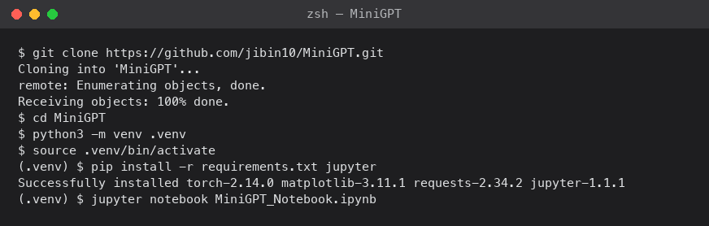
*I cloned the repository and installed the three dependencies plus Jupyter into a fresh virtual environment*

The notebook's device selection only checks for CUDA:

```python
device = "cuda" if torch.cuda.is_available() else "cpu"
```

On Apple Silicon that falls straight through to the CPU, which trains far more slowly than it needs to. I changed it to try Metal Performance Shaders first:

```python
device = (
    "cuda" if torch.cuda.is_available()
    else "mps" if torch.backends.mps.is_available()
    else "cpu"
)
```

That was the only edit the notebook needed. The mixed-precision code later on already guards itself with `use_amp = device == "cuda"`, so on `mps` it just runs in full precision rather than raising an error. If any individual operation turns out not to be implemented for MPS yet, setting `PYTORCH_ENABLE_MPS_FALLBACK=1` before launching Jupyter lets PyTorch drop that one operation back to the CPU instead of stopping the run.

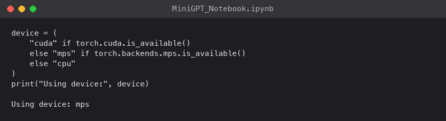
*The notebook reported `mps` as the selected device, confirming it would use the Mac Studio's GPU rather than the CPU*

## The dataset

MiniGPT trains on Tiny Shakespeare, the ~1 MB concatenation of Shakespeare's plays that Karpathy used for his original char-rnn examples. The notebook downloads the raw text, then builds a character-level tokeniser: every unique character becomes one token, which gives a vocabulary of exactly 65 symbols. Two dictionaries map characters to integer IDs and back. There is no external tokeniser and nothing to train.

```python
chars = sorted(set(text))
vocab_size = len(chars)            # 65
stoi = {c: i for i, c in enumerate(chars)}
itos = {i: c for i, c in enumerate(chars)}
encode = lambda s: [stoi[c] for c in s]
decode = lambda ids: "".join(itos[i] for i in ids)

data = torch.tensor(encode(text), dtype=torch.long)
n = int(0.9 * len(data))
train_data, val_data = data[:n], data[n:]   # 90 / 10 split
```

Character-level tokenisation keeps the preprocessing trivial to inspect. The cost, which the paper is careful to name, is that the model has to learn spelling, word boundaries, and punctuation from individual characters, and every sequence covers fewer words than a subword tokeniser would.

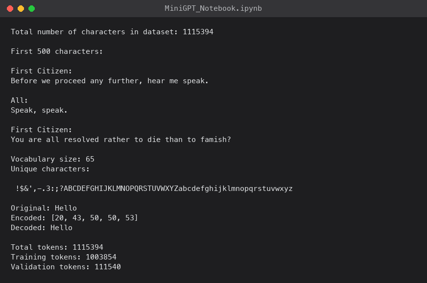
*The notebook printed the vocabulary, the 65-character token set, and the train/validation split*

## Batches

Each training example is a fixed-length block of characters. The input is a window of `block_size` tokens; the target is the same window shifted one position to the right, so at every position the model predicts the next character.

```python
def get_batch(split):
    d = train_data if split == "train" else val_data
    ix = torch.randint(len(d) - block_size, (batch_size,))
    x = torch.stack([d[i : i + block_size] for i in ix])
    y = torch.stack([d[i + 1 : i + block_size + 1] for i in ix])
    return x.to(device), y.to(device)
```

If the input is `hell`, the target is `ello`. That shift is the whole of autoregressive language modelling.

## What goes in, what comes out

Back in [Machine Learning (Part 9)](/posts/machinelearning9/) I trained a small network on MNIST. It took the 784 pixel values of a handwritten digit, ran them through two dense layers, and produced 10 numbers — one score per digit. To read off the answer you take the biggest: score 7 is highest, the digit is a 7.

MiniGPT is the same kind of machine with two differences. The input is a run of characters rather than an image — each character is turned into an integer ID, the way each pixel was a number. And the output is not one set of scores but one set at *every position*: given `hell`, the model produces a 65-number score vector after `h`, another after `he`, another after `hel`, and another after `hell` — each one its guess at the character that comes next.

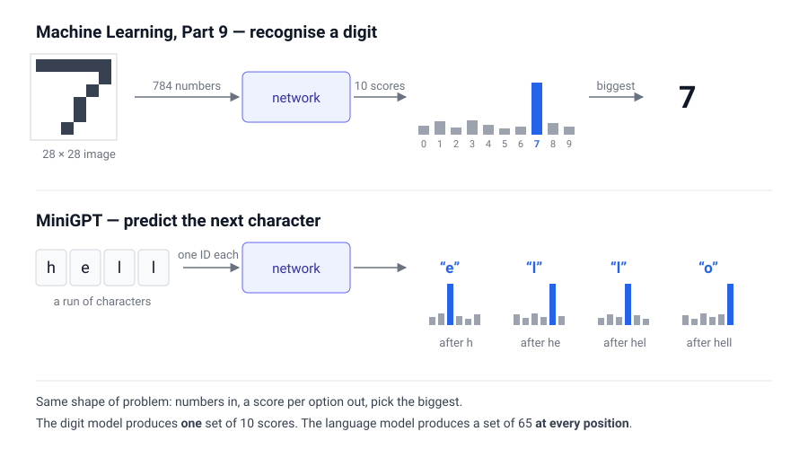
*The digit model makes one prediction from one image; the language model makes a prediction at every position in the sequence at once*

That is why one four-character example gives four training signals. The notebook takes the whole batch of score vectors, lines them up against the shifted targets from the previous section — `hell` should predict `ello` — and nudges the score of each correct next character upward. At generation time only the last position matters: predict the next character, append it, feed the longer string back in, repeat.

## The architecture, one piece at a time

Between the token IDs going in and the scores coming out is the standard decoder-only stack: an embedding layer, a pile of identical Transformer blocks, a final normalisation, and a linear layer that produces the scores.

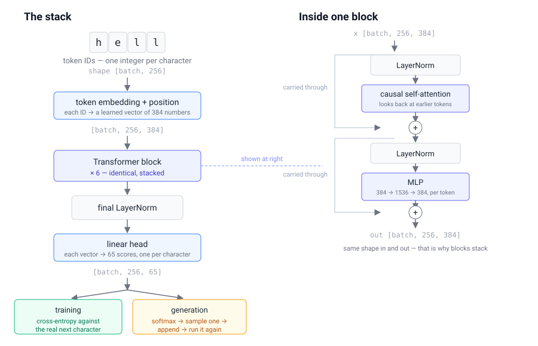
*The pipeline on the left; one Transformer block opened up on the right. Every block takes a `[batch, 256, 384]` tensor and returns one the same shape, which is why they stack*

**Embeddings.** A token embedding table turns each of the 65 IDs into a learned vector. A separate learned positional embedding is added so the model can tell where each token sits in the window — self-attention on its own has no sense of order.

**Causal self-attention.** This is the part that lets each position use the ones before it. For every token the model computes query, key, and value vectors, splits them across several heads, and computes scaled dot-product attention — a weighted average of the earlier tokens' value vectors, where the weights come from how well each earlier token's key matches this token's query. Because the model is autoregressive, a lower-triangular mask sets every future position to `-∞` before the softmax, so a token can only attend to itself and the tokens before it.

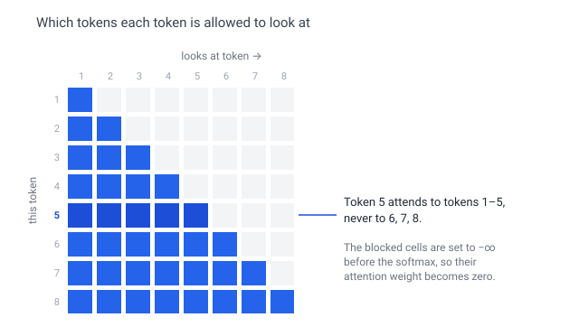
*The mask, drawn out for eight tokens. Each row is a token; the filled cells are what it may attend to*

```python
att = (q @ k.transpose(-2, -1)) / math.sqrt(head_dim)
att = att.masked_fill(mask[:T, :T] == 0, float("-inf"))
att = F.softmax(att, dim=-1)
out = att @ v
```

**Transformer block.** Each block is attention and a feed-forward MLP, each wrapped in a residual connection, with layer normalisation applied *before* each sub-module — the pre-LayerNorm arrangement that tends to train more stably as depth grows:

```python
x = x + self.attn(self.ln1(x))
x = x + self.mlp(self.ln2(x))
```

**MLP.** `Linear(d, 4d) → GELU → Linear(4d, d) → Dropout`. The four-times expansion is the usual Transformer ratio; dropout matters here because Tiny Shakespeare is small enough to overfit quickly.

**Head and loss.** After a final LayerNorm, a linear head maps each hidden state to 65 logits. When targets are supplied, the notebook flattens the logits to `(B·T, V)` and the targets to `(B·T)` and takes the cross-entropy — one next-character prediction for every position in every sequence.

In the larger configuration the token embedding matrix and the output head share weights. With a vocabulary of 65 and an embedding dimension of 384 that tie saves 65 × 384 = 24,960 parameters, and weight tying is known to help language models in some settings.

## Baseline run — verifying the pipeline

The first configuration is deliberately tiny, just enough to prove the training and validation loops work.

| Setting | Baseline |
|---|---|
| Layers / heads / embedding dim | 4 / 4 / 128 |
| Context length | 128 |
| Parameters | 826,433 |
| Batch size | 32 |
| Optimiser | AdamW, fixed learning rate 3 × 10⁻⁴ |
| Iterations | 3,000 |
| Checkpoint | final step |

Both losses start near 4.20 — which is roughly `ln(65)`, exactly what you expect from a model guessing uniformly across 65 characters. They then fall steadily.

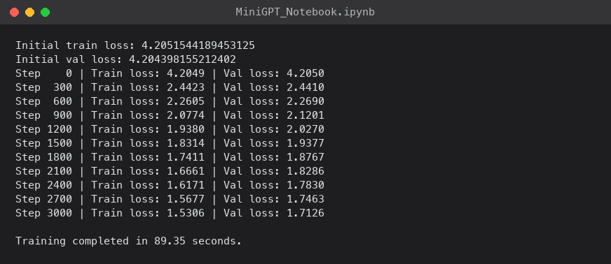
*The baseline training log — loss estimated on both splits every few hundred steps*

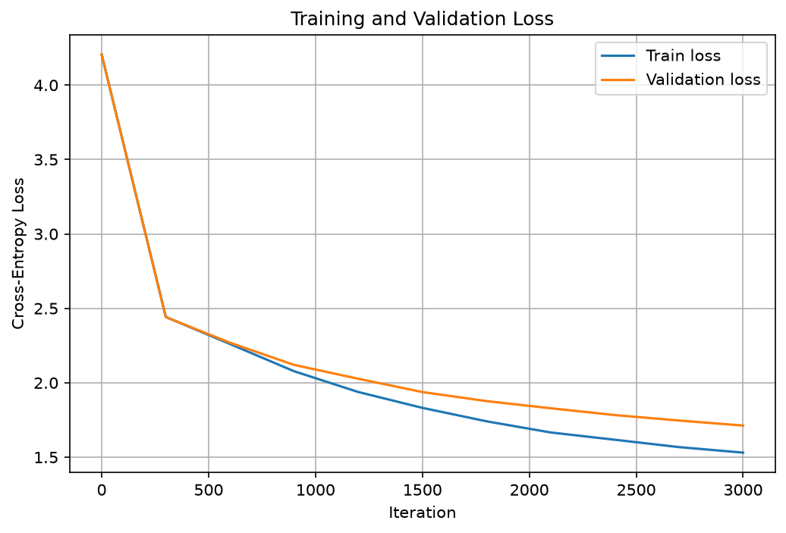
*My own reproduction of the paper's Figure 1: training and validation loss both falling to roughly 1.53 and 1.71 by step 3,000, with no clear overfitting*

By step 3,000 my run reached a training loss of **1.5306** and a validation loss of **1.7126** — a validation perplexity of about **5.54**, and very close to the paper's own 1.5304 / 1.7236. The paper's run took 50.79 seconds on a Colab A100; mine, on the Mac Studio's M1 Max GPU via MPS, took **89.35 seconds**. Nothing about the output is good Shakespeare yet, but every part of the pipeline is now known to work.

## Stronger run — capacity, schedule, and checkpoint selection

The second configuration is close to nanoGPT's small Shakespeare setup.

| Setting | Stronger |
|---|---|
| Layers / heads / embedding dim | 6 / 6 / 384 |
| Context length | 256 |
| Parameters | 10.77M |
| Batch size | 64 |
| Dropout | 0.2 |
| Optimiser | AdamW, betas (0.9, 0.99), weight decay 0.1 on 2‑D tensors only |
| Learning rate | 100 warmup steps to 10⁻³, cosine decay to 10⁻⁴ over 5,000 steps |
| Also | gradient clipping at 1.0, mixed precision on CUDA (full precision on MPS), weight tying |
| Checkpoint | best validation loss |

The notebook splits parameters into two groups — 38 decayed tensors (the weight matrices) and 63 non-decayed (biases and LayerNorm terms) — so weight decay only touches the matrices.

Validation loss starts at 4.2879, matching the paper's number almost exactly, and drops fast. In the paper the best checkpoint arrives at step 1,750; on my run, same seed but different hardware and kernels, it arrived a little earlier, at **step 1,500**, with a validation loss of **1.4679** (training loss 1.1513, perplexity about **4.34**) — close to the paper's 1.4780 / 4.38. The paper reports 4.76 minutes for the full run on the A100; mine, on the M1 Max via MPS, took **46.98 minutes**. A capable laptop-class GPU still is not a datacenter GPU.

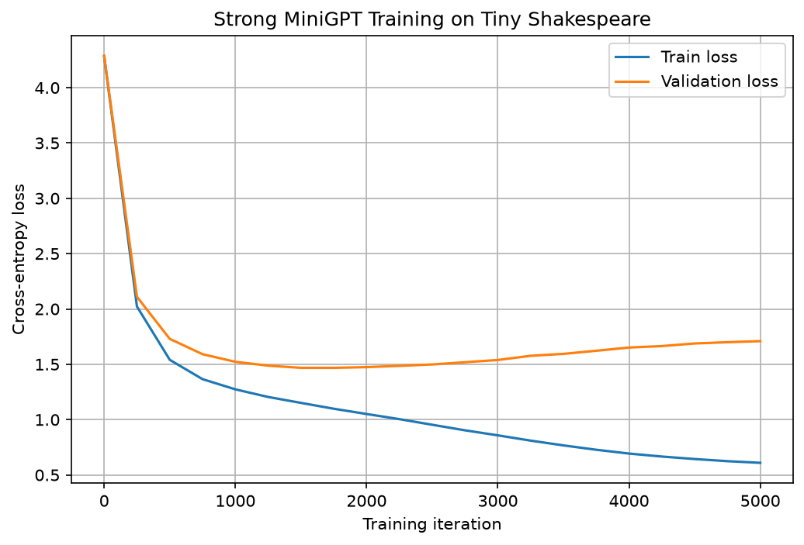
*My own reproduction of the paper's Figure 2: validation loss bottoms out at step 1,500 on this run (step 1,750 in the paper), then rises while training loss keeps falling — textbook overfitting*

What happens after step 1,500 is the most useful part of the experiment. Training loss keeps falling — down to 0.6097 by step 5,000, close to the paper's 0.6105 — but validation loss climbs back to 1.7095, no better than my own baseline's 1.7126. The model is memorising the training text rather than learning to generalise. The final step is not the best model. This is why the stronger configuration selects its checkpoint by lowest validation loss, and it is a lesson that scales all the way up.

## Generating text

Generation is autoregressive: feed in a prompt, predict the next character, sample from the distribution, append it, repeat. The notebook uses the best stronger checkpoint with `max_new_tokens=800`, `temperature=0.8`, and `top_k=200`.

```python
@torch.no_grad()
def generate(idx, max_new_tokens, temperature=0.8, top_k=200):
    for _ in range(max_new_tokens):
        idx_cond = idx[:, -block_size:]
        logits = model(idx_cond)[:, -1, :] / temperature
        v, _ = torch.topk(logits, top_k)
        logits[logits < v[:, [-1]]] = float("-inf")
        probs = F.softmax(logits, dim=-1)
        idx = torch.cat([idx, torch.multinomial(probs, 1)], dim=1)
    return idx
```

Prompted with `ROMEO:`, my checkpoint produced this (shortened):

```
ROMEO:
And this true sluck of voices, and kills thee
To all the sun of the city the People:
Your blood standing am I am about to have.

JULIET:
These grapes of you, noble like my brother did not
To give the butcher of the noble gentleman: if you live
But be his mind own so time, if he receive your brother's death.

ROMEO:
Ay, if with him, he conceal'd me.
```

It is not coherent, but the shape is unmistakable: speaker names in capitals, colons, line breaks, verse-like line lengths, plausible Shakespearean vocabulary. A character-level model with no notion of a "word" has picked all of that up from 1 MB of text in well under an hour.

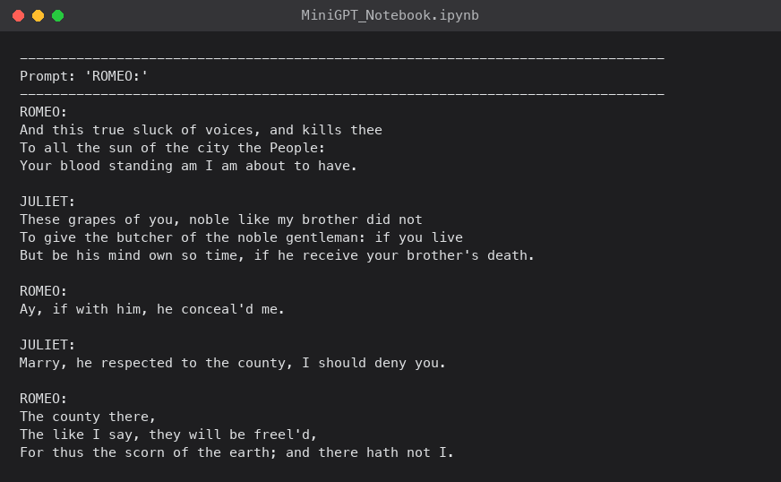
*I generated 800 characters from the "ROMEO:" prompt using the best checkpoint*

Temperature changes the character of the output. The paper reports that at 0.7 the samples are steadier and more readable but repeat themselves; at 1.2 they are more varied but full of broken spellings and invented names. I saw the same thing.

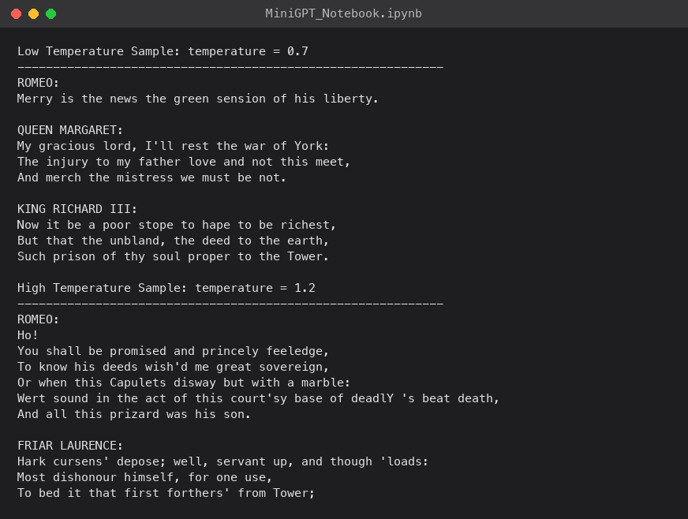
*The same prompt at temperature 0.7 and 1.2 — stability against variety*

## What I took from it

Running MiniGPT end to end took under an hour on my own machine and cost nothing. A few things stuck with me:

- **The pieces are small.** Causal attention is a matrix multiply, a mask, a softmax, and another matrix multiply. The block is two residual adds. The training objective is a shifted copy and a cross-entropy. Seeing them written out plainly, with no distributed-training machinery around them, made the architecture feel much less mysterious.
- **Overfitting is not an edge case.** The stronger model's best validation loss arrived at step 1,500 out of 5,000 on my run (step 1,750 in the paper). Without validation-based checkpoint selection the notebook would have shipped a worse model that scored well on its own training text.
- **Character-level is a genuine trade-off.** It removes the tokeniser entirely, which is great for a teaching notebook, but a 256-character context is only a few dozen words, and the model pays for it in long-range coherence.
- **Scale is doing the heavy lifting elsewhere.** MiniGPT is honest that it is a reproducibility study, not a competitive model. The same training idea, with far more data, compute, and parameters, is what produces the models I use every day.

The value of a paper like this is not a benchmark number. It is that the path from raw text to generated samples is now something I have run rather than something I have read about.

## Try it yourself

- The paper: [MiniGPT: Rebuilding GPT from First Principles](https://arxiv.org/pdf/2605.17398) (arXiv:2605.17398)
- The notebook: [github.com/jibin10/MiniGPT](https://github.com/jibin10/MiniGPT) — open `MiniGPT_Notebook.ipynb` in Colab and choose a GPU runtime, or clone it and run it locally. On Apple Silicon, add an `mps` branch to the device-selection line before you start; on any other machine, a CUDA GPU or the CPU works as written

The thumbnail for this post adapts the [LLM logo](https://commons.wikimedia.org/wiki/File:LLM-logo.svg) by Conan, from Wikimedia Commons, licensed [CC BY-SA 4.0](https://creativecommons.org/licenses/by-sa/4.0/). I recoloured, cropped, and rescaled it for the thumbnail.

## References

- [MiniGPT: Rebuilding GPT from First Principles — Jibin Joseph, 2026](https://arxiv.org/abs/2605.17398)
- [nanoGPT — Andrej Karpathy](https://github.com/karpathy/nanoGPT)
- [minGPT — Andrej Karpathy](https://github.com/karpathy/minGPT)
- [char-rnn and the Tiny Shakespeare dataset — Andrej Karpathy](https://github.com/karpathy/char-rnn)
- [Attention Is All You Need — Vaswani et al., 2017](https://arxiv.org/abs/1706.03762)
- [Scaling Laws for Neural Language Models — Kaplan et al., 2020](https://arxiv.org/abs/2001.08361)
- [The Curious Case of Neural Text Degeneration — Holtzman et al., 2020](https://arxiv.org/abs/1904.09751)
