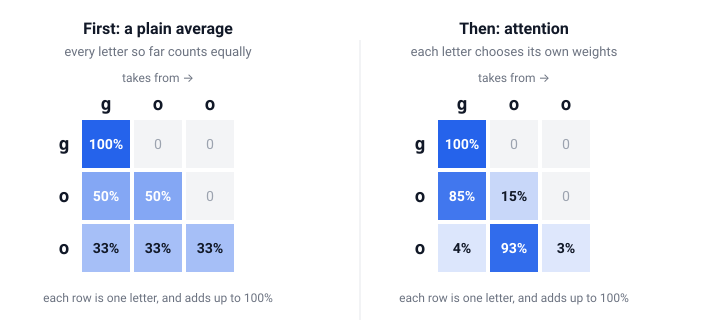
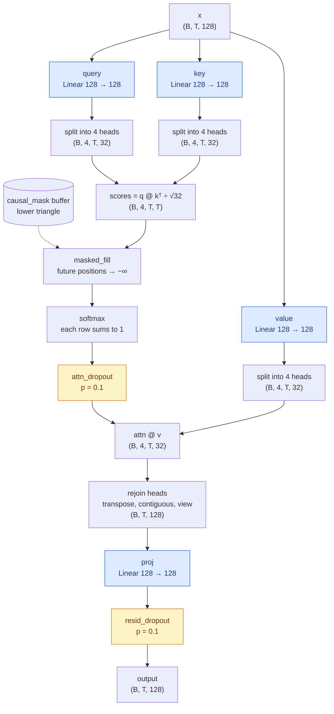
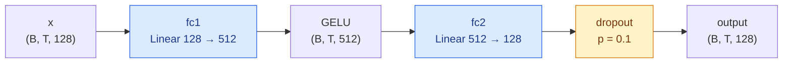

I spend most of my time using language models, not building them. And "building" is not really the right word: nobody writes a language model's knowledge in by hand. It is grown, by training, and I want to understand that process better, and to be able to explain it. So when I found the paper [MiniGPT: Rebuilding GPT from First Principles](https://arxiv.org/pdf/2605.17398) by Jibin Joseph, I wanted to run it myself. MiniGPT is a single Jupyter notebook that reconstructs the whole GPT training pipeline — tokenisation, embeddings, causal self-attention, Transformer blocks, next-token training, validation tracking, checkpoint selection, and text generation — in plain PyTorch. It does not introduce a new architecture. It makes an existing one legible.

The paper is explicit about its lineage: the author studied Andrej Karpathy's [nanoGPT](https://github.com/karpathy/nanoGPT) and then wrote the model and training code independently in one notebook. That matched how I like to learn a system, so I worked through it top to bottom — but instead of the README's recommended Colab path, I ran it locally on my 2022 Mac Studio (Apple M1 Max, 64 GB RAM).

This post takes a finished, trained machine apart while it runs. I trained a small MiniGPT model on my Mac, and every number in this post comes from that one model, my exhibit. How a machine like this gets its numbers in the first place, from nothing, is the subject of [the next post](/posts/minigpt-grown/), and there I grow this exact model again from scratch.

First comes the whole idea in plain English, with no code: a guessing game, a supply of letter flashcards, a set of numbered position cards that records where each letter is, a meeting with one strict rule, and a spinning wheel of chances. Then we work through Part 1 of the notebook, which builds the machine, cell by cell, and each time a technical term turns up, we use one of those everyday comparisons to explain it. One promise: no magic. Every number in this post is either worked out in front of you, or comes from a run on my own Mac Studio.

Here is the route:

1. **[The guessing game](#the-whole-thing-is-a-guessing-game)**: what a GPT actually does, how it [gives every letter a chance](#it-does-not-pick-a-letter-it-gives-every-letter-a-chance), and how it spins a wheel of chances to choose one.
2. **[The five steps](#the-five-steps)** the machine takes for every letter it writes: [letters to numbers](#step-1-letters-to-numbers), [letter cards and position cards](#step-2-letter-cards-and-position-cards), [the blocks](#step-3-the-blocks), [chances](#step-4-chances), and [spinning the wheel](#step-5-spin-the-wheel).
3. **Inside the blocks**: [the meeting](#inside-a-block-the-meeting), [queries, keys, and values](#queries-keys-and-values-with-real-numbers), [several meetings at once](#several-meetings-at-once-heads), [desk time](#then-everyone-goes-back-to-their-desk), and [why there are four blocks](#four-blocks-in-a-row).
4. **[How much can it see at once?](#how-much-can-it-see-at-once-the-context-limit)**: the context limit, and why raising it is expensive.
5. **[Try it](#try-it-my-trained-machine-running-in-your-browser)**: the trained machine, running live in your browser.
6. **[Beyond the guessing game](#beyond-the-guessing-game-tools-harnesses-and-agents)**: how tools, harnesses, and agents let a model do more than write.
7. **Loose ends**: [why the big models do not use letters](#why-the-big-models-do-not-use-letters), and [what nobody knows](#we-know-the-rules-not-the-result) about what the machine has learned.
8. **[The notebook, cell by cell](#opening-the-notebook)**: [Part 1](#part-1-implement-a-minimal-gpt-model) of the notebook, which builds the machine.

## The big picture, in plain English

Before any code, here is the whole idea with no jargon at all. Every comparison in this section will help explain the notebook when we get to it. It is the same machine, described through everyday comparisons, and the official names are saved for a decoder table at the end of the section.

### The whole thing is a guessing game

:::brain-power
Guess the next letter:

> KING RICHARD III: A horse! a horse! my kingdom for a hors_
:::

You said `e`, and you did not have to think about it, because you have read a lot of English. A GPT (short for Generative Pre-trained Transformer) is a machine that plays exactly this game. Given some text, it guesses what comes next. Big models like the ones behind ChatGPT guess the next word, or the next piece of a word. The small model in this post guesses one letter at a time. By "letter" I mean any of the symbols in Shakespeare's text, including the space, the new line, and punctuation marks such as the comma. Either way, guessing what comes next is the only thing it ever does.

So what does my trained model say after `hors`? It gives `e` 74.1%, by far its favourite. It agrees with you. You can try the line yourself in [the live demo](#try-it-my-trained-machine-running-in-your-browser).

:::brain-power
Big models guess words, or pieces of words. MiniGPT guesses one letter at a time, which seems simpler and more natural. So why do the big models not use letters too? Keep the question in mind. I come back to it near the end of this introduction.
:::

- **Writing** is the game played on repeat: guess a letter, write it down, stick it on the end, and guess again. Every line of "Shakespeare" this machine writes is produced one letter at a time, like that.
- **Learning** is the game too: guess, check the real answer, adjust, millions of times over. That is how the machine got good at the game, and it is the subject of [the next post](/posts/minigpt-grown/).


*The guessing game, played three times in a row by my trained model, with its real chances. Each time, it gives every possible next letter a chance, picks one, and adds it to the end*

That is the whole idea. Everything else in this post is detail about how the guessing is done.

### It does not pick a letter. It gives every letter a chance

The machine never says "the answer is `w`". It behaves like a weather forecaster. A forecaster does not say "it will rain tomorrow". They say "70% chance of rain". The machine does the same thing for every one of the 65 different letters that appear in Shakespeare: the capitals, the lowercase letters, the space, the new line, and a handful of punctuation marks. After `go`, my trained model says this:

| Next letter | Chance |
|---|---|
| `o` | 34.8% |
| space | 15.6% |
| `d` | 15.4% |
| `n` | 5.7% |
| everything else | 28.5% |

It is not sure yet. The word could become *good*, *go*, *God*, *gone*, and plenty more, so the chances are spread out. One more letter changes everything: after `goo`, it gives `d` 96.6%.

The chances always add up to 100%, because one of the 65 letters has to come next.

### So how does it choose what to write? It spins a wheel

Giving chances is not the same as choosing. When the machine writes, it turns its chances into a choice by spinning a wheel, like a prize wheel at a fair. The wheel has 65 slices, one for each letter, and each slice is as big as that letter's chance. After `go`, the `o` slice covers 34.8% of the wheel, the space 15.6%, the `d` 15.4%, and so on. The machine spins the wheel and writes down whatever letter stops under the pointer.


*The real wheel after `go`. The same text gives the same wheel every time, but each spin can land somewhere different*

Often the wheel lands on `o`. Sometimes it lands on a space. Now and then it lands on one of the thin grey slices, and that is what keeps the machine's writing from being the same every time.

The wheel is not fixed like the cards. The machine works out a brand new wheel for every letter it writes, because every new letter changes the chances. After `goo`, the `d` slice takes up 96.6% of the wheel.

A machine with random numbers on its dials has slices that are all about the same size, so all it can write is noise. How the dials get the numbers that make some slices big and others thin is the subject of [the next post](/posts/minigpt-grown/).

:::pencil Be the model
Here is another line with its end hidden. Before you read on, write down your own chances for the next letter, as percentages that add up to 100.

> ROMEO: But so_

:::answer
There is no single right answer, which is the point. A sensible set of chances might be:

- `f` 45%, because you are guessing that the next few letters will spell out *soft*, or something similar
- `o` 25%, because you are guessing they will spell out *soon*
- `u` 15%, because you are guessing they will spell out *sound* or *sought*
- 15% spread over everything else

Notice what you just did. In your head, you guessed whole words, but the machine only ever chooses the very next letter. Whatever you wrote, you just did what the model does at every position: you used what came before to give a chance to whatever comes next.
:::
:::

### The five steps

Every time the machine writes one letter, it goes through the same five steps:


*The five steps. Plain names in black; the names you will meet in the notebook in grey*

Here are all five at once, for `goo`, with the real numbers from my trained model:


*Each of the next five sections opens up one of these boxes*

### Step 1: letters to numbers

Computers need numbers, so the first step is to give each of the 65 letters an ID. In Tiny Shakespeare, `g` is 45, `o` is 53, and `d` is 42, so `goo` becomes `[45, 53, 53]`. That is all this step does. But an ID is just a name tag. 50 is not "more" than 46 in any way that helps, so the machine cannot do much with the ID itself. It needs something richer, and that is step 2.

### Step 2: letter cards and position cards

So instead, each ID picks a flashcard. Each of the 65 letters has one, like the alphabet cards preschoolers learn from. The front shows the letter. On a preschool card, the back would say "a is for apple", with a picture. On these cards, the back holds 128 numbers: the machine's starting point for that letter. In my trained model, the back of the `g` card begins −0.049, 0.032, 0.014, 0.030, and carries on for another 124 numbers. [The next post](/posts/minigpt-grown/#the-payoff-growing-the-exhibit-exactly) shows where those numbers came from. Every lowercase `o` gets exactly the same card, with the same 128 numbers, wherever it appears. A capital `O` gets a different card.

The supply is bigger than a preschool set, and there is no limit on copies: `goo` simply takes two identical `o` cards. There is a card for every capital *and* every lowercase letter, because to the model `G` and `g` are completely different letters. On top of those 52, there are 13 more: the space, the new line, ten punctuation marks, and the digit `3`. That last one is only there because the text labels 27 speeches `3 KING HENRY VI`, so the supply includes a whole card for a letter that appears just 27 times in 1.1 million.


*Each card flips over: the letter on the front, and its 128 real numbers on the back*

Three things to know about these cards:

- **The numbers are fixed.** In a trained machine, the back of every card is as good as printed in ink. The `g` card has exactly the same 128 numbers every time a `g` appears, in every piece of text, today and tomorrow. Writing, chatting, and answering questions never change a single one of them. The only way to change them is to train the machine again.
- **Nobody wrote the backs.** There is no "number 7 is how vowel-like this is". None of the 128 numbers has a name.
- **Training chose them.** How it settled on these exact numbers is the subject of [the next post](/posts/minigpt-grown/). In this post, the cards are simply given, like a printed set that I can copy as often as I like.

There is also a set of position cards. Picture the text as a row of numbered positions: position 1, position 2, and so on, with one card for each position. This time, one of each is enough: a text might need a dozen `o` cards, but my machine only ever needs the same 128 position cards, because a row never has two position 1s. Every letter takes the next position in the row, whether it was in the text the machine was given or the machine has just written it, and its letter card is combined with that position's card. Position cards work just like letter cards: each one has 128 numbers on its back, and those numbers are fixed in exactly the same way. Position 1's card is the same for every letter that ever sits in position 1, and nothing but training again can change it. Because both cards carry 128 numbers, they are combined by simply adding them, number by number. So once a letter card is placed on a position, the machine knows both what the letter is and where it sits. That position card is the only thing that tells the two `o`s in `goo` apart at this stage.


*Each position card flips over: the position number on the front, and its 128 real numbers on the back*

Both kinds of card are fixed. Training decided every number on them, and while the machine is writing, they never change: every `g` gets exactly the same 128 numbers, and every letter in position 1 gets exactly the same position card. Here is the real `g` card, the real position 1 card, and what they add up to:


*Adding the cards is plain addition, number by number. The sum is the first card in the machine that depends on both the letter and where it sits*

:::under-the-hood All 128 numbers on the back of the `g` card
These are the exact numbers in my trained model, rounded to three decimal places, eight to a row. The colours in the pictures above are these numbers: blue for those above 0, orange for those below.

```
 -0.049,   0.032,   0.014,   0.030,   0.005,   0.005,  -0.015,   0.020
  0.033,  -0.008,   0.028,   0.008,  -0.024,  -0.012,   0.037,   0.020
  0.059,  -0.035,  -0.010,  -0.036,  -0.026,   0.029,  -0.062,  -0.032
 -0.001,  -0.005,  -0.022,  -0.061,   0.015,  -0.031,  -0.060,   0.017
 -0.029,   0.041,  -0.008,  -0.033,  -0.025,  -0.016,  -0.040,  -0.032
 -0.043,  -0.030,  -0.035,   0.025,   0.018,  -0.079,  -0.078,   0.047
 -0.002,   0.010,   0.071,  -0.008,  -0.036,   0.082,  -0.029,   0.040
  0.036,   0.051,  -0.024,  -0.028,   0.005,   0.014,   0.004,  -0.010
 -0.009,  -0.097,  -0.115,  -0.042,  -0.081,   0.051,   0.032,   0.015
  0.000,  -0.059,  -0.002,   0.051,   0.024,   0.026,   0.006,   0.017
 -0.019,  -0.007,  -0.002,  -0.012,   0.058,  -0.008,   0.001,  -0.041
  0.069,  -0.027,  -0.036,   0.016,   0.070,  -0.012,  -0.026,  -0.015
 -0.036,   0.067,  -0.054,  -0.028,  -0.047,  -0.029,   0.004,   0.005
  0.022,  -0.028,   0.024,   0.032,   0.041,   0.006,   0.007,   0.063
 -0.019,  -0.031,  -0.011,   0.030,  -0.053,  -0.007,  -0.001,   0.014
 -0.003,   0.006,   0.025,   0.020,   0.009,   0.011,   0.082,   0.065
```
:::

A position card is exactly like a letter card: a list of numbers, fixed by training, and never changed while the machine is writing. It has to be exactly as long as a letter card, because the machine adds the two together, number by number. In the notebook, the position cards are the *position embedding*.

How *many* position cards there are is a different question altogether, and the length of the cards has nothing to do with it. There is one card per position, so the number of cards is simply the number of positions in the row, which is a choice I make when I design the machine, like deciding how many boxes to print on a form. More positions means the machine can see further back, but nothing about the cards forces any particular number.

:::watch-it Same number, different meanings
In my small machine, both numbers happen to be 128: 128 positions, and 128 numbers on every card. That is a coincidence, not a rule. The bigger model in the notebook has 256 positions, and each of its cards has 384 numbers. I come back to the positions, and what it costs to add more, in [How much can it see at once?](#how-much-can-it-see-at-once-the-context-limit)
:::

On its own, one position card looks as meaningless as a letter card. The interesting part is how the position cards relate to each other:


*The bright diagonal shows that neighbouring positions ended up with similar cards. Nobody arranged that: training did*

On average, the cards for neighbouring positions score 0.65 for how alike they are, where two random cards would score about 0. Positions far apart point the opposite way: cards 100 positions apart score −0.35. So without being told, the machine turned its position cards into a kind of ruler, where "position 41" feels close to "position 42" and far from "position 120". That is just the kind of information the meeting needs, to find "the letter just before me".

:::watch-it
The cards are not the model, and a card on its own cannot tell you what comes next. The cards are just a lookup table: `o` always gives the same card, whatever came before it. The two sets of cards together hold 24,704 of the small model's 826,433 dials, about 3%. Almost all the rest, 96%, live in the meetings and desk time described next, and that is where the letters written so far get combined. In the jargon, the back of a card is the letter's *embedding*.
:::

### Which cards end up alike?

Nobody tells the machine that `A` and `a` are the same letter, or that a full stop and a question mark do a similar job. So once training has tuned the cards, which ones end up looking alike? I compared every card in my trained model with every other card. A score of 1 would mean two cards carry identical numbers, 0 means they are unrelated, and a negative score means they point opposite ways.

| Card | The cards most like it |
|---|---|
| `a` | `A` (0.50), then `$`, `E`, `u`, `o` |
| `t` | `T` (0.61), then `d`, `w`, `,` |
| `q` | `Q` (0.71), then `J`, `j` |
| `,` | `;` (0.83), then `!`, `:`, `?` |
| `.` | `?` (0.83), then `!` (0.80) |
| space | `-` (0.31), then the new line (0.30) |

Three things jumped out at me:

- **Capital and lowercase letters pair up.** Across all 26 letters, a capital and its lowercase card score 0.46 on average, while two cards picked at random score about 0. The machine worked out for itself that `A` and `a` are, in some sense, the same letter.
- **Punctuation splits into two families.** The comma sits right next to the semicolon (0.83), with the colon nearby: marks that mean "pause". The full stop sits next to the question mark (0.83) and the exclamation mark (0.80): marks that mean "this sentence is over".
- **The vowels are a weaker family.** Vowel cards are only slightly alike (0.14 on average), and slightly unlike the consonants (−0.06). Look at the `a` row above: apart from an odd `$`, the cards most like `a` are other vowels.

Here are all 65 cards on one map, squashed from 128 numbers down to 2 so they fit on a page:


*The punctuation marks gather on the right, the vowels drift towards the top, and most capitals sit on the left. The pairing of capitals with their lowercase letters does not survive the squash, but it is there in the full 128 numbers*

None of this was programmed in. The only instruction the machine was ever given was to get better at guessing the next letter, and these families of cards are what that instruction grew. [The next post](/posts/minigpt-grown/) shows how.

### Step 3: the blocks

After step 2, every letter has a card, but each card knows only its own letter and its own position. Step 3 is where the real work happens. The whole row of cards goes through four *blocks*, one after another, and each block has two parts: a **meeting**, where the cards share information, and **desk time**, where each card is worked on alone. The next four sections take one idea each: the meeting itself, the questions and badges inside it, why there are several meetings at once, and why there are four blocks.

### Inside a block: the meeting

Here is the problem. Take the last `o` in `goo`. Its card says "I am an `o`, in position 3". That is not enough to guess what comes next, because it says nothing about what came *before*. The same `o` could be the second `o` in `good`, in `took`, or in `soon`, and each of those wants a different next letter.

Here is a bigger example from Shakespeare itself. After a blank line, the next thing is almost always a speaker's name and a colon: in 7,219 of the 7,221 blank lines in Tiny Shakespeare. But there are 309 different speakers. Which name comes next depends on who has been talking in the scene, and that information is spread across all the letters before the blank line, not sitting in the one just before it.

So the letters hold a meeting, with one strict rule: **you may only listen to letters that came before you.** Listening to the ones after you would be cheating, because the next letter is the answer you are trying to guess.

Picture a networking event. Everyone wears a name badge saying who they are, everyone is trying to find someone in particular, and everyone has something useful to pass on. At the meeting, each letter brings the same three things, all worked out from the numbers on its own card:

- A **badge**, like a name badge at a conference. It tells everyone else what this letter is, so that anyone looking for that kind of letter can find it. For example: "I am a vowel".
- A **question**: what this letter is looking for among the letters before it. For example: "Was there a vowel just before me?"
- A **note**: the information it hands over to anyone who decides to listen to it.

Then each letter walks round the room. It reads the badge of every letter it is allowed to hear, including its own, and checks how well each badge answers its question. A badge that answers the question well means "listen closely", and one that does not means "mostly ignore". The badge, the question, and the note are all lists of numbers, just like the card they came from, so "checking how well a badge answers a question" really means checking how well two lists of numbers line up. The listening is shared out as percentages that add up to 100%. In one of my trained model's meetings, the last `o` gives 92.9% of its attention to the `o` before it, 4.0% to the `g`, and 3.1% to itself. It then collects everyone's notes in those proportions and adds them to its own card.


*The meeting for the last letter of `goo`. Its question matches the badge of the `o` just before it best, so most of what it collects comes from that letter's note*

After this meeting, the last `o`'s card says something closer to "I am an `o`, and I come straight after another `o`". That is a much better clue, and the other meetings add more, as you will see.

Nobody tells the letters which questions to ask, what to write on their badges, or what to put in their notes. All of that is tuned by the guessing game, just like the cards. So the questions and badges in this section are a story I made up to show how the meeting works. A real model learns its own, and most of them have no tidy name at all.

### Queries, keys and values, with real numbers

In the notebook's words, the question is a *query*, the badge is a *key*, and the note is a *value*. All three are made in the same way: the letter's card goes through its own set of learned dials, one set for questions, one for badges, and one for notes. So from one card of 128 numbers, the machine makes three new lists of numbers, three different views of the same letter.

Here is the real thing. These are the numbers from my trained model, for the last `o` in `goo`, in one of the meetings in block 1. Its question is a list of 32 numbers, starting 0.00, 0.27, 0.76, and so on. Every badge is a list of 32 numbers too. "Checking how well a badge answers a question" means multiplying the two lists together, number by number, and adding up the 32 results. A big total is a good match.

| | `g` (position 1) | `o` (position 2) | `o` (position 3, itself) |
|---|---|---|---|
| 1. Question × badge, added up | −2.19 | **15.60** | −3.62 |
| 2. Divided by √32 | −0.39 | **2.76** | −0.64 |
| 3. Share of attention | 4.0% | **92.9%** | 3.1% |

1. **Match.** Multiply and add. That is all the "dot product" in the notebook is.
2. **Shrink.** Divide by √32, about 5.66, to keep the scores in a modest range. Without this, the biggest score would swamp all the others.
3. **Share out.** A step called *softmax* turns the scores into shares that are all positive and add up to 100%. Step 4 uses the same trick again, to turn the final scores into chances.
4. **Collect.** The last `o` builds its new card from everyone's notes in those shares: 92.9% of the earlier `o`'s note, 4.0% of the `g`'s, and 3.1% of its own, number by number.

Look at the two `o`s. They have identical letter cards. The only difference between them is their position cards, 2 and 3, and that is enough to give them different badges. The earlier `o`'s badge matches the question with 15.60, while the last `o`'s own badge scores −3.62. Without the position cards, the machine could not tell "the `o` before me" from "me".

:::watch-it
"Was there an `o` just before me?" is my reading of this question, not the machine's. The machine has no words, only 32 numbers. What it *measurably* does is look one letter back: across 60 passages of Shakespeare, this head puts 96% of every letter's attention on the letter just before it.
:::

:::brain-power
One meeting asks one question. Think about the last `o` in `goo`. What are two different things it might want to know about the letters before it?
:::

### Several meetings at once: heads

A block does not hold one meeting. It holds four at the same time, and each one is called a *head*. Each head reads the whole card, through its own question, badge, and note dials, and makes a question, a badge, and a note that are each 32 numbers long. Same letters, same moment, but four different questions, and so four different answers.

:::pencil Draw a head
Imagine a head that has learned one simple habit: every letter puts all of its attention on the letter just before it, and the first letter, which has nothing before it, attends to itself. Fill in its grid of weights for `goo`.

:::answer
| | `g` | `o` | `o` |
|---|---|---|---|
| `g` | 100% | 0 | 0 |
| `o` | 100% | 0 | 0 |
| `o` | 0 | 100% | 0 |

Every row still adds up to 100%, and the upper-right triangle is still all zeros. After one pass through this head, each letter's notes describe the letter before it, which is exactly the clue a character-level model needs. Real heads are rarely this tidy, but this one really exists: the first round of my trained model grew a head that puts about 99% of each letter's attention on the letter just before it. Head 1 in the table below behaves almost exactly like this.
:::
:::

Here is what the last `o` in `goo` collects from each of block 1's four heads:

| Head | `g` | `o` (before) | `o` (itself) | In short |
|---|---|---|---|---|
| 1 | 4.0% | **92.9%** | 3.1% | one letter back |
| 2 | **83.4%** | 12.2% | 4.4% | two letters back |
| 3 | **83.4%** | 14.9% | 1.6% | two letters back |
| 4 | 24.7% | **66.5%** | 8.8% | one letter back, more loosely |

Between them, the four heads tell the last `o` exactly what it needs to know. Heads 1 and 4 say "there is an `o` just before you", and heads 2 and 3 say "there is a `g` two letters back". Put together: `g`, `o`, then me. That is `goo`, and it is why `d` ends up so likely.

The same habits show up on any text. Here are all four heads reading a line from *Romeo and Juliet*:


*Real attention, measured from my trained model. Each dot shows how much attention the letter on the left gives the letter above*

Nobody designed these habits. Training grew them, because they help with the guessing game. Two heads even learned nearly the same habit: nothing forces heads to be different, and training simply found two copies useful. Between them, after block 1, every card knows the two or three letters before it, which is the same clue you would get by counting which letters follow which, and then some.

At the end of the meeting, the four heads' notes, 32 numbers each, are laid side by side to make 128 numbers again. One more set of dials then mixes them, so that what all four heads found ends up on the one card.

Why 32? The machine makes one question, one badge, and one note for each letter, each 128 numbers long and each made from the *whole* card. Then it cuts each of them into four pieces of 32, one piece per head. So the heads share the meeting's dials between them, rather than each adding more. The 4 is not fixed. With 8 heads, each head's question, badge, and note would be 16 numbers long: more questions, but cruder ones. The bigger model in the notebook uses 6 heads of 64. More heads is not automatically better; it is a trade-off that model builders settle by experiment. The only rule is that the card size must divide evenly by the number of heads.

### Then everyone goes back to their desk

Meetings are for gathering information. The thinking happens alone. After each meeting, every letter takes its updated card back to its own desk and works on it privately. Every letter does the same kind of calculation, but each one sees only its own card.

Desk time matters more than it sounds. About two-thirds of the machine's adjustable settings live at the desks, rather than in the meetings.

So what is desk time for? Grant Sanderson of 3Blue1Brown gives a good rule of thumb in [his talk on transformers](https://www.youtube.com/watch?v=KJtZARuO3JY): where a guess needs *context*, the meeting supplies it, and where it needs *general knowledge*, the desk supplies it. His example is a big word-level model completing "Michael Jordan plays the sport of". *Basketball* appears nowhere in the sentence, so it must come from knowledge stored in the dials, and researchers at Google DeepMind found evidence that facts like this live mostly at the desks. In our small model the knowledge is humbler. Once the meeting has gathered that the word so far is `thoug`, knowing that `h` comes next is knowledge of English spelling, not something written in the letters before.

:::brain-power
After one round, every card knows something about the letters just before it. What could a second round of exactly the same kind of meeting add that the first could not?
:::

### Four blocks in a row

A meeting followed by desk time makes one **round**, which the notebook calls a *block*. My model runs four rounds in a row, and the bigger model in the notebook runs six. The blocks run one after another, like stations on a production line. The whole row of cards that comes out of block 1 is the row that goes into block 2, block 2's row goes into block 3, and so on. After block 4, step 4 reads the last card. Each block has its own dials: the four blocks are built the same way, but they do not share any numbers, so each one can learn to do something different. With each round, the cards carry more context: by the later rounds, a card is less about one letter and more about what is going on around it.


*The whole row goes through every round together. The coloured squares on each card show how much of the letters before it the card has taken in: the `g` can only ever take in itself, while the last `o` takes in all three*

Two house rules keep the rounds working well:

- **Never throw notes away.** Each round adds to the card rather than replacing it, so nothing learned in an earlier round is lost. This also matters for learning: when the dials are tuned, the message about which way to turn them has to travel backwards through every round. Adding rather than replacing gives that message a clear route all the way back, which is why models can be stacked dozens of rounds deep.
- **Tidy up before each step.** Before the meeting, and again before desk time, the numbers on every card are rescaled to a sensible range, so that no letter is shouting.

Why four rounds, and not one? Because each round builds on the last. After round 1, a card knows about the letters just before it. In round 2, it can listen to cards that have *already* gathered their own neighbours, so it learns about letters further back, and so on. You can see this in the meetings themselves. In block 1, the heads look between 1.6 and 5.7 letters back on average. In blocks 2 to 4, they look between 6 and 25 letters back.

You can also watch the guess improve. I stopped the machine after each block, sent the last card straight to step 4, and read off what it would have guessed:


*Real numbers from my trained model. With the cards alone, it guesses the next letter right 12% of the time; after all four blocks, 49%*

With the cards alone, the machine knows only that the last letter is an `a`, so it guesses `y`. Block 1 adds the letters just before it, and `t` takes the lead. Block 2 has seen enough of `spea` to try `c`. Only in blocks 3 and 4 does the whole picture, *hear me spea*, settle on `k`, at 98%.

:::bullet-points Step 3, the blocks
- At the meeting, each letter makes a question, a badge, and a note from its own card.
- It matches its question against the badge of every earlier letter, shares out its attention, and collects their notes in those shares.
- Four meetings, or heads, happen at once, each asking its own question, made from the whole card.
- At desk time, each card is worked on alone, using knowledge stored in the dials.
- Four rounds in a row let each card learn about letters further and further back.
:::

### Step 4: chances

After block 4, the machine reads only the last card in the row, the one for the last letter typed. By now that card stands for something like "an `o`, after `g`, `o`". It is tidied up once more, and then compared with 65 *answer patterns*, one for each letter. Each answer pattern is another 128 learned numbers, and the comparison is the same multiply-and-add as the meeting, so it gives one score per letter. Softmax, the same trick as in the meeting, turns the 65 scores into 65 chances that add up to 100%. For `goo`, that gives `d` 96.6%, and almost nothing to anything else.

Why only the last card? Because the next letter comes after the last letter. The other cards have done their job: they were the letters the last card listened to at the meetings.

### Step 5: spin the wheel

The chances become the slices of the wheel, and the machine spins it. Two adjustments can be made just before the spin, and every chatbot you have used has both.

**The boldness dial.** One dial reshapes the wheel. Turn it down, and the big slices grow and the small ones shrink, so the machine plays it safe: the text is tidy but repetitive. Turn it up, and the slices even out, so the machine takes risks: the text is varied but full of invented words. After `goo` there is little for it to do, because the wheel is already 96.6% `d`. A more open moment shows it better, so here is what it does to my model's chances after `good m`, as in *good my lord* or *good madam*:

| Boldness | `y` | `e` | `a` |
|---|---|---|---|
| 0.5, cautious | 61.1% | 26.6% | 8.5% |
| 1, the wheel as it is | 40.8% | 26.9% | 15.2% |
| 2, bold | 25.9% | 21.0% | 15.8% |

Turn it all the way down to 0, and the machine stops spinning and always takes the biggest slice. Turn it all the way up, and every slice is almost the same size again.

**Trimming the wheel.** Even a good wheel has dozens of thin slices for letters that make no sense. Usually the pointer never stops on them, but spin enough times and it will, and a single nonsense letter can derail everything after it. So the wheel is often trimmed before the spin:

- *Keep the biggest k slices.* The notebook asks for the biggest 200, but my wheel only has 65 slices, so this trims nothing at all.
- *Keep the biggest slices until they add up to p.* With p = 90%, my model's wheel after `good m` keeps just 5 slices: `y`, `e`, `a`, `o`, and `i`, which between them hold about 97% of the chance. The other 60 slices, which shared the remaining 3%, are cut away, and the 5 survivors are stretched to fill the whole wheel before the spin.


*The real wheel after `good m`, reshaped by the boldness dial and by top-p*

:::fireside-chat Tonight: the boldness dial and the trimmer, on who keeps the writing sensible
**Boldness dial:** I am the one readers notice. Turn me up, and the writing comes alive.

**Trimmer:** Turn you up too far, and the writing falls apart. You make the thin slices bigger, and most of the thin slices are silly ones.

**Boldness dial:** And you are a pair of scissors.

**Trimmer:** A pair of scissors that only cuts what nobody wanted. After `good m`, I keep the five slices that make sense and cut away the rest. Then you can be as bold as you like with what is left.

**Boldness dial:** So I choose how adventurous to be…

**Trimmer:** …and I make sure the adventure stays on the map. Most chatbots use both of us, every single letter.
:::

### Putting it together: choosing the next letter

Here is the whole journey once more, as a recipe for choosing the next letter after `goo`. The two sets of cards are only the start. Almost everything that matters happens in the blocks.

1. **Deal.** Lay out one card for each letter written so far, in order (`g`, `o`, `o`), and add each one's position card.
2. **Play four rounds.** Each round is a meeting followed by desk time, and every round rewrites the numbers on every card. By the end, each card carries a mix of the letters before it, so the two `o`s, which started out almost the same, are now very different.
3. **Read only the last card.** Its numbers now stand for "an `o`, after `g`, `o`".
4. **Turn it into chances.** The machine compares the last card with 65 answer patterns, one for each letter. That is one more set of learned numbers, 65 rows of 128. The closer the match, the bigger the chance. The 65 chances add up to 100%.
5. **Spin the wheel,** and write down whatever letter stops under the pointer. Almost every time, it is `d`.
6. **Repeat.** Deal a card for the `d` onto the end of the row, and go back to step 2 with `good`. The notebook really does rerun all the rounds on the whole row for every new letter.

:::watch-it
The row cannot grow for ever. Until it fills every position, the machine keeps all of it, so after `goo` it really does go back to step 2 with all four letters of `good`. Once every position is taken, each new letter pushes the oldest one off the front, and that letter is forgotten completely. [The next section](#how-much-can-it-see-at-once-the-context-limit) explains the limit, and what it would take to raise it.
:::

One more detail, for the next post: while the machine is learning, it reads *every* card in step 4, not just the last one, because during training every position has a known next letter to check against.

### How much can it see at once? The context limit

My machine can see at most 128 letters at a time. That limit is called the *context length*, or *context window*, and in the notebook it is `block_size`. Anything further back than 128 letters is simply gone: the machine has no idea it was ever there.

The limit comes from the position cards. There is one position card for each position, and there are 128 position cards, so there is no position 129 to put a letter on.

:::watch-it
The context length has nothing to do with how many numbers are on a card. In fact, the machine has four separate settings, and in my small model they pair up by coincidence: two of them are 128, and two of them are 4. Each can be changed without the others, and the bigger model in the notebook shows it:

| Setting | What it decides | My model | The bigger model |
|---|---|---|---|
| Card size (`n_embd`) | how many numbers describe each letter, on letter cards and position cards alike | 128 | 384 |
| Number of positions (`block_size`) | how many letters it can see at once: the context length | 128 | 256 |
| Number of heads (`n_head`) | how many separate questions each meeting asks | 4 | 6 |
| Number of blocks (`n_layer`) | how many rounds of meeting and desk time | 4 | 6 |

None of them depends on the text you type: a 3-letter row and a 128-letter row go through exactly the same 4 blocks of 4 heads. There are only two links between them. A position card must be as long as a letter card, because the two are added together, and the card size must divide evenly by the number of heads.
:::

So why not simply give the machine thousands of positions? Because seeing further costs more in four ways:

1. **More cards to learn.** Every extra position needs its own position card, and it has to be learned in training like every other card. The practice snippets have to be as long as the row, too, so that the machine actually practises using the far positions.
2. **Much more expensive meetings.** At the meeting, every letter checks the badge of every letter before it. Twice as many positions means about four times as many checks, and four times as much memory for the grid of attention. Ten times the positions means about a hundred times the checks.
3. **Slower writing.** Every new letter is chosen by running the whole row through all four blocks, so a longer row makes every single letter slower to write.
4. **Seeing is not the same as using.** A machine with more positions only gets better if it learns to use the far-away letters, and that needs practice text where letters far back really matter.

This is the same limit you meet in chatbots, where it is called the context window and counted in tokens rather than letters. Today's models can see hundreds of thousands of tokens at once. They get there partly with better ways of marking positions than a fixed set of position cards, like the rotary position embeddings I tried in [MiniGPT (Part 5)](/posts/minigpt4/), and partly with cheaper ways of holding the meeting, like the windowed attention in [MiniGPT (Part 7)](/posts/minigpt6/).

### Try it: my trained machine, running in your browser

This is the exhibit model itself, all 826,433 numbers of it, running in this page. Nothing is sent anywhere: the five steps happen on your own computer. Type anything, and watch the chances for the next letter change as you type. Then spin the wheel, or let it write 200 letters. Use the sliders to try the boldness dial and the wheel trimming, and use the block and head buttons to look inside any of its 16 meetings.

:::demo minigpt
:::

A few things to try:

- Type `goo`, and check that you get the same 96.6% for `d` as the rest of this post.
- Type `First Citizen:` and a new line, and let it write. It has learned what a speech looks like.
- Set boldness to 0, and watch it fall into a loop. Then set it to 2, and watch it invent words.
- Look at block 1, heads 1 and 3, on any text you like: one letter back, and two letters back, every time.

### Beyond the guessing game: tools, harnesses, and agents

A GPT can only do one thing: guess the next piece of text. It cannot check the weather, read a file, or run a program. Yet the chatbots built on GPTs do all of those things. The trick is that the model *writes a request*, and an ordinary program around it carries the request out:

1. **The program lists the tools.** At the start of the text, it tells the model what it may ask for, for example "`get_weather(location)`: the current weather anywhere".
2. **The model writes a request instead of an answer.** Asked "What is the weather in New York?", a model trained for this (in the second stage of training, covered in [the next post](/posts/minigpt-grown/)) writes something like `{"tool": "get_weather", "location": "NYC"}`.
3. **The program carries it out.** It spots the request, calls a real weather service, and adds the result to the text: `{"temp": "72°F", "condition": "sunny"}`.
4. **The model carries on guessing,** now with the result in front of it: "It is currently 72°F and sunny in New York City."

The model never runs anything itself. It only ever writes text, and some of that text happens to be a request. It is the same loop as step 5, with the program slipping extra text into the row now and then.

The program around the model is called a **harness**. It holds the conversation, offers the tools, carries out the requests, feeds the results back, and decides when to stop. Claude Code, which I used while writing this post, is a harness. An **agent** is what you get when a harness lets the model keep that loop going by itself, for many steps, towards a goal: read a file, run a test, read the error, change the code, and run the test again, without a person approving each move. So the harness is the machinery, and "agent" describes how it behaves, although people often use "agent" for the whole package of model, harness, and tools. A standard way of plugging tools into a harness is the [Model Context Protocol](/posts/rag1/), and I compared several ways of organising agents in [Agent Orchestration](/posts/orchestration1/).

My MiniGPT could not do any of this. It was never trained on requests like these, and its row of 128 letters is far too short to hold a conversation with a tool's results.

### Why the big models do not use letters

Back at the start, I asked why the big models do not guess one letter at a time. There are three reasons, and the meeting explains the first one:

- **The rows get longer, and the meeting gets much more expensive.** A piece of a word is about four letters of English on average, so the same text needs about four times as many positions if every letter has its own. At the meeting, every position checks every position before it, so four times the positions means about sixteen times the checks.
- **The early rounds waste their time spelling.** With letters, the first rounds have to assemble `t`, `h`, `o`, `u`, `g`, `h`, `t` into a word before any meaning can start to build up. With a card for the whole word, the meaning is there from the start.
- **But the pieces cannot be too big, either.** A card for every whole sentence would be useless: most sentences turn up only once, so their cards could never be tuned. Words and pieces of words are the balance.

In [MiniGPT (Part 3)](/posts/minigpt2/), I swap MiniGPT's letters for pieces of words to see what difference it makes.

### We know the rules, not the result

Everything in this introduction (the cards, the meeting, the desks, the wheel) is a calculation that can be written down exactly. The notebook does all of it in a few hundred lines. What nobody can write down is what the trained dials *mean*. Nobody chose them: they grew. Working out what a trained model has actually learned is a research field of its own, called *interpretability*, and for big models it is mostly unsolved. In that sense a language model really is a black box: not because the machinery is secret, but because what the machinery learned was never written down by anyone. The flashcard map earlier is a tiny peek inside.

:::no-dumb-questions
These are the questions I had to ask before any of this made sense to me.

**Q: Does it always get it right?**

A: No. Ask it to finish Romeo's famous line, *But soft, what light through yonder windo…*, and it gives the right letter, `w`, only 7.8%. It prefers `m` and `n`. The line appears exactly once in the million letters it learned from, and *window* only 13 times in all, so a small machine that has read one short book does not know Shakespeare the way you do.

**Q: So where do the cards come from, both the letter cards and the position cards? Who writes the numbers in?**

A: Nobody. Both sets of cards come from the same place. The model creates them filled with small random numbers, and the guessing game tunes them like every other dial, as [the next post](/posts/minigpt-grown/) shows. During training, every card changes a little on every step: the `g` card, the position 3 card, and all the rest. Once training stops, both sets of cards are frozen. From then on, the same letter always gets the same letter card, and the same position always gets the same position card.

**Q: When the second `o` "listens to" the `g`, what actually happens?**

A: The two cards are averaged number by number: the first number with the first, the second with the second, and so on. In the real thing, the shares are rarely a simple 50/50. The `o` gives each letter a share based on how well that letter's badge (what it is) answers the `o`'s question (what it is looking for). It is the networking event from "The letters hold a meeting".

**Q: I thought language models were neural networks, like the one in [Machine Learning (Part 9)](/posts/machinelearning9/)?**

A: They are. Every part of this machine is a neural network in that sense: lots of dials, tuned by training. Desk time is even the same kind of two-layer network as my handwritten-digit reader. What is new is the meeting. The digit reader took in all 784 pixels of one picture at once. A language model gets a row of letters of any length and works on each letter's card separately, so it needs the meeting to let the letters share information. Put a meeting in front of each desk, stack four of those rounds, and you have a GPT.

**Q: The notebook has `block_size = 128` and `n_embd = 128`. Are they the same thing?**

A: No, and the matching numbers are a coincidence. `block_size` is how many letters the machine can see at once. `n_embd` is how many numbers are on each card. In the bigger model they are 256 and 384.

**Q: And a position card has the same number of numbers as a letter card. Is that a coincidence too?**

A: No, that one is required. A position card is *added* to a letter card, number by number, so the two must always be the same length. Whatever size the letter cards are, the position cards match: in the bigger model in the notebook, both have 384 numbers.

**Q: Could I give the machine more positions, so that it can see more letters?**

A: Yes, but it costs. The number of positions is the context length, and [How much can it see at once?](#how-much-can-it-see-at-once-the-context-limit) explains what raising it involves.
:::

:::pencil Who does what?
Before you look at the decoder below, match each everyday comparison on the left with its name in the notebook on the right.

| Everyday comparison | Notebook name |
|---|---|
| 1. a letter's flashcard | A. the *causal mask* |
| 2. the position card | B. *temperature* |
| 3. the question, the badge, and the note | C. an *embedding* |
| 4. "only listen to letters before you" | D. the *MLP* |
| 5. several meetings at once | E. the *query*, *key*, and *value* |
| 6. desk time | F. the *position embedding* |
| 7. the boldness dial | G. *multi-head* attention |

:::answer
1 is C, 2 is F, 3 is E, 4 is A, 5 is G, 6 is D, and 7 is B.
:::
:::

### The jargon decoder

Here is each everyday comparison from this introduction, next to the name the notebook uses. I come back to each one as the notebook reaches it. The words for how the machine is trained are in [the next post](/posts/minigpt-grown/).

| What I called it | What the experts call it |
|---|---|
| the guessing game | next-token prediction, or language modelling |
| a letter: any of the 65 symbols, even the space and the comma | a *character* |
| the thing being guessed: a letter here, a word or piece of a word in big models | a *token* |
| the 65 letters | the *vocabulary* |
| the chances for every letter | a probability distribution, produced by a *softmax* |
| a letter's flashcard | its *embedding*: a vector of 128 numbers |
| the position card | the *position embedding* |
| the number of positions: how many letters it can see at once | the *context length*, or *context window* (`block_size`) |
| the meeting | *self-attention* |
| "only listen to letters before you" | the *causal mask* |
| the question, the badge, and the note | the *query*, the *key*, and the *value* |
| several meetings at once | *multi-head* attention; each meeting is a *head* |
| desk time | the *feed-forward network*, or *MLP* |
| one meeting plus desk time | one *Transformer block*, or *layer* |
| never throw notes away | the *residual connection* |
| tidy up before each step | *layer normalisation* |
| the dials | the *parameters*, or *weights* |
| spinning the wheel of chances | *sampling* |
| the boldness dial | *temperature* |
| keeping the biggest k slices | *top-k* sampling |
| keeping the biggest slices until they add up to p | *top-p*, or *nucleus*, sampling |
| the 65 answer patterns | the *language-model head* (`lm_head`) |
| a request the model writes for a program to carry out | a *tool call*, or *function call* |
| the program around the model | the *harness* |
| a harness letting the model act by itself for many steps | an *agent* |
| working out what the trained dials mean | *interpretability* |

## Opening the notebook

The repository is [github.com/jibin10/MiniGPT](https://github.com/jibin10/MiniGPT). The README's recommended path is Colab: click the "Open in Colab" badge, select a GPU runtime, and run the cells top to bottom. The notebook is designed to work that way with no local setup at all, but the only dependencies are `torch`, `matplotlib`, and `requests`, so running it on my own hardware was just as easy:

```bash
git clone https://github.com/jibin10/MiniGPT.git && \
cd MiniGPT && \
python3 -m venv .venv && \
source .venv/bin/activate && \
pip install -r requirements.txt jupyter && \
jupyter notebook MiniGPT_Notebook.ipynb
```

The commands are joined with `&&`, so they paste into a terminal as one command, and the chain stops at the first step that fails.


*I cloned the repository and installed the three dependencies plus Jupyter into a fresh virtual environment*

## Part 1. Implement a minimal GPT model

The notebook builds the model before it loads any data. Part 1 defines every piece of a small GPT (the flashcards, the meetings, the desks, and the final step that turns a card into chances) and checks that a batch of random letters passes through it.

Here is how those pieces fit together, next to the digit-reading network from [Machine Learning (Part 9)](/posts/machinelearning9/). That network was two dense layers in a row. MiniGPT's desk time is exactly that kind of two-layer network, called the MLP. The meeting, called attention, is the new part, slotted in front of it. Four of those blocks are stacked, and one more dense layer at the end turns each letter's card into 65 chances.


*The MLP inside every MiniGPT block is the same kind of two-layer network as my MNIST digit classifier. What is new is the attention step in front of it*

In the code, the letter flashcards are a table with 65 rows, one per letter, and 128 columns. Each letter's ID picks its row. In Tiny Shakespeare, `g` is 45, `o` is 53, and `d` is 42, so `goo` becomes `[45, 53, 53]`, and both `o`s read row 53. Section 1.5 creates the table with `nn.Embedding(config.vocab_size, config.n_embd)` and fills it with small random numbers (with a standard deviation of 0.02), which training then tunes. The position cards are a second table built the same way, `nn.Embedding(config.block_size, config.n_embd)`, with one row per position.


*Each letter's ID picks one row of the table, and that row's 128 numbers become the letter's card. Both copies of `o` get the same row*

The first code cell sits directly under the Part 1 heading and sets up everything the rest of the notebook depends on. This is how it looked after I ran it, with my one change to the device line (explained below):


*I ran the first cell, and it reported `mps` as the selected device, confirming that the notebook would use the Mac Studio's GPU rather than the CPU*

Every line in that cell has a job:

- **`import torch`** brings in PyTorch itself. Its central object is the *tensor*: an n-dimensional array, like a NumPy array, that can also live on a GPU and that records the operations applied to it, so PyTorch can work out gradients automatically during training (*autograd*). Every number the model stores or computes is held in a tensor.
- **`import torch.nn as nn`** brings in the neural-network building blocks. The notebook builds its GPT from `nn.Module` (the base class that every layer, and the model itself, inherits from), `nn.Embedding` (the token and position lookup tables), `nn.Linear`, `nn.LayerNorm`, `nn.GELU`, `nn.Dropout`, and `nn.ModuleList`, which holds the stack of Transformer blocks.
- **`import torch.nn.functional as F`** brings in stateless versions of the same operations: plain functions with no learnable weights of their own. The notebook uses only two of them: `F.softmax`, which turns attention scores into probabilities, and `F.cross_entropy`, the next-token loss.
- **`from dataclasses import dataclass`** comes from the Python standard library, not from PyTorch. The notebook imports it here so that the next cell, under 1.1, can declare the model's settings as a dataclass.
- **`import math`** is also standard library. The notebook uses `math.sqrt` to divide the attention scores by the square root of the head size, which stops the softmax from saturating, and `math.cos` with `math.pi` for the cosine learning-rate schedule.
- **`torch.manual_seed(42)`** fixes PyTorch's random-number generator, so the initial weights, the randomly sampled training batches, and the generated text come out the same each time I rerun the notebook. A seed makes a run repeatable on the same hardware. It does not make my M1 Max run match the paper's A100 run bit for bit, because different GPUs perform floating-point arithmetic in slightly different orders, which is one reason my losses later differ slightly from the paper's.
- **`device`** decides where the tensors live and where the arithmetic runs. Later cells move the model and every batch of data there with `.to(device)`, so this one string controls whether training runs on the GPU or the CPU.

The original device line only checks for CUDA, NVIDIA's GPU platform, and it appears twice: once in the first code cell, and again at the top of section 3.3, "Stronger Hyperparameter Configuration":

```python
device = "cuda" if torch.cuda.is_available() else "cpu"
```

A Mac has no CUDA, so on Apple Silicon that line falls straight through to the CPU, which trains far more slowly than it needs to. I commented out the original line in both places and replaced it with a version that tries Metal Performance Shaders (MPS), Apple's GPU backend for PyTorch, before falling back to the CPU:

```python
device = (
    "cuda" if torch.cuda.is_available()
    else "mps" if torch.backends.mps.is_available()
    else "cpu"
)
```

:::watch-it
Changing only the first copy is not enough. The section 3.3 cell sets `device` again, so the main training run would quietly go back to the CPU, and nothing would warn you except a much longer wait.
:::

Those two lines were the only edits the notebook needed. The mixed-precision code later on already guards itself with `use_amp = device == "cuda"`. On `mps` that is `False`, so the `GradScaler` and `autocast` calls are switched off and training runs in full precision rather than raising an error. If any individual operation turns out not to be implemented for MPS yet, setting `PYTORCH_ENABLE_MPS_FALLBACK=1` before launching Jupyter lets PyTorch drop that one operation back to the CPU instead of stopping the run.

### 1.1 Model Configuration

The markdown cell under 1.1 lists the sizes for a small Part 1 model, chosen so it runs easily in Colab, and the code cell below it records them in one place:


*I ran the 1.1 cell, which defines `GPTConfig` with the Part 1 defaults*

The cell prints nothing when I run it. It only defines a class. No model exists and no memory is used until section 1.6 creates a configuration and builds a model from it.

The `@dataclass` decorator reads the annotated fields and writes the class's `__init__` (plus a readable `__repr__` and an `==` comparison) for me. That lets me create a configuration with the defaults, `GPTConfig()`, or override only the fields I want to change, such as `GPTConfig(n_layer=6, n_embd=384)`. The class has no behaviour of its own. It is a named bundle of numbers that every part of the model reads from.

Each field controls one dimension of the model:

- **`block_size`** is the context length: the maximum number of letters the model can see at once. It sets the size of the position-embedding table and of the causal mask, so the model cannot look further back than this.
- **`vocab_size`** is the number of distinct tokens. It sets the number of rows in the token-embedding table and the number of scores the output layer produces at each position. The default of 65 is a placeholder for testing the model before any data is loaded. It happens to match the 65 letters in Tiny Shakespeare, and the later cells pass in the real value calculated from the text.
- **`n_layer`** is the number of Transformer blocks stacked on top of one another.
- **`n_head`** is the number of attention heads in each block. The attention code checks that `n_embd` divides evenly by `n_head`, because each letter's question, badge, and note are cut into one equal piece per head: 128 / 4 gives 32 numbers per head.
- **`n_embd`** is the width of the model: the length of the vector that represents each letter at every layer. Most of the parameter count grows with the square of this number.
- **`dropout`** is the probability of randomly zeroing activations during training, a regulariser that makes it harder for the model to memorise its training text.

:::watch-it
In Part 1, `block_size` and `n_embd` are both 128. That is a coincidence, and it makes "128 letters" and "128 numbers per letter" look like the same thing. They are not. In the stronger model they are 256 and 384.
:::

It helps me to picture the data inside the model as a spreadsheet, with one row per letter and one column per number on its card:


*`block_size` limits the rows (letters), `n_embd` sets the columns (numbers per letter), and `n_layer` is how many times the sheet is processed*

The notebook creates three configurations from this one class:

| Where | Configuration | Layers / heads / width | Context | Dropout |
|---|---|---|---|---|
| 1.6, model instance | `GPTConfig()` | 4 / 4 / 128 | 128 | 0.1 |
| 2.6, baseline training | `train_config` | 4 / 4 / 128 | 128 | 0.1 |
| 3.5, stronger model | `strong_config` | 6 / 6 / 384 | 256 | 0.2 |

The first is a sanity check: 1.6 builds the model and 1.7 pushes a batch of random token IDs through it before any text exists. The baseline uses the same sizes but takes `vocab_size` from the dataset. The stronger model only changes numbers in the configuration; the model code is the same. That is the point of keeping the configuration separate. Scaling the model up is a matter of changing arguments, not rewriting classes.

:::pencil Size up the stronger model
The stronger model in Part 3 uses `block_size = 256`, `n_embd = 384`, `n_head = 6`, and `n_layer = 6`. Work out:

1. How long each head's question, badge, and note are.
2. How many rows and columns the spreadsheet can have.
3. How many attention grids the model fills in for one piece of text.

:::answer
1. 384 ÷ 6 = **64** numbers each.
2. Up to **256** rows (one per letter) and **384** columns.
3. Each block has 6 heads, and there are 6 blocks, so **36** grids, each up to 256 × 256.
:::
:::

### 1.2 Causal Multi-Head Self-Attention

This cell builds the meeting from step 3: everything in [Inside a block: the meeting](#inside-a-block-the-meeting), [Queries, keys and values](#queries-keys-and-values-with-real-numbers), and [Several meetings at once](#several-meetings-at-once-heads). Here is where each idea lives in the code:

| The idea | Where it happens in the code |
|---|---|
| Make a question, a badge, and a note from each card | `self.query`, `self.key`, and `self.value`: three `nn.Linear(128, 128)` layers |
| Split them into four heads of 32 numbers | `view(B, T, 4, 32)` and `transpose(1, 2)` |
| Match every question against every badge | `q @ k.transpose(-2, -1)` |
| Shrink the scores | `/ math.sqrt(self.head_dim)`, which is √32 |
| Only listen to letters before you | `torch.tril(...)` builds the triangle, and `masked_fill(..., float("-inf"))` applies it |
| Share out the attention | `F.softmax(scores, dim=-1)` |
| Collect the notes | `attn @ v` |
| Rejoin the four heads and mix them | `view(B, T, C)` and `self.proj` |

:::under-the-hood Another way to see it: attention as a weighted average
**First, a plain average of the letters so far.** The simplest way for a position to learn about its past is to replace its vector with the average of its own vector and the vectors of every letter before it:

- `g` becomes just `g`
- the first `o` becomes the average of `g` and `o`
- the second `o` becomes the average of `g`, `o`, and `o`

"Average" here means averaging the lists of numbers slot by slot: the first number of the `g` list with the first number of the `o` list, the second with the second, and so on, for all 128 slots. With just three slots and made-up numbers:

```
g          [ 0.2, -0.4,  0.6 ]
o          [ 0.8,  0.0, -0.2 ]
new o      [ 0.5, -0.2,  0.2 ]   ← (0.2 + 0.8) / 2, (-0.4 + 0.0) / 2, (0.6 - 0.2) / 2
```

The result is still a list of 128 numbers, so it can replace the `o`'s list, but now it carries some of the `g` as well. In the first block, these lists are the embeddings (letter plus position). In later blocks, they are whatever the previous block produced. The real thing adds one refinement: it averages each letter's note, its *value*, rather than the card itself.

Now each position carries a little of everything before it, and nothing after it. Drawn as a grid of weights (on the left below), this is a triangle. Each row shares 100% equally among the letters that row can see, and the upper-right corner is all zeros because those letters have not happened yet. That triangle is the "causal" in causal self-attention, and it is exactly the mask the notebook builds with `torch.tril`.


*Left: a plain average, where every letter so far counts equally. Right: attention, where each letter chooses its own weights. The last row is the real head 1 from my model; the middle row is made up*

**Then, let each letter choose its own weights.** A plain average blurs everything together: the `g` counts just as much as the letter immediately before. Attention keeps the same triangle, but lets every row use its own weights, still adding up to 100%. In the right-hand grid, each letter puts most of its weight on the letter just before it. After this, the vector for the second `o` says, in effect, "I am an `o`, and I come after another `o`", which is far more useful for guessing what comes next.
:::

Here is the heart of it, the code that runs the meeting, with a note beside each line:


*Eight lines of the notebook's code, and what each one does at the meeting*

The notebook puts all of this in one class, `CausalSelfAttention`. Like every layer in the model, it has two halves: `__init__`, which runs once and creates the weights, and `forward`, which runs on every batch and does the arithmetic.


*I ran the 1.2 cell. The top of the class, shown here, is `__init__`, which creates the layers and the causal mask*

This is the whole module as data flows through it, using the Part 1 sizes:


```mermaid
flowchart TD
    X["x<br/>(B, T, 128)"]
    X --> Q["query<br/>Linear 128 → 128"]
    X --> K["key<br/>Linear 128 → 128"]
    X --> V["value<br/>Linear 128 → 128"]
    Q --> QH["split into 4 heads<br/>(B, 4, T, 32)"]
    K --> KH["split into 4 heads<br/>(B, 4, T, 32)"]
    V --> VH["split into 4 heads<br/>(B, 4, T, 32)"]
    QH --> S["scores = q @ kᵀ ÷ √32<br/>(B, 4, T, T)"]
    KH --> S
    CM[("causal_mask buffer<br/>lower triangle")] -.-> MF
    S --> MF["masked_fill<br/>future positions → −∞"]
    MF --> SM["softmax<br/>each row sums to 1"]
    SM --> AD["attn_dropout<br/>p = 0.1"]
    AD --> AV["attn @ v<br/>(B, 4, T, 32)"]
    VH --> AV
    AV --> J["rejoin heads<br/>transpose, contiguous, view<br/>(B, T, 128)"]
    J --> P["proj<br/>Linear 128 → 128"]
    P --> RD["resid_dropout<br/>p = 0.1"]
    RD --> OUT["output<br/>(B, T, 128)"]

    classDef learned fill:#dbeafe,stroke:#2563eb,color:#1e3a8a
    classDef drop fill:#fef3c7,stroke:#d97706,color:#78350f
    class Q,K,V,P learned
    class AD,RD drop
```
*One pass through `CausalSelfAttention`. The blue boxes are the four learned linear layers, the amber boxes are the two dropout layers, and the cylinder is the causal mask, which is stored with the model but never trained*

:::under-the-hood Setting up, line by line: `__init__`
`CausalSelfAttention` inherits from `nn.Module`, and `super().__init__()` sets up that base class. That matters more than it looks. Every layer I assign to `self` is registered with the module, so PyTorch can later find all the weights for the optimiser, move them to the GPU with `.to(device)`, and save them in a checkpoint, without me listing them by hand.

The `assert` stops straight away if `n_embd` does not divide evenly by `n_head`, because each letter's query, key, and value are cut into one equal piece per head. With the Part 1 configuration, `head_dim` is 128 // 4 = 32.

The cell then creates four linear layers, each mapping 128 numbers to 128 numbers:

- **`query`**, **`key`**, and **`value`** turn each token's embedding into the three vectors attention needs. A query is what this token is looking for, a key is what this token offers to others, and a value is the information it passes on if it is chosen. There is one layer of each for all four heads together: the 128 outputs are later cut into four groups of 32, which computes every head in a single matrix multiply.
- **`proj`** mixes the four heads' outputs back together once they have been rejoined.

Each layer has a 128 × 128 weight matrix plus 128 biases, which is 16,512 parameters, so one attention module holds 4 × 16,512 = 66,048 learned parameters. The two `nn.Dropout` layers hold no parameters; they randomly zero 10% of their input during training.

Last, the cell builds the causal mask. `torch.ones(128, 128, dtype=torch.bool)` is a square of `True` values, and `torch.tril` keeps only the lower triangle, so row *i* is `True` for columns 0 to *i* and `False` for everything after. `.view(1, 1, 128, 128)` adds two leading dimensions so that the same mask lines up against every sequence in the batch and every head. `register_buffer` stores the mask on the module without making it a parameter: it moves to the GPU with the model and is saved with it, but the optimiser never changes it.


*The mask, drawn out for eight tokens. Each row is a token; the filled cells are what it may attend to*
:::

:::under-the-hood Running a batch, line by line: `forward`
`forward` receives `x`, a tensor of shape `(B, T, C)`: a batch of `B` sequences, each `T` tokens long, each token a vector of `C` = 128 numbers. Here is the method with the notebook's comments removed, in three stages. The shapes in my comments use the Part 1 sizes.

First, the method makes queries, keys, and values and splits them into heads:

```python
B, T, C = x.shape
q = self.query(x)                                  # (B, T, 128)
k = self.key(x)
v = self.value(x)

q = q.view(B, T, self.n_head, self.head_dim)       # (B, T, 4, 32)
k = k.view(B, T, self.n_head, self.head_dim)
v = v.view(B, T, self.n_head, self.head_dim)

q = q.transpose(1, 2)                              # (B, 4, T, 32)
k = k.transpose(1, 2)
v = v.transpose(1, 2)
```

`view` cuts each 128-number vector into four 32-number pieces, one per head. `transpose(1, 2)` then moves the head dimension in front of the time dimension, so that each head becomes its own stack of `T` × 32 matrices and all four heads can be processed in parallel by the same operations.

Second, the method scores every token against every other token and turns the scores into weights:

```python
scores = q @ k.transpose(-2, -1)                   # (B, 4, T, T)
scores = scores / math.sqrt(self.head_dim)
mask = self.causal_mask[:, :, :T, :T]
scores = scores.masked_fill(mask == False, float("-inf"))
attn = F.softmax(scores, dim=-1)
attn = self.attn_dropout(attn)
```

- `q @ k.transpose(-2, -1)` takes the dot product of every query with every key, giving a `T` × `T` grid of scores for each head. A high score means "this earlier token is relevant to me".
- Dividing by √32 ≈ 5.66 keeps the scores in a moderate range. A dot product of 32 pairs of numbers grows with the number of pairs, and very large scores would make the softmax put almost all its weight on a single token, which slows learning.
- `self.causal_mask[:, :, :T, :T]` takes only the corner of the 128 × 128 mask that matches the current sequence length, because during generation `T` starts small and grows.
- `masked_fill` writes `-inf` into every position where the mask is `False`, which is every future token. The softmax of `-inf` is exactly 0, so future tokens receive no weight at all.
- `F.softmax(..., dim=-1)` turns each row of scores into weights that are positive and add up to 1.
- `attn_dropout` randomly drops some of those weights during training, so the model cannot rely on any single connection.

Third, the method uses the weights to combine the values and rejoins the heads:

```python
out = attn @ v                                     # (B, 4, T, 32)
out = out.transpose(1, 2)                          # (B, T, 4, 32)
out = out.contiguous()
out = out.view(B, T, C)                            # (B, T, 128)
out = self.proj(out)
out = self.resid_dropout(out)
return out
```

`attn @ v` is the actual attention step. Each token's output is a weighted average of the value vectors of itself and the tokens before it, using the weights from the softmax. The next three lines undo the head split: `transpose` puts time back in front of the heads, `contiguous` copies the data into one unbroken block of memory (a transpose only changes how PyTorch steps through memory, and `view` needs an unbroken block), and `view` joins the four 32-number pieces back into one 128-number vector per token. `proj` lets the heads' findings mix, and a second dropout regularises the result.

The output has the same shape as the input, `(B, T, 128)`. That is what allows section 1.4 to add it straight back onto `x` as a residual connection, and it is what allows blocks to stack.
:::

### 1.3 Feed-Forward MLP

This section is desk time from the introduction.

Attention moves information *between* positions: each token gathers what it needs from the tokens before it. The feed-forward network, or MLP (multi-layer perceptron), then works on what each token has gathered, *one position at a time*. The same small network runs on every token separately, and no information passes between tokens in this step. Every Transformer block contains one attention module followed by one MLP.


*I ran the 1.3 cell, which defines the `FeedForward` class: two linear layers with a GELU between them, then dropout*


```mermaid
flowchart LR
    X["x<br/>(B, T, 128)"] --> F1["fc1<br/>Linear 128 → 512"]
    F1 --> G["GELU<br/>(B, T, 512)"]
    G --> F2["fc2<br/>Linear 512 → 128"]
    F2 --> D["dropout<br/>p = 0.1"]
    D --> OUT["output<br/>(B, T, 128)"]

    classDef learned fill:#dbeafe,stroke:#2563eb,color:#1e3a8a
    classDef drop fill:#fef3c7,stroke:#d97706,color:#78350f
    class F1,F2 learned
    class D drop
```
*One pass through `FeedForward`. As in the attention diagram, the blue boxes are learned linear layers and the amber box is dropout. Every token goes through this chain separately, using the same weights*

`FeedForward` follows the same pattern as `CausalSelfAttention`: an `nn.Module` whose `__init__` creates the layers and whose `forward` runs them in order. With the Part 1 sizes, a batch flows through it like this:

| Step | Layer | Shape after the step |
|---|---|---|
| Input | from attention | `(B, T, 128)` |
| `fc1` | `nn.Linear(128, 512)` | `(B, T, 512)` |
| `gelu` | `nn.GELU()` | `(B, T, 512)` |
| `fc2` | `nn.Linear(512, 128)` | `(B, T, 128)` |
| `dropout` | `nn.Dropout(0.1)` | `(B, T, 128)` |

- **`fc1`** expands each token's 128-number vector to 4 × 128 = 512 numbers. The wider hidden layer gives the network room to detect many different patterns in a token's vector at once. The four-times ratio is a convention that goes back to the original Transformer paper (512 wide, with a 2,048-wide inner layer), not something special to this notebook.
- **`gelu`** is the non-linearity. Without it, `fc1` followed by `fc2` would be two matrix multiplies in a row, which is mathematically the same as one matrix multiply, and the extra width would buy nothing. GELU (Gaussian Error Linear Unit) passes large positive values through almost unchanged, pushes large negative values to about zero, and curves smoothly in between. It is a smoother cousin of ReLU, and it is the activation GPT-2 uses.
- **`fc2`** projects the 512 numbers back down to 128, so that the output has the same shape as the input. As with attention, that is what allows section 1.4 to add the result back onto the residual stream.
- **`dropout`** randomly zeroes 10% of the output during training. It matters here because Tiny Shakespeare is small enough to overfit quickly.

The MLP is where most of each block's parameters live. `fc1` has 128 × 512 weights plus 512 biases (66,048 parameters), and `fc2` has 512 × 128 weights plus 128 biases (65,664 parameters). That is 131,712 in total, almost exactly twice the 66,048 in the attention module. A common way to think about the split is that attention decides *where* to look, and the MLP holds much of *what* the model has learned about the patterns it finds there.

### 1.4 Transformer Block

One block is one round from the introduction: a meeting followed by desk time. Both house rules are visible in the two lines below. Adding the result back onto `x` is "never throw notes away" (the *residual connection*), and `ln1` and `ln2` are "tidy up before each step" (*layer normalisation*).

Each block is attention and a feed-forward MLP, each wrapped in a residual connection, with layer normalisation applied *before* each sub-module — the pre-LayerNorm arrangement that tends to train more stably as depth grows:

```python
x = x + self.attn(self.ln1(x))
x = x + self.mlp(self.ln2(x))
```

:::fireside-chat Tonight: Attention and the MLP argue about who does the real work
**Attention:** Let us be honest. Without me, every letter in this model is on its own. I am the only part where letters talk to each other.

**MLP:** Talking is cheap. You collect the notes. I actually do something with them. And I have twice as many dials as you: 131,712 per block, against your 66,048.

**Attention:** Dials are not everything. Without me, after an `o` you would make the same guess whether the word was heading for `good` or `took`.

**MLP:** And without me, all you ever do is mix. Every note you hand back is a weighted average of the notes you were given. You cannot come up with anything that was not already there.

**Attention:** Fair. But I decide *who* to listen to, and I decide afresh for every piece of text. You do exactly the same sum for every letter, whoever its neighbours are.

**MLP:** Which is why the notebook gives us one turn each, four rounds in a row.

**Attention:** And the residual connection keeps both our notes. Truce?

**MLP:** Truce. Until the next block.
:::

### 1.5 Full Minimal GPT Model

The full model wraps the stack of blocks with an input layer and an output layer. A token embedding table turns each of the 65 IDs into a learned vector, as I described at the start of Part 1. A separate learned position embedding is added so the model can tell where each token sits in the window — self-attention on its own has no sense of order.

After a final LayerNorm, a linear head maps each hidden state to 65 logits, one score per letter. That head is the 65 answer patterns from step 4 of "Putting it together: choosing the next letter", and softmax turns the scores into chances. When targets are supplied, the notebook flattens the logits to `(B·T, V)` and the targets to `(B·T)` and takes the cross-entropy — one next-character prediction for every position in every sequence.

:::bullet-points Part 1
- Each letter becomes a card of 128 learned numbers, plus a card for its position.
- Attention is the meeting: each letter mixes in notes from the letters before it, never after.
- The MLP is desk time: an ordinary two-layer network that works on each letter alone.
- A block is one meeting plus desk time, and the model stacks four of them.
- A final dense layer turns each letter's numbers into chances for the next letter.
:::

## Try it yourself

- The paper: [MiniGPT: Rebuilding GPT from First Principles](https://arxiv.org/pdf/2605.17398) (arXiv:2605.17398)
- Play with a real one: [Transformer Explainer](https://poloclub.github.io/transformer-explainer/) runs GPT-2 in your browser and shows the meeting and the chances for your own text, and [LLM Visualization](https://bbycroft.net/llm) walks through a small GPT in 3D, one calculation at a time
- Build one step by step: [MicroGPT Visualized](https://microgpt.jtauber.com/) starts from counting pairs of letters and adds one idea at a time
- The notebook: [github.com/jibin10/MiniGPT](https://github.com/jibin10/MiniGPT) — open `MiniGPT_Notebook.ipynb` in Colab and choose a GPU runtime, or clone it and run it locally. On Apple Silicon, add an `mps` branch to both device-selection lines (the first code cell and section 3.3) before you start; on any other machine, a CUDA GPU or the CPU works as written

The thumbnail for this post adapts the [LLM logo](https://commons.wikimedia.org/wiki/File:LLM-logo.svg) by Conan, from Wikimedia Commons, licensed [CC BY-SA 4.0](https://creativecommons.org/licenses/by-sa/4.0/). I recoloured, cropped, and rescaled it for the thumbnail.

## References

- [MiniGPT: Rebuilding GPT from First Principles — Jibin Joseph, 2026](https://arxiv.org/abs/2605.17398)
- [nanoGPT — Andrej Karpathy](https://github.com/karpathy/nanoGPT)
- [minGPT — Andrej Karpathy](https://github.com/karpathy/minGPT)
- [char-rnn and the Tiny Shakespeare dataset — Andrej Karpathy](https://github.com/karpathy/char-rnn)
- [Let's build GPT: from scratch, in code, spelled out — Andrej Karpathy](https://www.youtube.com/watch?v=kCc8FmEb1nY)
- [Attention in transformers, visually explained — 3Blue1Brown](https://www.3blue1brown.com/lessons/attention)
- [Visualizing transformers and attention — Grant Sanderson, TNG Big Tech Day 2024](https://www.youtube.com/watch?v=KJtZARuO3JY)
- [What Is ChatGPT Doing … and Why Does It Work? — Stephen Wolfram, 2023](https://writings.stephenwolfram.com/2023/02/what-is-chatgpt-doing-and-why-does-it-work/)
- [The Illustrated GPT-2 — Jay Alammar](https://jalammar.github.io/illustrated-gpt2/)
- [MicroGPT Visualized — James Tauber](https://microgpt.jtauber.com/)
- [Transformer Explainer — Georgia Tech Polo Club](https://poloclub.github.io/transformer-explainer/)
- [LLM Visualization — Brendan Bycroft](https://bbycroft.net/llm)
- [Generative AI exists because of the transformer — Financial Times, 2023](https://ig.ft.com/generative-ai/)
- [Attention Is All You Need — Vaswani et al., 2017](https://arxiv.org/abs/1706.03762)
- [Scaling Laws for Neural Language Models — Kaplan et al., 2020](https://arxiv.org/abs/2001.08361)
- [The Curious Case of Neural Text Degeneration — Holtzman et al., 2020](https://arxiv.org/abs/1904.09751)
