Nobody programs a large language model (LLM)'s knowledge in directly: it is grown, by training. I spend a lot more of my time using LLMs to write code, emails, blog posts etc. than I do thinking about how they are built but it seems reasonable that understanding how LLMs are made will help me to apply them better. In any case, I am naturally curious, and I want to be able to explain how they work.

I started this effort in July 2023 with the book [*Generative AI with Python and TensorFlow 2*](https://github.com/PacktPublishing/Hands-On-Generative-AI-with-Python-and-TensorFlow-2), by Joseph Babcock and Raghav Bali. More recently, I found the paper [MiniGPT: Rebuilding GPT from First Principles](https://arxiv.org/pdf/2605.17398) by Jibin Joseph, and decided to use it for some hands-on revision.


**Start here.** This is Part 1 of seven:

1. **Running it** (this post): a trained GPT taken apart while it writes.
2. [Growing it](/posts/minigpt-grown/): training the same machine from random numbers.
3. [Pieces, not letters](/posts/minigpt2/): tokenisers, scored fairly.
4. [A faster engine](/posts/minigpt3/): the same machine in Apple's MLX.
5. [The modern block](/posts/minigpt4/): Llama's four changes, one at a time.
6. [Learning from a teacher](/posts/minigpt5/): distillation.
7. [Reading further](/posts/minigpt6/): sliding-window attention.

- **Ten minutes?** Read [the guessing game](#guessing-the-next-letter), try [the first demo](#spinning-a-wheel-an-analogy), then skip to [the five steps](#the-five-steps) and [the full demo](#try-it-my-trained-machine-running-in-your-browser).
- **An hour?** Read down to [Opening the notebook](#opening-the-notebook), and try every demo on the way.
- **To follow along,** you need only a browser: every demo runs in this page, and my workbook runs in Colab.
- **Every term** is explained in the post where it first appears, and the [series glossary](/posts/minigpt6/#the-series-glossary) collects them all.

Here is the route. I start outside the model, and open it one layer at a time. Every layer gets a plain explanation with real numbers, a demo to try, and the notebook's own Python, with my notes beside it.

1. **[The guessing game](#guessing-the-next-letter)**: what a GPT does, and the [wheel of chances](#spinning-a-wheel-an-analogy) it spins.
2. **The wheel, reshaped**: [scores](#scores-what-comes-out-of-the-closed-box), [temperature](#temperature-a-bolder-or-a-safer-wheel), [top-k](#top-k-keeping-only-the-biggest-slices), [top-p](#top-p-keeping-slices-up-to-a-share), and [softmax](#softmax-turning-scores-into-chances).
3. **Opening the box**: [`lm_head`](#lmhead-where-do-the-65-scores-logits-for-the-next-letter-come-from), [the four blocks](#four-blocks-in-a-row), [the MLP](#then-the-mlp-each-hidden-state-on-its-own), [attention](#inside-a-block-attention), [the heads](#several-heads-at-once), [the embeddings](#token-embeddings-and-position-embeddings), and [letters to numbers](#letters-to-numbers).
4. **[Putting it together](#the-five-steps)**: the five steps, and [the full demo](#try-it-my-trained-machine-running-in-your-browser).
5. **[How much can it see at once?](#how-much-can-it-see-at-once-the-context-limit)**, [beyond the guessing game](#beyond-the-guessing-game-tools-harnesses-and-agents), and the loose ends.
6. **[The notebook](#opening-the-notebook)**: setting it up, [the model's settings](#11-model-configuration), and how to [run my trained model yourself](#run-my-model-yourself).

## Guessing the next letter

The model described here, our MiniGPT model, generates text one letter at a time.

:::brain-power
Guess the next letter:

> KING RICHARD III: A horse! a horse! my kingdom for a hors_
:::

You probably guessed that the letter `e` comes next, and you did not have to think about it, because you have read a lot of English.

Our MiniGPT model plays exactly this game. Given some existing text, it guesses what letter comes next.

:::watch-it
By "letter" I mean any of the symbols in Shakespeare's text, including the space, the new line, and punctuation marks such as the comma.
:::

How does our MiniGPT model pick a next letter? It takes two steps. First, it works out how likely each of the 65 letters is to come next. Then it picks one at random, but not evenly: a likely letter is picked more often than an unlikely one.

### Spinning a wheel: an analogy

A good way to picture the second step is a prize wheel at a fair. The wheel has 65 slices, one for each letter that could come next, and each slice is as big as that letter's chance. After `go`, the model works out that `o` is the most likely next letter, so `o` gets the biggest slice: 34.8% of the way round the wheel. The space gets 15.6%, `d` gets 15.4%, and so on. To pick the next letter, spin the wheel, and write down whatever letter stops under the pointer.


*The wheel after `go`, with the model's real chances. The same text gives the same wheel every time, but each spin can land somewhere different*

In the example above the wheel often lands on the letter `o`. Sometimes it lands on a space. Now and then it lands on one of the thin grey slices, and that is what keeps the model's writing from being the same every time.

The wheel is not fixed. In this analogy the model works out a brand new wheel for every letter it writes, because every new letter changes the chances. An untrained model has slices that are all about the same size, so all it can write is noise.

:::watch-it Not a real wheel
Nothing in the model draws or spins a wheel. But the analogy is closer than it looks. The code that does the picking, shown [below](#the-real-code-a-list-of-65-chances-and-a-spin), chooses a random number between 0 and 1, and walks along the list of chances until it passes that number. Each letter is then picked exactly as often as its slice of the wheel would be.
:::

Try it below. The text starts as `go`, the example above. Change it, and the model makes a new wheel; spin the wheel once to add one letter, or ten times in a row to watch the model write, one wheel at a time.

:::demo minigpt1
:::

:::test-drive Try the line from the start of this post
Clear the text in the demo above, and type the line from the start of this post, with the speaker's name on its own line, as it is in Shakespeare's text:

```
KING RICHARD III:
A horse! a horse! my kingdom for a hors
```

- **Look at the wheel.** `e` has by far the biggest slice, 76.6%. The model agrees with you.
- **Spin it once.** Then delete the letter it added, and spin again, a few times. Most spins land on `e`, but not every one.
- **Spin ten times,** and watch the wheel change after every letter. After `horse`, it spreads out again: a comma 21.5%, a full stop 15.6%, `l` 11.0%. Many things could come next.
- **Delete letters from the end,** one at a time, and watch the model have less to go on. After `hor`, `t` (36.8%) and `s` (21.3%) lead; after just `h`, `o`, `a`, and `e` are almost level, at 30.7%, 26.6%, and 24.4%.
- **Try to give it more than it can read.** Put the line back, and keep typing, or paste in a longer passage of Shakespeare. At 128 letters, the box stops and tells you why: 128 letters is the most the model can look at, its *context length*. [Settings I cannot change](#settings-i-cannot-change-65-letters-and-128-positions), below, explains where that limit comes from.
:::


:::brain-power
Big models guess words, or pieces of words. MiniGPT guesses one letter at a time, which seems simpler and more natural. So why do the big models not use letters too? Keep the question in mind. I come back to it near the end of this introduction.
:::

- **Writing** is the game played on repeat: guess a letter, write it down, stick it on the end, and guess again. Every line of "Shakespeare" this machine writes is produced one letter at a time, like that.
- **Learning** is the game too: guess, check the real answer, adjust, millions of times over. That is how the machine got good at the game, and it is the subject of [the next post](/posts/minigpt-grown/).


*The guessing game, played three times in a row by my trained model, with its real chances. Each time, it gives every possible next letter a chance, picks one, and adds it to the end*

That is the whole idea. Everything else in this post is detail about how the guessing is done.

:::pencil Be the model
Here is another line with its end hidden. Before you read on, write down your own chances for the next letter, as percentages that add up to 100.

> ROMEO: But so_

:::answer
There is no single right answer, which is the point. A sensible set of chances might be:

- `f` 45%, because you are guessing that the next few letters will spell out *soft*, or something similar
- `o` 25%, because you are guessing they will spell out *soon*
- `u` 15%, because you are guessing they will spell out *sound* or *sought*
- 15% spread over everything else

Notice what you just did. In your head, you guessed whole words, but the machine only ever chooses the very next letter. Whatever you wrote, you just did what the model does at every position: you used what came before to give a chance to whatever comes next.
:::
:::

### Scores: what comes out of the closed box

Before the model can draw the wheel, it gives each of the 65 letters in its vocabulary a *score*: a plain number for how likely that letter is to come next. A score can be any size, even negative, and bigger means likelier. After `go`, `o` scores 4.878, the space 4.076, and `d` 4.062. The code calls these scores *logits*: one for each letter that could come next. What the logits really are, and how the model works them out from the text it is given, I come back to [later](#lmhead-where-do-the-65-scores-logits-for-the-next-letter-come-from); for now, I treat the model as a closed box that the scores come out of. One last step, *softmax*, turns the 65 scores into the 65 chances, the slices of the wheel. It always does this the same way. It makes every score positive, so even `V`, at −7.421, gets a slice, however thin. It keeps the scores in the same order, so the biggest score always gets the biggest slice. And it scales them so that the 65 chances add up to exactly 100%. [Softmax: turning scores into chances](#softmax-turning-scores-into-chances), after temperature and top-k, shows the arithmetic. Two settings, temperature and top-k, can reshape the scores just before softmax, and the next two sections explain them.

None of these steps involves any luck. The model's scores, temperature, top-k, and softmax are all fixed arithmetic. Give my MiniGPT model the same text, and it gives exactly the same score (logit) for each letter that could come next, every time. Pass the same scores (logits) to the code that applies temperature, top-k, and softmax, with the same settings, and it makes exactly the same wheel of 65 chances (probabilities), one for each letter that could come next, every time. The only step that uses chance is the last one, the spin.

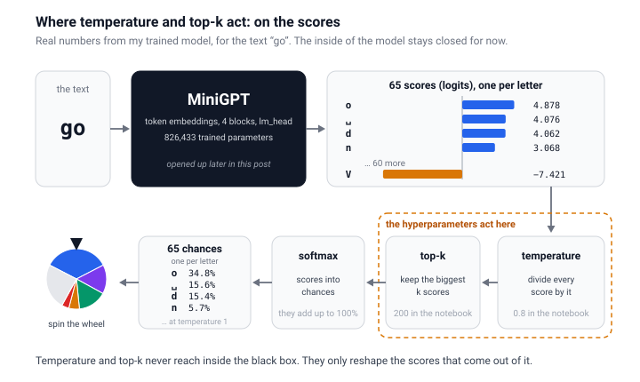
*The model as a closed box. Temperature and top-k never touch what is inside it: they reshape the 65 scores that come out*

Here is the wheel again, with the scores beside it. For the letters with the six biggest scores, the table shows every step: the score, the score divided by the temperature, whether top-k keeps it, and the chance that softmax gives it. The temperature and top-k sliders are explained in the next two sections; for now, leave them where they are.

:::demo minigpt-logits
:::

:::test-drive Follow the scores to the chances
1. Leave the text as `go`. `o` scores 4.878, and softmax gives it 34.8%. The space, at 4.076, gets 15.6%: a smaller score, a smaller slice.
2. Add an `o`, to make `goo`. Every score changes, because the text changed, and `d` jumps to the top.
3. Press **Reset**, and the same numbers come back, exactly. Spin once, reset, and spin again: only the spin changes.
:::

### Temperature: a bolder or a safer wheel

Before it spins, the model can reshape the wheel. A setting called *temperature* changes how big every slice is compared with the others. Turn it down, and the big slices grow and the thin ones shrink, so the model plays safe. Turn it up, and the slices even out, so the model takes more risks. Temperature is a *hyperparameter*: a setting that I choose, not something the model learned. Most hyperparameters, such as how many blocks the model has, are fixed before training, but temperature only changes how the wheel is spun, not how the chances are worked out, so it can be changed every time the model writes. Here is what it does to the wheel after `go`:

| Temperature | `o` | space | `d` | `n` | Letters under 2.5% share |
|---|---|---|---|---|---|
| 0.5, cautious | 68.0% | 13.6% | 13.3% | 1.8% | 5.1% |
| 0.8, the notebook's setting | 45.1% | 16.6% | 16.3% | 4.7% | 11.5% |
| 1, the wheel as it is | 34.8% | 15.6% | 15.4% | 5.7% | 17.5% |
| 2, bold | 13.7% | 9.2% | 9.1% | 5.5% | 37.5% |

Turn it all the way down to 0, and the model always takes the biggest slice, and writes the same text every time. Turn it right up, and every slice heads towards the same size, and the writing turns to noise. The [full demo](#try-it-my-trained-machine-running-in-your-browser) at the end lets you watch it on whole lines.

### Temperature in the original Python

In Jibin Joseph's notebook, the writing loop, `generate_text`, takes `temperature` as a setting, with a default of 0.8. These are the notebook's own lines and comments:

```python
# Select logits from the last time step.
logits = logits[:, -1, :]

# Apply temperature scaling.
logits = logits / temperature
```

That is all there is to it. After the first line, `logits` holds the 65 scores for the next letter, and dividing it by one number divides every score by that number: 65 divisions in one line.

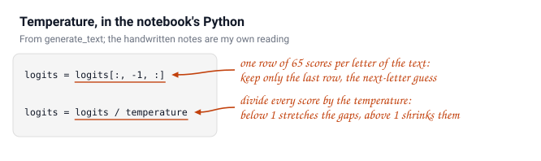
*The temperature lines again, with a note beside each line in my own words*

Here is what it does to the two biggest scores after `go`:

| Divide by | `o` | space | Gap | `o`'s slice ÷ space's |
|---|---|---|---|---|
| 0.5 | 9.757 | 8.151 | 1.6 | **5** |
| 1 | 4.878 | 4.076 | 0.8 | **2.2** |
| 2 | 2.439 | 2.038 | 0.4 | **1.5** |

At temperature 1, `o`'s slice (34.8%) is 2.2 times the space's (15.6%). At 0.5, it is 5 times as big (68.0% against 13.6%), and at 2, only 1.5 times (13.7% against 9.2%).

The gap is what matters. Softmax ignores the scores themselves and looks only at the gaps between them: how much bigger one letter's slice is than another's is *e* raised to the power of the gap between their scores. Dividing by 0.5 doubles every gap, so the favourite pulls further ahead. Dividing by 2 halves every gap, so the slices even out. Dividing by 1 changes nothing. As the temperature heads towards 0, the gaps grow without limit and the favourite takes the whole wheel; as it heads upwards, the gaps shrink towards nothing and every letter's slice heads towards 1 in 65.

A temperature of exactly 0 would make the notebook divide by zero. The demos on this page treat 0 as "always take the biggest slice" instead, which is where a temperature heading towards 0 is going anyway.

The name comes from physics. The same formula describes how particles spread out across energy levels, and there you divide by the temperature: cold particles all settle into the lowest level, like the favourite taking the whole wheel, and hot ones spread out across every level, like every letter getting a similar slice.

### Top-k: keeping only the biggest slices

Even a good wheel has dozens of thin slices for letters that make no sense where they are. Usually the pointer misses them, but spin often enough and it will land on one, and a single nonsense letter can throw off everything written after it. One way to stop that is to trim the wheel before spinning it: keep only the *k* biggest slices, throw the rest away, and let the survivors share the whole wheel between them, each in proportion to its chance. This is called *top-k*.

Like temperature, *k* is a hyperparameter: a setting that I choose, which can be changed every time the model writes, with no retraining. Here is what it does to the wheel after `go`:

| Keep the biggest | `o` | space | `d` | `n` | Slices left |
|---|---|---|---|---|---|
| all 65 | 34.8% | 15.6% | 15.4% | 5.7% | 65 |
| 5 | 46.2% | 20.7% | 20.4% | 7.6% | 5 |
| 3 | 52.9% | 23.7% | 23.4% | 0 | 3 |
| 1 | 100% | 0 | 0 | 0 | 1 |

A small *k* makes the model play safe: with *k* = 1 it always takes the biggest slice, and writes the same text every time. A big *k* leaves room for surprises, good and bad.

### Top-k in the original Python

In Jibin Joseph's notebook, the writing loop, `generate_text`, takes `top_k` as a setting, with a default of 200. It trims the wheel just before the chances are worked out, while they are still *scores*: one number per letter, where a bigger score means a bigger slice ([`lm_head`: where do the 65 scores come from?](#lmhead-where-do-the-65-scores-logits-for-the-next-letter-come-from), below, explains them). These are the notebook's own lines and comments:

```python
# Apply top-k filtering if requested.
if top_k is not None:

    # Keep no more than vocabulary size.
    k = min(top_k, logits.size(-1))

    # Find top-k logits.
    values, indices = torch.topk(logits, k=k)

    # Create filtered logits filled with -infinity.
    filtered_logits = torch.full_like(logits, float("-inf"))

    # Scatter top-k values into filtered logits.
    filtered_logits.scatter_(dim=-1, index=indices, src=values)

    # Replace logits with filtered logits.
    logits = filtered_logits
```

`torch.topk` finds the *k* biggest scores and which letters they belong to. `torch.full_like` makes a fresh list of 65 scores, every one of them minus infinity, and `scatter_` puts the *k* biggest scores back in their places. When softmax turns scores into chances, a score of minus infinity becomes a chance of exactly 0, so those slices vanish, and the survivors share the whole wheel.

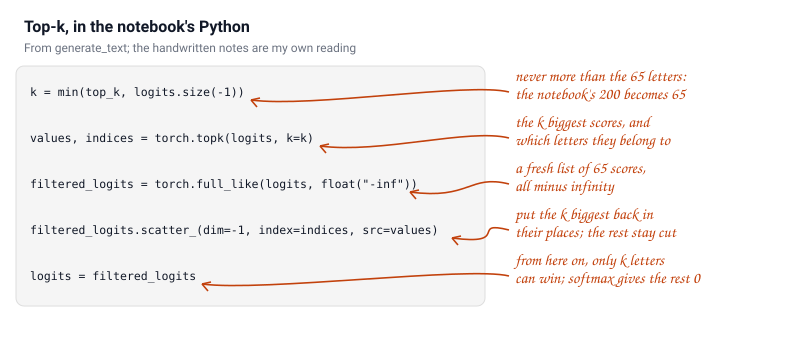
*The top-k lines again, with a note beside each line in my own words*

:::watch-it Top-k of 200 trims nothing here
The notebook's default `top_k` is 200, but this model has only 65 letters, so `min(top_k, logits.size(-1))` makes *k* 65, and every slice is kept. Top-k matters for big models that choose between tens of thousands of pieces of words. To see it work on MiniGPT, *k* has to be smaller than 65.
:::

### Top-p: keeping slices up to a share

Top-k always keeps the same number of slices, however the chances are spread. A second way to trim the wheel adapts to the wheel itself: keep the biggest slices until they add up to a share *p*, and cut the rest. This is called *top-p*, or *nucleus sampling*. With p = 90%, my model's wheel after `good m` keeps just 5 slices: `y`, `e`, `a`, `o`, and `i`, which between them hold about 97% of the chance. The other 60 slices, which shared the remaining 3%, are cut away, and the 5 survivors are stretched to fill the whole wheel before the spin.


*The real wheel after `good m`, reshaped by temperature and by top-p*

The notebook has no top-p; the full demo [at the end](#try-it-my-trained-machine-running-in-your-browser) adds it as a slider. Temperature and trimming work together:

:::fireside-chat Tonight: temperature and the trimmer, on who keeps the writing sensible
**Temperature:** I am the one readers notice. Turn me up, and the writing comes alive.

**Trimmer:** Turn you up too far, and the writing falls apart. You make the thin slices bigger, and most of the thin slices are silly ones.

**Temperature:** And you are a pair of scissors.

**Trimmer:** A pair of scissors that only cuts what nobody wanted. After `good m`, I keep the five slices that make sense and cut away the rest. Then you can be as bold as you like with what is left.

**Temperature:** So I choose how adventurous to be…

**Trimmer:** …and I make sure the adventure stays on the map. Most chatbots use both of us, every single letter.
:::

### Softmax: turning scores into chances

Temperature and top-k reshape the scores. The last step, *softmax*, turns them into chances. Scores are not chances: they can be negative, and they do not add up to anything in particular. Softmax fixes both, in three moves:

1. **Take the biggest score away from every score.** The biggest becomes 0, and every other score becomes negative. This keeps the numbers small, and it does not change the answer.
2. **Raise *e* to the power of each one.** *e* is a number, about 2.718, and raising it to any power gives a positive number: *e* to the power 0 is 1, and *e* to a negative power is between 0 and 1. So every letter now has a positive number, and the bigger the score, the bigger the number.
3. **Divide each one by the total.** Now the 65 numbers add up to exactly 1, or 100%: they are chances.

Here it is for `go`, at temperature 1 with all 65 letters kept. Once *e* is raised to the power of each one, all 65 add up to 2.874, so each chance is its own number divided by 2.874:

| Letter | Score | Minus 4.878 | *e* to that power | Chance |
|---|---|---|---|---|
| `o` | 4.878 | 0 | 1.000 | **34.8%** |
| space | 4.076 | −0.802 | 0.448 | **15.6%** |
| `d` | 4.062 | −0.816 | 0.442 | **15.4%** |
| `n` | 3.068 | −1.810 | 0.164 | **5.7%** |

Those are the slices of the wheel after `go`.

Why *e*? Because it turns a gap between two scores into a ratio between two chances: one letter's chance divided by another's is always *e* raised to the power of the gap between their scores. `o` scores 0.802 more than the space, so its slice is *e* to the power 0.802, 2.2 times as big. That is why temperature works: dividing the scores changes the gaps, so it changes the ratios. And a score of minus infinity, which is what top-k gives the letters it cuts, becomes *e* to the power of minus infinity, which is 0: a chance of exactly 0.

### Softmax in the original Python

In Jibin Joseph's notebook, softmax is one line in the writing loop, `generate_text`, straight after temperature and top-k. This is the notebook's own line and comment:

```python
# Convert logits into probabilities.
probs = torch.softmax(logits, dim=-1)
```

`torch.softmax` does all three moves at once. `dim=-1` tells it which way to add up: along the last dimension of `logits`, the 65 letters, so the 65 chances add up to 1.

### Try temperature and top-k on the wheel

This is the wheel from the first demo, with the two settings added. Moving a slider reshapes the wheel straight away, before it spins, and the model's trained numbers stay exactly as they are.

:::demo minigpt12
:::

:::test-drive Reshape the wheel after "go"
1. Leave the text as `go`. Slide the temperature down to 0.5: `o` grows from 34.8% to 68.0%, as in the temperature table. Slide it up to 2, and the slices even out.
2. Slide the temperature to 0, and press **Spin ten times**. The model always takes the biggest slice, so it writes the same letters every time you reset and try again.
3. Put the temperature back to 1, and slide top-k down to 3: only `o`, the space and `d` are left, at 52.9%, 23.7% and 23.4%. At 1, `o` has the whole wheel.
4. Try both at once: a temperature of 2 with top-k at 5 lets the model take risks, but only among the five likeliest letters.
:::

### Settings I cannot change: 65 letters and 128 positions

Temperature and top-k are hyperparameters I can change every time the model writes. Other things are fixed when the model is built, and they cannot change without training it again. Two of them matter already:

| What is fixed | Mine | What it decides |
|---|---|---|
| The vocabulary | 65 letters | which letters it knows: one score and one slice each |
| The context length, `block_size` | 128 | the most letters it can look at at once |

The *vocabulary* is the set of letters the model knows: every different character in Tiny Shakespeare, which is capital and small letters, the space, the new line, and a few punctuation marks and other symbols. Each one has an ID number, from 0 for the new line to 64 for `z`. That is why there are 65 chances, and 65 slices on the wheel. The notebook's setting `vocab_size` is only how many letters there are; what is really fixed is which letters they are, and in which order. Every letter has its own row in two tables, its token embedding at the start of the model and its row of `lm_head` at the end, both found by its ID. A letter the model never trained on has neither, and swapping two IDs would hand each letter the other one's rows. The demos skip any character outside the vocabulary.

The 128 is the *context length*, or *context window*. When the text is longer than 128 letters, the model looks at the last 128 only, and anything further back is simply gone.

:::watch-it Why not just raise `block_size`?
I could change `block_size` to 1,000 in the code, but my trained model could not use it. The model knows where each letter sits from its *position embeddings*: a list of 128 numbers for each position, and all 128 of those lists were learned in training, like every other number in the model. In fact, my trained numbers would not even load: the model would expect 1,000 position embeddings, and my trained file has 128. A model with a longer context needs more position embeddings, and the only way to get good ones is to train them. A shorter context is fine, though: with only `go` to look at, the model uses just two positions.
:::

[How much can it see at once?](#how-much-can-it-see-at-once-the-context-limit), later in this post, explains where the context limit comes from, and why raising it costs so much.

### The real code: a list of 65 chances, and a spin

The wheel is only a picture, but the live demo below does something very close to it. Before it picks a letter, it has worked out a list of 65 chances, one for each letter that could come next, in the order of the letters' ID numbers ([Letters to numbers](#letters-to-numbers) explains the IDs). Here is that list after `go`, with the letters that matter, and a running total. The chances add up to exactly 1:

| ID | Letter | Chance | Running total |
|---|---|---|---|
| 0 | new line | 0.96% | 0.0096 |
| 1 | space | 15.59% | 0.1656 |
| … | | | |
| 6 | `,` | 3.24% | 0.2080 |
| … | | | |
| 42 | `d` | 15.38% | 0.4153 |
| … | | | |
| 52 | `n` | 5.69% | 0.5308 |
| 53 | `o` | 34.80% | 0.8788 |
| … | | | |
| 64 | `z` | | 1.0000 |

In Jibin Joseph's notebook, the spin is one line. The notebook's writing loop, `generate_text`, holds the 65 chances in a PyTorch list called `probs`, and hands them to `torch.multinomial`, which picks one ID at random, each with its own chance: exactly what the wheel does. Then `torch.cat` adds the new ID to the end of the text so far, `idx`, ready to go round the loop again. These are the notebook's own lines and comments:

```python
# Convert logits into probabilities.
probs = torch.softmax(logits, dim=-1)

# Sample next token ID.
next_id = torch.multinomial(probs, num_samples=1)

# Append sampled token ID.
idx = torch.cat([idx, next_id], dim=1)
```

*Sample* is the experts' word for spinning the wheel. The first line is [softmax](#softmax-turning-scores-into-chances), turning the 65 scores into the 65 chances; just before it, the loop can also reshape the scores with *temperature* and *top-k*. Where the scores themselves come from is what [the next section](#lmhead-where-do-the-65-scores-logits-for-the-next-letter-come-from) explains.

`torch.multinomial` keeps the walk round the wheel hidden inside PyTorch, but what it does is simple. It picks a point somewhere round the wheel: a random number between 0 and 1. Then it walks round the wheel in ID order, slice by slice, adding up the chances, until it passes that point, and returns the ID of the slice it stopped in. If the random number is 0.6, the walk passes the new line, the space, the comma, `d`, and `n` (a running total of 0.5308), and stops inside `o`'s slice, which runs from 0.5308 to 0.8788. So it returns 53, `o`. If the random number is 0.3, it stops inside `d`'s slice instead, between 0.2080 and 0.4153. A big slice covers more of the numbers between 0 and 1, so it is picked more often: `o` about 35 times in every 100 spins.

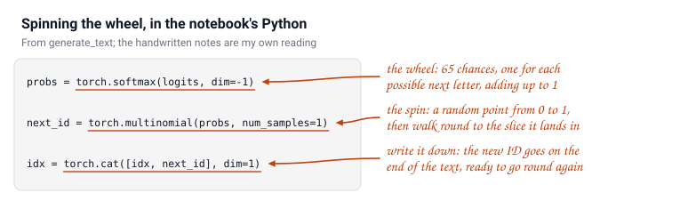
*The sampling lines again, with a note beside each line in my own words*

`torch.cat` then adds the new ID to the end of `idx`, and when the text is shown, the notebook's `decode` turns each ID back into its letter. The vocabulary is the list of the 65 letters in ID order, so ID 53 becomes `o`. Where the list of chances comes from is what the rest of this post explains, layer by layer.


### `lm_head`: where do the 65 scores (logits) for the next letter come from?

Until now, I have treated the model as [a closed box](#scores-what-comes-out-of-the-closed-box): text goes in, and 65 scores, the logits, come out: one for each letter that could come next. Now I open the box, one level down. I pass the text into my MiniGPT model, and inside, it goes through these stages:

1. Each letter becomes a list of 128 numbers: one list for the letter itself, learned in training, plus one for its position in the text. The code calls these the *token embedding* and the *position embedding*, and [a later section](#token-embeddings-and-position-embeddings) explains them.
2. The lists pass through four *blocks*, which let each letter's list take in what the letters before it say. The blocks are where the model does its understanding, and [the four blocks](#four-blocks-in-a-row) explains them. Between blocks, each letter's list is called its *hidden state*: hidden, because nobody outside the model sees it.
3. Out of the last block, after one final normalisation, comes the last letter's list: 128 numbers that sum up the text so far. This is the *final hidden state*, and the notebook's own comment calls it that.
4. `lm_head` turns the final hidden state into 65 scores, one for each letter that could come next. The code calls the scores *logits*.
5. Temperature and top-k reshape the scores, and *softmax* turns them into the 65 chances, or *probabilities*: the slices of the wheel. The sections above covered this stage.

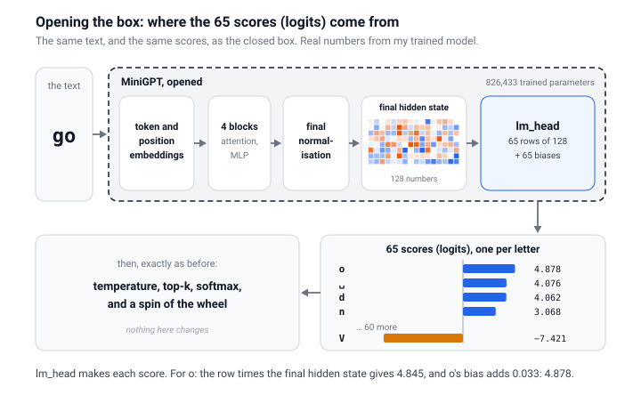
*The closed box from earlier, opened. The text and the 65 scores are the same; what is new is how the scores are made inside, ending with `lm_head`*

Everything up to stage 3 is the *body* of the model. This section is about stage 4, `lm_head`, and the final normalisation just before it.

**First, the final normalisation.** Out of the last block come hidden states, one for each letter in the text: two for `go`. Only the last one matters here, because it is the only one that has seen the whole text. Its numbers are small: for `go`, they run from −1.26 to 1.00, and their *spread*, a measure of how far they typically sit from their average, is 0.33. The final normalisation, `final_ln` in the code, puts the list on a steady scale. First it rescales the 128 numbers so that they average 0 and spread 1. Then it stretches and shifts each number by its own trained amount. Its first four numbers go from −0.04, 0.17, 0.05 and −0.14 to −0.23, 0.70, 0.08 and −0.39. The pattern stays much the same, but now `lm_head` gets numbers on the same scale whatever the text was. The result is the final hidden state. The blocks use the same kind of normalisation inside them, which [the four blocks](#four-blocks-in-a-row) comes back to.

**Then `lm_head` scores each letter that could come next.** `lm_head`, short for *language-model head*, is the model's last layer. It is a table with one row for each of the 65 letters. Each row holds 128 numbers, learned in training, plus one extra number, a *bias*: 8,385 numbers in all. To score a letter, `lm_head` multiplies the final hidden state by that letter's row, number by number, adds up the 128 results, and adds the bias. This multiply-and-add is called a *dot product*. A big score means the final hidden state looks like the letter's row, and training made each row look like the moments when that letter comes next. After `go`, `o` scores 4.878, the space 4.076, `d` 4.062, and `n` 3.068. The lowest of the 65 is `V`, at −7.421.

**The bias: a head start for common letters.** The bias is added whatever the text is, so it is a letter's starting score, before the final hidden state has any say. In my trained model the biases are tiny, from −0.107 for `&` to 0.057 for `s`, and they follow how common each letter is in Tiny Shakespeare: `s`, `e`, the space, and `t` get the biggest head starts, and `&`, `$`, `3`, `Q`, and `J` the biggest handicaps. The dot product does almost all of the work: for `o` after `go`, it gives 4.845, and the bias adds just 0.033. The demo below shows both parts of every score.

It is called a *head* because it sits on top of the body. The body understands the text; the head reads the answer out in the form the task needs. Here the task is "which of 65 letters comes next?", so the head has 65 outputs. Nobody wrote the rows by hand: like every other number in the model, they started random, and training nudged them until the scores they give match what Tiny Shakespeare really does next.

:::under-the-hood When `lm_head` and the token embeddings share one table
In the notebook's bigger setup, with 384 numbers per letter, one line makes each letter's row of `lm_head` the very same list of numbers as its token embedding: `model.lm_head.weight = model.token_embedding.weight`. This trick, called *weight tying*, works because both tables have 65 rows of the same width, and it saves a whole table of numbers. GPT-2 does the same. My trained model does not: I checked, and its `lm_head` and its token embeddings are two separate tables, each learned on its own.
:::

From there, the 65 scores go through temperature, top-k, and [softmax](#softmax-turning-scores-into-chances), as the sections above showed. For `go`, at temperature 1, `o`'s score of 4.878 becomes 34.8%, the biggest slice of the wheel.

Try it below. Type some text, and see what `lm_head` does with it: the final hidden state comes out of the blocks, and `lm_head` multiplies it by one letter's row, number by number, and adds up the results. Pick one of the six letters to see its sum. Then move the sliders.

:::demo minigpt3
:::

:::test-drive Watch a score being made
1. Start with `go`. `o` has the biggest score. Its 128 products add up to 4.845, and its bias, 0.033, makes 4.878. Most of the products are blue: the final hidden state and `o`'s row agree.
2. Pick `V`, the lowest. Most of its products are orange, and they add up to −7.373: the final hidden state looks nothing like `V`'s row.
3. Slide the temperature to 0.5, then to 2, and top-k down to 3. The chances change, but none of the squares or scores move: temperature and top-k act after the model has done its work.
4. Now add one more `o`, to make `goo`. The final hidden state changes, and so does every product and every score. The rows of `lm_head` do not change: they are fixed by training, and the text is the only thing that reaches the model.
:::

### In the original Python: `lm_head`

In Jibin Joseph's notebook, the final normalisation and `lm_head` are a line each. `lm_head` is one PyTorch layer, created in `MiniGPT.__init__` as `self.lm_head = nn.Linear(config.n_embd, config.vocab_size)`: a table of 65 rows of 128 numbers, `self.lm_head.weight`, plus 65 biases, `self.lm_head.bias`. `nn.Linear` is PyTorch's name for a layer that does dot products against a table of rows. At the end of `MiniGPT.forward`:

```python
# Final LayerNorm.
x = self.final_ln(x)

# Convert final hidden states into vocabulary logits.
logits = self.lm_head(x)
```

In the code, the hidden states are just `x`, one list for each letter, all the way through the model.

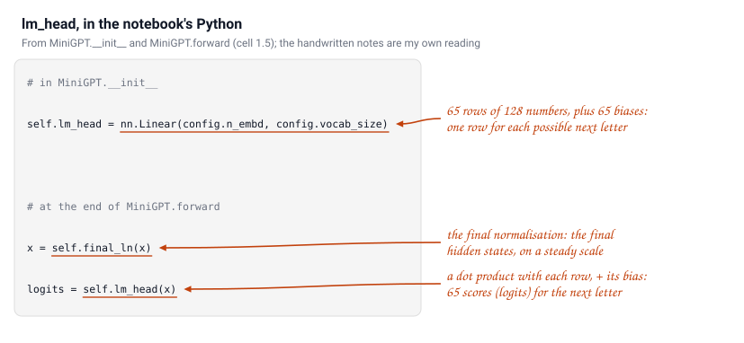
*The `lm_head` lines again, with a note beside each line in my own words*

The scores are called `logits`. Then, in the writing loop, `generate_text`:

```python
# keep only the last letter's 65 scores
logits = logits[:, -1, :]
# the chances: the slices of the wheel
probs = torch.softmax(logits, dim=-1)
```

`self.lm_head(x)` does the dot products for every hidden state and all 65 rows at once, and `torch.softmax` is [the softmax step](#softmax-in-the-original-python) from earlier. The notebook scores every letter's hidden state, because training needs them all, and then keeps only the last letter's scores.

### Four blocks in a row

One level further into the box. The final normalisation and `lm_head` read a hidden state, and that hidden state comes out of the biggest part of the model: four *blocks*, run one after another. This section is about what the blocks do as a whole; the sections after it open one up.

Going into block 1, there is one hidden state for each letter in the text, and each one knows only its own letter and its own position. (Where those starting hidden states come from is the last layer of the box, [further in](#token-embeddings-and-position-embeddings).) Each block has two parts: **attention**, where each hidden state looks back at earlier positions and collects information from them, and the **MLP**, a small network that works on each hidden state on its own. Every block reads the hidden states and rewrites them.

Attention followed by the MLP makes one *block*. My model runs four blocks in a row, and the bigger model in the notebook runs six. The blocks run one after another. The hidden states that come out of block 1 are the ones that go into block 2, block 2's go into block 3, and so on. After block 4, the final normalisation and `lm_head` read the last hidden state. Each block has its own parameters: the four blocks are built the same way, but they do not share any numbers, so each one can learn to do something different. With each block, the hidden states carry more context: by the later blocks, a hidden state is less about one letter and more about what is going on around it.

The hidden states that come out of one block and the ones that go into the next are not two different things: they are the same vectors, and in the code they are the same variable, `x`. A block never swaps a hidden state for a new one. It adds to it twice: hidden state out = hidden state in + what attention adds + what the MLP adds. Here is how much each block adds to hidden state 3 in `goo`, where "size" is how big its 128 numbers are taken together:

| Block | Size going in | Attention adds | The MLP adds | Size coming out | How alike in and out are |
|---|---|---|---|---|---|
| 1 | 0.50 | 0.59 | 1.66 | 2.16 | 0.47 |
| 2 | 2.16 | 0.80 | 0.85 | 2.72 | 0.90 |
| 3 | 2.72 | 0.90 | 1.16 | 2.92 | 0.90 |
| 4 | 2.92 | 0.74 | 1.86 | 3.09 | 0.78 |

Block 1 changes the hidden state the most: it adds more than the vector held when it went in. Blocks 2 and 3 refine it, so what comes out is still 0.90 like what went in. Block 4 makes a bigger change again, mostly in its MLP, as it gets the hidden state ready for `lm_head`. By the end, hidden state 3 scores only 0.08 for likeness to the vector it started as.


*All the hidden states go through every block together. The coloured squares on each one show how much of the earlier positions it has taken in: hidden state 1 can only ever take in itself, while hidden state 3 takes in all three*

Written out in full, the hidden states go through eight stages, always in the same order: attention, MLP, attention, MLP, attention, MLP, attention, MLP. The two take turns, and neither ever runs twice in a row. So if you see a diagram of a big GPT as a long stack of slabs labelled "Attention, Multilayer Perceptron, Attention, Multilayer Perceptron…", like the one in [Grant Sanderson's talk](https://www.youtube.com/watch?v=KJtZARuO3JY), it shows exactly what my small model does. The only difference is how many times the pair repeats: GPT-3 repeats it 96 times, with much longer vectors.

Two details keep the blocks working well:

- **Add, never replace.** Each block adds to the hidden states rather than replacing them, so nothing learned in an earlier block is lost. This also matters for learning: when the parameters are tuned, the message about which way to turn them has to travel backwards through every block, as [the next post](/posts/minigpt-grown/#how-does-it-know-which-way-to-nudge) shows. Adding rather than replacing gives that message a clear route all the way back, which is why models can be stacked dozens of blocks deep. Because every block adds to the same hidden states, they have another name in the jargon, taken together: the *residual stream*. It starts as the input embeddings and flows through every block.
- **Normalise before each step.** Before attention, and again before the MLP, the numbers in every hidden state are rescaled to a standard range, so that no position is shouting. Then each of the 128 numbers is stretched and shifted by its own two fixed parameters, set by training, so the machine can turn some numbers back up if they matter more than others. This is called *layer normalisation*, or *LayerNorm*.

:::under-the-hood How normalising works, with real numbers
Take hidden state 3 in `goo` as it arrives at block 1: the `o` token embedding plus the position 3 embedding. Its 128 numbers are tiny, between −0.104 and 0.111, and start 0.019, −0.080, 0.013. Normalising takes three moves:

1. **Subtract the average.** The average of all 128 numbers is 0.0009, so here this barely changes anything.
2. **Divide by the spread.** The numbers' typical distance from their average, their *standard deviation*, is 0.0444. Dividing by it gives the vector a standard size, whatever size it arrived at: its numbers now start 0.40, −1.83, 0.28, and run from −2.36 to 2.48.
3. **Stretch and shift.** Each of the 128 numbers is multiplied by its own stretch, and has its own shift added: two parameters each, set by training. For the first three numbers, the stretches are 1.05, 1.12, and 1.08, and the shifts are 0.01, −0.03, and −0.08.

The result starts 0.43, −2.10, 0.22 (allowing for rounding): the numbers that go into block 1's weights in [Where the queries, keys and values come from](#where-the-queries-keys-and-values-come-from). [MiniGPT (Part 5)](/posts/minigpt4/) tries a simpler kind of normalising, *RMSNorm*, which skips the first move and the shift.
:::

:::brain-power
After one block, every hidden state knows something about the positions just before it. What could a second block of exactly the same kind add that the first could not?
:::

Why four blocks, and not one? Because each block builds on the last. After block 1, a hidden state knows about the positions just before it. In block 2, it can look at hidden states that have *already* gathered their own neighbours, so it learns about positions further back, and so on. You can see this in the heads themselves. In block 1, the heads look between 1.6 and 5.7 positions back on average. In blocks 2 to 4, they look between 6 and 25 positions back.

You can also watch the guess improve. After each block, I took the last hidden state as it was at that point, gave it the same final normalisation, scored it against the same 65 rows of `lm_head`, and turned the scores into chances, exactly as the model does after block 4. `lm_head` was only ever trained to read block 4's output, so this is a peek rather than something the machine does when it writes, but it works surprisingly well, and researchers use the same trick under the name *logit lens*:


*Real numbers from my trained model. Straight from the embeddings, before any block, it guesses the next letter right 12% of the time; after all four blocks, 49%*

The picture follows the guess after *Before we proceed any further, hear me spea*, from the first speech in Tiny Shakespeare. Straight from the embeddings, before any block, the machine knows only that the last letter is an `a`, so it guesses `y`. Block 1 adds the letters in the positions just before it, and `t` takes the lead. Block 2 has seen enough of `spea` to try `c`. Only in blocks 3 and 4 does the whole picture, *hear me spea*, settle on `k`, at 98%.

Try it below. The text starts as the line in the picture above. Choose how many of the four blocks run, from none, where `lm_head` reads the hidden state straight from the embeddings, to all four, the real model.

:::demo minigpt-blocks
:::

:::test-drive Stop the model early
1. Start with all four blocks: `k` gets 98.8%, and the model finishes *speak*.
2. Press **none**. Now `lm_head` reads the hidden state straight from the embeddings, which knows only that the last letter is an `a`, so it guesses `y`, at 20.3%. Press **Write 60 letters**: the result looks like letters, but not like words.
3. Press **1**: `t` leads, at 21.5%, and the writing turns into short, real words. Press **2**: `c` leads. Press **3**: `k` takes over, at 60.5%.
4. Watch the hidden states as you go. Each block adds to the one before, so the squares get stronger block by block.
5. Write 60 letters with all four blocks, and compare: names, new lines, and something close to English.
:::

:::watch-it Fixed or changing?
Two kinds of thing take part from here on, and it helps to keep them apart.

- **Fixed:** everything training set, the *parameters*. The token embeddings, the position embeddings, the weights in every block, and the rows of `lm_head`. None of them changes while the machine is writing.
- **Changing:** everything worked out for the text in front of it, the *activations*. That means the hidden states, which every block rewrites, and the scratch work inside each block: the queries, keys, and values in attention, and the numbers in the MLP. The scratch work is thrown away at the end of each block. Only the hidden states carry anything from one block to the next.

So "the position 3 embedding" always means the fixed vector from the table, and "hidden state 3" means the vector that changes as it moves through the blocks.
:::

### The blocks in the original Python

In Jibin Joseph's notebook, the four blocks are a loop near the end of `MiniGPT.forward`:

```python
# the four blocks, in order
for block in self.blocks:
    # each one rewrites the hidden states
    x = block(x)
```

`self.blocks` is an `nn.ModuleList` holding four `TransformerBlock`s, one for each of `n_layer = 4`, and each with its own fixed weights. Block 1's output is block 2's input, because it is literally the same variable.

Each block is a `TransformerBlock`, and its `forward` is two lines:


```python
# normalise, attention, add the result
x = x + self.attn(self.ln1(x))
# normalise, MLP, add the result
x = x + self.mlp(self.ln2(x))
```

These two lines are a whole block. Read from the inside out, the first one normalises every hidden state (`self.ln1`, a *layer normalisation*), runs attention (`self.attn`), and adds what attention returns onto the hidden states (`x + …`). The second does the same with the MLP. The `x +` is "add, never replace", the *residual connection*. Normalising *before* each step, rather than after, is called *pre-LayerNorm*, and it tends to train more stably as models get deeper.

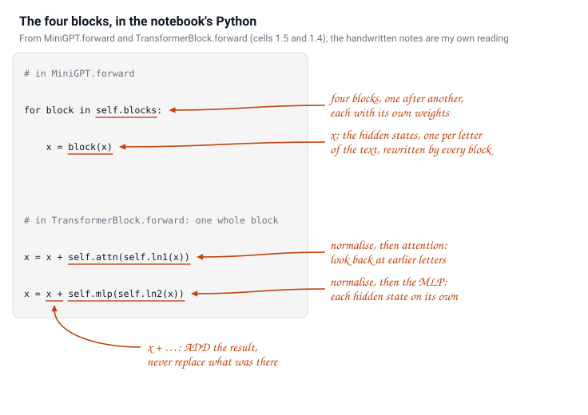
*The blocks code again, with a note beside each line in my own words*

### Then the MLP: each hidden state on its own

Inside each block, after attention, every hidden state goes through the *MLP*, short for *multilayer perceptron*: a small two-layer network that works on each hidden state on its own. Every hidden state gets the same calculation, but each one sees only its own numbers. It is the simpler half of a block, so I open it first; attention, the half that looks back at other letters, comes next.

The MLP matters more than it sounds. About two-thirds of each block's parameters are in the MLP, rather than in attention.

So what is the MLP for? Grant Sanderson of 3Blue1Brown gives a good rule of thumb in [his talk on transformers](https://www.youtube.com/watch?v=KJtZARuO3JY): where a guess needs *context*, attention supplies it, and where it needs *general knowledge*, the MLP supplies it. His example is a big word-level model completing "Michael Jordan plays the sport of". *Basketball* appears nowhere in the sentence, so it must come from knowledge stored in the parameters, and researchers at Google DeepMind found evidence that facts like this live mostly in the MLPs. In our small model the knowledge is humbler. Once attention has gathered that the word so far is `thoug`, knowing that `h` comes next is knowledge of English spelling, not something written in the earlier positions.

Try it below: switch the MLP off in any of the four blocks, and compare the chances, and the writing, with the real model. The text starts as Romeo, halfway through *thought*.

:::demo minigpt-mlp
:::

:::test-drive Switch the MLPs off
1. Start with everything on. After `thoug`, `h` gets 99.4%: knowing that *thoug* ends in `h` is just the kind of spelling knowledge the MLP holds.
2. Switch off block 1's MLP. `h` drops to 2.9%, and `n` leads, at 34.8%. Write 60 letters both ways: without it, the words fall apart.
3. Switch block 1 back on, and try blocks 2, 3, and 4 one at a time instead. `h` stays above 90% each time. For this guess, block 1's MLP does the heavy lifting.
4. Switch all four off. The model writes letters, but hardly any words: `te tee aattesteetes…`.
:::

### The MLP in the original Python


*I ran the 1.3 cell, which defines the `FeedForward` class: two linear layers with a GELU between them, then dropout*

```python
# 128 numbers → 512
x = self.fc1(x)
# bend: keep the positives, squash the negatives
x = self.gelu(x)
# 512 numbers → 128
x = self.fc2(x)
```

The MLP works on each hidden state alone, using the same fixed weights for every position. `fc1` and `fc2` are `nn.Linear` layers, just like attention's, but `fc1` makes 512 numbers from 128, giving the MLP room to look for many patterns at once, and `fc2` brings them back to 128. `gelu` (Gaussian Error Linear Unit) is what makes the two layers more than one: without a bend between them, two weighted mixes in a row would be no more powerful than one. GELU passes large positive numbers through almost unchanged, pushes large negative numbers to about zero, and curves smoothly in between.

The MLP holds most of each block's numbers: 66,048 in `fc1` and 65,664 in `fc2`, 131,712 in all, almost exactly twice attention's 66,048. It is the same kind of two-layer network as the digit reader in [Machine Learning (Part 9)](/posts/machinelearning9/).

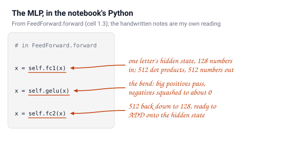
*The MLP code again, with a note beside each line in my own words*

### Inside a block: attention

Back to the first half of each block. Here is the problem attention solves. Take hidden state 3, the one that started as the last `o` in `goo`. It says "I am an `o`, in position 3". That is not enough to guess what comes next, because it says nothing about what came *before*. The same `o` could be the second `o` in `good`, in `took`, or in `soon`, and each of those wants a different next letter.

Here is a bigger example from Shakespeare itself. After a blank line, the next thing is almost always a speaker's name and a colon: in 7,219 of the 7,221 blank lines in Tiny Shakespeare. But there are 309 different speakers. Which name comes next depends on who has been talking in the scene, and that information is spread across all the positions before the blank line, not sitting in the one just before it.

So each block starts with *attention*, which has one strict rule: **a hidden state may only look at hidden states in earlier positions, and at itself.** Looking at later positions would be cheating, because the next letter is the answer it is trying to guess.

For attention, every hidden state makes three short-lived vectors, called its *query*, its *key*, and its *value*. The names come from searching: you type a query, it is matched against the keys, and you get back the matching values. It helps to picture them as cards at a meeting:

- The **query** says what this position is looking for in the earlier positions. Picture it as a card the position keeps in its own hand.
- The **key** says what this position has to offer. Picture it laid face up on the table, where its own position and every later position can read it.
- The **value** holds what this position will hand over if it is chosen. Picture it laid face down, next to its key.

Keys and values are separate because what makes a position worth listening to is not the same thing as what it should pass on. Then attention runs in three moves. Each hidden state:

1. **Matches** its query against every key on the table from its own position or earlier.
2. **Shares out** 100% of its attention, in proportion to how well each key matched.
3. **Collects** that share of each value, adds them up number by number, and adds the result to itself.

In block 1 of my trained model, in one of the four copies of attention that run side by side (*heads*, explained [below](#several-heads-at-once)), hidden state 3 gives 92.9% of its attention to position 2 (the first `o`), 4.0% to position 1 (the `g`), and 3.1% to itself, so most of what it collects is position 2's value.


*Attention for position 3, the last position in `goo`. Its query matches position 2's key best, so most of what it collects comes from position 2's value*

After this, hidden state 3 says something closer to "I am an `o`, and one position before me is another `o`". That is a much better clue, and the other heads add more, as you will see.

### Where the queries, keys and values come from

The queries, keys and values are not looked up. A lookup table only works when there is a short list of things that can come in, one row for each: that is why token embeddings and position embeddings can be looked up, because there are only 65 letters and 128 positions. A hidden state can hold any 128 numbers at all, so no table could ever list them.

Instead, each block has three fixed tables of **weights**, one for queries, one for keys, and one for values. Each is a fixed grid of 128 × 128 numbers, called *weights*, plus 128 more fixed numbers, called *biases*. Training set them all, and while the machine is writing they never change, just like the token embeddings. In the code, each one is an `nn.Linear` layer, just like `lm_head`. To work out one number of a query, the machine multiplies each of the hidden state's 128 numbers by its own weight, adds up the 128 results, and adds a bias. It repeats that with a different row of weights for each of the query's 128 numbers. So every number of a query, key or value is a mix of *all* 128 numbers of the hidden state.

Here is one real number from my trained model: hidden state 3 in `goo`, at the start of block 1. The hidden state is normalised first, so it starts 0.43, −2.10, 0.22, and so on. The second number of its query is:

(−0.036 × 0.43) + (−0.038 × −2.10) + (0.030 × 0.22) + … 125 more terms … + 0.093 = **0.27**

Three more things are worth knowing:

- **The weights belong to the block, not to a position.** Every hidden state goes through the same three tables of weights, so two hidden states that held the same numbers would make the same queries, keys and values. Each block has its own three tables, and between them they hold 49,536 of that block's parameters.
- **They are all made at once.** Making a position's query, key and value needs nothing but that position's hidden state, so the machine makes them for every position at the same moment, in one big multiplication over all the hidden states.
- **They are thrown away.** They exist only during attention. MiniGPT makes them all again from scratch for every new letter, because it reruns every position through every block. Big chatbots save that work. Because a hidden state only ever listens to earlier positions, adding a new letter never changes the hidden states before it, so their keys and values do not change either. Big models keep them instead of remaking them, in a store called the *KV cache*, short for key–value cache ([this Hugging Face post](https://huggingface.co/blog/not-lain/kv-caching) explains it well). Only the newest position needs a new query.

Nobody chooses what goes into the queries, keys, and values. Training tunes the weights, just as it tunes the token embeddings, and a real model's queries and keys mostly have no tidy name at all.

### Queries, keys and values, with real numbers

Here is attention for hidden state 3 in `goo`, with the real numbers from my trained model, in one of the four heads in block 1. In each head, each query, key and value is 32 numbers long; [the heads section](#several-heads-at-once) explains why. Hidden state 3's query starts 0.00, 0.27, 0.76, and so on. Matching a query with a key means multiplying the two together, number by number, and adding up the 32 results. A big total is a good match.

| | position 1 (`g`) | position 2 (`o`) | position 3 (`o`, itself) |
|---|---|---|---|
| 1. Query × key, added up | −2.19 | **15.60** | −3.62 |
| 2. Divided by √32 | −0.39 | **2.76** | −0.64 |
| 3. Share of attention | 4.0% | **92.9%** | 3.1% |

1. **Match.** Multiply and add. That is all the "dot product" in the notebook is.
2. **Shrink.** Divide by √32, about 5.66, to keep the scores in a modest range. Without this, the biggest score would swamp all the others.
3. **Share out.** A step called *softmax* turns the scores into shares that are all positive and add up to 100%. The model uses the same trick again at the very end, to turn the final scores into chances.
4. **Collect.** Hidden state 3 collects the values in those shares: 92.9% of position 2's, 4.0% of position 1's, and 3.1% of its own, number by number. After one more step, described under heads below, the result is added to hidden state 3.

Look at hidden states 2 and 3. They started from the same `o` token embedding. The only difference between them is their position embeddings, 2 and 3, and that is enough to give them different keys. Position 2's key matches the query with 15.60, while position 3's own key scores −3.62. Without the position embeddings, the machine could not tell "the `o` one position before me" from "me".

:::watch-it
"Was there an `o` one position before me?" is my reading of this query, not the machine's. The machine has no words, only 32 numbers. What it *measurably* does is look one position back: across 60 passages of Shakespeare, this head puts 96% of every position's attention on the position just before it.
:::

Try it below. Pick a block, a head, and a position, and follow its query through every step: matching it against each key, shrinking the scores, sharing out attention, and collecting the values. It starts on the example above: `goo`, block 1, head 1, position 3.

:::demo minigpt-qkv
:::

:::test-drive Follow one query
1. Start where the post does: `goo`, block 1, head 1, position 3. Query × key gives −2.19, 15.60, and −3.62, and the shares are 4.0%, 92.9%, and 3.1%: almost all of the attention goes one position back.
2. Press **head 2**. Now 83.4% goes to position 1, the `g`: two positions back. Each head asks its own question.
3. Pick position 1. It can only look at itself, so it gives itself 100%, whatever the head.
4. Type a longer line, such as `First Citizen:`, and try block 4. The later blocks spread their attention further back.
:::

:::brain-power
One head asks one query. Think about hidden state 3 in `goo`. What are two different things it might want to know about the earlier positions?
:::

### Attention in the original Python


*I ran the 1.2 cell. The top of the class, shown here, is `__init__`, which creates the weights and the causal mask*

Like every part of the model, the class has two halves. `__init__` runs once, when the model is built, and creates the fixed weights. `forward` runs every time, and uses them.

`__init__` creates four `nn.Linear(128, 128)` layers. Three of them are the tables of weights from [Where the queries, keys and values come from](#where-the-queries-keys-and-values-come-from): `self.query`, `self.key`, and `self.value`. The fourth, `self.proj`, mixes the four heads' results at the end. Each holds a 128 × 128 grid of weights and 128 biases, 16,512 numbers, so attention holds 66,048 in all. `__init__` also builds the causal mask, the "only earlier positions" rule, as a triangle of `True` and `False` values. It stores the mask with `register_buffer`, so the mask is saved with the model, but training never changes it.


*The mask, drawn out for eight positions. Each row is a position; the filled cells are the positions it may listen to*

Then `forward` runs attention, in three stages. First, it makes the queries, keys, and values:

```python
# 1 text, 3 hidden states, 128 numbers
B, T, C = x.shape
# a query for every hidden state
q = self.query(x)
# a key for every hidden state
k = self.key(x)
# a value for every hidden state
v = self.value(x)
# cut each one into 4 pieces of 32
q = q.view(B, T, self.n_head, self.head_dim)
k = k.view(B, T, self.n_head, self.head_dim)
v = v.view(B, T, self.n_head, self.head_dim)
# group the pieces by head
q = q.transpose(1, 2)
k = k.transpose(1, 2)
v = v.transpose(1, 2)
```

`self.query(x)` applies the query weights to every hidden state at once: each of the 128 numbers of each query is a weighted mix of all 128 numbers of its hidden state, plus a bias. `view` cuts each 128-number vector into four 32-number pieces, one per head, and `transpose(1, 2)` regroups them so that each head gets its own stack of pieces and all four heads can run side by side.

Second, it matches and shares out:

```python
# match every query with every key
scores = q @ k.transpose(-2, -1)
# shrink: divide by √32
scores = scores / math.sqrt(self.head_dim)
# the corner of the mask for 3 positions
mask = self.causal_mask[:, :, :T, :T]
# no listening to later positions
scores = scores.masked_fill(mask == False, float("-inf"))
# share out 100% of attention
attn = F.softmax(scores, dim=-1)
```

`q @ k.transpose(-2, -1)` is the dot product between every query and every key, in one go: for each head, a 3 × 3 grid of scores. For hidden state 3 in head 1 of block 1, the row is −2.19, 15.60, and −3.62, the numbers from [Queries, keys and values, with real numbers](#queries-keys-and-values-with-real-numbers). `masked_fill` writes minus infinity into every score for a later position, and softmax turns minus infinity into exactly 0, so later positions get no attention at all. `attn` holds the shares: 4.0%, 92.9%, and 3.1% in that row.

Third, it collects and puts the heads back together:

```python
# collect the values, in those shares
out = attn @ v
# rejoin the four heads: 128 numbers again
out = out.transpose(1, 2).contiguous().view(B, T, C)
# mix what the four heads found
out = self.proj(out)
return out
```

`attn @ v` is the collecting: each hidden state's share of every value, added up number by number. The next line undoes the cutting into heads (I have joined three of the notebook's lines into one), and `self.proj` mixes the heads' findings. The result has the same shape as the hidden states, `1 × 3 × 128`, which is what lets `TransformerBlock` add it straight back onto `x`.


*The heart of attention, with a comment beside each line*

### Several heads at once

A block does not run attention just once. It runs it four times side by side, and each copy is called a *head*. Each head gets its own 32-number piece of every query, key, and value, and every piece is made from the whole hidden state. Same hidden states, same moment, but four different queries, and so four different answers.

:::pencil Draw a head
Imagine a head that has learned one simple habit: every position puts all of its attention on the position just before it, and position 1, which has nothing before it, attends to itself. Fill in its grid of weights for `goo`.

:::answer
| | 1 (`g`) | 2 (`o`) | 3 (`o`) |
|---|---|---|---|
| position 1 | 100% | 0 | 0 |
| position 2 | 100% | 0 | 0 |
| position 3 | 0 | 100% | 0 |

Every row still adds up to 100%, and the upper-right triangle is still all zeros. After one pass through this head, what each hidden state collects describes the position before it, which is exactly the clue a character-level model needs. Real heads are rarely this tidy, but this one really exists: the first block of my trained model grew a head that puts about 96% of each position's attention on the position just before it. Head 1 in the table below behaves almost exactly like this.
:::
:::

Here is what hidden state 3 collects from each of block 1's four heads:

| Head | position 1 (`g`) | position 2 (`o`) | position 3 (itself) | In short |
|---|---|---|---|---|
| 1 | 4.0% | **92.9%** | 3.1% | one position back |
| 2 | **83.4%** | 12.2% | 4.4% | two positions back |
| 3 | **83.4%** | 14.9% | 1.6% | two positions back |
| 4 | 24.7% | **66.5%** | 8.8% | one position back, more loosely |

Between them, the four heads tell hidden state 3 exactly what it needs to know. Heads 1 and 4 say "one position back, there is an `o`", and heads 2 and 3 say "two positions back, there is a `g`". Put together: `g`, `o`, then me. That is `goo`, and it is why `d` ends up so likely.

The same habits show up on any text. Here are all four heads reading a line from *Romeo and Juliet*:


*Real attention, measured from my trained model. Each row is a position, labelled with the letter it started from, and each dot shows how much attention it gives the position above*

Nobody designed these habits. Training grew them, because they help with the guessing game. Two heads even learned nearly the same habit: nothing forces heads to be different, and training simply found two copies useful. Between them, after block 1, every hidden state carries information about the two or three positions before it, which is the same clue you would get by counting which letters follow which, and then some.

At the end of attention, what the four heads collected, 32 numbers each, is laid side by side to make 128 numbers again. One more table of weights then mixes them, so that what all four heads found ends up in the one hidden state.

Why 32? The machine makes one query, one key, and one value for each hidden state, each 128 numbers long and each made from the *whole* hidden state. Then it cuts each of them into four pieces of 32, one piece per head. So the heads share the block's three tables of weights between them, rather than each adding more. The 4 is not fixed. With 8 heads, each head's query, key, and value would be 16 numbers long: more queries, but cruder ones. The bigger model in the notebook uses 6 heads of 64. More heads is not automatically better; it is a trade-off that model builders settle by experiment. The only rule is that the vector size must divide evenly by the number of heads.

Try it below. Switch any of the 16 heads off, and compare the chances, and the writing, with the real model. A head that is off still works out its attention, but adds nothing to the hidden states. The text starts as `goo`.

:::demo minigpt-heads
:::

:::test-drive Switch the heads off
1. With everything on, `d` gets 96.6%.
2. Switch off block 1's heads 1 and 4, the two that look one position back. `d` falls to 67.4%: the model has lost most of the clue that an `o` came just before.
3. Reset, and switch off block 1's heads 2 and 3 instead, the two that look two positions back. `d` holds at 91.9%, but write 60 letters both ways: without them, the writing gets stuck on *the the the*.
4. Switch off all four of block 1's heads. `d` falls to 20.2%.
5. Reset, and switch off all 12 heads in blocks 2, 3, and 4. `d` is still 95.3%, because the next letter only needs the last few letters, but the writing loops: *with the with the*. The later blocks' heads look further back, and keep the writing going somewhere.
:::

### Heads in the original Python

The heads are not separate pieces of code. The notebook makes one query, one key, and one value of 128 numbers for each position, then cuts each one into four pieces of 32 and regroups the pieces by head, so that all four heads run at once in the same multiplications. These lines are in the attention code above:

```python
# cut each one into 4 pieces of 32
q = q.view(B, T, self.n_head, self.head_dim)
# group the pieces by head
q = q.transpose(1, 2)
```

and, after collecting the values, the reverse:

```python
# rejoin the four heads: 128 numbers again
out = out.transpose(1, 2).contiguous().view(B, T, C)
# mix what the four heads found
out = self.proj(out)
```

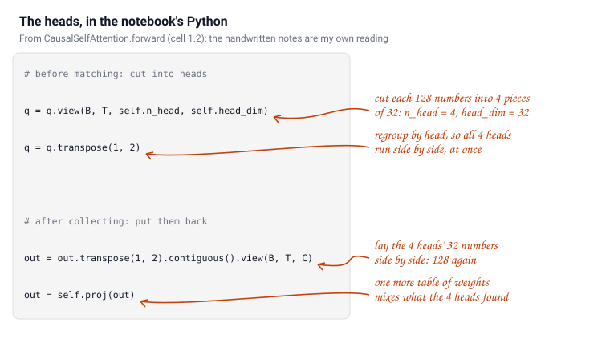
*The head lines again, with a note beside each line in my own words*

### Token embeddings and position embeddings

One level further in: where do the hidden states that go into block 1 come from? This is the model's first step. Each letter in the text has an ID number, which the last layer, below, explains; for now, it is enough that `g` is 45 and `o` is 53. Each ID picks a row from a table. The table has one row for each of the 65 letters, and each row holds 128 numbers: the machine's starting point for that letter. This row is the letter's *token embedding*, and a list of numbers like this is called a *vector*. It helps to picture the table as a box of flashcards, like the alphabet cards preschoolers learn from. The front shows the letter. On a preschool card, the back would say "a is for apple", with a picture. Here, the back holds the 128 numbers. In my trained model, the `g` token embedding begins −0.049, 0.032, 0.014, 0.030, and carries on for another 124 numbers. [The next post](/posts/minigpt-grown/#the-payoff-growing-the-exhibit-exactly) shows where those numbers came from. Every lowercase `o` gets exactly the same token embedding, with the same 128 numbers, wherever it appears. A capital `O` gets a different one.

There is no limit on copies: `goo` simply looks up the `o` row twice. There is a row for every capital *and* every lowercase letter, because to the model `G` and `g` are completely different letters. On top of those 52, there are 13 more: the space, the new line, ten punctuation marks, and the digit `3`. That last one is only there because the text labels 27 speeches `3 KING HENRY VI`, so the table includes a whole row for a letter that appears just 27 times in 1.1 million.


*Each token embedding pictured as a flashcard: the letter on the front, and its 128 real numbers on the back*

Three things to know about these numbers:

- **The numbers are fixed.** In a trained machine, every token embedding is as good as printed in ink. The `g` row has exactly the same 128 numbers every time a `g` appears, in every piece of text, today and tomorrow. Writing, chatting, and answering questions never change a single one of them. The only way to change them is to train the machine again.
- **Nobody wrote them.** There is no "number 7 is how vowel-like this is". None of the 128 numbers has a name.
- **Training chose them.** Every fixed number in the machine is called a *parameter*: all 826,433 of them in my small model. I picture each one as a dial, and training is what turned each dial to where it is now. How it settled on these exact numbers is the subject of [the next post](/posts/minigpt-grown/). In this post, the parameters are simply given, like a printed set of flashcards that I can copy as often as I like.

There is also a table of *position embeddings*. Picture the text as a row of numbered positions: position 1, position 2, and so on, with one vector for each position. This time, one of each is enough: a text might need a dozen copies of the `o` row, but my machine only ever needs the same 128 position embeddings, because a text never has two position 1s. Every letter takes the next position, whether it was in the text the machine was given or the machine has just written it, and its token embedding is combined with that position's embedding. Position embeddings work just like token embeddings: each one is 128 numbers, fixed by training in exactly the same way, so the two can be combined by simply adding them, number by number. So once a letter is placed on a position, the machine knows both what the letter is and where it sits. The position embedding is the only thing that tells the two `o`s in `goo` apart at this stage.


*Each position embedding pictured as a card: the position number on the front, and its 128 real numbers on the back*

Here is the real `g` token embedding, the real position 1 embedding, and what they add up to:


*Adding them is plain addition, number by number. The result depends on both the letter and its position*

Adding each token embedding to its position embedding gives every position its starting vector, called its *input embedding*. For `goo` there are three: position 1 starts as the `g` embedding plus the position 1 embedding, position 2 as the `o` embedding plus the position 2 embedding, and position 3 as the `o` embedding plus the position 3 embedding. The blocks then rewrite these vectors, and from then on each one is called a *hidden state*: one for each position.

This is the last time the machine looks at letters. From here on, everything happens to the hidden states. The token and position embeddings are not touched again: they stay fixed, ready for the next text.

:::under-the-hood All 128 numbers in the `g` token embedding
These are the exact numbers in my trained model, rounded to three decimal places, eight to a row. The colours in the pictures above are these numbers: blue for those above 0, orange for those below.

```
 -0.049,   0.032,   0.014,   0.030,   0.005,   0.005,  -0.015,   0.020
  0.033,  -0.008,   0.028,   0.008,  -0.024,  -0.012,   0.037,   0.020
  0.059,  -0.035,  -0.010,  -0.036,  -0.026,   0.029,  -0.062,  -0.032
 -0.001,  -0.005,  -0.022,  -0.061,   0.015,  -0.031,  -0.060,   0.017
 -0.029,   0.041,  -0.008,  -0.033,  -0.025,  -0.016,  -0.040,  -0.032
 -0.043,  -0.030,  -0.035,   0.025,   0.018,  -0.079,  -0.078,   0.047
 -0.002,   0.010,   0.071,  -0.008,  -0.036,   0.082,  -0.029,   0.040
  0.036,   0.051,  -0.024,  -0.028,   0.005,   0.014,   0.004,  -0.010
 -0.009,  -0.097,  -0.115,  -0.042,  -0.081,   0.051,   0.032,   0.015
  0.000,  -0.059,  -0.002,   0.051,   0.024,   0.026,   0.006,   0.017
 -0.019,  -0.007,  -0.002,  -0.012,   0.058,  -0.008,   0.001,  -0.041
  0.069,  -0.027,  -0.036,   0.016,   0.070,  -0.012,  -0.026,  -0.015
 -0.036,   0.067,  -0.054,  -0.028,  -0.047,  -0.029,   0.004,   0.005
  0.022,  -0.028,   0.024,   0.032,   0.041,   0.006,   0.007,   0.063
 -0.019,  -0.031,  -0.011,   0.030,  -0.053,  -0.007,  -0.001,   0.014
 -0.003,   0.006,   0.025,   0.020,   0.009,   0.011,   0.082,   0.065
```
:::

In the notebook, the two tables are `token_embedding` and `position_embedding`.

How *many* position embeddings there are is fixed in advance, when the machine is built. There is one for each position, and the number of positions is the most letters the machine can look at when it chooses the next letter. That limit is called the *context length*, and in the notebook it is `block_size`. I come back to it, and what it costs to raise it, in [How much can it see at once?](#how-much-can-it-see-at-once-the-context-limit)

:::under-the-hood How the position embeddings relate to each other
On its own, one position embedding looks as meaningless as a token embedding. The interesting part is how they relate to each other:


*The bright diagonal shows that neighbouring positions ended up with similar embeddings. Nobody arranged that: training did*

On average, the embeddings for neighbouring positions score 0.65 for how alike they are, where two random vectors would score about 0. Positions far apart point the opposite way: embeddings 100 positions apart score −0.35. So without being told, the machine turned its position embeddings into a kind of ruler, where "position 41" feels close to "position 42" and far from "position 120". That is just the kind of information attention needs, to find "the hidden state one position before me".
:::

:::watch-it
The token and position embeddings are not the model, and an embedding on its own cannot tell you what comes next. They are just a lookup table: `o` always gives the same vector, whatever came before it. The two tables together hold 24,704 of the small model's 826,433 parameters, about 3%. Almost all the rest, 96%, live in the blocks described next, and that is where the hidden states get combined.
:::

Try it below. Pick any letter in the text, and see its token embedding and its position embedding add up to the input embedding that block 1 receives.

:::demo minigpt-embed
:::

:::test-drive Add two embeddings
1. Start with `goo`, and pick the `g`. Its token embedding begins −0.049, 0.032, 0.014, the numbers in the pictures above, and the position 1 embedding begins 0.043, −0.032, 0.041. The input embedding begins −0.006, −0.001, 0.055: each number is just the sum of the two above it, allowing for rounding.
2. Pick the first `o`, then the second. Their token embeddings are identical, because they are the same letter. Their position embeddings differ, so their input embeddings differ too: this is the only thing that tells them apart before block 1.
3. Type `ooo` and step through the three `o`s. Same token embedding every time; a different position embedding every time.
:::

### Embeddings in the original Python

```python
# 1 text, 3 letters
B, T = idx.shape
# the positions: 0, 1, 2
pos = torch.arange(0, T)
# look up a token embedding for each ID
tok_emb = self.token_embedding(idx)
# look up a position embedding for each position
pos_emb = self.position_embedding(pos)
# add them: the input embeddings, the first hidden states
x = tok_emb + pos_emb
```

These are the first lines of `MiniGPT.forward`, before the blocks. Python counts from 0, so position 1 in this post is row 0 in the code.

`self.token_embedding` is the table of token embeddings. The model's `__init__` creates it as `nn.Embedding(config.vocab_size, config.n_embd)`: a table with 65 rows, one per letter, and 128 columns. Looking up an embedding is picking a row: `g` picks row 45, and both `o`s pick row 53. `self.position_embedding` is the same kind of table, `nn.Embedding(config.block_size, config.n_embd)`, with one row per position. Before training, `__init__` fills both tables with small random numbers, with a standard deviation of 0.02, and training then tunes them.


*Each letter's ID picks one row of the table, and that row's 128 numbers become the letter's token embedding. Both copies of `o` get the same row*

`x = tok_emb + pos_emb` is where the hidden states are born. `x` holds one hidden state per position, 128 numbers each, and from here to the end of `forward`, `x` *is* the hidden states. The code never makes a new variable for them: every block overwrites `x`.

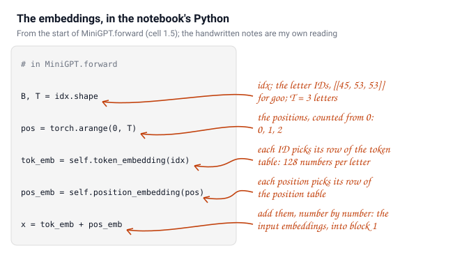
*The embedding lines again, with a note beside each line in my own words*

### Letters to numbers

The last layer of the box, and the first thing the model does. Computers need numbers, so each of the 65 letters in the vocabulary gets an ID: its place in the list of all 65, sorted into the computer's standard order. In Tiny Shakespeare, `g` is 45, `o` is 53, and `d` is 42, so `goo` becomes `[45, 53, 53]`. That is all this step does. But an ID is just a name tag. 53 is not "more" than 45 in any way that helps, so the model cannot do much with the ID itself. That is why the very next step swaps each ID for its token embedding, as the layer above showed.

Try it below. Type anything, and watch each letter become its ID.

:::demo minigpt-ids
:::

:::test-drive Turn letters into numbers
1. Start with `goo`: `[45, 53, 53]`. Both `o`s get the same ID.
2. Type `Go`. A capital `G` is 19, a different letter altogether, as far as the model is concerned.
3. Type `café`. The `é` is not in Tiny Shakespeare, so it has no ID, and the model never sees it.
4. Look at the whole vocabulary: the new line is 0, the space is 1, and `z`, at 64, is last.
:::

### Letters to numbers in the original Python

In Jibin Joseph's notebook, the vocabulary and the IDs are built from the text itself, in section 2.2. These are the notebook's own lines and comments:

```python
# Sorted list of unique characters in the dataset.
chars = sorted(list(set(text)))

# Dictionary that maps each character to an integer token ID.
stoi = {ch: i for i, ch in enumerate(chars)}

# Dictionary that maps each integer token ID back to a character.
itos = {i: ch for i, ch in enumerate(chars)}

# Encode a string into a list of integer token IDs.
def encode(s):

    # Convert each character in the string into its integer ID.
    return [stoi[ch] for ch in s]
```

`set(text)` keeps one copy of each different character in all 1.1 million letters of Tiny Shakespeare, and `sorted` puts them in order: 65 of them. `stoi`, "string to integer", looks up a letter's ID, and `itos` goes back the other way, which is how the model's IDs become text again when it writes. `encode` would stop with an error on a character that is not in the vocabulary; the demos on this page skip it instead.

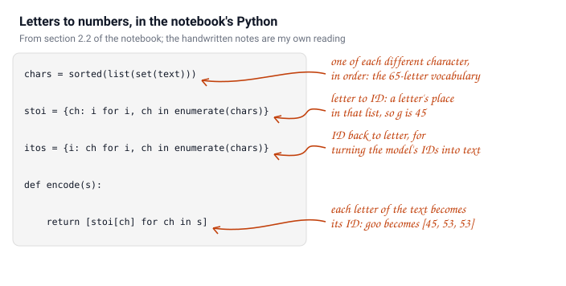
*The vocabulary code again, with a note beside each line in my own words*

That is the bottom of the box. Starting from the outside, I have opened every layer: the wheel, the scores, `lm_head`, the four blocks, the MLP, attention, the heads, the embeddings, and now the IDs. There is nothing left inside that this post has not shown, in plain words, in a demo you can try, and in the notebook's Python.

### The five steps

That is every layer, from the outside in. Here they are the other way round, in the order the model runs them: every time it writes one letter, it goes through the same five steps.


*The five steps. Plain names in black; the names you will meet in the notebook in grey*

Here are all five at once, for `goo`, with the real numbers from my trained model:


*The whole journey for `goo`, with the real numbers from my trained model*

### Putting it together: choosing the next letter

Here is the whole journey once more, step by step, for choosing the next letter after `goo`. The two tables of embeddings are only the start. Almost everything that matters happens in the blocks.

1. **Look up.** For each letter written so far, in order (`g`, `o`, `o`), add its token embedding to its position embedding. That gives one input embedding per position.
2. **Run four blocks.** Each block is attention followed by the MLP, and every block rewrites every hidden state. By the end, each hidden state carries a mix of the earlier positions, so hidden states 2 and 3, which both started from an `o`, are now very different.
3. **Read only the last hidden state.** It started as just the final `o`, but after four blocks its numbers stand for the whole of `goo` so far.
4. **Turn it into chances.** The machine scores the last hidden state against the 65 rows of `lm_head`, one for each letter. That is one more fixed, learned table, 65 rows of 128 numbers each. The better the match, the bigger the chance. The 65 chances add up to 100%.
5. **Spin the wheel,** and write down whatever letter stops under the pointer. Almost every time, it is `d`.
6. **Repeat.** Add the `d` to the end of the text, look up its embeddings, and go back to step 2 with `good`. The notebook really does rerun all the blocks on every position for every new letter.

:::watch-it
The row cannot grow for ever. Until it fills every position, the machine keeps all of it, so after `goo` it really does go back to step 2 with all four letters of `good`. Once every position is taken, each new letter pushes the oldest one off the front, and that letter is forgotten completely. [The next section](#how-much-can-it-see-at-once-the-context-limit) explains the limit, and what it would take to raise it.
:::

### Try it: my trained machine, running in your browser

Everything at once. This is my MiniGPT model itself, all 826,433 numbers of it, running in this page. Nothing is sent anywhere: the five steps happen on your own computer. Type anything, and watch the chances for the next letter change as you type. Then spin the wheel, or let it write 200 letters. Use the sliders to try temperature and the wheel trimming, and use the block and head buttons to look inside any of its 16 attention heads.

:::demo minigpt
:::

A few things to try:

- Type `goo`, and check that you get the same 96.6% for `d` as the rest of this post.
- Type `First Citizen:` and a new line, and let it write. It has learned what a speech looks like.
- Set temperature to 0, and watch it fall into a loop. Then set it to 2, and watch it invent words.
- Look at block 1, heads 1 and 3, on any text you like: one position back, and two positions back, every time.

### How much can it see at once? The context limit

My machine can see at most 128 letters at a time. That limit is called the *context length*, or *context window*, and in the notebook it is `block_size`. Anything further back than 128 letters is simply gone: the machine has no idea it was ever there.

The limit comes from the position embeddings. There is one for each position, and there are 128 of them, so there is no position 129 to put a letter on.

:::watch-it
The context length has nothing to do with how many numbers are in each vector. In fact, the machine has four separate settings, and in my small model they pair up by coincidence: two of them are 128, and two of them are 4. Each can be changed without the others, and the bigger model in the notebook shows it:

| Setting | What it decides | My model | The bigger model |
|---|---|---|---|
| Vector size (`n_embd`) | how many numbers are in every vector: token embeddings, position embeddings, and hidden states alike | 128 | 384 |
| Number of positions (`block_size`) | how many letters it can see at once: the context length | 128 | 256 |
| Number of heads (`n_head`) | how many separate queries each hidden state makes in attention | 4 | 6 |
| Number of blocks (`n_layer`) | how many blocks of attention and MLP | 4 | 6 |

None of them depends on the text you type: a 3-letter row and a 128-letter row go through exactly the same 4 blocks of 4 heads. There are only two links between them. A position embedding must be as long as a token embedding, because the two are added together, and the vector size must divide evenly by the number of heads.
:::

So why not simply give the machine thousands of positions? Because seeing further costs more in four ways:

1. **More to learn.** Every extra position needs its own position embedding, and it has to be learned in training like every other parameter. The practice snippets have to be as long as the row, too, so that the machine actually practises using the far positions.
2. **Much more expensive attention.** In attention, every hidden state matches its query against the key of every earlier position. Twice as many positions means about four times as many checks, and four times as much memory for the grid of attention. Ten times the positions means about a hundred times the checks.
3. **Slower writing.** Every new letter is chosen by running the whole row through all four blocks, so a longer row makes every single letter slower to write.
4. **Seeing is not the same as using.** A machine with more positions only gets better if it learns to use the far-away letters, and that needs practice text where letters far back really matter.

This is the same limit you meet in chatbots, where it is called the context window and counted in tokens rather than letters. Today's models can see hundreds of thousands of tokens at once. They get there partly with better ways of marking positions than a fixed table of position embeddings, like the rotary position embeddings I tried in [MiniGPT (Part 5)](/posts/minigpt4/), and partly with cheaper kinds of attention, like the windowed attention in [MiniGPT (Part 7)](/posts/minigpt6/). Windows are usually mixed with some blocks of full attention, because, as Part 7's secret-word test shows, a window does not reach further back on its own.

### Beyond the guessing game: tools, harnesses, and agents

A GPT can only guess the next piece of text, yet chatbots check the weather, read files, and run programs. The trick is that the model *writes a request*, such as `{"tool": "get_weather", "location": "NYC"}`, and an ordinary program around it, the **harness**, spots the request, carries it out, and adds the result to the text, so that the model carries on guessing with the answer in front of it. The model never runs anything itself; it only ever writes text, and models learn to write these requests in a later stage of training, covered in [the next post](/posts/minigpt-grown/#expensive-for-computers-cheap-for-people). An **agent** is what you get when a harness lets the model keep that loop going by itself, for many steps, towards a goal. My MiniGPT could not do any of this: it never saw a request, and 128 letters is far too short to hold one. I wrote more about organising agents in [Agent Orchestration](/posts/orchestration1/), and about plugging tools into a harness in [Model Context Protocol](/posts/rag1/).

### Why the big models do not use letters

Back at the start, I asked why the big models do not guess one letter at a time. There are three reasons, and attention explains the first one:

- **The rows get longer, and attention gets much more expensive.** A piece of a word is about four letters of English on average, so the same text needs about four times as many positions if every letter has its own. In attention, every position checks every position before it, so four times the positions means about sixteen times the checks.
- **The early blocks waste their time spelling.** With letters, the first blocks have to assemble `t`, `h`, `o`, `u`, `g`, `h`, `t` into a word before any meaning can start to build up. With a token embedding for the whole word, the meaning is there from the start.
- **But the pieces cannot be too big, either.** A token for every whole sentence would be useless: most sentences turn up only once, so their embeddings could never be tuned. Words and pieces of words are the balance.

In [MiniGPT (Part 3)](/posts/minigpt2/), I swap MiniGPT's letters for pieces of words to see what difference it makes.

### We know the rules, not the result

Everything in this introduction (the embeddings, attention, the MLP, the wheel) is a calculation that can be written down exactly. The notebook does all of it in a few hundred lines. What nobody can write down is what the trained parameters *mean*. Nobody chose them: they grew. Working out what a trained model has actually learned is a research field of its own, called *interpretability*, and for big models it is mostly unsolved. In that sense a language model really is a black box: not because the machinery is secret, but because what the machinery learned was never written down by anyone. Here is one small peek inside.

### A peek inside: which letters end up alike?

Nobody tells the machine that `A` and `a` are the same letter, or that a full stop and a question mark do a similar job. So once training has tuned the token embeddings, which ones end up looking alike? I compared every letter's token embedding in my trained model with every other letter's. A score of 1 would mean two embeddings carry identical numbers, 0 means they are unrelated, and a negative score means they point opposite ways.

| Letter | The letters whose embeddings are most like it |
|---|---|
| `a` | `A` (0.50), then `$`, `E`, `u`, `o` |
| `t` | `T` (0.61), then `d`, `w`, `,` |
| `q` | `Q` (0.71), then `J`, `j` |
| `,` | `;` (0.83), then `!`, `:`, `?` |
| `.` | `?` (0.83), then `!` (0.80) |
| space | `-` (0.31), then the new line (0.30) |

Three things jumped out at me:

- **Capital and lowercase letters pair up.** Across all 26 letters, a capital and its lowercase letter score 0.46 on average, while two letters picked at random score about 0. The machine worked out for itself that `A` and `a` are, in some sense, the same letter.
- **Punctuation splits into two families.** The comma sits right next to the semicolon (0.83), with the colon nearby: marks that mean "pause". The full stop sits next to the question mark (0.83) and the exclamation mark (0.80): marks that mean "this sentence is over".
- **The vowels are a weaker family.** Vowels' embeddings are only slightly alike (0.14 on average), and slightly unlike the consonants (−0.06). Look at the `a` row above: apart from an odd `$`, the embeddings most like `a` are other vowels'.

Here are all 65 token embeddings on one map, squashed from 128 numbers down to 2 so they fit on a page:


*The punctuation marks gather on the right, the vowels drift towards the top, and most capitals sit on the left. The pairing of capitals with their lowercase letters does not survive the squash, but it is there in the full 128 numbers*

None of this was programmed in. The only instruction the machine was ever given was to get better at guessing the next letter, and these families of letters are what that instruction grew. [The next post](/posts/minigpt-grown/) shows how.

:::no-dumb-questions
These are the questions I had to ask before any of this made sense to me.

**Q: Does it always get it right?**

A: No. Ask it to finish Romeo's famous line, *But soft, what light through yonder windo…*, and it gives the right letter, `w`, only 7.8%. It prefers `m` and `n`. The line appears exactly once in the million letters it learned from, and *window* only 13 times in all, so a small machine that has read one short book does not know Shakespeare the way you do.

**Q: So where do the embeddings come from, both the token embeddings and the position embeddings? Who writes the numbers in?**

A: Nobody. Both tables come from the same place. The model creates them filled with small random numbers, and the guessing game tunes them like every other parameter, as [the next post](/posts/minigpt-grown/) shows. During training, every embedding changes a little on every step: the `g` token embedding, the position 3 embedding, and all the rest. Once training stops, both tables are frozen.

**Q: I thought language models were neural networks, like the one in [Machine Learning (Part 9)](/posts/machinelearning9/)?**

A: They are. Every part of this machine is a neural network in that sense: lots of parameters, tuned by training. The MLP is even the same kind of two-layer network as my handwritten-digit reader. What is new is attention. The digit reader took in all 784 pixels of one picture at once. A language model gets a row of letters of any length and works on each position's hidden state separately, so it needs attention to let the hidden states share information. Put attention in front of each MLP, stack four of those blocks, and you have a GPT.

**Q: Blocks, heads, queries, keys, and values is such an odd design. How did anyone come up with it, and when did people know it would work?**

A: Mostly, nobody designed it from scratch: the 2017 authors put together pieces that already worked. Attention was invented in 2014 for translation, by [Bahdanau, Cho, and Bengio](https://arxiv.org/abs/1409.0473), to let a network look back at the most relevant words of the sentence it was translating. Queries, keys, and values came from earlier work on [memory networks](https://arxiv.org/abs/1503.08895), which borrowed the language of looking things up. Adding back onto the hidden states came from [ResNet](https://arxiv.org/abs/1512.03385) in 2015, and normalising from [layer normalisation](https://arxiv.org/abs/1607.06450) in 2016. The new idea in [Attention Is All You Need](https://arxiv.org/abs/1706.03762) is its title: keep only attention, and drop the older networks' habit of reading one position at a time. Attention looks at every position at once, so the whole row can be worked on in parallel, which made it much faster to train. Several heads, the √32 shrink, and the position signals were engineering choices, kept because they worked in experiments, not derived from any theory.

It worked for translation straight away: the paper beat the best English-to-German system after 3.5 days of training on 8 GPUs, a fraction of the earlier cost. That it was a general-purpose machine only became clear over the next three years. In 2018, GPT-1 and [BERT](https://arxiv.org/abs/1810.04805) took over most language tests; in 2019, GPT-2 wrote surprisingly coherent text; in 2020, [scaling laws](https://arxiv.org/abs/2001.08361) and [GPT-3](https://arxiv.org/abs/2005.14165) showed it kept improving as it grew, and the [Vision Transformer](https://arxiv.org/abs/2010.11929) showed the same design reading pictures. The authors themselves wrote about translation.

**Q: So is the guess just the letter whose token embedding the last hidden state is closest to?**

A: Not in my model, although it is a good guess about how it might work. I tried it. Compared with the 65 token embeddings, the last hidden state for `goo` is closest to `n`, `E`, and `e`, and `d` comes 47th out of 65. Compared with the 65 rows of `lm_head`, `d` comes first by a long way (0.63, against 0.25 for the next best). That is why the machine needs its own `lm_head`: describing a letter going in and predicting a letter coming out turned out to be different jobs. Many other models, including GPT-2 and the notebook's own stronger model in [the next post](/posts/minigpt-grown/), do use the token embeddings as the rows of `lm_head` too. That is called *weight tying*, and it saves a whole table of numbers. My model keeps the two tables separate, as the notebook's small model does.

**Q: Is "added" really just adding? What if a total gets too big?**

A: Yes, it is plain addition: the first number of the `g` token embedding plus the first number of the position 1 embedding, then the second plus the second, and so on, 128 times. The result is a new vector, so the two `o`s in `goo` start the blocks with different numbers. Nothing overflows, because the numbers are tiny. The biggest number in any embedding in my model is 0.19, and the biggest total of any token embedding plus any position embedding is 0.27, while the computer can store numbers up to about 3 followed by 38 zeros. The normalisation before each step in the blocks keeps the numbers in a sensible range after that, too.

**Q: Could I give the machine more positions, so that it can see more letters?**

A: Yes, but it costs. The number of positions is the context length, and [How much can it see at once?](#how-much-can-it-see-at-once-the-context-limit) explains what raising it involves.
:::

:::pencil Who does what?
Before you look at the decoder below, match each name on the left with what it is on the right.

| Name | What it is |
|---|---|
| 1. token embedding | A. the rule "only look at earlier positions" |
| 2. position embedding | B. the tables of weights that make queries, keys, and values |
| 3. `lm_head` | C. a letter's row of 128 learned numbers |
| 4. causal mask | D. spinning the wheel |
| 5. residual stream | E. the 65 rows that score each letter that could come next |
| 6. sampling | F. a position's row of 128 learned numbers |
| 7. query, key, and value projections | G. the hidden states, as every block adds to them |

:::answer
1 is C, 2 is F, 3 is E, 4 is A, 5 is G, 6 is D, and 7 is B.
:::
:::

### The jargon decoder

The terms for the whole series are collected in one table, [the series glossary](/posts/minigpt6/#the-series-glossary).

Here is each idea from this introduction in plain words, next to its name in the code and in papers. I come back to each one as the notebook reaches it. The words for how the machine is trained are in [the next post](/posts/minigpt-grown/).

| In plain words | What the experts call it |
|---|---|
| the guessing game | next-token prediction, or language modelling |
| a letter: any of the 65 symbols, even the space and the comma | a *character* |
| the thing being guessed: a letter here, a word or piece of a word in big models | a *token* |
| the 65 letters | the *vocabulary* |
| the chances for each possible next letter | a probability distribution, produced by a *softmax* |
| a letter's row of 128 learned numbers | its *token embedding* (`token_embedding`): a *vector* |
| a position's row of 128 learned numbers | the *position embedding* (`position_embedding`) |
| a token embedding plus its position embedding, before block 1 | the *input embedding* |
| the number of positions: how many letters it can see at once | the *context length*, or *context window* (`block_size`) |
| "only look at earlier positions" | the *causal mask* |
| what attention matches and collects | the *query*, the *key*, and the *value* vectors |
| the three tables of weights that make them | the query, key, and value *projections* (`self.query`, `self.key`, `self.value`) |
| keeping the keys and values instead of remaking them | the *KV cache* |
| add, never replace | the *residual connection* |
| the hidden states, as every block adds to them | the *residual stream* |
| a position's vector after a block | a *hidden state* |
| normalising a hidden state before attention and before the MLP | *layer normalisation*, or *LayerNorm* |
| every fixed number that training set | the *parameters*, or *weights* |
| spinning the wheel of chances | *sampling* |
| keeping the biggest k slices | *top-k* sampling |
| keeping the biggest slices until they add up to p | *top-p*, or *nucleus*, sampling |
| the 65 rows that score each letter that could come next | the *language-model head* (`lm_head`), or *output layer* |
| the scores, before softmax | the *logits* |
| a request the model writes for a program to carry out | a *tool call*, or *function call* |
| the program around the model | the *harness* |
| a harness letting the model act by itself for many steps | an *agent* |
| working out what the trained parameters mean | *interpretability* |

## Opening the notebook

The repository is [github.com/jibin10/MiniGPT](https://github.com/jibin10/MiniGPT). The README's recommended path is Colab: click the "Open in Colab" badge, select a GPU runtime (a computer with a graphics chip, a *GPU*, which does this kind of arithmetic much faster than an ordinary processor), and run the cells top to bottom. The notebook is designed to work that way with no local setup at all, but the only dependencies are `torch`, `matplotlib`, and `requests`, so running it on my own hardware was just as easy:

```bash
git clone https://github.com/jibin10/MiniGPT.git && \
cd MiniGPT && \
python3 -m venv .venv && \
source .venv/bin/activate && \
pip install -r requirements.txt jupyter && \
jupyter notebook MiniGPT_Notebook.ipynb
```

The commands are joined with `&&`, so they paste into a terminal as one command, and the chain stops at the first step that fails.


*I cloned the repository and installed the three dependencies plus Jupyter into a fresh virtual environment*

## Notebook part 1: a minimal GPT model

The notebook comes in parts of its own, and builds the model before it loads any data. Its part 1 defines every piece of a small GPT (the embeddings, attention, the MLPs, and the final step that turns a hidden state into chances) and checks that a batch of random letters passes through it.

Here is how those pieces fit together, next to the digit-reading network from [Machine Learning (Part 9)](/posts/machinelearning9/). That network was two *dense layers* in a row: tables of weights of the same kind as this post's, where every number that comes out is a weighted mix of every number that goes in. MiniGPT's MLP is exactly that kind of two-layer network. Attention is the new part, slotted in front of it. Four of those blocks are stacked, and one more dense layer at the end, `lm_head`, turns each hidden state into 65 chances for the letter after it.


*The MLP inside every MiniGPT block is the same kind of two-layer network as my MNIST digit classifier. What is new is the attention step in front of it*

One thing helped me read the code. The notebook's Python is the *blueprint* for the machine: it says what shape every vector and table is, and how they are combined. It does not contain a single trained number. Run it untrained and you get the same machine, filled with random numbers. The trained numbers live in a separate file that training writes out, a *checkpoint*. For my exhibit it is `exhibit.pt`, 3.4 MB of named lists of numbers, and you can download it: [Run my model yourself](#run-my-model-yourself) shows how. The live demo in this post runs the same numbers, copied into a file called `weights.bin`.

:::under-the-hood Where every fixed number lives
Every fixed thing in this post is one named entry in the checkpoint. The names come from the notebook's code, and the four blocks each have their own copy of the block entries, named `blocks.0` to `blocks.3`.

| In this post | Name in the checkpoint | Shape | Numbers |
|---|---|---|---|
| the token embeddings | `token_embedding.weight` | 65 × 128 | 8,320 |
| the position embeddings | `position_embedding.weight` | 128 × 128 | 16,384 |
| **in each of the 4 blocks:** | | | |
| normalise before attention | `ln1.weight`, `ln1.bias` | 128 + 128 | 256 |
| the query weights | `attn.query.weight`, `attn.query.bias` | 128 × 128 + 128 | 16,512 |
| the key weights | `attn.key.weight`, `attn.key.bias` | 128 × 128 + 128 | 16,512 |
| the value weights | `attn.value.weight`, `attn.value.bias` | 128 × 128 + 128 | 16,512 |
| mixing the four heads' results | `attn.proj.weight`, `attn.proj.bias` | 128 × 128 + 128 | 16,512 |
| normalise before the MLP | `ln2.weight`, `ln2.bias` | 128 + 128 | 256 |
| the MLP | `mlp.fc1` (128 → 512) and `mlp.fc2` (512 → 128), weights and biases | | 131,712 |
| **after block 4:** | | | |
| the final normalisation | `final_ln.weight`, `final_ln.bias` | 128 + 128 | 256 |
| the rows of `lm_head` | `lm_head.weight` | 65 × 128 | 8,320 |
| `lm_head`'s biases | `lm_head.bias` | 65 | 65 |
| **total** | | | **826,433** |

What is *not* in the checkpoint matters just as much: the hidden states, the queries, keys, and values, the shares of attention, and the chances. None of them is stored anywhere. The code works them out fresh, from the text in front of it, every time the machine runs. The checkpoint holds everything fixed, and the code makes everything that changes.
:::

The first code cell sits directly under the notebook's part 1 heading and sets up everything the rest of the notebook depends on. This is how it looked after I ran it:


*I ran the first cell. It reported `mps`, the Mac Studio's GPU, because of a small change I made for training, described in [the next post](/posts/minigpt-grown/#using-the-macs-gpu)*

Every line in that cell has a job:

- **`import torch`** brings in PyTorch itself. Its central object is the *tensor*: an n-dimensional array, like a NumPy array, that can also live on a GPU and that records the operations applied to it, so that during training PyTorch can work out which way to turn every parameter, the *gradients*, automatically (*autograd*). [The next post](/posts/minigpt-grown/#how-does-it-know-which-way-to-nudge) explains how. Every number the model stores or computes is held in a tensor.
- **`import torch.nn as nn`** brings in the neural-network building blocks. The notebook builds its GPT from `nn.Module` (the base class that every layer, and the model itself, inherits from), `nn.Embedding` (the token and position lookup tables), `nn.Linear`, `nn.LayerNorm`, `nn.GELU`, `nn.Dropout`, and `nn.ModuleList`, which holds the stack of Transformer blocks.
- **`import torch.nn.functional as F`** brings in stateless versions of the same operations: plain functions with no learnable weights of their own. The notebook uses only two of them: `F.softmax`, which turns attention scores into shares, and `F.cross_entropy`, which only training uses.
- **`from dataclasses import dataclass`** comes from the Python standard library, not from PyTorch. The notebook imports it here so that the next cell, under 1.1, can declare the model's settings as a dataclass.
- **`import math`** is also standard library. The notebook uses `math.sqrt` to divide the attention scores by the square root of the head size, the "shrink" step in attention.
- **`torch.manual_seed(42)`** fixes PyTorch's random-number generator, so random choices come out the same each time I rerun the notebook. When running a trained model, the only random choice is the spin of the wheel.
- **`device`** decides where the arithmetic runs: on a GPU, or on the CPU. Running my small model is quick on any CPU, so nothing here needs changing to run it. The GPU only matters for training, and [the next post](/posts/minigpt-grown/#using-the-macs-gpu) shows the one change a Mac needs.

### 1.1 Model Configuration

The markdown cell under 1.1 lists the sizes for a small model, chosen so it runs easily in Colab, and the code cell below it records them in one place:


*I ran the 1.1 cell, which defines `GPTConfig` with the small model's defaults*

The cell prints nothing when I run it. It only defines a class. No model exists and no memory is used until section 1.6 creates a configuration and builds a model from it.

The `@dataclass` decorator reads the annotated fields and writes the class's `__init__` (plus a readable `__repr__` and an `==` comparison) for me. That lets me create a configuration with the defaults, `GPTConfig()`, or override only the fields I want to change, such as `GPTConfig(n_layer=6, n_embd=384)`. The class has no behaviour of its own. It is a named bundle of numbers that every part of the model reads from.

Each field controls one dimension of the model:

- **`block_size`** is the context length: the maximum number of letters the model can see at once. It sets the size of the position-embedding table and of the causal mask, so the model cannot look further back than this.
- **`vocab_size`** is the number of distinct tokens. It sets the number of rows in the token-embedding table and the number of scores the output layer produces at each position. The default of 65 is a placeholder for testing the model before any data is loaded. It happens to match the 65 letters in Tiny Shakespeare, and the later cells pass in the real value calculated from the text.
- **`n_layer`** is the number of Transformer blocks stacked on top of one another.
- **`n_head`** is the number of attention heads in each block. The attention code checks that `n_embd` divides evenly by `n_head`, because each hidden state's query, key, and value are cut into one equal piece per head: 128 / 4 gives 32 numbers per head.
- **`n_embd`** is the width of the model: the length of every embedding, and so of the vector that represents each position at every layer. Most of the parameter count grows with the square of this number.
- **`dropout`** randomly switches off some numbers during training, to make it harder for the model to memorise its text. When running, `model.eval()` turns it off.

It helps me to picture the data inside the model as a spreadsheet, with one row per position and one column per number in its hidden state:


*`block_size` limits the rows (letters), `n_embd` sets the columns (numbers per letter), and `n_layer` is how many times the sheet is processed*

My exhibit uses exactly these defaults, so `GPTConfig()` with no arguments builds a machine of the right shape for my trained numbers.

## The code, in the order the machine runs

Each layer above showed its own lines of the notebook. This section is the map: where each piece lives in the code, and the writing loop that runs the whole model. The notebook defines its classes bottom-up: attention in 1.2, the MLP in 1.3, one block in 1.4, and the whole model in 1.5. The machine *runs* the other way round, in the order of the five steps. Two kinds of line do nothing while the machine is writing, so I leave them out: the `dropout` lines, which `model.eval()` switches off, and the training-only lines that work out the *loss*, the score that training tries to lower, explained in [the next post](/posts/minigpt-grown/#keeping-score-the-surprise-score).

Every piece in this post is either a fixed set of numbers stored on the model, or a variable that the code works out while it runs:

| In this post | In the code | Fixed or changing? | Shape for `goo` |
|---|---|---|---|
| the letter IDs | `idx` | changing | 1 × 3 |
| all 65 token embeddings | `model.token_embedding.weight`; row 45 is the `g` embedding | fixed | 65 × 128 |
| all 128 position embeddings | `model.position_embedding.weight` | fixed | 128 × 128 |
| the hidden states | `x`, inside `MiniGPT.forward` | changing | 1 × 3 × 128 |
| block 1's query weights | `model.blocks[0].attn.query.weight` and `.bias` | fixed | 128 × 128 and 128 |
| the queries, keys, and values | `q`, `k`, and `v`, inside `CausalSelfAttention.forward` | changing | 1 × 3 × 128 each |
| the shares of attention | `attn` | changing | 1 × 4 × 3 × 3 |
| all 65 rows of `lm_head` | `model.lm_head.weight`; row 42 is the `d` row | fixed | 65 × 128 |
| `lm_head`'s biases | `model.lm_head.bias` | fixed | 65 |
| the scores | `logits` | changing | 1 × 3 × 65 |
| the chances | `probs` | changing | 1 × 65 |

The first number in most shapes is the *batch size*, `B`: how many texts the code handles at once. While training, it handles 32 snippets at a time. While writing, it handles just one, so `B` is 1. The second number is `T`, the number of letters in the row, which is 3 for `goo`.

### The writing loop: `generate_text`

Writing starts in `generate_text`, which the notebook defines in section 3.12. Each time round its loop, it chooses one new letter:

```python
# keep only the last 128 letter IDs
idx_cond = idx[:, -model.config.block_size:]
# steps 1 to 4: run the whole model
logits, _ = model(idx_cond)
```

`idx` holds the letter IDs written so far: `[[45, 53, 53]]` for `goo`. The first line is the context limit from [How much can it see at once?](#how-much-can-it-see-at-once-the-context-limit): it keeps only the last `block_size` letters, because there are no position embeddings beyond that. The second line runs the whole model, which calls `MiniGPT.forward`.

:::bullet-points The code, in the order it runs
- `generate_text` keeps the last 128 letter IDs and runs the model.
- `MiniGPT.forward` looks up the token embeddings and position embeddings, and adds them to make `x`, the hidden states.
- Each `TransformerBlock` rewrites `x`: normalise, attention, add; normalise, MLP, add.
- Attention makes queries, keys, and values with three tables of fixed weights, matches, shares out, and collects.
- `lm_head` scores the hidden states against its 65 rows, and `generate_text` turns the last row into chances and spins the wheel.
:::

## Run my model yourself

Everything in this post can be reproduced with three things: the notebook's model code (sections 1.1 to 1.5), my trained numbers, and the 65 letters in the right order. The quickest way is my follow-along workbook, which has all three and reproduces every number in this post, step by step, from the letter IDs to the GGUF file: [open it in Colab](https://colab.research.google.com/github/Haddley/minigpt-series/blob/main/part1-running/minigpt_follow_along.ipynb), or [download it](https://github.com/Haddley/minigpt-series/blob/main/part1-running/minigpt_follow_along.ipynb). The steps below do the same in the notebook itself. I ran these steps myself, from scratch, in a fresh copy of the notebook, and the pictures below are that run. Any CPU is fast enough.

First, run the notebook's code cells from the top down to the end of section 1.5. That defines `GPTConfig` and the four classes, but builds nothing yet. Then add four new cells.

**Cell 1: download my trained numbers.** This is the checkpoint from [Where every fixed number lives](#notebook-part-1-a-minimal-gpt-model): all 826,433 fixed numbers, under the names the notebook's code expects, in a 3.4 MB file. It is the same model that runs in the live demo.

```python
import urllib.request

# my trained numbers: the checkpoint, 3.4 MB
urllib.request.urlretrieve("https://haddley.github.io/minigpt-demo/exhibit.pt", "exhibit.pt")
```


*I ran the cell in a fresh folder, and it downloaded the 3.4 MB checkpoint. The line it prints just confirms the file name*

**Cell 2: build the machine, load the numbers, and run `goo`.**

```python
# the 65 letters, in order: the position of each one is its ID
chars = list("\n !$&',-.3:;?ABCDEFGHIJKLMNOPQRSTUVWXYZabcdefghijklmnopqrstuvwxyz")
stoi = {ch: i for i, ch in enumerate(chars)}

# build the machine, and load my numbers into it
model = MiniGPT(GPTConfig())
model.load_state_dict(torch.load("exhibit.pt", map_location="cpu"))
model.eval()                 # running, not training: dropout off
model.requires_grad_(False)  # and no records for training

# steps 1 to 4 for goo
idx = torch.tensor([[stoi[ch] for ch in "goo"]])
logits, _ = model(idx)
probs = torch.softmax(logits[0, -1], dim=-1)
for p, i in zip(*torch.topk(probs, 4)):
    print(repr(chars[i]), f"{p.item():.1%}")
```


*I ran the cell, and got exactly the chances from step 4: `d` 96.6%*

Each piece has a job:

- **`chars`** is the vocabulary: every letter that appears in Tiny Shakespeare, sorted into the computer's standard order, which puts the new line first, then the space and punctuation, then the capitals, then the lowercase letters. The order matters, because a letter's ID is simply its place in this list, and my token embeddings and rows of `lm_head` are stored in that order. The notebook builds the same list from the text with `sorted(list(set(text)))` in section 2.2.
- **`GPTConfig()`** with no arguments has exactly my model's settings: 4 blocks, 4 heads, 128 numbers per vector, 128 positions, and 65 letters. The checkpoint only fits a machine of that shape.
- **`load_state_dict`** copies my numbers into the machine, replacing the random ones it was built with.
- **`model.eval()`** switches off dropout, which is only for training, and **`model.requires_grad_(False)`** tells PyTorch not to keep the extra records that training needs.

**Cell 3: look at the parameters.** Each line prints the start of one fixed table from this post:

```python
print(stoi["g"], stoi["o"], stoi["d"])                  # the letter IDs from step 1
print(model.token_embedding.weight[stoi["g"]][:4])      # the g token embedding
print(model.position_embedding.weight[0][:4])           # the position 1 embedding
print(model.lm_head.weight[stoi["d"]][:4])              # the d row of lm_head
print(model.blocks[0].attn.query.weight.shape)          # block 1's query weights
```


*The IDs from step 1, then the first four numbers of the `g` token embedding, the position 1 embedding, and the `d` row of `lm_head`, and the size of block 1's query weights*

**Cell 4: write, by spinning the wheel.** This loop is a cut-down `generate_text`, with a temperature of 0.8 and no trimming. The first line fixes the random spins, so that with the same version of PyTorch you get exactly the text I got; remove it, and every run writes something different.

```python
torch.manual_seed(1)   # remove this line for a different spin each time
idx = torch.tensor([[stoi[ch] for ch in "ROMEO:\n"]])
for _ in range(200):
    logits, _ = model(idx[:, -model.config.block_size:])
    probs = torch.softmax(logits[0, -1] / 0.8, dim=-1)
    next_id = torch.multinomial(probs, num_samples=1)
    idx = torch.cat([idx, next_id.view(1, 1)], dim=1)
print("".join(chars[i] for i in idx[0].tolist()))
```


*200 letters, chosen one spin at a time, after `ROMEO:` and a new line*

### Run it without Python: a GGUF file for llama.cpp

[llama.cpp](https://github.com/ggml-org/llama.cpp) is the program behind many of the tools that run language models on a laptop, and it reads models from a single *GGUF* file: the fixed numbers, plus a note of which design to run and what the tokens are. I exported my model as one, [exhibit.gguf](/minigpt-demo/exhibit.gguf), 3.3 MB, and checked it against PyTorch. On a Mac, these two commands install llama.cpp and make it write:

```bash
brew install llama.cpp
llama-completion -m exhibit.gguf -p $'ROMEO:\n' -n 120 --temp 0.8 --top-k 0 --top-p 1.0 --min-p 0
```

One run of mine wrote:

```
ROMEO:
For a duch a signer house?

YORK:
No ress you taken that is curse.

EXTER:
Where the bring a pattity mish, ble look no g
```

llama.cpp has no MiniGPT of its own, but it does run GPT-2, and MiniGPT is built the same way: learned position embeddings, normalising before attention and before the MLP, biases everywhere, and a separate `lm_head`. So the [export script](https://github.com/Haddley/minigpt-series/blob/main/part1-running/export_gguf.py) relabels each set of numbers with the name llama.cpp expects for GPT-2, and makes two adjustments:

- **Query, key, and value weights go into one grid.** llama.cpp keeps the three tables stacked, one above the other, as a single 384 × 128 grid.
- **`lm_head`'s biases move.** llama.cpp's GPT-2 has no biases on its `lm_head`, but my model does. The final normalisation adds its own fixed numbers just before `lm_head`, so I changed those instead, by exactly the amount that gives every letter the same score as before. Because the 65 rows of `lm_head` are all different from each other, there is exactly one way to do that, and the scores match to within a millionth.

The tokens are the 65 letters, written the way GPT-2 stores them: the space as `Ġ` and the new line as `Ċ`, so `goo` still becomes 45, 53, 53. llama.cpp also insists on an "end of text" token, which my model never learned. Left to itself, llama.cpp picked token 11, which is `;`, and stopped writing at the first semicolon, so I nominated `$` instead: it appears exactly once in all of Tiny Shakespeare.

I compared all 65 chances from llama.cpp with PyTorch's, for four different texts:

| Text ends with | Top letter | PyTorch | llama.cpp | Biggest difference among all 65 letters |
|---|---|---|---|---|
| `goo` | `d` | 96.63% | 96.63% | 0.001 points |
| `good m` | `y` | 40.81% | 40.80% | 0.013 points |
| `my kingdom for a hors` | `e` | 76.57% | 76.61% | 0.035 points |
| `hear me spea` | `k` | 97.97% | 97.96% | 0.001 points |

The tiny differences come from the MLP's bend, GELU: llama.cpp uses a fast approximation of the curve that the notebook calculates exactly. And like PyTorch, llama.cpp stops at 128 letters, because there are no more position embeddings.

## Try it yourself

- The paper: [MiniGPT: Rebuilding GPT from First Principles](https://arxiv.org/pdf/2605.17398) (arXiv:2605.17398)
- Play with a real one: [Transformer Explainer](https://poloclub.github.io/transformer-explainer/) runs GPT-2 in your browser and shows attention and the chances for your own text, and [LLM Visualization](https://bbycroft.net/llm) walks through a small GPT in 3D, one calculation at a time
- Build one step by step: [MicroGPT Visualized](https://microgpt.jtauber.com/) starts from counting pairs of letters and adds one idea at a time
- My follow-along workbook: [open it in Colab](https://colab.research.google.com/github/Haddley/minigpt-series/blob/main/part1-running/minigpt_follow_along.ipynb). It runs my trained model and reproduces every number in this post
- The notebook: [github.com/jibin10/MiniGPT](https://github.com/jibin10/MiniGPT) : open `MiniGPT_Notebook.ipynb` in Colab, or clone it and run it locally, then follow [Run my model yourself](#run-my-model-yourself) to load my trained model. Any CPU will do

## References

- [MiniGPT: Rebuilding GPT from First Principles — Jibin Joseph, 2026](https://arxiv.org/abs/2605.17398)
- [Generative AI with Python and TensorFlow 2 — Joseph Babcock & Raghav Bali, Packt, 2021](https://github.com/PacktPublishing/Hands-On-Generative-AI-with-Python-and-TensorFlow-2)
- [nanoGPT — Andrej Karpathy](https://github.com/karpathy/nanoGPT)
- [minGPT — Andrej Karpathy](https://github.com/karpathy/minGPT)
- [char-rnn and the Tiny Shakespeare dataset — Andrej Karpathy](https://github.com/karpathy/char-rnn)
- [Let's build GPT: from scratch, in code, spelled out — Andrej Karpathy](https://www.youtube.com/watch?v=kCc8FmEb1nY)
- [Attention in transformers, visually explained — 3Blue1Brown](https://www.3blue1brown.com/lessons/attention)
- [Visualizing transformers and attention — Grant Sanderson, TNG Big Tech Day 2024](https://www.youtube.com/watch?v=KJtZARuO3JY)
- [What Is ChatGPT Doing … and Why Does It Work? — Stephen Wolfram, 2023](https://writings.stephenwolfram.com/2023/02/what-is-chatgpt-doing-and-why-does-it-work/)
- [The Illustrated GPT-2 — Jay Alammar](https://jalammar.github.io/illustrated-gpt2/)
- [MicroGPT Visualized — James Tauber](https://microgpt.jtauber.com/)
- [Transformer Explainer — Georgia Tech Polo Club](https://poloclub.github.io/transformer-explainer/)
- [LLM Visualization — Brendan Bycroft](https://bbycroft.net/llm)
- [Generative AI exists because of the transformer — Financial Times, 2023](https://ig.ft.com/generative-ai/)
- [Neural Machine Translation by Jointly Learning to Align and Translate — Bahdanau, Cho & Bengio, 2014](https://arxiv.org/abs/1409.0473)
- [End-To-End Memory Networks — Sukhbaatar et al., 2015](https://arxiv.org/abs/1503.08895)
- [Deep Residual Learning for Image Recognition — He et al., 2015](https://arxiv.org/abs/1512.03385)
- [Layer Normalization — Ba, Kiros & Hinton, 2016](https://arxiv.org/abs/1607.06450)
- [Attention Is All You Need — Vaswani et al., 2017](https://arxiv.org/abs/1706.03762)
- [BERT: Pre-training of Deep Bidirectional Transformers for Language Understanding — Devlin et al., 2018](https://arxiv.org/abs/1810.04805)
- [Language Models are Few-Shot Learners (GPT-3) — Brown et al., 2020](https://arxiv.org/abs/2005.14165)
- [An Image is Worth 16x16 Words (Vision Transformer) — Dosovitskiy et al., 2020](https://arxiv.org/abs/2010.11929)
- [KV Caching Explained: Optimizing Transformer Inference Efficiency — Hugging Face, 2025](https://huggingface.co/blog/not-lain/kv-caching)
- [Scaling Laws for Neural Language Models — Kaplan et al., 2020](https://arxiv.org/abs/2001.08361)
- [The Curious Case of Neural Text Degeneration — Holtzman et al., 2020](https://arxiv.org/abs/1904.09751)
