I spend most of my time using language models, not building them. And "building" is not really the right word: nobody writes a language model's knowledge in by hand. It is grown, by training, and I want to understand that process better, and to be able to explain it. So when I found the paper [MiniGPT: Rebuilding GPT from First Principles](https://arxiv.org/pdf/2605.17398) by Jibin Joseph, I wanted to run it myself. MiniGPT is a single Jupyter notebook that reconstructs the whole GPT training pipeline — tokenisation, embeddings, causal self-attention, Transformer blocks, next-token training, validation tracking, checkpoint selection, and text generation — in plain PyTorch. It does not introduce a new architecture. It makes an existing one legible.

The paper is explicit about its lineage: the author studied Andrej Karpathy's [nanoGPT](https://github.com/karpathy/nanoGPT) and then wrote the model and training code independently in one notebook. That matched how I like to learn a system, so I worked through it top to bottom — but instead of the README's recommended Colab path, I ran it locally on my 2022 Mac Studio (Apple M1 Max, 64 GB RAM).

This post takes a finished, trained machine apart while it runs. I trained a small MiniGPT model on my Mac, using *Tiny Shakespeare*: about 1.1 million letters of Shakespeare's plays, the same text the notebook uses. Shakespeare is all it has ever read, so everything it writes sounds like a play, and every number in this post comes from that one model, my exhibit. How a machine like this gets its numbers in the first place, from nothing, is the subject of [the next post](/posts/minigpt-grown/), and there I grow this exact model again from scratch.

First comes the whole idea in plain English, with no code: a guessing game, a supply of letter flashcards, a set of numbered position cards that records where each letter is, working cards that look back at earlier positions, and a spinning wheel of chances. Then we open the notebook and follow the code, line by line, in the order the machine runs it, matching each line to one of those everyday comparisons. One promise: no magic. Every number in this post is either worked out in front of you, or comes from a run on my own Mac Studio.

Here is the route:

1. **[The guessing game](#the-whole-thing-is-a-guessing-game)**: what a GPT actually does, how it [gives every letter a chance](#it-does-not-pick-a-letter-it-gives-every-letter-a-chance), and how it spins a wheel of chances to choose one.
2. **[The five steps](#the-five-steps)** the machine takes for every letter it writes: [letters to numbers](#step-1-letters-to-numbers), [letter cards and position cards](#step-2-letter-cards-and-position-cards), [the blocks](#step-3-the-blocks), [chances](#step-4-chances), and [spinning the wheel](#step-5-spin-the-wheel).
3. **Inside the blocks**: [attention](#inside-a-block-attention), [queries, keys, and values](#where-the-scratch-cards-come-from), [several heads at once](#several-heads-at-once), [the MLP](#then-the-mlp-each-working-card-on-its-own), and [why there are four blocks](#four-blocks-in-a-row).
4. **[How much can it see at once?](#how-much-can-it-see-at-once-the-context-limit)**: the context limit, and why raising it is expensive.
5. **[Try it](#try-it-my-trained-machine-running-in-your-browser)**: the trained machine, running live in your browser.
6. **[Beyond the guessing game](#beyond-the-guessing-game-tools-harnesses-and-agents)**: how tools, harnesses, and agents let a model do more than write.
7. **Loose ends**: [why the big models do not use letters](#why-the-big-models-do-not-use-letters), and [what nobody knows](#we-know-the-rules-not-the-result) about what the machine has learned.
8. **[The notebook](#opening-the-notebook)**: setting it up, [the model's settings](#11-model-configuration), [the code, in the order the machine runs](#the-code-in-the-order-the-machine-runs), and how to [run my trained model yourself](#run-my-model-yourself).

## The big picture, in plain English

Before any code, here is the whole idea with no jargon at all. Every comparison in this section will help explain the notebook when we get to it. It is the same machine, described through everyday comparisons, and the official names are saved for a decoder table at the end of the section.

### The whole thing is a guessing game

:::brain-power
Guess the next letter:

> KING RICHARD III: A horse! a horse! my kingdom for a hors_
:::

You said `e`, and you did not have to think about it, because you have read a lot of English. A GPT (short for Generative Pre-trained Transformer) is a machine that plays exactly this game. Given some text, it guesses what comes next. Big models like the ones behind ChatGPT guess the next word, or the next piece of a word. The small model in this post guesses one letter at a time. By "letter" I mean any of the symbols in Shakespeare's text, including the space, the new line, and punctuation marks such as the comma. Either way, guessing what comes next is the only thing it ever does.

So what does my trained model say after `hors`? It gives `e` 74.1%, by far its favourite. It agrees with you. You can try the line yourself in [the live demo](#try-it-my-trained-machine-running-in-your-browser).

:::brain-power
Big models guess words, or pieces of words. MiniGPT guesses one letter at a time, which seems simpler and more natural. So why do the big models not use letters too? Keep the question in mind. I come back to it near the end of this introduction.
:::

- **Writing** is the game played on repeat: guess a letter, write it down, stick it on the end, and guess again. Every line of "Shakespeare" this machine writes is produced one letter at a time, like that.
- **Learning** is the game too: guess, check the real answer, adjust, millions of times over. That is how the machine got good at the game, and it is the subject of [the next post](/posts/minigpt-grown/).


*The guessing game, played three times in a row by my trained model, with its real chances. Each time, it gives every possible next letter a chance, picks one, and adds it to the end*

That is the whole idea. Everything else in this post is detail about how the guessing is done.

### It does not pick a letter. It gives every letter a chance

The machine never says "the answer is `w`". It behaves like a weather forecaster. A forecaster does not say "it will rain tomorrow". They say "70% chance of rain". The machine does the same thing for every one of the 65 different letters that appear in Shakespeare: the capitals, the lowercase letters, the space, the new line, and a handful of punctuation marks. After `go`, my trained model says this:

| Next letter | Chance |
|---|---|
| `o` | 34.8% |
| space | 15.6% |
| `d` | 15.4% |
| `n` | 5.7% |
| everything else | 28.5% |

It is not sure yet. The word could become *good*, *go*, *God*, *gone*, and plenty more, so the chances are spread out. One more letter changes everything: after `goo`, it gives `d` 96.6%.

The chances always add up to 100%, because one of the 65 letters has to come next.

### So how does it choose what to write? It spins a wheel

Giving chances is not the same as choosing. When the machine writes, it turns its chances into a choice by spinning a wheel, like a prize wheel at a fair. The wheel has 65 slices, one for each letter, and each slice is as big as that letter's chance. After `go`, the `o` slice covers 34.8% of the wheel, the space 15.6%, the `d` 15.4%, and so on. The machine spins the wheel and writes down whatever letter stops under the pointer.


*The real wheel after `go`. The same text gives the same wheel every time, but each spin can land somewhere different*

Often the wheel lands on `o`. Sometimes it lands on a space. Now and then it lands on one of the thin grey slices, and that is what keeps the machine's writing from being the same every time.

The wheel is not fixed like the letter cards and position cards. The machine works out a brand new wheel for every letter it writes, because every new letter changes the chances.

A machine with random numbers on its dials has slices that are all about the same size, so all it can write is noise. How the dials get the numbers that make some slices big and others thin is the subject of [the next post](/posts/minigpt-grown/).

:::pencil Be the model
Here is another line with its end hidden. Before you read on, write down your own chances for the next letter, as percentages that add up to 100.

> ROMEO: But so_

:::answer
There is no single right answer, which is the point. A sensible set of chances might be:

- `f` 45%, because you are guessing that the next few letters will spell out *soft*, or something similar
- `o` 25%, because you are guessing they will spell out *soon*
- `u` 15%, because you are guessing they will spell out *sound* or *sought*
- 15% spread over everything else

Notice what you just did. In your head, you guessed whole words, but the machine only ever chooses the very next letter. Whatever you wrote, you just did what the model does at every position: you used what came before to give a chance to whatever comes next.
:::
:::

### The five steps

Every time the machine writes one letter, it goes through the same five steps:

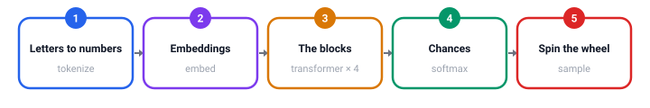
*The five steps. Plain names in black; the names you will meet in the notebook in grey*

Here are all five at once, for `goo`, with the real numbers from my trained model:

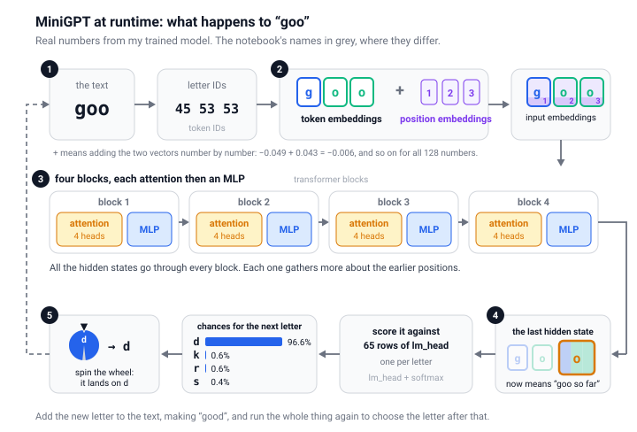
*Each of the next five sections opens up one of these boxes*

### Step 1: letters to numbers

Computers need numbers, so the first step is to give each of the 65 letters an ID. In Tiny Shakespeare, `g` is 45, `o` is 53, and `d` is 42, so `goo` becomes `[45, 53, 53]`. That is all this step does. But an ID is just a name tag. 50 is not "more" than 46 in any way that helps, so the machine cannot do much with the ID itself. It needs something richer, and that is step 2.

### Step 2: letter cards and position cards

So instead, each ID picks a flashcard. Each of the 65 letters has one, like the alphabet cards preschoolers learn from. The front shows the letter. On a preschool card, the back would say "a is for apple", with a picture. On these cards, the back holds 128 numbers: the machine's starting point for that letter. In my trained model, the back of the `g` card begins −0.049, 0.032, 0.014, 0.030, and carries on for another 124 numbers. [The next post](/posts/minigpt-grown/#the-payoff-growing-the-exhibit-exactly) shows where those numbers came from. Every lowercase `o` gets exactly the same card, with the same 128 numbers, wherever it appears. A capital `O` gets a different card.

The supply is bigger than a preschool set, and there is no limit on copies: `goo` simply takes two identical `o` cards. There is a card for every capital *and* every lowercase letter, because to the model `G` and `g` are completely different letters. On top of those 52, there are 13 more: the space, the new line, ten punctuation marks, and the digit `3`. That last one is only there because the text labels 27 speeches `3 KING HENRY VI`, so the supply includes a whole card for a letter that appears just 27 times in 1.1 million.

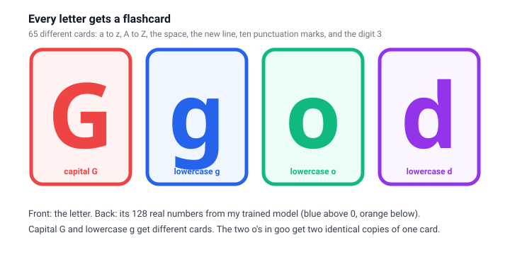
*Each card flips over: the letter on the front, and its 128 real numbers on the back*

Three things to know about these cards:

- **The numbers are fixed.** In a trained machine, the back of every card is as good as printed in ink. The `g` card has exactly the same 128 numbers every time a `g` appears, in every piece of text, today and tomorrow. Writing, chatting, and answering questions never change a single one of them. The only way to change them is to train the machine again.
- **Nobody wrote the backs.** There is no "number 7 is how vowel-like this is". None of the 128 numbers has a name.
- **Training chose them.** How it settled on these exact numbers is the subject of [the next post](/posts/minigpt-grown/). In this post, the cards are simply given, like a printed set that I can copy as often as I like.

There is also a set of position cards. Picture the text as a row of numbered positions: position 1, position 2, and so on, with one card for each position. This time, one of each is enough: a text might need a dozen `o` cards, but my machine only ever needs the same 128 position cards, because a row never has two position 1s. Every letter takes the next position in the row, whether it was in the text the machine was given or the machine has just written it, and its letter card is combined with that position's card. Position cards work just like letter cards: each one has 128 numbers on its back, fixed by training in exactly the same way, so the two can be combined by simply adding them, number by number. So once a letter card is placed on a position, the machine knows both what the letter is and where it sits. That position card is the only thing that tells the two `o`s in `goo` apart at this stage.

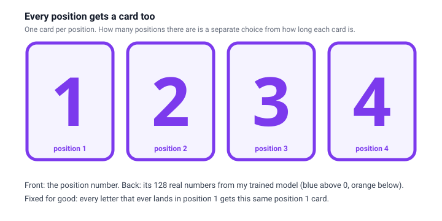
*Each position card flips over: the position number on the front, and its 128 real numbers on the back*

Here is the real `g` card, the real position 1 card, and what they add up to:

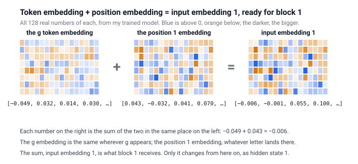
*Adding the cards is plain addition, number by number. The result depends on both the letter and its position*

Adding a letter card to its position card gives a **working card**, one for each position in the text. For `goo` there are three: working card 1 starts as the `g` card plus the position 1 card, working card 2 as the `o` card plus the position 2 card, and working card 3 as the `o` card plus the position 3 card. In the jargon, these starting values are the *input embeddings*.

This is the last time the machine looks at letters. From here on, everything happens to the working cards. The letter cards and position cards are not touched again: they stay fixed, ready for the next text.

:::under-the-hood All 128 numbers on the back of the `g` card
These are the exact numbers in my trained model, rounded to three decimal places, eight to a row. The colours in the pictures above are these numbers: blue for those above 0, orange for those below.

```
 -0.049,   0.032,   0.014,   0.030,   0.005,   0.005,  -0.015,   0.020
  0.033,  -0.008,   0.028,   0.008,  -0.024,  -0.012,   0.037,   0.020
  0.059,  -0.035,  -0.010,  -0.036,  -0.026,   0.029,  -0.062,  -0.032
 -0.001,  -0.005,  -0.022,  -0.061,   0.015,  -0.031,  -0.060,   0.017
 -0.029,   0.041,  -0.008,  -0.033,  -0.025,  -0.016,  -0.040,  -0.032
 -0.043,  -0.030,  -0.035,   0.025,   0.018,  -0.079,  -0.078,   0.047
 -0.002,   0.010,   0.071,  -0.008,  -0.036,   0.082,  -0.029,   0.040
  0.036,   0.051,  -0.024,  -0.028,   0.005,   0.014,   0.004,  -0.010
 -0.009,  -0.097,  -0.115,  -0.042,  -0.081,   0.051,   0.032,   0.015
  0.000,  -0.059,  -0.002,   0.051,   0.024,   0.026,   0.006,   0.017
 -0.019,  -0.007,  -0.002,  -0.012,   0.058,  -0.008,   0.001,  -0.041
  0.069,  -0.027,  -0.036,   0.016,   0.070,  -0.012,  -0.026,  -0.015
 -0.036,   0.067,  -0.054,  -0.028,  -0.047,  -0.029,   0.004,   0.005
  0.022,  -0.028,   0.024,   0.032,   0.041,   0.006,   0.007,   0.063
 -0.019,  -0.031,  -0.011,   0.030,  -0.053,  -0.007,  -0.001,   0.014
 -0.003,   0.006,   0.025,   0.020,   0.009,   0.011,   0.082,   0.065
```
:::

A position card has to be exactly as long as a letter card, because the machine adds the two together, number by number. In the notebook, the position cards are the *position embedding*.

How *many* position cards there are is fixed in advance, when the machine is built. There is one card for each position in the row, and the number of positions is the most letters the machine can look at when it chooses the next letter. That limit is called the *context length*, and in the notebook it is `block_size`. I come back to it, and what it costs to raise it, in [How much can it see at once?](#how-much-can-it-see-at-once-the-context-limit)

:::under-the-hood How the position cards relate to each other
On its own, one position card looks as meaningless as a letter card. The interesting part is how the position cards relate to each other:

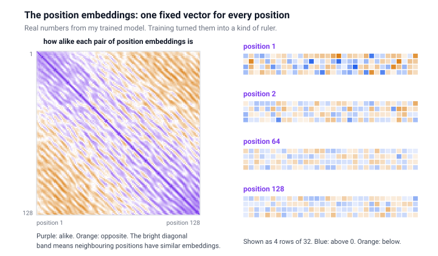
*The bright diagonal shows that neighbouring positions ended up with similar cards. Nobody arranged that: training did*

On average, the cards for neighbouring positions score 0.65 for how alike they are, where two random cards would score about 0. Positions far apart point the opposite way: cards 100 positions apart score −0.35. So without being told, the machine turned its position cards into a kind of ruler, where "position 41" feels close to "position 42" and far from "position 120". That is just the kind of information attention needs, to find "the working card one position before me".
:::

:::watch-it
The letter cards and position cards are not the model, and a card on its own cannot tell you what comes next. They are just a lookup table: `o` always gives the same card, whatever came before it. The two sets of cards together hold 24,704 of the small model's 826,433 dials, about 3%. Almost all the rest, 96%, live in the blocks described next, and that is where the working cards get combined. In the jargon, the back of a letter card is the letter's *token embedding*.
:::

### Step 3: the blocks

After step 2, there is one working card for each position, and each one knows only its own letter and its own position. Step 3 is where the real work happens. The whole row of working cards goes through four *blocks*, one after another, and each block has two parts: **attention**, where each working card looks back at earlier positions and collects information from them, and the **MLP**, a small network that works on each working card on its own. Every block reads the row of working cards and rewrites it. The next sections take one idea each: attention itself, where its query, key, and value cards come from, the real numbers, why there are several heads at once, the MLP, and why there are four blocks.

:::watch-it Fixed or changing?
Two kinds of thing take part from here on, and it helps to keep them apart.

- **Fixed:** everything training set. The letter cards, the position cards, every dial in every block, and the 65 answer cards used in step 4. None of them changes while the machine is writing.
- **Changing:** everything worked out for the text in front of it. That means the working cards, which every block rewrites, and the scratch work inside each block: the query, key, and value cards in attention, and the numbers in the MLP. The scratch work is thrown away at the end of each block. Only the working cards carry anything from one block to the next.

So "the position 3 card" always means the fixed position card, and "working card 3" means the card that changes as it moves through the blocks.
:::

### Inside a block: attention

Here is the problem. Take working card 3, the one that started as the last `o` in `goo`. It says "I am an `o`, in position 3". That is not enough to guess what comes next, because it says nothing about what came *before*. The same `o` could be the second `o` in `good`, in `took`, or in `soon`, and each of those wants a different next letter.

Here is a bigger example from Shakespeare itself. After a blank line, the next thing is almost always a speaker's name and a colon: in 7,219 of the 7,221 blank lines in Tiny Shakespeare. But there are 309 different speakers. Which name comes next depends on who has been talking in the scene, and that information is spread across all the positions before the blank line, not sitting in the one just before it.

So each block starts with *attention*, which has one strict rule: **a working card may only look at working cards in earlier positions, and at itself.** Looking at later positions would be cheating, because the next letter is the answer it is trying to guess.

For attention, every working card makes three short-lived **scratch cards**, called a *query*, a *key*, and a *value*. The names come from searching: you type a query, it is matched against the keys, and you get back the matching values.

- The **query card** says what this working card is looking for in the earlier positions. It keeps this card in its own hand.
- The **key card** says what this working card has to offer. It lays this card face up on the table, where its own position and every later position can read it.
- The **value card** holds what this working card will hand over if it is chosen. It lays this card face down, next to its key card.

Keys and values are separate cards because what makes a working card worth listening to is not the same thing as what it should pass on. Then attention runs in three moves. Each working card:

1. **Matches** its query card against every key card on the table from its own position or earlier.
2. **Shares out** 100% of its attention, in proportion to how well each key card matched.
3. **Collects** that share of each value card, adds them up number by number, and adds the result to itself.

In one of my trained model's attention heads, working card 3 gives 92.9% of its attention to working card 2 (the first `o`), 4.0% to working card 1 (the `g`), and 3.1% to itself, so most of what it collects is working card 2's value card.

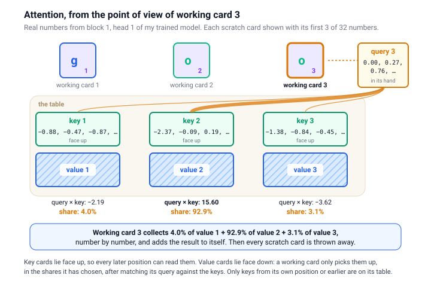
*Attention for working card 3, the last position in `goo`. Its query card matches working card 2's key card best, so most of what it collects comes from working card 2's value card*

After this, working card 3 says something closer to "I am an `o`, and one position before me is another `o`". That is a much better clue, and the other heads add more, as you will see.

### Where the scratch cards come from

The scratch cards are not looked up. A lookup table only works when there is a short list of things that can come in, one row for each: that is why letter cards and position cards can be looked up, because there are only 65 letters and 128 positions. A working card can hold any 128 numbers at all, so no table could ever list them.

Instead, each block has three fixed **recipes**, one for query cards, one for key cards, and one for value cards. Each recipe is a fixed grid of 128 × 128 numbers, called *weights*, plus 128 more fixed numbers, called *biases*. Training set them all, and while the machine is writing they never change, just like the letter cards. To work out one number on a query card, the machine multiplies each of the working card's 128 numbers by its own weight, adds up the 128 results, and adds a bias. It repeats that with a different row of weights for each of the card's 128 numbers. So every number on a scratch card is a mix of *all* 128 numbers on the working card.

Here is one real number from my trained model: working card 3 in `goo`, at the start of block 1. The working card is normalised first, so it starts 0.43, −2.10, 0.22, and so on. The second number on its query card is:

(−0.036 × 0.43) + (−0.038 × −2.10) + (0.030 × 0.22) + … 125 more terms … + 0.093 = **0.27**

Three more things are worth knowing:

- **The recipes belong to the block, not to a position.** Every working card goes through the same three recipes, so two working cards that held the same numbers would make the same scratch cards. Each block has its own three recipes, and between them they hold 49,536 of that block's dials.
- **The scratch cards are all made at once.** Making a working card's scratch cards needs nothing but that working card, so the machine makes the query, key, and value cards for every position at the same moment, in one big multiplication over the whole row.
- **The scratch cards are thrown away.** They exist only during attention. MiniGPT makes them all again from scratch for every new letter, because it reruns the whole row through every block. Big chatbots save that work. Because a working card only ever listens to earlier positions, adding a new letter never changes the working cards before it, so their key and value cards do not change either. Big models keep them instead of remaking them, in a store called the *KV cache*, short for key–value cache ([this Hugging Face post](https://huggingface.co/blog/not-lain/kv-caching) explains it well). Only the newest position needs a new query card.

Nobody chooses what goes on the query, key, and value cards. Training tunes the recipes, just as it tunes the letter cards. So when I describe a query as "was there an `o` one position before me?", that is my reading of 32 numbers, not anything the machine wrote down. A real model's queries and keys mostly have no tidy name at all.

### Queries, keys and values, with real numbers

Here is attention for working card 3 in `goo`, with the real numbers from my trained model, in one of the four heads in block 1. In each head, each card is 32 numbers long; [the heads section](#several-heads-at-once) explains why. Working card 3's query card starts 0.00, 0.27, 0.76, and so on. Matching a query card with a key card means multiplying the two together, number by number, and adding up the 32 results. A big total is a good match.

| | working card 1 (`g`) | working card 2 (`o`) | working card 3 (`o`, itself) |
|---|---|---|---|
| 1. Query × key, added up | −2.19 | **15.60** | −3.62 |
| 2. Divided by √32 | −0.39 | **2.76** | −0.64 |
| 3. Share of attention | 4.0% | **92.9%** | 3.1% |

1. **Match.** Multiply and add. That is all the "dot product" in the notebook is.
2. **Shrink.** Divide by √32, about 5.66, to keep the scores in a modest range. Without this, the biggest score would swamp all the others.
3. **Share out.** A step called *softmax* turns the scores into shares that are all positive and add up to 100%. Step 4 uses the same trick again, to turn the final scores into chances.
4. **Collect.** Working card 3 collects the value cards in those shares: 92.9% of working card 2's, 4.0% of working card 1's, and 3.1% of its own, number by number. After one more step, described under heads below, the result is added to working card 3.

Look at working cards 2 and 3. They started from the same `o` letter card. The only difference between them is their position cards, 2 and 3, and that is enough to give them different key cards. Working card 2's key card matches the query with 15.60, while working card 3's own key card scores −3.62. Without the position cards, the machine could not tell "the `o` one position before me" from "me".

:::watch-it
"Was there an `o` one position before me?" is my reading of this query, not the machine's. The machine has no words, only 32 numbers. What it *measurably* does is look one position back: across 60 passages of Shakespeare, this head puts 96% of every working card's attention on the working card one position before it.
:::

:::brain-power
One head asks one query. Think about working card 3 in `goo`. What are two different things it might want to know about the earlier positions?
:::

### Several heads at once

A block does not run attention just once. It runs it four times side by side, and each copy is called a *head*. Each head gets its own 32-number piece of every query, key, and value card, and every piece is made from the whole working card. Same working cards, same moment, but four different queries, and so four different answers.

:::pencil Draw a head
Imagine a head that has learned one simple habit: every working card puts all of its attention on the working card one position before it, and working card 1, which has nothing before it, attends to itself. Fill in its grid of weights for `goo`.

:::answer
| | 1 (`g`) | 2 (`o`) | 3 (`o`) |
|---|---|---|---|
| working card 1 | 100% | 0 | 0 |
| working card 2 | 100% | 0 | 0 |
| working card 3 | 0 | 100% | 0 |

Every row still adds up to 100%, and the upper-right triangle is still all zeros. After one pass through this head, what each working card collects describes the position before it, which is exactly the clue a character-level model needs. Real heads are rarely this tidy, but this one really exists: the first block of my trained model grew a head that puts about 99% of each working card's attention on the working card one position before it. Head 1 in the table below behaves almost exactly like this.
:::
:::

Here is what working card 3 collects from each of block 1's four heads:

| Head | working card 1 (`g`) | working card 2 (`o`) | working card 3 (itself) | In short |
|---|---|---|---|---|
| 1 | 4.0% | **92.9%** | 3.1% | one position back |
| 2 | **83.4%** | 12.2% | 4.4% | two positions back |
| 3 | **83.4%** | 14.9% | 1.6% | two positions back |
| 4 | 24.7% | **66.5%** | 8.8% | one position back, more loosely |

Between them, the four heads tell working card 3 exactly what it needs to know. Heads 1 and 4 say "one position back, there is an `o`", and heads 2 and 3 say "two positions back, there is a `g`". Put together: `g`, `o`, then me. That is `goo`, and it is why `d` ends up so likely.

The same habits show up on any text. Here are all four heads reading a line from *Romeo and Juliet*:

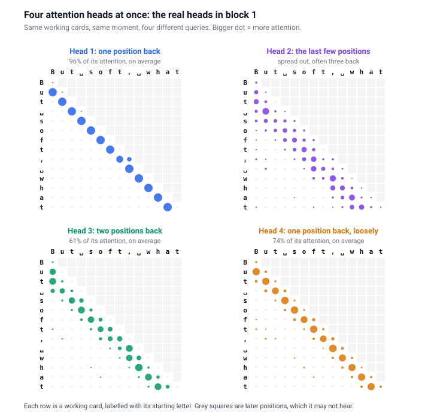
*Real attention, measured from my trained model. Each row is a working card, labelled with the letter it started from, and each dot shows how much attention it gives the working card above*

Nobody designed these habits. Training grew them, because they help with the guessing game. Two heads even learned nearly the same habit: nothing forces heads to be different, and training simply found two copies useful. Between them, after block 1, every working card carries information about the two or three positions before it, which is the same clue you would get by counting which letters follow which, and then some.

At the end of attention, what the four heads collected, 32 numbers each, is laid side by side to make 128 numbers again. One more set of dials then mixes them, so that what all four heads found ends up on the one working card.

Why 32? The machine makes one query card, one key card, and one value card for each working card, each 128 numbers long and each made from the *whole* working card. Then it cuts each of them into four pieces of 32, one piece per head. So the heads share the block's three recipes between them, rather than each adding more. The 4 is not fixed. With 8 heads, each head's query, key, and value would be 16 numbers long: more queries, but cruder ones. The bigger model in the notebook uses 6 heads of 64. More heads is not automatically better; it is a trade-off that model builders settle by experiment. The only rule is that the card size must divide evenly by the number of heads.

### Then the MLP: each working card on its own

Attention is for gathering information from other positions. After it, every working card goes through the *MLP*, short for *multilayer perceptron*: a small two-layer network that works on each working card on its own. Every working card gets the same calculation, but each one sees only its own numbers.

The MLP matters more than it sounds. About two-thirds of each block's dials are in the MLP, rather than in attention.

So what is the MLP for? Grant Sanderson of 3Blue1Brown gives a good rule of thumb in [his talk on transformers](https://www.youtube.com/watch?v=KJtZARuO3JY): where a guess needs *context*, attention supplies it, and where it needs *general knowledge*, the MLP supplies it. His example is a big word-level model completing "Michael Jordan plays the sport of". *Basketball* appears nowhere in the sentence, so it must come from knowledge stored in the dials, and researchers at Google DeepMind found evidence that facts like this live mostly in the MLPs. In our small model the knowledge is humbler. Once attention has gathered that the word so far is `thoug`, knowing that `h` comes next is knowledge of English spelling, not something written in the earlier positions.

:::brain-power
After one block, every working card knows something about the positions just before it. What could a second block of exactly the same kind add that the first could not?
:::

### Four blocks in a row

Attention followed by the MLP makes one *block*. My model runs four blocks in a row, and the bigger model in the notebook runs six. The blocks run one after another. The whole row of working cards that comes out of block 1 is the row that goes into block 2, block 2's row goes into block 3, and so on. After block 4, step 4 reads the last working card. Each block has its own dials: the four blocks are built the same way, but they do not share any numbers, so each one can learn to do something different. With each block, the working cards carry more context: by the later blocks, a working card is less about one letter and more about what is going on around it.

The row that comes out of one block and the row that goes into the next are not two different things: they are the same row of working cards, and in the code they are the same variable. A block never swaps a working card for a new one. It adds to it twice: working card out = working card in + what attention adds + what the MLP adds. Here is how much each block adds to working card 3 in `goo`, where "size" is how big its 128 numbers are taken together:

| Block | Size going in | Attention adds | The MLP adds | Size coming out | How alike in and out are |
|---|---|---|---|---|---|
| 1 | 0.50 | 0.59 | 1.66 | 2.16 | 0.47 |
| 2 | 2.16 | 0.80 | 0.85 | 2.72 | 0.90 |
| 3 | 2.72 | 0.90 | 1.16 | 2.92 | 0.90 |
| 4 | 2.92 | 0.74 | 1.86 | 3.09 | 0.78 |

Block 1 changes the card the most: it adds more than the input embedding held in the first place. Blocks 2 and 3 refine it, so what comes out is still 0.90 like what went in. Block 4 makes a bigger change again, mostly in its MLP, as it gets the card ready for step 4. By the end, working card 3 scores only 0.08 for likeness to the input embedding it started from.

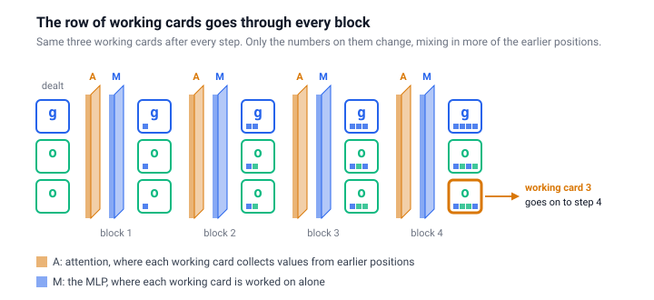
*The whole row of working cards goes through every block together. The coloured squares on each card show how much of the earlier positions it has taken in: working card 1 can only ever take in itself, while working card 3 takes in all three*

Written out in full, the row of working cards goes through eight steps, always in the same order: attention, MLP, attention, MLP, attention, MLP, attention, MLP. The two take turns, and neither ever runs twice in a row. So if you see a diagram of a big GPT as a long stack of slabs labelled "Attention, Multilayer Perceptron, Attention, Multilayer Perceptron…", like the one in [Grant Sanderson's talk](https://www.youtube.com/watch?v=KJtZARuO3JY), it shows exactly what my small model does. The only difference is how many times the pair repeats: GPT-3 repeats it 96 times, with much longer cards.

Two details keep the blocks working well:

- **Add, never replace.** Each block adds to the working cards rather than replacing them, so nothing learned in an earlier block is lost. This also matters for learning: when the dials are tuned, the message about which way to turn them has to travel backwards through every block. Adding rather than replacing gives that message a clear route all the way back, which is why models can be stacked dozens of blocks deep. Because every block adds to the same row of working cards, the row has a name in the jargon: the *residual stream*. It starts as the input embeddings and flows through every block.
- **Normalise before each step.** Before attention, and again before the MLP, the numbers on every working card are rescaled to a standard range, so that no card is shouting. This is called *layer normalisation*.

Why four blocks, and not one? Because each block builds on the last. After block 1, a working card knows about the positions just before it. In block 2, it can look at working cards that have *already* gathered their own neighbours, so it learns about positions further back, and so on. You can see this in the heads themselves. In block 1, the heads look between 1.6 and 5.7 positions back on average. In blocks 2 to 4, they look between 6 and 25 positions back.

You can also watch the guess improve. After each block, I took the last working card as it was at that point, gave it the same final normalisation, scored it against the same 65 answer cards, and turned the scores into chances, exactly as step 4 does after block 4. The answer cards were only ever trained to read block 4's output, so this is a peek rather than something the machine does when it writes, but it works surprisingly well, and researchers use the same trick under the name *logit lens*:

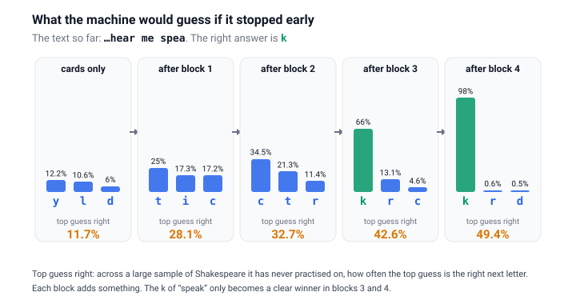
*Real numbers from my trained model. With the input embeddings alone, it guesses the next letter right 12% of the time; after all four blocks, 49%*

With the input embeddings alone, the machine knows only that the last letter is an `a`, so it guesses `y`. Block 1 adds the letters in the positions just before it, and `t` takes the lead. Block 2 has seen enough of `spea` to try `c`. Only in blocks 3 and 4 does the whole picture, *hear me spea*, settle on `k`, at 98%.

:::bullet-points Step 3, the blocks
- Step 2 hands block 1 one working card per position. From then on, the machine works only on working cards, never on letters.
- In attention, each working card makes a query card, a key card, and a value card, using the block's three fixed recipes.
- It matches its query against the key of every working card in an earlier position, and its own, shares out its attention, and collects their values in those shares.
- Four heads run at once, each with its own 32-number piece of every query, key, and value.
- In the MLP, each working card is worked on alone, using knowledge stored in the dials.
- Four blocks in a row let each working card gather information from further and further back.
:::

### Step 4: chances

After block 4, there are still three working cards in the row, one for each position of `goo`, and only the last one, working card 3, matters for the next letter. (The notebook actually scores all three and then keeps only the last row of scores, as [the code walk-through](#the-answer-cards-back-in-minigptforward) shows. The answer is the same.) It went into block 1 meaning just "an `o`, in position 3". But in every block's attention it collected values from working cards 1 and 2, so it comes out of block 4 meaning something more like "an `o` that follows `g` and `o`": in other words, `goo` so far.

Why only the last working card? Because the next letter comes after the last position. The other working cards have done their job: they were what working card 3 looked at in attention.

Working card 3 is still just a list of 128 numbers, starting 0.14, 0.12, 0.41, 0.18, and so on. It describes the situation, `goo` so far, but it does not name a letter. To get from a description of the situation to a guess, the machine uses one last set of fixed cards: the **answer cards**. There are 65 of them, one for each letter that could come next, and each holds 128 numbers set by training, plus one extra number called a *bias*.

Think of each answer card as a profile of the moments when its letter comes next. The `d` answer card says, in effect, "this is what a working card tends to look like just before a `d`". Step 4 holds working card 3 up against all 65 profiles and asks, 65 times, "how well does this situation fit?" The best fit gets the biggest chance.

So the two kinds of card do opposite jobs:

- **A working card** describes *this* text, at *this* position. There is one for each position, it is made fresh for every text, and every block rewrites it.
- **An answer card** describes *a letter that could come next*. There is one for each of the 65 letters, training set it, and it never changes. The same 65 answer cards are used for every text, every time the machine chooses a letter.

Answer cards are not letter cards, either. A letter card describes a letter going *in*: "this is a `d`". An answer card describes a letter about to come *out*: "a `d` probably follows". Training learned the two jobs separately, and in my model the two sets ended up unrelated: on average, an answer card scores 0.00 for likeness to the letter card for the same letter.

Here is how the machine gets from working card 3 to the chances, with the real numbers for `goo`:

1. **Normalise.** The working card is rescaled once more, the same normalisation as before every attention step and MLP. It now starts 0.56, 0.63, 1.72, 0.97.
2. **Score every letter.** For each of the 65 answer cards, the machine multiplies its numbers by the working card's, number by number, adds up the 128 results, and adds the bias. That is the same multiply-and-add as matching a query to a key in attention, and a big score means a good match. The `d` answer card scores 8.58, far ahead of `k` (3.45), `r` (3.41), and `s` (3.01). The lowest is `M`, at −5.77.
3. **Turn the scores into chances.** Softmax, the same trick as in attention, makes every score positive and then divides each one by the total, so that the 65 chances add up to 100%. It also stretches the gaps: `d` is 5 points ahead of `k`, and ends up about 170 times as likely. For `goo`, `d` gets 96.6%, `k` and `r` 0.6% each, and `M` a slice of the wheel far too thin to see.

Those 65 chances are the slices of the wheel in step 5.

### Step 5: spin the wheel

The chances become the slices of the wheel, and the machine spins it. Two adjustments can be made just before the spin, and every chatbot you have used has both.

**Temperature.** One setting, called *temperature*, reshapes the wheel. Turn it down, and the big slices grow and the small ones shrink, so the machine plays it safe: the text is tidy but repetitive. Turn it up, and the slices even out, so the machine takes risks: the text is varied but full of invented words. After `goo` there is little for it to do, because the wheel is already 96.6% `d`. A more open moment shows it better, so here is what it does to my model's chances after `good m`, as in *good my lord* or *good madam*:

| Temperature | `y` | `e` | `a` |
|---|---|---|---|
| 0.5, cautious | 61.1% | 26.6% | 8.5% |
| 1, the wheel as it is | 40.8% | 26.9% | 15.2% |
| 2, bold | 25.9% | 21.0% | 15.8% |

Turn it all the way down to 0, and the machine stops spinning and always takes the biggest slice. Turn it all the way up, and every slice is almost the same size again.

**Trimming the wheel.** Even a good wheel has dozens of thin slices for letters that make no sense. Usually the pointer never stops on them, but spin enough times and it will, and a single nonsense letter can derail everything after it. So the wheel is often trimmed before the spin:

- *Keep the biggest k slices.* The notebook asks for the biggest 200, but my wheel only has 65 slices, so this trims nothing at all.
- *Keep the biggest slices until they add up to p.* With p = 90%, my model's wheel after `good m` keeps just 5 slices: `y`, `e`, `a`, `o`, and `i`, which between them hold about 97% of the chance. The other 60 slices, which shared the remaining 3%, are cut away, and the 5 survivors are stretched to fill the whole wheel before the spin.

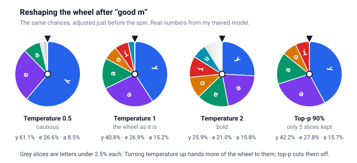
*The real wheel after `good m`, reshaped by temperature and by top-p*

:::fireside-chat Tonight: temperature and the trimmer, on who keeps the writing sensible
**Temperature:** I am the one readers notice. Turn me up, and the writing comes alive.

**Trimmer:** Turn you up too far, and the writing falls apart. You make the thin slices bigger, and most of the thin slices are silly ones.

**Temperature:** And you are a pair of scissors.

**Trimmer:** A pair of scissors that only cuts what nobody wanted. After `good m`, I keep the five slices that make sense and cut away the rest. Then you can be as bold as you like with what is left.

**Temperature:** So I choose how adventurous to be…

**Trimmer:** …and I make sure the adventure stays on the map. Most chatbots use both of us, every single letter.
:::

### Putting it together: choosing the next letter

Here is the whole journey once more, as a recipe for choosing the next letter after `goo`. The two sets of cards are only the start. Almost everything that matters happens in the blocks.

1. **Deal.** For each letter written so far, in order (`g`, `o`, `o`), add its letter card to its position card. That gives one working card per position.
2. **Run four blocks.** Each block is attention followed by the MLP, and every block rewrites the numbers on every working card. By the end, each working card carries a mix of the earlier positions, so working cards 2 and 3, which both started from an `o`, are now very different.
3. **Read only the last working card.** It started as just the final `o`, but after four blocks its numbers stand for the whole of `goo` so far.
4. **Turn it into chances.** The machine scores the last working card against 65 answer cards, one for each letter. That is one more set of fixed, learned cards, 65 of 128 numbers each. The better the match, the bigger the chance. The 65 chances add up to 100%.
5. **Spin the wheel,** and write down whatever letter stops under the pointer. Almost every time, it is `d`.
6. **Repeat.** Deal a working card for the `d` onto the end of the row, and go back to step 2 with `good`. The notebook really does rerun all the blocks on the whole row for every new letter.

:::watch-it
The row cannot grow for ever. Until it fills every position, the machine keeps all of it, so after `goo` it really does go back to step 2 with all four letters of `good`. Once every position is taken, each new letter pushes the oldest one off the front, and that letter is forgotten completely. [The next section](#how-much-can-it-see-at-once-the-context-limit) explains the limit, and what it would take to raise it.
:::

### How much can it see at once? The context limit

My machine can see at most 128 letters at a time. That limit is called the *context length*, or *context window*, and in the notebook it is `block_size`. Anything further back than 128 letters is simply gone: the machine has no idea it was ever there.

The limit comes from the position cards. There is one position card for each position, and there are 128 position cards, so there is no position 129 to put a letter on.

:::watch-it
The context length has nothing to do with how many numbers are on a card. In fact, the machine has four separate settings, and in my small model they pair up by coincidence: two of them are 128, and two of them are 4. Each can be changed without the others, and the bigger model in the notebook shows it:

| Setting | What it decides | My model | The bigger model |
|---|---|---|---|
| Card size (`n_embd`) | how many numbers are on every card: letter cards, position cards, and working cards alike | 128 | 384 |
| Number of positions (`block_size`) | how many letters it can see at once: the context length | 128 | 256 |
| Number of heads (`n_head`) | how many separate queries each working card makes in attention | 4 | 6 |
| Number of blocks (`n_layer`) | how many blocks of attention and MLP | 4 | 6 |

None of them depends on the text you type: a 3-letter row and a 128-letter row go through exactly the same 4 blocks of 4 heads. There are only two links between them. A position card must be as long as a letter card, because the two are added together, and the card size must divide evenly by the number of heads.
:::

So why not simply give the machine thousands of positions? Because seeing further costs more in four ways:

1. **More cards to learn.** Every extra position needs its own position card, and it has to be learned in training like every other card. The practice snippets have to be as long as the row, too, so that the machine actually practises using the far positions.
2. **Much more expensive attention.** In attention, every working card matches its query against the key of every working card in an earlier position. Twice as many positions means about four times as many checks, and four times as much memory for the grid of attention. Ten times the positions means about a hundred times the checks.
3. **Slower writing.** Every new letter is chosen by running the whole row through all four blocks, so a longer row makes every single letter slower to write.
4. **Seeing is not the same as using.** A machine with more positions only gets better if it learns to use the far-away letters, and that needs practice text where letters far back really matter.

This is the same limit you meet in chatbots, where it is called the context window and counted in tokens rather than letters. Today's models can see hundreds of thousands of tokens at once. They get there partly with better ways of marking positions than a fixed set of position cards, like the rotary position embeddings I tried in [MiniGPT (Part 5)](/posts/minigpt4/), and partly with cheaper kinds of attention, like the windowed attention in [MiniGPT (Part 7)](/posts/minigpt6/).

### Try it: my trained machine, running in your browser

This is the exhibit model itself, all 826,433 numbers of it, running in this page. Nothing is sent anywhere: the five steps happen on your own computer. Type anything, and watch the chances for the next letter change as you type. Then spin the wheel, or let it write 200 letters. Use the sliders to try temperature and the wheel trimming, and use the block and head buttons to look inside any of its 16 attention heads.

:::demo minigpt
:::

A few things to try:

- Type `goo`, and check that you get the same 96.6% for `d` as the rest of this post.
- Type `First Citizen:` and a new line, and let it write. It has learned what a speech looks like.
- Set temperature to 0, and watch it fall into a loop. Then set it to 2, and watch it invent words.
- Look at block 1, heads 1 and 3, on any text you like: one position back, and two positions back, every time.

### Beyond the guessing game: tools, harnesses, and agents

A GPT can only do one thing: guess the next piece of text. It cannot check the weather, read a file, or run a program. Yet the chatbots built on GPTs do all of those things. The trick is that the model *writes a request*, and an ordinary program around it carries the request out:

1. **The program lists the tools.** At the start of the text, it tells the model what it may ask for, for example "`get_weather(location)`: the current weather anywhere".
2. **The model writes a request instead of an answer.** Asked "What is the weather in New York?", a model trained for this (in the second stage of training, covered in [the next post](/posts/minigpt-grown/)) writes something like `{"tool": "get_weather", "location": "NYC"}`.
3. **The program carries it out.** It spots the request, calls a real weather service, and adds the result to the text: `{"temp": "72°F", "condition": "sunny"}`.
4. **The model carries on guessing,** now with the result in front of it: "It is currently 72°F and sunny in New York City."

The model never runs anything itself. It only ever writes text, and some of that text happens to be a request. It is the same loop as step 5, with the program slipping extra text into the row now and then.

The program around the model is called a **harness**. It holds the conversation, offers the tools, carries out the requests, feeds the results back, and decides when to stop. Claude Code, which I used while writing this post, is a harness. An **agent** is what you get when a harness lets the model keep that loop going by itself, for many steps, towards a goal: read a file, run a test, read the error, change the code, and run the test again, without a person approving each move. So the harness is the machinery, and "agent" describes how it behaves, although people often use "agent" for the whole package of model, harness, and tools. A standard way of plugging tools into a harness is the [Model Context Protocol](/posts/rag1/), and I compared several ways of organising agents in [Agent Orchestration](/posts/orchestration1/).

My MiniGPT could not do any of this. It was never trained on requests like these, and its row of 128 letters is far too short to hold a conversation with a tool's results.

### Why the big models do not use letters

Back at the start, I asked why the big models do not guess one letter at a time. There are three reasons, and attention explains the first one:

- **The rows get longer, and attention gets much more expensive.** A piece of a word is about four letters of English on average, so the same text needs about four times as many positions if every letter has its own. In attention, every position checks every position before it, so four times the positions means about sixteen times the checks.
- **The early blocks waste their time spelling.** With letters, the first blocks have to assemble `t`, `h`, `o`, `u`, `g`, `h`, `t` into a word before any meaning can start to build up. With a card for the whole word, the meaning is there from the start.
- **But the pieces cannot be too big, either.** A card for every whole sentence would be useless: most sentences turn up only once, so their cards could never be tuned. Words and pieces of words are the balance.

In [MiniGPT (Part 3)](/posts/minigpt2/), I swap MiniGPT's letters for pieces of words to see what difference it makes.

### We know the rules, not the result

Everything in this introduction (the cards, attention, the MLP, the wheel) is a calculation that can be written down exactly. The notebook does all of it in a few hundred lines. What nobody can write down is what the trained dials *mean*. Nobody chose them: they grew. Working out what a trained model has actually learned is a research field of its own, called *interpretability*, and for big models it is mostly unsolved. In that sense a language model really is a black box: not because the machinery is secret, but because what the machinery learned was never written down by anyone. Here is one small peek inside.

### A peek inside: which cards end up alike?

Nobody tells the machine that `A` and `a` are the same letter, or that a full stop and a question mark do a similar job. So once training has tuned the cards, which ones end up looking alike? I compared every card in my trained model with every other card. A score of 1 would mean two cards carry identical numbers, 0 means they are unrelated, and a negative score means they point opposite ways.

| Card | The cards most like it |
|---|---|
| `a` | `A` (0.50), then `$`, `E`, `u`, `o` |
| `t` | `T` (0.61), then `d`, `w`, `,` |
| `q` | `Q` (0.71), then `J`, `j` |
| `,` | `;` (0.83), then `!`, `:`, `?` |
| `.` | `?` (0.83), then `!` (0.80) |
| space | `-` (0.31), then the new line (0.30) |

Three things jumped out at me:

- **Capital and lowercase letters pair up.** Across all 26 letters, a capital and its lowercase card score 0.46 on average, while two cards picked at random score about 0. The machine worked out for itself that `A` and `a` are, in some sense, the same letter.
- **Punctuation splits into two families.** The comma sits right next to the semicolon (0.83), with the colon nearby: marks that mean "pause". The full stop sits next to the question mark (0.83) and the exclamation mark (0.80): marks that mean "this sentence is over".
- **The vowels are a weaker family.** Vowel cards are only slightly alike (0.14 on average), and slightly unlike the consonants (−0.06). Look at the `a` row above: apart from an odd `$`, the cards most like `a` are other vowels.

Here are all 65 cards on one map, squashed from 128 numbers down to 2 so they fit on a page:

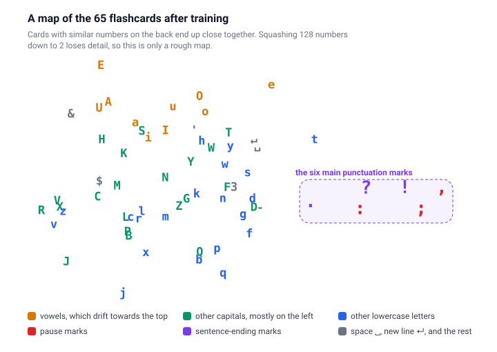
*The punctuation marks gather on the right, the vowels drift towards the top, and most capitals sit on the left. The pairing of capitals with their lowercase letters does not survive the squash, but it is there in the full 128 numbers*

None of this was programmed in. The only instruction the machine was ever given was to get better at guessing the next letter, and these families of cards are what that instruction grew. [The next post](/posts/minigpt-grown/) shows how.

:::no-dumb-questions
These are the questions I had to ask before any of this made sense to me.

**Q: Does it always get it right?**

A: No. Ask it to finish Romeo's famous line, *But soft, what light through yonder windo…*, and it gives the right letter, `w`, only 7.8%. It prefers `m` and `n`. The line appears exactly once in the million letters it learned from, and *window* only 13 times in all, so a small machine that has read one short book does not know Shakespeare the way you do.

**Q: So where do the cards come from, both the letter cards and the position cards? Who writes the numbers in?**

A: Nobody. Both sets of cards come from the same place. The model creates them filled with small random numbers, and the guessing game tunes them like every other dial, as [the next post](/posts/minigpt-grown/) shows. During training, every card changes a little on every step: the `g` card, the position 3 card, and all the rest. Once training stops, both sets of cards are frozen.

**Q: I thought language models were neural networks, like the one in [Machine Learning (Part 9)](/posts/machinelearning9/)?**

A: They are. Every part of this machine is a neural network in that sense: lots of dials, tuned by training. The MLP is even the same kind of two-layer network as my handwritten-digit reader. What is new is attention. The digit reader took in all 784 pixels of one picture at once. A language model gets a row of letters of any length and works on each position's working card separately, so it needs attention to let the working cards share information. Put attention in front of each MLP, stack four of those blocks, and you have a GPT.

**Q: So is the guess just the letter card that the last working card is closest to?**

A: Not in my model, although it is a good guess about how it might work. I tried it. Compared with the 65 letter cards, the last working card for `goo` is closest to `n`, `E`, and `e`, and `d` comes 47th out of 65. Compared with the 65 answer cards, `d` comes first by a long way (0.63, against 0.25 for the next best). That is why the machine needs its own answer cards: describing a letter going in and predicting a letter coming out turned out to be different jobs. Many other models, including GPT-2 and the notebook's own stronger model in [the next post](/posts/minigpt-grown/), do use the letter cards as the answer cards too. That is called *weight tying*, and it saves a whole set of numbers. My model keeps the two sets separate, as the notebook's small model does.

**Q: Is "added" really just adding? What if a total gets too big?**

A: Yes, it is plain addition: the first number on the `g` card plus the first number on the position 1 card, then the second plus the second, and so on, 128 times. The result is a new card, so the two `o`s in `goo` start the blocks with different numbers. Nothing overflows, because the numbers are tiny. The biggest number on any card in my model is 0.19, and the biggest total of any letter card plus any position card is 0.27, while the computer can store numbers up to about 3 followed by 38 zeros. The normalisation before each step in the blocks keeps the numbers in a sensible range after that, too.

**Q: Could I give the machine more positions, so that it can see more letters?**

A: Yes, but it costs. The number of positions is the context length, and [How much can it see at once?](#how-much-can-it-see-at-once-the-context-limit) explains what raising it involves.
:::

:::pencil Who does what?
Before you look at the decoder below, match each everyday comparison on the left with its name in the notebook on the right.

| Everyday comparison | Notebook name |
|---|---|
| 1. a letter's flashcard | A. the *causal mask* |
| 2. the position card | B. the query, key, and value *projections* |
| 3. the answer cards | C. an *embedding* |
| 4. "only look at earlier positions" | D. *sampling* |
| 5. the row of working cards, as every block rewrites it | E. the *language-model head* (`lm_head`) |
| 6. spinning the wheel | F. the *position embedding* |
| 7. the recipes that make query, key, and value cards | G. the *residual stream* |

:::answer
1 is C, 2 is F, 3 is E, 4 is A, 5 is G, 6 is D, and 7 is B.
:::
:::

### The jargon decoder

Here is each everyday comparison from this introduction, next to the name the notebook uses. I come back to each one as the notebook reaches it. The words for how the machine is trained are in [the next post](/posts/minigpt-grown/).

| What I called it | What the experts call it |
|---|---|
| the guessing game | next-token prediction, or language modelling |
| a letter: any of the 65 symbols, even the space and the comma | a *character* |
| the thing being guessed: a letter here, a word or piece of a word in big models | a *token* |
| the 65 letters | the *vocabulary* |
| the chances for every letter | a probability distribution, produced by a *softmax* |
| a letter's flashcard | its *token embedding*: a vector of 128 numbers |
| the position card | the *position embedding* |
| a working card before block 1: a letter card plus its position card | the *input embedding* |
| the number of positions: how many letters it can see at once | the *context length*, or *context window* (`block_size`) |
| "only look at earlier positions" | the *causal mask* |
| the query card, the key card, and the value card | the *query*, the *key*, and the *value* vectors |
| the three recipes that make them | the query, key, and value *projections* (`self.query`, `self.key`, `self.value`) |
| keeping the key and value cards instead of remaking them | the *KV cache* |
| add, never replace | the *residual connection* |
| the row of working cards, as every block rewrites it | the *residual stream* |
| a working card after a block | a *hidden state* |
| the dials | the *parameters*, or *weights* |
| spinning the wheel of chances | *sampling* |
| keeping the biggest k slices | *top-k* sampling |
| keeping the biggest slices until they add up to p | *top-p*, or *nucleus*, sampling |
| the 65 answer cards | the *language-model head* (`lm_head`), or *output layer* |
| a request the model writes for a program to carry out | a *tool call*, or *function call* |
| the program around the model | the *harness* |
| a harness letting the model act by itself for many steps | an *agent* |
| working out what the trained dials mean | *interpretability* |

## Opening the notebook

The repository is [github.com/jibin10/MiniGPT](https://github.com/jibin10/MiniGPT). The README's recommended path is Colab: click the "Open in Colab" badge, select a GPU runtime, and run the cells top to bottom. The notebook is designed to work that way with no local setup at all, but the only dependencies are `torch`, `matplotlib`, and `requests`, so running it on my own hardware was just as easy:

```bash
git clone https://github.com/jibin10/MiniGPT.git && \
cd MiniGPT && \
python3 -m venv .venv && \
source .venv/bin/activate && \
pip install -r requirements.txt jupyter && \
jupyter notebook MiniGPT_Notebook.ipynb
```

The commands are joined with `&&`, so they paste into a terminal as one command, and the chain stops at the first step that fails.

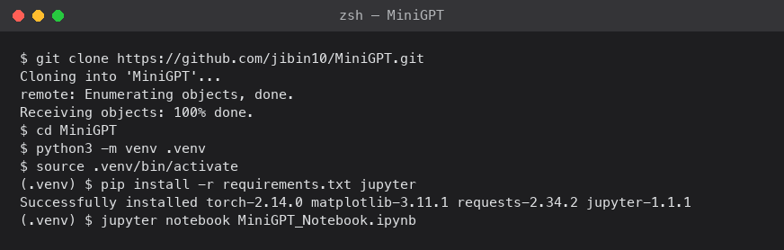
*I cloned the repository and installed the three dependencies plus Jupyter into a fresh virtual environment*

## Part 1. Implement a minimal GPT model

The notebook builds the model before it loads any data. Part 1 defines every piece of a small GPT (the cards, attention, the MLPs, and the final step that turns a card into chances) and checks that a batch of random letters passes through it.

Here is how those pieces fit together, next to the digit-reading network from [Machine Learning (Part 9)](/posts/machinelearning9/). That network was two dense layers in a row. MiniGPT's MLP is exactly that kind of two-layer network. Attention is the new part, slotted in front of it. Four of those blocks are stacked, and one more dense layer at the end turns each working card into 65 chances for the letter after it.

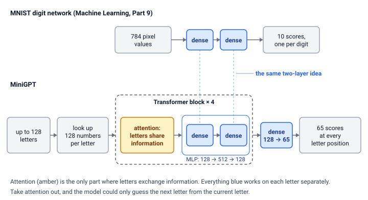
*The MLP inside every MiniGPT block is the same kind of two-layer network as my MNIST digit classifier. What is new is the attention step in front of it*

One thing helped me read the code. The notebook's Python is the *recipe* for the machine: it says what shape every card and grid is, and how they are combined. It does not contain a single trained number. Run it untrained and you get the same machine, filled with random numbers. The trained numbers live in a separate file that training writes out, a *checkpoint*. For my exhibit it is `exhibit.pt`, 3.4 MB of named lists of numbers, and you can download it: [Run my model yourself](#run-my-model-yourself) shows how. The live demo in this post runs the same numbers, copied into a file called `weights.bin`.

:::under-the-hood Where every fixed number lives
Every fixed thing in this post is one named entry in the checkpoint. The names come from the notebook's code, and the four blocks each have their own copy of the block entries, named `blocks.0` to `blocks.3`.

| In this post | Name in the checkpoint | Shape | Numbers |
|---|---|---|---|
| the letter cards | `token_embedding.weight` | 65 × 128 | 8,320 |
| the position cards | `position_embedding.weight` | 128 × 128 | 16,384 |
| **in each of the 4 blocks:** | | | |
| normalise before attention | `ln1.weight`, `ln1.bias` | 128 + 128 | 256 |
| the query recipe | `attn.query.weight`, `attn.query.bias` | 128 × 128 + 128 | 16,512 |
| the key recipe | `attn.key.weight`, `attn.key.bias` | 128 × 128 + 128 | 16,512 |
| the value recipe | `attn.value.weight`, `attn.value.bias` | 128 × 128 + 128 | 16,512 |
| mixing the four heads' results | `attn.proj.weight`, `attn.proj.bias` | 128 × 128 + 128 | 16,512 |
| normalise before the MLP | `ln2.weight`, `ln2.bias` | 128 + 128 | 256 |
| the MLP | `mlp.fc1` (128 → 512) and `mlp.fc2` (512 → 128), weights and biases | | 131,712 |
| **after block 4:** | | | |
| the final normalisation | `final_ln.weight`, `final_ln.bias` | 128 + 128 | 256 |
| the answer cards | `lm_head.weight` | 65 × 128 | 8,320 |
| the answer cards' biases | `lm_head.bias` | 65 | 65 |
| **total** | | | **826,433** |

What is *not* in the checkpoint matters just as much: the working cards, the query, key, and value cards, the shares of attention, and the chances. None of them is stored anywhere. The code works them out fresh, from the text in front of it, every time the machine runs. The checkpoint holds everything fixed, and the code makes everything that changes.
:::

The first code cell sits directly under the Part 1 heading and sets up everything the rest of the notebook depends on. This is how it looked after I ran it:

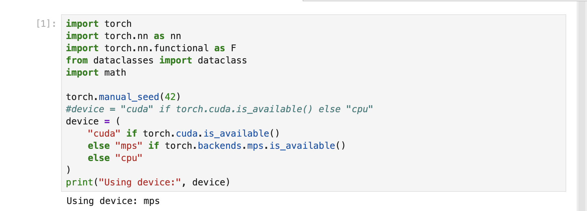
*I ran the first cell. It reported `mps`, the Mac Studio's GPU, because of a small change I made for training, described in [the next post](/posts/minigpt-grown/#using-the-macs-gpu)*

Every line in that cell has a job:

- **`import torch`** brings in PyTorch itself. Its central object is the *tensor*: an n-dimensional array, like a NumPy array, that can also live on a GPU and that records the operations applied to it, so PyTorch can work out gradients automatically during training (*autograd*). Every number the model stores or computes is held in a tensor.
- **`import torch.nn as nn`** brings in the neural-network building blocks. The notebook builds its GPT from `nn.Module` (the base class that every layer, and the model itself, inherits from), `nn.Embedding` (the token and position lookup tables), `nn.Linear`, `nn.LayerNorm`, `nn.GELU`, `nn.Dropout`, and `nn.ModuleList`, which holds the stack of Transformer blocks.
- **`import torch.nn.functional as F`** brings in stateless versions of the same operations: plain functions with no learnable weights of their own. The notebook uses only two of them: `F.softmax`, which turns attention scores into shares, and `F.cross_entropy`, which only training uses.
- **`from dataclasses import dataclass`** comes from the Python standard library, not from PyTorch. The notebook imports it here so that the next cell, under 1.1, can declare the model's settings as a dataclass.
- **`import math`** is also standard library. The notebook uses `math.sqrt` to divide the attention scores by the square root of the head size, the "shrink" step in attention.
- **`torch.manual_seed(42)`** fixes PyTorch's random-number generator, so random choices come out the same each time I rerun the notebook. When running a trained model, the only random choice is the spin of the wheel.
- **`device`** decides where the arithmetic runs: on a GPU, or on the CPU. Running my small model is quick on any CPU, so nothing here needs changing to run it. The GPU only matters for training, and [the next post](/posts/minigpt-grown/#using-the-macs-gpu) shows the one change a Mac needs.

### 1.1 Model Configuration

The markdown cell under 1.1 lists the sizes for a small Part 1 model, chosen so it runs easily in Colab, and the code cell below it records them in one place:

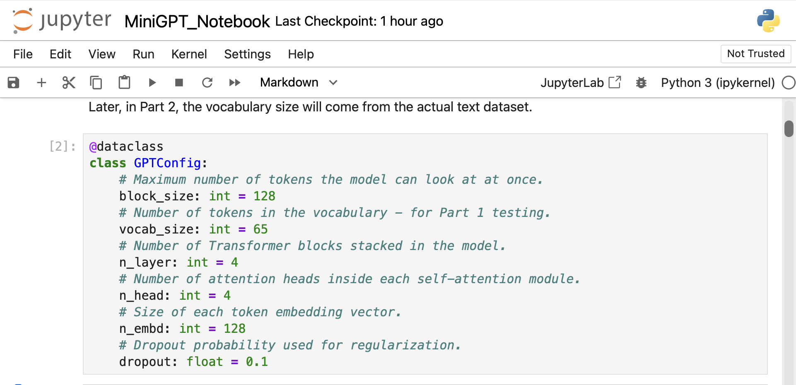
*I ran the 1.1 cell, which defines `GPTConfig` with the Part 1 defaults*

The cell prints nothing when I run it. It only defines a class. No model exists and no memory is used until section 1.6 creates a configuration and builds a model from it.

The `@dataclass` decorator reads the annotated fields and writes the class's `__init__` (plus a readable `__repr__` and an `==` comparison) for me. That lets me create a configuration with the defaults, `GPTConfig()`, or override only the fields I want to change, such as `GPTConfig(n_layer=6, n_embd=384)`. The class has no behaviour of its own. It is a named bundle of numbers that every part of the model reads from.

Each field controls one dimension of the model:

- **`block_size`** is the context length: the maximum number of letters the model can see at once. It sets the size of the position-embedding table and of the causal mask, so the model cannot look further back than this.
- **`vocab_size`** is the number of distinct tokens. It sets the number of rows in the token-embedding table and the number of scores the output layer produces at each position. The default of 65 is a placeholder for testing the model before any data is loaded. It happens to match the 65 letters in Tiny Shakespeare, and the later cells pass in the real value calculated from the text.
- **`n_layer`** is the number of Transformer blocks stacked on top of one another.
- **`n_head`** is the number of attention heads in each block. The attention code checks that `n_embd` divides evenly by `n_head`, because each working card's query, key, and value are cut into one equal piece per head: 128 / 4 gives 32 numbers per head.
- **`n_embd`** is the width of the model: the length of every card, and so of the vector that represents each position at every layer. Most of the parameter count grows with the square of this number.
- **`dropout`** randomly switches off some numbers during training, to make it harder for the model to memorise its text. When running, `model.eval()` turns it off.

It helps me to picture the data inside the model as a spreadsheet, with one row per position and one column per number on its working card:

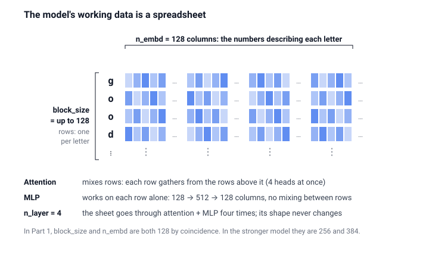
*`block_size` limits the rows (letters), `n_embd` sets the columns (numbers per letter), and `n_layer` is how many times the sheet is processed*

My exhibit uses exactly these defaults, so `GPTConfig()` with no arguments builds a machine of the right shape for my trained numbers.

## The code, in the order the machine runs

The notebook defines its classes bottom-up: attention in 1.2, the MLP in 1.3, one block in 1.4, and the whole model in 1.5. The machine *runs* the other way round, top-down, and that is the order of the five steps. So instead of following the cells, I follow one new letter after `goo` through the code, and point out where each card from the introduction lives. These are the notebook's own lines, with its comments replaced by mine. Two kinds of line do nothing while the machine is writing, so I leave them out: the `dropout` lines, which `model.eval()` switches off, and the training-only lines that work out the loss.

Every card in the introduction is either a fixed set of numbers stored on the model, or a variable that the code works out while it runs:

| In the introduction | In the code | Fixed or changing? | Shape for `goo` |
|---|---|---|---|
| the letter IDs | `idx` | changing | 1 × 3 |
| all 65 letter cards | `model.token_embedding.weight`; row 45 is the `g` card | fixed | 65 × 128 |
| all 128 position cards | `model.position_embedding.weight` | fixed | 128 × 128 |
| the working cards | `x`, inside `MiniGPT.forward` | changing | 1 × 3 × 128 |
| block 1's query recipe | `model.blocks[0].attn.query.weight` and `.bias` | fixed | 128 × 128 and 128 |
| the query, key, and value cards | `q`, `k`, and `v`, inside `CausalSelfAttention.forward` | changing | 1 × 3 × 128 each |
| the shares of attention | `attn` | changing | 1 × 4 × 3 × 3 |
| all 65 answer cards | `model.lm_head.weight`; row 42 is the `d` answer card | fixed | 65 × 128 |
| the answer cards' biases | `model.lm_head.bias` | fixed | 65 |
| the scores | `logits` | changing | 1 × 3 × 65 |
| the chances | `probs` | changing | 1 × 65 |

The first number in most shapes is the *batch size*, `B`: how many texts the code handles at once. While training, it handles 32 snippets at a time. While writing, it handles just one, so `B` is 1. The second number is `T`, the number of letters in the row, which is 3 for `goo`.

### The writing loop: `generate_text`

Writing starts in `generate_text`, which the notebook defines in section 3.12. Each time round its loop, it chooses one new letter:

```python
# keep only the last 128 letter IDs
idx_cond = idx[:, -model.config.block_size:]
# steps 1 to 4: run the whole model
logits, _ = model(idx_cond)
```

`idx` holds the letter IDs written so far: `[[45, 53, 53]]` for `goo`. This is step 1. The first line is the context limit from [How much can it see at once?](#how-much-can-it-see-at-once-the-context-limit): it keeps only the last `block_size` letters, because there are no position cards beyond that. The second line runs the whole model, which calls `MiniGPT.forward`.

### Letter cards, position cards, and working cards: `MiniGPT.forward` (cell 1.5)

```python
# 1 text, 3 letters
B, T = idx.shape
# the positions: 0, 1, 2
pos = torch.arange(0, T)
# look up a letter card for each ID
tok_emb = self.token_embedding(idx)
# look up a position card for each position
pos_emb = self.position_embedding(pos)
# add them: the working cards
x = tok_emb + pos_emb
```

This is step 2, line for line. Python counts from 0, so position 1 in the introduction is row 0 in the code.

`self.token_embedding` is the supply of letter cards. The model's `__init__` creates it as `nn.Embedding(config.vocab_size, config.n_embd)`: a table with 65 rows, one per letter, and 128 columns. Looking up a card is picking a row: `g` picks row 45, and both `o`s pick row 53. `self.position_embedding` is the same kind of table, `nn.Embedding(config.block_size, config.n_embd)`, with one row per position. Before training, `__init__` fills both tables with small random numbers, with a standard deviation of 0.02, and training then tunes them.

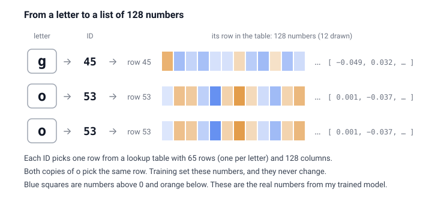
*Each letter's ID picks one row of the table, and that row's 128 numbers become the letter's card. Both copies of `o` get the same row*

`x = tok_emb + pos_emb` is where the working cards are born. `x` holds one working card per position, 128 numbers each, and from here to the end of `forward`, `x` *is* the row of working cards. The code never makes a new variable for them: every block overwrites `x`.

```python
# the four blocks, in order
for block in self.blocks:
    # each one rewrites the working cards
    x = block(x)
```

This is step 3. `self.blocks` is an `nn.ModuleList` holding four `TransformerBlock`s, one for each of `n_layer = 4`, and each with its own fixed recipes. The loop is [Four blocks in a row](#four-blocks-in-a-row): block 1's output is block 2's input, because it is literally the same variable.

### One block: `TransformerBlock.forward` (cell 1.4)

```python
# normalise, attention, add the result
x = x + self.attn(self.ln1(x))
# normalise, MLP, add the result
x = x + self.mlp(self.ln2(x))
```

These two lines are a whole block. Read from the inside out, the first one normalises every working card (`self.ln1`, a *layer normalisation*), runs attention (`self.attn`), and adds what attention returns onto the working cards (`x + …`). The second does the same with the MLP. The `x +` is "add, never replace", the *residual connection*. Normalising *before* each step, rather than after, is called *pre-LayerNorm*, and it tends to train more stably as models get deeper.

### Attention: `CausalSelfAttention` (cell 1.2)

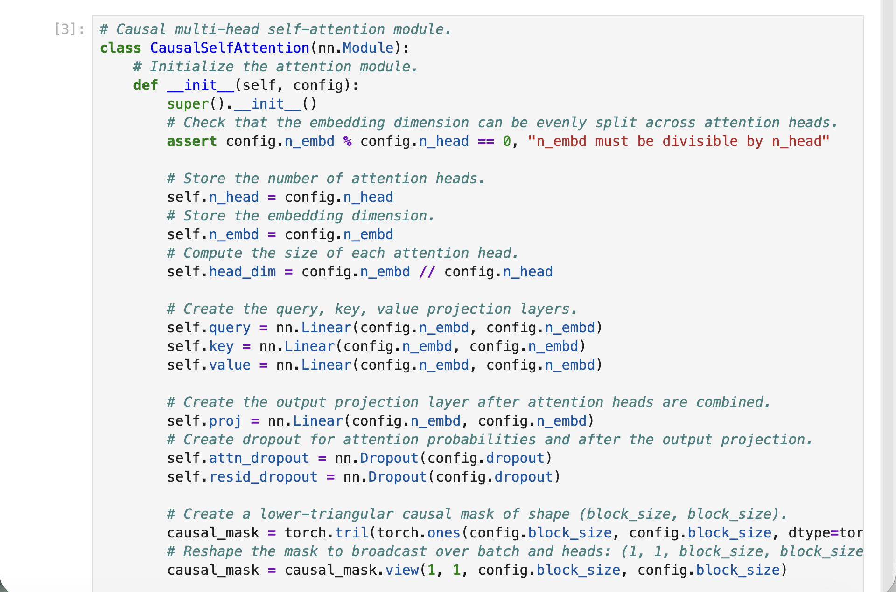
*I ran the 1.2 cell. The top of the class, shown here, is `__init__`, which creates the recipes and the causal mask*

Like every part of the model, the class has two halves. `__init__` runs once, when the model is built, and creates the fixed recipes. `forward` runs every time, and uses them.

`__init__` creates four `nn.Linear(128, 128)` layers. Three of them are the recipes from [Where the scratch cards come from](#where-the-scratch-cards-come-from): `self.query`, `self.key`, and `self.value`. The fourth, `self.proj`, mixes the four heads' results at the end. Each holds a 128 × 128 grid of weights and 128 biases, 16,512 numbers, so attention holds 66,048 in all. `__init__` also builds the causal mask, the "only earlier positions" rule, as a triangle of `True` and `False` values. It stores the mask with `register_buffer`, so the mask is saved with the model, but training never changes it.

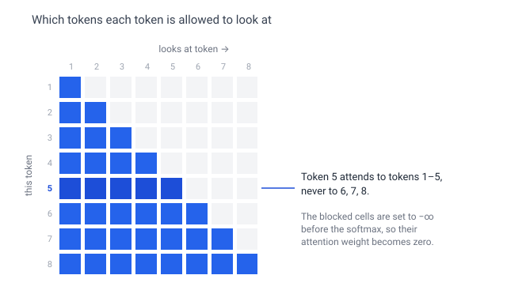
*The mask, drawn out for eight positions. Each row is a working card; the filled cells are the positions it may listen to*

Then `forward` runs attention, in three stages. First, it makes the scratch cards:

```python
# 1 text, 3 working cards, 128 numbers
B, T, C = x.shape
# a query card for every working card
q = self.query(x)
# a key card for every working card
k = self.key(x)
# a value card for every working card
v = self.value(x)
# cut each card into 4 pieces of 32
q = q.view(B, T, self.n_head, self.head_dim)
k = k.view(B, T, self.n_head, self.head_dim)
v = v.view(B, T, self.n_head, self.head_dim)
# group the pieces by head
q = q.transpose(1, 2)
k = k.transpose(1, 2)
v = v.transpose(1, 2)
```

`self.query(x)` runs the query recipe on every working card at once: each of the 128 numbers on each query card is a weighted mix of all 128 numbers on its working card, plus a bias. `view` cuts each 128-number card into four 32-number pieces, one per head, and `transpose(1, 2)` regroups them so that each head gets its own stack of pieces and all four heads can run side by side.

Second, it matches and shares out:

```python
# match every query with every key
scores = q @ k.transpose(-2, -1)
# shrink: divide by √32
scores = scores / math.sqrt(self.head_dim)
# the corner of the mask for 3 positions
mask = self.causal_mask[:, :, :T, :T]
# no listening to later positions
scores = scores.masked_fill(mask == False, float("-inf"))
# share out 100% of attention
attn = F.softmax(scores, dim=-1)
```

`q @ k.transpose(-2, -1)` is the multiply-and-add between every query card and every key card, in one go: for each head, a 3 × 3 grid of scores. For working card 3 in head 1 of block 1, the row is −2.19, 15.60, and −3.62, the numbers from [Queries, keys and values, with real numbers](#queries-keys-and-values-with-real-numbers). `masked_fill` writes minus infinity into every score for a later position, and softmax turns minus infinity into exactly 0, so later positions get no attention at all. `attn` holds the shares: 4.0%, 92.9%, and 3.1% in that row.

Third, it collects and puts the heads back together:

```python
# collect the value cards, in those shares
out = attn @ v
# rejoin the four heads: 128 numbers again
out = out.transpose(1, 2).contiguous().view(B, T, C)
# mix what the four heads found
out = self.proj(out)
return out
```

`attn @ v` is the collecting: each working card's share of every value card, added up number by number. The next line undoes the cutting into heads (I have joined three of the notebook's lines into one), and `self.proj` mixes the heads' findings. The result has the same shape as the working cards, `1 × 3 × 128`, which is what lets `TransformerBlock` add it straight back onto `x`.

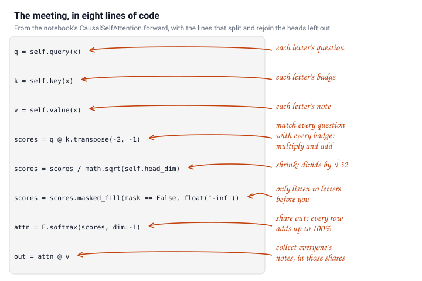
*The heart of attention, with a comment beside each line*

### The MLP: `FeedForward` (cell 1.3)

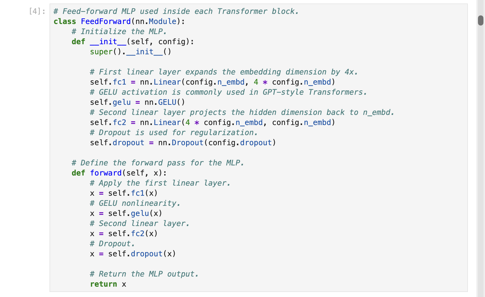
*I ran the 1.3 cell, which defines the `FeedForward` class: two linear layers with a GELU between them, then dropout*

```python
# 128 numbers → 512
x = self.fc1(x)
# bend: keep the positives, squash the negatives
x = self.gelu(x)
# 512 numbers → 128
x = self.fc2(x)
```

The MLP works on each working card alone, using the same fixed recipes for every position. `fc1` and `fc2` are `nn.Linear` layers, recipes just like attention's, but `fc1` makes 512 numbers from 128, giving the MLP room to look for many patterns at once, and `fc2` brings them back to 128. `gelu` (Gaussian Error Linear Unit) is what makes the two recipes more than one: without a bend between them, two weighted mixes in a row would be no more powerful than one. GELU passes large positive numbers through almost unchanged, pushes large negative numbers to about zero, and curves smoothly in between.

The MLP holds most of each block's numbers: 66,048 in `fc1` and 65,664 in `fc2`, 131,712 in all, almost exactly twice attention's 66,048. It is the same kind of two-layer network as the digit reader in [Machine Learning (Part 9)](/posts/machinelearning9/).

:::fireside-chat Tonight: Attention and the MLP argue about who does the real work
**Attention:** Let us be honest. Without me, every working card in this model is on its own. I am the only part where working cards talk to each other.

**MLP:** Talking is cheap. You collect the values. I actually do something with them. And I have twice as many dials as you: 131,712 per block, against your 66,048.

**Attention:** Dials are not everything. Without me, after an `o` you would make the same guess whether the word was heading for `good` or `took`.

**MLP:** And without me, all you ever do is mix. Every value you hand back is a weighted average of the values you were given. You cannot come up with anything that was not already there.

**Attention:** Fair. But I decide *who* to listen to, and I decide afresh for every piece of text. You do exactly the same sum for every working card, whoever its neighbours are.

**MLP:** Which is why the notebook gives us one turn each, four blocks in a row.

**Attention:** And the residual connection keeps both our work. Truce?

**MLP:** Truce. Until the next block.
:::

### The answer cards: back in `MiniGPT.forward`

After the fourth block, the code goes back to `MiniGPT.forward` for step 4:

```python
# the final normalisation
x = self.final_ln(x)
# score every working card against the 65 answer cards
logits = self.lm_head(x)
# loss is None while writing
return logits, loss
```

`self.lm_head` is the set of answer cards: `__init__` creates it as `nn.Linear(config.n_embd, config.vocab_size)`, and its weights, `self.lm_head.weight`, are a table of 65 rows of 128 numbers, one answer card per letter, with one bias each in `self.lm_head.bias`. Running it does the multiply-and-add of each working card against all 65 answer cards, plus the biases.

There is one difference from how I described step 4. The code scores *every* working card, not just the last one, so `logits` holds 3 rows of 65 scores for `goo`. Training needs all of them, because every position has a known next letter to check. While writing, only the last row is used, and `generate_text` throws the others away. The answer is the same either way. (My browser demo skips the wasted work, and scores only the last working card.)

### Spinning the wheel: back in `generate_text`

```python
# keep only the last working card's 65 scores
logits = logits[:, -1, :]
# temperature
logits = logits / temperature
# top-k: keep the biggest k scores, and set the rest to minus infinity
# the chances: the slices of the wheel
probs = torch.softmax(logits, dim=-1)
# spin the wheel
next_id = torch.multinomial(probs, num_samples=1)
# write the letter on the end
idx = torch.cat([idx, next_id], dim=1)
```

This is step 5. `[:, -1, :]` picks the last row, which belongs to working card 3. Dividing by `temperature` is the temperature setting from step 5: a small temperature stretches the gaps between the scores, and a large one shrinks them. The notebook trims the wheel with top-k only; it has no top-p, which my demo adds. `torch.softmax` makes the 65 chances, `torch.multinomial` is the spin, and `torch.cat` writes the new letter's ID onto the end of `idx`. Then the loop goes round again, and runs the whole model on `good`. The notebook keeps no KV cache: every pass makes every working card and every scratch card from scratch.

:::bullet-points The code, in the order it runs
- `generate_text` keeps the last 128 letter IDs and runs the model.
- `MiniGPT.forward` looks up the letter cards and position cards, and adds them to make `x`, the working cards.
- Each `TransformerBlock` rewrites `x`: normalise, attention, add; normalise, MLP, add.
- Attention makes query, key, and value cards with three fixed recipes, matches, shares out, and collects.
- `lm_head` scores the working cards against the 65 answer cards, and `generate_text` turns the last row into chances and spins the wheel.
:::

## Run my model yourself

Everything in this post can be reproduced with three things: the notebook's Part 1 code, my trained numbers, and the 65 letters in the right order. I ran these steps myself, from scratch, in a fresh copy of the notebook, and the pictures below are that run. Any CPU is fast enough.

First, run the notebook's code cells from the top down to the end of section 1.5. That defines `GPTConfig` and the four classes, but builds nothing yet. Then add four new cells.

**Cell 1: download my trained numbers.** This is the checkpoint from [Where every fixed number lives](#part-1-implement-a-minimal-gpt-model): all 826,433 fixed numbers, under the names the notebook's code expects, in a 3.4 MB file. It is the same model that runs in the live demo.

```python
import urllib.request

# my trained numbers: the checkpoint, 3.4 MB
urllib.request.urlretrieve("https://haddley.github.io/minigpt-demo/exhibit.pt", "exhibit.pt")
```

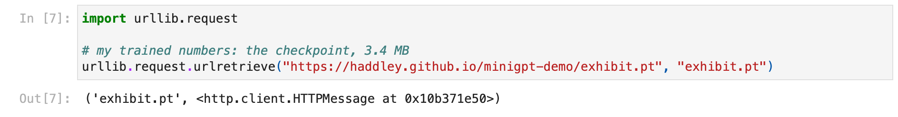
*I ran the cell in a fresh folder, and it downloaded the 3.4 MB checkpoint. The line it prints just confirms the file name*

**Cell 2: build the machine, load the numbers, and run `goo`.**

```python
# the 65 letters, in order: the position of each one is its ID
chars = list("\n !$&',-.3:;?ABCDEFGHIJKLMNOPQRSTUVWXYZabcdefghijklmnopqrstuvwxyz")
stoi = {ch: i for i, ch in enumerate(chars)}

# build the machine, and load my numbers into it
model = MiniGPT(GPTConfig())
model.load_state_dict(torch.load("exhibit.pt", map_location="cpu"))
model.eval()                 # running, not training: dropout off
model.requires_grad_(False)  # and no records for training

# steps 1 to 4 for goo
idx = torch.tensor([[stoi[ch] for ch in "goo"]])
logits, _ = model(idx)
probs = torch.softmax(logits[0, -1], dim=-1)
for p, i in zip(*torch.topk(probs, 4)):
    print(repr(chars[i]), f"{p.item():.1%}")
```

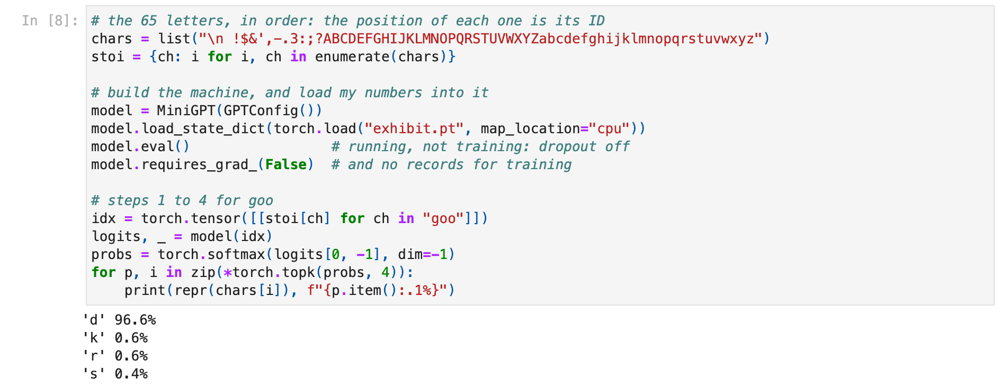
*I ran the cell, and got exactly the chances from step 4: `d` 96.6%*

Each piece has a job:

- **`chars`** is the vocabulary: every letter that appears in Tiny Shakespeare, sorted into the computer's standard order, which puts the new line first, then the space and punctuation, then the capitals, then the lowercase letters. The order matters, because a letter's ID is simply its place in this list, and my letter cards and answer cards are stored in that order. The notebook builds the same list from the text with `sorted(list(set(text)))` in section 2.2.
- **`GPTConfig()`** with no arguments has exactly my model's settings: 4 blocks, 4 heads, 128 numbers per card, 128 positions, and 65 letters. The checkpoint only fits a machine of that shape.
- **`load_state_dict`** copies my numbers into the machine, replacing the random ones it was built with.
- **`model.eval()`** switches off dropout, which is only for training, and **`model.requires_grad_(False)`** tells PyTorch not to keep the extra records that training needs.

**Cell 3: look at the cards.** Each line prints the start of one fixed card from this post:

```python
print(stoi["g"], stoi["o"], stoi["d"])                  # the letter IDs from step 1
print(model.token_embedding.weight[stoi["g"]][:4])      # the g letter card
print(model.position_embedding.weight[0][:4])           # the position 1 card
print(model.lm_head.weight[stoi["d"]][:4])              # the d answer card
print(model.blocks[0].attn.query.weight.shape)          # block 1's query recipe
```

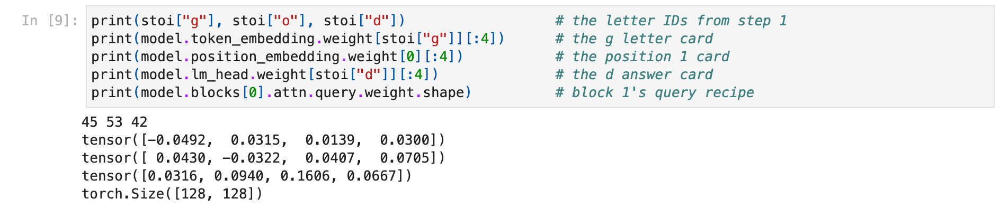
*The IDs from step 1, then the first four numbers on the `g` letter card, the position 1 card, and the `d` answer card, and the size of block 1's query recipe*

**Cell 4: write, by spinning the wheel.** This loop is a cut-down `generate_text`, with a temperature of 0.8 and no trimming. The first line fixes the random spins, so that with the same version of PyTorch you get exactly the text I got; remove it, and every run writes something different.

```python
torch.manual_seed(1)   # remove this line for a different spin each time
idx = torch.tensor([[stoi[ch] for ch in "ROMEO:\n"]])
for _ in range(200):
    logits, _ = model(idx[:, -model.config.block_size:])
    probs = torch.softmax(logits[0, -1] / 0.8, dim=-1)
    next_id = torch.multinomial(probs, num_samples=1)
    idx = torch.cat([idx, next_id.view(1, 1)], dim=1)
print("".join(chars[i] for i in idx[0].tolist()))
```

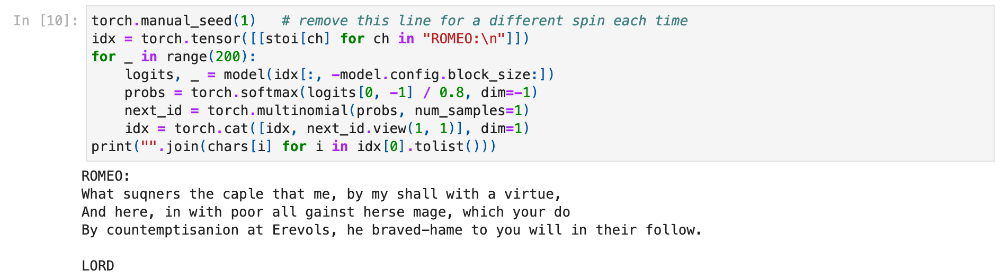
*200 letters, chosen one spin at a time, after `ROMEO:` and a new line*

## Try it yourself

- The paper: [MiniGPT: Rebuilding GPT from First Principles](https://arxiv.org/pdf/2605.17398) (arXiv:2605.17398)
- Play with a real one: [Transformer Explainer](https://poloclub.github.io/transformer-explainer/) runs GPT-2 in your browser and shows attention and the chances for your own text, and [LLM Visualization](https://bbycroft.net/llm) walks through a small GPT in 3D, one calculation at a time
- Build one step by step: [MicroGPT Visualized](https://microgpt.jtauber.com/) starts from counting pairs of letters and adds one idea at a time
- The notebook: [github.com/jibin10/MiniGPT](https://github.com/jibin10/MiniGPT) — open `MiniGPT_Notebook.ipynb` in Colab, or clone it and run it locally, then follow [Run my model yourself](#run-my-model-yourself) to load my trained model. Any CPU will do

The thumbnail for this post adapts the [LLM logo](https://commons.wikimedia.org/wiki/File:LLM-logo.svg) by Conan, from Wikimedia Commons, licensed [CC BY-SA 4.0](https://creativecommons.org/licenses/by-sa/4.0/). I recoloured, cropped, and rescaled it for the thumbnail.

## References

- [MiniGPT: Rebuilding GPT from First Principles — Jibin Joseph, 2026](https://arxiv.org/abs/2605.17398)
- [nanoGPT — Andrej Karpathy](https://github.com/karpathy/nanoGPT)
- [minGPT — Andrej Karpathy](https://github.com/karpathy/minGPT)
- [char-rnn and the Tiny Shakespeare dataset — Andrej Karpathy](https://github.com/karpathy/char-rnn)
- [Let's build GPT: from scratch, in code, spelled out — Andrej Karpathy](https://www.youtube.com/watch?v=kCc8FmEb1nY)
- [Attention in transformers, visually explained — 3Blue1Brown](https://www.3blue1brown.com/lessons/attention)
- [Visualizing transformers and attention — Grant Sanderson, TNG Big Tech Day 2024](https://www.youtube.com/watch?v=KJtZARuO3JY)
- [What Is ChatGPT Doing … and Why Does It Work? — Stephen Wolfram, 2023](https://writings.stephenwolfram.com/2023/02/what-is-chatgpt-doing-and-why-does-it-work/)
- [The Illustrated GPT-2 — Jay Alammar](https://jalammar.github.io/illustrated-gpt2/)
- [MicroGPT Visualized — James Tauber](https://microgpt.jtauber.com/)
- [Transformer Explainer — Georgia Tech Polo Club](https://poloclub.github.io/transformer-explainer/)
- [LLM Visualization — Brendan Bycroft](https://bbycroft.net/llm)
- [Generative AI exists because of the transformer — Financial Times, 2023](https://ig.ft.com/generative-ai/)
- [Attention Is All You Need — Vaswani et al., 2017](https://arxiv.org/abs/1706.03762)
- [KV Caching Explained: Optimizing Transformer Inference Efficiency — Hugging Face, 2025](https://huggingface.co/blog/not-lain/kv-caching)
- [Scaling Laws for Neural Language Models — Kaplan et al., 2020](https://arxiv.org/abs/2001.08361)
- [The Curious Case of Neural Text Degeneration — Holtzman et al., 2020](https://arxiv.org/abs/1904.09751)
