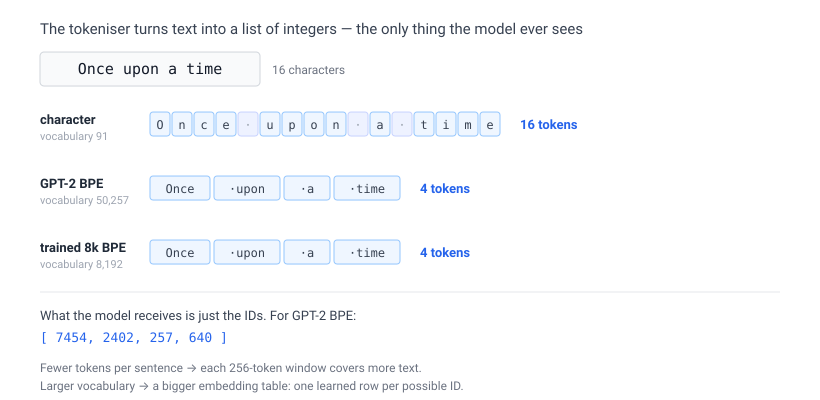
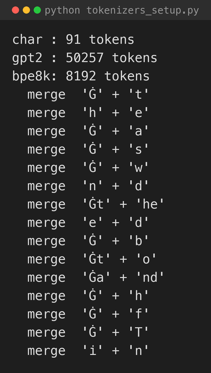
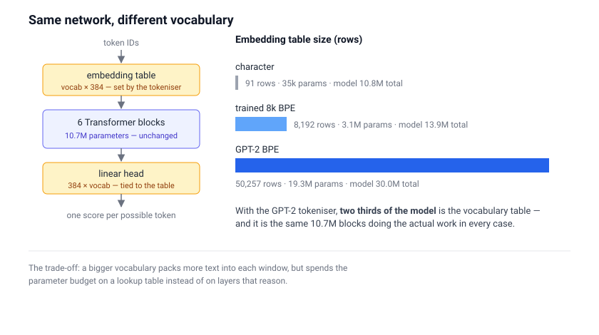
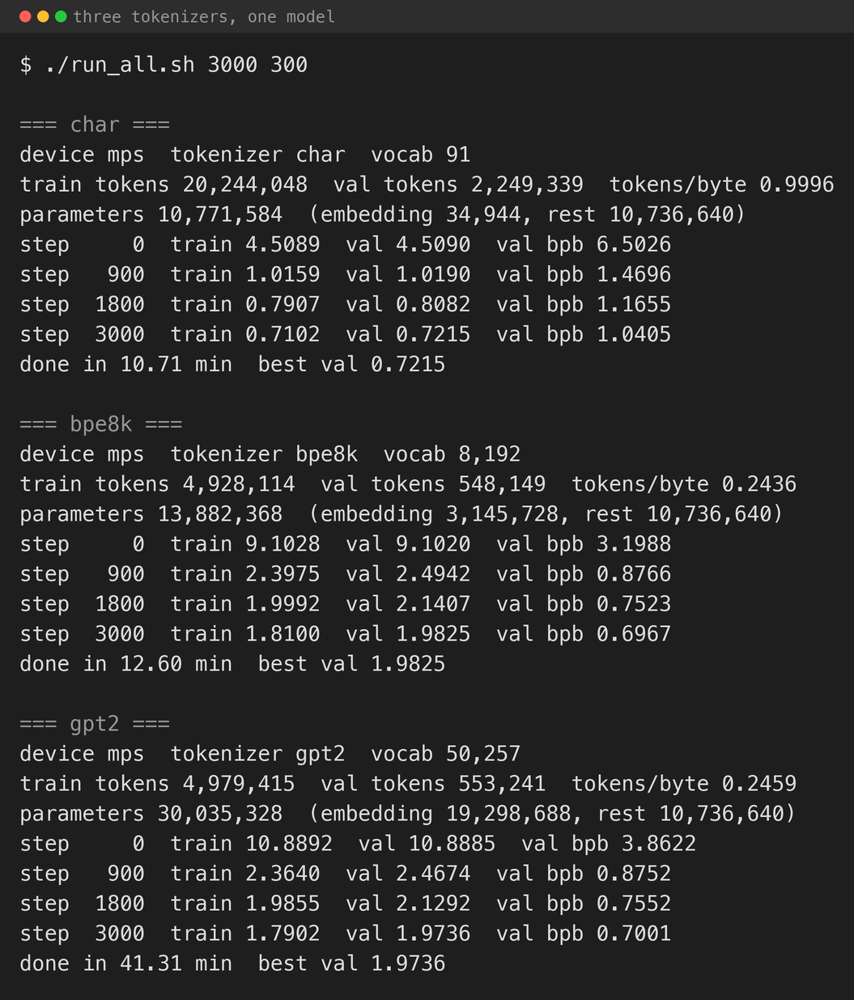
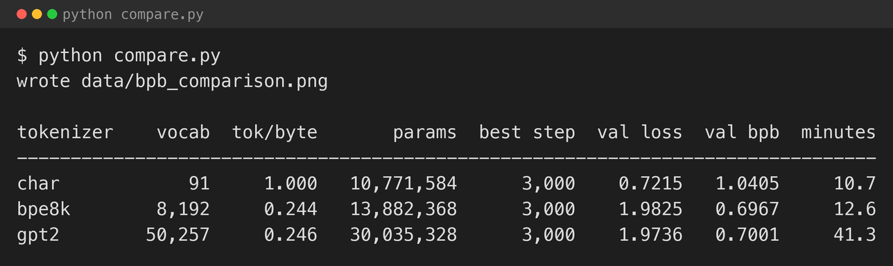
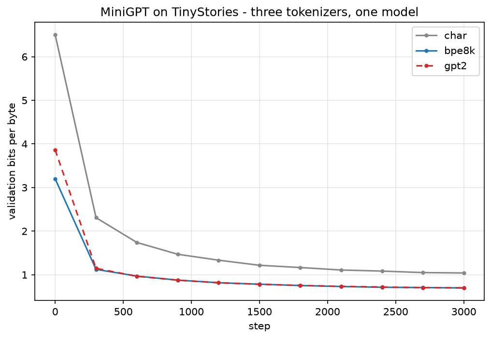
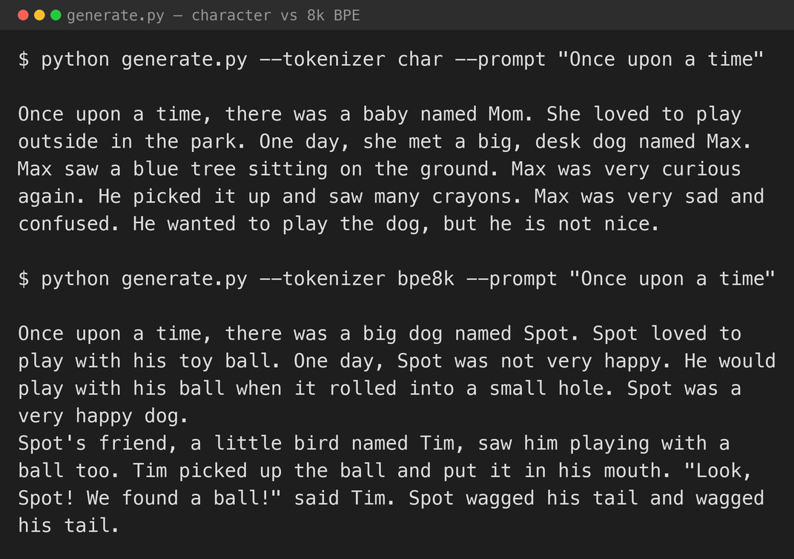

In [part 1](/posts/minigpt/) I ran Jibin Joseph's MiniGPT notebook on my Mac Studio. It builds a whole GPT training pipeline in one file, and it uses the simplest possible tokeniser: every distinct character in Tiny Shakespeare becomes one token, for a vocabulary of exactly 65. The notebook is honest that this is a trade-off. There is nothing to train and nothing to inspect, but the model has to learn spelling from individual letters, and a 256-token context window is only a few dozen words.

This post changes one thing and holds everything else fixed. The model is the same "stronger" configuration from part 1 — 6 layers, 6 heads, 384-dimensional, 256-token context, weight-tied — and the training loop is the same AdamW schedule with best-validation checkpointing. Only the tokeniser changes. I run three: the character-level one carried over from part 1, OpenAI's GPT-2 tokeniser borrowed unchanged, and a small **byte-pair-encoding** (BPE) tokeniser I train on the training text.

BPE began as a 1994 text-compression trick — repeatedly find the most common pair of adjacent symbols and replace it with a new one — and was adapted for language models by [Sennrich et al. in 2016](https://arxiv.org/abs/1508.07909). OpenAI used it to build the GPT-2 tokeniser, and it is still the standard. Hugging Face's LLM course has a [clear walkthrough of the algorithm](https://huggingface.co/learn/llm-course/en/chapter6/5).

## A bigger, simpler corpus

Tiny Shakespeare is about 1 MB. That is enough to show a character model picking up the *shape* of a play, but it is too small and too idiosyncratic to show what a subword tokeniser buys you. I moved to [TinyStories](https://huggingface.co/datasets/roneneldan/TinyStories) — a corpus of short synthetic children's stories written with a deliberately small vocabulary, built by Ronen Eldan and Yuanzhi Li specifically so that small models can produce coherent text. I use the ~22 MB V2 validation file as the corpus and split it 90 / 10, which gives 20,244,048 characters of training text.

```python
URL = "https://huggingface.co/datasets/roneneldan/TinyStories/resolve/main/TinyStoriesV2-GPT4-valid.txt"
text = open(raw, encoding="utf-8").read()
n = int(0.9 * len(text))
train, val = text[:n], text[n:]
```

The stories are separated by a literal `<|endoftext|>` marker, and every one of them is the kind of text a five-year-old could follow. That matters: it means a model in the tens of millions of parameters has a real chance of learning to finish a sentence, so the difference between tokenisers shows up in the output and not just in the loss curve.

## What goes in, what comes out

[Part 1](/posts/minigpt/) covered the model's input and output: a run of characters in, a score for every possible next character out. This post is about the step *before* that — the tokeniser, which decides what "a run of characters" is actually made of.

The tokeniser takes a string of text and returns a list of integers. The model never sees letters or words; it sees those integers, and it has one row of its embedding table for every integer that could appear. So the tokeniser fixes two things before training starts: how many pieces a sentence is chopped into, and how many distinct pieces exist.


*The same four words as 16 character tokens or 4 subword tokens. Fewer, larger tokens mean each context window covers more text — but a larger set of possible tokens means a larger embedding table*

## Three tokenisers

**Character level.** Exactly what part 1 did — `sorted(set(text))`, one integer per character. On TinyStories that is a vocabulary of 91 symbols rather than 65, because the stories use digits, curly quotation marks, and a wider range of punctuation than the plays.

**GPT-2, borrowed unchanged.** OpenAI released the GPT-2 tokeniser with the model in 2019 and it is still a reasonable default. It is a byte-level byte-pair-encoding tokeniser with 50,257 entries, and [`tiktoken`](https://github.com/openai/tiktoken) loads it in one line with nothing to train:

```python
import tiktoken
enc = tiktoken.get_encoding("gpt2")   # 50,257 tokens
```

The one adjustment is that TinyStories contains the literal string `<|endoftext|>` as its story separator, and `tiktoken` refuses to encode that by default. Passing `allowed_special={"<|endoftext|>"}` lets it map to GPT-2's real end-of-text token, which is exactly what it is meant to be.

**A trained 8k BPE.** A 50k vocabulary is large for a model this small — the embedding table alone would dwarf the rest of the network. So I also trained a byte-level BPE tokeniser from scratch on the TinyStories training split, capped at 8,192 tokens, using the Hugging Face [`tokenizers`](https://github.com/huggingface/tokenizers) library. It runs the same merge algorithm Andrej Karpathy walks through in [minbpe](https://github.com/karpathy/minbpe), just fast enough to finish in a few seconds:

```python
from tokenizers import Tokenizer, models, trainers, pre_tokenizers
tok = Tokenizer(models.BPE(unk_token="<unk>"))
tok.pre_tokenizer = pre_tokenizers.ByteLevel(add_prefix_space=False)
tok.train(["data/train.txt"], trainers.BpeTrainer(vocab_size=8192))
```


*Building all three tokenisers. The `Ġ` in the printed merges is the byte-level marker for a leading space*

## Watching BPE learn

Byte-pair encoding starts with raw bytes and repeatedly merges the most frequent adjacent pair into a new token. The first fifteen merges on TinyStories are exactly the pairs you would guess: a space followed by `t`, then `h`+`e`, then space+`a`, space+`s`, space+`w`, `n`+`d` — and then it starts merging those results into whole frequent words, ` the`, ` and`, ` to`. By the time it has 8,192 entries it has tokens for most common words and for the fragments that build the rest.

The practical effect is compression. The character tokeniser needs one token per byte — on the validation split it comes out at 0.9996 tokens per byte, essentially one to one. The GPT-2 tokeniser packs the same text into 0.246 tokens per byte, and the trained 8k tokeniser into 0.244. Both subword tokenisers cover about four bytes per token, so each 256-token window now spans roughly 1,000 characters — around 180 words — instead of 256. That is the whole point.

The small surprise is that the 8k tokeniser trained on TinyStories compresses this text *slightly better* than GPT-2's 50k general-purpose vocabulary. On its home turf a small tuned vocabulary beats a large generic one.

## The model barely changes

The only edit to the model from part 1 is that the vocabulary size is now a constructor argument instead of a hard-coded 65:

```python
model = MiniGPT(tok.vocab_size, n_layer=6, n_head=6, n_embd=384, block_size=256)
```

But that one number moves the parameter count a lot, because the token embedding table is `vocab_size × 384` and — with weight tying — the output head is the same matrix:

| Tokeniser | Vocabulary | Embedding params | Total params |
|---|---|---|---|
| Character | 91 | 34,944 | 10,771,584 |
| Trained 8k BPE | 8,192 | 3,145,728 | 13,882,368 |
| GPT-2 | 50,257 | 19,298,688 | 30,035,328 |


*The six Transformer blocks are the same 10.7M parameters in every run. Only the embedding table and the tied head grow with the vocabulary — and with GPT-2's 50,257 tokens they become most of the model*

The non-embedding part of the network — the attention and MLP weights that actually do the work — is 10,736,640 parameters in every case. With the GPT-2 tokeniser, 64% of the model is just the vocabulary table. That is the cost the trained 8k tokeniser is designed to avoid.

## Comparing fairly

Cross-entropy loss is not comparable across tokenisers. A loss of 2.0 spread over 8,192 possible tokens is a very different prediction from a loss of 2.0 over 50,257, and the character model, choosing one of 91, has an easier job still. To put the three runs on one axis I score them in **bits per byte** — the average number of bits the model needs to encode one raw UTF-8 byte of held-out text, which is what a compression benchmark would measure:

```python
bpb = val_loss / math.log(2) * (n_val_tokens / n_val_bytes)
```

The `val_loss / ln(2)` converts nats to bits per token; multiplying by tokens-per-byte converts that to bits per byte. Lower is better, and it is directly comparable no matter how big the vocabulary is.

## The runs

Each run is 3,000 iterations, batch size 32, on the Mac Studio's M1 Max GPU through PyTorch's MPS backend — the same device path as part 1.


*The three runs back to back. Raw validation loss and bits per byte move in opposite directions across the three tokenisers*


*The summary. Lowest raw loss and lowest bits per byte are not the same tokeniser*


*Validation bits per byte over training. The two subword runs sit on top of each other; the character run never catches them*

Three things stand out.

**The character model has the lowest raw loss and the worst bits per byte.** It finishes at a validation loss of 0.72 — far below the subword models' 1.97 — simply because guessing one character out of 91 is an easier prediction than guessing one token out of 8,192. Converted to bits per byte that advantage inverts completely: 1.04 for the character model against 0.70 for both subword models. Raw loss was flattering the character tokeniser for reasons that have nothing to do with how good the text is.

**The trained 8k tokeniser matches GPT-2's.** Bits per byte of 0.6967 against 0.7001 — a rounding difference — even though the 8k model has less than half the parameters (13.9M against 30.0M) and trained in less than a third of the wall-clock time (12.6 minutes against 41.3). The GPT-2 run is slow because a 50,257-wide output projection and softmax on every position, plus an AdamW step over 30M parameters, is a lot of arithmetic for the M1 Max to push through on MPS. All of that expense bought nothing here.

**Nobody overfits.** In part 1 the stronger model's best validation loss arrived at step 1,500 of 5,000 and then climbed as the model memorised 1 MB of Shakespeare. Here all three runs are still improving at step 3,000, because 20 MB of TinyStories is a large enough training set that the model has not run out of genuinely new text to learn from. The best checkpoint is the last one in every case.

## Generating text

Same generation code as part 1 — autoregressive sampling with a temperature and a top-k cut — but now decoding goes through the tokeniser instead of a character lookup.

```python
idx = torch.tensor([tok.encode("Once upon a time")], device=device)
out = model.generate(idx, max_new_tokens=300, temperature=0.8, top_k=200)
print(tok.decode(out[0].tolist()))
```


*The same prompt continued by the character model and by the 8k BPE model*

The character model produces clean sentences with the wrong nouns in them: "a baby named Mom", "a big, desk dog named Max", "a blue tree sitting on the ground". The grammar is right and the individual words are spelled correctly, but it has not tied the words together into a consistent scene.

The 8k BPE model holds a scene. Spot is a dog, Spot has a ball, Spot's friend is a bird named Tim, and the ball stays a ball for the whole passage. It still has failure modes — "Spot wagged his tail and wagged his tail" is a repetition loop, and later passages drift — but each 256-token window now covers four times as much of the story, and the extra context shows up as continuity. The GPT-2 model reads much the same, and it correctly emits a literal `<|endoftext|>` between stories, having learned that the separator token ends a document.

Both subword models are a clear step up from part 1, where a character model on 1 MB of Shakespeare produced speaker names and line breaks but no readable sentences.

## What I took from it

- **The tokeniser is a modelling decision made before training starts.** It sets the vocabulary, how many words a context window covers, and how much of the parameter budget goes to the embedding table rather than to the network. None of that is preprocessing.
- **Raw loss is not a fair scoreboard across tokenisers.** Bits per byte is. The character model looked best on loss and was worst on the metric that actually normalises for the size of the prediction.
- **Borrowing GPT-2's tokeniser is the fast path, but a 50k vocabulary is wasteful for a small model.** A vocabulary trained to the corpus matched it here at 46% of the parameters and 30% of the training time, and compressed the domain text slightly better.
- **More data changes the failure mode.** Part 1 overfit 1 MB of Shakespeare in 1,500 steps. Twenty MB of TinyStories did not overfit in 3,000, and the generated text is coherent enough to read.

## Try it yourself

The code for this part is in [github.com/Haddley/minigpt-series](https://github.com/Haddley/minigpt-series) under `part2/`:

```bash
python prepare_data.py
python tokenizers_setup.py
python train.py --tokenizer char
python train.py --tokenizer gpt2
python train.py --tokenizer bpe8k
python compare.py
python generate.py --tokenizer bpe8k --prompt "Once upon a time"
```

On Apple Silicon the training scripts select MPS automatically. On a CUDA machine they select the GPU; on anything else they fall back to the CPU.

[Part 3](/posts/minigpt3/) takes this same model and this same 8k tokeniser and rebuilds them in Apple's MLX framework, then puts the MLX and PyTorch runs side by side on the same Mac.

## References

- [MiniGPT: Rebuilding GPT from First Principles — Jibin Joseph, 2026](https://arxiv.org/abs/2605.17398)
- [nanoGPT — Andrej Karpathy](https://github.com/karpathy/nanoGPT)
- [minbpe — Andrej Karpathy](https://github.com/karpathy/minbpe)
- [Byte-Pair Encoding tokenization — Hugging Face LLM Course](https://huggingface.co/learn/llm-course/en/chapter6/5)
- [TinyStories: How Small Can Language Models Be and Still Speak Coherent English? — Eldan & Li, 2023](https://arxiv.org/abs/2305.07759)
- [Neural Machine Translation of Rare Words with Subword Units — Sennrich et al., 2016](https://arxiv.org/abs/1508.07909)
- [Language Models are Unsupervised Multitask Learners (GPT-2) — Radford et al., 2019](https://cdn.openai.com/better-language-models/language_models_are_unsupervised_multitask_learners.pdf)
- [tiktoken — OpenAI](https://github.com/openai/tiktoken)
- [tokenizers — Hugging Face](https://github.com/huggingface/tokenizers)
