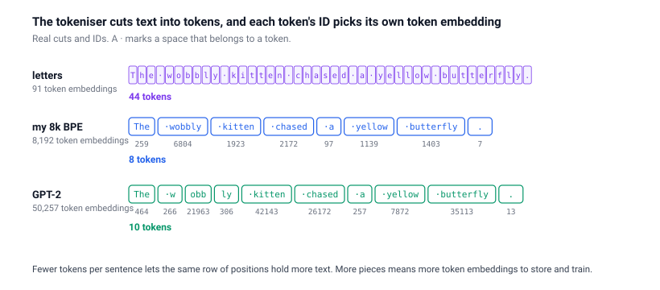
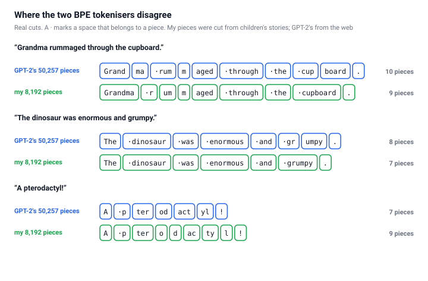
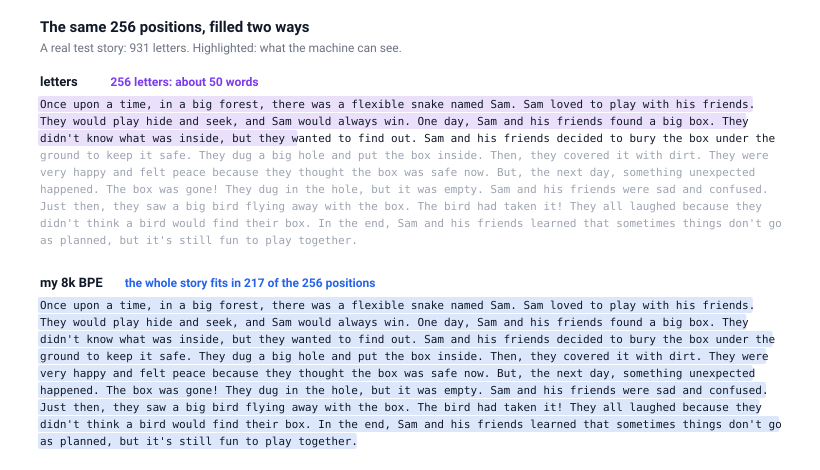
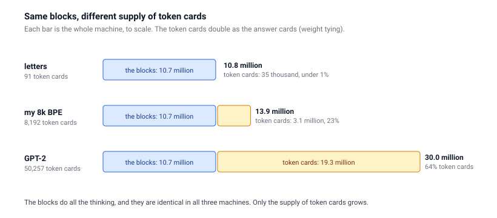
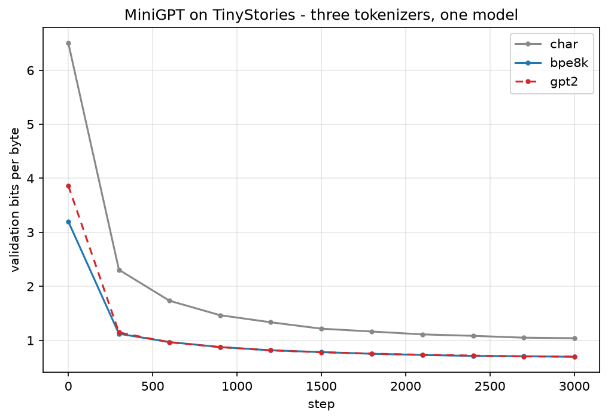
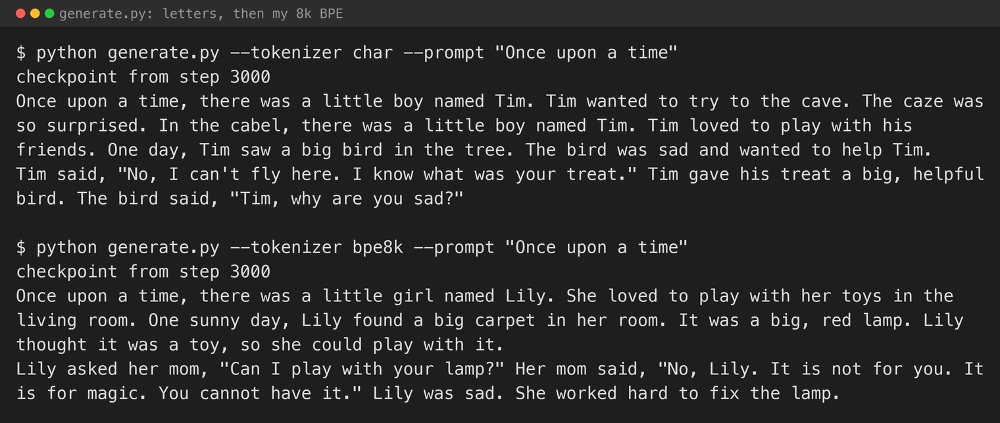
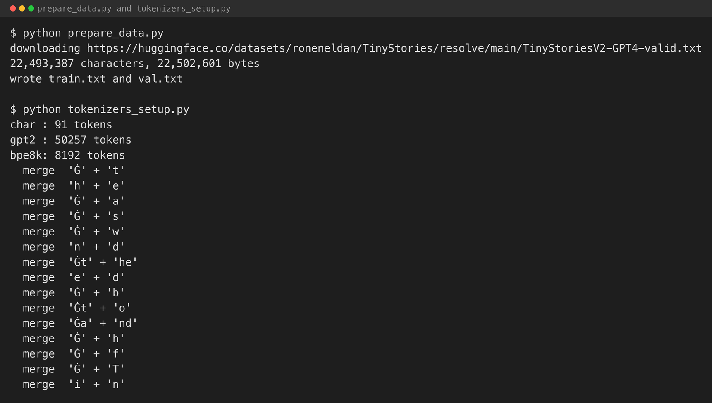
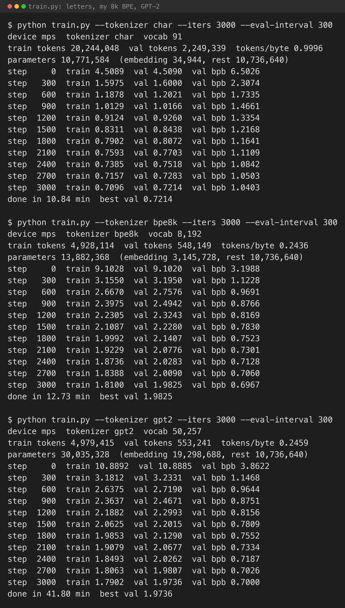
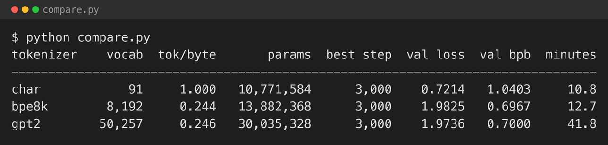

At the end of [Part 1](/posts/minigpt/#why-the-big-models-do-not-use-letters), I asked why the big models do not read one letter at a time, the way MiniGPT does. This post finds out, by trying it. I take the bigger MiniGPT from [Part 2](/posts/minigpt-grown/), keep everything about it the same, and change only one thing: how the text is cut into pieces before the machine sees it. The text changes too. Instead of Shakespeare, the machine reads about 20 million letters of [TinyStories](https://huggingface.co/datasets/roneneldan/TinyStories): short, simple children's stories, written specially so that small models have a chance of learning to finish a sentence.

The code for this post is in [`part3-tokenisers/`](https://github.com/Haddley/minigpt-series/tree/main/part3-tokenisers), and my follow-along workbook runs every step: [open it in Colab](https://colab.research.google.com/github/Haddley/minigpt-series/blob/main/part3-tokenisers/minigpt_follow_along_3.ipynb).

| This post's machine | |
|---|---|
| What changed | **the text and the pieces** |
| Text | **TinyStories, about 20 million letters** |
| Pieces | **letters (91), GPT-2's 50,257, or my own 8,192** |
| Blocks | 6, each attention (6 heads) then an MLP: Part 2's bigger machine |
| Vector size | 384 |
| Positions | 256, position embeddings |
| Engine | PyTorch |
| Size | 10.8, 30.0, or 13.9 million numbers, depending on the pieces |
| Score | **0.697 bits per byte**, with my 8k pieces |

## The big picture, in plain English

### Pieces, not letters

:::brain-power
How many pieces would you cut this sentence into, if you could choose any pieces you liked?

> The wobbly kitten chased a yellow butterfly.
:::

MiniGPT, as Parts 1 and 2 built it, cuts it into 44 pieces: one for every letter, space, and punctuation mark. You probably thought in words: 7 of them, plus a full stop. The program that does the cutting is the **tokeniser**, and each piece it produces is a **token**. In Parts 1 and 2, every token was a single letter, and each letter had its own **token embedding**. From here on, a token can be a whole word, part of a word, or a single letter, and each one still gets its own token embedding. Nothing else changes: the tokeniser turns each piece into an ID, and each ID picks its own row of the token-embedding table.


*The same words, cut three ways. In this sentence, GPT-2 breaks *wobbly* into three pieces, while my tokeniser keeps it whole. The two cuts disagree on words like this one, and on less common words too, as [What bigger pieces buy](#what-bigger-pieces-buy) shows. The machine never sees the letters, only the IDs, so every piece needs its own token embedding*

### Three ways to cut text

I tried three tokenisers on the same machine:

- **Letters.** One token per character, exactly as in Parts 1 and 2. The stories contain 91 different characters, so there are 91 token embeddings.
- **GPT-2's pieces, borrowed.** The tokeniser OpenAI built for GPT-2 in 2019. It has 50,257 pieces, from single letters up to whole common words, and there is nothing to train: I simply use it.
- **My own pieces.** A tokeniser I built from the practice text, using the same method as GPT-2's, but stopped at 8,192 pieces.

The method behind the last two is called **byte-pair encoding**, or BPE. It began as a 1994 trick for compressing files, and [Sennrich and others adapted it](https://arxiv.org/abs/1508.07909) for language in 2016.

### How BPE chooses its pieces

BPE starts with single letters as its pieces, and then repeats one simple step: **find the pair of neighbouring pieces that appears most often in the text, and glue it into a new piece.** Every time round, the supply of pieces grows by one. It stops when the supply reaches the size you asked for.

:::pencil Be the tokeniser
Here is a tiny practice text:

> the cat sat on the mat

Start with every letter and space as its own piece. Then, three times, find the neighbouring pair that appears most often, and glue it together. If two pairs tie, take the one that appears first.

:::answer
1. `a` + `t` appears 3 times (c**at**, s**at**, m**at**), more than any other pair, so `at` becomes a piece.
2. Now four pairs tie, each appearing twice: `t` + `h`, `h` + `e`, `e` + space, and `at` + space (c**at** and s**at**, each followed by a space). `t` + `h` comes first, so `th` becomes a piece.
3. `th` + `e` appears twice, in both copies of *the*, and it comes first among the pairs that tie, so `the` becomes a piece.

After three glues, the text is 15 pieces instead of 22: `the`, space, `c`, `at`, space, `s`, `at`, space, `o`, `n`, space, `the`, space, `m`, `at`. BPE found the commonest word and the commonest ending without being told what a word is.
:::
:::


*The exercise above, one glue at a time. Each new piece is green; the whole picture replays every few seconds*

On the real practice stories, my tokeniser's first glues are just as sensible. The very first is a space followed by `t`, then `h` + `e`, then a space followed by `a`, then a space followed by `s` and by `w`, then `n` + `d`. Within a dozen glues it has whole words: ` the`, ` to`, and ` and`, each with its space attached to the front. By 8,192 pieces it has a token for almost every common word, plus the fragments it needs to spell the rest.

:::watch-it
In printed lists of BPE pieces, a space attached to the front of a piece often shows up as `Ġ`, so ` the` is written `Ġthe`. That is just how the GPT-2 family of tokenisers stores a space, the same stand-in I met when [exporting my model for llama.cpp](/posts/minigpt/#run-it-without-python-a-gguf-file-for-llamacpp). It is not a real letter.
:::

### What bigger pieces buy

Fewer pieces means each position embedding covers more text. On the stories I held back for testing, the letters tokeniser needs 1.00 token per *byte* of text (a byte is the computer's unit for one ordinary character, so think of it as one letter), one per letter. GPT-2's tokeniser needs 0.246, and my own needs 0.244: both cover about four letters with every token. My own pieces even pack these stories slightly *tighter* than GPT-2's much bigger supply, because they were built from exactly this kind of text.

You can see why in the words they cut differently. Children's-story words like *Grandma*, *cupboard*, and *grumpy* are whole pieces in my supply, but split in GPT-2's. A word that is rare in children's stories, like *pterodactyl*, goes the other way:


*Real cuts from the two tokenisers. Each supply has whole pieces for the words that were common in the text it was cut from*

That matters because the machine's row of positions has a fixed length. It has 256 positions, so with letters it can see back 256 letters, about 50 words. With BPE pieces, the same 256 positions reach back about 1,000 letters, more than a whole typical story: the middle-sized test story is 722 letters long. [Attention](/posts/minigpt/#inside-a-block-attention), in every block, can now look across the whole story instead of the last few sentences.


*The same 256 positions, filled with letters and with BPE pieces. Real counts from a test story*

### What bigger pieces cost

Every piece in the supply needs its own token embedding, and every token embedding holds 384 numbers in this bigger machine. And in this machine, the token embeddings do a second job: they are also the [rows of `lm_head`](/posts/minigpt/#lmhead-where-do-the-65-scores-logits-for-the-next-letter-come-from). The trick is called *weight tying*. [Part 1's exhibit](/posts/minigpt/#lmhead-where-do-the-65-scores-logits-for-the-next-letter-come-from) kept two separate tables; this bigger machine uses one table for both jobs. That halves the cost of a big supply, but the cost is still large:

| Tokeniser | Token embeddings | Numbers on the token embeddings | Numbers in the blocks | The whole machine |
|---|---|---|---|---|
| Letters | 91 | 34,944 | 10,736,640 | 10.8 million |
| My 8k BPE | 8,192 | 3,145,728 | 10,736,640 | 13.9 million |
| GPT-2 | 50,257 | 19,298,688 | 10,736,640 | 30.0 million |

The blocks, which do all the real work, are exactly the same 10,736,640 numbers every time. With GPT-2's supply, 64% of the whole machine is token embeddings. That is the cost my 8,192-piece supply was built to avoid.


*Same blocks, different supply of token embeddings. With GPT-2's pieces, the token embeddings outweigh everything else*

### Keeping score fairly

[Part 2](/posts/minigpt-grown/#keeping-score-the-surprise-score) scored the machine with the surprise score: how surprised it should be by the real next token. That works for comparing two machines that use the same pieces. It does not work here, because a letter and a word are not the same size of guess. Guessing the next letter, out of 91, is a much smaller job than guessing the next word, out of 8,192, so the letters machine gets a lower surprise score just for taking smaller bites.

The fix is to score the surprise per *letter of text*, whatever the pieces are. Part 2's halving rule gives the unit: count the surprise in **halvings**, and divide by how many letters of text the guess covered. Strictly, a letter here is a byte, so the score is called **bits per byte**: the number of halvings of surprise the machine needs, on average, for each byte of text. Lower is better, and it is fair whatever the pieces are.

> bits per byte = surprise per token ÷ 0.69 × tokens per byte

Dividing by 0.69 turns Part 2's surprise score into halvings, and multiplying by tokens per byte spreads it over the letters each token covered.

:::under-the-hood Bits per byte, worked out
Take my 8k BPE machine at the end of training. Its surprise per token on the test stories is 1.9825, which is 1.9825 ÷ 0.693 = 2.860 halvings, or *bits*, per token. Each of its tokens covers 1 ÷ 0.244 ≈ 4.1 bytes, so it needs 2.860 × 0.244 = **0.697 bits per byte**.

The letters machine looks far better on surprise per token: just 0.7214. But its tokens are single bytes, so 0.7214 ÷ 0.693 × 1.00 = **1.040 bits per byte**, the worst of the three.
:::

### The race

I trained the same machine three times, once with each tokeniser, on the same stories. Each run was 3,000 steps of 32 snippets, each 256 tokens long, on my Mac Studio's GPU.

| Tokeniser | Surprise per token | Bits per byte | Training time |
|---|---|---|---|
| Letters | 0.7214 | 1.040 | 10.8 minutes |
| My 8k BPE | 1.9825 | **0.697** | 12.7 minutes |
| GPT-2 | 1.9736 | 0.700 | 41.8 minutes |


*Bits per byte on the test stories while training. The two BPE runs finish together; the letters run never catches them*

Three things stand out:

- **The letters machine wins on surprise per token and loses on the fair score.** Its tiny bites made it look best, until the score was spread over the text.
- **My 8,192 pieces match GPT-2's 50,257.** Bits per byte of 0.697 against 0.700, with under half the numbers (13.9 million against 30.0 million) and in 12.7 minutes against 41.8. GPT-2's huge supply cost a lot of arithmetic and bought nothing on these stories.
- **Nobody memorised the textbook.** In [Part 2](/posts/minigpt-grown/#the-student-who-memorised-the-textbook), the bigger machine started memorising Tiny Shakespeare's 1 million letters after 1,500 steps. Twenty million letters of stories are enough that all three runs were still improving at step 3,000.

:::watch-it
Never compare surprise scores across different tokenisers. A machine can win on surprise per token simply by choosing smaller pieces. Bits per byte is the fair score.
:::

:::fireside-chat Tonight: the letters tokeniser and GPT-2's tokeniser argue about who reads better
**Letters:** Let us start with the scoreboard. My machine had the lowest surprise per token of the three. Look it up.

**GPT-2:** Of course it did. You guess one letter at a time, out of 91. I guess whole words, out of 50,257. Spread over the actual text, you came last.

**Letters:** But I can never be stuck. Give me any word, in any language, and I can spell it. You need a token embedding for every piece you know.

**GPT-2:** So can I. When I meet something strange, I spell it out of smaller pieces, right down to single bytes if I have to. And while you spend all 256 positions on about 50 words, I fit a whole story in.

**Letters:** And you pay for it. My token embeddings cost 35 thousand numbers. Yours cost 19 million: almost two thirds of the machine is your token embeddings.

**GPT-2:** That is fair. And on these stories, the little 8k tokeniser did everything I did, with a sixth of my token embeddings.

**Letters:** So we agree on something. Neither of us won.

**GPT-2:** Its pieces were cut from the very stories it had to read. Tonight, that beat both of us.
:::

### What it writes

Each machine was asked to carry on from "Once upon a time":


*The letters machine and my 8k BPE machine, continuing the same opening*

The letters machine starts well, then loses track: a "caze" and a "cabel", a second "little boy named Tim" two sentences after the first, and a treat that turns into a bird. My 8k BPE machine holds a scene: Lily, a lamp she wants to play with, her mum saying no, and Lily trying to fix it. It still slips, a "big carpet" that turns out to be a lamp, but every word is spelled right, and the story hangs together: each row of 256 positions now covers a whole story, and that reach shows up on the page.

:::bullet-points Part 3, in short
- A tokeniser cuts text into tokens, and each token gets its own token embedding.
- BPE builds its pieces by gluing the most common neighbouring pair, again and again.
- Bigger pieces let the same 256 positions see about four times as much text.
- Bigger supplies cost token embeddings: with GPT-2's, 64% of the machine is token embeddings.
- Surprise per token is unfair across tokenisers. Bits per byte is fair.
- On these stories, my 8,192 pieces matched GPT-2's 50,257, at under half the size.
:::

:::no-dumb-questions
**Q: Why not just use one token per whole word?**

A: Three reasons. There are far too many words, so the supply of token embeddings would be enormous. Most words are rare, so their embeddings would hardly ever be practised. And a word the tokeniser has never seen would have no token embedding at all. BPE pieces avoid all three: common words get their own token embeddings, and anything else is spelled out from smaller pieces, down to single bytes if it has to be.

**Q: Does the machine still know how words are spelled?**

A: Not directly. With BPE, ` dog` is one token, with one token embedding, so the machine never sees the letters `d`, `o`, and `g` at all. Whatever it knows about spelling, it has to work out from how pieces are used. That is why language models are famously bad at questions like counting the letters in a word.

**Q: Why does my small supply pack these stories tighter than GPT-2's big one?**

A: Because it was built from this kind of text. GPT-2's pieces were chosen to cover the whole internet, so many of its 50,257 pieces are for things that never appear in a children's story. My 8,192 pieces were all chosen from the stories themselves.

**Q: Is a bigger supply of pieces ever worth it?**

A: For a big model trained on varied text, yes: a bigger supply means fewer tokens per sentence, and the token embeddings are a small share of a model with billions of numbers. For a model this small, the token embeddings would eat most of the budget, as the table above shows.
:::

:::pencil Who does what?
Before you look at the decoder below, match each everyday description on the left with its proper name on the right.

| Everyday description | Proper name |
|---|---|
| 1. the program that cuts text into pieces | A. a *merge* |
| 2. one piece of text | B. *weight tying* |
| 3. the whole supply of pieces | C. the *tokeniser* |
| 4. gluing the most common neighbouring pair | D. *bits per byte* |
| 5. using the token embeddings as the rows of `lm_head` too | E. a *token* |
| 6. halvings of surprise for each byte of text | F. the *vocabulary* |

:::answer
1 is C, 2 is E, 3 is F, 4 is A, 5 is B, and 6 is D.
:::
:::

### The jargon decoder

The terms for the whole series are collected in one table, [the series glossary](/posts/minigpt6/#the-series-glossary).

| What I called it | What the experts call it |
|---|---|
| the program that cuts text into pieces | the *tokeniser* |
| one piece of text | a *token* |
| the supply of pieces | the *vocabulary* |
| a piece's row of learned numbers | its *token embedding* |
| gluing the most common pair | a BPE *merge* |
| using the token embeddings as the rows of `lm_head` too | *weight tying* |
| halvings of surprise for each byte of text | *bits per byte* |
| surprise per token | the *loss*, or *cross-entropy* |

## The code, in the order it runs

The code is in [`part3-tokenisers/`](https://github.com/Haddley/minigpt-series/tree/main/part3-tokenisers). Every script reads and writes a `data/` folder next to it.

### Getting the stories: `prepare_data.py`

```python
URL = "https://huggingface.co/datasets/roneneldan/TinyStories/resolve/main/TinyStoriesV2-GPT4-valid.txt"
text = open(raw, encoding="utf-8").read()
n = int(0.9 * len(text))
open(os.path.join(DATA, "train.txt"), "w", encoding="utf-8").write(text[:n])
open(os.path.join(DATA, "val.txt"), "w", encoding="utf-8").write(text[n:])
```

It downloads 22,493,387 characters of TinyStories, and locks the last 10% away as the test stories, exactly like the exam text in Part 2. TinyStories marks the end of each story with the text `<|endoftext|>`.

### Building the three tokenisers: `tokenizers_setup.py`

```python
# letters: every character is a token
chars = sorted(set(text))

# GPT-2's pieces: nothing to build
enc = tiktoken.get_encoding("gpt2")

# my own pieces: BPE, stopped at 8,192
tok = Tokenizer(models.BPE(unk_token="<unk>"))
tok.pre_tokenizer = pre_tokenizers.ByteLevel(add_prefix_space=False)
trainer = trainers.BpeTrainer(vocab_size=8192, special_tokens=["<unk>", "<|endoftext|>"])
tok.train([os.path.join(DATA, "train.txt")], trainer)
```

The letters tokeniser is the same one-liner as the notebook's. GPT-2's comes from OpenAI's [`tiktoken`](https://github.com/openai/tiktoken) library, ready made. My own is trained with Hugging Face's [`tokenizers`](https://github.com/huggingface/tokenizers) library, which runs the gluing loop from the exercise above, fast enough to finish in seconds. `ByteLevel` makes it start from single bytes, so any text at all can be spelled out.


*Building all three tokenisers, and the first fifteen glues*

### One interface: `tokenizer.py`

All three tokenisers are wrapped in the same three-part shape: `encode` turns text into token IDs, `decode` turns IDs back into text, and `vocab_size` is the size of the supply. GPT-2's needs one extra setting, so that the stories' `<|endoftext|>` marker maps to GPT-2's own end-of-text token instead of being refused:

```python
return self.enc.encode(s, allowed_special={"<|endoftext|>"})
```

### The machine: `model.py`

The machine is Part 2's bigger MiniGPT: 6 blocks, 6 heads, 384 numbers per vector, and 256 positions. Only two lines matter for this post:

```python
self.tok_emb = nn.Embedding(vocab_size, n_embd)   # one token embedding per piece
self.tok_emb.weight = self.head.weight            # the token embeddings are also the output rows
```

The supply size is now a setting, `vocab_size`, instead of a fixed 65. The second line is the weight tying from the cost table.

### Training and scoring: `train.py`

`train.py --tokenizer bpe8k` cuts the practice text into tokens with the chosen tokeniser, builds the machine with the matching supply, and trains it, keeping the copy with the best test score. Every 300 steps it measures bits per byte with exactly the formula above:

```python
tokens_per_byte = len(val_ids) / val_bytes
bpb = va / math.log(2) * tokens_per_byte
```

`va` is the surprise per token on the test stories, and `math.log(2)` is the 0.69 per halving.


*The three runs, back to back*

### Comparing and writing: `compare.py` and `generate.py`

`compare.py` draws the bits-per-byte chart and prints the summary table. `generate.py` loads a trained machine and writes, with the wheel of chances from [Part 1](/posts/minigpt/#spinning-a-wheel-an-analogy), but decoding the token IDs back into text through the tokeniser:

```python
idx = torch.tensor([tok.encode(args.prompt)], dtype=torch.long, device=dev)
out = model.generate(idx, args.max_new_tokens, args.temperature, args.top_k)
print(tok.decode(out[0].tolist()))
```


*The summary from `compare.py`*

## Try it yourself

- **My follow-along workbook:** [open it in Colab](https://colab.research.google.com/github/Haddley/minigpt-series/blob/main/part3-tokenisers/minigpt_follow_along_3.ipynb). It builds the three tokenisers, checks every number in this post, and trains the machine. Choose a GPU runtime: on my Mac Studio's GPU, the three training runs took about 11, 13, and 42 minutes. It is saved with the outputs from my own run, so you can read every result on GitHub before running anything.
- **On your own machine:**

```bash
git clone https://github.com/Haddley/minigpt-series.git
cd minigpt-series/part3-tokenisers
python prepare_data.py
python tokenizers_setup.py
python train.py --tokenizer char --iters 3000 --eval-interval 300
python train.py --tokenizer bpe8k --iters 3000 --eval-interval 300
python train.py --tokenizer gpt2 --iters 3000 --eval-interval 300
python compare.py
python generate.py --tokenizer bpe8k --prompt "Once upon a time"
```

The scripts use an NVIDIA GPU if there is one, the Mac's GPU on Apple Silicon, and otherwise the CPU.

[Part 4](/posts/minigpt3/) keeps this machine and my 8k pieces, and rebuilds them in Apple's MLX framework, to see how much faster a Mac can train them.

## References

- [MiniGPT: Rebuilding GPT from First Principles — Jibin Joseph, 2026](https://arxiv.org/abs/2605.17398)
- [Neural Machine Translation of Rare Words with Subword Units — Sennrich et al., 2016](https://arxiv.org/abs/1508.07909)
- [Language Models are Unsupervised Multitask Learners (GPT-2) — Radford et al., 2019](https://cdn.openai.com/better-language-models/language_models_are_unsupervised_multitask_learners.pdf)
- [TinyStories: How Small Can Language Models Be and Still Speak Coherent English? — Eldan & Li, 2023](https://arxiv.org/abs/2305.07759)
- [Byte-Pair Encoding tokenization — Hugging Face LLM Course](https://huggingface.co/learn/llm-course/en/chapter6/5)
- [minbpe — Andrej Karpathy](https://github.com/karpathy/minbpe)
- [tiktoken — OpenAI](https://github.com/openai/tiktoken)
- [tokenizers — Hugging Face](https://github.com/huggingface/tokenizers)
- [nanoGPT — Andrej Karpathy](https://github.com/karpathy/nanoGPT)
