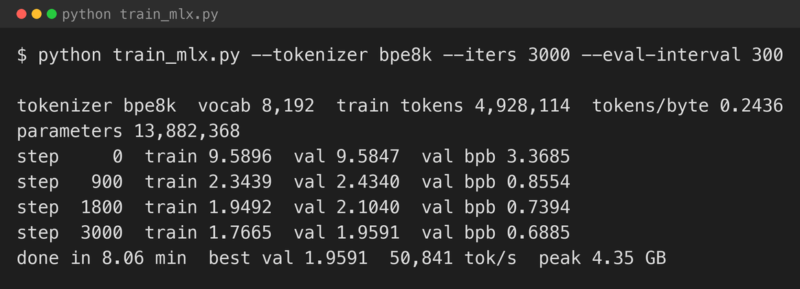
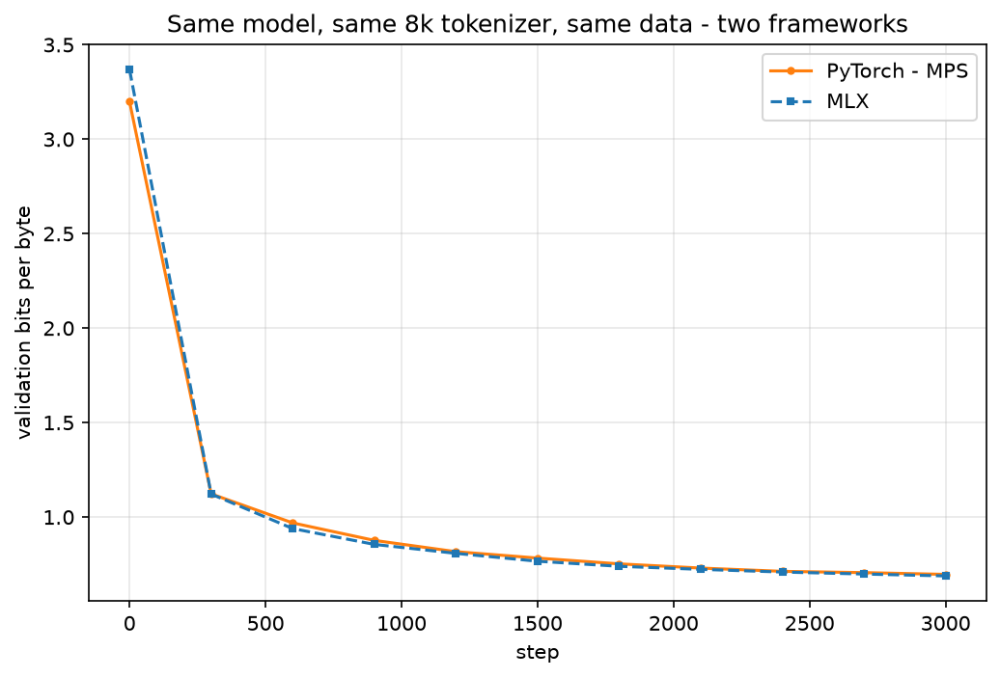
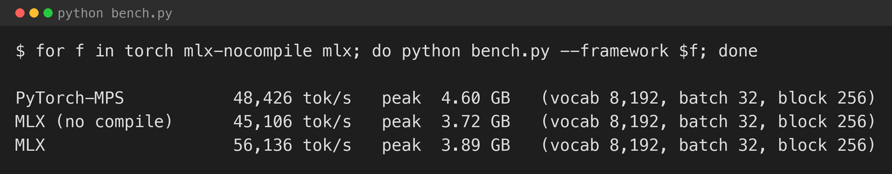
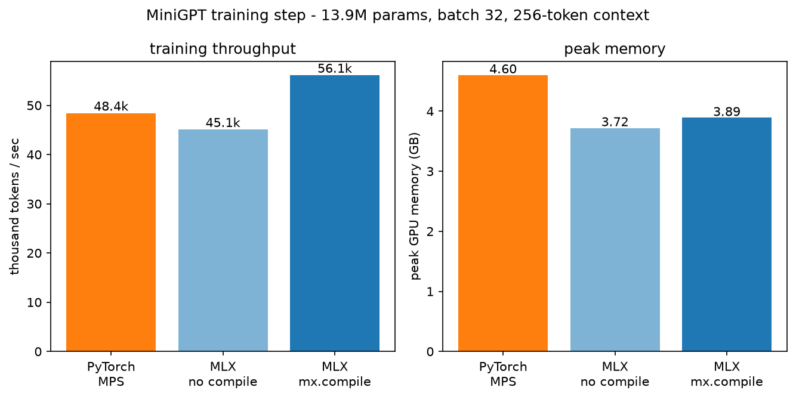
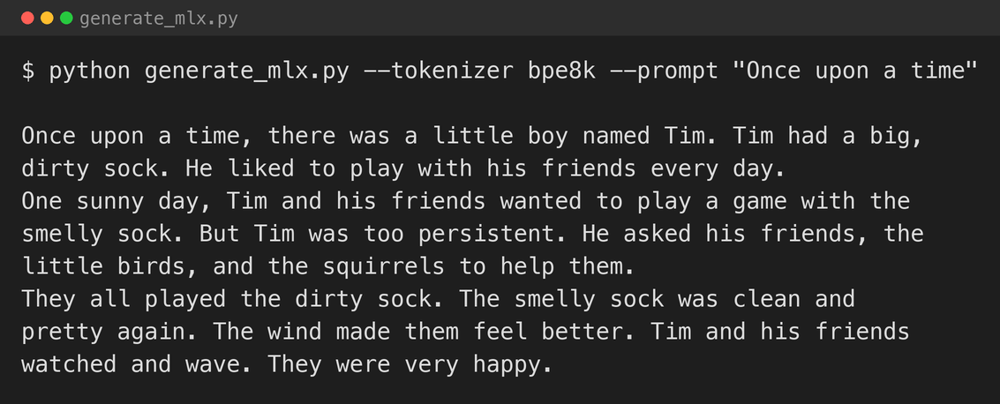

[Part 1](/posts/minigpt/) ran a GPT training pipeline in PyTorch. [Part 2](/posts/minigpt2/) swapped the character tokeniser for a trained 8k byte-level BPE and trained on TinyStories. Both ran on my Mac Studio through PyTorch's Metal Performance Shaders backend, which works but is not what Apple Silicon was designed around.

This part changes the framework and nothing else. Same model — 6 layers, 6 heads, 384-dimensional, 256-token context, weight-tied, 13.9M parameters — same 8k BPE tokeniser from part 2, same TinyStories split, same AdamW schedule. I rebuild all of it in [MLX](https://github.com/ml-explore/mlx), Apple's array framework for machine learning on Apple Silicon, and then run the PyTorch and MLX versions on the same machine to see what the switch actually buys.

I have used MLX before, in [MLX 1](/posts/mlx1/), but that post was about *using* the ecosystem — `mlx_lm.lora` to fine-tune a released model, then fuse and convert it for Ollama. This post is about *writing* model code in MLX directly: the layers, the gradient, the training step.

## Installing MLX

MLX is a single `pip install` with no system dependencies. It needs Apple Silicon and a recent macOS. I used version 0.32.2 on Python 3.13.

```bash
python3 -m venv .venv
source .venv/bin/activate
pip install mlx numpy
```

## Unified memory: the `.to(device)` calls disappear

In the PyTorch version every batch has to be moved to the GPU:

```python
x = x.to(device)   # copy host -> Metal
y = y.to(device)
```

In MLX there is no copy, because there is no separate device memory. An `mx.array` lives in the same unified memory the CPU and GPU both address. You choose where an *operation* runs, not where the data lives, and for this code the default is fine. The batch goes straight from NumPy into an `mx.array` and the model consumes it:

```python
xb, yb = batch(train_ids, block_size, batch_size, rng)   # NumPy
loss = train_step(mx.array(xb), mx.array(yb))
```

On a 64 GB Mac Studio that is 64 GB the model can use, with no host-to-device transfer in the training loop.

## Lazy evaluation

MLX does not run an operation when you write it. It builds a graph and waits. Nothing is computed until something forces it — printing a value, calling `.item()`, or an explicit `mx.eval`. The training loop makes this explicit: one `mx.eval` per step, on the model and optimiser state, is what actually drives the computation forward.

```python
for step in range(iters + 1):
    xb, yb = batch(train_ids, block_size, batch_size, rng)
    loss = train_step(mx.array(xb), mx.array(yb))
    mx.eval(state)          # <- the step runs here
```

It takes a little getting used to after PyTorch's eager execution, but it is what lets MLX fuse work together and skip anything whose result is never needed.

## The gradient is a function

PyTorch accumulates gradients into `.grad` attributes as a side effect of `loss.backward()`. MLX is functional: `nn.value_and_grad` takes the model and a loss function and hands back a new function that returns the loss and the gradients as a tree with the same shape as the parameters.

```python
loss_and_grad = nn.value_and_grad(model, MiniGPT.loss)

def train_step(x, y):
    loss, grads = loss_and_grad(model, x, y)
    grads, _ = optim.clip_grad_norm(grads, 1.0)
    opt.update(model, grads)
    return loss
```

No `zero_grad`, no `.backward()`, no implicit state. The gradients are a value you can inspect, clip, or transform before the optimiser ever sees them.

## `mx.compile`

Wrapping the step in `mx.compile` fuses the forward pass, the backward pass, the gradient clip, and the optimiser update into a single graph. Because the step mutates the model and optimiser, I pass their state as the compiled function's `inputs` and `outputs` so MLX knows it is allowed to update them in place:

```python
state = [model.state, opt.state]

@partial(mx.compile, inputs=state, outputs=state)
def train_step(x, y):
    loss, grads = loss_and_grad(model, x, y)
    grads, _ = optim.clip_grad_norm(grads, 1.0)
    opt.update(model, grads)
    return loss
```

## Attention is one call

The PyTorch version writes scaled dot-product attention out by hand — a matmul, a mask fill, a softmax, another matmul — which is what made it readable in part 1. MLX has a fused primitive with a built-in causal mask:

```python
out = mx.fast.scaled_dot_product_attention(q, k, v, scale=self.scale, mask="causal")
```

Same maths, one kernel. The hand-written version is still the one to read to understand what is happening; this is the one to run.

## Weight tying is just a matmul

In PyTorch I tied the embedding and the output head by assigning one weight to the other. In MLX I do not create a head layer at all — the output is the final hidden state multiplied by the transpose of the token embedding matrix:

```python
def __call__(self, idx):
    x = self.tok_emb(idx) + self.pos_emb(mx.arange(idx.shape[1]))
    for block in self.blocks:
        x = block(x)
    x = self.ln_f(x)
    return x @ self.tok_emb.weight.T   # tied head, no bookkeeping
```

There is one weight matrix, so there is nothing to keep in sync.

The one API surprise porting the training loop was that `tree_flatten`, used to count parameters and to save the checkpoint, lives in `mlx.utils` rather than on `mlx.core` — a one-line import fix, but the kind of thing that stops a first run.

## The port is faithful

Before comparing speed, the MLX model has to be doing the same thing. It is not initialised identically — the PyTorch version applies an explicit normal initialiser from part 1, the MLX version uses the `mlx.nn` layer defaults, and the two frameworks draw from different random number generators — so the loss curves will not lie exactly on top of each other. But run for run they track closely, and both land at the same place.


*The MLX training run — same 3,000 iterations, same 8k tokeniser, same data as the part 2 PyTorch run*


*Validation bits per byte, PyTorch against MLX. The MLX run finishes at 0.689, the PyTorch run at 0.697 — a difference well inside the noise between two different initialisations*

## Head to head

Same model shape, same batch, same data, same machine. `bench.py` times 200 training steps in each configuration after a 20-step warmup, in separate processes so the peak-memory numbers stay clean.


*Training throughput and peak GPU memory, on the 13.9M-parameter model, batch 32, 256-token context*


*The same numbers as bars*

| | Tokens / sec | Peak memory |
|---|---|---|
| PyTorch — MPS | 48,400 | 4.60 GB |
| MLX, no `mx.compile` | 45,100 | 3.72 GB |
| MLX, `mx.compile` | 56,100 | 3.89 GB |

Two things come out of this.

**`mx.compile` is where the speed is.** Uncompiled, the MLX training step is slightly *slower* than PyTorch on MPS — 45,100 tokens per second against 48,400. Adding `mx.compile` lifts it to 56,100, about 24% faster than uncompiled and 16% faster than PyTorch. Fusing the whole step into one graph is not a minor optimisation here; it is the reason to use the framework.

**MLX uses less memory.** Peak GPU memory is 3.7–3.9 GB for MLX against 4.6 GB for PyTorch — 15–20% lower — for the identical model and batch. On a machine where the model, the teacher model in a later part, and everything else share one 64 GB pool, that headroom matters.

The full training runs from the logs tell the same story less precisely: 8.1 minutes for MLX against 12.6 for PyTorch in part 2. Some of that gap is my MLX evaluation loop sampling fewer batches than the PyTorch one, so the controlled `bench.py` figures above are the fair comparison. This is one small model, one configuration, one Mac — not a benchmark. The takeaway is not a guaranteed speed-up. It is that MLX is built around the single memory pool, so the device bookkeeping goes away, the fast paths are the default, and `mx.compile` has real headroom to work with.

## Generating text

```python
idx = mx.array([tok.encode("Once upon a time")])
for _ in range(300):
    logits = model(idx[:, -model.block_size:])[:, -1, :]
    idx = mx.concatenate([idx, sample(logits, temperature=0.8, top_k=200)], axis=1)
print(tok.decode(idx[0].tolist()))
```


*The MLX model continuing "Once upon a time"*

Tim has a dirty sock, the sock stays the subject of the story, and the passage has a beginning, middle, and end. It has the same failure modes as the part 2 PyTorch model — "watched and wave" is a dropped inflection, and longer samples drift — and it reads with the same character, which is the point: the port produces the same model, not just a model with a similar loss.

## What I took from it

- **Unified memory removes a whole category of code.** No `.to(device)`, no host-to-device copies in the loop, and the full 64 GB is available to the model.
- **Lazy evaluation plus `mx.compile` is where MLX earns its speed.** Uncompiled it was no faster than PyTorch-MPS here; compiled it was 16% faster and used 15% less memory. The cost is having to think about when computation is actually forced.
- **The functional gradient is cleaner than PyTorch's implicit `.grad` state** once you adjust to it — the gradients are a value you clip and pass on, not a side effect.
- **A faithful port is a real check.** Matching loss curves and matching generation character across two frameworks with different initialisers is good evidence the model is what I think it is.

## Try it yourself

The code is in [github.com/Haddley/minigpt-series](https://github.com/Haddley/minigpt-series) under `part3/`. It reuses the data and tokenisers prepared in `part2/`:

```bash
cd part2 && python prepare_data.py && python tokenizers_setup.py && cd ..
cd part3
python train_mlx.py --tokenizer bpe8k
python bench.py --framework torch
python bench.py --framework mlx
python generate_mlx.py --prompt "Once upon a time"
```

MLX requires Apple Silicon. On any other machine the PyTorch path from [part 2](/posts/minigpt2/) is the one to use.

Part 4 keeps the MLX framework and replaces the vanilla GPT block with the modern one — RMSNorm, rotary position embeddings, SwiGLU, and grouped-query attention — the layout Meta used for the Llama 3.2 1B and 3B edge models.

## References

- [MLX — Apple machine learning research](https://github.com/ml-explore/mlx)
- [MLX documentation](https://ml-explore.github.io/mlx/build/html/index.html)
- [mlx-examples — transformer_lm](https://github.com/ml-explore/mlx-examples/tree/main/transformer_lm)
- [MiniGPT: Rebuilding GPT from First Principles — Jibin Joseph, 2026](https://arxiv.org/abs/2605.17398)
- [Attention Is All You Need — Vaswani et al., 2017](https://arxiv.org/abs/1706.03762)
