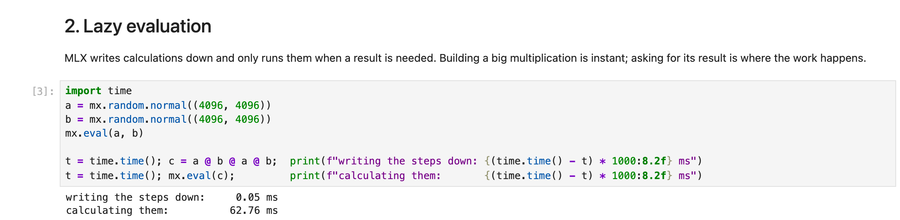
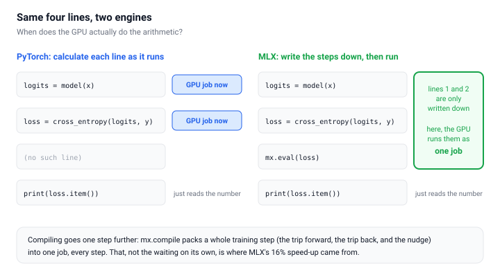
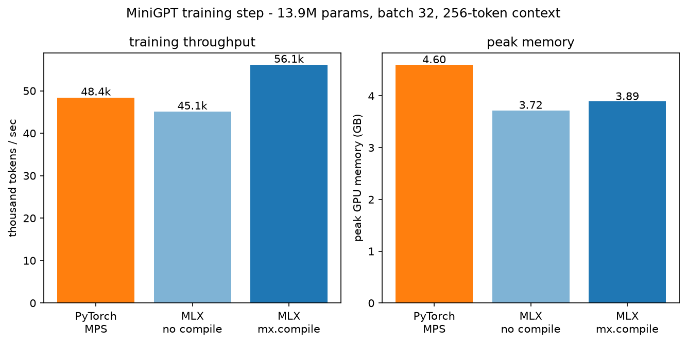
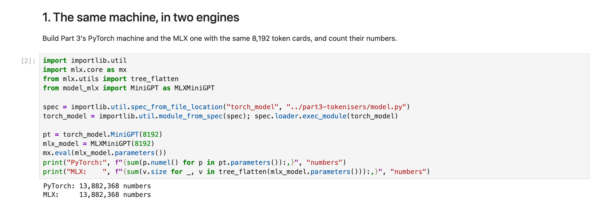
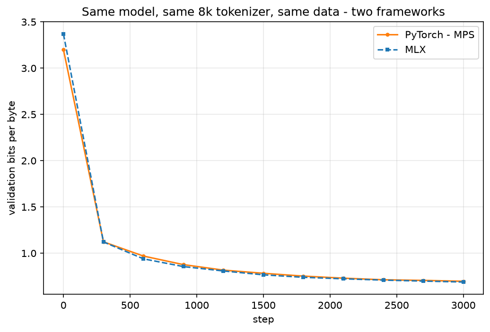
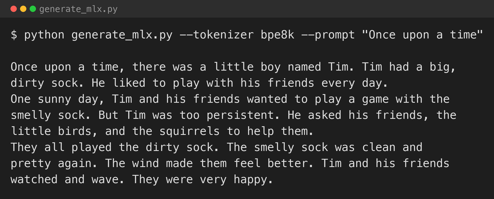
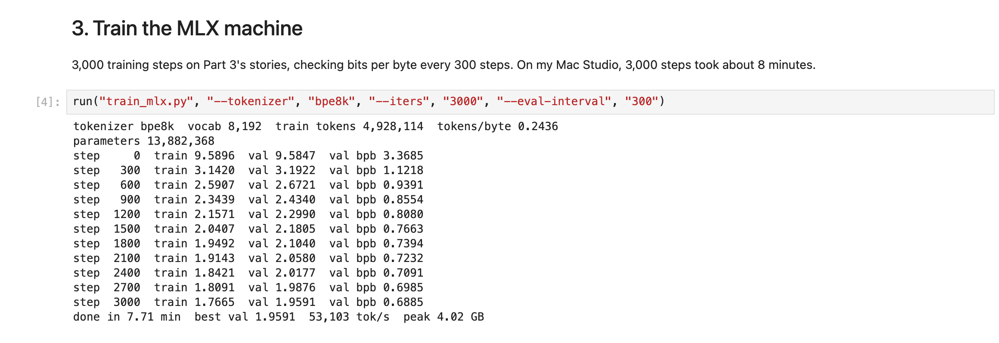
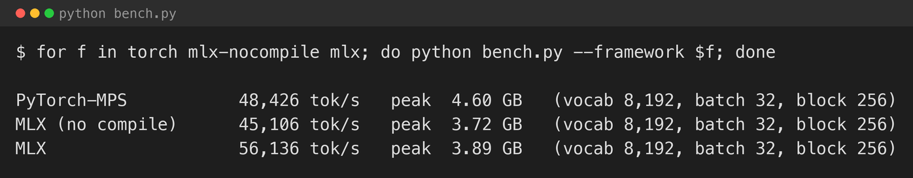
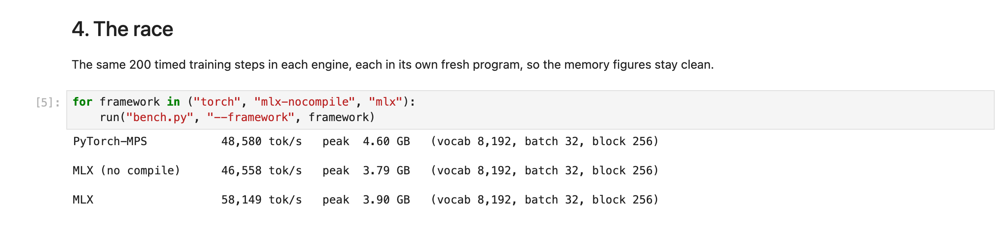
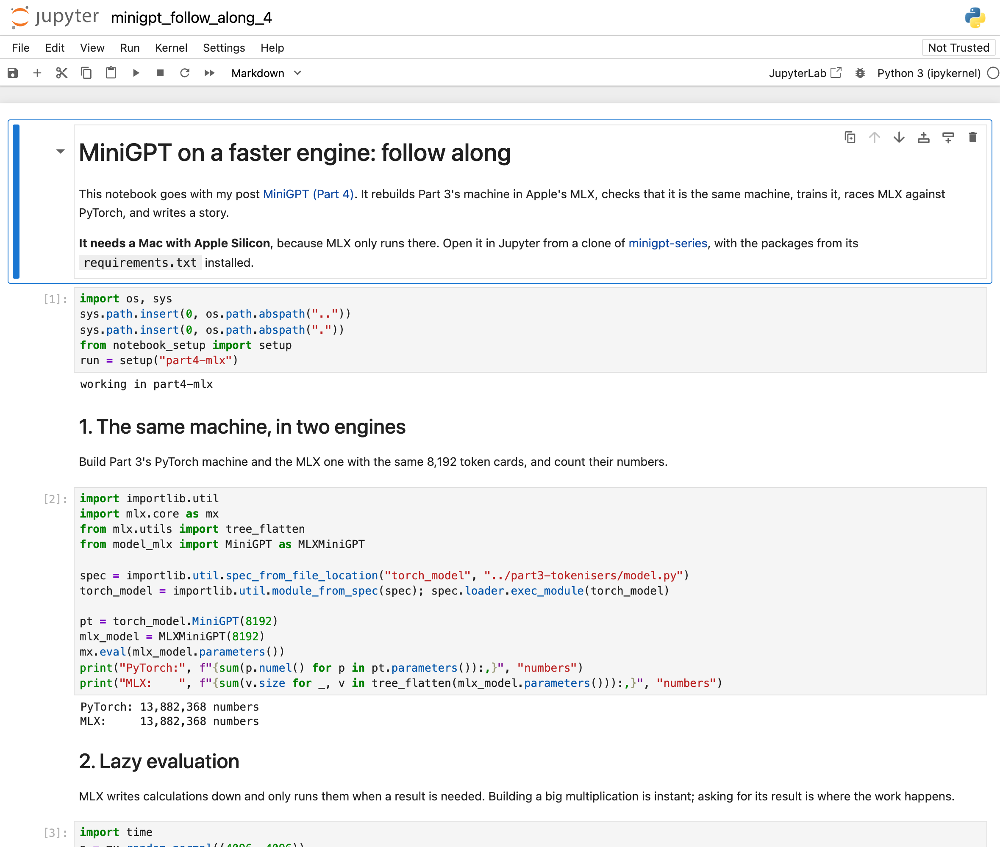

[Part 3](/posts/minigpt2/) settled the pieces: my own 8,192-piece tokeniser matched GPT-2's on TinyStories, at under half the size. This post keeps that machine exactly as it is, the same blocks, the same cards, the same stories, and changes only the *engine* underneath it: the library that does the arithmetic. Parts 1 to 3 used PyTorch. This post rebuilds the machine in [MLX](https://github.com/ml-explore/mlx), Apple's library for machine learning on its own chips, and races the two on the same Mac.

I have used MLX before, in [MLX 1](/posts/mlx1/), but only to fine-tune a model someone else had released. This post writes the machine itself in MLX: the layers, the training step, and the gradient.

The code is in [`part4-mlx/`](https://github.com/Haddley/minigpt-series/tree/main/part4-mlx), with a follow-along notebook, [`minigpt_follow_along_4.ipynb`](https://github.com/Haddley/minigpt-series/blob/main/part4-mlx/minigpt_follow_along_4.ipynb). MLX only runs on Apple Silicon, so the notebook is for running on a Mac, not in Colab.

| This post's machine | |
|---|---|
| What changed | **the engine** |
| Text | TinyStories |
| Pieces | my 8,192 |
| Blocks | 6, each attention (6 heads) then an MLP |
| Card size | 384 |
| Positions | 256, position cards |
| Engine | **MLX** |
| Size | 13.9 million numbers |
| Score | 0.689 bits per byte |

## The big picture, in plain English

### Same machine, different engine

:::brain-power
The machine, the stories, the settings, and the computer are all exactly the same. What could possibly make training faster?
:::

A library like PyTorch or MLX is the engine under the machine. The machine says *what* to calculate: look up the token cards, run attention, run the MLP, score the answer cards. The engine decides *how*: where the numbers are kept, when each calculation runs, and how the calculations are packed together for the chip. Change the engine, and the same calculations can run faster, or in less memory, without the answers changing.

MLX was designed around three things about Apple's chips, and each one is a chance to save work.

### One shared pool of memory

Most computers keep two separate stores of memory: one for the main processor, and one on the graphics chip, the GPU, which does the heavy arithmetic. Every batch of training text has to be copied from one to the other before the GPU can use it. PyTorch is built for that kind of computer, so its code is full of instructions to move things across:

```python
x = x.to(device)   # copy the batch to the GPU
```

Apple's chips have one pool of memory that the processor and the GPU share. MLX is built around that, so there is nothing to copy and no `.to(device)` anywhere: the training batch goes straight into an MLX array, and the GPU reads it where it is. On my 64 GB Mac Studio, all 64 GB is available to the machine.

### Calculating only when asked

PyTorch calculates each line the moment it runs. MLX does not. When a line says "multiply these" or "add those", MLX writes the step down and waits. Nothing is calculated until something actually needs a result: printing a number, or an explicit `mx.eval`.

That sounds like a delay, but it gives MLX the whole list of steps before it starts, so it can see which ones can be done together, and which ones are never needed at all. The name for it is *lazy evaluation*.

:::pencil Which lines make MLX calculate?
In this MLX code, which lines actually make the GPU do arithmetic, and which only write steps down?

```python
logits = model(x)            # 1
loss = cross_entropy(logits, y)  # 2
mx.eval(loss)                # 3
print(loss.item())           # 4
```

:::answer
Lines 1 and 2 only write steps down: the whole trip forward through the machine and the surprise score are recorded, but not calculated. Line 3 is where the GPU does all of that work, in one go. Line 4 just reads the finished number. If line 3 were missing, line 4 would trigger the calculation instead, because printing needs a real number.
:::
:::


*The follow-along notebook in Jupyter on my Mac, timing lazy evaluation: writing a big multiplication down took 0.05 milliseconds, and the work, 63 milliseconds, happened at `mx.eval`*


*The same four lines on each engine. PyTorch sends the GPU a job for every line; MLX writes lines 1 and 2 down and runs them together at `mx.eval`*

### Packing the whole training step into one

Because MLX writes the steps down first, it can do something bigger: take one whole training step (the trip forward, the [trip back](/posts/minigpt-grown/#how-does-it-know-which-way-to-nudge) that finds every dial's slope, capping the slopes if they are unusually big, and turning the dials) and *compile* it, which packs it into a single combined job for the GPU. That saves the GPU from starting and stopping between thousands of small jobs. In MLX it is one line, `mx.compile`, and it turns out to be where almost all of the speed comes from.

### The race

I raced three engines on the same machine, the same batch of 32 snippets of 256 tokens, on the same Mac Studio. `bench.py` times 200 training steps of each, after 20 warm-up steps, each in its own fresh program so that the memory figures stay clean.

| Engine | Tokens per second | Most memory used |
|---|---|---|
| PyTorch, on the Mac's GPU | 48,426 | 4.60 GB |
| MLX, not compiled | 45,106 | 3.72 GB |
| MLX, compiled | **56,136** | 3.89 GB |


*The same three runs as bars: speed on the left, memory on the right*

Two things stand out:

- **Compiling is where the speed is.** Without `mx.compile`, MLX is slightly *slower* than PyTorch. With it, MLX is about a quarter faster than itself, and 16% faster than PyTorch. When the notebook ran the same race again later, compiled MLX came out 20% faster, so the honest range from my runs is 16 to 20%.
- **MLX uses less memory either way:** 3.7 to 3.9 GB against PyTorch's 4.6 GB, about 15 to 20% less for exactly the same machine. Later in this series, when a much bigger teacher model has to share the same pool, that headroom matters.

:::watch-it
This is one small machine, one setting, on one Mac: not a general benchmark. The full training runs show the same direction, 8.1 minutes for MLX against 12.7 for PyTorch, but my MLX script also checks its progress with fewer sample batches, so the controlled race above is the fair comparison.
:::

### Same answers?

A faster engine is no use if it changes the answers. The two versions do not start from exactly the same random numbers, because the two libraries draw their starting dials differently, so their training curves cannot lie exactly on top of each other. But they should end up in the same place, and they do: after 3,000 steps, the MLX machine scores **0.689 bits per byte** on the test stories, and the PyTorch machine from Part 3 scores **0.697**. That gap is about the size of the luck between two random starts of the same machine: in [Part 5](/posts/minigpt4/#how-much-is-luck), three random starts of one design scored up to 0.007 apart.


*The notebook built the same machine in both engines, and counted exactly the same 13,882,368 numbers in each*


*Bits per byte on the test stories while training, PyTorch against MLX*

And they write the same kind of story:


*The MLX machine continuing "Once upon a time"*

Tim has a dirty sock, the sock stays the subject of the story, and the story has a beginning, a middle, and an end. It makes the same kinds of slips as the PyTorch machine, such as "watched and wave", and longer samples drift in the same way. The port made the same machine, not just a machine with a similar score.

:::fireside-chat Tonight: PyTorch and MLX on whose Mac it is
**PyTorch:** I ran Parts 1 to 3 of this series without a single complaint. I run on nearly every computer in the world.

**MLX:** And on this one, you spend your time copying batches to a GPU that was already sharing your memory.

**PyTorch:** I calculate every line the moment it runs. You can watch exactly what happens, line by line. That is how people learn.

**MLX:** And I wait, so that I can see the whole step and pack it into one job. Compiled, I trained this machine 16 to 20% faster than you, in less memory.

**PyTorch:** Not compiled, you were slower than me.

**MLX:** True. My speed comes from seeing the whole job first. Without that, I am just another engine.

**PyTorch:** And the answers?

**MLX:** The same, to within about what a different random start makes. 0.689 against your 0.697. Same machine, same stories.

**PyTorch:** Then we agree. On a Mac, you are faster. Everywhere else, I am the one that runs.
:::

:::bullet-points Part 4, in short
- The engine (PyTorch or MLX) decides how the machine's calculations run, not what they are.
- Apple's chips share one pool of memory, so MLX never copies batches to the GPU.
- MLX writes calculations down and only runs them when a result is needed: lazy evaluation.
- `mx.compile` packs a whole training step into one job, and that is where the speed comes from.
- Compiled MLX trained 16 to 20% faster than PyTorch, in 15 to 20% less memory, with the same answers.
:::

:::no-dumb-questions
**Q: Do I need a Mac for this?**

A: For MLX, yes: it only runs on Apple Silicon. Everything in Parts 1 to 3 runs anywhere, and [Part 3](/posts/minigpt2/)'s PyTorch code is the one to use on other machines.

**Q: If MLX is lazy, could it ever skip something I wanted?**

A: Only work whose result nothing ever uses. That is why the training loop calls `mx.eval` on the machine's dials and the optimiser's state every step: it asks for exactly the results that matter, so all the work that leads to them is done.

**Q: Why was MLX slower without compiling?**

A: Without compiling, MLX runs the training step as many small jobs, like PyTorch does, and PyTorch has had years of tuning for exactly that. Compiling is what lets MLX use what it learned by waiting: it sees the whole step and packs it.

**Q: Why does MLX use less memory for the same machine?**

A: Partly because nothing is copied, so there is one copy of each batch instead of two. Partly because, seeing the whole step at once, MLX can work out which in-between results it never needs to keep.

**Q: Is the machine really the same?**

A: Yes: the same blocks, the same token cards doubling as the answer cards, the same 13.9 million numbers. Only how they are calculated changes. The matching scores and matching stories are the check.
:::

:::pencil Who does what?
Match each everyday description on the left with its proper name on the right.

| Everyday description | Proper name |
|---|---|
| 1. the library that does the arithmetic | A. *lazy evaluation* |
| 2. one pool of memory shared by the processor and the GPU | B. `mx.compile` |
| 3. writing calculations down, and running them only when needed | C. the *framework* |
| 4. packing a whole training step into one job | D. *unified memory* |
| 5. the slopes of every dial, all together | E. the *gradient* |

:::answer
1 is C, 2 is D, 3 is A, 4 is B, and 5 is E.
:::
:::

### The jargon decoder

The terms for the whole series are collected in one table, [the series glossary](/posts/minigpt6/#the-series-glossary).

| What I called it | What the experts call it |
|---|---|
| the engine | the *framework* |
| one shared pool of memory | *unified memory* |
| writing calculations down and running them later | *lazy evaluation* |
| packing a whole step into one job | *compiling*, with `mx.compile` |
| the slopes of every dial, all together | the *gradient* |
| capping the slopes if they are unusually big | *gradient clipping* |
| copying a batch to the GPU | a *host-to-device transfer* |

## The code, in the order it runs

The code is in [`part4-mlx/`](https://github.com/Haddley/minigpt-series/tree/main/part4-mlx). It reuses the stories and tokenisers that Part 3's scripts prepare, so `data.py` reads them from `part3-tokenisers/data/`.

### The machine: `model_mlx.py`

The machine is Part 3's, line for line, with three small differences. First, attention is one built-in call, which does the query, key, and value matching, the earlier-positions-only rule, and the shares, all in one fused job:

```python
out = mx.fast.scaled_dot_product_attention(q, k, v, scale=self.scale, mask="causal")
```

The hand-written version in [Part 1](/posts/minigpt/#attention-causalselfattention-cell-12) is still the one to read to understand attention; this is the one to run.

Second, the token cards double as the answer cards without any bookkeeping, because there is no separate answer layer at all: the last working cards are simply scored against the token cards.

```python
def __call__(self, idx):
    x = self.tok_emb(idx) + self.pos_emb(mx.arange(idx.shape[1]))
    for block in self.blocks:
        x = block(x)
    x = self.ln_f(x)
    return x @ self.tok_emb.weight.T   # the token cards are the answer cards
```

Third, there is no `.to(device)`, anywhere.

### The training step: `train_mlx.py`

In PyTorch, the trip back that finds every dial's slope happens as a side effect of `loss.backward()`, as [Part 2](/posts/minigpt-grown/#following-the-blame-back-with-real-numbers) showed. In MLX it is a function: `nn.value_and_grad` takes the machine and its surprise-score function, and gives back a new function that returns the score *and* every dial's slope, as an ordinary value. The whole step is then compiled:

```python
loss_and_grad = nn.value_and_grad(model, MiniGPT.loss)
state = [model.state, opt.state]

@partial(mx.compile, inputs=state, outputs=state)
def train_step(x, y):
    loss, grads = loss_and_grad(model, x, y)
    grads, _ = optim.clip_grad_norm(grads, 1.0)
    opt.update(model, grads)
    return loss
```

`inputs=state, outputs=state` tells MLX that the compiled step is allowed to change the machine's dials and the optimiser's memory. Then the training loop makes each step happen:

```python
for step in range(args.iters + 1):
    xb, yb = batch(train_ids, args.block_size, args.batch_size, rng)
    loss = train_step(mx.array(xb), mx.array(yb))
    mx.eval(state)          # the step is calculated here
```


*The MLX training run in the notebook: 3,000 steps, the same 8k tokeniser and stories as Part 3, finishing at 0.6885 bits per byte*

### The race: `bench.py`

`bench.py --framework torch`, `--framework mlx-nocompile`, and `--framework mlx` each time 200 training steps of the same machine, after 20 warm-up steps, and report tokens per second and the most memory used. Each runs as its own program, so one cannot inherit another's memory.


*The three races*


*The same race, run again later in the notebook: this time compiled MLX was 20% faster than PyTorch*

### Writing: `generate_mlx.py`

```python
idx = mx.array([tok.encode("Once upon a time")])
for _ in range(300):
    logits = model(idx[:, -model.block_size:])[:, -1, :]
    idx = mx.concatenate([idx, sample(logits, temperature=0.8, top_k=200)], axis=1)
print(tok.decode(idx[0].tolist()))
```

The same loop as every part so far: score the last working card against the answer cards, spin the wheel, and put the new token on the end.

## Try it yourself

- **The follow-along notebook:** [`part4-mlx/minigpt_follow_along_4.ipynb`](https://github.com/Haddley/minigpt-series/blob/main/part4-mlx/minigpt_follow_along_4.ipynb). Open it in Jupyter on a Mac with Apple Silicon. It prepares the stories, checks that the MLX machine has the same 13.9 million numbers as Part 3's, trains it, runs the race, and writes. It is saved with the outputs from my own run, so you can read every result on GitHub without a Mac.


*The notebook open in Jupyter on my Mac, with the outputs saved from my run*

- **On the command line:**

```bash
git clone https://github.com/Haddley/minigpt-series.git
cd minigpt-series
python3 -m venv .venv && source .venv/bin/activate && pip install -r requirements.txt
cd part3-tokenisers && python prepare_data.py && python tokenizers_setup.py && cd ..
cd part4-mlx
python train_mlx.py --tokenizer bpe8k --iters 3000 --eval-interval 300
python bench.py --framework torch
python bench.py --framework mlx-nocompile
python bench.py --framework mlx
python generate_mlx.py --prompt "Once upon a time"
```

MLX needs Apple Silicon. On any other machine, [Part 3](/posts/minigpt2/)'s PyTorch code is the one to use.

[Part 5](/posts/minigpt4/) keeps MLX and the 8k pieces, and swaps the original 2017 design of the block for the modern one used in Meta's Llama models, one change at a time.

## References

- [MLX — Apple machine learning research](https://github.com/ml-explore/mlx)
- [MLX documentation](https://ml-explore.github.io/mlx/build/html/index.html)
- [mlx-examples — transformer_lm](https://github.com/ml-explore/mlx-examples/tree/main/transformer_lm)
- [MiniGPT: Rebuilding GPT from First Principles — Jibin Joseph, 2026](https://arxiv.org/abs/2605.17398)
- [Attention Is All You Need — Vaswani et al., 2017](https://arxiv.org/abs/1706.03762)
