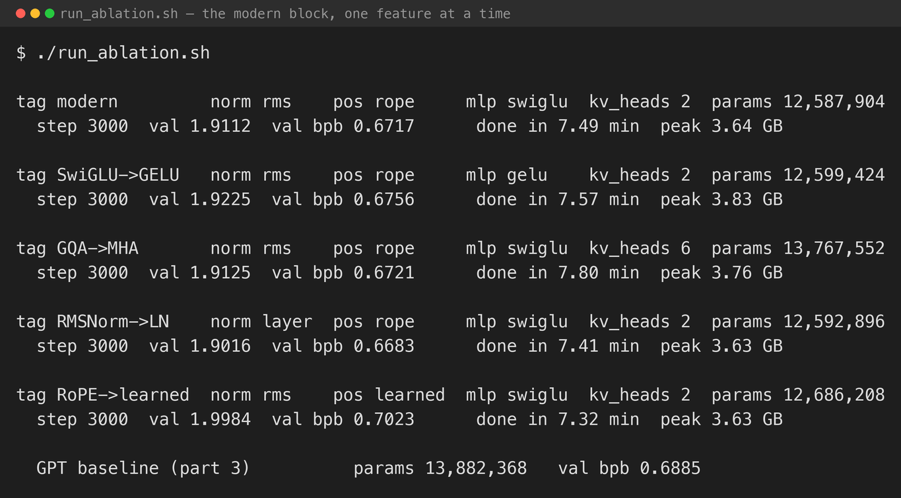
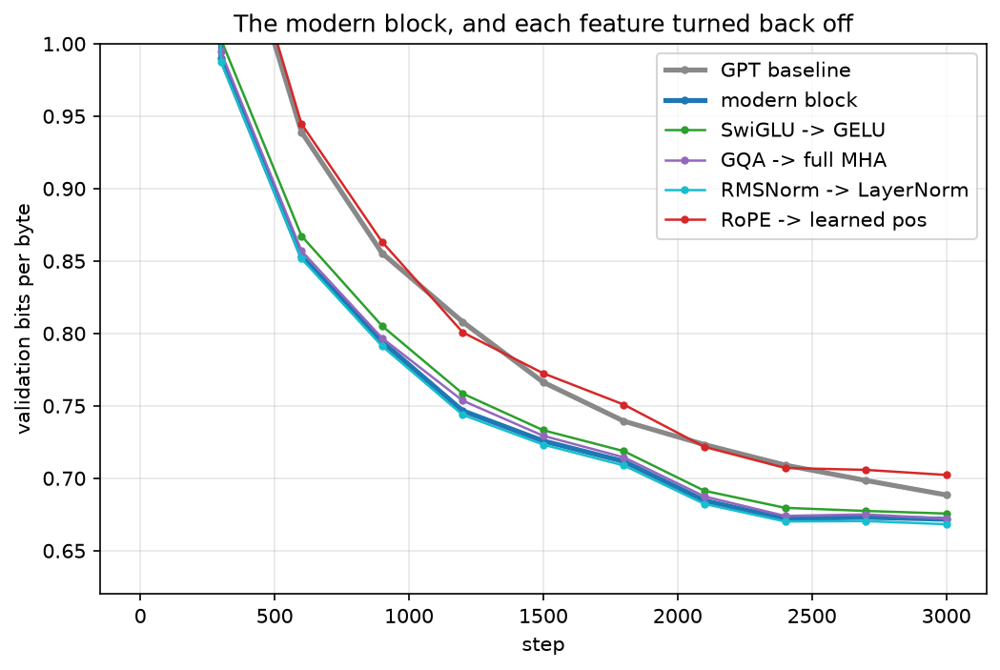
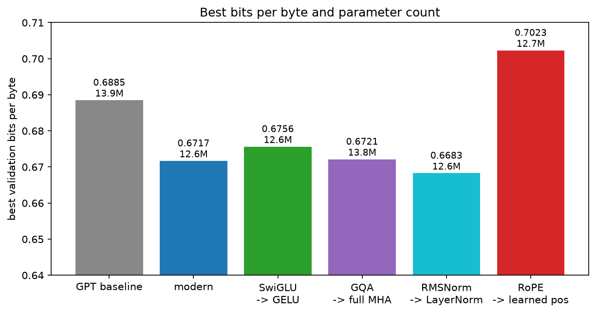
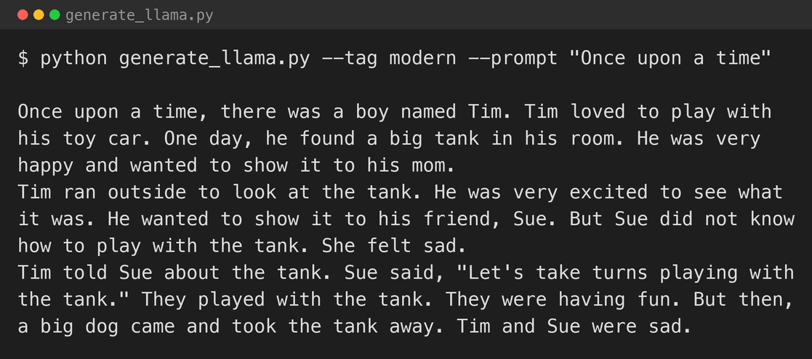

[Part 3](/posts/minigpt3/) rebuilt MiniGPT in MLX with the original 2017 Transformer block: LayerNorm, a learned positional embedding table, multi-head attention, a GELU MLP. That is the block in "Attention Is All You Need" and in Karpathy's nanoGPT.

Modern small models do not use that block. Meta's [Llama 3 Herd of Models](https://arxiv.org/abs/2407.21783) paper is the working blueprint for the 1B–3B range, and Llama 3.2 1B and 3B — the models Apple and others ship on phones — use four changes to it: RMSNorm instead of LayerNorm, rotary position embeddings instead of a learned table, a SwiGLU MLP instead of GELU, and grouped-query attention instead of plain multi-head. This post makes all four changes in MLX, then turns each one back off on its own to see which is doing the work.

The model is small — dimension 384, 6 layers, 6 query heads, 2 key/value heads, SwiGLU inner size 1,024, 256-token context, the 8k BPE tokeniser from [part 2](/posts/minigpt2/), weight-tied, no biases anywhere. That is the *shape* of Llama 3.2 1B at roughly one-hundredth of the parameters. I checked the layout against `mlx-lm`'s [`models/llama.py`](https://github.com/ml-explore/mlx-lm/blob/main/mlx_lm/models/llama.py).

## The four changes

**RMSNorm.** LayerNorm subtracts the mean, divides by the standard deviation, then scales and shifts. RMSNorm divides by the root-mean-square only — no mean subtraction, no bias term. It is one fewer reduction and two fewer parameter vectors per norm, and [Zhang and Sennrich](https://arxiv.org/abs/1910.07467) showed it trains about as well.

```python
self.attn_norm = nn.RMSNorm(dim)   # was nn.LayerNorm(dim)
```

**Rotary position embeddings.** The learned positional table in part 1–3 is a `block_size × dim` matrix added to the token embeddings. RoPE instead rotates the query and key vectors by an angle proportional to their position, so that when two of them are dotted together in attention the result depends only on how far apart they are. There is no table to learn or to size, and nothing stops you running the model past its trained context length. [Su et al.](https://arxiv.org/abs/2104.09864) introduced it; every Llama uses it.

```python
self.rope = nn.RoPE(head_dim, traditional=False, base=10000)
...
q, k = self.rope(q), self.rope(k)
```

**SwiGLU.** The GELU MLP is `down(gelu(up(x)))` — two matrices, inner size `4·dim`. SwiGLU is `down(silu(gate(x)) * up(x))` — three matrices, and to keep the parameter count the same the inner size shrinks to about `8/3·dim` (here 1,024, which makes `384×1024×3` exactly equal to the GELU block's `384×1536×2`). [Shazeer](https://arxiv.org/abs/2002.05202) found the gated version trains better; the paper's own line is that these architectures "work better in practice" and offers no deeper reason.

```python
def __call__(self, x):
    return self.w2(nn.silu(self.w1(x)) * self.w3(x))
```

**Grouped-query attention.** Plain multi-head attention gives every query head its own key and value head. GQA gives the query heads their full count (6 here) but shares key and value across groups — 2 K/V heads, each serving 3 query heads. Fewer K and V projection parameters, and at inference the key–value cache is a third of the size. [Ainslie et al.](https://arxiv.org/abs/2305.13245) showed the quality cost is small. MLX's fused attention handles the head-count mismatch directly:

```python
k = self.wk(x).reshape(B, T, self.n_kv_heads, self.head_dim).transpose(0, 2, 1, 3)
out = mx.fast.scaled_dot_product_attention(q, k, v, scale=self.scale, mask="causal")
```

## The ablation

Six runs, each 3,000 iterations on the same TinyStories split as parts 2 and 3, same optimiser, same 8k tokeniser. The baseline is the part 3 GPT block. Then the full modern block, then the modern block with each single feature reverted.


*The modern block and the four single-feature reversions. Every configuration is close on parameter count except full multi-head attention, which adds back 1.2M*


*Validation bits per byte. The modern block and its RMSNorm / SwiGLU / GQA variants track together below the grey baseline; reverting RoPE (red) lands back on the baseline*


*Best validation bits per byte, with parameter count under each bar*

| Run | Params | Best bits/byte |
|---|---|---|
| GPT block (part 3) | 13.9M | 0.6885 |
| **Modern block** | **12.6M** | **0.6717** |
| — SwiGLU → GELU | 12.6M | 0.6756 |
| — GQA → full MHA | 13.8M | 0.6721 |
| — RMSNorm → LayerNorm | 12.6M | 0.6683 |
| — RoPE → learned positions | 12.7M | 0.7023 |

## What actually matters

**RoPE is the whole difference.** The modern block beats the GPT baseline by 0.017 bits per byte. Revert only the position embedding — keep RMSNorm, SwiGLU, and GQA — and the model scores 0.7023, *worse* than the baseline's 0.6885. Every bit of the modern block's edge over the 2017 block, at this scale and on this data, is the switch from a learned position table to rotary embeddings.

**GQA is free.** Reverting to full multi-head attention changed bits per byte from 0.6717 to 0.6721 — noise — while adding 1.2M parameters, a tenth of the model. Two K/V heads did the job of six. That is the result the KV-cache work in [part 6](/posts/minigpt6/) leans on.

**SwiGLU is a small real win.** 0.6717 against 0.6756 for the GELU MLP, at the same parameter count. Worth taking, not decisive.

**RMSNorm is not an accuracy choice.** LayerNorm actually scored 0.003 *better* here. RMSNorm is chosen because it is cheaper — fewer operations per layer — and the quality difference at 13M parameters is within the noise between runs. The Llama papers adopt it for the same reason at 1000× the scale.

None of this contradicts the papers. It says that at 13M parameters and 20 MB of simple text, the position encoding is the change that moves the loss, and the other three are efficiency decisions that happen not to cost anything.

## Generating text


*The modern-block model continuing "Once upon a time"*

Tim has a toy car, then a tank, and the tank stays the subject through the dog stealing it. It reads like the part 2 and 3 models — same data, same budget — which is the expected outcome: a better block at this scale buys a small, measurable drop in loss, not a visible jump in fluency.

## What I took from it

- **"Modern architecture" is not one thing.** Four independent changes, and here exactly one of them — RoPE — accounts for the quality difference.
- **Grouped-query attention costs nothing to add and saves a tenth of the model,** before you even get to the inference-time KV-cache saving.
- **Some choices in the big-model recipe are about compute, not accuracy.** RMSNorm did not help the loss here; it is in the recipe because it is faster, and at scale faster is what matters.
- **The block is a small lever.** The samples did not change. Scale, data, and the tokeniser are still doing the heavy lifting — the same conclusion as [part 1](/posts/minigpt/).

## Try it yourself

The code is in [github.com/Haddley/minigpt-series](https://github.com/Haddley/minigpt-series) under `part4/`:

```bash
python train_llama.py --tag modern
python train_llama.py --tag gelu --mlp gelu
python train_llama.py --tag mha  --gqa-off
python train_llama.py --tag ln   --norm layer
python train_llama.py --tag learned --pos learned
python figures.py
python generate_llama.py --tag modern --prompt "Once upon a time"
```

Requires Apple Silicon for MLX.

[Part 5](/posts/minigpt5/) keeps this model and adds a teacher: GPT-2 small, frozen, supplying token-probability targets so the small model learns from a bigger one's judgement — the distillation trick behind Llama 3.2 1B and 3B.

## References

- [The Llama 3 Herd of Models — Meta AI, 2024](https://arxiv.org/abs/2407.21783)
- [Llama 3.2: revolutionizing edge AI and vision — Meta AI, 2024](https://ai.meta.com/blog/llama-3-2-connect-2024-vision-edge-mobile-devices/)
- [Root Mean Square Layer Normalization — Zhang & Sennrich, 2019](https://arxiv.org/abs/1910.07467)
- [RoFormer: Enhanced Transformer with Rotary Position Embedding — Su et al., 2021](https://arxiv.org/abs/2104.09864)
- [GLU Variants Improve Transformer — Shazeer, 2020](https://arxiv.org/abs/2002.05202)
- [GQA: Training Generalized Multi-Query Transformer Models — Ainslie et al., 2023](https://arxiv.org/abs/2305.13245)
- [mlx-lm](https://github.com/ml-explore/mlx-lm)
