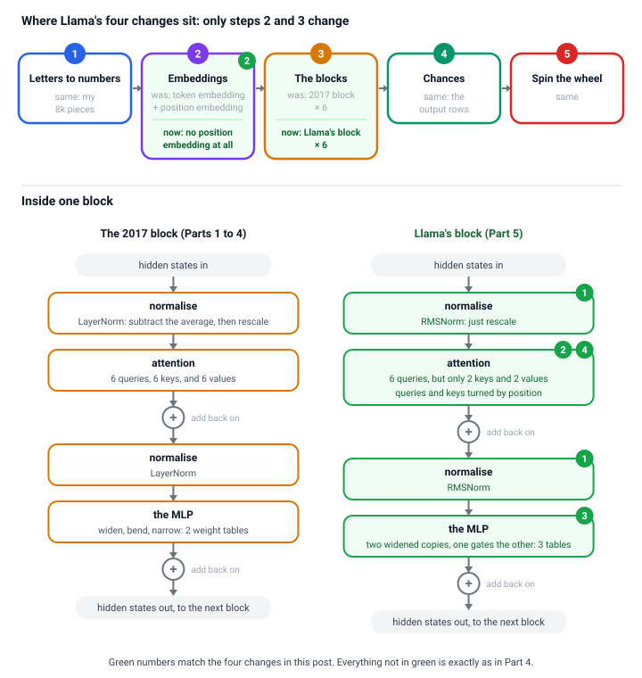
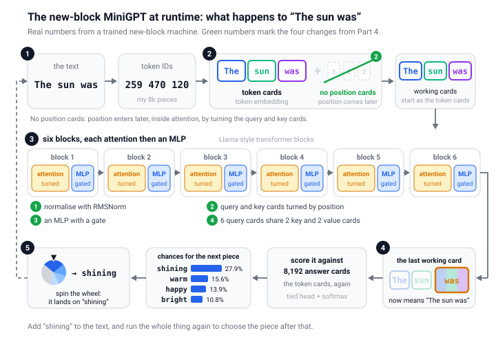
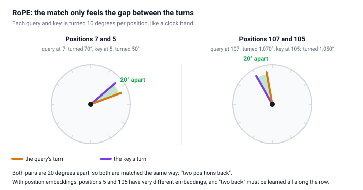
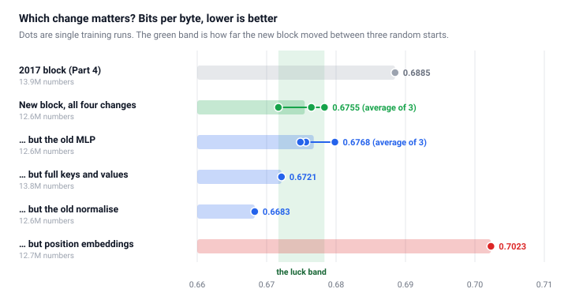
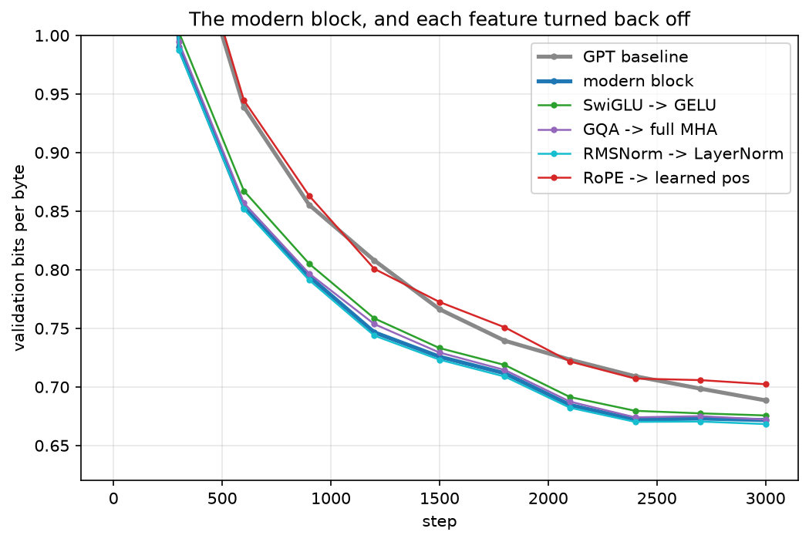
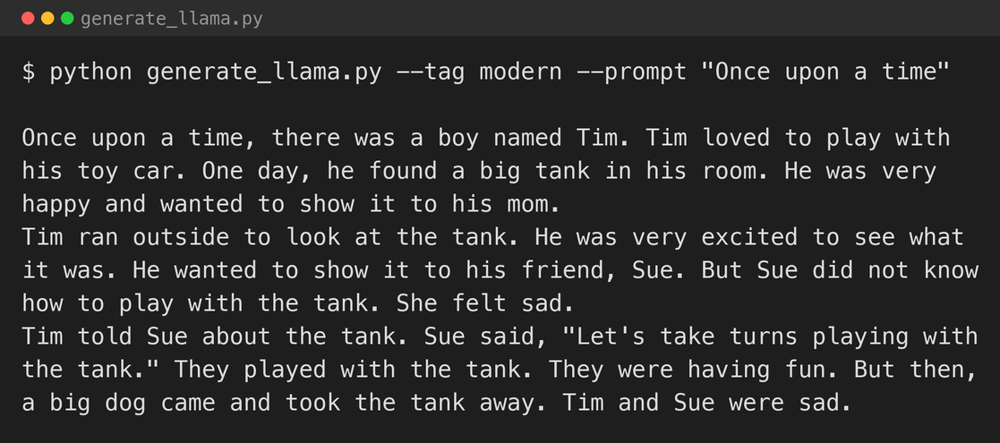
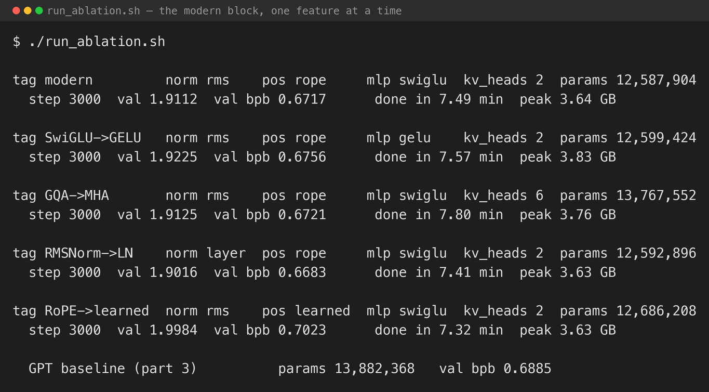

Every MiniGPT so far has used the block from 2017, the one in "Attention Is All You Need" and in Karpathy's nanoGPT: normalise, attention, normalise, MLP. Today's small models do not. Meta's Llama 3.2 1B and 3B, the models that ship on phones, use four changes to that block. This post makes all four changes to the machine from [Part 4](/posts/minigpt3/), still in MLX, still on Part 3's 8k pieces and stories, and then turns each change back off on its own, to find out which ones actually do the work.

The code is in [`part5-modern-block/`](https://github.com/Haddley/minigpt-series/tree/main/part5-modern-block), with a follow-along notebook for a Mac, [`minigpt_follow_along_5.ipynb`](https://github.com/Haddley/minigpt-series/blob/main/part5-modern-block/minigpt_follow_along_5.ipynb).

| This post's machine | |
|---|---|
| What changed | **the block** |
| Text | TinyStories |
| Pieces | my 8,192 |
| Blocks | 6 of **Llama's design: RMSNorm, a gated MLP, and 6 query cards sharing 2 key and 2 value cards** |
| Card size | 384 |
| Positions | 256, **with no position cards: query and key cards are turned instead** |
| Engine | MLX |
| Size | **12.6 million numbers** |
| Score | **0.6755 bits per byte**, the average of three random starts |

## The big picture, in plain English

:::brain-power
Here are the four changes Meta made to the 2017 block. Before reading on, guess: which one do you think makes the biggest difference to how well a small machine learns?

1. a simpler way to normalise the working cards
2. a new way to tell the machine where each token sits
3. a different MLP
4. fewer key and value cards in attention
:::

Here is where the four changes sit, in [Part 1's five steps](/posts/minigpt/#the-five-steps). Only steps 2 and 3 change: step 2 loses its position cards, and step 3 gets a new block.


*The five steps before and after, and one block of each kind. The green numbers match the four changes below*

And here is the new machine at work, the same way [Part 1](/posts/minigpt/#the-five-steps) showed `goo`, on the start of a sentence from a story:


*The new-block machine choosing the piece after "The sun was". The numbers come from a second training run of the same design, which scored 0.678 bits per byte*

### Change 1: a simpler normalise

Before attention, and again before the MLP, every block [normalises the working cards](/posts/minigpt/#four-blocks-in-a-row): it rescales each card's numbers to a standard range. The 2017 way, *LayerNorm*, which [Part 1 works through with real numbers](/posts/minigpt/#four-blocks-in-a-row), first subtracts the card's average from every number, then divides by how spread out the numbers are. The new way, *RMSNorm*, skips the subtraction and just divides by the numbers' typical size. It also keeps only the stretch dials from [Part 1](/posts/minigpt/#four-blocks-in-a-row), not the shift. That is one calculation fewer every time a card is normalised, and fewer dials to train.

### Change 2: turning cards instead of position cards

Since [Part 1](/posts/minigpt/#step-2-letter-cards-and-position-cards), the machine has known where each token sits from its *position card*: a fixed card per position, added to the token card. The new way, *rotary position embeddings* or *RoPE*, has no position cards at all. Instead, inside attention, it turns each query card and key card by an angle that grows with the token's position.

Picture a clock hand. A token in position 1 has its query and key cards turned a little, position 2 a little more, and so on. When a query card is matched against a key card, what matters is the *difference* between their turns, so the match depends only on how far apart the two tokens are, not on where they are in the text. "The token just before me" looks the same at position 5 as at position 205.

:::pencil Same gap, same match
Suppose RoPE turns every card by 10 degrees per position. A query at position 7 is matched against a key at position 5. Another query at position 107 is matched against a key at position 105. How far apart are the turns in each case, and what does that mean for the two matches?

:::answer
In both cases the query is turned 20 degrees further than the key: 70 against 50, and 1,070 against 1,050. The match only feels the 20-degree difference, so both pairs are matched in exactly the same way: "two positions back". A position card cannot do that: positions 5 and 105 have very different cards, so the machine has to learn "two back" separately all over the row.
:::
:::


*The pencil exercise, drawn as clock hands. Both pairs are two positions apart, so both are turned 20 degrees apart, however far along the row they are*

### Change 3: an MLP with a gate

The 2017 MLP widens each working card to four times its size with one recipe, bends it, and narrows it back with a second: two recipes. The new one, *SwiGLU*, makes two widened copies of the card with two recipes, bends one, and multiplies the two together, number by number, before narrowing back with a third: three recipes. The bent copy acts as a *gate*, deciding how much of the other copy gets through. To keep the machine the same size, the widened card is narrower: 1,024 numbers instead of 1,536, which makes three recipes of 384 × 1,024 exactly as big as two of 384 × 1,536.

### Change 4: sharing key and value cards

In [Part 1's attention](/posts/minigpt/#inside-a-block-attention), every head made its own query, key, and value cards. *Grouped-query attention* keeps a query card for every head, here 6, but shares the key and value cards: just 2 of each, each pair shared by 3 heads. That needs smaller key and value recipes, so fewer numbers, and when the machine writes, the [KV cache](/posts/minigpt/#where-the-scratch-cards-come-from) of saved keys and values is a third of the size.

### Taking one change out at a time

To find out which change matters, I compared six machines, each trained for 3,000 steps on the same stories with the same 8k pieces. Five are new; the sixth is Part 4's:

- the 2017 block, from Part 4
- the new block, with all four changes
- the new block with one change at a time turned back off

Turning one part off to see what it was doing is called an *ablation*.

| Machine | Numbers | Bits per byte |
|---|---|---|
| 2017 block (Part 4) | 13.9 million | 0.6885 |
| **New block, all four changes** | **12.6 million** | **0.6755**, the average of three random starts |
| … but the old MLP | 12.6 million | 0.6768, the average of three random starts |
| … but full keys and values for every head | 13.8 million | 0.6721 |
| … but the old normalise | 12.6 million | 0.6683 |
| … but position cards instead of turning | 12.7 million | **0.7023** |


*Best bits per byte for each machine. The green band is how far the same new block moved between three random starts, explained [below](#how-much-is-luck): only the 2017 block and the position cards land clearly outside it*

### How much is luck?

Every machine starts from random numbers and practises on randomly chosen snippets, so training the same design twice never gives exactly the same score. Before reading anything into a difference of a few thousandths, I needed to know how big that luck is. So I trained the new block, and the version with the old MLP, twice more each, from different random starts:

| Machine | Three random starts | Average |
|---|---|---|
| New block, all four changes | 0.6717, 0.6783, 0.6764 | 0.6755 |
| … but the old MLP | 0.6756, 0.6798, 0.6749 | 0.6768 |

The same design landed anywhere in a band about 0.007 wide. So a difference smaller than that could just be luck.

### What actually matters

- **Turning, RoPE, is the whole difference.** On average, the new block beats the 2017 block by 0.013 bits per byte, about twice the band of luck. Put the position cards back, keeping the other three changes, and the machine scores 0.7023: *worse* than the 2017 block, and 0.027 worse than the new block's average, about four times the band. At this size, on these stories, every bit of the new block's advantage comes from turning cards instead of adding position cards.
- **Sharing keys and values is free.** Full keys and values for every head scored 0.6721, inside the band, while needing 1.2 million more numbers, about a tenth of the machine.
- **The gated MLP makes no difference I can measure.** On my first runs it looked like a small win, 0.6717 against 0.6756. Over three random starts each, the averages are 0.6755 against 0.6768: a gap of 0.001, far inside the band. My first run of the new block had simply been the luckiest.
- **The simpler normalise is not about accuracy.** The old LayerNorm scored 0.6683, slightly *better* than any of the three new-block runs, though only just outside the band, and the two runs took within 5 seconds of each other. RMSNorm is in Llama's design because it saves work in machines with dozens of blocks and billions of numbers. At 6 blocks and 12.6 million numbers, there is nothing to see.


*Bits per byte while training. The new block and three of its variants run together below the grey 2017 block; the one with position cards put back (red) lands on top of it*

:::watch-it
These results are for a 12.6-million-number machine on 20 million letters of simple stories. They do not contradict the papers, which tested far bigger machines. They show which change matters *at this size*: the others are mostly about saving work at scale, which a machine this small cannot show.
:::

And the writing? It reads like Part 4's machine. Tim has a toy car, then a tank, and the tank stays the subject through to the end:


*The new-block machine continuing "Once upon a time"*

A better block at this size buys a small, measurable drop in bits per byte, not a jump you can see in the stories.

:::fireside-chat Tonight: the position cards and RoPE, on who knows where everything is
**Position cards:** I have been in every MiniGPT since Part 1. One card per position, learned in training. Simple.

**RoPE:** One card per position, learned separately. So "the token just before me" has to be learned at position 6, and again at position 7, and again at 250.

**Position cards:** Training sorts that out. Part 1 showed my neighbouring cards end up alike, like a ruler.

**RoPE:** Training sorts it out *slowly*. I give the machine "how far apart" for free: turn every card by its position, and the match only feels the difference.

**Position cards:** And yet you were one of four changes. Maybe the others did the work.

**RoPE:** We checked. Put you back, keep the other three, and the machine came out worse than the 2017 block. Take any of the others away, and it barely noticed.

**Position cards:** Then at least I am easy to explain.

**RoPE:** You are. And I have no table to run out of, so nothing stops a machine of mine being given a longer row later, although it still has to learn to use it.
:::

:::bullet-points Part 5, in short
- Llama's block makes four changes to the 2017 one: RMSNorm, RoPE, SwiGLU, and shared keys and values.
- RoPE drops the position cards and turns query and key cards by position, so matches depend only on distance.
- Turning RoPE off made the machine worse than the 2017 block: RoPE is the whole improvement here.
- Sharing keys and values saved a tenth of the machine at no cost.
- RMSNorm and SwiGLU matter more for speed at scale than for accuracy at this size.
- The same design, trained three times, scored up to 0.007 apart: any smaller difference could be luck.
:::

:::no-dumb-questions
**Q: Where did the position cards go?**

A: Gone. A RoPE machine has no position cards at all. Position enters only inside attention, by turning the query and key cards. That is also why it saves numbers: 256 position cards of 384 numbers is 98,304 numbers the machine no longer needs.

**Q: If the matches only feel distance, how does the machine know where the start of the text is?**

A: The first token has nothing before it, which attention can see: it can only look at itself. And all through the row, the pattern of what came before carries plenty of clues. In practice, distance is what matters most for guessing the next token.

**Q: Why share keys and values but not queries?**

A: Every head still asks its own question, with its own query card. What gets shared is what is on offer, the keys, and what is handed over, the values. It turns out several heads can share those without asking worse questions, and sharing them saves the most memory when writing, because keys and values are what the KV cache keeps.

**Q: If RMSNorm did not help, why does Llama use it?**

A: Because Llama has many more blocks and billions of numbers, and normalising happens twice in every block for every token. Saving one calculation each time adds up to real time at that scale.
:::

:::pencil Who does what?
Match each everyday description on the left with its proper name on the right.

| Everyday description | Proper name |
|---|---|
| 1. normalise without subtracting the average | A. *SwiGLU* |
| 2. turn query and key cards by position | B. *grouped-query attention* |
| 3. an MLP whose bent copy gates the other | C. an *ablation* |
| 4. sharing key and value cards between heads | D. *RMSNorm* |
| 5. turning one part off to see what it did | E. *RoPE* |

:::answer
1 is D, 2 is E, 3 is A, 4 is B, and 5 is C.
:::
:::

### The jargon decoder

The terms for the whole series are collected in one table, [the series glossary](/posts/minigpt6/#the-series-glossary).

| What I called it | What the experts call it |
|---|---|
| the simpler normalise | *RMSNorm* (root mean square normalisation) |
| the 2017 normalise | *LayerNorm* |
| turning cards by position | *rotary position embeddings*, or *RoPE* |
| the MLP with a gate | *SwiGLU* |
| sharing key and value cards between heads | *grouped-query attention*, or *GQA* |
| a query, key, and value for every head | *multi-head attention*, or *MHA* |
| turning one change off at a time | an *ablation study* |

## The code, in the order it runs

The code is in [`part5-modern-block/`](https://github.com/Haddley/minigpt-series/tree/main/part5-modern-block). It reuses Part 4's MLX data loading and Part 3's stories. I checked the layout against `mlx-lm`'s [`models/llama.py`](https://github.com/ml-explore/mlx-lm/blob/main/mlx_lm/models/llama.py).

### The settings: `Config` in `model_llama.py`

Every change has a switch, so one script can train all six machines:

```python
norm: str = "rms"           # "rms" | "layer"
pos: str = "rope"           # "rope" | "learned"
mlp: str = "swiglu"         # "swiglu" | "gelu"
n_kv_heads: int = 2         # 6 would give every head its own keys and values
hidden: int = 1024          # SwiGLU width: 384 x 1024 x 3 == 384 x 1536 x 2
```

### Change 1: `make_norm`

```python
return nn.RMSNorm(cfg.dim) if cfg.norm == "rms" else nn.LayerNorm(cfg.dim)
```

### Changes 2 and 4: `Attention`

The key and value recipes make 2 heads' worth of cards, while the query recipe makes 6. Then RoPE turns the query and key cards, and MLX's fused attention handles the mismatch in head counts by itself:

```python
self.wq = nn.Linear(cfg.dim, self.n_heads * self.head_dim, bias=False)     # 6 heads
self.wk = nn.Linear(cfg.dim, self.n_kv_heads * self.head_dim, bias=False)  # 2 heads
self.wv = nn.Linear(cfg.dim, self.n_kv_heads * self.head_dim, bias=False)  # 2 heads
self.rope = nn.RoPE(self.head_dim, traditional=False, base=cfg.rope_base)
...
q, k = self.rope(q), self.rope(k)
out = mx.fast.scaled_dot_product_attention(q, k, v, scale=self.scale, mask="causal")
```

### Change 3: `SwiGLU`

```python
def __call__(self, x):
    return self.w2(nn.silu(self.w1(x)) * self.w3(x))   # gate (w1), up (w3), down (w2)
```

### The six machines: `run_ablation.sh` and `train_llama.py`

`train_llama.py` is Part 4's compiled MLX training loop, with the switches as options. `run_ablation.sh` trains the new block and then each one-change-off variant:

```bash
python train_llama.py --tag modern
python train_llama.py --tag rms_rope_gelu --mlp gelu
python train_llama.py --tag rms_rope_mha  --gqa-off
python train_llama.py --tag layer_rope    --norm layer
python train_llama.py --tag rms_learned   --pos learned
```

Then, for [How much is luck?](#how-much-is-luck), it trains the new block and the old-MLP version from two more random starts:

```bash
python train_llama.py --tag modern_seed1 --seed 1
python train_llama.py --tag gelu_seed1   --seed 1 --mlp gelu
python train_llama.py --tag modern_seed2 --seed 2
python train_llama.py --tag gelu_seed2   --seed 2 --mlp gelu
```


*The five runs. Every machine is close in size except the one with full keys and values, which adds back 1.2 million numbers*

`figures.py` then draws the bar and curve charts above, with Part 4's 2017-block run as the grey baseline.

## Try it yourself

- **The follow-along notebook:** [`part5-modern-block/minigpt_follow_along_5.ipynb`](https://github.com/Haddley/minigpt-series/blob/main/part5-modern-block/minigpt_follow_along_5.ipynb), for Jupyter on a Mac with Apple Silicon. It builds each machine and counts its numbers, shows RoPE's turning in action, trains the new block, and writes.
- **On the command line,** after Part 3's `prepare_data.py` and `tokenizers_setup.py`:

```bash
cd minigpt-series/part5-modern-block
./run_ablation.sh
python figures.py
python generate_llama.py --tag modern --prompt "Once upon a time"
```

MLX needs Apple Silicon.

[Part 6](/posts/minigpt5/) goes back to Part 4's machine and gives it a teacher: a bigger model whose whole wheel of chances, at every position, becomes something extra for the student to copy.

## References

- [The Llama 3 Herd of Models — Meta AI, 2024](https://arxiv.org/abs/2407.21783)
- [Llama 3.2: revolutionizing edge AI and vision — Meta AI, 2024](https://ai.meta.com/blog/llama-3-2-connect-2024-vision-edge-mobile-devices/)
- [Root Mean Square Layer Normalization — Zhang & Sennrich, 2019](https://arxiv.org/abs/1910.07467)
- [RoFormer: Enhanced Transformer with Rotary Position Embedding — Su et al., 2021](https://arxiv.org/abs/2104.09864)
- [GLU Variants Improve Transformer — Shazeer, 2020](https://arxiv.org/abs/2002.05202)
- [GQA: Training Generalized Multi-Query Transformer Models — Ainslie et al., 2023](https://arxiv.org/abs/2305.13245)
- [mlx-lm](https://github.com/ml-explore/mlx-lm)
