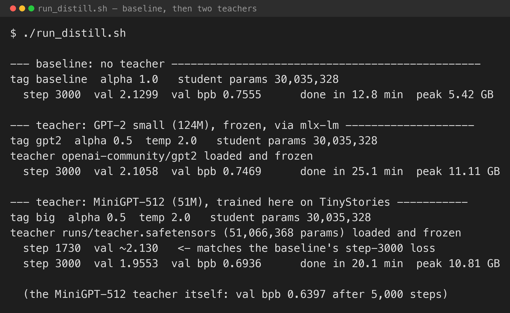
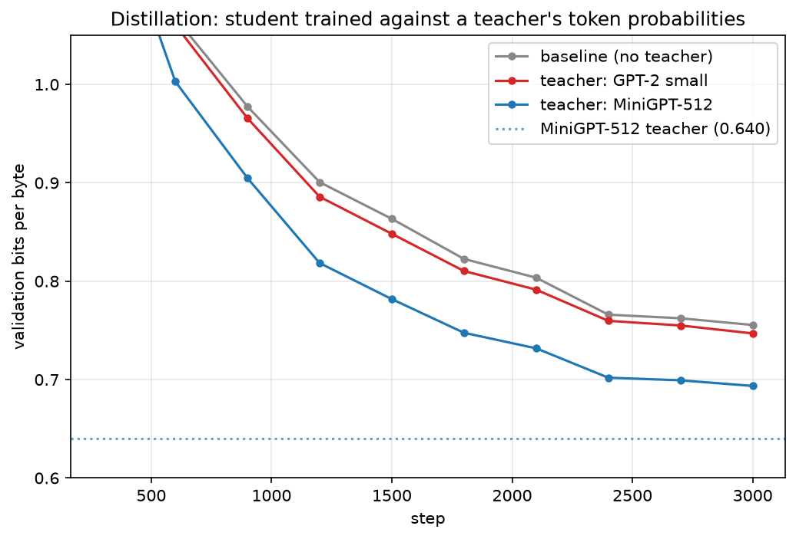
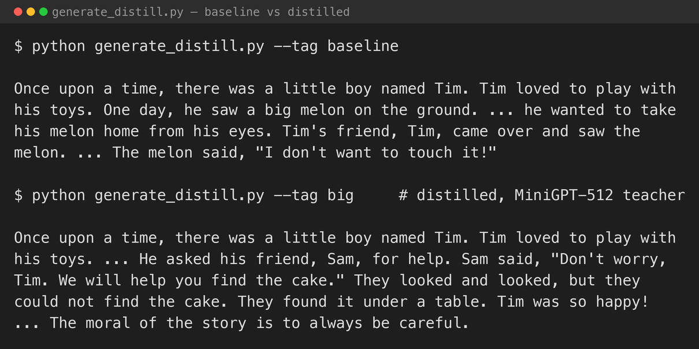

Every model in this series so far has learned the same way: predict the next token, compare to the one-hot truth, take the cross-entropy. Meta's Llama 3.2 1B and 3B were not trained only that way. The [Llama 3.2 announcement](https://ai.meta.com/blog/llama-3-2-connect-2024-vision-edge-mobile-devices/) says that "logits from the Llama 3.1 8B and 70B models were used as targets" during pre-training — the small models learned from the full probability distribution the big models put over the vocabulary, not just the single correct token.

The intuition: the one-hot label says "the next word is *cat*". The teacher's distribution says "*cat* 0.6, *dog* 0.2, *kitten* 0.1, *the* 0.001, …" — which also tells the student that *dog* and *kitten* were reasonable and *the* was not. A richer signal per token, and the reason a distilled small model can learn faster than the same model trained from scratch on raw text.

This post does the same thing at a scale that runs on a Mac — and the result depends entirely on which teacher you pick.

## The setup

- **Student**: the [part 3](/posts/minigpt3/) MiniGPT with the GPT-2 tokeniser — 30M parameters.
- **Teachers**: two, to see what matters. First GPT-2 small (124M), loaded frozen through `mlx-lm`. Then a MiniGPT I trained myself on the same TinyStories data — dimension 512, 8 layers, 51M parameters — which is the Llama 3.1→3.2 situation exactly: same family, same data, more capacity.
- **Shared vocabulary**: distillation on logits needs the teacher and student to agree on what token *i* means. GPT-2's byte-level BPE and the `tiktoken` `gpt2` encoding this series has used since [part 2](/posts/minigpt2/) are the same 50,257 tokens with the same IDs, so the teacher's logit vector lines up with the student's index for index.

The loss adds a distillation term to the ordinary cross-entropy:

```python
ce  = cross_entropy(student_logits, next_token)
t_logp = log_softmax(teacher_logits / T)          # T = 2, softens the distribution
s_logp = log_softmax(student_logits / T)
kl  = (exp(t_logp) * (t_logp - s_logp)).sum(-1).mean()
loss = alpha * ce + (1 - alpha) * T**2 * kl       # alpha = 0.5
```

`alpha` trades the hard label against the teacher. `T` is the distillation temperature — dividing the logits by it before the softmax spreads probability onto the runner-up tokens, which is the part that carries the extra information. Everything is scored the same way as the rest of the series: cross-entropy on held-out text, in bits per byte.

## Memory

The teacher runs a full forward pass on every batch, and both models produce a `[batch, 256, 50257]` logit tensor — about 0.8 GB each in float32. With the teacher, the student, both sets of logits, and the backward pass, peak memory went from 5.4 GB for the plain run to 10.8–11.1 GB with a teacher. Comfortably inside 64 GB of unified memory, but it is why distillation pre-training runs on clusters at full scale: you are running two models to train one.

## What happened

Three runs, 3,000 iterations each, same student, same data.


*The three runs. The teacher that helped is the one trained on the same data as the student*


*Validation bits per byte from step 300 on. GPT-2 as teacher (red) sits on the no-teacher baseline; the MiniGPT-512 teacher (blue) pulls the student down toward its own level (dotted)*

| Run | Teacher | Teacher's own bits/byte | Student's best bits/byte | Minutes |
|---|---|---|---|---|
| Baseline | none | — | 0.7555 | 12.8 |
| Distilled | GPT-2 small, 124M | ~1.0 on this data | 0.7469 | 25.1 |
| Distilled | MiniGPT-512, 51M | 0.6397 | **0.6936** | 20.1 |

**GPT-2 as a teacher did almost nothing.** It is four times the size of the student, but it is a generalist trained on web text, and it is *worse* at TinyStories than the student is — the student trains directly on these stories. Distilling from a teacher that knows less than you do about the target distribution cannot help, and an earlier run at a lower `alpha` (more weight on the teacher) actively hurt, landing at 0.78. At `alpha = 0.5` it came out a hair ahead of the baseline, 0.7469 against 0.7555 — within the run-to-run noise.

**The same-data teacher helped clearly.** The MiniGPT-512 I trained on TinyStories reaches 0.640 bits per byte — well below the student's 0.756 — and distilling from it pulled the student to 0.694, closing about half the gap to the teacher. It also got there faster: the distilled student passed the baseline's *final* (step 3,000) loss at around step 1,700, roughly 1.7× sooner, and then kept improving.

Not the "10× faster" figure from the big-model literature — that comes from teachers that are enormously more capable than the student and from training runs measured in trillions of tokens. At this scale, with a teacher about twice the student's effective capacity, distillation bought a 1.7× speed-up to the same quality and an 8% lower final loss.

The lesson is the one the numbers make unavoidable: **distillation is worth exactly as much as the teacher's advantage on your data.** A bigger teacher is not automatically a better one.

## Generating text


*The baseline student and the MiniGPT-512-distilled student, same prompt*

The baseline student loses the thread — "he wanted to take his melon home from his eyes", a second character also called Tim, a melon that talks. The distilled student holds a scene: Tim, a friend called Sam, a lost cake, a search, a resolution, and then "the moral of the story is …" — the closing formula that TinyStories examples use and that the baseline never picked up. Both are still small models making small-model mistakes, but the distilled one writes a more coherent story, because it spent 3,000 steps being nudged toward the choices of a model that already could.

## What I took from it

- **The teacher has to be better than the student at the actual task.** GPT-2 small is bigger and more generally capable, and it was useless here because it is worse at TinyStories than a model trained on TinyStories. Size is not the qualification; relevant skill is.
- **When the teacher is right, distillation both speeds up training and lowers the floor** — 1.7× faster to the baseline's final quality, then 8% past it.
- **It costs about 2× memory and 1.6× wall-clock per step.** You are running two models to train one, which is why this is a datacentre technique at full scale.
- **The student stays a small model.** Distillation changed how fast and how well it learned; it did not turn 30M parameters into something they are not.

## Try it yourself

The code is in [github.com/Haddley/minigpt-series](https://github.com/Haddley/minigpt-series) under `part5/`:

```bash
python train_distill.py --tag baseline --teacher none --alpha 1.0
python train_distill.py --tag gpt2     --teacher gpt2 --alpha 0.5
python train_teacher.py  --dim 512 --layers 8 --iters 5000
python train_distill.py --tag big      --teacher runs/teacher.safetensors --alpha 0.5
python figures.py
```

Requires Apple Silicon; the GPT-2 teacher downloads from Hugging Face on first run.

[Part 6](/posts/minigpt6/) is the last one: sliding-window attention, to train on a longer context on the same Mac without the attention matrix filling memory.

## References

- [Llama 3.2: revolutionizing edge AI and vision — Meta AI, 2024](https://ai.meta.com/blog/llama-3-2-connect-2024-vision-edge-mobile-devices/)
- [The Llama 3 Herd of Models — Meta AI, 2024](https://arxiv.org/abs/2407.21783)
- [Distilling the Knowledge in a Neural Network — Hinton, Vinyals & Dean, 2015](https://arxiv.org/abs/1503.02531)
- [TinyStories: How Small Can Language Models Be and Still Speak Coherent English? — Eldan & Li, 2023](https://arxiv.org/abs/2305.07759)
- [mlx-lm](https://github.com/ml-explore/mlx-lm)
