Every MiniGPT so far has learned the same way, the guessing game from [Part 2](/posts/minigpt-grown/): guess the next token, check the real one, and nudge the parameters. Meta's small Llama 3.2 models learned from something more. The [Llama 3.2 announcement](https://ai.meta.com/blog/llama-3-2-connect-2024-vision-edge-mobile-devices/) says that "logits from the Llama 3.1 8B and 70B models were used as targets" during pre-training. *Logits* are the scores against the [rows of `lm_head`](/posts/minigpt/#lmhead-where-do-the-65-scores-logits-for-the-next-letter-come-from), just before they become a wheel of chances: the small models learned by copying what the big models thought, not just from the text. This post tries the same idea on a Mac, with a small MiniGPT as the student and four different teachers.

The code is in [`part6-distillation/`](https://github.com/Haddley/minigpt-series/tree/main/part6-distillation), with a follow-along notebook for a Mac, [`minigpt_follow_along_6.ipynb`](https://github.com/Haddley/minigpt-series/blob/main/part6-distillation/minigpt_follow_along_6.ipynb).

| This post's machine | |
|---|---|
| What changed | **a teacher; and, so that the teachers can share its pieces, GPT-2's pieces** |
| Text | TinyStories |
| Pieces | **GPT-2's 50,257** |
| Blocks | 6, each attention (6 heads) then an MLP: **back to Part 4's block** |
| Vector size | 384 |
| Positions | 256, position embeddings |
| Engine | MLX |
| Size | **30.0 million numbers** |
| Score | **0.6936 bits per byte** with the most helpful teacher; 0.7555 alone |

## The big picture, in plain English

### Learning from the answer, or from a teacher

:::brain-power
After "Tim gave his dog a", the real next word in a story is *bone*. A guessing game that only knows the answer says: *bone* was right, everything else was wrong. What does a good teacher know that this answer leaves out?
:::

In the guessing game, the only thing the machine learns from at each step is the one right answer. *Bone* gets all the credit, and *ball*, *treat*, *hug*, and *banana* are all equally wrong. But they are not equally wrong: *ball*, *treat*, and *hug* would all make sense, and *banana* would be strange.

A trained model knows that. Before it writes, it has a whole [wheel of chances](/posts/minigpt/#spinning-a-wheel-an-analogy), a slice for every token. **Distillation** trains the student to copy that whole wheel, not just to pick the right answer. Each guess then teaches it much more: which near misses were reasonable, and which were absurd.

But a wheel is only as good as the reading behind it. Here are two real ones. GPT-2, which learned from text on the web, gives *hug* 6.2%, *big* 2.1%, *good* 2.0%, and *treat* 1.0%, and *bone* just 0.03%: 501st place. Three things push it down. On the web, people give their dogs hugs, rides, runs, and new leashes more often than bones. The wheel chooses the next piece, not the next noun, so much of the chance goes on words that start a longer phrase, such as *a big…* or *a good…*. And GPT-2's wheel is spread over everything on the web: its 20 biggest slices hold only 28% between them. TinyStories-33M, a small model trained on children's stories, and one of the teachers below, puts *bone* first, at 24.7%, and its 20 biggest slices hold 78%. Keep that difference in mind; it turns out to matter.

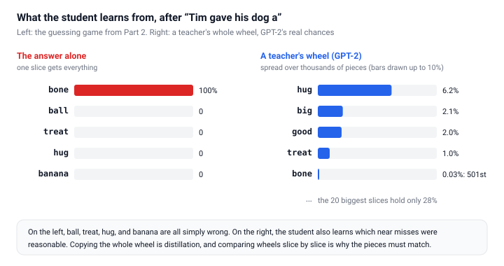
*What the student learns from at one position. The answer alone says only "bone"; a teacher's wheel says which other pieces were reasonable, and how reasonable. The web-trained teacher and the story-trained teacher disagree completely about this sentence*

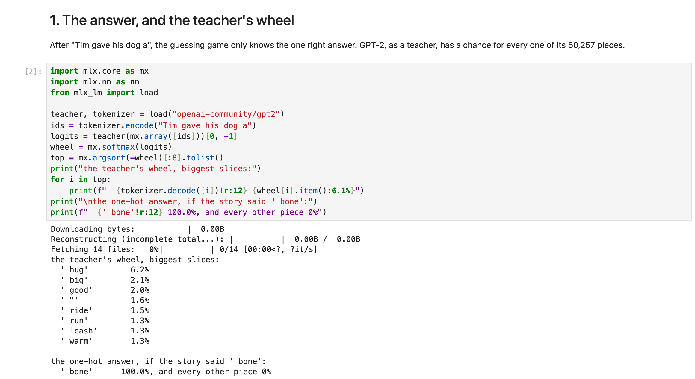
*The follow-along notebook in Jupyter on my Mac, asking GPT-2 for its wheel after "Tim gave his dog a", next to the one-hot answer the guessing game uses*

### The two parts of the score

The student is scored on two things at once, and both are surprise scores from [Part 2](/posts/minigpt-grown/#keeping-score-the-surprise-score):

- **How surprised it is by the real next token**, as before.
- **How different its wheel is from the teacher's wheel.** The measure is called *KL divergence*: 0 when the two wheels are identical, and larger the more they differ.

I weight the two equally. Before comparing the wheels, I soften both with a [temperature](/posts/minigpt/#temperature-a-bolder-or-a-safer-wheel) of 2, the same kind of setting as in Part 1's step 5, so that the thin slices, the near misses, are big enough to learn from.


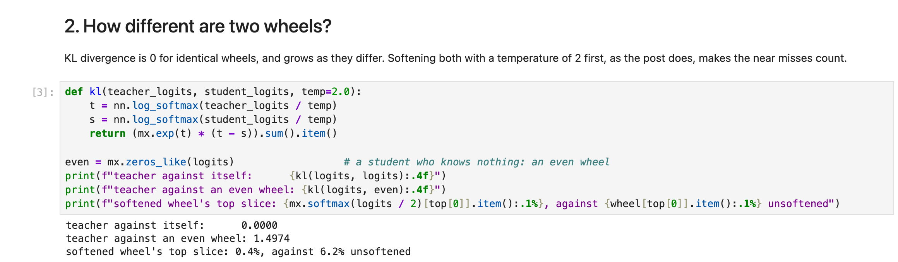
*The notebook worked the KL divergence out by hand: 0 for a wheel against itself, and large against an even wheel. Softening with a temperature of 2 shrinks the top slice so the near misses show*

### The teacher must use the same pieces

There is a catch, and it rules out every current big model. Comparing two wheels slice by slice only makes sense if slice 1,000 means the same token on both wheels. So the teacher must use exactly the student's tokeniser, its supply of pieces from [Part 3](/posts/minigpt2/).

My student uses GPT-2's 50,257 pieces. Qwen3 uses its own, about 151,000; Llama 3 uses another, 128,000; Gemma, Mistral, and Phi each have their own. None of their wheels line up with my student's. So the teachers here all use GPT-2's pieces. That is a bigger family than GPT-2 alone: GPT-Neo, and the models released with the TinyStories paper, use them too.

:::watch-it
The teacher also runs on every training step, in the same 64 GB as the student. Both wheels, for 16 snippets of 256 tokens with 50,257 slices each, take about 0.8 GB apiece. The plain student peaked at 5.4 GB; with GPT-2 as a teacher, 11.1 GB; with GPT-2 XL, 16.8 GB. Distillation means running two machines to train one.
:::

### Four teachers, and no teacher

The student is the MLX machine from [Part 4](/posts/minigpt3/), with the original 2017 block, but on GPT-2's pieces instead of my 8k ones, so its token embeddings make it 30 million numbers, as in [Part 3's table](/posts/minigpt2/#what-bigger-pieces-cost). I trained it five times, once with no teacher and once with each teacher, 3,000 steps each, on the same stories. Every score in the table is [bits per byte](/posts/minigpt2/) on the test stories, so lower is better. The "teacher's own" column scores each teacher on its own, as a storyteller; the "student's" column scores the student it taught:

| Teacher | Size | Teacher's own bits per byte | Student's bits per byte | Minutes |
|---|---|---|---|---|
| none | | | 0.7555 | 12.8 |
| GPT-2 | 124 million | 0.965 | 0.7469 | 25.1 |
| GPT-2 XL | 1.5 billion | 0.799 | 0.7382 | 113.9 |
| TinyStories-33M | 33 million | **0.467** | 0.7204 | 23.5 |
| My MiniGPT-512 | 51 million | 0.644 | **0.6936** | 20.1 |

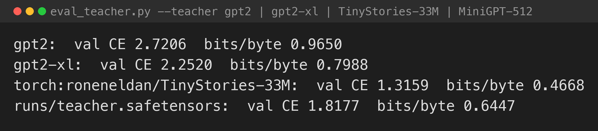
*eval_teacher.py scoring each teacher on its own, on the test stories: the "teacher's own" column above*

GPT-2 and GPT-2 XL learned from text on the web. TinyStories-33M is the largest model released with the TinyStories paper, trained on the whole TinyStories collection: far more stories than my slice of it. My MiniGPT-512 is a wider MiniGPT that I trained on the same practice stories as the student, for 5,000 steps.


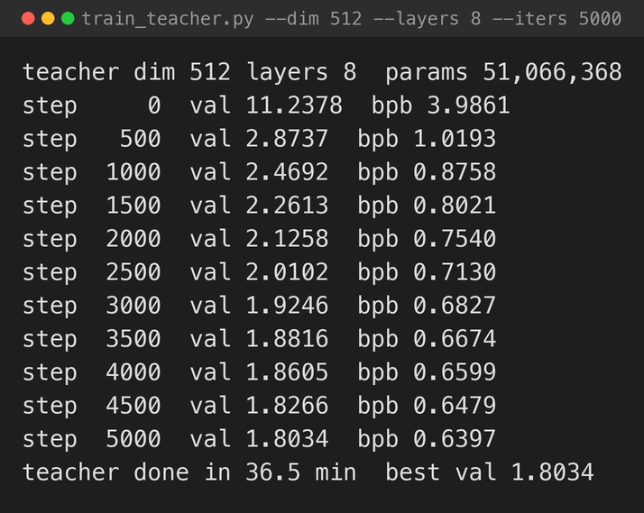
*I grew MiniGPT-512 first: 5,000 steps, 51 million numbers, finishing at 0.64 bits per byte*

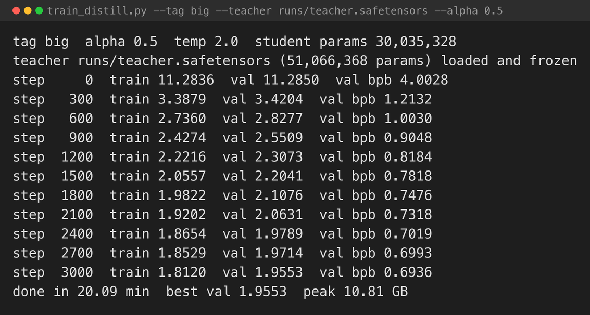
*Then the student learned from it. The teacher is loaded once and frozen; only the student's parameters move*

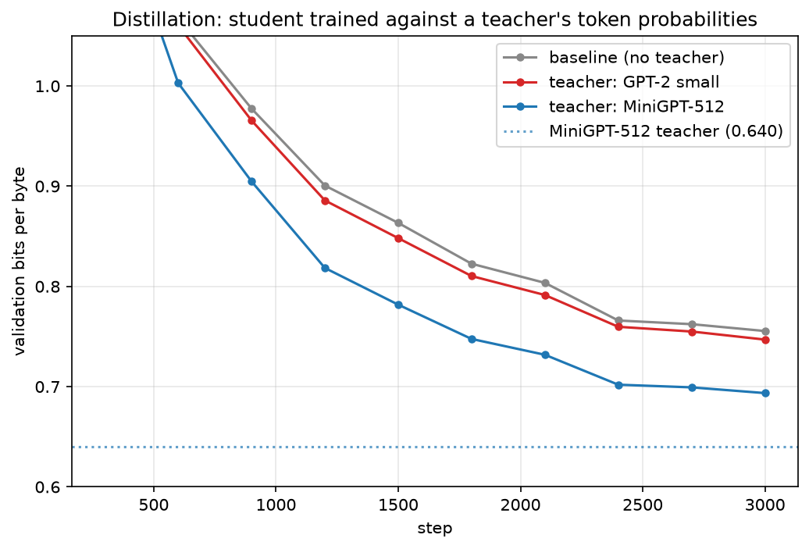
*Bits per byte while training. The two web-text teachers stay near the no-teacher line; the two teachers who know the stories pull the student well below it*

### What the teachers taught

- **A bigger web-text teacher barely helped.** GPT-2 XL is twelve times the size of GPT-2, and moved the student from 0.7469 to 0.7382, for four and a half times the training time. The third column says why: at 1.5 billion numbers, GPT-2 XL is still *worse* at these stories (0.799) than the 30-million-number student trained on them (0.756). It had never read anything like them. Even GPT-2's own gain over no teacher, 0.009, is about the size of the luck between two random starts (see [Part 5](/posts/minigpt4/#how-much-is-luck)), so it may be no gain at all.
- **A teacher who knew the stories helped a lot.** TinyStories-33M is 45 times smaller than GPT-2 XL, but it had read far more stories of exactly this kind, and it scores 0.467. It pulled the student to 0.7204, past both GPT-2s, in 23 minutes.
- **The most helpful teacher was not the best storyteller.** On its own, my MiniGPT-512 scores 0.644, so it is a clearly worse storyteller than TinyStories-33M, at 0.467. Yet it was the most helpful teacher by far. Its student scored 0.6936, the best of all five: 0.062 better than the student with no teacher, almost twice the 0.035 that TinyStories-33M managed. It also learned faster: it passed the no-teacher student's *final* score at about step 1,700, rather than step 3,000.

So why did the weaker storyteller teach better? I had a guess, and then I tested it.

### Why the weaker teacher helped more

My guess was this. In distillation, the student is marked on how closely its wheel matches the teacher's, slice by slice, at every position, and it can only make the kinds of wheel its own design can produce. MiniGPT-512 is the same design as the student, only wider, and learned from exactly the same practice stories, so its wheels should be ones the student can copy. TinyStories-33M is built differently and learned from far more stories, so some of the detail in its wheels may depend on things the student cannot work out. Researchers have seen this in other distillation experiments, and call it the *capacity gap* ([Cho and Hariharan](https://arxiv.org/abs/1910.01348); [Mirzadeh and others](https://arxiv.org/abs/1902.03393)): a stronger teacher does not always make a stronger student.

To test it, I trained MiniGPT-512 again, then the student three times (with MiniGPT-512, with TinyStories-33M, and with no teacher), kept all three students, and measured how far each one's wheels ended up from each teacher's, on the same test stories. The distance is the KL divergence from earlier, without the softening: 0 would mean identical wheels. Retraining gave almost the same scores as before: 0.6913 with MiniGPT-512, 0.7198 with TinyStories-33M, and 0.7554 alone, all inside [the band of luck](/posts/minigpt4/#how-much-is-luck):

| Student | Distance from MiniGPT-512's wheels | Distance from TinyStories-33M's wheels |
|---|---|---|
| no teacher | 0.46 (same top slice 70.5% of the time) | 1.23 (58.8%) |
| taught by MiniGPT-512 | **0.25** (76.6%) | 1.08 (61.5%) |
| taught by TinyStories-33M | 0.47 (72.0%) | **0.96** (62.7%) |


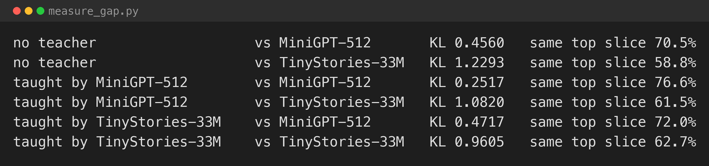
*measure_gap.py's own output, with the model-loading messages left out*

- **Before any teaching, the student was already much closer to MiniGPT-512.** With no teacher at all, its wheels were less than half as far from MiniGPT-512's as from TinyStories-33M's, and picked the same top slice 70.5% of the time, against 58.8%.
- **It could copy MiniGPT-512, and mostly could not copy TinyStories-33M.** Learning from MiniGPT-512 almost halved the distance to it, from 0.46 to 0.25. Learning from TinyStories-33M cut the distance to it by only about a fifth, from 1.23 to 0.96.
- **The student taught by TinyStories-33M still ended up nearer MiniGPT-512's wheels (0.47) than its own teacher's (0.96).** Most of what the better storyteller knew was out of this student's reach.

So the guess holds up: the most helpful teacher is the one whose wheels the student can actually reach. Each student is a single training run, so a different random start would move these distances a little, but it would not turn a gap of four times the other way.

:::pencil Pick a teacher
You have a small student that writes recipes. You can distil from one of three teachers, all using the student's pieces. Which would you pick?

1. A model 50 times bigger than the student, trained on the whole web.
2. A model twice the student's size, trained on 10 million recipes.
3. A model the student's size, trained on recipes and with a different tokeniser.

:::answer
Teacher 2. Teacher 3 is out: with a different tokeniser, its wheels do not line up with the student's. Teacher 1 might know some cooking, but, like GPT-2 XL with the stories, being big and general did not make it good at the student's actual job. Teacher 2 knows recipes, and is close to the student in size, so its wheels are more likely to be ones the student can copy, just like the MiniGPT-512 that won here.
:::
:::

### What they write

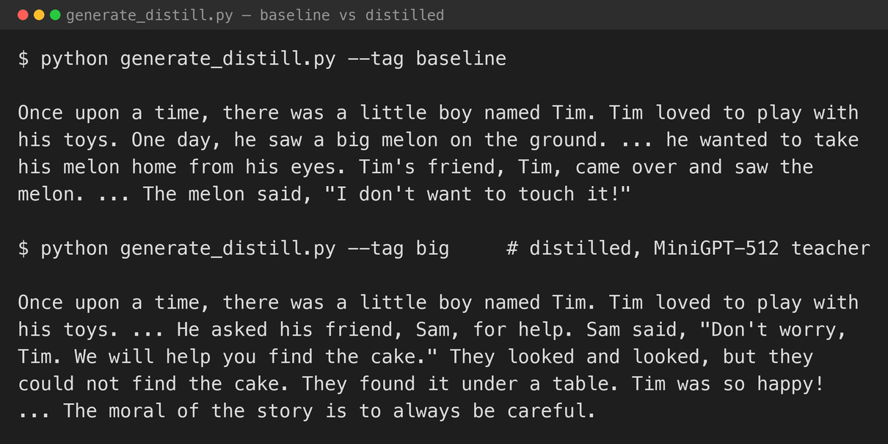
*The no-teacher student and the MiniGPT-512 student, from the same opening*

The no-teacher student loses the thread: "he wanted to take his melon home from his eyes", a second character also called Tim, and a melon that talks. The taught student holds a scene: Tim, a friend called Sam, a lost cake, a search, and an ending, finishing with "the moral of the story is…", the closing line many TinyStories use, which the no-teacher student never picked up.

:::fireside-chat Tonight: GPT-2 XL and TinyStories-33M, on who is the better teacher
**GPT-2 XL:** One and a half billion numbers. I have read half the web. Whatever the student needs to know, I know it.

**TinyStories-33M:** I have 33 million numbers, and I have read millions of stories just like these.

**GPT-2 XL:** Then I outnumber you forty-five to one.

**TinyStories-33M:** And you score 0.799 on the stories. I score 0.467. The student itself, after 13 minutes on its own, scores 0.756: it already knows these stories better than you do.

**GPT-2 XL:** I still moved it, a little.

**TinyStories-33M:** By 0.017 bits per byte, for nearly two hours of the Mac's time and 17 GB of its memory. I moved it twice as far, in 23 minutes.

**GPT-2 XL:** And yet neither of us won.

**TinyStories-33M:** No. The MiniGPT-512 did: a worse model than me, but built like the student and trained on the same stories. It turns out a teacher's job is not to be clever. It is to be useful to this particular student.
:::

:::bullet-points Part 6, in short
- Distillation trains a student to copy a teacher's whole wheel of chances, not just the right answer.
- The score adds the usual surprise to a measure of how different the two wheels are: KL divergence.
- The teacher must use exactly the student's pieces, which rules out every current big model here.
- Running a teacher every step costs memory: 5.4 GB grew to 11 to 17 GB.
- A teacher who knew the stories beat one 45 times its size that did not.
- The most helpful teacher was not the best storyteller: it was the one built like the student and trained on the same stories, whose wheels the student could actually copy.
:::

:::no-dumb-questions
**Q: Why not just train the student longer, instead of using a teacher?**

A: You can, but the teacher gives more per step. Each guess carries the teacher's opinion of every possible token, not one right answer. That is why the taught student reached the untaught one's final score in about 1,700 steps instead of 3,000.

**Q: Could the student end up better than its teacher?**

A: On its own data, it can, because it also learns from the real answers. Here, the student taught by GPT-2 XL beat its teacher easily: 0.738 against 0.799.

**Q: Why soften the wheels with a temperature?**

A: A confident teacher puts almost everything on one slice, which teaches nearly nothing more than the answer itself. Softening, with a temperature of 2, makes the near misses visible, and those are what the student is there to learn. The `T²` in the code puts the size of the score back, so softening does not shrink how much the student learns.

**Q: So how did Meta use Llama 3.1 to teach Llama 3.2, if every model has its own pieces?**

A: Because Llama 3.1 and 3.2 share the same tokeniser. That is the real lesson: distillation works within a family of models that cut text the same way.
:::

:::pencil Who does what?
Match each everyday description on the left with its proper name on the right.

| Everyday description | Proper name |
|---|---|
| 1. training a student to copy a teacher's wheel | A. *KL divergence* |
| 2. how different two wheels are | B. *one-hot* target |
| 3. learning only from the one right answer | C. *distillation* |
| 4. softening a wheel so the near misses show | D. the *temperature* |
| 5. the raw scores before they become a wheel | E. *logits* |

:::answer
1 is C, 2 is A, 3 is B, 4 is D, and 5 is E.
:::
:::

### The jargon decoder

The terms for the whole series are collected in one table, [the series glossary](/posts/minigpt6/#the-series-glossary).

| What I called it | What the experts call it |
|---|---|
| copying a teacher's whole wheel | *logit distillation*, or *knowledge distillation* |
| learning only from the right answer | training on a *one-hot* target, or *hard labels* |
| the teacher's wheel | *soft targets* |
| how different two wheels are | the *KL divergence* (Kullback–Leibler divergence) |
| the raw scores against the rows of `lm_head` | the *logits* |
| the softening setting | the distillation *temperature* |
| a stronger teacher whose wheels the student cannot reach | the *capacity gap* |

## The code, in the order it runs

The code is in [`part6-distillation/`](https://github.com/Haddley/minigpt-series/tree/main/part6-distillation). It reuses Part 4's MLX machine and Part 3's stories, with GPT-2's pieces.

### The teachers: `train_distill.py`'s `--teacher`

`--teacher none` trains the student alone. `--teacher gpt2` and `--teacher gpt2-xl` load a frozen GPT-2 through `mlx-lm`. `--teacher torch:roneneldan/TinyStories-33M` loads TinyStories-33M in PyTorch, because `mlx-lm` cannot load its design, and hands its wheels across to the MLX student. And `--teacher runs/teacher.safetensors` loads my MiniGPT-512, which `train_teacher.py` trains first:

```bash
python train_teacher.py --dim 512 --layers 8 --iters 5000
```

### The score: in `train_distill.py`

Both machines see the same batch; the teacher's wheel is fixed, and only the student's parameters move:

```python
t_logp = nn.log_softmax(t_logits / args.temp, axis=-1)      # the teacher's softened wheel
s_logp = nn.log_softmax(s / args.temp, axis=-1)             # the student's softened wheel
kl = (mx.exp(t_logp) * (t_logp - s_logp)).sum(-1).mean()    # how different they are
return args.alpha * ce + (1 - args.alpha) * (args.temp ** 2) * kl
```

`ce` is the usual surprise at the real next token. With `--alpha 0.5`, the two parts count equally, and `--alpha 1.0` switches the teacher off altogether.

### Scoring the teachers: `eval_teacher.py`, and testing the capacity gap: `measure_gap.py`

`eval_teacher.py --teacher gpt2-xl` measures a teacher's own bits per byte on the test stories: the "teacher's own" column in the table.

`run_gap.sh` retrains MiniGPT-512 and the three students, keeping their checkpoints, and then `measure_gap.py` compares every student's wheel with every teacher's, one batch of test stories at a time:

```python
kl = (mx.exp(tl) * (tl - s_lp)).sum(-1).mean()           # how far the student's wheel is from the teacher's
agree = (mx.argmax(tl, -1) == mx.argmax(s_lp, -1)).mean()  # how often their biggest slices match
```

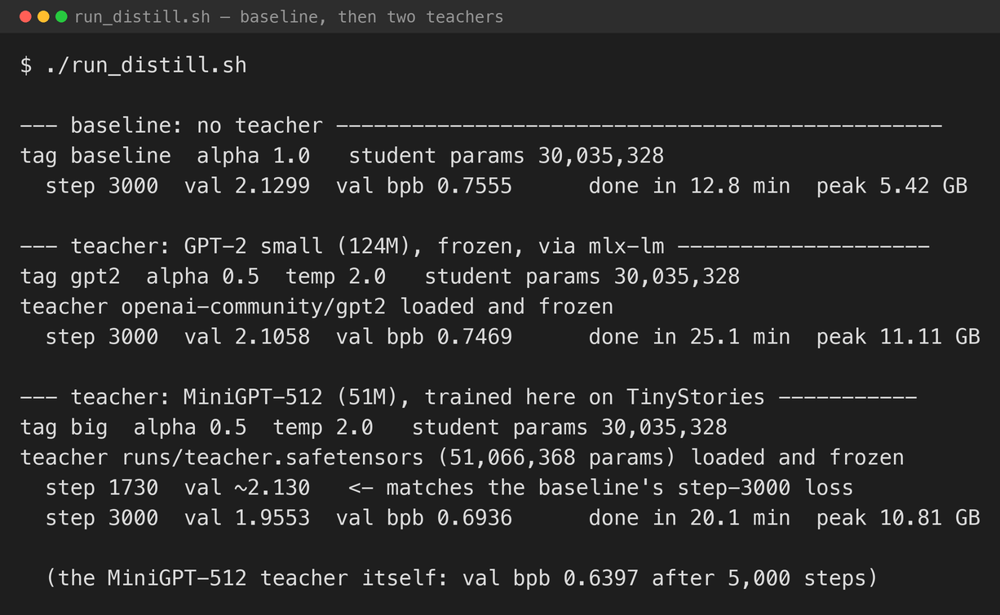
*The five runs, with each teacher's own score*

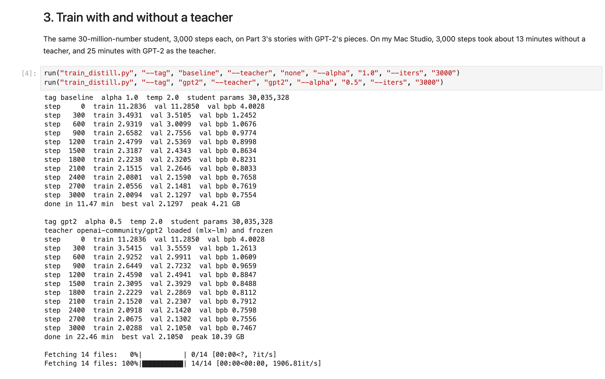
*The notebook trained the student twice, alone and with GPT-2 as its teacher: 0.7554 against 0.7467 bits per byte*

## Try it yourself

- **The follow-along notebook:** [`part6-distillation/minigpt_follow_along_6.ipynb`](https://github.com/Haddley/minigpt-series/blob/main/part6-distillation/minigpt_follow_along_6.ipynb), for Jupyter on a Mac with Apple Silicon. It shows a teacher's wheel next to the one-hot answer, works the KL divergence out by hand, trains a student with GPT-2 as its teacher, and shows the capacity-gap results. It is saved with the outputs from my own run, so you can read every result on GitHub without a Mac.

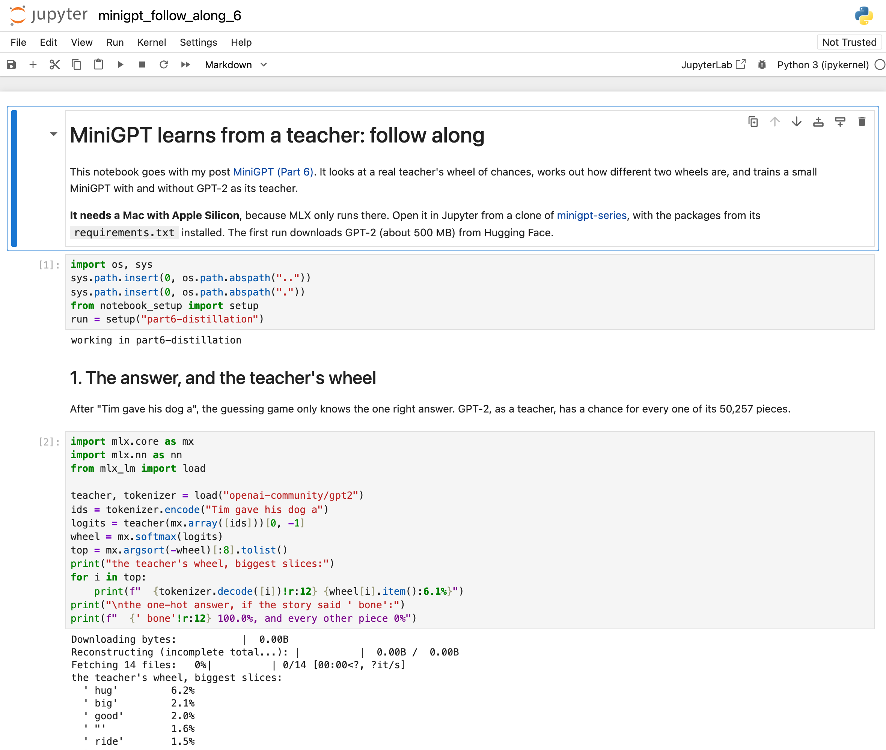
*The notebook open in Jupyter on my Mac, with the outputs saved from my run*

- **On the command line,** after Part 3's `prepare_data.py` and `tokenizers_setup.py`:

```bash
cd minigpt-series/part6-distillation
python train_distill.py --tag baseline --teacher none    --alpha 1.0
python train_distill.py --tag gpt2     --teacher gpt2    --alpha 0.5
python train_distill.py --tag gpt2xl   --teacher gpt2-xl --alpha 0.5
python train_distill.py --tag ts33m    --teacher torch:roneneldan/TinyStories-33M --alpha 0.5
python train_teacher.py --dim 512 --layers 8 --iters 5000
python train_distill.py --tag big      --teacher runs/teacher.safetensors --alpha 0.5
python eval_teacher.py  --teacher gpt2-xl
./run_gap.sh            # why the weaker teacher helped more: retrains three students, then measure_gap.py
python figures.py
```

MLX needs Apple Silicon. The GPT-2 teachers download from Hugging Face the first time.

[Part 7](/posts/minigpt6/) goes back to Part 5's modern machine and gives attention a sliding window, so that it can read a much longer row in the same memory.

## References

- [Llama 3.2: revolutionizing edge AI and vision — Meta AI, 2024](https://ai.meta.com/blog/llama-3-2-connect-2024-vision-edge-mobile-devices/)
- [The Llama 3 Herd of Models — Meta AI, 2024](https://arxiv.org/abs/2407.21783)
- [Distilling the Knowledge in a Neural Network — Hinton, Vinyals & Dean, 2015](https://arxiv.org/abs/1503.02531)
- [On the Efficacy of Knowledge Distillation — Cho & Hariharan, 2019](https://arxiv.org/abs/1910.01348)
- [Improved Knowledge Distillation via Teacher Assistant — Mirzadeh et al., 2020](https://arxiv.org/abs/1902.03393)
- [TinyStories: How Small Can Language Models Be and Still Speak Coherent English? — Eldan & Li, 2023](https://arxiv.org/abs/2305.07759)
- [mlx-lm](https://github.com/ml-explore/mlx-lm)
