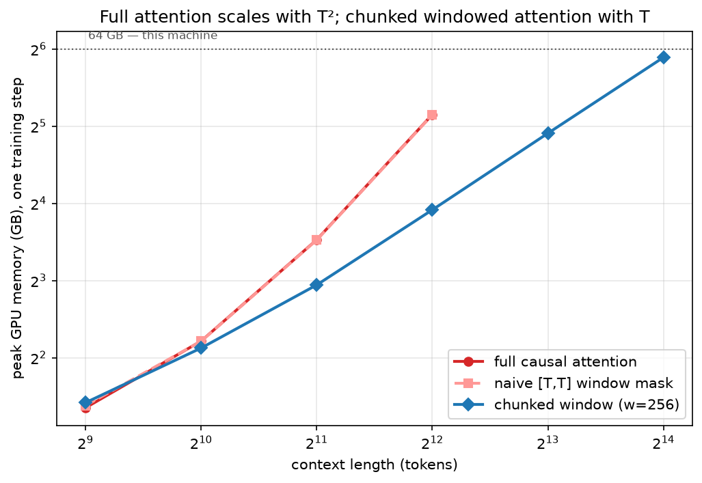
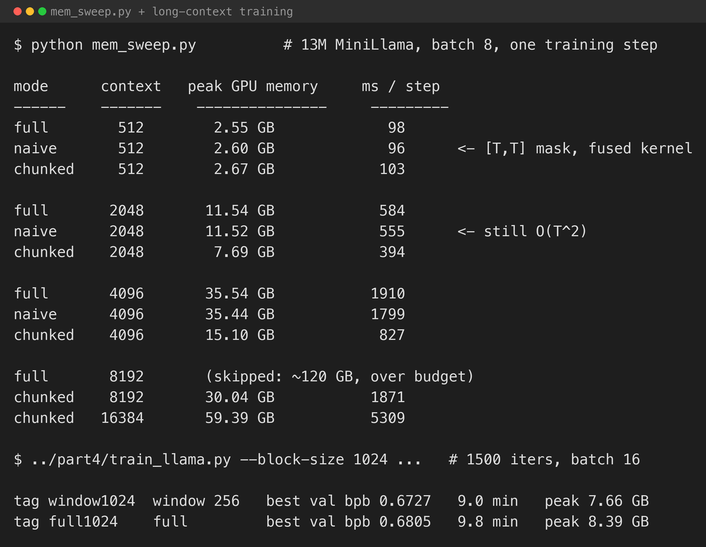
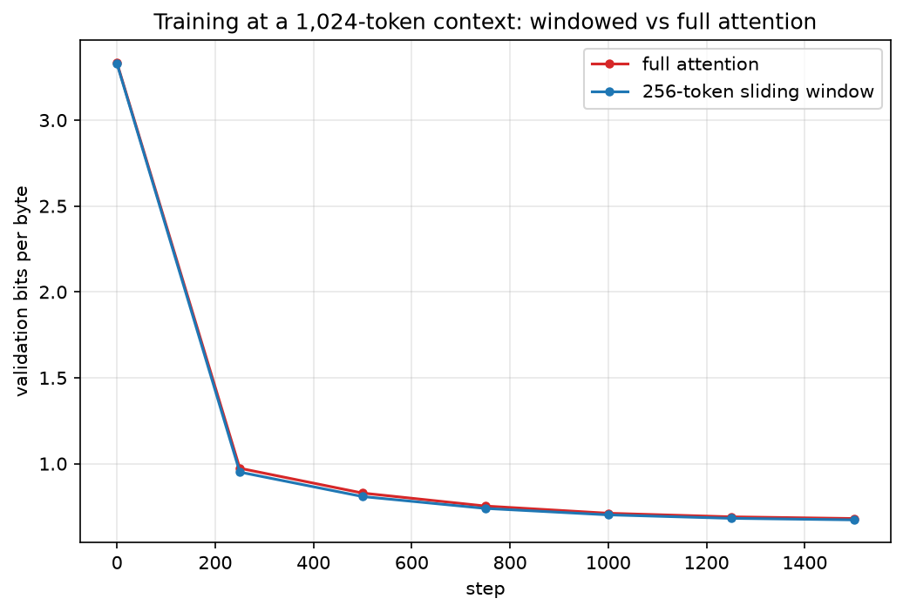
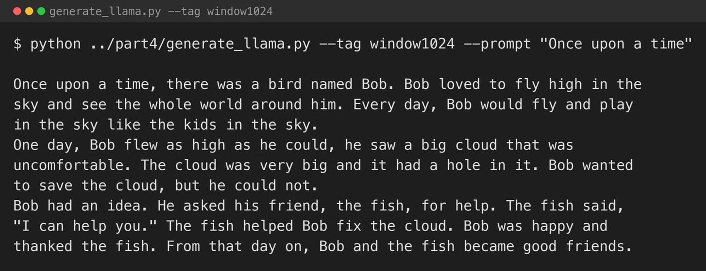

[Part 4](/posts/minigpt4/) added grouped-query attention, which shrinks the key–value cache. This last part deals with the other quadratic cost in a Transformer: the attention matrix itself.

Full causal attention compares every token with every earlier token. For a context of `T` tokens that is a `T × T` score matrix per head — memory that grows with the square of the context length. Double the context, quadruple the attention memory. On a machine with one fixed pool of RAM, that is the wall you hit first when you try to train on longer sequences.

Sliding-window attention, used in Mistral and Ministral, caps it: each token attends only to the last `W` tokens, so the cost grows with `T × W` — linear in context length once `W` is fixed. Information still travels further than `W` across the depth of the network, one window per layer, the way a stack of small convolutions builds a wide receptive field.

## A mask is not enough

The obvious way to do this is to build a `T × T` mask that is `0` inside the window and `−∞` outside, and hand it to the attention kernel:

```python
def sliding_window_mask(T, w, dtype):
    i = mx.arange(T)[:, None]
    j = mx.arange(T)[None, :]
    keep = (j <= i) & (i - j < w)
    return mx.where(keep, mx.array(0.0, dtype), mx.array(-mx.inf, dtype))
```

That gives the right *behaviour* — each token only sees its window — but it saves no memory, because `mx.fast.scaled_dot_product_attention` still builds the full `T × T` score matrix and then adds your mostly-`−∞` mask to it. The measurements below show the "naive" masked version tracking full attention exactly.

To actually get the `O(T × W)` cost you have to never form the `T × T` matrix. `chunked_swa` cuts the sequence into chunks of `W` tokens; chunk `i` attends only to the keys in chunks `i−1` and `i` — a `2W`-wide band that covers every query's causal window — so the largest score tensor is `[batch, heads, T/W, W, 2W]`, linear in `T`:

```python
def chunked_swa(q, k, v, w, scale):
    B, H, T, D = q.shape
    # ... pad T to a multiple of w, left-pad k/v by w for the "previous chunk" ...
    qc = q.reshape(B, H, nc, w, D)
    kc = mx.stack([kpad[:, :, i*w : i*w + 2*w] for i in range(nc)], axis=2)
    vc = mx.stack([vpad[:, :, i*w : i*w + 2*w] for i in range(nc)], axis=2)
    scores = (qc @ kc.transpose(0, 1, 2, 4, 3)) * scale        # [B, H, nc, w, 2w]
    scores = mx.where(band_mask, scores, -mx.inf)
    return (mx.softmax(scores, axis=-1) @ vc).reshape(B, H, T, D)
```

It checks out against a full-attention reference: with `W ≥ T` it returns exactly the same numbers as causal attention, and with a real window it matches the masked version — it just does not pay for the parts it throws away.

## Memory against context length

`mem_sweep.py` builds the 13M-parameter MiniLlama at each context length, runs real forward-and-backward training steps, and records peak GPU memory — full attention, the naive mask, and `chunked_swa` with a 256-token window.


*Peak training memory, log–log. Full attention and the naive mask are the same line; chunked windowed attention has the shallower slope*


*The raw numbers, and the two long-context training runs*

| Context | Full attention | Naive `T×T` mask | Chunked window |
|---|---|---|---|
| 512 | 2.55 GB | 2.60 GB | 2.67 GB |
| 2,048 | 11.5 GB | 11.5 GB | 7.7 GB |
| 4,096 | **35.5 GB** | 35.4 GB | 15.1 GB |
| 8,192 | not run (~120 GB projected) | not run | 30.0 GB |
| 16,384 | not run (~450 GB projected) | not run | 59.4 GB |

At short contexts everything is close — the cost is dominated by the MLP activations and the 8k-wide output logits, both linear in `T`, and the attention matrix is small. The attention term takes over around 2,048 tokens. By 4,096 full attention needs 35.5 GB, more than half the machine, and one step takes 1.9 seconds; chunked does it in 15 GB and 0.8 seconds. Extrapolating the full-attention curve, 8,192 tokens would need more memory than the machine has, so the sweep stops trying it there; chunked keeps going — 16,384 tokens in 59 GB.

The naive-mask column is the point worth keeping: it is identical to full attention at every length. Writing the window as a mask changes what the model attends to, not what it costs.

## Does the windowed model still learn?

A sliding window is only useful if the model still works. I trained the modern block at a 1,024-token context — four times parts 2–5 — once with full attention and once with a 256-token chunked window, same data, same 1,500 iterations.


*Validation bits per byte at a 1,024-token context. The windowed run is not behind*

| Run | Attention | Best bits/byte | Minutes | Peak memory |
|---|---|---|---|---|
| full1024 | full causal | 0.6805 | 9.8 | 8.39 GB |
| window1024 | 256-token window | **0.6727** | 9.0 | 7.66 GB |

The windowed model came out very slightly *ahead* — well within the noise — while training faster and in less memory. And its 0.6727 is the same as the 256-context model from [part 4](/posts/minigpt4/) (0.6717): on TinyStories, going from a 256- to a 1,024-token context did not help, because the stories are a few hundred tokens long and there is nothing further back that a token needs to see. TinyStories is the wrong dataset to show a long-context *quality* win. The point here is the memory curve — the windowed model trains to the same place while its attention cost stays flat as the context grows.

## Generating text


*The windowed 1,024-context model continuing "Once upon a time"*

A bird named Bob, a fish that helps him, a resolution, "they became good friends" — the same shape as every other model in this series. The sliding window did not cost it anything visible.

## What I took from it

- **The window has to be built into the attention computation, not bolted on as a mask.** A `T × T` mask over a fused kernel gives you the behaviour and none of the saving.
- **The quadratic term is not the whole memory bill.** At the context lengths a small model actually trains at, the MLP activations and the output logits — both linear in `T` — are most of it. Windowed attention flattens the part that would otherwise explode, and that is what lets you keep scaling `T`.
- **Windowed attention was free here.** Same loss, less memory, slightly faster. On a dataset with genuine long-range structure the trade would be real; on TinyStories there was nothing to trade away.

## The series

Six parts, from a character-level GPT in a borrowed notebook to a modern small model in MLX:

1. [MiniGPT](/posts/minigpt/) — Jibin Joseph's notebook on the M1 Max: the GPT training loop from first principles, character-level.
2. [A real tokeniser](/posts/minigpt2/) — character vs GPT-2 vs a trained 8k BPE, scored in bits per byte.
3. [Into MLX](/posts/minigpt3/) — the same model in Apple's framework: unified memory, lazy evaluation, `mx.compile`.
4. [The Llama 3.2 block](/posts/minigpt4/) — RMSNorm, RoPE, SwiGLU, GQA, ablated one at a time. Only RoPE moved the loss.
5. [Distillation](/posts/minigpt5/) — training the small model against a bigger one's token probabilities. It helped only when the teacher was actually better at the data.
6. Sliding-window attention — a longer context in the same memory.

Every model here is tiny and none of them is good. That was the point. The architecture, the tokeniser, the training loop, the framework, and the tricks — distillation, GQA, windowed attention — are all things you can build and run in an afternoon on a laptop-class machine. What separates them from the models I use every day is scale: more data, more parameters, more compute, applied to substantially this recipe.

## Try it yourself

The code is in [github.com/Haddley/minigpt-series](https://github.com/Haddley/minigpt-series) under `part6/`:

```bash
python mem_sweep.py
python figures.py
python ../part4/train_llama.py --tag window1024 --block-size 1024 --window 256 --iters 1500
python ../part4/train_llama.py --tag full1024   --block-size 1024 --window 0   --iters 1500
```

Requires Apple Silicon for MLX.

## References

- [Mistral 7B — Jiang et al., 2023](https://arxiv.org/abs/2310.06825)
- [Generating Long Sequences with Sparse Transformers — Child et al., 2019](https://arxiv.org/abs/1904.10509)
- [Longformer: The Long-Document Transformer — Beltagy et al., 2020](https://arxiv.org/abs/2004.05150)
- [MLX documentation](https://ml-explore.github.io/mlx/build/html/index.html)
