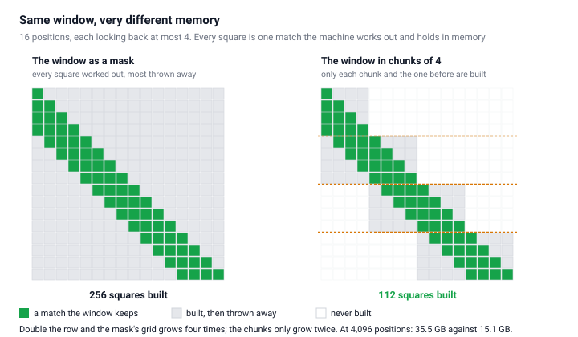
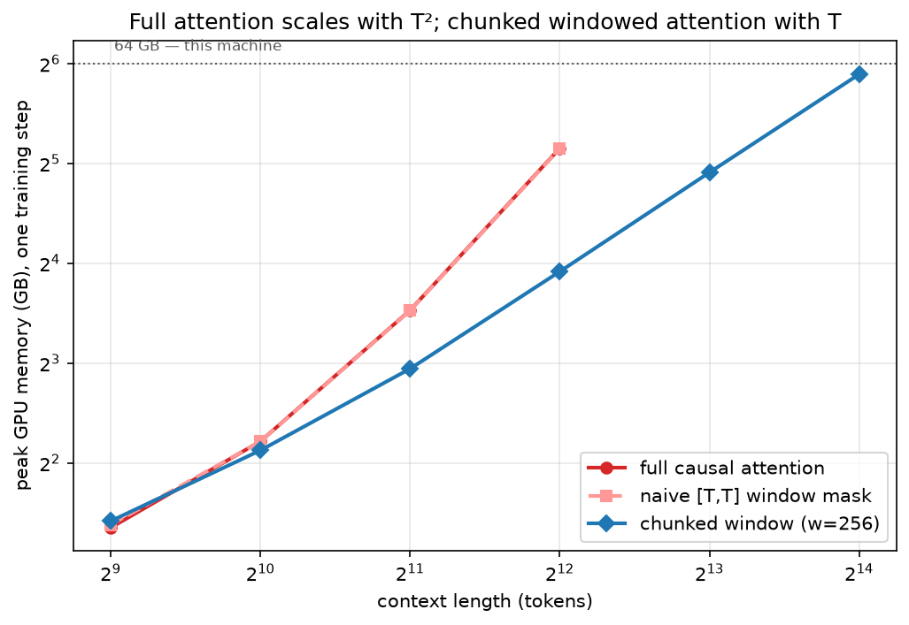
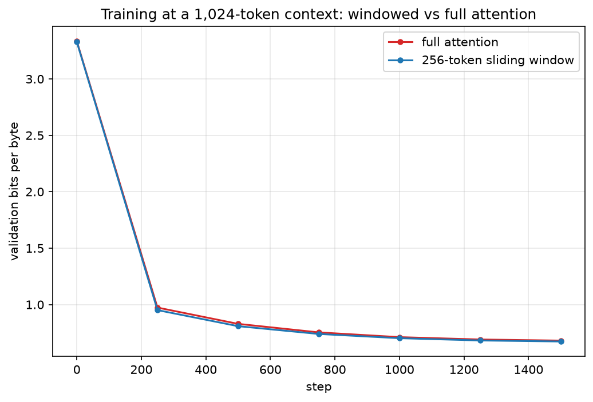
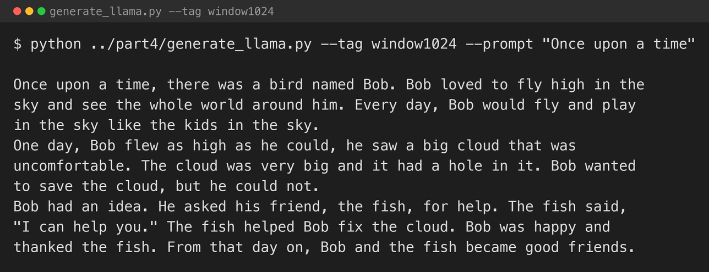
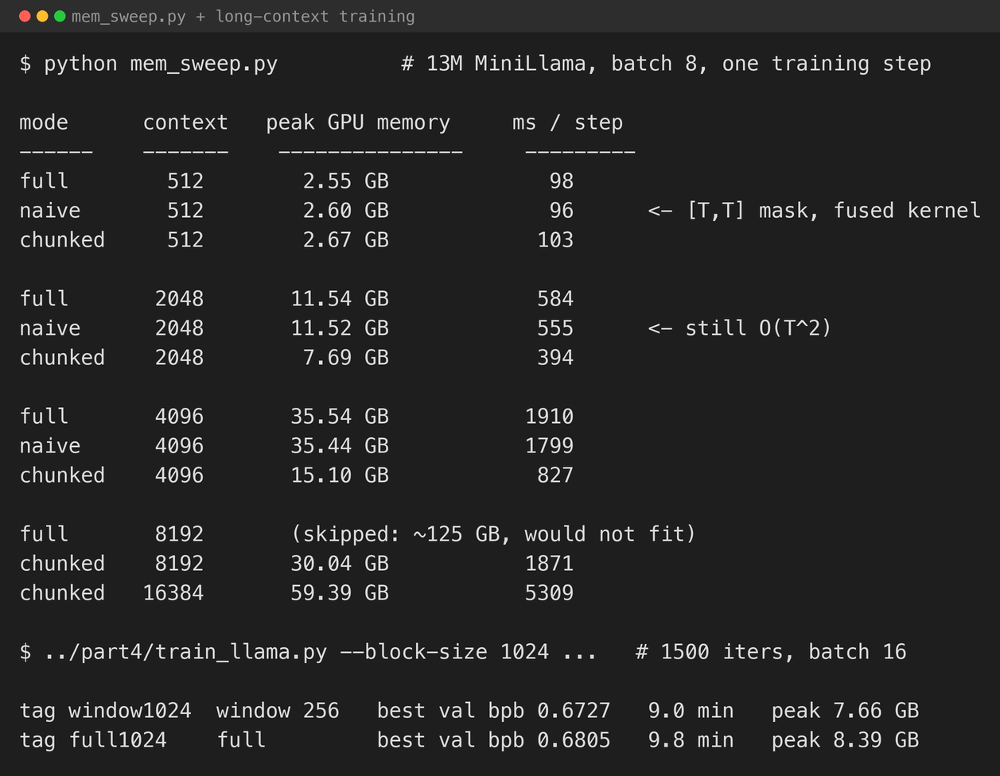

[Part 1](/posts/minigpt/#how-much-can-it-see-at-once-the-context-limit) warned that a longer row of positions is expensive, mostly because of attention. This post measures exactly how expensive, on the modern machine from [Part 5](/posts/minigpt4/), and then fixes it with the trick Mistral's models use: let each working card look back only over a fixed *window* of recent positions.

The code is in [`part7-sliding-window/`](https://github.com/Haddley/minigpt-series/tree/main/part7-sliding-window), with a follow-along notebook for a Mac, [`minigpt_follow_along_7.ipynb`](https://github.com/Haddley/minigpt-series/blob/main/part7-sliding-window/minigpt_follow_along_7.ipynb).

| This post's machine | |
|---|---|
| What changed | **a longer row, read through a sliding window** |
| Text | TinyStories |
| Pieces | my 8,192 |
| Blocks | 6 of Llama's design, from Part 5 |
| Card size | 384 |
| Positions | **1,024, each working card looking back at most 256**; no position cards |
| Engine | MLX |
| Size | 12.6 million numbers |
| Score | 0.6727 bits per byte |

## The big picture, in plain English

### Why a longer row costs so much

In [attention](/posts/minigpt/#inside-a-block-attention), every working card matches its query card against the key card of every earlier position, and itself. So the number of matches grows much faster than the row.

:::pencil Count the matches
Every working card matches its query against the key of every position up to and including its own. How many matches does one head make for a row of 4 positions? For 8? For 1,024?

:::answer
For 4 positions: 1 + 2 + 3 + 4 = 10 matches. For 8: 1 + 2 + … + 8 = 36. For 1,024: about 525,000. Doubling the row from 4 to 8 more than tripled the matches, and every further doubling roughly quadruples them. The matches, and the memory to hold them, grow with the *square* of the row.
:::
:::

Every one of those matches is a number the machine has to hold while it trains, in every head of every block. Double the row and you need about four times the memory for attention. On a machine with one fixed pool of memory, that is the wall you hit first.

### A sliding window

The fix is to let each working card look back only over a fixed window, here the last 256 positions, however long the row is. Then each card makes at most 256 matches, and the total grows only *in step with* the row: twice the row, twice the matches.

:::brain-power
If each working card can only see the last 256 positions, how can the machine ever use something 1,000 positions back?
:::

The answer is the blocks. In block 1, a working card gathers information from up to 256 positions back. In block 2, it looks at working cards that have *already* gathered from their own windows, so it reaches up to about 512 back, and so on. With 6 blocks, information can travel about 1,500 positions, one window per block, much as [Part 1's four blocks](/posts/minigpt/#four-blocks-in-a-row) let each card reach further back than the one before.

### Writing the window as a mask saves nothing

The obvious way to build the window is the way the earlier-positions rule is built: a grid of "allowed" and "not allowed", here also blocking anything more than 256 positions back. It gives exactly the right *behaviour*. But it saves no memory at all: the machine still works out every match in the full row-by-row grid, and only then throws most of them away.

To actually save memory, the machine must never build the full grid. So the row is cut into chunks of 256 positions, and each chunk only looks at itself and the chunk before it. That covers every card's window, and the biggest grid ever built is 256 by 512, however long the row.


*The same window, built two ways, for a row of 16 positions. The mask builds the whole grid and throws most of it away; the chunks never build the squares that would be thrown away*

:::watch-it
Changing *what* attention may look at does not change what it *costs*. A mask changes the first; only computing less changes the second.
:::

### The memory race

`mem_sweep.py` trains the 12.6-million-number modern machine for a few steps at each row length, three ways, and records the most memory each used:

| Row length | Full attention | Window, as a mask | Window, in chunks |
|---|---|---|---|
| 512 | 2.55 GB | 2.60 GB | 2.67 GB |
| 2,048 | 11.5 GB | 11.5 GB | 7.7 GB |
| 4,096 | **35.5 GB** | 35.4 GB | 15.1 GB |
| 8,192 | not run: about 120 GB | not run | 30.0 GB |
| 16,384 | not run: about 450 GB | not run | 59.4 GB |


*Most memory used, against row length. Full attention and the masked window are the same line; the chunked window climbs much more gently*

- **The mask column matches full attention at every length**, exactly as the last section predicted.
- **At short rows, everything is close.** Most of the memory then goes on the MLPs and on scoring against 8,192 answer cards, and both of those grow only in step with the row. Attention takes over at about 2,048 positions.
- **At 4,096, full attention needs 35.5 GB**, more than half the Mac, and 1.9 seconds a step. The chunked window needs 15.1 GB and 0.8 seconds. At 8,192, full attention would need more memory than the Mac has. The chunked window reaches 16,384 positions in 59.4 GB.

### Does the windowed machine still learn?

A window is only useful if the machine still works. I trained the modern machine with a row of 1,024 positions, four times the length used in Parts 3 to 6, once with full attention and once with a 256-position window, for 1,500 steps each:

| Attention | Bits per byte | Minutes | Most memory used |
|---|---|---|---|
| full | 0.6805 | 9.8 | 8.39 GB |
| 256-position window | **0.6727** | 9.0 | 7.66 GB |


*Bits per byte at a 1,024-position row. The windowed machine is not behind*

The windowed machine came out slightly *ahead*, but only by 0.008, about the size of the luck between two random starts (see [Part 5](/posts/minigpt4/#how-much-is-luck)), so the two are level. It also trained faster and in less memory. And its 0.6727 is inside the band of Part 5's 256-position machine (0.672 to 0.678, over three random starts): on these stories, a longer row did not help at all, because most stories are only a few hundred tokens long, so there is nothing further back worth seeing. TinyStories is the wrong text to show what a long row is *for*. The point here is the memory: the windowed machine learns just as well, while its attention cost stays flat as the row grows.


*The windowed machine, with a 1,024-position row, continuing "Once upon a time"*

A bird named Bob, a fish that helps him, and "they became good friends": the same shape of story as every machine in this series. The window cost it nothing you can see.

:::fireside-chat Tonight: full attention and the sliding window, on who can read more
**Full attention:** I see everything. Every working card can look at every position before it. Nothing is ever out of reach.

**Sliding window:** And every time the row doubles, you need four times the memory. At 4,096 positions you took 35 GB.

**Full attention:** Memory is cheap.

**Sliding window:** Not at 8,192 positions. You would have needed about 120 GB, on a 64 GB Mac. I read 16,384 in 59.

**Full attention:** But you are short-sighted. Each card sees 256 positions back, and no further.

**Sliding window:** In one block. Six blocks, and information travels about 1,500 positions. And on these stories, I scored 0.6727 to your 0.6805.

**Full attention:** Within the noise.

**Sliding window:** Agreed. Which is the point: same score, less memory, a bit faster.

**Full attention:** And when the text really does need something from 5,000 positions back?

**Sliding window:** Then you earn your memory. These stories never did.
:::

:::bullet-points Part 7, in short
- Attention's matches, and their memory, grow with the square of the row.
- A sliding window lets each working card look back only a fixed number of positions.
- Through the blocks, information still travels much further than one window.
- Writing the window as a mask changes what is seen, not what it costs.
- Computing in chunks is what saves memory: 16,384 positions in 59 GB, where full attention stopped at 4,096.
- On these stories, the windowed machine learned just as well, faster, in less memory.
:::

:::no-dumb-questions
**Q: Why did a longer row not help on these stories?**

A: Because most of them are a few hundred tokens long. A row of 256 BPE pieces already covers more than a whole typical story, as [Part 3](/posts/minigpt2/#what-bigger-pieces-buy) showed, so a longer row has nothing more to show the machine.

**Q: Is this the same as the KV cache from Part 1?**

A: No, but they work together. The KV cache saves *time* when writing, by keeping old key and value cards instead of remaking them. A sliding window also caps how many of them need keeping: only the last 256 positions, however long the conversation.

**Q: Why chunks of exactly the window size?**

A: With chunks of 256, every card's window of 256 positions fits inside its own chunk and the one before. Smaller chunks would need more of them looked at; bigger ones would build bigger grids than necessary.

**Q: Do the big models use this?**

A: Some do, often mixed with full attention in some blocks. Mistral 7B used a sliding window in every block. The trade is the one measured here: memory and speed against the chance that something important is further back than information can travel.
:::

:::pencil Who does what?
Match each everyday description on the left with its proper name on the right.

| Everyday description | Proper name |
|---|---|
| 1. how many positions a machine can read at once | A. *sliding-window attention* |
| 2. each card looks back only a fixed number of positions | B. the *attention mask* |
| 3. the grid of "allowed" and "not allowed" matches | C. *quadratic* cost |
| 4. growing with the square of the row | D. the *context length* |
| 5. how far information can travel through the blocks | E. the *receptive field* |

:::answer
1 is D, 2 is A, 3 is B, 4 is C, and 5 is E.
:::
:::

### The jargon decoder

The terms for the whole series are collected in one table, [the series glossary](#the-series-glossary).

| What I called it | What the experts call it |
|---|---|
| the length of the row | the *context length*, or *sequence length* |
| looking back only a fixed number of positions | *sliding-window attention* |
| the grid of allowed matches | the *attention mask* |
| growing with the square of the row | *quadratic*, or O(T²), cost |
| growing in step with the row | *linear*, or O(T × W), cost |
| how far information can travel | the *receptive field* |

## The code, in the order it runs

The windowed attention lives in Part 5's [`model_llama.py`](https://github.com/Haddley/minigpt-series/blob/main/part5-modern-block/model_llama.py), behind a `window` setting, and [`part7-sliding-window/`](https://github.com/Haddley/minigpt-series/tree/main/part7-sliding-window) measures it.

### The mask that saves nothing: `sliding_window_mask`

```python
i = mx.arange(T)[:, None]
j = mx.arange(T)[None, :]
keep = (j <= i) & (i - j < w)          # earlier positions only, and at most w back
return mx.where(keep, mx.array(0.0, dtype), mx.array(-mx.inf, dtype))
```

This builds the full T-by-T grid, and the attention call still works out every match before the mask removes most of them.

### The chunks that do save: `chunked_swa`

```python
qc = q.reshape(B, H, nc, w, D)                                            # queries, in chunks of w
kc = mx.stack([kpad[:, :, i * w:i * w + 2 * w] for i in range(nc)], axis=2)  # each chunk's keys, plus the chunk before
vc = mx.stack([vpad[:, :, i * w:i * w + 2 * w] for i in range(nc)], axis=2)
scores = (qc @ kc.transpose(0, 1, 2, 4, 3)) * scale                       # never bigger than w by 2w
scores = mx.where(mask[None, None], scores, -mx.inf)
out = mx.softmax(scores, axis=-1) @ vc
```

The biggest grid is `[batch, heads, chunks, w, 2w]`, which grows in step with the row. With a window as long as the row, it gives exactly the same numbers as full attention.

### Choosing between them: `Attention` in `model_llama.py`

```python
if self.window <= 0:
    out = mx.fast.scaled_dot_product_attention(q, k, v, scale=self.scale, mask="causal")
elif self.naive_window:
    m = sliding_window_mask(T, self.window, x.dtype)
    out = mx.fast.scaled_dot_product_attention(q, k, v, scale=self.scale, mask=m)
else:
    out = chunked_swa(q, k, v, self.window, self.scale)   # after sharing out the key and value heads
```

### The race: `mem_sweep.py`

For each row length from 512 to 16,384, and each of the three ways, `mem_sweep.py` builds the machine, trains it for 5 steps on random tokens, and records the most memory used and the time per step. It skips full attention and the mask past 4,096 positions, where they would run the Mac out of memory.


*The sweep's own output, and the two training runs*

## The series

Seven parts, from a character-level GPT in a borrowed notebook to a modern small model in MLX:

1. [Running it](/posts/minigpt/): a trained MiniGPT taken apart while it writes.
2. [Growing it](/posts/minigpt-grown/): training the same machine from random numbers.
3. [Pieces, not letters](/posts/minigpt2/): three tokenisers, scored fairly in bits per byte.
4. [A faster engine](/posts/minigpt3/): the same machine in Apple's MLX.
5. [The modern block](/posts/minigpt4/): Llama's four changes, one at a time. Only RoPE mattered.
6. [Learning from a teacher](/posts/minigpt5/): distillation, and why the most helpful teacher was not the best storyteller.
7. Reading further: sliding-window attention.

Every machine here is tiny, and none of them is good. That was the point. The tokeniser, the training loop, the engine, and the tricks, distillation, shared keys and values, and windowed attention, are all things you can build and run in an afternoon on one Mac. What separates them from the models I use every day is scale: more text, more numbers, and more computing, applied to substantially the same design.

## The series glossary

Every plain name used in this series, next to the name the experts use, and the part whose jargon decoder it first appears in. Each term is explained in that part.

| What I called it | What the experts call it | First in |
|---|---|---|
| the guessing game | next-token prediction, or language modelling | [Part 1](/posts/minigpt/#the-jargon-decoder) |
| a letter: any of the 65 symbols, even the space and the comma | a *character* | [Part 1](/posts/minigpt/#the-jargon-decoder) |
| the thing being guessed: a letter here, a word or piece of a word in big models | a *token* | [Part 1](/posts/minigpt/#the-jargon-decoder) |
| the 65 letters | the *vocabulary* | [Part 1](/posts/minigpt/#the-jargon-decoder) |
| the chances for every letter | a probability distribution, produced by a *softmax* | [Part 1](/posts/minigpt/#the-jargon-decoder) |
| a letter's flashcard | its *token embedding*: a vector of 128 numbers | [Part 1](/posts/minigpt/#the-jargon-decoder) |
| the position card | the *position embedding* | [Part 1](/posts/minigpt/#the-jargon-decoder) |
| a working card before block 1: a letter card plus its position card | the *input embedding* | [Part 1](/posts/minigpt/#the-jargon-decoder) |
| the number of positions: how many letters it can see at once | the *context length*, or *context window* (`block_size`) | [Part 1](/posts/minigpt/#the-jargon-decoder) |
| "only look at earlier positions" | the *causal mask* | [Part 1](/posts/minigpt/#the-jargon-decoder) |
| the query card, the key card, and the value card | the *query*, the *key*, and the *value* vectors | [Part 1](/posts/minigpt/#the-jargon-decoder) |
| the three recipes that make them | the query, key, and value *projections* (`self.query`, `self.key`, `self.value`) | [Part 1](/posts/minigpt/#the-jargon-decoder) |
| keeping the key and value cards instead of remaking them | the *KV cache* | [Part 1](/posts/minigpt/#the-jargon-decoder) |
| add, never replace | the *residual connection* | [Part 1](/posts/minigpt/#the-jargon-decoder) |
| the row of working cards, as every block rewrites it | the *residual stream* | [Part 1](/posts/minigpt/#the-jargon-decoder) |
| a working card after a block | a *hidden state* | [Part 1](/posts/minigpt/#the-jargon-decoder) |
| normalising a working card before attention and before the MLP | *layer normalisation*, or *LayerNorm* | [Part 1](/posts/minigpt/#the-jargon-decoder) |
| the dials | the *parameters*, or *weights* | [Part 1](/posts/minigpt/#the-jargon-decoder) |
| spinning the wheel of chances | *sampling* | [Part 1](/posts/minigpt/#the-jargon-decoder) |
| keeping the biggest k slices | *top-k* sampling | [Part 1](/posts/minigpt/#the-jargon-decoder) |
| keeping the biggest slices until they add up to p | *top-p*, or *nucleus*, sampling | [Part 1](/posts/minigpt/#the-jargon-decoder) |
| the 65 answer cards | the *language-model head* (`lm_head`), or *output layer* | [Part 1](/posts/minigpt/#the-jargon-decoder) |
| a request the model writes for a program to carry out | a *tool call*, or *function call* | [Part 1](/posts/minigpt/#the-jargon-decoder) |
| the program around the model | the *harness* | [Part 1](/posts/minigpt/#the-jargon-decoder) |
| a harness letting the model act by itself for many steps | an *agent* | [Part 1](/posts/minigpt/#the-jargon-decoder) |
| working out what the trained dials mean | *interpretability* | [Part 1](/posts/minigpt/#the-jargon-decoder) |
| learning from the text itself, with no people marking answers | *self-supervised* learning, or *pre-training* | [Part 2](/posts/minigpt-grown/#the-jargon-decoder) |
| people writing example conversations for the machine to copy | *supervised fine-tuning* (SFT) | [Part 2](/posts/minigpt-grown/#the-jargon-decoder) |
| people comparing answers, to train a judge | the *reward model* | [Part 2](/posts/minigpt-grown/#the-jargon-decoder) |
| practising against the judge | *reinforcement learning from human feedback* (RLHF), often using a method called *PPO* | [Part 2](/posts/minigpt-grown/#the-jargon-decoder) |
| letting another model do some of the comparing | *reinforcement learning from AI feedback* (RLAIF) | [Part 2](/posts/minigpt-grown/#the-jargon-decoder) |
| letting an existing model write the examples, or teach its chances | *distillation* | [Part 2](/posts/minigpt-grown/#the-jargon-decoder) |
| the surprise score | the *loss* (cross-entropy loss) | [Part 2](/posts/minigpt-grown/#the-jargon-decoder) |
| "as unsure as choosing between *N* letters" | *perplexity* | [Part 2](/posts/minigpt-grown/#the-jargon-decoder) |
| working out which way to turn every dial | *backpropagation* | [Part 2](/posts/minigpt-grown/#the-jargon-decoder) |
| the 32 snippets for one step | a *batch* (batch size 32) | [Part 2](/posts/minigpt-grown/#the-jargon-decoder) |
| the slopes of all 826,433 dials, together | the *gradient* | [Part 2](/posts/minigpt-grown/#the-jargon-decoder) |
| nudging every number a little in its direction | an *optimiser step* (here, with *AdamW*) | [Part 2](/posts/minigpt-grown/#the-jargon-decoder) |
| how far each nudge goes | the *learning rate* | [Part 2](/posts/minigpt-grown/#the-jargon-decoder) |
| AdamW's running average of recent slopes | *momentum* | [Part 2](/posts/minigpt-grown/#the-jargon-decoder) |
| shrinking every number very slightly on every step | *weight decay* | [Part 2](/posts/minigpt-grown/#the-jargon-decoder) |
| the locked-away exam text | the *validation set* | [Part 2](/posts/minigpt-grown/#the-jargon-decoder) |
| memorising the textbook | *overfitting* | [Part 2](/posts/minigpt-grown/#the-jargon-decoder) |
| keeping the best copy | *checkpoint selection* | [Part 2](/posts/minigpt-grown/#the-jargon-decoder) |
| walking downhill on the surprise-score landscape | *gradient descent* | [Part 2](/posts/minigpt-grown/#the-jargon-decoder) |
| the program that cuts text into pieces | the *tokeniser* | [Part 3](/posts/minigpt2/#the-jargon-decoder) |
| a token card | a *token embedding* | [Part 3](/posts/minigpt2/#the-jargon-decoder) |
| gluing the most common pair | a BPE *merge* | [Part 3](/posts/minigpt2/#the-jargon-decoder) |
| using the token cards as the answer cards too | *weight tying* | [Part 3](/posts/minigpt2/#the-jargon-decoder) |
| halvings of surprise for each byte of text | *bits per byte* | [Part 3](/posts/minigpt2/#the-jargon-decoder) |
| surprise per token | the *loss*, or *cross-entropy* | [Part 3](/posts/minigpt2/#the-jargon-decoder) |
| the engine | the *framework* | [Part 4](/posts/minigpt3/#the-jargon-decoder) |
| one shared pool of memory | *unified memory* | [Part 4](/posts/minigpt3/#the-jargon-decoder) |
| writing calculations down and running them later | *lazy evaluation* | [Part 4](/posts/minigpt3/#the-jargon-decoder) |
| packing a whole step into one job | *compiling*, with `mx.compile` | [Part 4](/posts/minigpt3/#the-jargon-decoder) |
| capping the slopes if they are unusually big | *gradient clipping* | [Part 4](/posts/minigpt3/#the-jargon-decoder) |
| copying a batch to the GPU | a *host-to-device transfer* | [Part 4](/posts/minigpt3/#the-jargon-decoder) |
| the simpler normalise | *RMSNorm* (root mean square normalisation) | [Part 5](/posts/minigpt4/#the-jargon-decoder) |
| the 2017 normalise | *LayerNorm* | [Part 5](/posts/minigpt4/#the-jargon-decoder) |
| turning cards by position | *rotary position embeddings*, or *RoPE* | [Part 5](/posts/minigpt4/#the-jargon-decoder) |
| the MLP with a gate | *SwiGLU* | [Part 5](/posts/minigpt4/#the-jargon-decoder) |
| sharing key and value cards between heads | *grouped-query attention*, or *GQA* | [Part 5](/posts/minigpt4/#the-jargon-decoder) |
| a query, key, and value for every head | *multi-head attention*, or *MHA* | [Part 5](/posts/minigpt4/#the-jargon-decoder) |
| turning one change off at a time | an *ablation study* | [Part 5](/posts/minigpt4/#the-jargon-decoder) |
| copying a teacher's whole wheel | *logit distillation*, or *knowledge distillation* | [Part 6](/posts/minigpt5/#the-jargon-decoder) |
| learning only from the right answer | training on a *one-hot* target, or *hard labels* | [Part 6](/posts/minigpt5/#the-jargon-decoder) |
| the teacher's wheel | *soft targets* | [Part 6](/posts/minigpt5/#the-jargon-decoder) |
| how different two wheels are | the *KL divergence* (Kullback–Leibler divergence) | [Part 6](/posts/minigpt5/#the-jargon-decoder) |
| the raw scores against the answer cards | the *logits* | [Part 6](/posts/minigpt5/#the-jargon-decoder) |
| the softening setting | the distillation *temperature* | [Part 6](/posts/minigpt5/#the-jargon-decoder) |
| the length of the row | the *context length*, or *sequence length* | [Part 7](/posts/minigpt6/#the-jargon-decoder) |
| looking back only a fixed number of positions | *sliding-window attention* | [Part 7](/posts/minigpt6/#the-jargon-decoder) |
| the grid of allowed matches | the *attention mask* | [Part 7](/posts/minigpt6/#the-jargon-decoder) |
| growing with the square of the row | *quadratic*, or O(T²), cost | [Part 7](/posts/minigpt6/#the-jargon-decoder) |
| growing in step with the row | *linear*, or O(T × W), cost | [Part 7](/posts/minigpt6/#the-jargon-decoder) |
| how far information can travel | the *receptive field* | [Part 7](/posts/minigpt6/#the-jargon-decoder) |

## Try it yourself

- **The follow-along notebook:** [`part7-sliding-window/minigpt_follow_along_7.ipynb`](https://github.com/Haddley/minigpt-series/blob/main/part7-sliding-window/minigpt_follow_along_7.ipynb), for Jupyter on a Mac with Apple Silicon. It counts the matches, checks that the chunked window gives full attention's numbers when the window covers the whole row, and runs a short memory race.
- **On the command line,** after Part 3's `prepare_data.py` and `tokenizers_setup.py`:

```bash
cd minigpt-series/part7-sliding-window
python mem_sweep.py
python figures.py
python ../part5-modern-block/train_llama.py --tag window1024 --block-size 1024 --window 256 --iters 1500
python ../part5-modern-block/train_llama.py --tag full1024   --block-size 1024 --window 0   --iters 1500
```

MLX needs Apple Silicon.

## References

- [Mistral 7B — Jiang et al., 2023](https://arxiv.org/abs/2310.06825)
- [Generating Long Sequences with Sparse Transformers — Child et al., 2019](https://arxiv.org/abs/1904.10509)
- [Longformer: The Long-Document Transformer — Beltagy et al., 2020](https://arxiv.org/abs/2004.05150)
- [MLX documentation](https://ml-explore.github.io/mlx/build/html/index.html)
