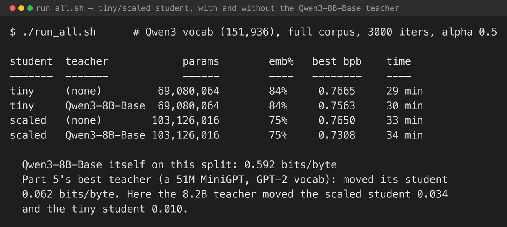
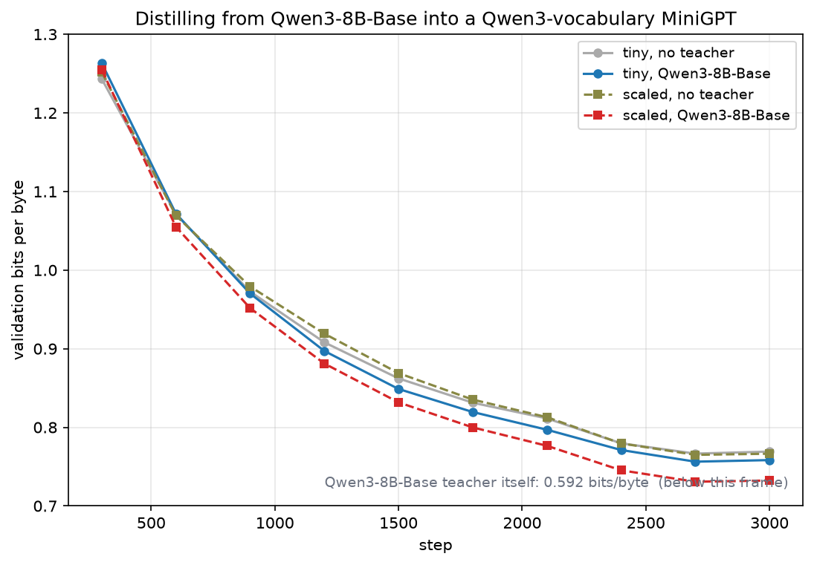
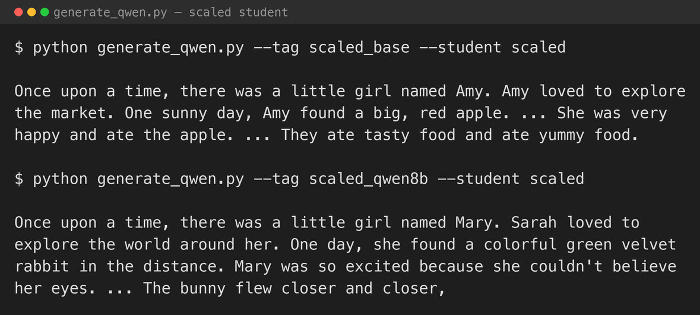

[Part 5](/posts/minigpt5/) ended on a wall: logit distillation needs the teacher and student to share a tokeniser, so the teacher could not be a current model — Qwen3, Llama, Gemma all have their own. It could only be something in the GPT-2 vocabulary family, and the best of those got the student to 0.694 bits per byte.

This post pays the toll. It rebuilds MiniGPT on **Qwen3's tokeniser** and distils from **Qwen3-8B-Base** — a genuinely capable 2026 model — to see whether a frontier-class teacher finally delivers the big win that GPT-2's family could not.

## Base, not instruct

The first teacher I tried was `Qwen3-4B` (the post-trained chat model). Fed raw TinyStories text and asked for next-token probabilities, it scored **0.778 bits per byte** — about the same as GPT-2 XL in [Part 5](/posts/minigpt5/). A model tuned to behave as a chat assistant is a poor free-running next-token predictor; it "wants" to be answering a question, not continuing a story. `Qwen3-8B-Base`, trained purely to continue text, scored **0.592** on the same split. Base models are what you distil from — Meta distilled Llama 3.1 8B/70B *base* into Llama 3.2 — so `Qwen3-8B-Base` is the teacher here.

## The toll: a 151,936-slot vocabulary

Qwen3's tokeniser has about 151,700 entries, and the models pad their embedding and output layers to 151,936 for alignment. Two costs land immediately.

**The embedding table becomes the model.** At the series' usual dimension of 384, the token embedding is 151,936 × 384 ≈ **58M parameters** against a ~10.7M transformer. A "MiniGPT" with this tokeniser is ~69M parameters, **84% lookup table**. The scaled-up student (dimension 512, 8 layers) is ~103M parameters and still 75% embedding.

**And it buys nothing here.** On the TinyStories validation split, Qwen3's tokeniser packs text at 0.239 tokens per byte — essentially identical to GPT-2's 0.246 and the trained 8k BPE's 0.244. The extra 100,000 tokens are for code and other languages; on English children's stories they are dead weight. The embedding table alone (58M parameters) is now larger than the entire GPT-2-vocabulary student from parts 3–5 (30M) — no compression gain, just a bigger lookup table. Exactly [Part 2](/posts/minigpt2/)'s finding about big vocabularies on small models, taken to its limit.

## Running the teacher offline

A Qwen3-8B forward pass on the M1 Max runs at roughly 600 tokens per second. Doing that on every training step, as [Part 5](/posts/minigpt5/) did with GPT-2, would make each run take the best part of a day. So the teacher runs **once, offline**: `cache_teacher.py` sweeps Qwen3-8B-Base over the whole token stream — non-overlapping 256-token chunks, about two and three-quarter hours — and stores each position's **top-48 next-token logits** to disk (a 1.4 GB file). The student training loop then reads those cached targets, no teacher model in the loop, and both student sizes reuse the one cache. The students train on the same aligned chunks the cache was built from, so at every position the teacher and student have seen exactly the same context. This offline-logit structure is how distillation pre-training is actually done at scale.

## The lineup

| | Params | Embedding share | Its own bits/byte |
|---|---|---|---|
| Student — tiny (dim 384, 6 layers) | 69M | 84% | — |
| Student — scaled (dim 512, 8 layers) | 103M | 75% | — |
| Teacher — Qwen3-8B-Base | 8.2B | — | **0.592** |

Qwen3-8B-Base scores 0.592 bits per byte on the TinyStories validation split — better than every teacher in [Part 5](/posts/minigpt5/) (the best there was 0.644). If a teacher this much stronger still does not move the student, that is a fact about distillation, not about teacher choice.

The loss is the same as Part 5 — `alpha` on the hard one-hot label, `1 − alpha` on the temperature-scaled KL against the teacher's distribution — except the KL runs over the teacher's top 48 tokens rather than all 151,936.

## What happened

Four runs, 3,000 iterations each on the full re-tokenised corpus: each student size with and without the teacher.


*The four runs. The teacher's own score is far below any of them*


*Validation bits per byte from step 300. Distillation helps the scaled student more than the tiny one; both stay a long way above the teacher*

| Student | Teacher | Best bits/byte | Change |
|---|---|---|---|
| tiny (69M, 84% embedding) | none | 0.7665 | — |
| tiny | Qwen3-8B-Base | **0.7563** | −0.010 |
| scaled (103M, 75% embedding) | none | 0.7650 | — |
| scaled | Qwen3-8B-Base | **0.7308** | −0.034 |

**The frontier teacher helped — less than the 51M model from Part 5 did.** Qwen3-8B-Base is a far stronger predictor of this text than anything in Part 5 (0.592 bits per byte against that post's best teacher at 0.644). But as a *teacher* it moved the scaled student 0.034 bits per byte and the tiny student only 0.010. Part 5's hand-trained 51M MiniGPT moved its student 0.062 — closing more than half the gap to itself, where the 8.2B model closed a fifth.

**The bigger student absorbed more.** The scaled student has 25M non-embedding parameters against the tiny student's 11M, and it got three times the benefit. That points at the bottleneck: with a 151,936-token vocabulary, 75–84% of the model is an embedding table, most of whose rows never see a gradient on TinyStories. The part that can actually fit a richer training signal is small, and the smaller it is, the less the teacher's distribution can land.

**And the teacher is the wrong shape.** The student is a plain 2017 GPT — LayerNorm, learned positions, multi-head attention. Qwen3-8B-Base is none of those things, trained on trillions of tokens of web text. Its next-token distribution over 152k tokens is not something a tiny LayerNorm-and-learned-positions model can follow closely, however low its perplexity. Part 5 already found that a smaller, same-family teacher out-taught a stronger mismatched one; Part 7 is that finding at the far end of the scale.

## Generating text


*The scaled student, with and without the teacher*

Both write TinyStories-shaped text with the usual small-model slips — "Sarah loved to explore" one sentence after "a little girl named Mary", "the bunny flew closer". The distilled model is a third of a bit per byte better on held-out text; it does not read like a different model. Same conclusion as every other part: at this scale the gains are in the loss, not on the page.

## What I took from it

- **Paying the tokeniser toll did not pay off.** Rebuilding the whole model on Qwen3's 152k vocabulary, and running an 8B model for three hours to cache its logits, bought the student less than a 51M model trained for twenty minutes in Part 5.
- **Distillation is bounded by what the student can represent.** A frontier teacher's distribution is only useful to the extent the student has the capacity — and the architectural similarity — to imitate it. A tiny GPT is about the least similar thing to Qwen3 there is.
- **A big vocabulary is a tax on a small model, twice over.** Part 2 showed it inflates the parameter count; here it also starves the part of the model that distillation could improve.
- **The Part 5 rule holds at the extreme.** "Distillation is worth the teacher's advantage on your data, not its size" — and not, it turns out, the teacher's raw capability either. A same-family teacher of modest size beat an 8.2B frontier model.

## The series

Seven parts, from a character-level GPT in a borrowed notebook to a modern small model distilled from a frontier teacher — all on one 2022 Mac Studio:

1. [MiniGPT](/posts/minigpt/) — Jibin Joseph's notebook on the M1 Max: the GPT training loop from first principles, character-level.
2. [A real tokeniser](/posts/minigpt2/) — character vs GPT-2 vs a trained 8k BPE, scored in bits per byte.
3. [Into MLX](/posts/minigpt3/) — the same model in Apple's framework: unified memory, lazy evaluation, `mx.compile`.
4. [The Llama 3.2 block](/posts/minigpt4/) — RMSNorm, RoPE, SwiGLU, GQA, ablated one at a time. Only RoPE moved the loss.
5. [Distillation](/posts/minigpt5/) — training the small model against a bigger one's token probabilities. It helped only when the teacher was actually better at the data.
6. [Sliding-window attention](/posts/minigpt6/) — a longer context in the same memory.
7. Qwen3's tokeniser — paying the toll from part 5 to distil from a frontier base model. It helped the student less than the 51M model trained by hand in part 5.

Every model here is tiny and none of them is good. That was the point. The architecture, the tokeniser, the training loop, the framework, and the tricks — distillation, grouped-query attention, windowed attention — are all things you can build and run in an afternoon on a laptop-class machine. What separates them from the models I use every day is scale: more data, more parameters, more compute, applied to substantially this recipe. And Part 7 is the reminder that you cannot shortcut past that gap by borrowing a frontier model's knowledge — a small model can only absorb as much of a teacher as it has the capacity, and the resemblance, to represent.

## Try it yourself

The code is in [github.com/Haddley/minigpt-series](https://github.com/Haddley/minigpt-series) under `part7/`:

```bash
python qwen_data.py                                    # re-tokenise TinyStories with Qwen3
python cache_teacher.py --teacher qwen8b                # ~2.75 h, one-time
python train_qwen.py --tag tiny_base     --student tiny   --teacher none
python train_qwen.py --tag tiny_qwen8b   --student tiny   --teacher qwen8b
python train_qwen.py --tag scaled_base   --student scaled --teacher none
python train_qwen.py --tag scaled_qwen8b --student scaled --teacher qwen8b
python figures.py
```

Requires Apple Silicon; `mlx-community/Qwen3-8B-Base-bf16` (~16 GB) downloads from Hugging Face on first run.

## References

- [Qwen3 Technical Report — Qwen Team, 2025](https://arxiv.org/abs/2505.09388)
- [Distilling the Knowledge in a Neural Network — Hinton, Vinyals & Dean, 2015](https://arxiv.org/abs/1503.02531)
- [The Llama 3 Herd of Models — Meta AI, 2024](https://arxiv.org/abs/2407.21783)
- [TinyStories: How Small Can Language Models Be and Still Speak Coherent English? — Eldan & Li, 2023](https://arxiv.org/abs/2305.07759)
- [mlx-lm](https://github.com/ml-explore/mlx-lm)
