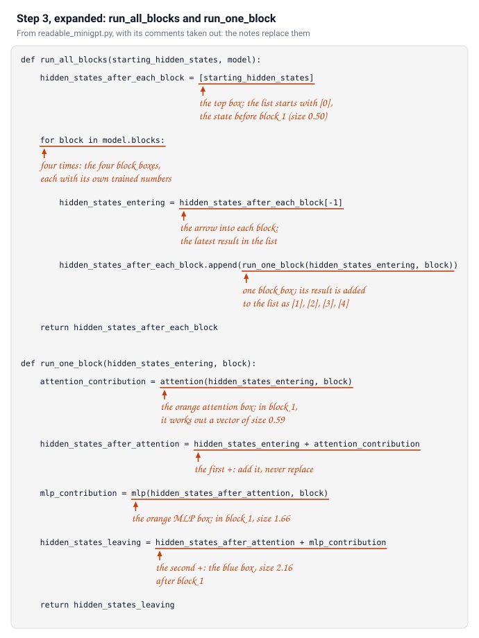
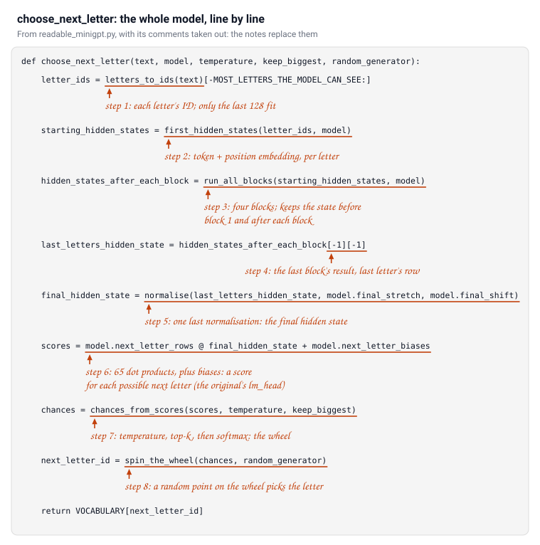
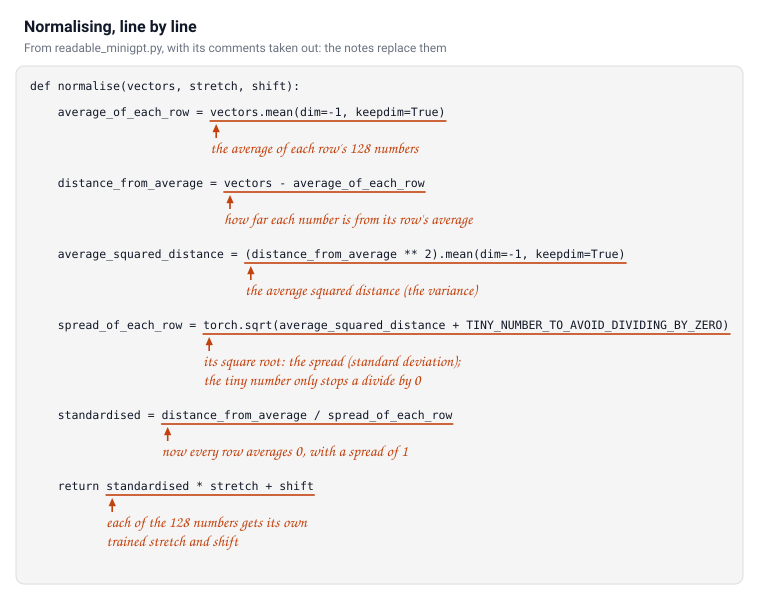
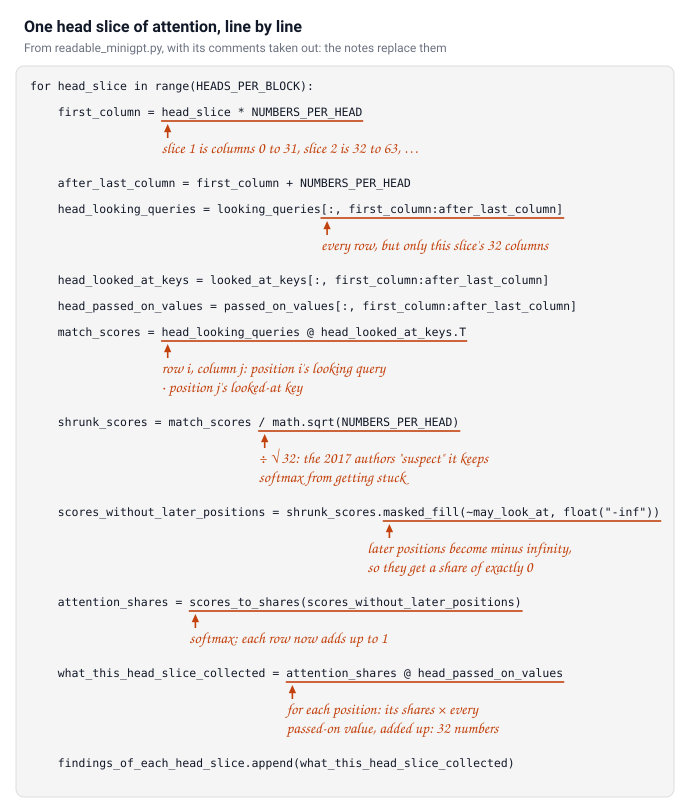

### Why I rewrote the code

MiniGPT is the small language model I took apart in [Part 1](/posts/minigpt/), and trained on Shakespeare in [Part 2](/posts/minigpt-grown/). I rewrote the part of the code that **runs** my trained model, and only that part, to be as easy for a person to read as I could make it, and then checked that it still gives exactly the same answers. This is what the model does, in one paragraph and one picture.

Given a string of text, the model predicts the next letter. It turns each letter of the string into a row of numbers. Then it runs the same few steps over those rows four times, with different trained numbers each time: each row is mixed with the rows before it, then adjusted on its own. Once that is done, only the row for the last letter is used. One more calculation compares that row with 65 stored rows, one for each letter the model knows, and gives each letter a score. The scores become a list of chances: the likeliest next letters at the top, the unlikely ones at the bottom. Writing is picking a letter at random, weighted by those chances, adding it to the string, and asking again. Nobody chose the numbers the model stores: training worked out all 826,433 of them. I can follow each step exactly, but I cannot fully explain why the result works.


*The idea, with the trained model's real numbers for `goo`. The coloured squares are the first 12 of each row's 128 numbers: blue above zero, orange below. Turning scores into chances stretches the differences: `d` scores 5.13 more than `k`, and that becomes about 170 times the chance.*

Writing Part 1, I spent a long time explaining lines like these, from Jibin Joseph's notebook:

```python
x = x + self.attn(self.ln1(x))
q = q.view(B, T, self.n_head, self.head_dim).transpose(1, 2)
```

They are typical PyTorch: short, close to the maths in the papers, and quick on a GPU, the graphics chip that does most of this arithmetic. But they are written for readers who already know that maths. `x` is a different thing after every line, and `ln1`, `attn`, `view` and `transpose` say nothing about what they do. That is why I rewrote it.

The program is [`readable/readable_minigpt.py`](https://github.com/Haddley/minigpt-series/blob/main/readable/readable_minigpt.py) in the series repo, with a notebook version saved with its outputs: [open it in Colab](https://colab.research.google.com/github/Haddley/minigpt-series/blob/main/readable/readable_minigpt.ipynb), or [read it on GitHub](https://github.com/Haddley/minigpt-series/blob/main/readable/readable_minigpt.ipynb). It runs in about a second on my Mac.

:::watch-it What this does not do
It does not train anything: it loads the 826,433 numbers I trained in [Part 2](/posts/minigpt-grown/). It handles one text at a time, where the original can handle a batch. And it loops over the four heads one at a time, where the original does all four in one go. I expected that to make it much slower, so I measured it: on my Mac's processor, it takes about 1.3 times as long as the original for a full 128-letter text, and it is slightly faster for a short one, because it scores only the last letter. Where the original's style really pays off is in handling many texts at once on a GPU, as training does, which I have not measured.
:::

### The rules I followed

1. **Every value gets its own name.** There is no `x = x + something`. When a step makes something new, the new thing gets a new name that says what it is.
2. **Every shape is written down.** A comment such as `# [n, 128]` means "one row for each of the *n* letters of the text, 128 numbers in each row".
3. **Every library call is explained** the first time it appears: what it does to the numbers.
4. **No hype.** Where nobody really knows *why* a piece works, I say so.

Here is what that does to the lines above:

| The original | Rewritten |
|---|---|
| `x = x + self.attn(self.ln1(x))` | `attention_contribution = attention(hidden_states_entering, block)` then `hidden_states_after_attention = hidden_states_entering + attention_contribution` |
| `q.view(B, T, self.n_head, self.head_dim).transpose(1, 2)` | `head_looking_queries = looking_queries[:, first_column:after_last_column]`, inside a loop over the four head slices |
| `self.ln1` | `normalise(hidden_states, block.stretch_before_attention, block.shift_before_attention)` |
| `self.lm_head(x)` | `model.next_letter_rows @ final_hidden_state + model.next_letter_biases` |

### Words I use

Here is what each technical word in this post means, so that none of them is used before it is explained. I kept the real names, rather than inventing friendlier ones, because they are the names you will meet in the code and in other explanations.

| Word | What it means here |
|---|---|
| vector | a list of numbers; here, usually 128 of them |
| table, shape | numbers in rows and columns; a table's shape is its size, such as 65 × 128. PyTorch calls a table of numbers a *tensor* |
| weights, biases | trained numbers. A weight multiplies an input number; a bias is one extra number added at the end |
| embedding | the trained vector that stands for something: a letter (its *token embedding*) or a position in the text (its *position embedding*) |
| hidden state | a letter's current vector as it moves through the model. It starts as the letter's two embeddings added together, and each block adds to it. "Hidden" only means that nobody outside the model sees it |
| attention | the step in which each letter's hidden state takes in information from the letters before it |
| head (here, *head slice*) | one of four copies of attention that run side by side, each using its own 32 of the 128 numbers: a slice of the columns, which is why I call it a head slice |
| query, key, value (here, *looking query*, *looked-at key*, *passed-on value*) | the three vectors attention makes from each hidden state. The usual names are borrowed from looking things up in a database; I add a word to each that says only what it does in the arithmetic, which section 5 explains |
| MLP | short for *multilayer perceptron*: a small network inside each block that works on each letter on its own |
| block | one round of attention followed by the MLP. The model runs four blocks, one after another, each with its own trained numbers |
| normalising | rescaling a vector's numbers to a standard size |
| logit | a score for one letter that could come next, before it becomes a chance |
| softmax | the step that turns scores into chances that add up to 100% |
| batch | several texts handled at once |
| GPU | a graphics chip, which does this kind of arithmetic much faster than an ordinary processor |

### The whole program in one picture

Before the details, here is everything the program does to turn `goo` into its next letter, using the names in the code. Blue steps use the model's fixed trained numbers; orange steps use settings you choose.


*Each box is one line of `choose_next_letter`, with the shape of its data for `goo`*

Step 3 is where most of the work happens, so here it is opened up. `run_all_blocks` runs `run_one_block` four times, each time with a different block's trained numbers, and keeps every result in a list:


*Box 3 of the picture above, opened up: four blocks, each one attention and an MLP, each adding to the hidden states*

And here is the code that draws it, line for line: `run_all_blocks` is the loop down the page, and `run_one_block` is the inside of each block box.


*`run_all_blocks` and `run_one_block`, with each note pointing to its part of the picture above*

One level further in: here is a single block box opened up. Inside `run_one_block`, attention and the MLP each work out something to add, through several steps of their own, while the hidden states go around them and are only changed at the two `+` steps. Sections 5 to 7 below explain each of these steps in turn.


*One block box, opened up: every step inside attention and the MLP, with the shape of its data for `goo`*

### The top level: one function, eight steps

The picture is not a loose summary: it is this function, line for line. `choose_next_letter` is the whole model on one screen. Each line is one box of the picture, marked `# step 1` to `# step 8`, and every other function in the program is one of the pieces it calls.

```python
def choose_next_letter(text: str, model: TrainedModel, temperature: float, keep_biggest: int,
                       random_generator: torch.Generator) -> str:
    """The whole model, top to bottom: one line for each step in the post's whole-program picture."""
    letter_ids = letters_to_ids(text)[-MOST_LETTERS_THE_MODEL_CAN_SEE:]                                 # step 1
    starting_hidden_states = first_hidden_states(letter_ids, model)                                     # step 2
    hidden_states_after_each_block = run_all_blocks(starting_hidden_states, model)                     # step 3
    last_letters_hidden_state = hidden_states_after_each_block[-1][-1]                                 # step 4
    final_hidden_state = normalise(last_letters_hidden_state, model.final_stretch, model.final_shift)  # step 5
    scores = model.next_letter_rows @ final_hidden_state + model.next_letter_biases                    # step 6
    chances = chances_from_scores(scores, temperature, keep_biggest)                                   # step 7
    next_letter_id = spin_the_wheel(chances, random_generator)                                         # step 8
    return VOCABULARY[next_letter_id]
```


*The same eight lines, with a note under each one*

The sections below open the pieces in the order that makes them easiest to follow: first the numbers the model knows, then the small tools, and then each step from the letters to the wheel.

### 1. The static data: every number the model knows

Training produced 826,433 numbers, and they are all the model knows. They live in one file, `exhibit.pt`, as named tables. The original names are short, so the program gives each table a descriptive one:

| Original name | Name in the rewrite | Shape | Numbers | What it is |
|---|---|---|---|---|
| `token_embedding.weight` | `token_embedding_table` | 65 × 128 | 8,320 | one row for each letter: its token embedding |
| `position_embedding.weight` | `position_embedding_table` | 128 × 128 | 16,384 | one row for each position: its position embedding |
| `blocks.N.ln1.weight`, `.bias` | `stretch_before_attention`, `shift_before_attention` | 128 each | 256 | normalising before attention |
| `blocks.N.attn.query.weight`, `.bias` | `looking_query_weights`, `looking_query_biases` | 128 × 128, 128 | 16,512 | make each position's looking query |
| `blocks.N.attn.key.weight`, `.bias` | `looked_at_key_weights`, `looked_at_key_biases` | 128 × 128, 128 | 16,512 | make each position's looked-at key |
| `blocks.N.attn.value.weight`, `.bias` | `passed_on_value_weights`, `passed_on_value_biases` | 128 × 128, 128 | 16,512 | make each position's passed-on value |
| `blocks.N.attn.proj.weight`, `.bias` | `head_mixing_weights`, `head_mixing_biases` | 128 × 128, 128 | 16,512 | mix the four head slices' findings |
| `blocks.N.ln2.weight`, `.bias` | `stretch_before_mlp`, `shift_before_mlp` | 128 each | 256 | normalising before the MLP |
| `blocks.N.mlp.fc1.weight`, `.bias` | `widen_weights`, `widen_biases` | 512 × 128, 512 | 66,048 | widen 128 numbers to 512 |
| `blocks.N.mlp.fc2.weight`, `.bias` | `narrow_weights`, `narrow_biases` | 128 × 512, 128 | 65,664 | narrow 512 numbers back to 128 |
| `final_ln.weight`, `.bias` | `final_stretch`, `final_shift` | 128 each | 256 | the final normalisation |
| `lm_head.weight`, `.bias` | `next_letter_rows`, `next_letter_biases` | 65 × 128, 65 | 8,385 | score each letter that could come next |

The rows marked `blocks.N` appear four times, once for each block, with the same shapes but different numbers: 198,272 numbers per block. Four blocks, plus the embeddings, the final normalisation and `lm_head`, make 826,433.

The file also holds four tables called `causal_mask`: 128 × 128 True or False values meaning "position *i* may look at position *j*". They are not learned, just a rule written out as a table, so the rewrite builds the same rule itself when it needs it. ("Causal" because each letter may only be affected by the letters before it, never by the ones after.)

Nobody wrote any of these numbers. Training started them as small random numbers and nudged them, again and again, towards whatever made the model better at guessing the next letter. None of the 128 numbers in a row has a meaning that anyone assigned to it.

In the program, each block's tables become one record with named fields. `@dataclass` is Python's way of saying "a record with named fields", and `torch.Tensor` means "a table of numbers":

```python
@dataclass
class TrainedBlock:
    """The trained numbers of one block. Every block has the same shapes, but its own values."""

    # Normalising before attention: one "stretch" and one "shift" number for each of the 128 positions
    # in a vector. (The original code calls these ln1.weight and ln1.bias.)
    stretch_before_attention: torch.Tensor      # [128]
    shift_before_attention: torch.Tensor        # [128]

    # Attention makes three new vectors from each hidden state: a looking query, a looked-at key, and a
    # passed-on value (usually just called the query, the key, and the value; section 6 explains the
    # extra words). Each comes from its own table of weights: 128 rows of 128 numbers, plus 128 biases.
    # (attn.query, attn.key, attn.value)
    looking_query_weights: torch.Tensor                 # [128, 128]
    looking_query_biases: torch.Tensor                  # [128]
    looked_at_key_weights: torch.Tensor                   # [128, 128]
    looked_at_key_biases: torch.Tensor                    # [128]
    passed_on_value_weights: torch.Tensor                 # [128, 128]
    passed_on_value_biases: torch.Tensor                  # [128]

    # After the four head slices have each collected 32 numbers, this table mixes the 128 numbers they
    # found into the 128 numbers that are added to the hidden state. (attn.proj)
    head_mixing_weights: torch.Tensor           # [128, 128]
    head_mixing_biases: torch.Tensor            # [128]

    # Normalising before the MLP. (ln2.weight, ln2.bias)
    stretch_before_mlp: torch.Tensor            # [128]
    shift_before_mlp: torch.Tensor              # [128]

    # The MLP: widen 128 numbers to 512, bend them, narrow them back to 128. (mlp.fc1, mlp.fc2)
    widen_weights: torch.Tensor                 # [512, 128]
    widen_biases: torch.Tensor                  # [512]
    narrow_weights: torch.Tensor                # [128, 512]
    narrow_biases: torch.Tensor                 # [128]
```

### 2. The changing state

Everything above is fixed. What changes is worked out fresh for each text, and thrown away afterwards. For a text of *n* letters, the model's whole state is:

| Name in the rewrite | Shape | What it is |
|---|---|---|
| `letter_ids` | *n* | each letter's ID: its place in the 65-letter vocabulary |
| `hidden_states` | *n* × 128 | one vector per letter: it starts as token embedding + position embedding, and every block adds to it |
| `looking_queries`, `looked_at_keys`, `passed_on_values` | *n* × 128 each | made inside attention from the hidden states; each head slice uses 32 of the 128 numbers |
| `attention_shares` | *n* × *n*, for each head slice | row *i*: how much attention position *i* gives to each position up to itself |
| `widened` | *n* × 512 | inside the MLP, between widening and narrowing |
| `final_hidden_state` | 128 | the last letter's hidden state, after all four blocks and the final normalisation |
| `scores` | 65 | one score, a *logit*, for each letter that could come next |
| `chances` | 65 | the scores after temperature, top-k and softmax: the wheel |

Nothing else is remembered. The model has no memory from one letter to the next except the text itself: to write the next letter, it starts again from the letters.

### 3. Four small tools

The whole model is built from four simple operations, used again and again.

**Applying a table of weights.** PyTorch calls this a "linear layer". For each input vector, every output number is a dot product: multiply the input's numbers by one row of weights, number by number, add up the results, and add that row's bias.

```python
def apply_weights(input_vectors: torch.Tensor, weights: torch.Tensor, biases: torch.Tensor) -> torch.Tensor:
    """input_vectors: [rows, inputs]; weights: [outputs, inputs]; biases: [outputs] -> [rows, outputs]"""
    dot_products = input_vectors @ weights.T     # [rows, outputs]: each input row · each weight row
    return dot_products + biases                 # the same biases are added to every row
```

`weights.T` is the table turned on its side, so rows become columns. The `@` sign is matrix multiplication, which here does every one of those dot products at once: every input row against every weight row.

**Normalising.** This puts each vector's 128 numbers on a standard scale, an average of 0 and a spread of 1, and then stretches and shifts each number by its own trained amount.

```python
def normalise(vectors: torch.Tensor, stretch: torch.Tensor, shift: torch.Tensor) -> torch.Tensor:
    """vectors: [rows, 128] -> [rows, 128], each row rescaled to average 0 and spread 1, then stretched and shifted."""
    average_of_each_row = vectors.mean(dim=-1, keepdim=True)                       # [rows, 1]
    distance_from_average = vectors - average_of_each_row                          # [rows, 128]
    average_squared_distance = (distance_from_average ** 2).mean(dim=-1, keepdim=True)   # [rows, 1]
    spread_of_each_row = torch.sqrt(average_squared_distance + TINY_NUMBER_TO_AVOID_DIVIDING_BY_ZERO)
    standardised = distance_from_average / spread_of_each_row                      # [rows, 128]
    return standardised * stretch + shift                                          # [rows, 128]
```


*`normalise` again, with a note under each line*

`.mean(dim=-1, keepdim=True)` averages along the last direction of the table, across the 128 numbers of each row, and keeps the answer as a one-number column, so that it can be subtracted from every number in its row. `torch.sqrt` is the square root.

Why does normalising help? It keeps the numbers from growing or shrinking out of control as they pass through many steps, which makes training more stable. That much is well established, by the [paper that introduced it](https://arxiv.org/abs/1607.06450) and by years of use since. Exactly why it helps is still argued about. A 2019 study, [Understanding and Improving Layer Normalization](https://arxiv.org/abs/1911.07013), opens by saying "it is still unclear where the effectiveness stems from", and found that "the derivatives of the mean and variance are more important than forward normalization": the way normalising changes training mattered more than the rescaling itself.

**The bend (GELU).** Two tables of weights in a row, with nothing between them, are no more powerful than one: a weighted mix of weighted mixes is still a weighted mix. A bend in between fixes that.

```python
def bend(numbers: torch.Tensor) -> torch.Tensor:
    """GELU, applied to every number separately. Same shape in, same shape out."""
    return 0.5 * numbers * (1.0 + torch.erf(numbers / math.sqrt(2.0)))
```

`torch.erf` is the "error function", a standard S-shaped curve from statistics, and this is the exact formula PyTorch uses. It lets big positive numbers through almost unchanged and turns big negative ones into almost 0: `bend(3)` is 2.996 and `bend(-3)` is −0.004. Why this curve, rather than a simpler one? Mostly because it worked well in experiments. The [paper that introduced it](https://arxiv.org/abs/1606.08415) justifies it with "an empirical evaluation" against older curves, across vision, language, and speech tasks. A later paper that compared several alternatives, [GLU Variants Improve Transformer](https://arxiv.org/abs/2002.05202), ends with unusual candour:

> We offer no explanation as to why these architectures seem to work; we attribute their success, as all else, to divine benevolence.

**Turning scores into shares (softmax).** Used twice: to share out attention, and at the very end, to turn the 65 scores into the wheel.

```python
def scores_to_shares(scores: torch.Tensor) -> torch.Tensor:
    """Softmax along the last direction: each row of scores becomes shares that add up to 1."""
    biggest_score_in_each_row = scores.amax(dim=-1, keepdim=True)
    scores_minus_biggest = scores - biggest_score_in_each_row      # the biggest becomes 0
    positive_numbers = torch.exp(scores_minus_biggest)              # all between 0 and 1
    total_of_each_row = positive_numbers.sum(dim=-1, keepdim=True)
    return positive_numbers / total_of_each_row
```

`.amax` finds the biggest number in each row, `torch.exp` raises *e* (about 2.718) to the power of each number, and `.sum` adds each row up. A score of minus infinity becomes exactly 0. The scores 2, 1 and 0 become shares of 66.5%, 24.5% and 9.0%.

### 4. From letters to the first hidden states

```python
def letters_to_ids(text: str) -> list:
    """Each letter's place in the vocabulary. Letters that are not in it are skipped."""
    return [LETTER_TO_ID[letter] for letter in text if letter in LETTER_TO_ID]
```

```python
def first_hidden_states(letter_ids: list, model: TrainedModel) -> torch.Tensor:
    """[n] IDs -> [n, 128]: token embedding + position embedding, one row per letter."""
    number_of_letters = len(letter_ids)
    token_embeddings = model.token_embedding_table[letter_ids]                   # [n, 128]
    position_embeddings = model.position_embedding_table[:number_of_letters]     # [n, 128]
    return token_embeddings + position_embeddings                                # [n, 128]
```

`table[letter_ids]` picks one row for each ID in the list, in order, and `table[:n]` keeps the first *n* rows. For `goo`, the IDs are 45, 53 and 53. The two `o`s pick the same token embedding, but their position embeddings differ, so they start differently: position 2 begins −0.006, −0.031, 0.017, and position 3 begins 0.019, −0.080, 0.013.

### 5. Attention: each letter looks back

This is the only place in the model where one letter's hidden state is affected by another's.

Attention makes three vectors from each hidden state, usually called the **query**, the **key**, and the **value**. Those names suggest a meaning that nobody has shown the numbers have, so in the code I add a word to each that says only what it does in the arithmetic, and keep the usual word so that you can still match it to papers and other code:

| Usual name | In the code | What it does in the arithmetic |
|---|---|---|
| query | `looking_queries` | used when this position looks back at the others |
| key | `looked_at_keys` | used when another position looks at this one |
| value | `passed_on_values` | what this position passes on to whoever looks at it |
| head | `head_slice` | one of four copies of attention, each working on its own 32 of the 128 numbers: a slice of the columns |

```python
def attention(hidden_states: torch.Tensor, block: TrainedBlock) -> torch.Tensor:
    """[n, 128] -> [n, 128]: what attention adds to each hidden state."""
    number_of_positions = hidden_states.shape[0]
    normalised = normalise(hidden_states, block.stretch_before_attention, block.shift_before_attention)

    looking_queries = apply_weights(normalised, block.looking_query_weights, block.looking_query_biases)      # [n, 128]
    looked_at_keys = apply_weights(normalised, block.looked_at_key_weights, block.looked_at_key_biases)      # [n, 128]
    passed_on_values = apply_weights(normalised, block.passed_on_value_weights, block.passed_on_value_biases)  # [n, 128]

    # may_look_at[i][j] is True when position i may look at position j: only j <= i.
    may_look_at = torch.tril(torch.ones(number_of_positions, number_of_positions, dtype=torch.bool))

    findings_of_each_head_slice = []
    for head_slice in range(HEADS_PER_BLOCK):
        first_column = head_slice * NUMBERS_PER_HEAD
        after_last_column = first_column + NUMBERS_PER_HEAD
        head_looking_queries = looking_queries[:, first_column:after_last_column]    # [n, 32]
        head_looked_at_keys = looked_at_keys[:, first_column:after_last_column]      # [n, 32]
        head_passed_on_values = passed_on_values[:, first_column:after_last_column]  # [n, 32]

        # match_scores[i][j]: position i's looking query · position j's looked-at key
        match_scores = head_looking_queries @ head_looked_at_keys.T          # [n, n]
        shrunk_scores = match_scores / math.sqrt(NUMBERS_PER_HEAD)          # [n, n]
        scores_without_later_positions = shrunk_scores.masked_fill(~may_look_at, float("-inf"))
        attention_shares = scores_to_shares(scores_without_later_positions)  # [n, n], rows add up to 1

        # Each position collects every position's passed-on values, weighted by its shares of attention.
        what_this_head_slice_collected = attention_shares @ head_passed_on_values   # [n, 32]
        findings_of_each_head_slice.append(what_this_head_slice_collected)

    all_head_slices_side_by_side = torch.cat(findings_of_each_head_slice, dim=-1)   # [n, 128]
    return apply_weights(all_head_slices_side_by_side, block.head_mixing_weights, block.head_mixing_biases)
```

Reading it from the top:

1. **Normalise** the hidden states, then make three new vectors from each one, each with its own table of weights: a looking query, a looked-at key, and a passed-on value.
2. **Build the "only earlier positions" rule.** `torch.ones(n, n, dtype=torch.bool)` makes an *n* × *n* table filled with True, and `torch.tril` keeps its lower-left triangle, including the diagonal, and sets the rest to False. Row *i* is True for columns 0 to *i*.
3. **For each head slice**, take that slice's 32 columns of the looking queries, looked-at keys, and passed-on values. `looking_queries[:, first_column:after_last_column]` keeps those columns of every row.
4. **Match**: `head_looking_queries @ head_looked_at_keys.T` gives an *n* × *n* table in which row *i*, column *j* is position *i*'s looking query multiplied by position *j*'s looked-at key, number by number, and added up.
5. **Shrink** the scores by √32. The 2017 authors' reason is, in their own words, a suspicion: "We suspect that for large values of d_k, the dot products grow large in magnitude, pushing the softmax function into regions where it has extremely small gradients" ([*Attention Is All You Need*](https://arxiv.org/abs/1706.03762), section 3.2.1). Here *d_k* is 32, the numbers per head slice: without the shrink, the scores grow with the length of the vectors, and softmax tends to give nearly all the attention to one position.
6. **Hide later positions**: `.masked_fill(~may_look_at, float("-inf"))` sets every score where the rule is False to minus infinity. (`~` turns True into False and back.) Softmax then gives those positions a share of exactly 0, so a letter never looks ahead at the answer it is trying to guess.
7. **Share out and collect**: softmax turns each row into shares that add up to 1, and `attention_shares @ head_passed_on_values` adds up every position's passed-on values, weighted by those shares.
8. **Put the head slices back together**: `torch.cat` lays the four slices' 32-number findings side by side, 128 numbers again, and one more table of weights mixes them.


*The head-slice loop again, with a note under each line*


*One head slice, with the real numbers for `goo`*

For `goo`, position 3 in block 1, head slice 1, gives 4.0% of its attention to position 1, 92.9% to position 2, and 3.1% to itself: the same numbers as in Part 1.

:::watch-it What we do not know
The names *query*, *key* and *value* come from looking things up in a database. They are an analogy chosen by the authors of [*Attention Is All You Need*](https://arxiv.org/abs/1706.03762), the 2017 paper that introduced this design, not a description of what the numbers mean. The arithmetic above is all that happens. Training makes the query, key and value weights useful, but *why* this particular design learns so well is not well understood: a 2025 survey by interpretability researchers, [Open Problems in Mechanistic Interpretability](https://arxiv.org/abs/2501.16496), says "there are many open problems in the field that require solutions". A few heads have a habit you can measure: in this model, block 1's first head slice mostly looks one position back. Most heads, in most models, have no tidy description at all, and the meanings people give to queries and keys are usually stories told afterwards. Even the attention shares are not a safe guide to what matters: [Attention is not Explanation](https://arxiv.org/abs/1902.10186) (2019) found that "one can identify very different attention distributions that nonetheless yield equivalent predictions".
:::

:::side-by-side
You can follow one query through all of these steps in Part 1's demo:

:::demo minigpt-qkv
:::

:::test-drive Where does each head slice look?
The demo is shared with Part 1, so it uses the usual names: its "query" is a looking query, and its "key" is a looked-at key.

1. Leave it on `goo`, block 1, head 1, position 3. The scores −2.19, 15.60 and −3.62 become shares of 4.0%, 92.9% and 3.1%. **What it shows:** the last `o` gives nearly all its attention to the letter just before it. Nothing in the code says "look one letter back". The looking-query and looked-at-key weights produce that, and training chose those weights.
2. Pick position 1. **What it shows:** the first letter has nothing earlier to look at, so it gives itself 100%. `may_look_at` is the only reason it cannot look ahead at the letters after it.
3. Go back to position 3, and press **head 2**: the second head slice, which uses columns 32 to 63. Now 83.4% goes to the `g`, two positions back. **What it shows:** the same letters, in the same block, are looked at in different ways by different head slices. That is the point of having four of them.
4. Type `First Citizen:`, pick its last position, and compare block 1 with block 4. When I measured it, block 1's head slices looked between 0.6 and 3.8 positions back on average, and block 4's between 4.2 and 6.3. **What it shows:** on this one line, the later blocks look further back. It is one example, not a rule.

**My takeaway:** I can watch *where* each head slice looks, and the code shows exactly *how* it works that out. Neither of them tells me *why* looking one letter back, or two, helps the model guess the next letter. I can see what attention does, but not what it means.
:::
:::

### 6. The MLP: each letter on its own

```python
def mlp(hidden_states: torch.Tensor, block: TrainedBlock) -> torch.Tensor:
    """[n, 128] -> [n, 128]: what the MLP adds to each hidden state."""
    normalised = normalise(hidden_states, block.stretch_before_mlp, block.shift_before_mlp)
    widened = apply_weights(normalised, block.widen_weights, block.widen_biases)       # [n, 512]
    bent = bend(widened)                                                               # [n, 512]
    return apply_weights(bent, block.narrow_weights, block.narrow_biases)              # [n, 128]
```

The MLP works on each letter's hidden state separately: no position looks at any other. It normalises, widens 128 numbers to 512, bends them, and narrows them back to 128.

What is it for? A common rule of thumb is that attention brings in *context* from other letters, and the MLP brings in *knowledge* stored in its weights, such as which letter usually ends a word. There is evidence for that in big models: one study described the MLP layers as acting like ["key-value memories"](https://arxiv.org/abs/2012.14913). But it is a rough picture, not a proven account. A 2023 study, [Does Localization Inform Editing?](https://arxiv.org/abs/2301.04213), found that working out where a fact seems to be stored did "not provide any insight into which model MLP layer would be best to edit" to change it, and in a model this small nobody has worked out what each of the 512 numbers does. Why 512, four times 128? It copies the ratio in the [2017 design](https://arxiv.org/abs/1706.03762), where "the dimensionality of input and output is d_model=512, and the inner-layer has dimensionality d_ff=2048". The paper states those sizes without explaining the choice of four, and later models have kept it because it works, not because anyone derived it.

### 7. One block, then four

This is where the rewrite differs most from the original. The original writes a block as two lines, both reusing the name `x`:

```python
x = x + self.attn(self.ln1(x))
x = x + self.mlp(self.ln2(x))
```

The rewrite gives the old and the new hidden states different names, so you can see that nothing is thrown away: each part only adds to what was there.

```python
def run_one_block(hidden_states_entering: torch.Tensor, block: TrainedBlock) -> torch.Tensor:
    """[n, 128] -> [n, 128]"""
    attention_contribution = attention(hidden_states_entering, block)
    hidden_states_after_attention = hidden_states_entering + attention_contribution

    mlp_contribution = mlp(hidden_states_after_attention, block)
    hidden_states_leaving = hidden_states_after_attention + mlp_contribution
    return hidden_states_leaving
```

The [annotated version of these two functions](#the-whole-program-in-one-picture) is at the top of the post, next to the picture of step 3 opened up.

```python
def run_all_blocks(starting_hidden_states: torch.Tensor, model: TrainedModel) -> list:
    """Returns the hidden states before block 1 and after each block: a list of 5 tables, each [n, 128]."""
    hidden_states_after_each_block = [starting_hidden_states]
    for block in model.blocks:
        hidden_states_entering = hidden_states_after_each_block[-1]   # the latest result
        hidden_states_after_each_block.append(run_one_block(hidden_states_entering, block))
    return hidden_states_after_each_block
```


*One block for position 3 of `goo`, with the first three of each vector's 128 numbers*

The four blocks run in order, each starting from the previous block's result. Keeping every result in a list means the whole history can be looked at afterwards. For position 3 of `goo`, the hidden state's size grows from 0.50 before block 1 to 2.16, 2.72, 2.92 and 3.09 after blocks 1 to 4.

### 8. From the last hidden state to 65 scores

```python
def scores_for_next_letter(text: str, model: TrainedModel) -> torch.Tensor:
    """A text -> [65] scores, one for each letter that could come next."""
    letter_ids = letters_to_ids(text)[-MOST_LETTERS_THE_MODEL_CAN_SEE:]   # only the last 128 letters fit
    starting_hidden_states = first_hidden_states(letter_ids, model)
    hidden_states_after_each_block = run_all_blocks(starting_hidden_states, model)
    last_letters_hidden_state = hidden_states_after_each_block[-1][-1]   # last block, last position: [128]
    final_hidden_state = normalise(last_letters_hidden_state, model.final_stretch, model.final_shift)
    return model.next_letter_rows @ final_hidden_state + model.next_letter_biases   # [65]
```

Only the last letter's hidden state is needed to guess the next letter. It is normalised one final time, giving the *final hidden state*, and compared with each of the 65 next-letter rows by a dot product, plus that row's bias. After `go`, `o` scores 4.878, the space 4.076, and `d` 4.062, exactly as in Part 1.

### 9. Does it give the same answers?

A rewrite for readability must not change the answers. The program builds Jibin Joseph's original model, loads the same trained numbers into it, and compares the 65 scores for four texts, from `go` to a full line of *Coriolanus*. The biggest difference is 0.0000029: the kind of difference that comes from adding the same numbers up in a different order, not a change in what the model does.

### 10. From scores to the next letter

```python
def chances_from_scores(scores: torch.Tensor, temperature: float, keep_biggest: int) -> torch.Tensor:
    """[65] scores -> [65] chances that add up to 1."""
    if temperature <= 0:   # temperature 0 means "always the biggest score": give it the whole wheel
        whole_wheel_to_the_favourite = torch.zeros_like(scores)
        whole_wheel_to_the_favourite[scores.argmax()] = 1.0
        return whole_wheel_to_the_favourite
    scaled_scores = scores / temperature
    smallest_score_kept = torch.topk(scaled_scores, min(keep_biggest, len(scaled_scores))).values[-1]
    trimmed_scores = scaled_scores.masked_fill(scaled_scores < smallest_score_kept, float("-inf"))
    return scores_to_shares(trimmed_scores)
```

```python
def spin_the_wheel(chances: torch.Tensor, random_generator: torch.Generator) -> int:
    """Pick one letter ID, each with its own chance."""
    random_point = torch.rand(1, generator=random_generator)     # one number between 0 and 1
    running_totals = torch.cumsum(chances, dim=0)                # [65], ends at 1
    landed_on = torch.searchsorted(running_totals, random_point).item()
    return min(landed_on, len(chances) - 1)                      # a safety net for rounding
```

```python
def write(start: str, letters_to_add: int, model: TrainedModel,
          temperature: float = 0.8, keep_biggest: int = 65, seed: int = 0) -> str:
    random_generator = torch.Generator().manual_seed(seed)
    text_so_far = start
    for _ in range(letters_to_add):
        next_letter = choose_next_letter(text_so_far, model, temperature, keep_biggest, random_generator)
        text_so_far = text_so_far + next_letter   # the only name that changes: the text itself grows
    return text_so_far
```

`torch.topk` returns the *k* biggest numbers, biggest first, so `.values[-1]` is the smallest one kept. `torch.cumsum` makes running totals of the 65 chances, ending at 1, and `torch.searchsorted` finds where a random point between 0 and 1 falls among them: the slice of the wheel it lands in. A random-number generator with a fixed seed gives the same "random" spins every time, so the results can be repeated.

`text_so_far = text_so_far + next_letter` is the one place where I reused a name for a new value. I left it, because the text so far really is one thing that grows letter by letter, and the loop would be harder to follow with a new name for every length.

`write` asks [`choose_next_letter`](#the-top-level-one-function-eight-steps), from the top of this post, for one letter at a time, and adds each one to the text. Here is what it writes from `ROMEO:`, at a temperature of 0.8:

```
ROMEO:
Then this of hearts fear of Contic it thy slaught?

PEY:
Come, what I will one that that that be nother,
As then, my see own banish, thou banish'd risgue,
And have for a horsure as in by all death.
Wh
```

### What I learned from rewriting it

:::bullet-points What the rewrite showed me
- **Names do most of the work.** Once `x` became `hidden_states_entering`, `hidden_states_after_attention` and `hidden_states_leaving`, the "add, never replace" idea needed no extra explanation.
- **Heads are just slices of the columns.** The original's `view` and `transpose` are a fast way of saying "head slice 2 uses columns 32 to 63". A loop says the same thing more slowly, and more plainly.
- **The whole model is four tools.** Applying weights, normalising, a bend, and softmax, plus the arithmetic of attention.
- **Readable code is longer, but hardly slower here.** For one text, the rewrite takes about 1.3 times as long as the original at worst. The original is built to do the four heads, and many texts at once, in one go, which matters for training on a GPU; I have not measured that case.
- **Readable code still cannot say why.** The rewrite makes *what* happens plain. *Why* training finds queries, keys and values that work, and what the 512 MLP numbers mean, the code cannot tell you, and neither can anyone yet.
:::

### References

- [The readable program and notebook — minigpt-series, `readable/`](https://github.com/Haddley/minigpt-series/tree/main/readable)
- [MiniGPT: Rebuilding GPT from First Principles — Jibin Joseph, 2026](https://arxiv.org/abs/2605.17398)
- [Jibin Joseph's MiniGPT notebook](https://github.com/jibin10/MiniGPT)
- [Attention Is All You Need — Vaswani and others, 2017](https://arxiv.org/abs/1706.03762)
- [Layer Normalization — Ba, Kiros & Hinton, 2016](https://arxiv.org/abs/1607.06450)
- [Understanding and Improving Layer Normalization — Xu and others, 2019](https://arxiv.org/abs/1911.07013)
- [GLU Variants Improve Transformer — Shazeer, 2020](https://arxiv.org/abs/2002.05202)
- [Attention is not Explanation — Jain & Wallace, 2019](https://arxiv.org/abs/1902.10186)
- [Transformer Feed-Forward Layers Are Key-Value Memories — Geva and others, 2021](https://arxiv.org/abs/2012.14913)
- [Does Localization Inform Editing? — Hase and others, 2023](https://arxiv.org/abs/2301.04213)
- [Open Problems in Mechanistic Interpretability — Sharkey and others, 2025](https://arxiv.org/abs/2501.16496)
- [Gaussian Error Linear Units (GELUs) — Hendrycks & Gimpel, 2016](https://arxiv.org/abs/1606.08415)
