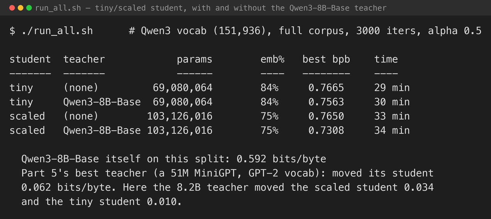
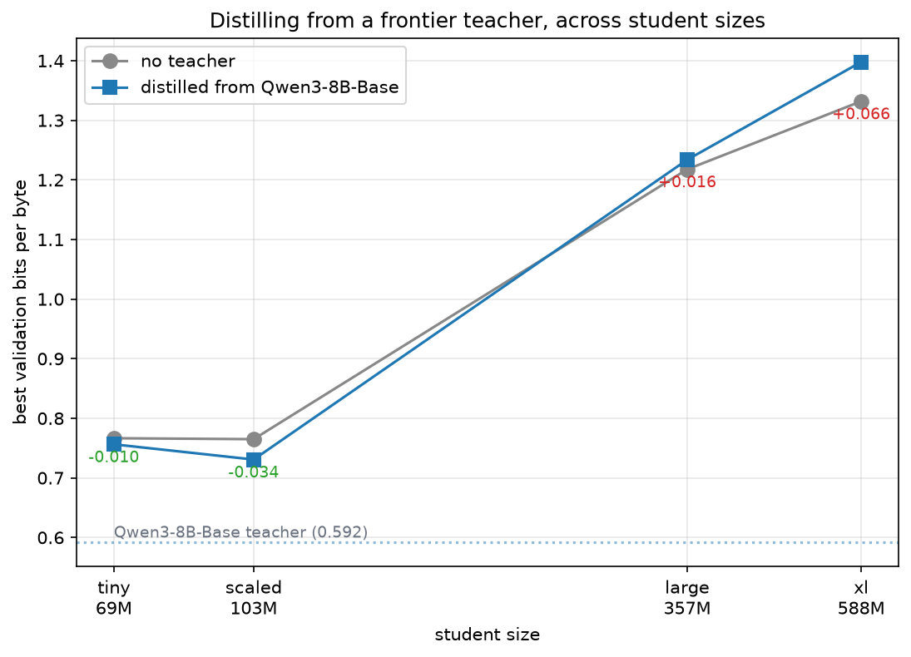
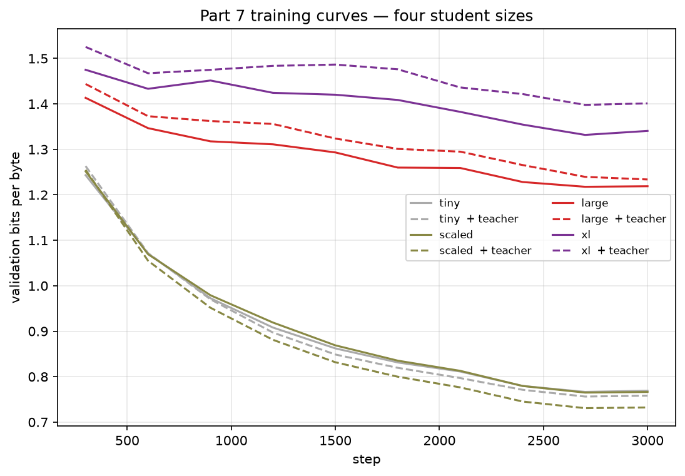
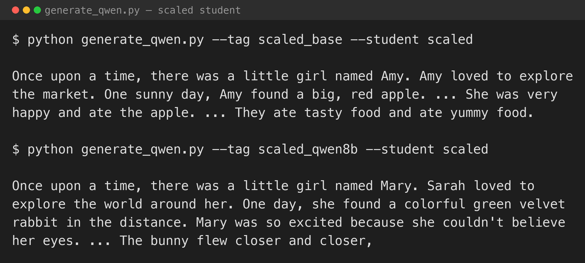

[Part 6](/posts/minigpt5/) ran into a wall: a teacher must use exactly the student's pieces, so none of today's big models could teach my student, which uses GPT-2's. This post climbs over the wall. It rebuilds MiniGPT on **Qwen3's pieces**, so that **Qwen3-8B-Base**, a capable 2025 model with 8.2 billion numbers, can be its teacher, to see whether a frontier teacher finally delivers a big win.

The code is in [`part8-qwen3-teacher/`](https://github.com/Haddley/minigpt-series/tree/main/part8-qwen3-teacher), with a follow-along notebook for a Mac, [`minigpt_follow_along_8.ipynb`](https://github.com/Haddley/minigpt-series/blob/main/part8-qwen3-teacher/minigpt_follow_along_8.ipynb).

## The big picture, in plain English

### A teacher that continues text

:::brain-power
Qwen3 comes in two kinds: a *base* model, trained only to continue text, and a *chat* model, trained further to answer questions politely. Which do you think makes the better teacher for a machine that writes stories?
:::

I tried the chat model first, Qwen3-4B, and measured how well it predicts the test stories: 0.778 bits per byte, about the same as GPT-2 XL in Part 6. A chat model is a poor storyteller in this sense: it has been trained to answer, not to carry on. The base model, Qwen3-8B-Base, scored **0.592**, better than any teacher in Part 6, whose best was 0.644. Meta did the same: it taught Llama 3.2 with the *base* Llama 3.1 models. So the base model is the teacher here.

### The toll: 151,936 token cards

Qwen3 cuts text into about 151,700 pieces, and its models round their supply of cards up to 151,936. For the student to share its wheels, it must have the same 151,936 token cards, and [Part 3](/posts/minigpt2/#what-bigger-pieces-cost) showed what that costs:

| Student | Settings | Numbers | Share that is token cards |
|---|---|---|---|
| tiny | 384 numbers per card, 6 blocks | 69 million | 84% |
| scaled | 512 numbers per card, 8 blocks | 103 million | 75% |

The tiny student's token cards alone, 58 million numbers, are almost twice the whole of Part 6's student. And for these stories, the extra pieces buy nothing: Qwen3's pieces cover the test stories at 0.239 tokens per byte, almost exactly GPT-2's 0.246 and my 8k pieces' 0.244. The 100,000 extra pieces are for program code and other languages, which children's stories never use.

### Asking the teacher once

Qwen3-8B-Base reads about 600 tokens a second on my Mac Studio. Asking it for its wheel on every training step, as Part 6 did with GPT-2, would stretch every run to most of a day. So the teacher reads all the stories just *once*, in advance, and its answers are saved: `cache_teacher.py` took about two and three-quarter hours.

Saving every wheel in full is impossible: 151,936 slices for each of about 5 million positions. So for each position, only the teacher's 48 biggest slices are kept, a 1.4 GB file. Every student then learns from the same saved wheels, with no teacher running at all. This is how distillation is done at large scale, too.

:::watch-it
Keeping only the 48 biggest slices means the student is compared with the teacher on those 48 pieces alone. On these stories they hold almost all of the teacher's chance, but the student never learns what the teacher thought of the other 151,888.
:::

### What the teacher taught

Both students trained for 3,000 steps on all of my practice stories, cut into Qwen3's pieces, once alone and once copying the saved wheels:

| Student | Alone | With Qwen3-8B-Base | Change |
|---|---|---|---|
| tiny, 69 million | 0.7665 | 0.7563 | −0.010 |
| scaled, 103 million | 0.7650 | **0.7308** | **−0.034** |


*The four runs. The teacher's own 0.592 is far below all of them*

The frontier teacher helped, but less than [Part 6](/posts/minigpt5/)'s 51-million-number MiniGPT-512 did. Qwen3-8B-Base knows these stories far better than MiniGPT-512, 0.592 against 0.644, yet it moved the scaled student by 0.034 and the tiny one by 0.010. MiniGPT-512 moved its student by 0.062.

The scaled student gained three times as much as the tiny one. The part of each machine that can actually learn from a richer wheel is the blocks, 25 million numbers in the scaled student against 11 million in the tiny one; most of the rest is token cards, and most of those are for pieces that never appear in a story, so they barely ever change. The obvious next step was a bigger student.

### A bigger student, and a different ceiling

I tried two much bigger students: **large**, 357 million numbers, and **xl**, 588 million. 588 million was as big as the Mac could manage: with 16 snippets per step the GPU hung, so large trained on 12 snippets per step and xl on 8.

| Student | Numbers | Alone | With Qwen3-8B-Base | Change |
|---|---|---|---|---|
| tiny | 69 million | 0.7665 | 0.7563 | −0.010 |
| scaled | 103 million | 0.7650 | 0.7308 | **−0.034** |
| large | 357 million | 1.2177 | 1.2338 | +0.016 |
| xl | 588 million | 1.3318 | 1.3978 | **+0.066** |


*Best bits per byte against student size. Up to 103 million numbers, the teacher helps; beyond that, everything gets worse*

**Bigger got worse, teacher or not.** The cause is the stories: about 5 million tokens. A common rule of thumb, from DeepMind's *Chinchilla* study, says a machine should see about 20 tokens of text for every one of its numbers.

:::pencil How much text would it need?
Using the rule of about 20 tokens per number, how many tokens should the 357-million-number student see? And how many times more is that than the 5 million tokens of stories?

:::answer
357 million × 20 = about 7 billion tokens. That is about 1,500 times the 4.8 million tokens of practice stories. In 3,000 steps of 12 snippets, the large student saw each story only once or twice, nowhere near enough to fill 357 million numbers with anything useful.
:::
:::

**And the teacher started to hurt.** For the large and xl students, the run with the teacher scored *worse* than the run without. A student that has not yet learned the basics spends half its effort copying a sophisticated wheel over 151,936 pieces, most of which never appear in the stories, and that pulls it away from the real answers it still needs.


*The training curves. The large and xl students (red and purple) improved steadily until about step 2,700, then flattened as the training schedule wound down, far above the small students. For both, the run with the teacher (dashed) is above the one without*

So there are two ceilings on how big a student can be, and the stories are the lower one: memory allowed 588 million numbers on this Mac, but anything past about 100 million made things worse.


*The scaled student, with and without the teacher*

Both write story-shaped text with the usual slips: "a little girl named Mary" becomes "Sarah" one sentence later, and "the bunny flew closer". The taught one is 0.034 bits per byte better on the test stories, but it does not read like a different machine.

:::fireside-chat Tonight: Qwen3-8B-Base and Part 6's MiniGPT-512, on what makes a good teacher
**Qwen3-8B-Base:** Eight point two billion numbers. I scored 0.592 on these stories. Nobody in this series comes close.

**MiniGPT-512:** I scored 0.644, with 51 million.

**Qwen3-8B-Base:** Then I am the better reader, and so the better teacher.

**MiniGPT-512:** Better reader, yes. But my student moved 0.062. Yours moved 0.034, and that was your best one.

**Qwen3-8B-Base:** My students had 151,936 token cards to look after.

**MiniGPT-512:** Because they had to use *your* pieces. Mine used the same pieces as me, and the same design. When I give my wheel, my student can actually copy it.

**Qwen3-8B-Base:** And the bigger students? They had room for more of me.

**MiniGPT-512:** They had room, and nothing to fill it with. Five million tokens. Your wheels only got in the way of learning the basics.

**Qwen3-8B-Base:** So a teacher's brilliance is not the point.

**MiniGPT-512:** Being useful to this student, on this text, is the point.
:::

:::bullet-points Part 8, in short
- To learn from Qwen3, the student must use Qwen3's 151,936 pieces: 75 to 84% of it became token cards.
- A base model, trained to continue text, makes a much better teacher than a chat model.
- The teacher read the stories once, and its 48 biggest slices at every position were saved.
- Qwen3-8B-Base helped the 103-million-number student a little, less than Part 6's small, similar teacher.
- Bigger students got worse: 5 million tokens is about a thousandth of what they needed.
- For an undertrained student, the teacher's wheel was a distraction, and made things worse.
:::

:::no-dumb-questions
**Q: Why not keep GPT-2's pieces and translate Qwen3's wheel into them?**

A: That is possible, and called *cross-tokeniser distillation*, but it is a research problem of its own: the two sets of pieces cut words in different places, so their slices do not match one to one. Switching the student to Qwen3's pieces is the simple, exact way.

**Q: If the bigger students needed more text, why not give them more?**

A: That is exactly the fix, and TinyStories has a 2 GB training file, about 100 times what I used. But more text means more training time, and for these sizes, far more than a Mac afternoon.

**Q: Is 48 slices enough?**

A: For these stories, nearly. A confident teacher puts almost all its chance on a handful of pieces, and 48 covers them. It would matter more for text with many reasonable next pieces.

**Q: So is distillation from big models useless?**

A: No: it is how Llama 3.2 was made. The lesson is that it works best when the student is big enough, has enough text, and shares the teacher's pieces and family. Here, the stories ran out first.
:::

:::pencil Who does what?
Match each everyday description on the left with its proper name on the right.

| Everyday description | Proper name |
|---|---|
| 1. a model trained only to continue text | A. a *chat*, or *instruct*, model |
| 2. a model trained further to answer questions | B. *top-k* logits |
| 3. saving the teacher's answers in advance | C. a *base* model |
| 4. keeping only a wheel's 48 biggest slices | D. *offline*, or *cached*, distillation |
| 5. about 20 tokens of text for every number | E. the *Chinchilla* rule |

:::answer
1 is C, 2 is A, 3 is D, 4 is B, and 5 is E.
:::
:::

### The jargon decoder

| What I called it | What the experts call it |
|---|---|
| a model trained only to continue text | a *base* model |
| a model trained to answer questions | a *chat*, or *instruct*, model |
| asking the teacher once and saving its answers | *offline*, or *cached*, distillation |
| a wheel's biggest slices | the *top-k* logits |
| about 20 tokens per number | the *Chinchilla* scaling rule |
| a machine that has not seen enough text | *undertrained* |
| translating between two sets of pieces | *cross-tokeniser distillation* |

## The code, in the order it runs

The code is in [`part8-qwen3-teacher/`](https://github.com/Haddley/minigpt-series/tree/main/part8-qwen3-teacher). It reuses Part 4's MLX machine and Part 3's raw stories.

### Qwen3's pieces: `qwen_data.py`

```python
QWEN_ID = "Qwen/Qwen3-4B"          # tokeniser only; 4B and 8B share it
MODEL_VOCAB = 151936               # the models' padded supply of cards
```

It cuts all the stories into Qwen3's pieces once, and saves them.

### Asking the teacher once: `cache_teacher.py`

`cache_teacher.py --teacher qwen8b` runs Qwen3-8B-Base over the stories in 256-token chunks, and keeps the 48 biggest slices of its wheel at every position:

```python
top_idx = mx.argpartition(-logits, k, axis=-1)[..., :k].astype(mx.int32)
```

The students train on exactly the same chunks, so at every position the teacher and the student have seen the same text.

### Learning from the saved wheels: `train_qwen.py`

The score is Part 6's, except that the student's wheel is compared with the teacher's only on the teacher's 48 pieces:

```python
s_top = mx.take_along_axis(s, ti, axis=-1)      # the student's scores on the teacher's 48 pieces
s_lp = nn.log_softmax(s_top / args.temp, axis=-1)
```

`--student` chooses tiny, scaled, large, or xl, and `--teacher none` trains a student alone.

## The series

Eight parts, from a character-level GPT in a borrowed notebook to a small model taught by a frontier one, all on one 2022 Mac Studio:

1. [Running it](/posts/minigpt/): a trained MiniGPT taken apart while it writes.
2. [Growing it](/posts/minigpt-grown/): training the same machine from random numbers.
3. [Pieces, not letters](/posts/minigpt2/): three tokenisers, scored fairly in bits per byte.
4. [A faster engine](/posts/minigpt3/): the same machine in Apple's MLX.
5. [The modern block](/posts/minigpt4/): Llama's four changes, one at a time. Only RoPE mattered.
6. [Learning from a teacher](/posts/minigpt5/): distillation, and why the most helpful teacher was not the best storyteller.
7. [Reading further](/posts/minigpt6/): sliding-window attention.
8. A frontier teacher: Qwen3-8B-Base, and the stories running out first.

Every machine here is tiny, and none of them is good. That was the point. The tokeniser, the training loop, the engine, and the tricks are all things you can build and run on one Mac. What separates them from the models I use every day is scale: more text, more numbers, and more computing. And this part is the reminder that those three come together or not at all: a frontier model's knowledge does not flow into a small model any faster than the small model's own text can carry it, and more numbers without more text just gives a bigger machine that has read the same short book twice.

## Try it yourself

- **The follow-along notebook:** [`part8-qwen3-teacher/minigpt_follow_along_8.ipynb`](https://github.com/Haddley/minigpt-series/blob/main/part8-qwen3-teacher/minigpt_follow_along_8.ipynb), for Jupyter on a Mac with Apple Silicon. It compares Qwen3's pieces with GPT-2's and my 8k ones, counts what the token cards cost each student, and works out the text the big students would need.
- **On the command line,** after Part 3's `prepare_data.py`:

```bash
cd minigpt-series/part8-qwen3-teacher
python qwen_data.py
python cache_teacher.py --teacher qwen8b       # about 2.75 hours, once
python train_qwen.py --tag tiny_base     --student tiny   --teacher none
python train_qwen.py --tag tiny_qwen8b   --student tiny   --teacher qwen8b
python train_qwen.py --tag scaled_base   --student scaled --teacher none
python train_qwen.py --tag scaled_qwen8b --student scaled --teacher qwen8b
python figures.py
```

MLX needs Apple Silicon, and `mlx-community/Qwen3-8B-Base-bf16`, about 16 GB, downloads from Hugging Face the first time.

## References

- [Qwen3 Technical Report — Qwen Team, 2025](https://arxiv.org/abs/2505.09388)
- [Distilling the Knowledge in a Neural Network — Hinton, Vinyals & Dean, 2015](https://arxiv.org/abs/1503.02531)
- [Training Compute-Optimal Large Language Models (Chinchilla) — Hoffmann et al., 2022](https://arxiv.org/abs/2203.15556)
- [The Llama 3 Herd of Models — Meta AI, 2024](https://arxiv.org/abs/2407.21783)
- [TinyStories: How Small Can Language Models Be and Still Speak Coherent English? — Eldan & Li, 2023](https://arxiv.org/abs/2305.07759)
- [mlx-lm](https://github.com/ml-explore/mlx-lm)
