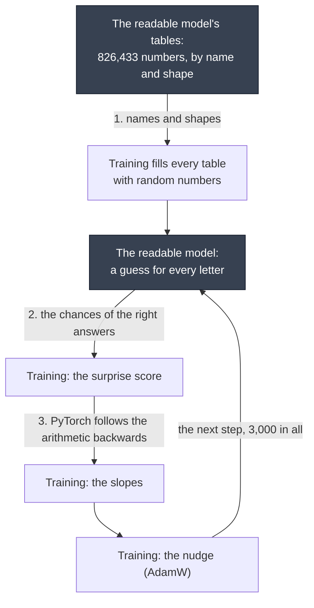
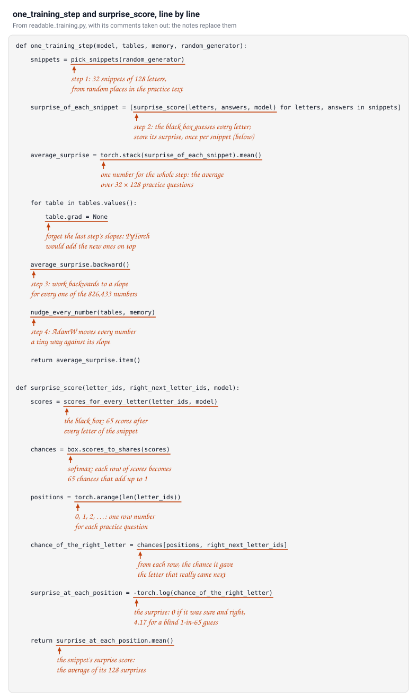
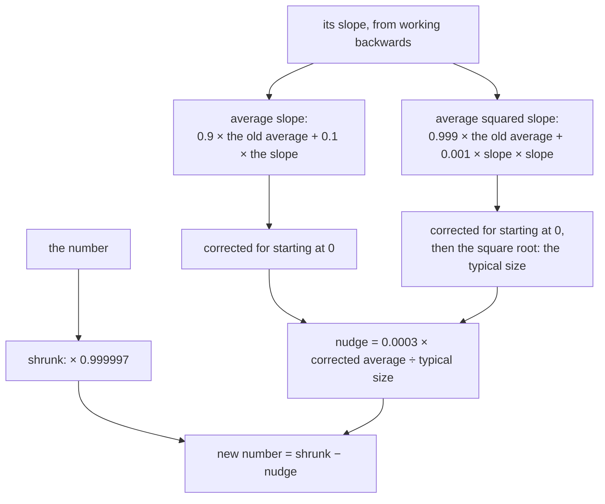
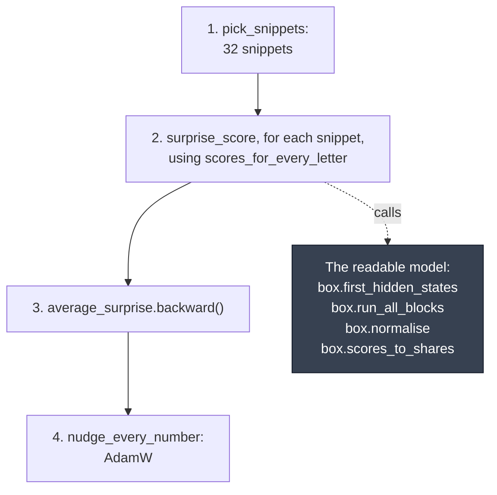

### Why I rewrote the training code

In [MiniGPT, rewritten to be read](/posts/minigpt7/), I rewrote the code that **runs** my trained MiniGPT model, to be as easy for a person to read as I could make it. I call that rewrite **the readable model**. This post does the same for the code that **trains** it, from [MiniGPT (Part 2)](/posts/minigpt-grown/): it starts from 826,433 random numbers and nudges them until the model writes like my exhibit.

This is what training does, in one paragraph and one picture:

Training does not need to understand the model. It takes snippets of real text, and asks the model, for every letter, what comes next. It looks up the chance the model gave the letter that really came next, and turns those chances into one number, the surprise score: small when the model expected the right letters, big when it did not. Then PyTorch works backwards through every calculation the model made, and finds, for each of the 826,433 numbers, which way it should move to make the surprise a little smaller. Every number moves a tiny step that way, and the whole thing repeats, 3,000 times. Nobody tells the model what to learn: the numbers change only because each change made the model a little less surprised by Shakespeare. I can check every step of that, but, as with the readable model, I cannot fully explain why the numbers it ends up with work.


*One training step, with real numbers: the first eight practice questions of the text, and the chance the model gave each right answer, before training and after it.*

So I wrote the training program to use the whole of the readable model as a **black box**. Was that possible? Almost. Training needs exactly three things from the box:

1. **The list of tables, and their shapes**, so that it can fill each one with random numbers to start.
2. **A guess for every letter of a snippet**, not just the last one, because every letter is a free practice question. The readable model's `scores_for_next_letter` keeps only the last row, so this is the one place where the training program calls pieces from inside the box: the same steps, without the `[-1]`.
3. **That every guess is made with ordinary PyTorch arithmetic**, so that PyTorch can work backwards through it to find the slopes. The readable model already is.

A fourth would be needed to train exactly as Part 2 did: **a training mode**, a switch that makes the box use dropout. The readable model has none, for a good reason (see below), so this program trains without dropout.

Here is one training step as a picture. The dark boxes are the readable model; everything else is the training program; and the numbered arrows are the only three connections between them.



Nothing else about the model matters to training: not attention, not the MLP, not how many blocks there are.

The program is [`readable/readable_training.py`](https://github.com/Haddley/minigpt-series/blob/main/readable/readable_training.py) in the series repo, next to the readable model's, with a notebook version saved with its outputs: [open it in Colab](https://colab.research.google.com/github/Haddley/minigpt-series/blob/main/readable/readable_training.ipynb), or [read it on GitHub](https://github.com/Haddley/minigpt-series/blob/main/readable/readable_training.ipynb).

:::watch-it What this does not do
It does not reproduce my exhibit exactly. Part 2 grew the exhibit with **dropout**, which, during training only, sets a tenth of the values passing through the model to 0 at random, as a way to stop it memorising its practice text. The readable model has no dropout, so this program trains without it, from its own random starting numbers. It grows a model with different numbers that scores about as well on the exam: 1.66, against the exhibit's 1.69. It is also slower: 11 minutes on my Mac's processor, one snippet at a time, where Part 2's script takes about 6, 32 snippets at a time. And it still leaves the hardest part, working backwards to the slopes, to PyTorch.
:::

:::no-dumb-questions
**Q: Why does the readable model have no dropout?**

A: Because dropout only does anything during training. While a model learns, dropout sets a random tenth of the values passing through it to 0 on every step, and scales the rest up to make up for them, so that the model can never rely on any one value being there. That makes memorising the practice text harder. Once the model is trained and writing, dropout is switched off: the original code does that with `model.eval()`. The readable model only runs the trained model, so dropout would have been code that never does anything, and I left it out.

**Q: Then why not add it for training?**

A: It would mean giving the box a training mode, and the point of this program is to use the box unchanged. It would also not bring back the exhibit exactly: that would need every random draw made in exactly the same order as the original code, which would tie the readable program to the original's structure.

**Q: Did training without it make things worse?**

A: Not here. Both models I grew without dropout scored slightly better on the exam than the exhibit grown with it (section 12). The small model was not memorising its practice text after 3,000 steps, so dropout had little to prevent. Part 2's bigger model is different: its exam score got worse after step 1,500 while its practice score kept improving, which is exactly what dropout is for.
:::

### The rules I followed

The same rules as in [MiniGPT, rewritten to be read](/posts/minigpt7/): every value gets its own name, every shape is written down, every library call is explained, and where nobody really knows why something works, I say so.

There is one exception, and it is the point of training. The model's numbers must change, step after step, and the model must see the changes. So the nudge in section 8 is the one place in the program that changes numbers in place: it works out the new values under their own name, `shrunk_table - nudge`, and then copies them into the table with `table.copy_(...)`.

### Words I use

Part 2 introduced most of these, in plain words first. Here is each one, with the name experts use in brackets:

| In this post, *and what experts call it* | What it means |
|---|---|
| **snippet** (a sequence; 32 of them make a *batch*) | 128 letters in a row, from a random place in the practice text |
| **practice text, exam text** (*training set*, *validation set*) | the first 90% of the text, which the model learns from, and the last 10%, which it never sees until the exam |
| **surprise score** (*loss*, *cross-entropy*) | the average of −log(chance the model gave the right next letter) |
| **slope** (all the slopes together are the *gradient*) | how much the surprise would rise if one number rose a tiny bit |
| **working backwards** (*backpropagation*) | how PyTorch finds every slope in one go |
| **the nudge rule** (an *optimiser*; here *AdamW*) | how far, and which way, to move each number |
| **step size** (*learning rate*) | roughly the most a number moves on one step: 0.0003 |
| **shrinking** (*weight decay*) | moving every number very slightly towards 0 on every step |
| **dropout** (the same) | during training only, setting some of the values passing through the model to 0 at random; not used here |

### The top level: one training step

Here is the whole of training on one screen. `one_training_step` is what the loop in section 11 runs 3,000 times, and `surprise_score` is the one number that everything is learned from. Everything else in the program is either a setting, a check, or one of the pieces these two call.


*`one_training_step` and `surprise_score`, with each note pointing at the code it explains. Steps 1 to 4 are the same as in section 9's picture.*

### 1. The settings

A person chose all of these. They are Part 2's settings for growing the exhibit.

```python
TRAINING_STEPS = 3000                # how many times every number is nudged
SNIPPETS_PER_STEP = 32               # each step practises on 32 snippets of text...
LETTERS_PER_SNIPPET = 128            # ...each 128 letters long, the most the model can see
SHARE_OF_TEXT_FOR_PRACTICE = 0.9     # the first 90% of the text is for practice; the last 10% is the exam

STARTING_SPREAD = 0.02               # random starting weights are typically this size (as in the original)
STEP_SIZE = 0.0003                   # how far each nudge goes: the "learning rate"

# The nudge rule, AdamW, has four more settings. These are PyTorch's defaults, which the original uses.
SLOPE_MEMORY = 0.9                   # how much of its running average slope a number keeps each step
SQUARED_SLOPE_MEMORY = 0.999         # the same, for its running average of slope × slope
TINY_NUMBER_TO_AVOID_DIVIDING_BY_ZERO = 1e-8
SHRINK_RATE = 0.01                   # every number is also shrunk towards 0 a little: "weight decay"

STARTING_NUMBERS_SEED = 42           # fixing the random choices makes the whole run repeatable
SNIPPET_CHOICE_SEED = 1337
CHECKPOINTS = [0, 100, 300, 1000, 3000]   # the steps at which the program reports how it is doing

# The tables are small, so splitting each calculation between several processor cores costs more time
# than it saves. On my Mac, one core was the fastest: 0.23 seconds a step, against 0.35 with all ten.
torch.set_num_threads(1)
```

### 2. The black box

The program first fetches the readable model program, `readable_minigpt.py`, if it is not already here (in Colab, only this notebook is), and imports it under the name `box`. Importing a Python file runs it, and that program prints a page of examples as it runs, so `contextlib.redirect_stdout` sends its printing into an `io.StringIO`, a piece of memory that nobody reads.

Importing it also loads the trained exhibit model, as `box.model`. Training never uses its numbers, only their names and shapes. The exhibit appears again only in checks and comparisons.

```python
def open_the_black_box():
    """Import the readable model program, without its printing."""
    with contextlib.redirect_stdout(io.StringIO()):
        return importlib.import_module("readable_minigpt")
```

### 3. The text: practice and exam

About 1.1 million letters of Shakespeare's plays, the text the exhibit was trained on. `box.letters_to_ids` turns it into one long list of letter IDs, and `torch.tensor` makes that list a table of numbers.

The first 90% is for practice. The last 10% is kept back as an **exam**: the model never practises on it, so its score on the exam shows whether it has learned something general, rather than memorised its practice text.

```python
TEXT_URL = "https://raw.githubusercontent.com/karpathy/char-rnn/master/data/tinyshakespeare/input.txt"
TEXT_FILE = Path("tiny_shakespeare.txt")
if not TEXT_FILE.exists():
    urllib.request.urlretrieve(TEXT_URL, TEXT_FILE)

all_text = TEXT_FILE.read_text(encoding="utf-8")
all_letter_ids = torch.tensor(box.letters_to_ids(all_text))          # [1,115,394]
end_of_practice = int(SHARE_OF_TEXT_FOR_PRACTICE * len(all_letter_ids))
practice_ids = all_letter_ids[:end_of_practice]                       # [1,003,854]
exam_ids = all_letter_ids[end_of_practice:]                           # [111,540]

print(f"letters of text: {len(all_letter_ids):,}  practice: {len(practice_ids):,}  exam: {len(exam_ids):,}")
print("it begins:", repr(all_text[:60]))
```

```
letters of text: 1,115,394  practice: 1,003,854  exam: 111,540
it begins: 'First Citizen:\nBefore we proceed any further, hear me speak.'
```

### 4. Random starting numbers

The new model has the same tables as the exhibit, with the same names and shapes; only the numbers are new. Each table starts in one of three ways, as in the original code:

- **stretches** (the normalising steps' `ln...weight` tables) start at 1, and **shifts and biases** start at 0. Those values change nothing: they let the normalising and the weights do their plain job.
- **weights and embeddings** start as small random numbers. `torch.randn` draws numbers from the bell curve, with an average of 0 and a typical size of 1; multiplying by 0.02 makes their typical size 0.02.

```python
def starting_numbers(table_name: str, shape: torch.Size, random_generator: torch.Generator) -> torch.Tensor:
    if "ln" in table_name and table_name.endswith(".weight"):   # a stretch
        return torch.ones(shape)
    if table_name.endswith(".bias"):                            # a shift or a bias
        return torch.zeros(shape)
    return torch.randn(shape, generator=random_generator) * STARTING_SPREAD   # a weight or an embedding
```

`requires_grad_(True)` asks PyTorch to record every calculation each table takes part in from now on, so that it can work out its slopes later. `box.name_the_stored_tables` then gives the tables the readable model's descriptive names. It does not copy them: the model and the dictionary of tables hold the very same tables, so nudging one nudges the other.

```
numbers to grow: 826,433
saved the grown numbers to grown.pt
```

### 5. Guesses for every letter

```python
def scores_for_every_letter(letter_ids: torch.Tensor, model) -> torch.Tensor:
    """[n] IDs -> [n, 65]: the model's scores for what comes after each letter, not only the last."""
    starting_hidden_states = box.first_hidden_states(letter_ids, model)               # [n, 128]
    hidden_states_after_each_block = box.run_all_blocks(starting_hidden_states, model)
    final_hidden_states = box.normalise(hidden_states_after_each_block[-1], model.final_stretch, model.final_shift)
    return final_hidden_states @ model.next_letter_rows.T + model.next_letter_biases   # [n, 65]
```

This is the one function that reaches inside the box. It is the readable model's `scores_for_next_letter` without the `[-1]`: it keeps the scores for every position, because training uses every one of them. A check that I did not change anything: on the trained exhibit, its last row matches the readable model's answer for `goo`, to within rounding.

```
biggest difference from the readable model's scores for the letter after 'goo': 9.5e-07
```

### 6. The surprise score

```python
def surprise_score(letter_ids: torch.Tensor, right_next_letter_ids: torch.Tensor, model) -> torch.Tensor:
    """[n] IDs and their [n] right answers -> one number: the average surprise."""
    scores = scores_for_every_letter(letter_ids, model)                       # [n, 65]
    chances = box.scores_to_shares(scores)                                    # [n, 65], each row adds up to 1
    positions = torch.arange(len(letter_ids))                                 # [n]: 0, 1, 2, ...
    chance_of_the_right_letter = chances[positions, right_next_letter_ids]    # [n]
    surprise_at_each_position = -torch.log(chance_of_the_right_letter)        # [n]
    return surprise_at_each_position.mean()
```

For each practice question, I look up the chance the model gave the right answer. A chance of 1 means no surprise at all, a surprise of 0. The smaller the chance, the bigger the surprise: `-torch.log(chance)` gives 0 for a chance of 1, 4.17 for a chance of 1 in 65, and 13.8 for 1 in a million. The surprise score of a snippet is the average of its 128 surprises.

`chances[positions, right_letter_ids]` picks one number from each row: from row 0, the chance at the column of the first right answer; from row 1, the chance at the column of the second; and so on.

Before training, the model is a little worse than a blind guess; the exhibit is far better. PyTorch has this whole calculation as one call, `cross_entropy`, and it agrees:

```
a blind guess (1 in 65) would score:  4.17
the random new model scores:          4.23
the trained exhibit scores:           1.19
PyTorch's cross_entropy for the exhibit: 1.19
exam score of the random new model: 4.21
exam score of the trained exhibit:  1.69
```

### 7. The slopes: working backwards

For each of the 826,433 numbers, training needs its **slope**: if this one number went up a tiny bit, would the surprise score go up or down, and by how much?

`surprise.backward()` works out all of them in one go. While the model made its guesses, PyTorch recorded every calculation that involved a table marked with `requires_grad`. `backward` goes through that record in reverse, from the surprise score back to every table, using the chain rule from calculus at each step. It puts the answers in each table's `.grad`: a table of slopes, the same shape as the table itself.

This is the second black box in this program, and the one I find hardest to follow by intuition. [Part 2](/posts/minigpt-grown/#how-does-it-know-which-way-to-nudge) opens it up with real numbers. Here, rather than trust it, I tested it: I nudged one number by hand, measured how much the surprise really changed, and compared that with what its slope predicted.

```python
next_letter_biases = model_being_grown.next_letter_biases   # [65]; I test one of them: the bias for " "
space = box.LETTER_TO_ID[" "]                                  # the space, the commonest letter in the text

surprise_before = surprise_score(first_snippet, its_answers, model_being_grown)
surprise_before.backward()                                     # work out every slope
slope_of_the_space_bias = next_letter_biases.grad[space].item()

tiny_nudge = 0.001
with torch.no_grad():                                          # no_grad: do not record this calculation
    nudged_biases = next_letter_biases.clone()
    nudged_biases[space] = nudged_biases[space] + tiny_nudge
    nudged_model = box.name_the_stored_tables({**tables_being_grown, "lm_head.bias": nudged_biases})
    surprise_after = surprise_score(first_snippet, its_answers, nudged_model)

print(f"the slope predicts a change of:  {slope_of_the_space_bias * tiny_nudge:+.7f}")
print(f"nudging by hand changes it by:   {(surprise_after - surprise_before).item():+.7f}")
for table in tables_being_grown.values():
    table.grad = None                                          # tidy up: this was only a test
```

```
the slope predicts a change of:  -0.0001068
nudging by hand changes it by:   -0.0001068
```

They agree. A slope only describes a *tiny* nudge, because the surprise does not change in a straight line, and that is why training takes thousands of small steps rather than one big one.

:::watch-it Two easy-to-miss details
PyTorch **adds** each new slope to whatever is already in `.grad`, so the slopes must be cleared, by setting `.grad` to `None`, before every step. That is a hidden `x = x + ...` inside PyTorch. And `backward` only works because every step inside the box is ordinary PyTorch arithmetic: that is the third thing training needs from the box.
:::

### 8. The nudge: AdamW, written out

The simplest rule would be to move every number a little way downhill, against its slope. Part 2's notebook uses a cleverer rule, **AdamW**, which PyTorch provides as one call, `torch.optim.AdamW`. Here it is written out. For every number, it keeps two running averages from step to step:

- the **average slope**: which way the number has been pushed lately. This smooths out the noise, because each step sees only 32 snippets.
- the **average squared slope**: how big its pushes have been lately, whichever way.

```python
class NudgeMemory:
    """AdamW's running averages: one table of each, the same shape as every model table."""

    def __init__(self, tables: dict):
        self.steps_taken = 0
        self.average_slope = {name: torch.zeros_like(table) for name, table in tables.items()}
        self.average_squared_slope = {name: torch.zeros_like(table) for name, table in tables.items()}
```

```python
def nudge_every_number(tables: dict, memory: NudgeMemory) -> None:
    """One AdamW step: move every number a little, against its slope. Changes the tables in place."""
    memory.steps_taken = memory.steps_taken + 1
    early_correction_for_slope = 1 - SLOPE_MEMORY ** memory.steps_taken
    early_correction_for_squared_slope = 1 - SQUARED_SLOPE_MEMORY ** memory.steps_taken
    with torch.no_grad():
        for name, table in tables.items():
            slope = table.grad
            new_average_slope = SLOPE_MEMORY * memory.average_slope[name] + (1 - SLOPE_MEMORY) * slope
            new_average_squared_slope = (SQUARED_SLOPE_MEMORY * memory.average_squared_slope[name]
                                         + (1 - SQUARED_SLOPE_MEMORY) * slope * slope)
            memory.average_slope[name] = new_average_slope
            memory.average_squared_slope[name] = new_average_squared_slope

            corrected_average_slope = new_average_slope / early_correction_for_slope
            corrected_average_squared_slope = new_average_squared_slope / early_correction_for_squared_slope
            typical_slope_size = torch.sqrt(corrected_average_squared_slope) + TINY_NUMBER_TO_AVOID_DIVIDING_BY_ZERO

            shrunk_table = table * (1 - STEP_SIZE * SHRINK_RATE)                      # weight decay
            nudge = STEP_SIZE * corrected_average_slope / typical_slope_size          # at most about STEP_SIZE
            table.copy_(shrunk_table - nudge)                                         # the one in-place change
```

Here is the same rule for one number, on one step:



The nudge is the average slope divided by the typical size of the pushes. So a number whose slopes keep pointing the same way moves about the step size, 0.0003, whether those slopes are big or small; a number whose slopes keep changing direction moves less. Every number is also shrunk very slightly towards 0: the "W" in AdamW, weight decay. Both averages start at 0, which makes them too small in the first few steps; dividing by `1 - memory ** steps_taken` corrects that, and matters less and less as the steps go on.

`with torch.no_grad()` tells PyTorch not to record the nudge: it is not part of the model's arithmetic. `table.copy_(new_values)` writes the new values into the existing table, so that the model, which holds that very table, sees them.

:::watch-it What we do not know
Why does AdamW train transformers so much better than the simple rule? There are several explanations, and they disagree. One study points to rare, very large random swings in the slopes of attention models ([Zhang and others, 2020](https://arxiv.org/abs/1912.03194)). Another finds that those swings are not the main reason, and points instead to how much AdamW behaves like moving every number by just the *sign* of its slope ([Kunstner and others, 2023](https://arxiv.org/abs/2304.13960)). The step size of 0.0003 was not derived from anything either: it is a value that works. I use AdamW because it works, as the original does.
:::

### 9. One step, and the exam

```python
def pick_snippets(random_generator: torch.Generator) -> list:
    """32 random snippets of practice text, each with its answers: the same text, one letter on."""
    last_possible_start = len(practice_ids) - LETTERS_PER_SNIPPET - 1
    starts = torch.randint(last_possible_start, (SNIPPETS_PER_STEP,), generator=random_generator)
    return [(practice_ids[start:start + LETTERS_PER_SNIPPET], practice_ids[start + 1:start + LETTERS_PER_SNIPPET + 1])
            for start in starts.tolist()]
```

```python
def one_training_step(model, tables: dict, memory: NudgeMemory, random_generator: torch.Generator) -> float:
    snippets = pick_snippets(random_generator)
    surprise_of_each_snippet = [surprise_score(letters, answers, model) for letters, answers in snippets]
    average_surprise = torch.stack(surprise_of_each_snippet).mean()
    for table in tables.values():
        table.grad = None                    # forget the last step's slopes
    average_surprise.backward()              # find this step's slopes
    nudge_every_number(tables, memory)       # and nudge
    return average_surprise.item()
```

Here is one step, in order. The dark box lists the readable model's own functions that it calls: training uses only these four, and never opens the rest.



One step picks 32 snippets at random places in the practice text, works out the average surprise over all 32 × 128 practice questions, clears the old slopes, finds the new ones, and nudges every number. `torch.randint` picks the 32 starting places, and `torch.stack` turns the 32 surprise scores into one table, so that `.mean()` can average them.

```python
def exam_score(model) -> float:
    surprise_of_each_snippet = []
    with torch.no_grad():
        for start in range(0, len(exam_ids) - LETTERS_PER_SNIPPET - 1, LETTERS_PER_SNIPPET):
            letters = exam_ids[start:start + LETTERS_PER_SNIPPET]
            answers = exam_ids[start + 1:start + LETTERS_PER_SNIPPET + 1]
            surprise_of_each_snippet.append(surprise_score(letters, answers, model).item())
    return sum(surprise_of_each_snippet) / len(surprise_of_each_snippet)
```

The exam goes through the whole exam text in snippets of 128 letters, one after another, and averages the surprise. `torch.no_grad()` again: the exam must not teach the model anything.

```
exam score of the random new model: 4.21
exam score of the trained exhibit:  1.69
```

### 10. Checking against the original

Before the long run, I checked that the readable training does the same arithmetic as Part 2's. The program builds the original notebook's model with the same random starting numbers, and trains a copy of each for three steps on the same snippets: the original with `torch.optim.AdamW`, mine with the code above. Then it compares all 826,433 numbers. To compare like with like, the check switches the original's dropout off.

```
after 3 steps, biggest difference in any of the 826,433 numbers: 5.2e-06
numbers that differ by more than 0.00001: 0
```

The differences are rounding: the two programs do the same arithmetic in a slightly different order.

### 11. Growing it

Here is the run itself: a report for the checkpoints, then a short loop, because every piece of it has a name:

```python
d = box.LETTER_TO_ID["d"]


def report(step: int, seconds: float) -> None:
    with torch.no_grad():
        chances = box.chances_from_scores(box.scores_for_next_letter("goo", model_being_grown),
                                          temperature=1.0, keep_biggest=65)
        g_row = model_being_grown.token_embedding_table[box.LETTER_TO_ID["g"], :4].tolist()
        writing = box.write("ROMEO:", 150, model_being_grown, temperature=0.8, seed=5)
    print(f"--- step {step:,} ({seconds / 60:.1f} minutes): exam score {exam_score(model_being_grown):.2f}; "
          f"'g' begins {', '.join(f'{v:.3f}' for v in g_row)}; chance of 'd' after 'goo' {chances[d].item():.1%}")
    print(writing, "\n", flush=True)


nudge_memory = NudgeMemory(tables_being_grown)
snippet_generator = torch.Generator().manual_seed(SNIPPET_CHOICE_SEED)
started = time.time()
for step in range(TRAINING_STEPS + 1):
    if step in CHECKPOINTS or step == TRAINING_STEPS:
        report(step, time.time() - started)
    if step == TRAINING_STEPS:
        break
    one_training_step(model_being_grown, tables_being_grown, nudge_memory, snippet_generator)

torch.save({name: table.detach() for name, table in tables_being_grown.items()}, "grown.pt")
print("saved the grown numbers to grown.pt")
```

Five times along the way, the program reports the exam score, the start of the `g` token embedding, the chance of `d` after `goo`, and 150 letters written from `ROMEO:` by the readable model's own `write`:

| Training step | Exam score | The `g` token embedding begins | Chance of `d` after `goo` |
|---|---|---|---|
| 0, all random | 4.21 | −0.021, −0.003, 0.023, 0.012, … | 1.4% |
| 100 | 2.62 | −0.019, −0.012, 0.021, 0.021, … | 3.3% |
| 300 | 2.39 | −0.022, −0.016, 0.023, 0.027, … | 4.5% |
| 1,000 | 1.97 | −0.030, −0.025, 0.033, 0.039, … | 25.6% |
| 3,000, finished | 1.66 | −0.034, −0.040, 0.042, 0.036, … | 32.4% |

What it writes from `ROMEO:`, at each checkpoint:

After no steps:

```
ROMEO:o-uou-;k!zcV'djayd&veE!ky,WgFJ;D$Snly$PyWK$irstZqJuQODkfo?By?AJK:sWip?qDPrxwjxHRHPPjp3CKWF;MDU-KHPsoJ$:-QE3ZWNHv Tgq$NuacEoGCwaR3M-:OY,zp!mB'xFGZmVJVC
```

After 100 steps:

```
ROMEO: atit co yel soryN wil tt nole f mouu myan touthomthe thihXr d hathit t itrths mbe:
TThef chan hedoug achaelin't mit lsen te win id ke yo tacuinere?
```

After 300 steps:

```
ROMEO: butie tey pasthus wim trarim,
Achent ly hatout thond thig we he, nougre, wout mecher eche ime he.
Th aghe pleat mer hore thethe hakar y,
Thawbeat he
```

After 1,000 steps:

```
ROMEO:
As wart you quest will young chansts it have.
```

After 3,000 steps:

```
ROMEO:
As yet away to your farrence be nothing hath.
```

### 12. The grown model and the exhibit

```
exam score, grown here:       1.66
exam score, the exhibit:      1.69

grown here:
ROMEO:
Then the heart me, of my lovel. We grates your man
Sommiss of the liebout of this list this more!

First Consirst of the my quakes of this been queen:
Yet death some for him your time by and girl.

WA

the exhibit:
ROMEO:
Then this of hearts fear of Contic it thy slaught?

PEY:
Come, what I will one that that that be nother,
As then, my see own banish, thou banish'd risgue,
And have for a horsure as in by all death.
Wh
```

The grown model is an ordinary readable model, so every function in the readable model works on it. On the exam as a whole, it does as well as the exhibit, slightly better in fact, perhaps because it had no dropout. Its numbers, though, are completely different: it started from different random numbers, practised on different snippets, and had no dropout. Table by table, its weights and the exhibit's have a correlation of about 0.002, which is to say none.

And on a single question, the two can disagree a lot. The exhibit gives `d` after `goo` a 96.6% chance; the grown model gives it 32.4%, with `m` and `k` close behind. The text itself is clear: in Tiny Shakespeare, `goo` is followed by `d` 618 times out of 626.

To see whether that was a fluke, I grew a second model with the same program, changing only `STARTING_NUMBERS_SEED` from 42 to 7:

| Model | Exam score | Chance of `d` after `goo` |
|---|---|---|
| Part 2's exhibit, grown with dropout | 1.69 | 96.6% |
| grown here, from random start 42 | 1.66 | 32.4% |
| grown here, from random start 7 | 1.64 | 80.1% |

The three exam scores are within 0.05 of each other, and the three answers to one question range from 32% to 97%. The two models grown here share nothing either: their weights have correlations between −0.02 and 0.03. An average over 111,540 exam questions can hide big differences on single ones. I do not know why each model ends up as sure or unsure as it does about `goo`, and I would not trust any story I made up to explain it.

:::test-drive Grow your own
1. [Open the notebook in Colab](https://colab.research.google.com/github/Haddley/minigpt-series/blob/main/readable/readable_training.ipynb), and choose **Runtime › Run all**.
2. Read the cells while it runs. Section 10's check should show a biggest difference far below 0.0001.
3. For a quicker look, set `TRAINING_STEPS = 1000` in section 1. Its writing will be rougher, and its exam score should be near the step 1,000 row of the table above.
4. Change `STARTING_NUMBERS_SEED`, and grow a different model. Its numbers will be completely different from mine, and its exam score should be close: with 7, I got 1.64. Then look at its chance of `d` after `goo`, which may not be close at all.
:::

### What I learned from rewriting it

:::bullet-points What the rewrite showed me
- **Training really does not need to understand the model.** It needs the shapes of the tables, a guess for every letter, and arithmetic that PyTorch can follow backwards. Everything that makes the model a GPT is inside a box that training barely opens.
- **The surprise score is one line of arithmetic.** `-log(chance of the right letter)`, averaged. Everything the model learns, it learns from that one number.
- **The nudge rule is two running averages and a division.** AdamW sounds advanced, but written out it is a dozen named lines, and it matches PyTorch's own to within rounding.
- **The part I cannot rewrite readably is `backward`.** It works, and I tested it by hand, but it is a second black box: PyTorch's record of every calculation, played in reverse.
- **Different numbers, the same exam score.** Three models, with numbers that have nothing in common, score within 0.05 of each other. Whatever the model has learned, it is not stored in any one particular set of numbers, which is one more reason that reading meaning into single numbers is hard.
- **An average hides a lot.** Almost the same exam score, and yet 96.6%, 32.4% and 80.1% on `goo`. One score cannot tell you everything a model has learned, or failed to learn.
:::

### References

- [MiniGPT, rewritten to be read](/posts/minigpt7/): the black box this program uses.
- [MiniGPT (Part 2)](/posts/minigpt-grown/): growing the exhibit, and how the slopes are found.
- Jibin Joseph, [MiniGPT: Rebuilding GPT from First Principles](https://arxiv.org/abs/2605.17398), and [its notebook](https://github.com/jibin10/MiniGPT).
- Rumelhart, Hinton and Williams, [Learning representations by back-propagating errors](https://www.nature.com/articles/323533a0), *Nature*, 1986.
- Kingma and Ba, [Adam: A Method for Stochastic Optimization](https://arxiv.org/abs/1412.6980), 2014.
- Loshchilov and Hutter, [Decoupled Weight Decay Regularization](https://arxiv.org/abs/1711.05101) (AdamW), 2017.
- Zhang and others, [Why are Adaptive Methods Good for Attention Models?](https://arxiv.org/abs/1912.03194), NeurIPS 2020.
- Kunstner and others, [Noise Is Not the Main Factor Behind the Gap Between SGD and Adam on Transformers, but Sign Descent Might Be](https://arxiv.org/abs/2304.13960), ICLR 2023.
- Andrej Karpathy, [Tiny Shakespeare](https://github.com/karpathy/char-rnn/tree/master/data/tinyshakespeare), the text the model learns from.
