Power FX is Microsoft's low-code formula language for the Power Platform. It uses Excel-like syntax to create expressions, custom business logic, and automation across Power Apps, Power Automate, and other Microsoft products. I used Power FX to add a Clone button to my model driven app's command bar.

## Clone a Record

I used Power FX to add a Clone button to my Project Model Driven App's Main Form Command Bar.

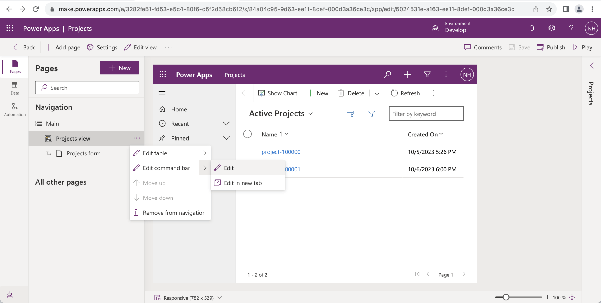
*I selected Projects view and selected the "Edit command bar" menu item*

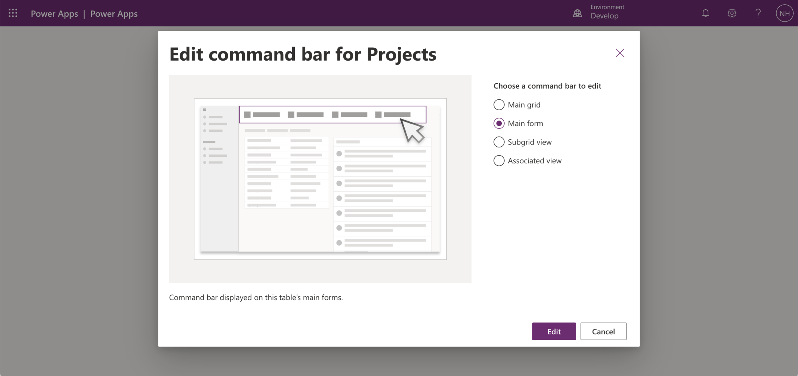
*I selected the Main form command bar*

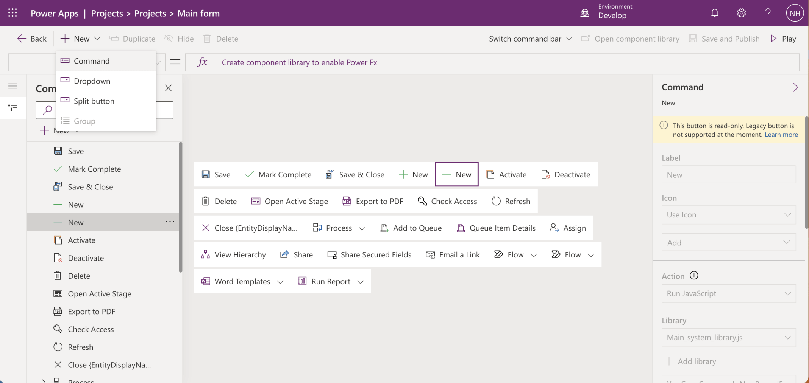
*I added a new command*

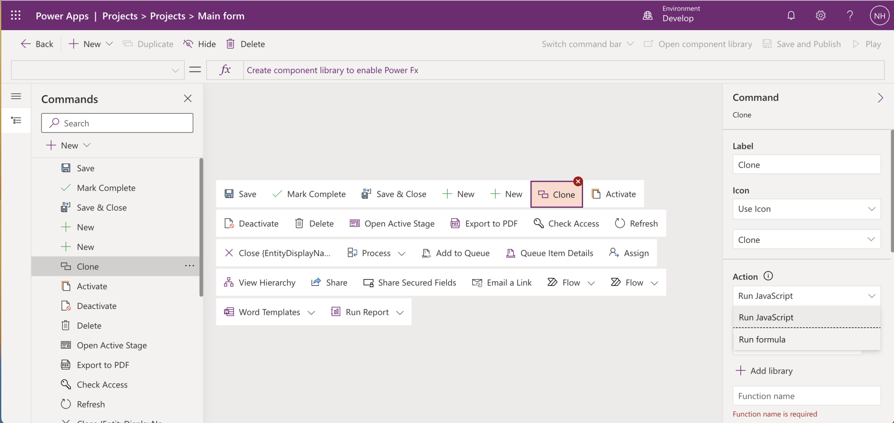
*I named the command Clone, selected the Clone Icon and selected the Run formula action*

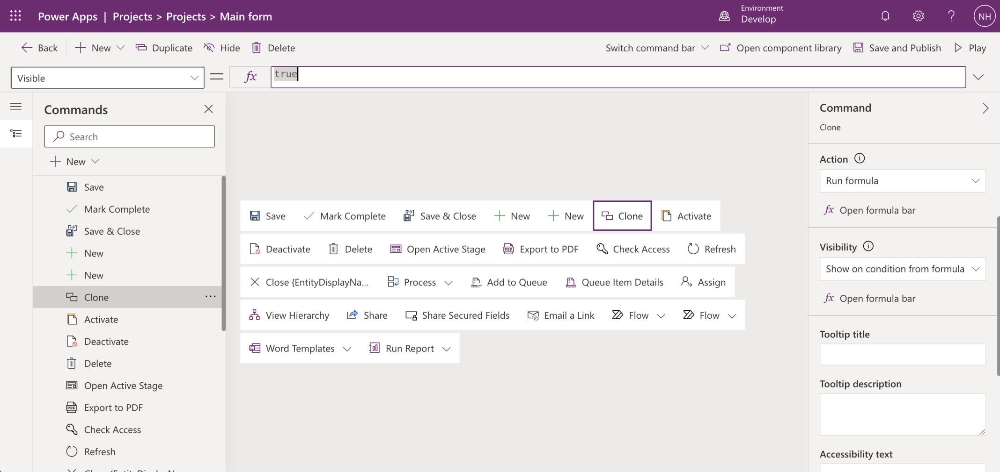
*I selected the Show on condition from formula visibility option*

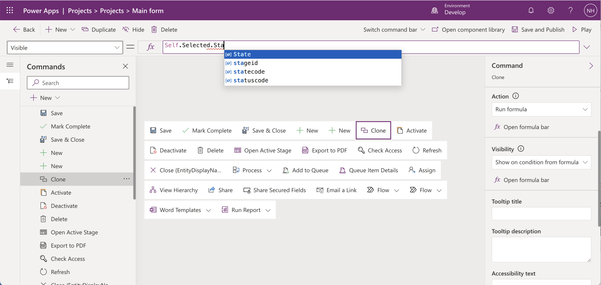
*I only wanted the Clone command to be visible when the State...*

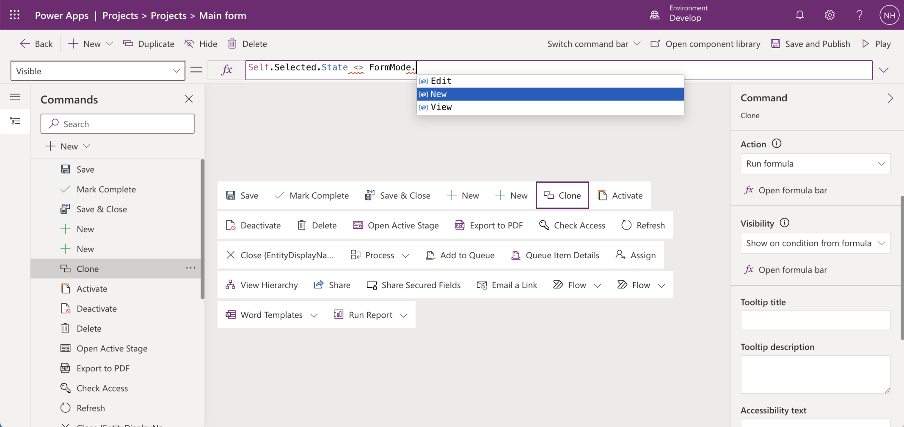
*... was not FormMode.New*

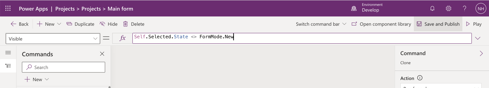
*I clicked the Save and Publish button*

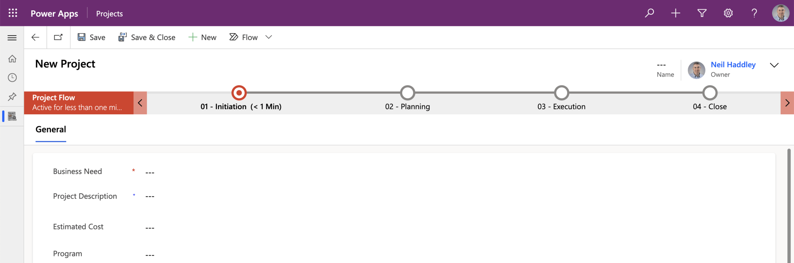
*The Clone command didn't appear when I was creating a new record*

*The Clone command appeared when I was viewing an existing record*

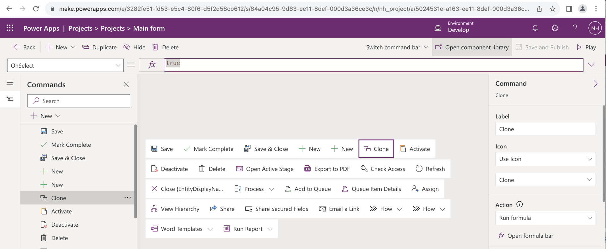
*I updated the Run formula action*

## Power FX

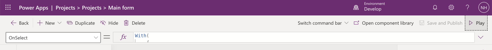
*I clicked the Save and Publish button and the Play button*

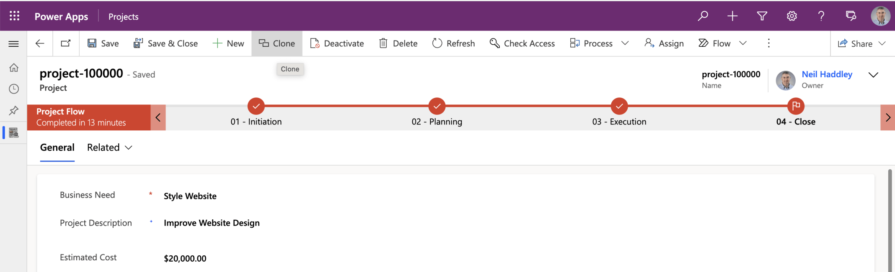
*I opened an existing record and clicked the Clone button*

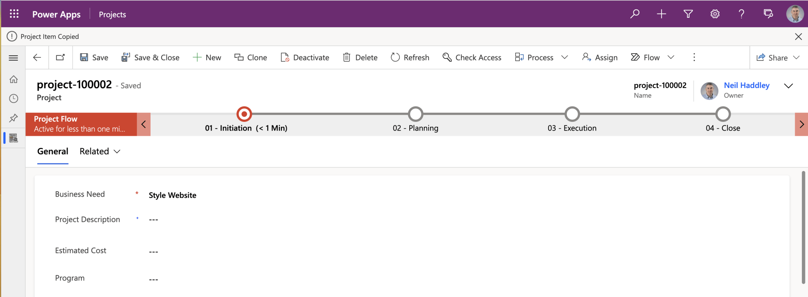
*The Power FX formula created a new record using the original record's Business Need value, navigated me to the new record, and displayed a "Project Item Copied" message*

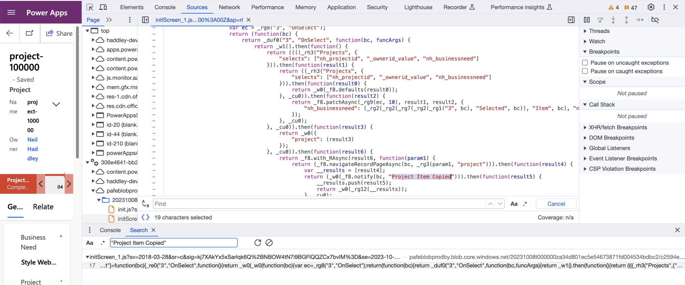
*The browser's developer tools shows the JavaScript generated from the Power FX formula*