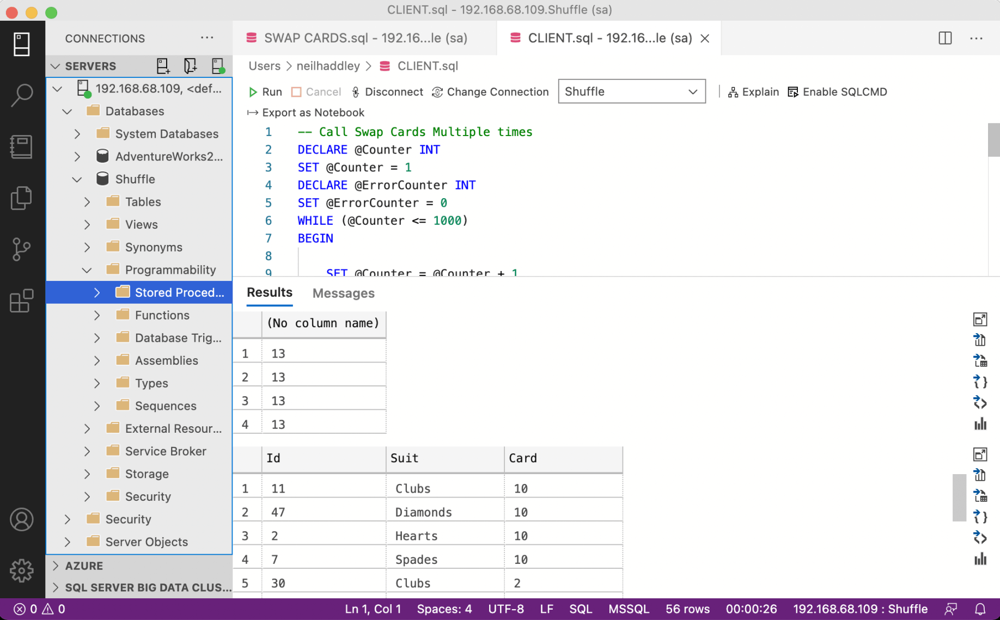
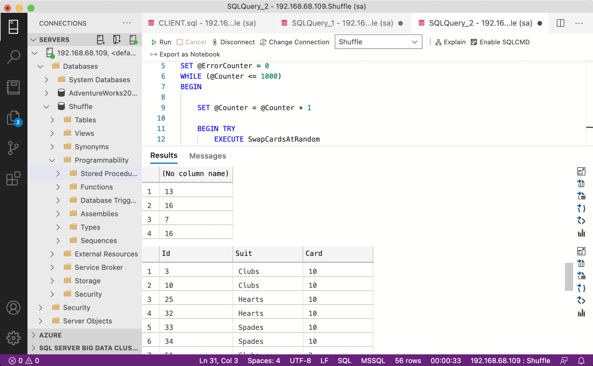
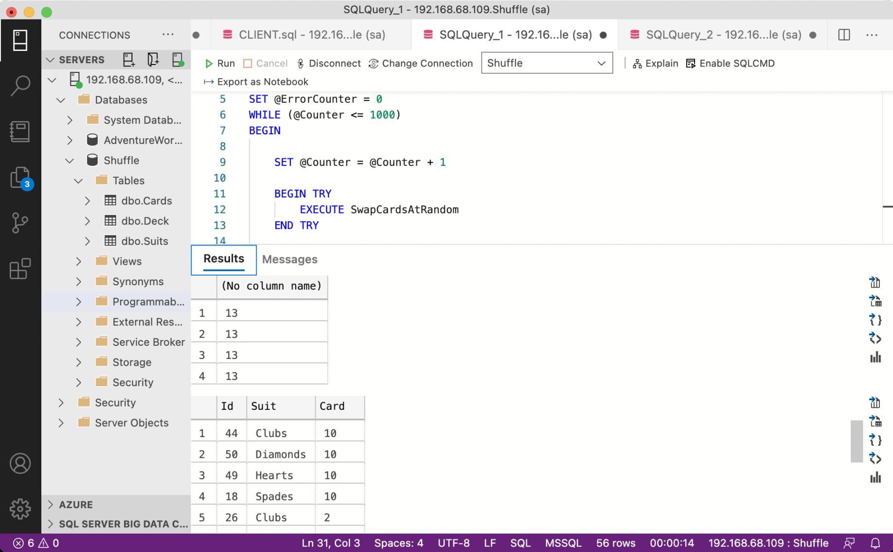
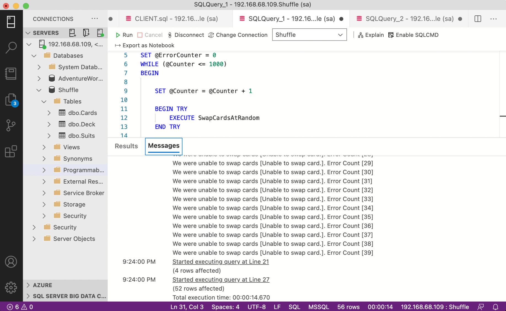

## Stored procedures

I used Transact SQL (T-SQL) to create Microsoft SQL Server Stored Procedures. Stored procedures are maintained in the database, making it easier to apply performance improvements that benefit all client applications. I wrote the swap procedure with isolation levels in mind, since concurrent access to shared data can cause transactions to interfere with each other.


## Shuffling cards

I used a stored procedure to shuffle the contents of a table representing a deck of playing cards.


## Swap cards

To shuffle the deck, I selected two cards at random and swapped their positions. Repeating this enough times produces a shuffled deck. I wrote a stored procedure to swap the data in two rows of the deck table.


## Pick two cards, swap and repeat

To test SwapCards, I created:

- a **PickACard** function that selects a card from the deck at random
- a **SwapCardsAtRandom** stored procedure that uses PickACard (twice) and SwapCards to swap a random pair of cards
- **client code** that calls SwapCardsAtRandom 1,000 times


## With a single client

Running a single copy of the client code calling SwapCardV1 worked correctly. I ended up with a shuffled deck containing 13 cards of each suit.


*Shuffle results single client*


## Concurrency issues

However, running multiple copies of the client code revealed a concurrency issue with SwapCardV1.


*Shuffle failure*


## Snapshot issolation

With concurrency introduced, the original SwapCards stored procedure failed silently — no errors were raised but transactions were stepping on each other. I used Snapshot isolation to fix the issue.


## Multiple clients

With the updated SwapCards stored procedure, I was able to run multiple updates concurrently.


*Shuffle success*


## Catching the errors

Snapshot isolation guarantees that reads in a transaction see a consistent snapshot and that the transaction only commits if no conflicting concurrent update occurred. With snapshot isolation enabled, there is a chance that a commit will fail and raise an error — which is the desired behaviour. In the code above, if SwapCards threw an error the client caught it, printed a message, and continued. I considered having the client retry the swap instead.


*Concurrency exceptions (that the client code needs to handle)*


## .NET Core console app

**$ dotnet run**

I wrote C# code to call the SwapCards stored procedure 1,000 times.


## Node console app

**$ node index.js**

I wrote JavaScript code to call the SwapCards stored procedure 1,000 times using the `mssql` node module.


## Java console app

**$ javac Program.java**

then

**$ java -cp ".:/Users/neilhaddley/sqljdbc_9.2/enu/mssql-jdbc-9.2.1.jre11.jar" Program**

or

**$ export CLASSPATH=.:/Users/neilhaddley/sqljdbc_9.2/enu/mssql-jdbc-9.2.1.jre11.jar**

**$ java Program**

I wrote Java code to call the SwapCards stored procedure 1,000 times.


## Using cross join to create a table the represents ...

```sql
-- Create the Deck
CREATE TABLE Cards
(
    Card CHAR(5) PRIMARY KEY
)
GO

INSERT INTO Cards
VALUES
    ('Ace'),
    ('2'),
    ('3'),
    ('4'),
    ('5'),
    ('6'),
    ('7'),
    ('8'),
    ('9'),
    ('10'),
    ('Jack'),
    ('Queen'),
    ('King')
GO

CREATE TABLE Suits
(
    Suit CHAR(8) PRIMARY KEY
)
GO

INSERT INTO Suits
VALUES
    ('Clubs'),
    ('Diamonds'),
    ('Hearts'),
    ('Spades')
GO

SELECT Id = IDENTITY(INT, 1, 1),
    Suits.Suit,
    Cards.Card
INTO Deck
FROM Cards
CROSS JOIN Suits
GO

ALTER TABLE Deck ADD CONSTRAINT Deck_PK PRIMARY KEY (Id)
GO
```

## SwapCardsV1

```sql
-- Stored Procedure 'SwapCardsV1'
CREATE PROCEDURE SwapCardsV1
    @Card1 INT = 1,
    @Card2 INT = 52
AS
BEGIN
    
    BEGIN TRY
		BEGIN TRANSACTION

		SET NOCOUNT ON

		-- Store the first card's details
		SELECT *
        INTO #Temp
        FROM Deck
        WHERE Id = @Card1

		-- Move second card into first card's place
		UPDATE Deck
		SET Card = CardDetails.Card,
			Suit = CardDetails.Suit
		FROM (
			SELECT d.Card,
            d.Suit
        FROM Deck d
        WHERE Id = @Card2
			) CardDetails
		WHERE Id = @Card1

		-- Move first card into second card's place
		UPDATE Deck
		SET Card = CardDetails.Card,
			Suit = CardDetails.Suit
		FROM (
			SELECT Card,
            Suit
        FROM #temp
			) CardDetails
		WHERE Id = @Card2

		COMMIT TRANSACTION;
	END TRY

	BEGIN CATCH
		-- PRINT 'We were unable to make the swap rolling back [' + ERROR_MESSAGE() + '].';
		ROLLBACK TRANSACTION;
        THROW 51000, 'Unable to swap card.', 1; 
	END CATCH
END
GO
```

## SwapCards T-SQL Client Code

```sql
-- User Defined Function 'PickACard'
CREATE FUNCTION PickACard (@RAND FLOAT)
RETURNS INT
AS
BEGIN
    RETURN (
			SELECT FLOOR(@RAND * (52 - 1 + 1)) + 1
			)
END
GO

-- Stored Procedure 'SwapCardsAtRandom'
CREATE PROCEDURE SwapCardsAtRandom
AS
BEGIN
    DECLARE @Rnd1 FLOAT

    SET @Rnd1 = RAND()

    DECLARE @Card1 INT

    SET @Card1 = (
			SELECT dbo.PickACard(@Rnd1)
			)

    DECLARE @Rnd2 FLOAT

    SET @Rnd2 = RAND()

    DECLARE @Card2 INT

    SET @Card2 = (
			SELECT dbo.PickACard(@Rnd2)
			)

    -- 'No need to swap a card with itself'
    IF @Card1 != @Card2
	BEGIN
        EXECUTE dbo.SwapCardsV1 @Card1,
			@Card2
    END -- IF @Card1 != @Card2
END -- CREATE PROCEDURE SwapCards
GO

-- Call Swap Cards Multiple times
DECLARE @Counter INT
SET @Counter = 0
DECLARE @ErrorCounter INT
SET @ErrorCounter = 0
WHILE (@Counter < 1000)
BEGIN

    BEGIN TRY
		EXECUTE SwapCardsAtRandom
	END TRY

	BEGIN CATCH
		SET @ErrorCounter = @ErrorCounter+1
        PRINT 'We were unable to swap cards [' + ERROR_MESSAGE() +']. Error Count ['+LTRIM(STR(@ErrorCounter,10))+']'  
	END CATCH
    
    SET @Counter = @Counter + 1
END
GO

-- Review results
SELECT COUNT(*)
FROM Deck
GROUP BY Suit
GO

SELECT *
FROM Deck
ORDER BY Card,Suit
GO
```

## SwapCards with snapshot isolation

```sql
-- Stored Procedure 'SwapCards'
CREATE PROCEDURE SwapCards
    @Card1 INT = 1,
    @Card2 INT = 52
AS
BEGIN
    SET TRANSACTION ISOLATION LEVEL SNAPSHOT;

    BEGIN TRY
		BEGIN TRANSACTION

		SET NOCOUNT ON

		-- Store the first card's details
		SELECT *
        INTO #Temp
        FROM Deck
        WHERE Id = @Card1

		-- Move second card into first card's place
		UPDATE Deck
		SET Card = CardDetails.Card,
			Suit = CardDetails.Suit
		FROM (
			SELECT d.Card,
            d.Suit
        FROM Deck d
        WHERE Id = @Card2
			) CardDetails
		WHERE Id = @Card1

		-- Move first card into second card's place
		UPDATE Deck
		SET Card = CardDetails.Card,
			Suit = CardDetails.Suit
		FROM (
			SELECT Card,
            Suit
        FROM #temp
			) CardDetails
		WHERE Id = @Card2

		COMMIT TRANSACTION;
	END TRY

	BEGIN CATCH
		-- PRINT 'We were unable to make the swap rolling back [' + ERROR_MESSAGE() + '].';
		ROLLBACK TRANSACTION;
        THROW 51000, 'Unable to swap card.', 1; 
	END CATCH
END
GO
```

## Program.cs

```text
using System;
using System.Data.SqlClient;
using System.Data;

namespace dotnet_sql {
  class Program {
    static void Main(string[] args) {
      var cs = @ "User ID=sa;Password=Passw0rd123;Initial Catalog=Shuffle;Server=192.168.68.109;";

      using var con = new SqlConnection(cs);
      con.Open();

      using(SqlCommand cmd = new SqlCommand("dbo.SwapCards", con)) {
        cmd.CommandType = CommandType.StoredProcedure;
        cmd.Parameters.Add("@Card1", SqlDbType.Int);
        cmd.Parameters.Add("@Card2", SqlDbType.Int);

        int errorCounter = 0;
        for (int count = 0; count < 1000; count++) {
          Random rn = new Random();
          int card1 = rn.Next(1, 52);
          int card2 = rn.Next(1, 52);

          cmd.Parameters["@Card1"].Value = card1;
          cmd.Parameters["@Card2"].Value = card2;

          try {
            cmd.ExecuteNonQuery();
          } catch (Exception e) {
            errorCounter++;
            Console.WriteLine("We were unable to swap cards [" + e.Message + "]. Error Count [" +
              errorCounter + "]");
          }

        }
      }
    }
  }
}
```

## index.js

```text
const mssql = require('mssql')

const config = {
    user: 'sa',
    password: 'Passw0rd123',
    server: '192.168.68.109',
    database: 'Shuffle',
    options: { enableArithAbort: false }
};

const dbConn = mssql.connect(config, function (err) {

    if (err) {
        console.log(err);
        return
    }

    const request = new mssql.Request();

    request.input('Card1', mssql.Int);
    request.input('Card2', mssql.Int);

    let errorCounter = 0;

    (async () => {
        for (x = 0; x < 1000; x++) {

            const card1 = Math.floor(Math.random() * (52 - 1 + 1)) + 1
            const card2 = Math.floor(Math.random() * (52 - 1 + 1)) + 1

            request.parameters.Card1.value = card1;
            request.parameters.Card2.value = card2;

            if (card1 != card2) {

                try {
                    await request.execute('dbo.SwapCards')
                } catch (e) {
                    errorCounter++;
                    console.error("We were unable to swap cards [" + e.originalError.message + "]. Error Count [" + errorCounter + "]");
                }

            }
        }
        dbConn.close();

    })().catch(err => {
        console.error(err);
    });

})
```

## Program.java

```java
import java.sql.Connection;
import java.sql.DriverManager;
import java.sql.SQLException;
import java.sql.CallableStatement;
import java.util.Random;

public class Program {


    public static void main(String[] args) {

        String connectionUrl = "jdbc:sqlserver://192.168.68.109:1433;databaseName=Shuffle;user=sa;password=Passw0rd123";

        try (Connection con = DriverManager.getConnection(connectionUrl);) {

            CallableStatement callableStatement = con.prepareCall("{call dbo.SwapCards(?,?)}");

            int errorCounter = 0;
            for (int count = 0; count < 1000; count++) {

                Random rn = new Random();
                int card1 = rn.nextInt(52 - 1 + 1) + 1;
                int card2 = rn.nextInt(52 - 1 + 1) + 1;

                try {
                    if (card1 != card2) {
                        callableStatement.setInt(1, card1);
                        callableStatement.setInt(2, card2);
                        callableStatement.execute();
                    }
                } catch (SQLException e1) {
                    errorCounter++;
                    System.out.println("We were unable to swap cards [" + e1.getMessage() + "]. Error Count ["
                            + Integer.toString(errorCounter) + "]");
                }
            }

        } catch (SQLException e) {
            e.printStackTrace();
        }
    }
}
```

## Full T-SQL code

```sql
DROP DATABASE Shuffle
GO

-- Create the DB
CREATE DATABASE Shuffle
GO

-- Allow snapshot isolation
ALTER DATABASE Shuffle
SET ALLOW_SNAPSHOT_ISOLATION ON
GO

-- Enable accelerated database recovery
ALTER DATABASE Shuffle
SET ACCELERATED_DATABASE_RECOVERY = ON;
GO

-- Use Shuffle DB
USE Shuffle
GO

-- Create the Deck
CREATE TABLE Cards
(
    Card CHAR(5) PRIMARY KEY
)
GO

INSERT INTO Cards
VALUES
    ('Ace'),
    ('2'),
    ('3'),
    ('4'),
    ('5'),
    ('6'),
    ('7'),
    ('8'),
    ('9'),
    ('10'),
    ('Jack'),
    ('Queen'),
    ('King')
GO

CREATE TABLE Suits
(
    Suit CHAR(8) PRIMARY KEY
)
GO

INSERT INTO Suits
VALUES
    ('Clubs'),
    ('Diamonds'),
    ('Hearts'),
    ('Spades')
GO

SELECT Id = IDENTITY(INT, 1, 1),
    Suits.Suit,
    Cards.Card
INTO Deck
FROM Cards
CROSS JOIN Suits
GO

ALTER TABLE Deck ADD CONSTRAINT Deck_PK PRIMARY KEY (Id)
GO

-- User Defined Function 'PickACard'
CREATE FUNCTION PickACard (@RAND FLOAT)
RETURNS INT
AS
BEGIN
    RETURN (
			SELECT FLOOR(@RAND * (52 - 1 + 1)) + 1
			)
END
GO

-- Stored Procedure 'SwapCardsV1'
CREATE PROCEDURE SwapCardsV1
    @Card1 INT = 1,
    @Card2 INT = 52
AS
BEGIN
    
    BEGIN TRY
		BEGIN TRANSACTION

		SET NOCOUNT ON

		-- Store the first card's details
		SELECT *
        INTO #Temp
        FROM Deck
        WHERE Id = @Card1

		-- Move second card into first card's place
		UPDATE Deck
		SET Card = CardDetails.Card,
			Suit = CardDetails.Suit
		FROM (
			SELECT d.Card,
            d.Suit
        FROM Deck d
        WHERE Id = @Card2
			) CardDetails
		WHERE Id = @Card1

		-- Move first card into second card's place
		UPDATE Deck
		SET Card = CardDetails.Card,
			Suit = CardDetails.Suit
		FROM (
			SELECT Card,
            Suit
        FROM #temp
			) CardDetails
		WHERE Id = @Card2

		COMMIT TRANSACTION;
	END TRY

	BEGIN CATCH
		-- PRINT 'We were unable to make the swap rolling back [' + ERROR_MESSAGE() + '].';
		ROLLBACK TRANSACTION;
        THROW 51000, 'Unable to swap card.', 1; 
	END CATCH
END
GO

-- Stored Procedure 'SwapCards'
CREATE PROCEDURE SwapCards
    @Card1 INT = 1,
    @Card2 INT = 52
AS
BEGIN
    SET TRANSACTION ISOLATION LEVEL SNAPSHOT;

    BEGIN TRY
		BEGIN TRANSACTION

		SET NOCOUNT ON

		-- Store the first card's details
		SELECT *
        INTO #Temp
        FROM Deck
        WHERE Id = @Card1

		-- Move second card into first card's place
		UPDATE Deck
		SET Card = CardDetails.Card,
			Suit = CardDetails.Suit
		FROM (
			SELECT d.Card,
            d.Suit
        FROM Deck d
        WHERE Id = @Card2
			) CardDetails
		WHERE Id = @Card1

		-- Move first card into second card's place
		UPDATE Deck
		SET Card = CardDetails.Card,
			Suit = CardDetails.Suit
		FROM (
			SELECT Card,
            Suit
        FROM #temp
			) CardDetails
		WHERE Id = @Card2

		COMMIT TRANSACTION;
	END TRY

	BEGIN CATCH
		-- PRINT 'We were unable to make the swap rolling back [' + ERROR_MESSAGE() + '].';
		ROLLBACK TRANSACTION;
        THROW 51000, 'Unable to swap card.', 1; 
	END CATCH
END
GO

-- Stored Procedure 'SwapCardsAtRandom'
CREATE PROCEDURE SwapCardsAtRandom
AS
BEGIN
    DECLARE @Rnd1 FLOAT

    SET @Rnd1 = RAND()

    DECLARE @Card1 INT

    SET @Card1 = (
			SELECT dbo.PickACard(@Rnd1)
			)

    DECLARE @Rnd2 FLOAT

    SET @Rnd2 = RAND()

    DECLARE @Card2 INT

    SET @Card2 = (
			SELECT dbo.PickACard(@Rnd2)
			)

    -- 'No need to swap a card with itself'
    IF @Card1 != @Card2
	BEGIN
        EXECUTE dbo.SwapCards @Card1,
			@Card2
    END -- IF @Card1 != @Card2
END -- CREATE PROCEDURE SwapCards
GO

-- Call SwapCardsAtRandom Multiple times
DECLARE @Counter INT
SET @Counter = 0
DECLARE @ErrorCounter INT
SET @ErrorCounter = 0
WHILE (@Counter < 1000)
BEGIN

    BEGIN TRY
		EXECUTE SwapCardsAtRandom
	END TRY

	BEGIN CATCH
		SET @ErrorCounter = @ErrorCounter+1
        PRINT 'We were unable to swap cards [' + ERROR_MESSAGE() +']. Error Count ['+LTRIM(STR(@ErrorCounter,10))+']'  
	END CATCH
    
    SET @Counter = @Counter + 1
END
GO

-- Review results
SELECT COUNT(*)
FROM Deck
GROUP BY Suit
GO

SELECT *
FROM Deck
ORDER BY Card,Suit
GO
```