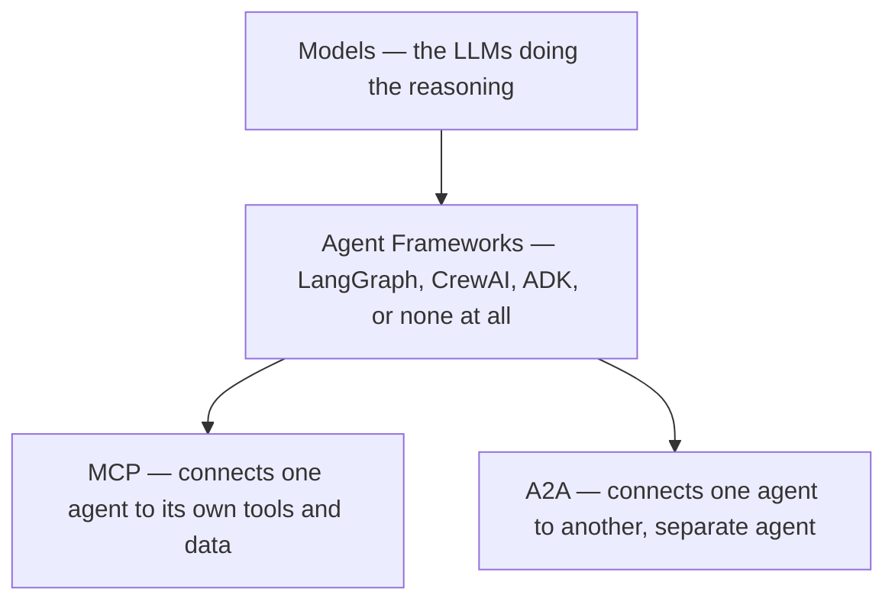
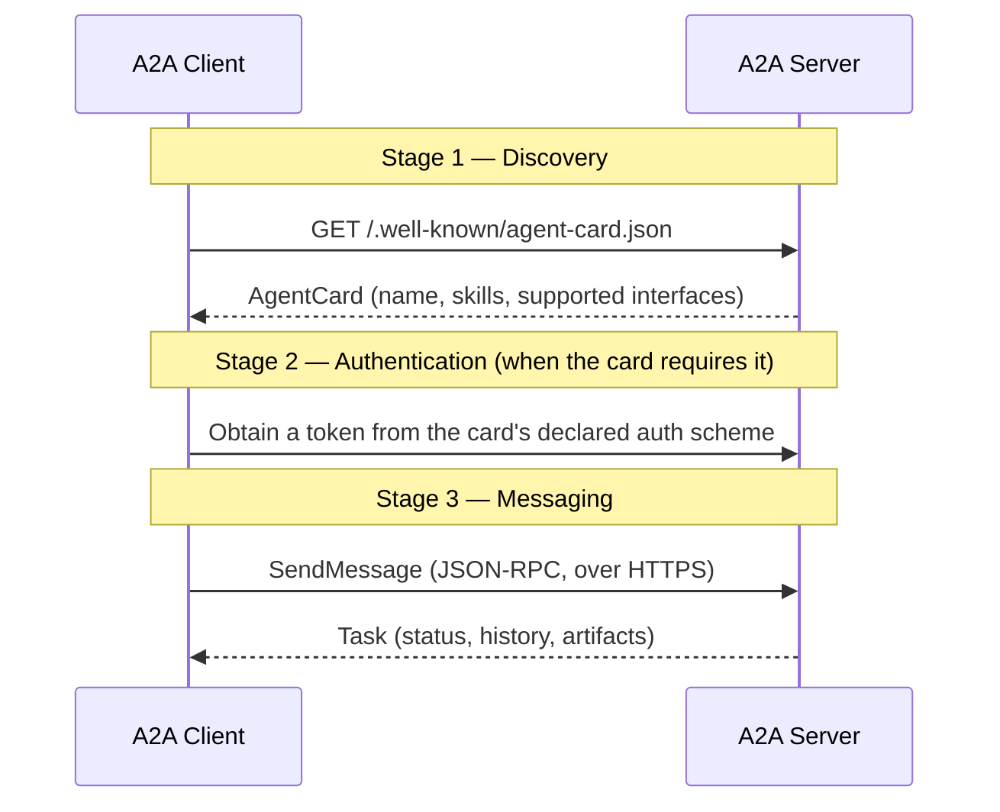
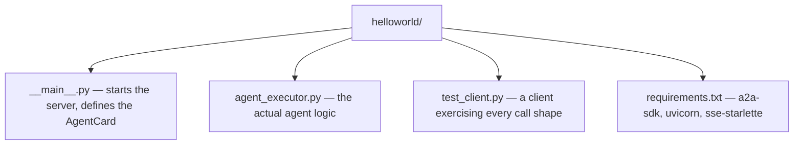
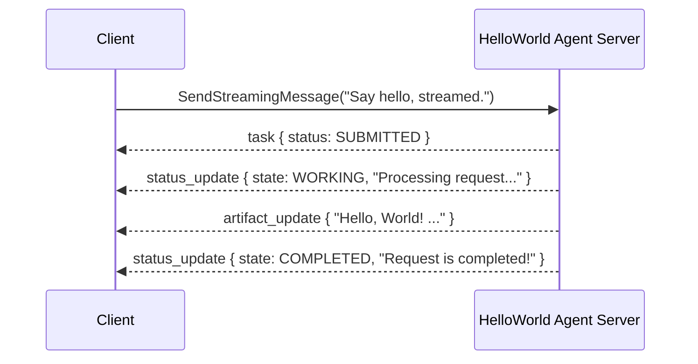

*This is part 2 of a series on agent orchestration. [Part 1](/posts/orchestration1/) builds agents in one process from six documents and measures four LangChain patterns for it. This part and part 3 are about agents you do not control: the Agent2Agent protocol here, then finding and calling a real remote agent in [part 3](/posts/orchestration3/).*

The Agent2Agent protocol, A2A for short, is an open standard for one AI agent to talk directly to another — not as a tool wrapped up to look like a function, but as a genuine peer with its own reasoning, its own state, and its own ability to work for a long time before it has an answer. I already covered [Model Context Protocol](/posts/mcpserver/) on this blog, which solves a different, adjacent problem: connecting one model to tools and data it can call. A2A solves the next problem up: connecting one agent to another agent it does not control and did not write.

Everything in this post is real. I ran the official Python `helloworld` sample from the [a2a-samples](https://github.com/a2aproject/a2a-samples) repository myself, in a real terminal, on this machine — the agent server actually started, the agent card actually got fetched over real HTTP, and every JSON response below is a genuine, unedited response from that running process, not an illustration of what one would look like.

## What the Agent2Agent protocol actually is

Picture a single assistant asked to "plan an international trip." Booking flights, reserving a hotel, converting currency, and finding local tours are each a job a specialist agent could do well — but without a shared protocol, the only way to use four such agents together is to wrap each one as a bespoke tool, with its own authentication, its own request shape, and its own failure modes, multiplied by every pair of agents that ever need to talk. That is the exact problem A2A exists to solve: a common, protocol-level language so an agent built on one framework, by one vendor, can hand work to an agent built on a completely different stack, without either one needing to know anything about how the other is implemented internally.

A2A deliberately reuses existing, boring, well-understood technology rather than inventing anything new: plain HTTP, JSON-RPC 2.0 for the request/response shape, and Server-Sent Events (SSE) for streaming. That choice is one of its four stated design principles — simplicity — alongside enterprise readiness (built-in authentication and authorization, not bolted on later), native support for long-running, asynchronous work, and opaque execution: two agents collaborate on a task without either one exposing its internal prompts, tools, or reasoning to the other.

### A2A next to MCP

Both protocols solve real problems, and a serious agent stack typically uses both at once, layered:



| | MCP | A2A |
|---|---|---|
| Connects | A model to tools and data it owns | One agent to another, independent agent |
| Interaction shape | Stateless, predefined function calls | Multi-turn tasks, with state, that can run for a long time |
| What is exposed | A named `tool`, with a fixed input schema | The agent itself — its skills, its own reasoning — never wrapped as a plain function |

The A2A documentation puts the distinction plainly: wrapping an agent as a simple tool is limiting, because a tool call cannot capture an agent's full capability — its ability to ask a clarifying question, to work for minutes rather than milliseconds, or to stream partial progress back before it is done.

### The building blocks

Four terms recur constantly in the code below, so it is worth being precise about each one before looking at a single line of Python:

- **Agent Card** — a JSON document, always published at a fixed, well-known URL, describing one agent: its name, its version, which transport protocols it speaks, and the list of `skills` it offers. It is the A2A equivalent of an API's OpenAPI schema — the first thing any client fetches, before it ever sends a real request.
- **Task** — the unit of work a client hands to an agent. A task has an id, a `context_id` grouping it with related tasks, a `status` (its current state, such as `TASK_STATE_WORKING` or `TASK_STATE_COMPLETED`), a `history` of every message exchanged so far, and zero or more `artifacts` — the actual output the agent produced.
- **Message and Part** — a message is one turn in that history, tagged with a `role` (`ROLE_USER` or `ROLE_AGENT`), and built out of one or more `parts`. A part is the smallest unit of content — plain text in every example below, but the protocol allows other media types too, which is what "modality independent" means in practice.
- **Skill** — one specific, named ability an agent's card advertises, each with its own `id`, `description`, and example prompts, so a client (often another AI, not a human) can decide which agent, and which skill on that agent, actually fits the job at hand.

### The request lifecycle

Every A2A interaction follows the same three stages, regardless of which framework built either side:



The `helloworld` sample below has no authentication scheme configured at all, so Stage 2 is skipped entirely — every request in this post goes straight from discovery to messaging.

## Getting the sample code

The sample code lives in the same repository the protocol's own site links to, under `samples/python`. Cloning it is the only "download" step — there is no separate archive:

```bash
git clone https://github.com/a2aproject/a2a-samples.git
cd a2a-samples/samples/python/agents/helloworld
```

That one repository holds far more than the single sample this post runs. Under `samples/python/agents/` alone there are 34 separate agents, covering most major agent frameworks:

```
helloworld            langgraph             crewai
adk_currency_agent     semantickernel        ag2
marvin                 airbnb_planner_multiagent
travel_planner_agent   azureaifoundry_sdk    github-agent
a2a_mcp                headless_agent_auth   ...and more
```

I picked `helloworld` specifically because it uses no agent framework, no LLM, and no API key at all — the entire "agent" is one function that echoes the request back with a fixed prefix. That makes it the cleanest possible way to see the A2A protocol itself moving, with nothing else in the way. `README.md` inside that directory documents each sample's three core files:



## Setting up Python

The sample's own `README.md` states Python 3.10 or higher. This machine's system Python was older:

```bash
python3 --version
```

```
Python 3.9.6
```

Attempting `pip install -r requirements.txt` against that interpreter failed immediately and honestly, rather than installing something broken:

```
ERROR: Could not find a version that satisfies the requirement a2a-sdk==1.1.0 (from versions: none)
ERROR: No matching distribution found for a2a-sdk==1.1.0
```

`a2a-sdk` simply does not publish a wheel compatible with Python 3.9, so pip correctly refuses rather than guessing. Rather than touching the system Python installation, I installed [uv](https://docs.astral.sh/uv/), a fast, self-contained Python package and version manager, via Homebrew:

```bash
brew install uv
```

`uv` can download and manage its own isolated Python interpreters, independent of whatever the operating system ships — exactly what is needed here, since the requirement is a newer Python than this Mac happened to have installed:

```bash
uv venv --python 3.12 .venv
```

```
Downloading cpython-3.12.14-macos-aarch64-none (download) (23.8MiB)
 Downloaded cpython-3.12.14-macos-aarch64-none (download)
Using CPython 3.12.14
Creating virtual environment at: .venv
Activate with: source .venv/bin/activate
```

`uv` downloaded a real CPython 3.12 build on the spot, entirely separate from the system's Python 3.9, and used it to create the virtual environment. With that environment active, the exact same install that failed a moment ago succeeds cleanly:

```bash
source .venv/bin/activate
uv pip install -r requirements.txt
```

```
Resolved 39 packages in 412ms
Prepared 39 packages in 1.02s
Installed 39 packages in 87ms
 + a2a-sdk==1.1.0
 + aiologic==0.17.1
 + annotated-types==0.8.0
 + anyio==4.15.1
 ...
 + starlette==1.6.0
 + uvicorn==0.53.0
```

## Reading the sample before running it

**`__main__.py`** builds two `AgentCard` objects and starts the web server. The public card advertises one skill:

```python
skill = AgentSkill(
    id='echo_bot',
    name='Echo Bot',
    description='An example agent that acknowledges client request and responds with a "Hello World" message.',
    input_modes=['text/plain'],
    output_modes=['text/plain'],
    tags=['a2a', 'echo-example'],
    examples=['hi', 'how are you'],
)

public_agent_card = AgentCard(
    name='Hello World Agent',
    description='Just a hello world agent',
    version='0.0.1',
    default_input_modes=['text/plain'],
    default_output_modes=['text/plain'],
    capabilities=AgentCapabilities(streaming=True, extended_agent_card=True),
    supported_interfaces=[
        AgentInterface(protocol_binding='JSONRPC', url='http://127.0.0.1:9999', protocol_version='1.0')
    ],
    skills=[skill],
)
```

A second, `extended_agent_card` adds a further skill, `echo_bot_super_mode`, that is only visible to a client that specifically requests the extended card — the sample's way of demonstrating that an agent can offer more than its public listing shows, gated behind whatever authentication scheme a real deployment would add. A `DefaultRequestHandler` ties both cards, an `InMemoryTaskStore` (task state kept in a plain Python dictionary, gone the moment the process exits — fine for a demo, not for production), and the actual agent logic together, and the whole thing runs as a Starlette app under Uvicorn on port `9999`.

**`agent_executor.py`** is where the actual work happens. Every A2A server built on the Python SDK implements this same interface:

```python
class HelloWorldAgentExecutor(AgentExecutor):
    async def execute(self, context: RequestContext, event_queue: EventQueue) -> None:
        task = context.current_task or new_task_from_user_message(context.message)
        task_updater = TaskUpdater(event_queue=event_queue, task_id=task.id, context_id=task.context_id)

        await task_updater.update_status(state=TaskState.TASK_STATE_WORKING,
                                          message=new_text_message('Processing request...'))

        query = get_message_text(context.message)
        result = await self.agent.invoke(user_request=query) if query else 'No text input is provided!'

        await task_updater.add_artifact(parts=[new_text_part(text=result, media_type='text/plain')])
        await task_updater.update_status(state=TaskState.TASK_STATE_COMPLETED,
                                          message=new_text_message('Request is completed!'))
```

Four steps, every time: move the task to `TASK_STATE_WORKING` and say so; run the actual agent logic (here, `HelloWorldAgent.invoke` simply returns `f'Hello, World! I have received your request ({user_request})'`); attach the result as an `artifact`; move the task to `TASK_STATE_COMPLETED`. A real agent replaces only the middle step — everything around it, the task lifecycle itself, is the protocol's job, not the agent author's.

## Running the server

```bash
python __main__.py
```

```
INFO:     Started server process [6319]
INFO:     Waiting for application startup.
INFO:     Application startup complete.
INFO:     Uvicorn running on http://127.0.0.1:9999 (Press CTRL+C to quit)
```

A real, running A2A server, on port `9999`, waiting for the first request.

## Discovering the agent

Stage 1 of the lifecycle above, done by hand with `curl` before touching the SDK at all — worth doing once so the discovery step is not just an abstraction:

```bash
curl -s http://127.0.0.1:9999/.well-known/agent-card
```

```
(empty response — 404 Not Found)
```

This is a genuine, reproducible gotcha, not a typo in this post: the actual well-known path this SDK version serves is `/.well-known/agent-card.json`, with the `.json` extension — the protocol's own documentation and older tooling sometimes drop it. The server log confirms exactly this:

```
INFO:     127.0.0.1:50096 - "GET /.well-known/agent-card HTTP/1.1" 404 Not Found
```

The correct path returns the real card:

```bash
curl -s http://127.0.0.1:9999/.well-known/agent-card.json | python3 -m json.tool
```

```json
{
    "name": "Hello World Agent",
    "description": "Just a hello world agent",
    "supportedInterfaces": [
        {
            "url": "http://127.0.0.1:9999",
            "protocolBinding": "JSONRPC",
            "protocolVersion": "1.0"
        }
    ],
    "version": "0.0.1",
    "capabilities": {
        "streaming": true,
        "extendedAgentCard": true
    },
    "defaultInputModes": ["text/plain"],
    "defaultOutputModes": ["text/plain"],
    "skills": [
        {
            "id": "echo_bot",
            "name": "Echo Bot",
            "description": "An example agent that acknowledges client request and responds with a \"Hello World\" message.",
            "tags": ["a2a", "echo-example"],
            "examples": ["hi", "how are you"],
            "inputModes": ["text/plain"],
            "outputModes": ["text/plain"]
        }
    ]
}
```

Every field maps directly onto the `AgentCard` object defined in `__main__.py` — this JSON is the exact object, serialized, with only the `extended_skill` withheld because this is the public, unauthenticated card, not the extended one.

## Talking to the agent over raw JSON-RPC

Before using the SDK's own client, I sent one request entirely by hand, to see the wire protocol with nothing hidden. The card above names `JSONRPC` as the interface, so every real call is an HTTP `POST` to the base URL, with a JSON-RPC 2.0 envelope as the body. My first attempt used `message/send` as the method name — the name used in the protocol's general documentation:

```bash
curl -s -X POST http://127.0.0.1:9999/ \
  -H "Content-Type: application/json" \
  -d '{"jsonrpc":"2.0","id":1,"method":"message/send","params":{"message":{"role":"user","parts":[{"kind":"text","text":"Say hello"}],"messageId":"raw-demo-001"}}}'
```

```json
{"error": {"code": -32601, "message": "Method not found"}, "id": 1, "jsonrpc": "2.0"}
```

A genuine, real mismatch: this particular SDK version (`a2a-sdk==1.1.0`) registers its JSON-RPC methods under PascalCase names derived from its underlying protobuf definitions — `SendMessage`, not `message/send` — confirmed directly from the SDK's own source:

```python
METHOD_TO_MODEL: dict[str, type] = {
    'SendMessage': SendMessageRequest,
    'SendStreamingMessage': SendMessageRequest,
    'GetTask': GetTaskRequest,
    'SubscribeToTask': SubscribeToTaskRequest,
    'GetExtendedAgentCard': GetExtendedAgentCardRequest,
    # ...
}
```

Correcting the method name produced a second, different error:

```json
{
  "error": {
    "code": -32009,
    "message": "A2A version '0.3' is not supported by this handler. Expected version '1.0'.",
    "data": [{"reason": "VERSION_NOT_SUPPORTED", "domain": "a2a-protocol.org"}]
  },
  "id": 1, "jsonrpc": "2.0"
}
```

Without an explicit version header, the server assumes the older `0.3` wire format and rejects the request rather than silently guessing. The fix, found in the SDK's own `constants.py`, is one header:

```bash
curl -s -X POST http://127.0.0.1:9999/ \
  -H "Content-Type: application/json" \
  -H "A2A-Version: 1.0" \
  -d '{"jsonrpc":"2.0","id":1,"method":"SendMessage","params":{"message":{"role":"ROLE_USER","parts":[{"text":"Say hello over raw JSON-RPC"}],"message_id":"raw-demo-001"}}}' \
  | python3 -m json.tool
```

```json
{
    "result": {
        "task": {
            "id": "1f3c5337-1fa2-4e41-bc8e-83a279781a02",
            "contextId": "56e291b9-9f40-4300-9ab4-1d64f5d9b349",
            "status": {
                "state": "TASK_STATE_COMPLETED",
                "message": {
                    "messageId": "4ce847e1-0f26-4784-b2fd-b06c115bcb1a",
                    "role": "ROLE_AGENT",
                    "parts": [{"text": "Request is completed!"}]
                },
                "timestamp": "2026-09-19T22:42:21.269944Z"
            },
            "artifacts": [
                {
                    "artifactId": "b6204643-bd73-4e9b-8650-f7ab97a3bcd8",
                    "parts": [
                        {
                            "text": "Hello, World! I have received your request (Say hello over raw JSON-RPC)",
                            "mediaType": "text/plain"
                        }
                    ]
                }
            ],
            "history": [
                {
                    "messageId": "raw-demo-001",
                    "role": "ROLE_USER",
                    "parts": [{"text": "Say hello over raw JSON-RPC"}]
                },
                {
                    "messageId": "14613c2f-6b80-4ecd-accc-198e3af818ad",
                    "role": "ROLE_AGENT",
                    "parts": [{"text": "Processing request..."}]
                }
            ]
        }
    },
    "id": 1, "jsonrpc": "2.0"
}
```

Every concept from earlier in this post is sitting directly in that one response: a `Task`, with a `status.state` of `TASK_STATE_COMPLETED`, an `artifacts` list holding the agent's actual output as a text `Part`, and a `history` recording both turns — the user's message and the agent's intermediate "Processing request..." message — exactly the four-step lifecycle `agent_executor.py` walks through.

## Talking to the agent with the official SDK client

Raw `curl` proves the wire protocol works; `test_client.py` shows what a real client actually looks like, using `A2ACardResolver` to fetch the card and `create_client` to send messages, in both the non-streaming and streaming shapes the card's `capabilities.streaming: true` advertises:

```python
async with httpx.AsyncClient() as httpx_client:
    resolver = A2ACardResolver(httpx_client=httpx_client, base_url='http://127.0.0.1:9999')
    public_agent_card = await resolver.get_agent_card()

config = ClientConfig(streaming=False)
client = await create_client(agent=public_agent_card, client_config=config)
message = new_text_message('Say hello.', role=Role.ROLE_USER)
async for chunk in client.send_message(SendMessageRequest(message=message)):
    print(chunk)
```

Running the sample's own workflow — fetch the card, send one non-streaming message, send one streaming message, then fetch the authenticated extended card — against the live server above produced this, in full, unedited:

```
Successfully fetched the public agent card:
====================================================
                     AgentCard
====================================================
--- General ---
Name        : Hello World Agent
Description : Just a hello world agent
Version     : 0.0.1

--- Interfaces ---
  [0] http://127.0.0.1:9999  (JSONRPC 1.0)

--- Capabilities ---
Streaming           : True
Push notifications  : False
Extended agent card : True

--- Skills ---
----------------------------------------------------
  ID          : echo_bot
  Name        : Echo Bot
  Example     : hi
  Example     : how are you
====================================================

--- Public Agent Card - Non-Streaming Call ---
Response:
task {
  id: "6ad07cae-cbfd-4a2b-ae22-8d68dd15a076"
  status { state: TASK_STATE_COMPLETED }
  artifacts {
    parts { text: "Hello, World! I have received your request (Say hello.)" media_type: "text/plain" }
  }
}
```

The non-streaming call returns exactly one `Task` object, already in its final, completed state — the client waited for the whole thing before printing anything. The streaming call, against the identical agent, returns something structurally different: a separate event for every state transition, as it happens:

```
--- Public Agent Card - Streaming Call ---
Response:
task {
  id: "f069e4b5-59b8-40d2-b795-e9b241184b3b"
  status { state: TASK_STATE_SUBMITTED }
}

status_update {
  task_id: "f069e4b5-59b8-40d2-b795-e9b241184b3b"
  status {
    state: TASK_STATE_WORKING
    message { role: ROLE_AGENT parts { text: "Processing request..." } }
  }
}

artifact_update {
  task_id: "f069e4b5-59b8-40d2-b795-e9b241184b3b"
  artifact {
    parts { text: "Hello, World! I have received your request (Say hello, streamed.)" media_type: "text/plain" }
  }
}

status_update {
  task_id: "f069e4b5-59b8-40d2-b795-e9b241184b3b"
  status {
    state: TASK_STATE_COMPLETED
    message { role: ROLE_AGENT parts { text: "Request is completed!" } }
  }
}
```

Four separate events, each one a real, individually-delivered Server-Sent Event, matching `agent_executor.py`'s own four steps one for one — the task first `SUBMITTED`, then a `status_update` moving it to `WORKING`, then an `artifact_update` carrying the actual result the moment it exists, and finally a `status_update` moving it to `COMPLETED`. This is precisely what "asynchronous" and "long-running" mean in A2A's own design principles in practice: a real agent that takes thirty seconds to answer streams its progress the same way, rather than leaving the client staring at a blank connection.



Fetching the authenticated extended card, the last call in the sample, shows the second skill withheld from every request so far:

```
--- Extended Agent Card - Non-Streaming Call ---
Successfully fetched the authenticated extended agent card:
====================================================
Name        : Hello World Agent - Extended Edition
Description : The full-featured hello world agent for authenticated users.
Version     : 0.0.2

--- Skills ---
----------------------------------------------------
  ID          : echo_bot
  Name        : Echo Bot
----------------------------------------------------
  ID          : echo_bot_super_mode
  Name        : Echo Bot (Super Mode)
  Description : An extended version of Echo Bot that responds with extra enthusiasm!
====================================================
```

Two skills instead of one — `echo_bot_super_mode` only ever appears here, never in the public card fetched at the start of this post, which is the whole point of an extended card: an agent can offer more to a client that proves who it is than to one that has not.

The server's own log, over the course of this entire post, confirms every one of these calls actually happened, in order, against the one running process:

```
INFO:     127.0.0.1:50097 - "GET /.well-known/agent-card.json HTTP/1.1" 200 OK
Result:  Hello, World! I have received your request (Say hello.)
INFO:     127.0.0.1:50100 - "POST / HTTP/1.1" 200 OK
Result:  Hello, World! I have received your request (Say hello, streamed.)
INFO:     127.0.0.1:50102 - "POST / HTTP/1.1" 200 OK
INFO:     127.0.0.1:50103 - "GET /.well-known/agent-card.json HTTP/1.1" 200 OK
INFO:     127.0.0.1:50104 - "POST / HTTP/1.1" 200 OK
```

## Where to go from here

`helloworld` shows the protocol's mechanics with nothing else in the way; the same `samples/python/agents/` directory has 33 other samples layering real frameworks on top of it — `langgraph` and `crewai` for graph- and crew-based multi-agent orchestration, `adk_currency_agent` and `travel_planner_agent` for Google's Agent Development Kit, `semantickernel` for Microsoft's framework already covered on this blog in the [Prompt Flow](/posts/promptflow4/) series' look at Semantic Kernel's planner, and `a2a_mcp` specifically demonstrating an agent that is both an A2A server and an MCP client at once — the two protocols from the comparison table above, in the same process. Every one of them follows the identical three-stage lifecycle this post walked through by hand: publish a card, accept a message, return a task.

## References

- [A2A Protocol — What is A2A?](https://a2a-protocol.org/latest/topics/what-is-a2a/)
- [a2aproject/a2a-samples — the source repository for this post's sample](https://github.com/a2aproject/a2a-samples/tree/main/samples/python)
- [google/a2a-python — the official Python SDK](https://github.com/google/a2a-python/)
