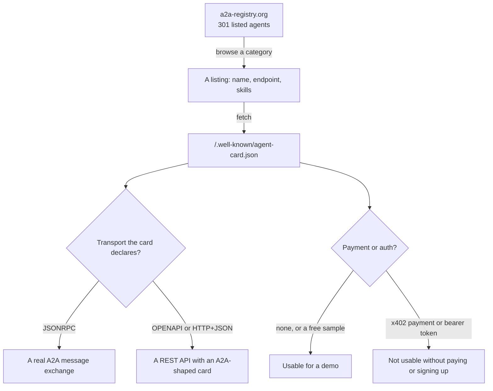
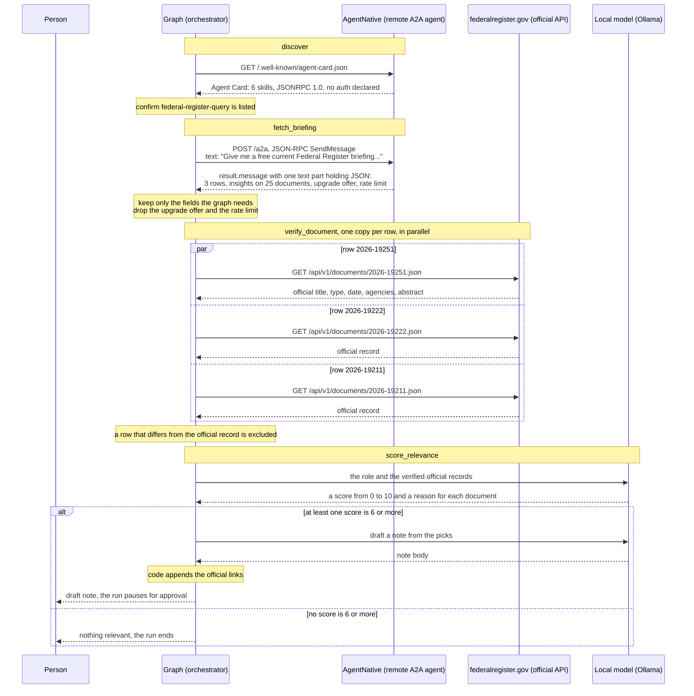
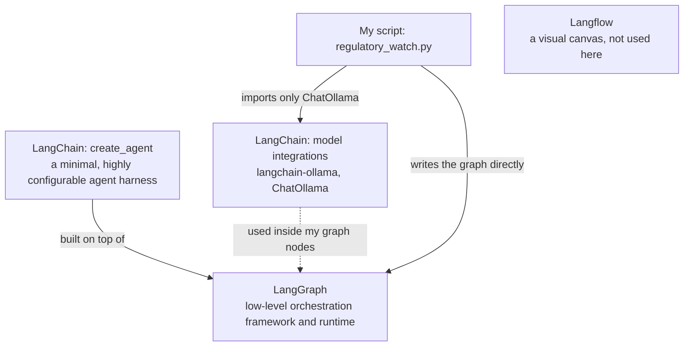
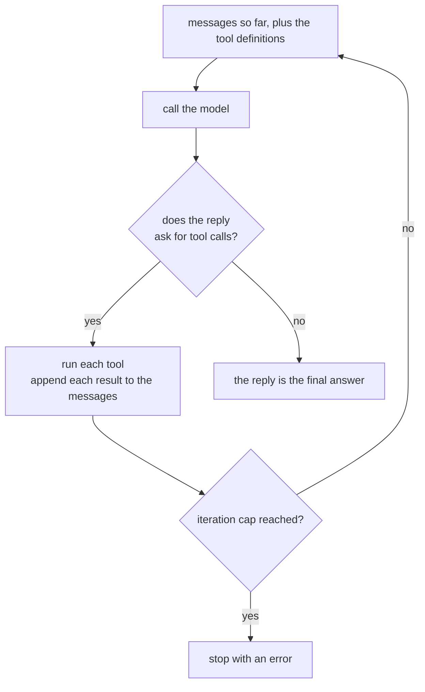
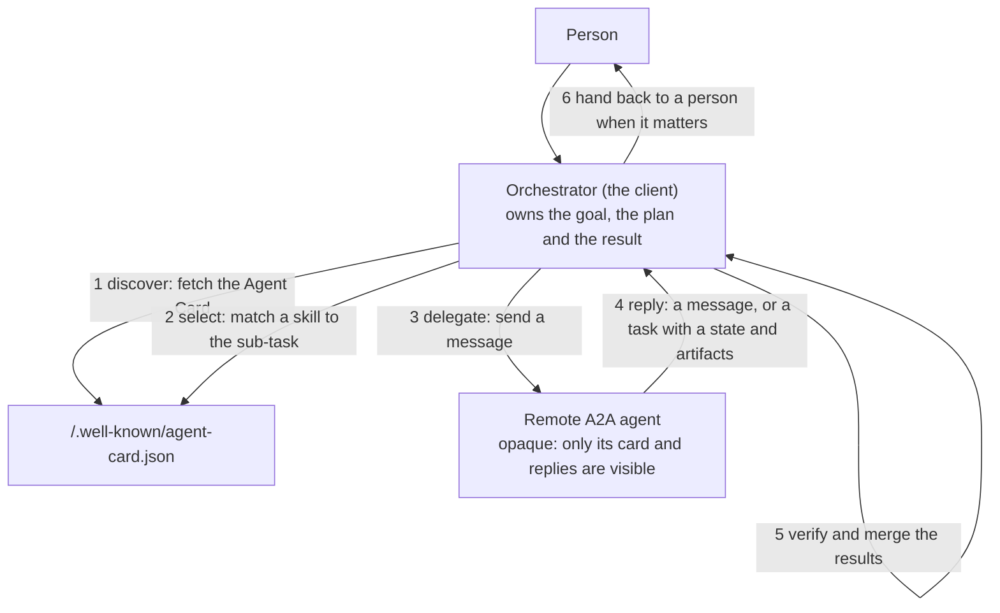
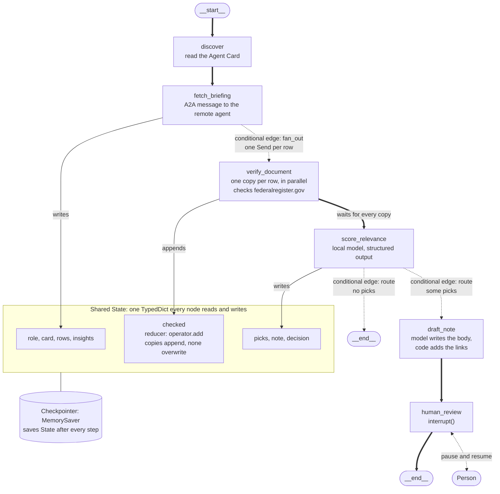
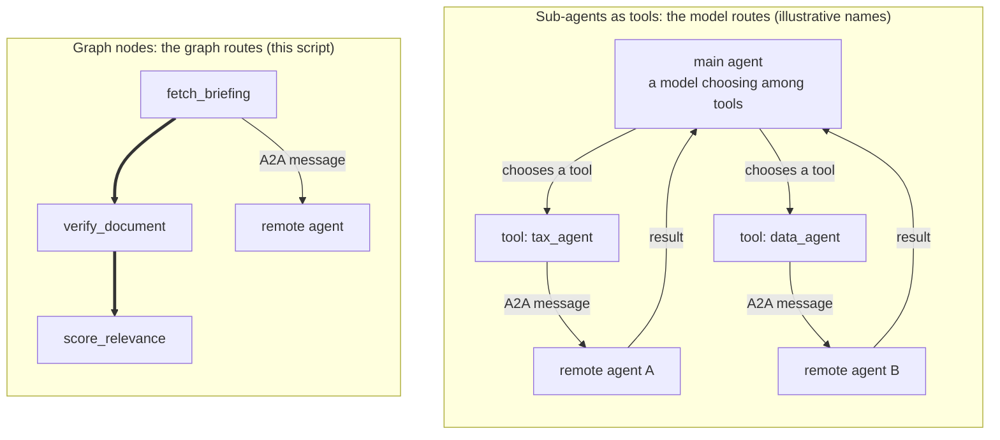

*This is part 3 of a series on agent orchestration. [Part 1](/posts/orchestration1/) measures four LangChain patterns for agents you build yourself, and [part 2](/posts/orchestration2/) introduces the Agent2Agent protocol.*

My [previous post, part 2](/posts/orchestration2/), ran a "hello world" agent I wrote myself, to see the protocol's mechanics with nothing else in the way. This post uses an agent I did not write. I found it in a public registry, [a2a-registry.org](https://www.a2a-registry.org/). In the [LangGraph](https://langchain-ai.github.io/langgraph/) graph I fetch its Agent Card again on every run, so the run checks what the agent advertises today and not what the registry listed when I looked, and then I call it. The graph runs on my own machine with a model hosted by [Ollama](https://ollama.com). The graph is the point: it shows what an orchestrator is responsible for when it depends on an agent it does not control.

The task is a regulatory watch. The graph asks the remote agent for a briefing of new Federal Register documents, checks every row against the official source, has a local model score each verified document for a stated job role, drafts a short note about the relevant ones, and stops for my approval before anything would be sent.

Every output below is from a real run against live services on 20 September 2026. The briefing changes daily, so a run today will differ.

## a2a-registry.org

An [Agent Card](/posts/orchestration2/#the-building-blocks) only helps once you know where to fetch it. [a2a-registry.org](https://www.a2a-registry.org) covers the step before that, discovering agents you did not already know about. It describes itself as "the definitive directory for the Agentic Web" and, at the time of writing, lists 301 agents, 74 of them verified. Verification means the owner proved control through a DNS TXT record, a linked GitHub account or a GoDaddy ANS name. Adding a listing needs no account: you paste an agent's URL and the registry reads the Agent Card.

The registry is an A2A agent itself. Its own card declares a JSON-RPC interface with a `search_agents` skill that takes a natural-language query. It also declares bearer-token authentication, and an unauthenticated call returns `HTTP 401` with a pointer to a token sign-up page. I did not create an account, so I browsed the categories by hand instead.

Listings vary a great deal, and the registry's own health status can be stale. Four agents I looked at all showed the identical "14 consecutive health check failures", and a direct request for one of their cards succeeded, which suggests the registry's checker had stalled, not that four agents failed together. Before choosing, I checked each candidate's card, or its registry page where I did not fetch the card, for two things: which transport it declares, and whether it charges.

| Agent | How I checked | Result |
|---|---|---|
| AgentNative Data Exchange | Card fetched, several calls made | JSON-RPC 1.0, declares no auth, free sample tier. Chosen |
| CharitySense | Card fetched | Transport is `OPENAPI`: a REST API described with an A2A-shaped card, not an A2A message exchange |
| ForgeMesh travel and fares | Registry page | Every call is paid in USDC through x402 crypto payments |
| The registry's own agent | Card fetched, call returned 401 | Needs an account token |



## The agent: AgentNative Data Exchange

The registry listing points at an Agent Card, and the first thing the graph does is fetch it.

### The Agent Card

This is the card exactly as the agent serves it at `https://agentnative.cazimedia.com/.well-known/agent-card.json`. I fetched it with `curl` and pretty-printed it:

```json
{
    "name": "AgentNative Data Exchange",
    "description": "Normalized official government and public datasets across federal, state and city agencies, census, police, education and schools, with provenance, aggregations, insights and free samples.",
    "url": "https://agentnative.cazimedia.com/a2a",
    "version": "0.3.0",
    "supportedInterfaces": [
        {
            "url": "https://agentnative.cazimedia.com/a2a",
            "protocolBinding": "JSONRPC",
            "protocolVersion": "1.0"
        },
        {
            "url": "https://agentnative.cazimedia.com",
            "protocolBinding": "HTTP+JSON",
            "protocolVersion": "1.0"
        }
    ],
    "capabilities": {
        "streaming": false,
        "pushNotifications": false,
        "extendedAgentCard": false
    },
    "defaultInputModes": [
        "text/plain",
        "application/json"
    ],
    "defaultOutputModes": [
        "text/plain",
        "application/json"
    ],
    "skills": [
        {
            "id": "public-data-search",
            "name": "Search official government and public datasets",
            "description": "Discover federal, state, city, census, police, education and school data with official provenance.",
            "tags": [
                "government data",
                "public datasets",
                "statistics",
                "provenance"
            ],
            "examples": [
                "Find official datasets about public schools."
            ]
        },
        {
            "id": "on-demand-materialization",
            "name": "Make discovered data query-ready",
            "description": "Prioritize a compatible official dataset for detached ingestion and poll the durable task through completion.",
            "tags": [
                "materialization",
                "async task",
                "data import"
            ],
            "examples": [
                "Materialize disc_0123456789abcdef01234567 and tell me when it is query-ready."
            ]
        },
        {
            "id": "imported-data-sample",
            "name": "Sample normalized government datasets free",
            "description": "Inspect official rows, summaries, deterministic insights, freshness and provenance before payment.",
            "tags": [
                "free sample",
                "open data",
                "normalized records"
            ],
            "examples": [
                "Show me useful free data with provenance."
            ]
        },
        {
            "id": "imported-data-query",
            "name": "Query and aggregate official datasets",
            "description": "Filter, group and aggregate normalized public records across government agencies.",
            "tags": [
                "aggregation",
                "analysis",
                "official records"
            ],
            "examples": [
                "Group these public records by agency."
            ]
        },
        {
            "id": "coverage-status",
            "name": "Inspect source coverage",
            "description": "Inspect current catalog traversal, materialization, queue, failure, and publication freshness state.",
            "tags": [
                "coverage",
                "freshness",
                "data sources"
            ],
            "examples": [
                "Which official sources are currently queryable?"
            ]
        },
        {
            "id": "federal-register-query",
            "name": "Query Federal Register",
            "description": "Query normalized rules, proposed rules, notices, and presidential documents with bounded date and type filters.",
            "tags": [
                "Federal Register",
                "regulations",
                "rules",
                "notices"
            ],
            "examples": [
                "Give me a free current Federal Register briefing with provenance."
            ]
        }
    ]
}
```

What matters in it:

- **`supportedInterfaces`** lists two ways to reach the agent: `JSONRPC` at `https://agentnative.cazimedia.com/a2a` and `HTTP+JSON` at the base URL, both at protocol version 1.0. The graph's `discover` step prints the first entry, `JSONRPC 1.0`, and the hand-made call below uses the JSON-RPC one.
- **`capabilities.streaming` is `false`**, so a call returns one message and not a stream of updates.
- **There is no `securitySchemes` key**, so the card declares no authentication.
- **Six skills** are listed. The one this post uses is `federal-register-query`, and `discover` stops the run if that id is missing. The card gives an example prompt for it and no input schema, so the example sentence is the only guidance on how to ask. That is why the graph sends that exact sentence. A different free-text prompt I tried, a search for datasets about public schools, returned a capabilities menu and no data.
- **`on-demand-materialization`** advertises a "durable task" you poll to completion, which would exercise A2A's task states. I did not use it.

### Calling it

The `a2a-sdk` client is given nothing beyond the base URL:

```python
client = await create_client("https://agentnative.cazimedia.com", ClientConfig(streaming=False))
message = Message(message_id=str(uuid.uuid4()), role=Role.ROLE_USER,
                  parts=[Part(text="Give me a free current Federal Register briefing with provenance.")])
async for event in client.send_message(SendMessageRequest(message=message)):
    ...
```

To see the wire format, I made the same call by hand once with `curl`, using the JSON-RPC interface from the card and the `A2A-Version: 1.0` header:

```bash
curl -X POST https://agentnative.cazimedia.com/a2a \
  -H "Content-Type: application/json" -H "A2A-Version: 1.0" \
  -d '{"jsonrpc":"2.0","id":1,"method":"SendMessage","params":{"message":{"role":"ROLE_USER","message_id":"wire-check-1","parts":[{"text":"Give me a free current Federal Register briefing with provenance."}]}}}'
```

The response is a JSON-RPC envelope holding one A2A `message`, from the `ROLE_AGENT`, with a single text part:

```json
{"jsonrpc": "2.0", "id": 1, "result": {"message": {"messageId": "...", "role": "ROLE_AGENT", "parts": [{"text": "<a JSON document, shown next>"}]}}}
```

### The reply

The text part is itself a JSON document. Here it is, decoded and abridged: I shortened the long title, abstract and URL strings and collapsed one field, and changed nothing else.

```json
{
  "type": "federal-register-briefing",
  "status": 200,
  "data": {
    "dataset": "us-federal-register-documents",
    "sample": true,
    "sample_basis": "Aggregates cover the 25 newest documents; three example records are included.",
    "rows": [
      {
        "document_number": "2026-19251",
        "title": "Presidential Determination on Major Drug Transit or Major Illicit Drug Producing Countries ...",
        "publication_date": "2026-09-18",
        "type": "Presidential Document",
        "agencies": [
          "Executive Office of the President"
        ],
        "abstract": null,
        "url": "https://www.federalregister.gov/documents/2026/09/18/2026-19251/presidential-determi ..."
      },
      {
        "document_number": "2026-19222",
        "title": "Employment in the Excepted Service",
        "publication_date": "2026-09-18",
        "type": "Proposed Rule",
        "agencies": [
          "Personnel Management Office"
        ],
        "abstract": "The Office of Personnel Management (OPM) proposes to amend its regulations governing the e ...",
        "url": "https://www.federalregister.gov/documents/2026/09/18/2026-19222/employment-in-the-ex ..."
      },
      {
        "document_number": "2026-19211",
        "title": "International Traffic in Arms Regulations: Modification of U.S. Munitions List Category XX ...",
        "publication_date": "2026-09-18",
        "type": "Rule",
        "agencies": [
          "State Department"
        ],
        "abstract": "The Department of State (the Department) amends the International Traffic in Arms Regulati ...",
        "url": "https://www.federalregister.gov/documents/2026/09/18/2026-19211/international-traffi ..."
      }
    ],
    "insights": {
      "documents_analyzed": 25,
      "document_mix": {
        "Presidential Document": 1,
        "Proposed Rule": 1,
        "Rule": 2,
        "Notice": 21
      },
      "activity_by_publication_day": {
        "2026-09-18": 25
      },
      "top_agencies": [
        {
          "name": "Energy Department",
          "documents": 7
        },
        {
          "name": "Federal Energy Regulatory Commission",
          "documents": 7
        },
        {
          "name": "Federal Reserve System",
          "documents": 2
        },
        {
          "name": "Homeland Security Department",
          "documents": 2
        },
        {
          "name": "United States Sentencing Commission",
          "documents": 2
        }
      ],
      "abstract_coverage": "...",
      "signals": {
        "most_active_agency": "Energy Department",
        "dominant_document_type": "Notice"
      }
    },
    "provenance": "https://www.federalregister.gov/developers/documentation/api/v1",
    "upgrade": {
      "options": {
        "pass": "$5 for 250 queries / 30 days",
        "subscription": "$5/month for 2,000 queries"
      },
      "benefits": [
        "up to 100 rows per query",
        "date and document-type filters",
        "aggregations and provenance",
        "120 requests per minute"
      ],
      "access_start": "https://agentnative.cazimedia.com/v1/access/start"
    },
    "rate_limit": {
      "limit": 20,
      "remaining": 19,
      "reset": 1789882740
    }
  }
}
```

Its shape matters more than its content:

- `data.rows` holds **three** documents, each with a document number, title, date, type, agencies and a federalregister.gov URL.
- `data.insights` summarizes **25** documents: the mix of types and the top agencies. The 25 are counted, not returned.
- `data.upgrade` offers a $5 pass or subscription for up to 100 rows and date and type filters. The graph ignores it.
- `data.rate_limit` reports a limit of 20 calls. The graph ignores it too.

I first assumed the free tier returned the 25 newest documents, and it does not. Three rows is a small sample, and that shapes what this demo can honestly claim, which I come back to at the end.

### The exchange, step by step

This sequence shows the remote agent being called, the documents coming back, and what the graph does with them next:



The remote agent appears only in the first two steps. Once its reply arrives, the graph works from the official Federal Register record, and the model never talks to the agent at all.

## What the code is built with, and why

Yes, the graph is LangGraph. These are all the pieces the script imports or depends on, with the versions I ran:

| Piece | Version | What it does here | Why this one |
|---|---|---|---|
| LangGraph | `langgraph` 1.2.11 | Defines the control flow as a graph: `StateGraph`, conditional edges, `Send`, a reducer, `MemorySaver` and `interrupt` | The design needs parallel copies with a join, a conditional early stop and a pause that can resume, and LangGraph provides each of those |
| LangChain's Ollama integration | `langchain-ollama` 1.1.0, with `langchain-core` 1.6.3 | `ChatOllama` talks to the local model, and `with_structured_output` returns a validated object | It is the one small part of LangChain the graph needs. Nothing else from LangChain is imported |
| Pydantic | 2.13.5 | Defines the `Score` and `Scores` shapes the model must return | The model's answer is checked against a schema before any code uses it |
| Ollama and `qwen2.5:14b` | server 0.34.2 | Runs the model on this machine and scores the documents and writes the note | No API key, nothing leaves the machine, and the model was already installed. It returned valid structured output in every run I made |
| A2A Python SDK | `a2a-sdk` 1.1.4 | Reads the Agent Card, works out which transport to use and sends the message | It removes the hand-built JSON-RPC I used in [part 2](/posts/orchestration2/), which was there to show the wire format |
| httpx | 0.28.1 | Calls the federalregister.gov API for the verification step | Async HTTP, and it is already a dependency of the A2A SDK |

**Not used:** the prebuilt ReAct agent (`create_react_agent`, now `create_agent` in LangChain) and its tool-calling loop (the reasoning is under "Why the remote agent is called from a node" below), `RemoteGraph` and the LangGraph server, LangSmith, MCP, and the SDK's server side.

A2A does not require LangGraph. The protocol only defines what crosses the boundary between two agents, so the remote agent could be built on anything and my client could be a plain script. LangGraph is one way to write the client side.

### Do you need LangGraph for this?

No. For three rows and one pause, the same steps fit in a plain async script: `asyncio.gather` for the verification, an `if` for the early stop and `input()` for the approval. That version would be shorter, and for a task this small it is arguably the better choice. LangGraph earns its place in three ways:

- **The pause is a real stop.** State is saved after every step, so `interrupt` ends the run and `Command(resume=...)` continues it, instead of a call blocked on the keyboard. In this script both halves run in one process, and `MemorySaver` keeps state in memory only, so I have shown the mechanism and not a run that survives a restart. That would need a persistent checkpointer.
- **The graph can be drawn from the code.** `build_graph().get_graph()` reported the nodes and edges, and I used them for the diagram below.
- **Merging parallel results is declared, not written.** The `operator.add` reducer says how the three verification results combine.

The cost is more concepts to learn and one more layer between you and the control flow. I judge the trade worth it here because this post is about orchestration, and LangGraph makes each part of it visible and named.

## LangChain, LangGraph and Langflow

The three names look like one product and are not. LangChain and LangGraph are separate libraries from the same company, and one sits on top of the other. Langflow is a different kind of tool, mentioned here in passing because I use neither its canvas nor its runtime. None of the three is required to build an agent, as the last part of this section explains.



| | LangChain | LangGraph | Langflow |
|---|---|---|---|
| What it is | Building blocks for LLM applications: model integrations, tools, prompts and ready-made agents | A framework and runtime for stateful agents, written as a graph of nodes joined by edges | A visual tool for building AI agents and workflows on a canvas, with a no-code or low-code interface |
| You work in | Code | Code | A browser canvas |
| Who decides what runs next | Mostly the agent loop: the model picks a tool, reads the result and repeats | You, through the edges you draw, with agentic steps where you choose | The flow you connect on the canvas |
| Suits | Getting an agent running quickly | Precise control of every step, mixing fixed and model-driven steps, saved state and human approval | Prototyping multi-step or multi-agent applications quickly |
| In this post | Only `ChatOllama` and structured output | The whole control flow | Not used |

The LangChain documentation puts the relationship plainly: "LangChain's agents are built on top of LangGraph. This allows us to take advantage of LangGraph's durable execution, human-in-the-loop support, persistence, and more." It describes `create_agent` as "a minimal, highly configurable agent harness", and describes LangGraph as "a low-level orchestration framework and runtime for building, managing, and deploying long-running, stateful agents." It also says LangGraph "can be used without LangChain". So the choice is not one library against the other. It is how much of the control flow you want a prebuilt harness to decide for you.

The pre-built agent has moved between them. When I first ran a LangGraph ReAct agent for this project, the import of `create_react_agent` printed a deprecation warning saying it "has been moved to `langchain.agents`" and to use `create_agent` instead. The idea is unchanged: a model that chooses tools in a loop. I wrote about that loop in my 2024 post on [LangChain Agents](/posts/langchainagents/), where an LLM decides which tools to call, runs them and repeats until the task is done. LangGraph draws the same loop as a cycle between an `agent` node and a `tools` node, which is the shape I contrast with this graph below.

I chose LangGraph directly for this script because the orchestration is the point. A prebuilt harness makes the "what next" decision inside a model loop, and I wanted those decisions in edges I can read, test and draw. I still use one LangChain piece, `ChatOllama`, because it is a convenient way to call a local model and get structured output back. The LangChain documentation recommends its higher-level agents for people getting started, and LangGraph for "precise control over every part of your agent's behavior."

Langflow sits in a different place. Where LangGraph is a graph you write in Python and can print as Mermaid text, Langflow lets you connect models, tools, prompts and memory as boxes on a canvas. I tried it in October 2024 in my post [Langflow](/posts/langflow1/): I installed it with Python 3.10, started it with `python -m langflow run`, opened its canvas at `http://127.0.0.1:7860` and imported a "Doc to Podcast" flow, which needed an `openai_api_key` variable. That is a good way to prototype quickly. I have not used Langflow for this task, and I have not checked how its current version works, so treat this paragraph as a pointer, not a comparison I have tested. If you want to see what a flow looks like before writing code, start there. If you need the flow to be tested, versioned and driven from code, as an orchestrator that must verify a third party's output does, a code-level graph like LangGraph is the closer fit.

### You do not need a framework to build an agent

None of the three is required. An LLM-powered agent is a loop, and you can write that loop yourself. Send the conversation and a list of tool definitions to the model. If the reply asks for tool calls, run them, add the results to the conversation and go round again. If it does not, the reply is the answer. Put a cap on the number of trips so a confused model cannot loop forever.



That is the whole idea, and I built it without an agent framework such as LangChain or LangGraph in [Claude Code, part 9](/posts/claudecode9/), where I used Claude Code to create a local coding agent. Its tech stack is Next.js, TypeScript, Tailwind and Ollama running `qwen2.5-coder:7b`, and its core is one function, `runAgent`. The function follows the diagram above. It calls the model with the conversation and the tool definitions, runs any requested tools and feeds the results back, up to 20 iterations (`MAX_TOOL_ITERATIONS`). The agent has four tools: `read_file`, `write_file`, `run_command` and `search_files`. The function reports progress through a callback, so the same loop serves both the browser interface and the command line.

Writing the loop yourself also means owning its awkward cases. That post handles a model that does not support native function calling and puts its tool call as JSON inside the text of its reply, by scanning the text for it. [Part 2](/posts/orchestration2/) shows the other side of A2A working without a framework too: the remote `helloworld` agent has no agent framework and no model, and its whole "agent" is one function that echoes the request.

A framework is a convenience, not a requirement. What LangGraph adds to a loop like this is what this script uses it for: state saved between steps, a pause that can resume, parallel branches with a defined merge, and a graph you can draw from the code. If you do not need those, the loop above is enough. The question is whether the extras are worth another layer to learn, which is the same question I asked of this script under "Do you need LangGraph for this?" above.

## What an orchestrator is responsible for

A2A describes the remote agent's side in detail: the card, the skills, the task states. The client that coordinates one or more agents has duties of its own, and most of them are easy to lose when the model is left to improvise.



Step 5 deserves emphasis. The remote agent is a third party, and the official samples' own README says to treat everything an external agent returns, including its card and messages, as untrusted input. The verification step in this graph is that advice made concrete.

| Pattern | What it means | In this post |
|---|---|---|
| Sequential | Step B needs step A's output | Discover, fetch, score, draft |
| Parallel fan-out and fan-in | Independent calls run together and a join waits for all | One verification per document |
| Conditional routing | The next step depends on a result | Stop early if nothing is relevant |
| Supervisor | One agent routes work to several specialists | Not used |
| Handoff | Control moves to another agent for the rest of the conversation | Not used |
| Human in the loop | The run pauses for approval before an irreversible step | Approve the note before it can be sent |

## The graph

The control flow is a LangGraph `StateGraph`. This diagram shows the nodes, the edge types, the shared state, the checkpointer and the pause.



| Part | What it is | Where it appears here |
|---|---|---|
| Node | A function that receives the State and returns updates to it | The six named boxes |
| Fixed edge | Always go from A to B | The thick arrows |
| Conditional edge | A function chooses the destination at run time, and can return several | `fan_out` and `route` |
| `Send` | Start a node with its own private input, one copy per item | One `verify_document` per row |
| Reducer | A rule for merging updates to a field from parallel nodes | `operator.add` on `checked` |
| Checkpointer | Saves the State after each step so a run can stop and continue | `MemorySaver`, which makes the pause possible |
| Interrupt | A node stops the run and returns a value to the caller | `human_review` |
| Cycle | An edge back to an earlier node | None in this graph |

A ReAct agent, the pattern behind LangGraph's older `create_react_agent` (now moved to LangChain as `create_agent`), is the opposite shape: `agent` and `tools` are joined in a cycle and the model decides how many times around it goes. This graph has no cycle. Every node runs once, in an order I fixed. A cycle is one more edge if a loop is what you want, for example retrying a failed call or waiting while a remote task is still working, and nothing in this run needed one.

### Why the remote agent is called from a node

`fetch_briefing` is an ordinary async function that calls the A2A client. The model never sees the remote agent, so it cannot skip the call, run it early or fill in its arguments. I chose this because fetching the briefing is always required and nothing about it needs judgment. The alternative is to expose the agent as a tool, which suits a supervisor that must pick among several agents, and the next subsection compares the two. I tried that pattern in an earlier draft of this post with a different agent and a small local model, and the model skipped a tool, called one before its inputs existed and passed wrong values. That is evidence from one model, and a stronger one might behave better, but a node removes the question.

The model has two jobs here, scoring relevance and writing a paragraph. It never sees the remote agent's text. It sees fields taken from the official federalregister.gov record, and code, not the model, adds the links to the note.

### Remote agents and sub-agents as tools

Wrapping an agent as a tool is a documented and common pattern, and it is the main alternative to what this script does. LangChain's [multi-agent guide](https://docs.langchain.com/oss/python/langchain/multi-agent) lists it first, under the name subagents: "A main agent coordinates subagents as tools. All routing passes through the main agent, which decides when and how to invoke each subagent." It says the pattern suits parallel work and large contexts, because each sub-agent works "in isolation with only its relevant context." The guide does not mention remote agents or A2A, so it does not say whether a sub-agent runs in the same process or across a network.

In [part 1](/posts/orchestration1/) I measured this pattern against three others for a different job, looking things up in six documents I had written. Subagents were no more accurate there than a router or a skills agent, and they used the most prompt tokens of the three designs that fit the model's window. That result is about documents you can load into one prompt. A remote agent is the case the pattern is really for, because you cannot load its data or its logic into your own context at all, and the boundary is real.

A sub-agent is an agent with its own loop and its own context, called by a main agent. From the main agent's side it is a name, a description and some arguments, and what comes back is a result. That shape is the same whether the sub-agent runs locally or is a remote A2A agent behind a wrapper. The network only adds what this post has been dealing with: finding the agent, deciding whether to trust its reply, and handling task states and rate limits.



| | Graph node (this script) | Sub-agent as a tool | Handoff |
|---|---|---|---|
| Who decides to call it | The graph, through its edges | The main agent's model | The current agent passes control, through a tool call |
| What the model sees | Nothing about the remote agent | A name, a description and arguments, then the result | The conversation moves to the other agent |
| Suits | A step that is always needed, checked before use, or run in parallel | A main agent that must choose among several agents, calling well-defined skills | A conversation the other agent should carry on |
| Main risk | The graph cannot adapt on its own to a case you did not draw | The model skips it, misorders it or fills in wrong arguments | The original agent loses control of the outcome |

The handoff column and the "main risk" row are my own summary, not quotations from the guide. The A2A documentation accepts tool-style wrapping and marks its limit. On its page about [A2A and MCP](https://a2a-protocol.org/latest/topics/a2a-and-mcp/), exposing an agent as a tool "works best when the skills are well-defined and can be called in a tool-like, stateless way", and "A2A's main strength is its support for flexible, stateful, collaborative interactions that go beyond a typical tool call." The two agents in this series are the tool-like kind: one well-defined request and one answer. Wrapping either as a tool would work.

Three points are my own inferences, not documented claims:

- **A wrapper hides the parts of A2A beyond a tool call.** A tool returns one result. Streaming, multi-turn exchanges and task states such as input-required have to be squeezed into that result, or into an error the model can read. `fetch_briefing` raises on failed, rejected, input-required and auth-required states, and a tool wrapper would have to decide what the model should be told instead.
- **A wrapper decides what the model reads.** If the remote agent's text goes straight back to the model, an unverified third party is writing into the model's context. This script filters the reply and verifies each row first, and a tool wrapper should do the same before returning anything.
- **The patterns combine.** The same guide says "You can mix patterns! For example, a subagents architecture can invoke tools that invoke custom workflows." A graph like this one could be a single tool of a larger supervisor.

My rule of thumb is to use a node when the call is always needed and nothing about it needs judgment, and a tool when the model genuinely has to choose which agent to call. My own experience is one small local model over a few runs, in which it skipped a tool and misordered calls. That is not a measurement across models, and a stronger model may need the safeguards less.

## The code

**`regulatory_watch.py`:**

```python
import asyncio
import json
import operator
import re
import sys
import uuid
from typing import Annotated, TypedDict

import httpx
from a2a.client import A2ACardResolver, ClientConfig, create_client
from a2a.types import Message, Part, Role, SendMessageRequest, TaskState
from langchain_ollama import ChatOllama
from langgraph.checkpoint.memory import MemorySaver
from langgraph.graph import END, START, StateGraph
from langgraph.types import Command, Send, interrupt
from pydantic import BaseModel

AGENT_URL = "https://agentnative.cazimedia.com"
SKILL_ID = "federal-register-query"
BRIEFING_PROMPT = "Give me a free current Federal Register briefing with provenance."
OFFICIAL_API = "https://www.federalregister.gov/api/v1/documents/{number}.json"
OFFICIAL_FIELDS = ["document_number", "title", "type", "publication_date", "html_url", "agencies", "abstract"]
MODEL = "qwen2.5:14b"
DEFAULT_ROLE = "export compliance officer at a manufacturer of underwater and defense electronics"
RECIPIENT = "Dana Okafor, general counsel"

BAD_STATES = {TaskState.TASK_STATE_FAILED, TaskState.TASK_STATE_REJECTED,
              TaskState.TASK_STATE_INPUT_REQUIRED, TaskState.TASK_STATE_AUTH_REQUIRED}


class State(TypedDict):
    role: str
    card: dict
    rows: list[dict]
    insights: dict
    checked: Annotated[list[dict], operator.add]  # parallel branches append here
    picks: list[dict]
    note: str
    decision: str


class Score(BaseModel):
    document_number: str
    relevance: int
    reason: str


class Scores(BaseModel):
    scores: list[Score]


def reply_text(event) -> str:
    kind = event.WhichOneof("payload")
    if kind == "message":
        return "".join(p.text for p in event.message.parts)
    if kind == "task":
        if event.task.status.state in BAD_STATES:
            raise RuntimeError(f"task ended {TaskState.Name(event.task.status.state)}")
        return "".join(p.text for a in event.task.artifacts for p in a.parts)
    return ""


async def discover(state: State) -> dict:
    async with httpx.AsyncClient() as http:
        card = await A2ACardResolver(http, AGENT_URL).get_agent_card()
    skills = [s.id for s in card.skills]
    if SKILL_ID not in skills:
        raise RuntimeError(f"{card.name} does not advertise {SKILL_ID}")
    iface = card.supported_interfaces[0]
    print(f"  [discover] {card.name} v{card.version}: {iface.protocol_binding} "
          f"{iface.protocol_version}, {len(skills)} skills, {SKILL_ID} found")
    return {"card": {"name": card.name, "skills": skills}}


async def fetch_briefing(state: State) -> dict:
    client = await create_client(AGENT_URL, ClientConfig(streaming=False))
    text = ""
    try:
        message = Message(message_id=str(uuid.uuid4()), role=Role.ROLE_USER,
                          parts=[Part(text=BRIEFING_PROMPT)])
        async for event in client.send_message(SendMessageRequest(message=message)):
            text += reply_text(event)
    finally:
        await client.close()

    reply = json.loads(text)
    if reply.get("type") != "federal-register-briefing" or reply.get("status") != 200:
        raise RuntimeError(f"unexpected reply: {text[:200]}")
    data = reply["data"]

    # The agent is an unverified third party: keep only the fields this graph needs,
    # in the shape it expects. The upgrade offers and everything else are dropped.
    rows = []
    for r in data["rows"]:
        if (re.fullmatch(r"\d{4}-\d{4,6}", str(r.get("document_number", "")))
                and str(r.get("url", "")).startswith("https://www.federalregister.gov/")):
            rows.append({"document_number": r["document_number"], "title": str(r.get("title", ""))[:300],
                         "type": str(r.get("type", "")), "publication_date": str(r.get("publication_date", "")),
                         "url": r["url"]})
    ins = data.get("insights", {})
    insights = {"documents_analyzed": ins.get("documents_analyzed"), "document_mix": ins.get("document_mix"),
                "top_agencies": ins.get("top_agencies", [])[:5]}
    remaining = data.get("rate_limit", {}).get("remaining")
    print(f"  [fetch_briefing] {len(rows)} rows kept of {len(data['rows'])}; "
          f"insights cover {insights['documents_analyzed']} documents; free-tier calls remaining: {remaining}")
    return {"rows": rows, "insights": insights}


def fan_out(state: State) -> list[Send]:
    return [Send("verify_document", {"row": r}) for r in state["rows"]]


def squash(s: str) -> str:
    return re.sub(r"\s+", " ", s).strip()


async def verify_document(payload: dict) -> dict:
    row = payload["row"]
    params = [("fields[]", f) for f in OFFICIAL_FIELDS]
    async with httpx.AsyncClient(timeout=30) as http:
        resp = await http.get(OFFICIAL_API.format(number=row["document_number"]), params=params)
    problems, official = [], None
    if resp.status_code == 404:
        problems.append("not found at federalregister.gov")
    else:
        resp.raise_for_status()
        official = resp.json()
        for field, official_field in (("title", "title"), ("type", "type"),
                                      ("publication_date", "publication_date"), ("url", "html_url")):
            if squash(row[field]) != squash(official[official_field]):
                problems.append(f"{field} differs from the official record")
    ok = not problems
    print(f"  [verify_document] {row['document_number']}: {'matches the official record' if ok else '; '.join(problems)}")
    result = {"document_number": row["document_number"], "ok": ok, "problems": problems}
    if ok:
        result["official"] = {
            "title": official["title"], "type": official["type"], "date": official["publication_date"],
            "agencies": [a["name"] for a in official["agencies"]], "url": official["html_url"],
            "abstract": (official.get("abstract") or "")[:700]}
    return {"checked": [result]}


def score_relevance(state: State) -> dict:
    good = {c["document_number"]: c["official"] for c in state["checked"] if c["ok"]}
    if not good:
        return {"picks": []}
    docs = "\n\n".join(
        f"{n}: {d['title']}\nType: {d['type']}. Agencies: {', '.join(d['agencies'])}. Published {d['date']}.\n"
        f"Abstract: {d['abstract'] or '(none published)'}" for n, d in good.items())
    model = ChatOllama(model=MODEL, temperature=0).with_structured_output(Scores)
    result = model.invoke(
        f"I am a {state['role']}. Below are new Federal Register documents. For each one, give a "
        "relevance score from 0 (irrelevant to my work) to 10 (I must read it today) and a one-sentence "
        "reason that refers to my role. Use each document_number exactly as given.\n\n" + docs)
    picks = []
    for s in result.scores:
        if s.document_number in good and s.relevance >= 6:
            picks.append({**good[s.document_number], "document_number": s.document_number,
                          "relevance": min(s.relevance, 10), "reason": s.reason})
    for s in result.scores:
        print(f"  [score_relevance] {s.document_number}: {s.relevance}/10 - {s.reason}")
    return {"picks": sorted(picks, key=lambda p: -p["relevance"])}


def route(state: State) -> str:
    return "draft_note" if state["picks"] else "nothing_relevant"


def draft_note(state: State) -> dict:
    items = "\n".join(f"- {p['title']} ({p['type']}, {p['date']}). Why it matters: {p['reason']}"
                      for p in state["picks"])
    body = ChatOllama(model=MODEL, temperature=0).invoke(
        f"Write the body of a short note (under 120 words) from Neil, a {state['role']}, to {RECIPIENT}, "
        "flagging the Federal Register documents below. Do not include links, document numbers, a greeting "
        f"or a sign-off, and do not add facts that are not listed.\n\n{items}").content.strip()
    # Links come from the verified official records, never from the model.
    sources = "\n".join(f"- {p['title']} ({p['type']}, {p['date']}): {p['url']}" for p in state["picks"])
    note = f"Dear {RECIPIENT.split(',')[0].split()[0]},\n\n{body}\n\nSources:\n{sources}\n\nBest regards,\nNeil"
    print("  [draft_note] drafted")
    return {"note": note}


def human_review(state: State) -> dict:
    return {"decision": interrupt({"note": state["note"], "question": "Send this note? (approve / reject)"})}


def build_graph():
    g = StateGraph(State)
    for name, fn in (("discover", discover), ("fetch_briefing", fetch_briefing),
                     ("verify_document", verify_document), ("score_relevance", score_relevance),
                     ("draft_note", draft_note), ("human_review", human_review)):
        g.add_node(name, fn)
    g.add_edge(START, "discover")
    g.add_edge("discover", "fetch_briefing")
    g.add_conditional_edges("fetch_briefing", fan_out, ["verify_document"])
    g.add_edge("verify_document", "score_relevance")
    g.add_conditional_edges("score_relevance", route, {"draft_note": "draft_note", "nothing_relevant": END})
    g.add_edge("draft_note", "human_review")
    g.add_edge("human_review", END)
    return g.compile(checkpointer=MemorySaver())


async def run_until_pause(graph, payload, config):
    async for update in graph.astream(payload, config, stream_mode="updates"):
        if "__interrupt__" in update:
            return update["__interrupt__"][0].value
    return None


async def tamper_test() -> None:
    real = {"document_number": "2026-19211", "title": "International Traffic in Arms Regulations: "
            "Modification of U.S. Munitions List Category XX(a)", "type": "Rule",
            "publication_date": "2026-09-18", "url": "https://www.federalregister.gov/documents/2026/09/18/"
            "2026-19211/international-traffic-in-arms-regulations-modification-of-us-munitions-list-category-xxa"}
    for label, row in (("untouched row", real),
                       ("title altered", {**real, "title": "Repeal of all export controls"}),
                       ("invented document", {**real, "document_number": "2026-99999"})):
        print(f"{label}:")
        await verify_document({"row": row})


async def main(role: str) -> None:
    graph = build_graph()
    config = {"configurable": {"thread_id": "watch-1"}}
    print(f"role: {role}\n--- run ---")
    pending = await run_until_pause(graph, {"role": role, "checked": []}, config)
    if pending is None:
        print("\n--- finished without pausing: no document was relevant, nothing drafted ---")
        return
    print("\n--- paused for human review ---")
    print(pending["note"])
    answer = input(f"\n{pending['question']} ").strip() or "reject"
    print("\n--- resumed ---")
    await run_until_pause(graph, Command(resume=answer), config)
    final = (await graph.aget_state(config)).values
    print(f"decision recorded: {final['decision']}")


if __name__ == "__main__":
    if "--tamper-test" in sys.argv:
        asyncio.run(tamper_test())
    elif "--graph" in sys.argv:
        print(build_graph().get_graph().draw_mermaid())
    else:
        asyncio.run(main(next((a for a in sys.argv[1:] if not a.startswith("--")), DEFAULT_ROLE)))
```

## Running it with uv

[uv](https://docs.astral.sh/uv/) is a fast Python package and version manager. It can download a Python interpreter of its own, which matters here: the script needs Python 3.10 or newer, and the system Python on my Mac was 3.9.6, as I found in the [first post](/posts/orchestration2/). On macOS I installed it with Homebrew:

```bash
brew install uv
```

### Before you start

- **Ollama must be running** with the model pulled. The scoring step is the first place the script uses the model, so a missing model or a stopped server would show up there:

  ```bash
  ollama pull qwen2.5:14b
  curl http://localhost:11434/api/version
  ```

  The `curl` prints Ollama's version if the server is up. The model is about 9 GB.
- **Make a folder and save two files in it.** Save the code above as `regulatory_watch.py`, and save this as `requirements.txt`:

  ```
  langgraph
  langchain-ollama
  httpx
  a2a-sdk
  ```

  These are unpinned. The versions I ran are in the table above, and you can pin them, for example `langgraph==1.2.11`, if you want the same behavior later.

### Option 1: a virtual environment

```bash
uv venv --python 3.12 .venv
source .venv/bin/activate
uv pip install -r requirements.txt
```

`uv venv --python 3.12 .venv` creates an isolated environment in a folder called `.venv`, and downloads a CPython 3.12 build if the machine does not already have one. `source .venv/bin/activate` makes that environment the current one for this terminal window. `uv pip install -r requirements.txt` installs the four packages, and everything they depend on, into it. It uses uv's pip-compatible interface, so it reads an ordinary `requirements.txt`.

Then run the script. Start with the check that needs no model and no call to the remote agent, only the internet:

```bash
python regulatory_watch.py --tamper-test
```

Then the graph itself:

```bash
python regulatory_watch.py                                      # the default role
python regulatory_watch.py "marine biologist restoring coral reefs"
echo approve | python regulatory_watch.py                       # answers the approval prompt for you
python regulatory_watch.py --graph                              # prints the compiled graph as Mermaid text
```

The role is the first argument that does not start with `--`, so quote it if it has spaces. At the pause the script prints the draft note and waits: type `approve` or `reject` and press Return. The `echo approve |` form feeds that answer in, which is how I captured the run below. If nothing is relevant to the role, the run ends before the pause, as in my second run.

### Option 2: `uv run`, with nothing to activate

```bash
uv run --python 3.12 --with-requirements requirements.txt regulatory_watch.py --tamper-test
```

`uv run` builds a temporary environment from the requirements file, keeps it in uv's cache, runs the script inside it and leaves nothing installed on the rest of the machine. Everything after the script name is passed to the script, so the same arguments work:

```bash
uv run --python 3.12 --with-requirements requirements.txt regulatory_watch.py "marine biologist restoring coral reefs"
```

I ran the `--tamper-test` command both ways in a clean folder and it produced the output shown below each time. uv also has a project workflow, `uv init` and `uv add`, which records dependencies in a `pyproject.toml`. I did not use it here.

### What to expect

- **The output will differ from mine.** The briefing changes every day, and a model at temperature 0 is repeatable for a given input, not across different inputs.
- **The remote agent is rate limited.** Its reply reported a limit of 20 calls. If it stops returning a briefing, the script stops with an error in `fetch_briefing` instead of carrying on with bad data.
- **The first run is slower.** uv downloads Python and the packages, and Ollama loads the model into memory.

## Runs

Before running the whole graph, I tested the verification step alone, since a check that has never failed proves little. I fed it one untouched row, one with an altered title and one invented document, using no model and no calls to the remote agent:

```
untouched row:
  [verify_document] 2026-19211: matches the official record
title altered:
  [verify_document] 2026-19211: title differs from the official record
invented document:
  [verify_document] 2026-99999: not found at federalregister.gov
```

Then the whole graph, with the role of an export compliance officer, typing `approve` at the pause:

```
role: export compliance officer at a manufacturer of underwater and defense electronics
--- run ---
  [discover] AgentNative Data Exchange v0.3.0: JSONRPC 1.0, 6 skills, federal-register-query found
  [fetch_briefing] 3 rows kept of 3; insights cover 25 documents; free-tier calls remaining: 19
  [verify_document] 2026-19222: matches the official record
  [verify_document] 2026-19211: matches the official record
  [verify_document] 2026-19251: matches the official record
  [score_relevance] 2026-19251: 0/10 - This document pertains to drug transit and production and is not directly related to underwater or defense electronics.
  [score_relevance] 2026-19222: 0/10 - This document concerns employment regulations and does not pertain to export compliance for underwater or defense electronics.
  [score_relevance] 2026-19211: 10/10 - This document directly affects the export regulations for uncrewed underwater vehicles, which is highly relevant to my role in export compliance for defense electronics.
  [draft_note] drafted

--- paused for human review ---
Dear Dana,

Please be advised of a recent publication in the Federal Register regarding the International Traffic in Arms Regulations: Modification of U.S. Munitions List Category XX(a). This modification is crucial as it directly impacts the export regulations for uncrewed underwater vehicles, an area highly relevant to our export compliance for defense electronics. I recommend we review the implications of this change on our current export practices and ensure compliance with the updated regulations.

Sources:
- International Traffic in Arms Regulations: Modification of U.S. Munitions List Category XX(a) (Rule, 2026-09-18): https://www.federalregister.gov/documents/2026/09/18/2026-19211/international-traffic-in-arms-regulations-modification-of-us-munitions-list-category-xxa

Best regards,
Neil

Send this note? (approve / reject) approve
--- resumed ---
decision recorded: approve
```

The three `verify_document` lines run in parallel and finish in whatever order they finish: the order differed between my two full runs. All three rows matched the official record, so the model saw all three. It scored the two irrelevant documents 0 and the International Traffic in Arms Regulations rule 10, which fits the role, since the rule removes certain uncrewed underwater vehicles from the U.S. Munitions List. The note's links come from the verified record.

Then the same graph with a role that should match nothing:

```
role: marine biologist restoring coral reefs
--- run ---
  [discover] AgentNative Data Exchange v0.3.0: JSONRPC 1.0, 6 skills, federal-register-query found
  [fetch_briefing] 3 rows kept of 3; insights cover 25 documents; free-tier calls remaining: 19
  [verify_document] 2026-19211: matches the official record
  [verify_document] 2026-19251: matches the official record
  [verify_document] 2026-19222: matches the official record
  [score_relevance] 2026-19251: 0/10 - This document is about drug transit and production and has no direct relation to marine biology or coral reef restoration.
  [score_relevance] 2026-19222: 0/10 - This document pertains to employment regulations and does not impact marine biology or coral reef restoration efforts.
  [score_relevance] 2026-19211: 2/10 - This document modifies regulations on uncrewed underwater vehicles, which could indirectly affect marine research and conservation efforts, but is not directly relevant to coral reef restoration.

--- finished without pausing: no document was relevant, nothing drafted ---
```

This time the conditional edge sent the run to `__end__` before drafting, so nothing was written and there was nothing to approve. The model gave the ITAR rule 2 out of 10 for a marine biologist, below the threshold of 6 that I set in code.

## What this does and does not show

- **The agent adds little for this data.** The Federal Register publishes a free, keyless API, which is what the verification step calls. The three free rows are ones I could have fetched from it directly. The agent's value is in its paid tier of filters, up to 100 rows and aggregations, which I did not use. What the demo does show is the orchestration pattern: discover, delegate, verify, merge, hand back to a person.
- **Reply handling was only partly exercised.** The agent answered with a plain message, so the task-state branch (failed, rejected, input-required, auth-required) never ran. The agent also advertises a durable task for making datasets query-ready, which I did not try.
- **No `contextId` was sent.** Nothing here needs conversation state. The [LangChain A2A documentation](https://docs.langchain.com/langsmith/server-a2a) describes how an Agent Server maps a `contextId` to a LangGraph `thread_id`, which matters for agents that remember earlier turns. The `thread_id` in my checkpointer is a separate, local identifier.
- **`RemoteGraph` was not used.** It calls a graph deployed on a LangGraph server over that server's own API, and this agent is not one.
- **The scoring rests on three documents.** A model choosing among three rows is a thin test, and its scores are one small local model's opinion. I set the threshold of 6 by hand.
- **The listing is unclaimed.** Its owner has not verified it with the registry, so I treated its replies as untrusted and ignored the upgrade offers.
- **The free tier is limited.** Its own `rate_limit` field reported a limit of 20 calls, and I made a handful of calls in total.

## References

- [a2a-registry.org](https://www.a2a-registry.org)
- [AgentNative Data Exchange's Agent Card](https://agentnative.cazimedia.com/.well-known/agent-card.json)
- [Federal Register API documentation](https://www.federalregister.gov/developers/documentation/api/v1)
- [A2A Python SDK (a2a-sdk)](https://github.com/a2aproject/a2a-python)
- [LangChain overview](https://docs.langchain.com/oss/python/langchain/overview) and [LangGraph overview](https://docs.langchain.com/oss/python/langgraph/overview)
- My earlier posts: [LangChain Agents](/posts/langchainagents/), [Langflow](/posts/langflow1/) and [Claude Code, part 9](/posts/claudecode9/), an agent loop with no framework
- [LangChain: A2A endpoint in Agent Server, including contextId and thread_id](https://docs.langchain.com/langsmith/server-a2a)
