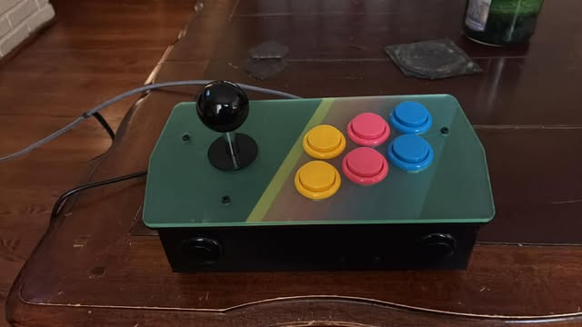
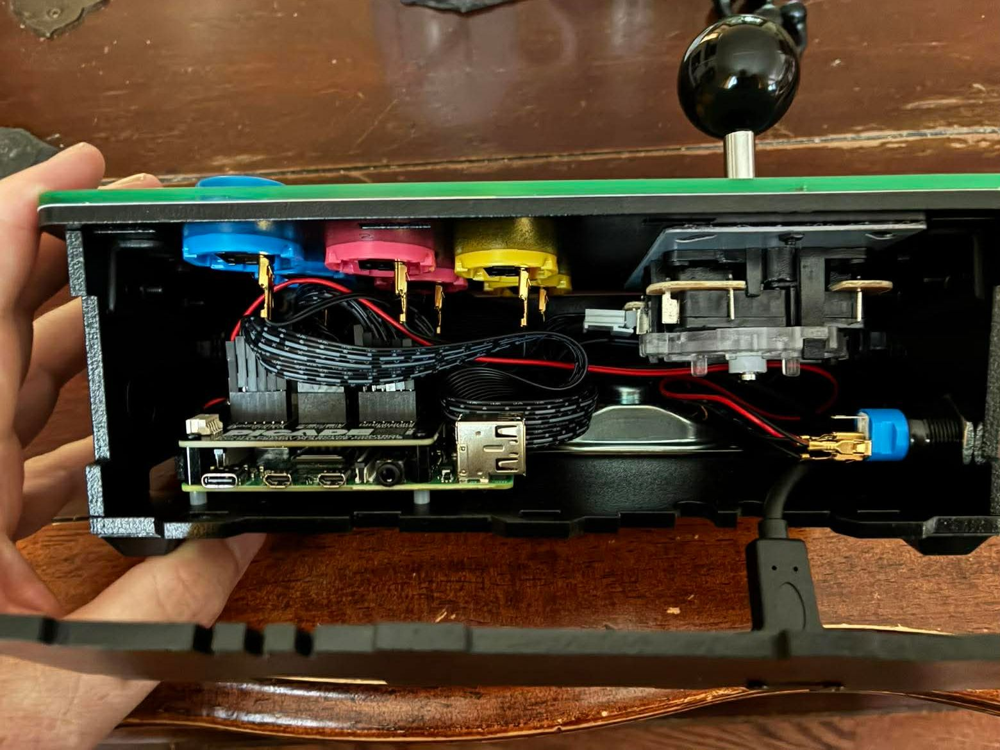
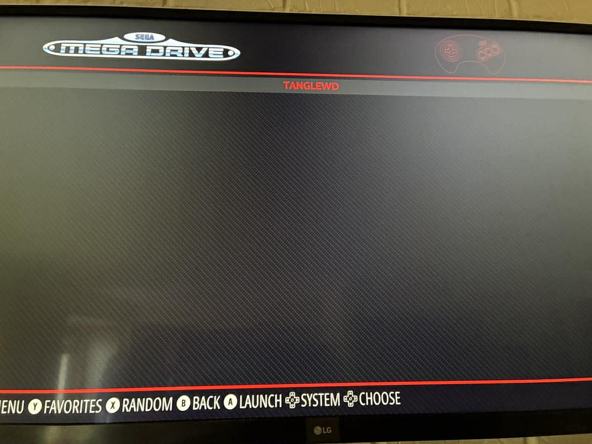
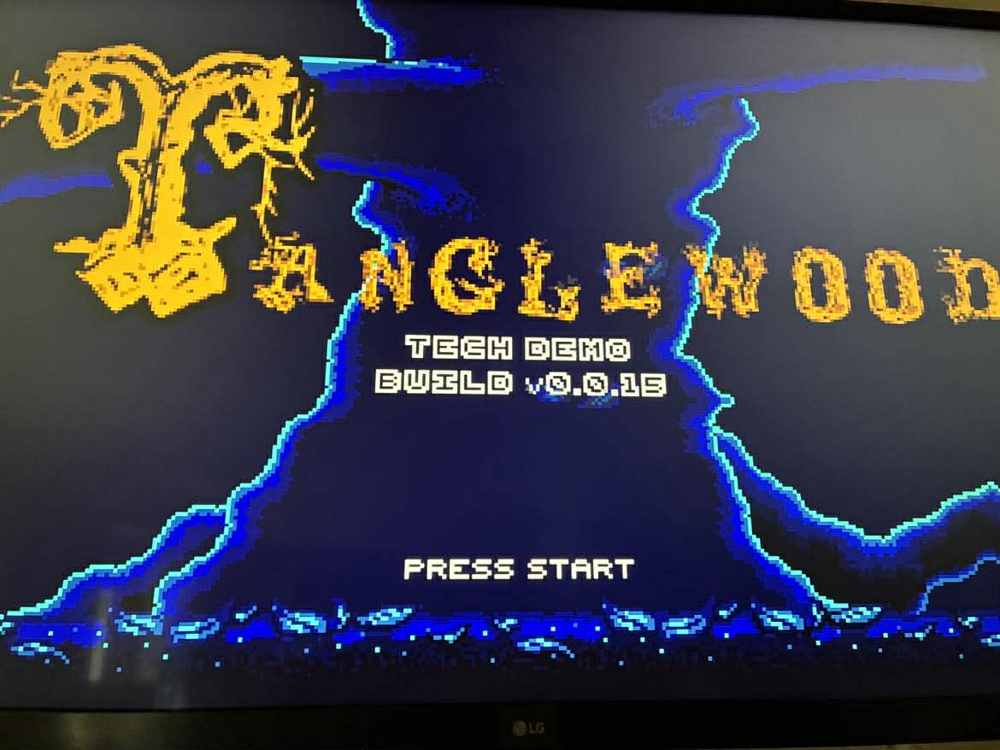
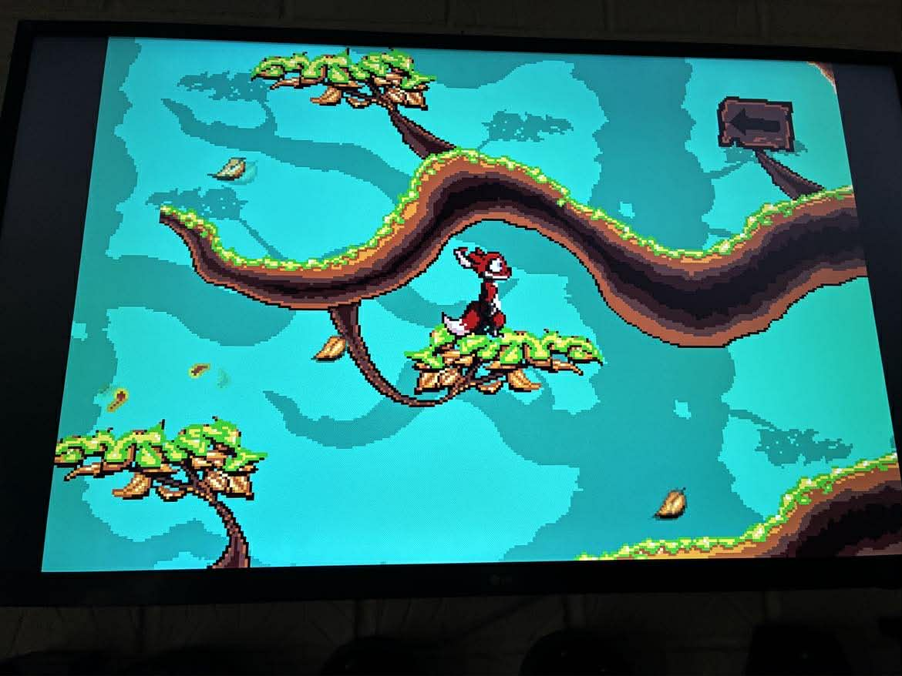

The [Pimoroni Picade](https://shop.pimoroni.com/products/picade) is a desktop mini arcade cabinet kit designed for the Raspberry Pi. It comes with an 8-inch display, a proper joystick, arcade buttons, and a laser-cut wooden enclosure — everything you need to build a compact retro gaming machine. This post covers building one from scratch, including a joystick wiring mistake that tripped me up along the way.

## Hardware Assembly

I followed [Pimoroni's assembly guide](https://learn.pimoroni.com/article/assembling-your-picade-console) to put the hardware together. The build was straightforward but I made one mistake: I inserted the joystick connector the wrong way around. I only noticed when RetroPie recognised upward movement on the joystick but ignored left, right, and down. After some research I found this is a well-known issue — flipping the connector fixed it immediately.


*The completed Picade console with its green acrylic top panel, joystick, and coloured arcade buttons*


*I opened up the case to check the internal wiring — the Raspberry Pi and button connectors are all packed in neatly*

## Software Setup

For the software I followed [Pimoroni's Picade setup guide](https://learn.pimoroni.com/article/setting-up-picade). I found it much easier to skip the recommended OS image and instead install Raspberry Pi OS Lite (64-bit) — a port of Debian Bookworm — directly, adding Wi-Fi details and enabling SSH during the Raspberry Pi Imager setup, then installing RetroPie as a separate step afterwards. This gave me a clean base to work from and made it easy to troubleshoot each stage independently.

To add my first ROM I copied it into the RetroPie roms directory:

```bash
cp ~/picade-hat/roms/megadrive/TANGLEWD.BIN ~/RetroPie/roms/megadrive
```


*EmulationStation showing the Sega Mega Drive game list with Tanglewood selected*


*The Tanglewood tech demo title screen — a homebrew Mega Drive game*


*I played through the Tanglewood demo, running across tree branches*

To copy further ROMs across the network I used `scp`:

```bash
scp -v 'xxx.zip' neil@picade.local:~/RetroPie/roms/arcade
```

## References

- [Assembling your Picade Console](https://learn.pimoroni.com/article/assembling-your-picade-console)

- [Setting Up Picade with Raspberry Pi 5](https://learn.pimoroni.com/article/setting-up-picade)

- [Pimoroni Picade Console Review and Tutorial: A Plug-and-Play Picade](https://www.electromaker.io/blog/article/pimoroni-picade-console-review-and-tutorial-a-plug-and-play-picade)

- [RetroPie: A Raspberry Pi Gaming Machine](https://www.youtube.com/watch?v=AaseHnf0k2o)
