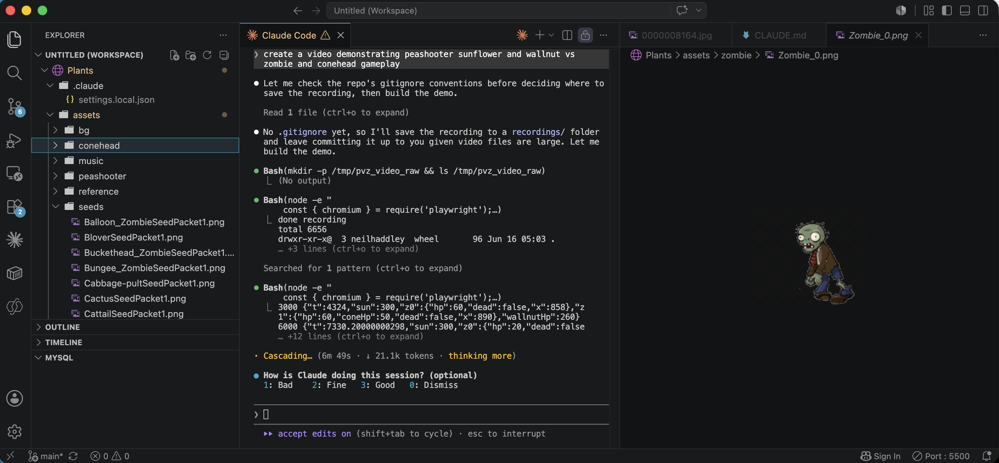
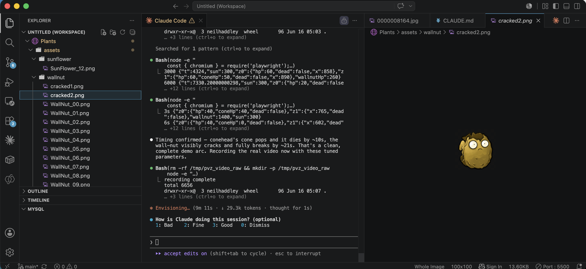
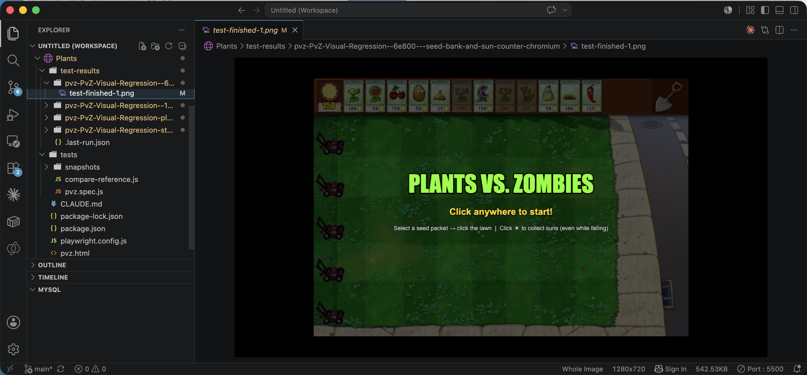
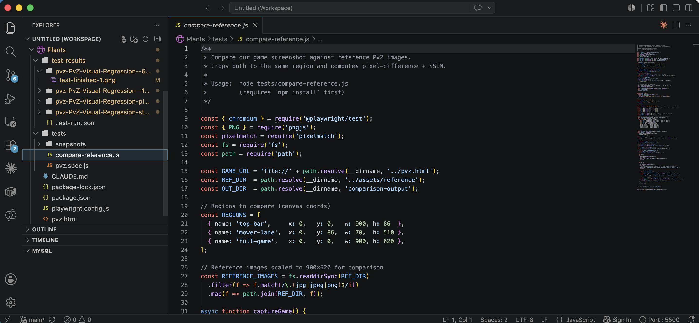

I spent a lazy evening vibe coding a Plants vs. Zombies clone with Claude Code. The whole game lives in a single vanilla JavaScript file running on an HTML5 canvas — no frameworks, no build step — with sprites pulled from the [UnityPlantsVsZombiesClone](https://github.com/HectorPulido/UnityPlantsVsZombiesClone) repo and the official [Plants vs. Zombies wiki](https://plantsvszombies.wiki.gg/wiki/Plants_vs._Zombies/Gallery). I had Claude Code set up a Playwright-based visual regression test that screenshots the running game and compares it pixel-by-pixel against reference images, so I can keep adding plants and zombies without breaking the layout.

*I recorded a demo video of the peashooter, sunflower, and wallnut fighting off a zombie and conehead*

*I asked Claude Code to create a video demonstrating sunflower and walnut vs zombie and conehead gameplay, and checked the .gitignore conventions before recording the demo*

*I watched Claude Code work through the walnut and sunflower sprite assets while timing crackedness for the demo*

*I generated a visual regression test that compares the finished game screen against a reference Plants vs. Zombies image*

*I reviewed the compare-reference.js script Claude Code wrote to crop matching regions and compute pixel-difference SSIM scores*

## References

- [UnityPlantsVsZombiesClone](https://github.com/HectorPulido/UnityPlantsVsZombiesClone)
- [Plants vs. Zombies/Gallery](https://plantsvszombies.wiki.gg/wiki/Plants_vs._Zombies/Gallery)
