I traced how Business Central determines the Inventory, Purchase, Tax, and Payables accounts for a Purchase Invoice, using the Inventory Posting Group, General Product Posting Group, General Business Posting Group, General Posting Setup, Tax Setup, and Vendor Posting Group.

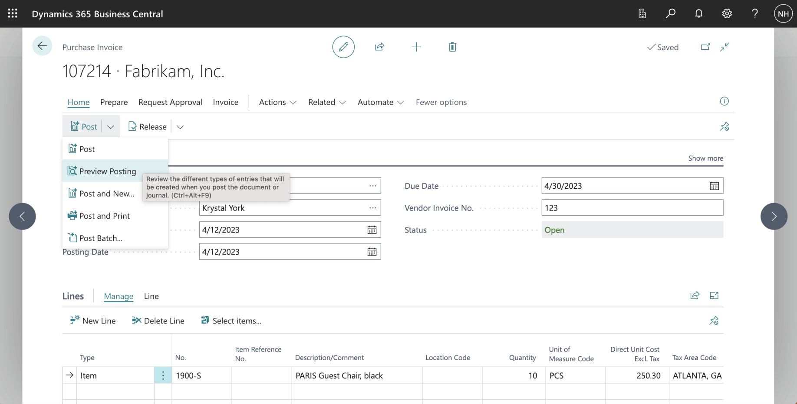
*I purchased a RETAIL RESALE item from a DOMESTIC vendor.*

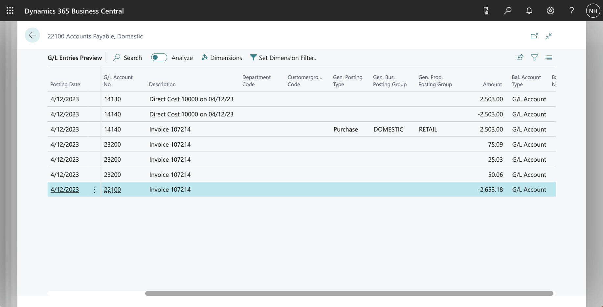
*I reviewed the General Ledger entries generated from the Purchase Invoice Document*

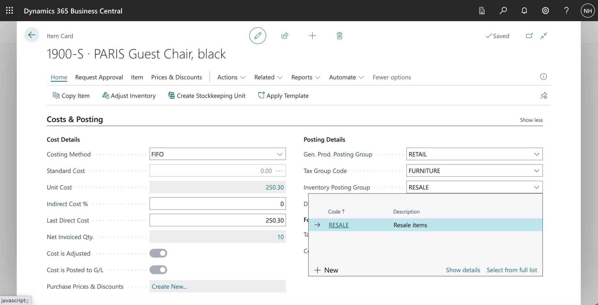
*The Item we are purchasing is a "RESALE" item. I clicked the Show details link.*

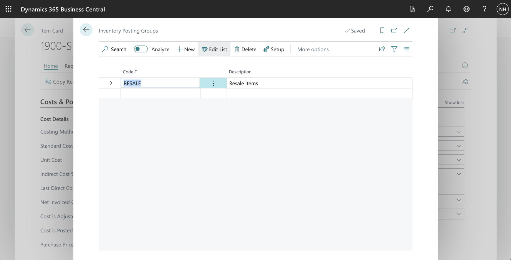
*RESALE is an Inventory Posting Group. I clicked on the Setup button.*

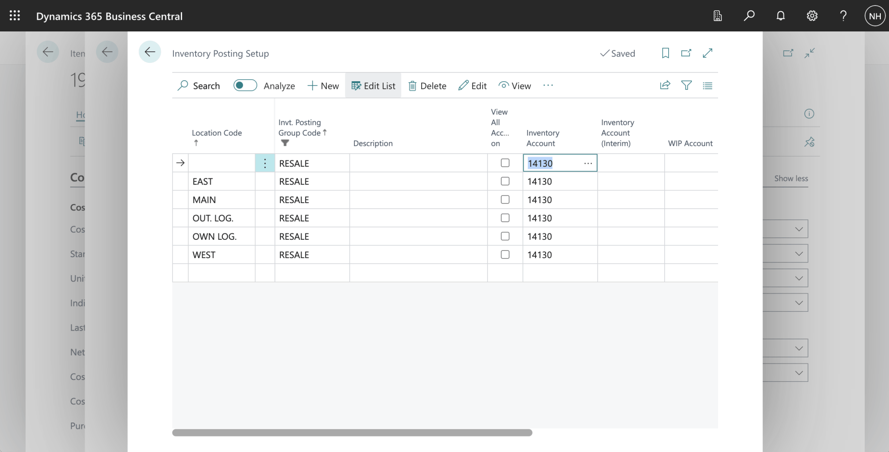
*When purchasing a RESALE item, the system uses account 14130 Finished Goods as the Inventory Account.*

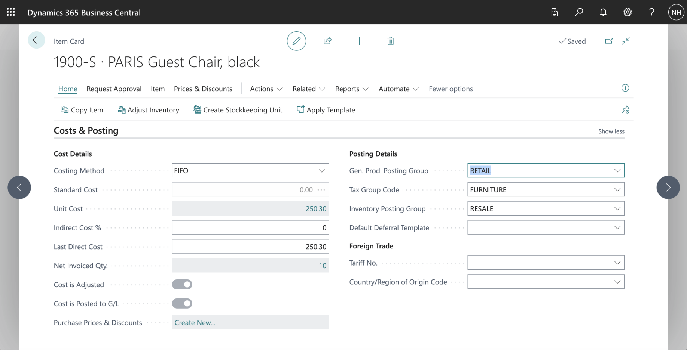
*The Item we are purchasing is a "RETAIL" item.*

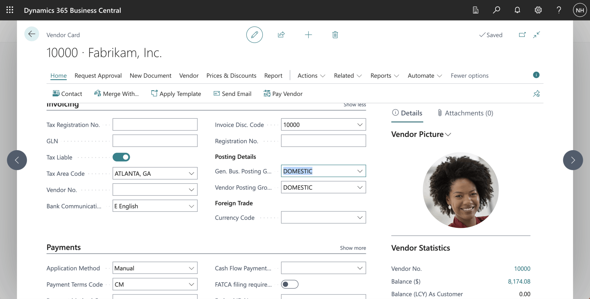
*The Vendor we are buying from is a "DOMESTIC" vendor.*

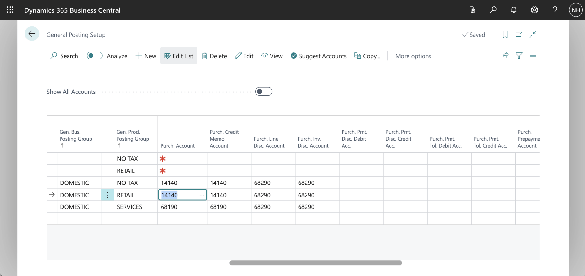
*When buying a RETAIL item from a DOMESTIC vendor, the system uses the 14140 Goods for Resale account to record the purchase*

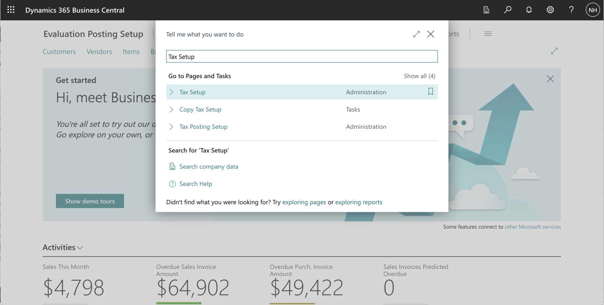
*I used search to navigate to the Tax Setup page*

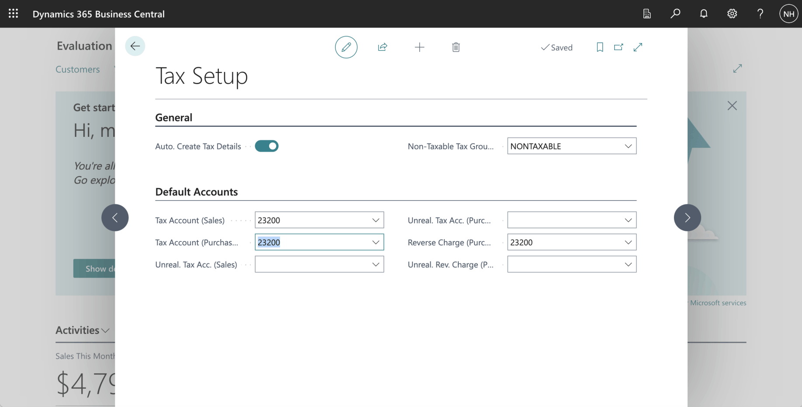
*When buying any item from any vendor, the system uses the 23200 Taxes Liable account to record City, County, and State tax.*

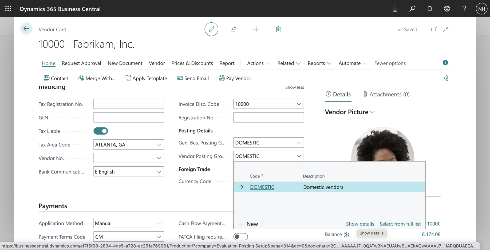
*The Vendor is a "DOMESTIC" vendor. I clicked the show details link*

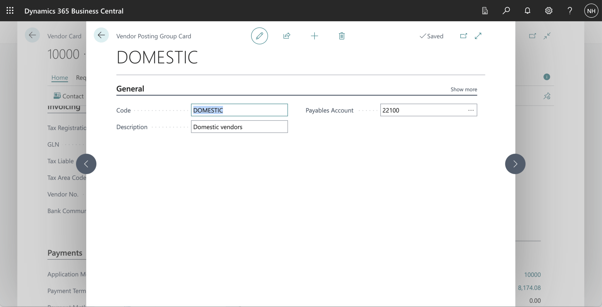
*When purchasing from a DOMESTIC vendor, the system uses 22100 Accounts Payable, Domestic as the Payables Account*