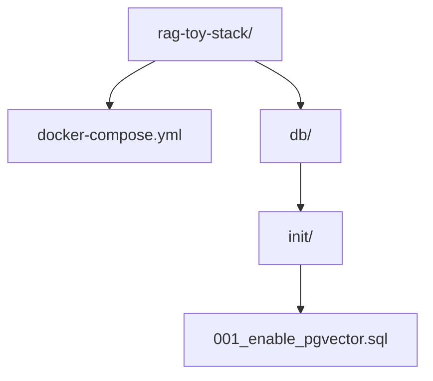
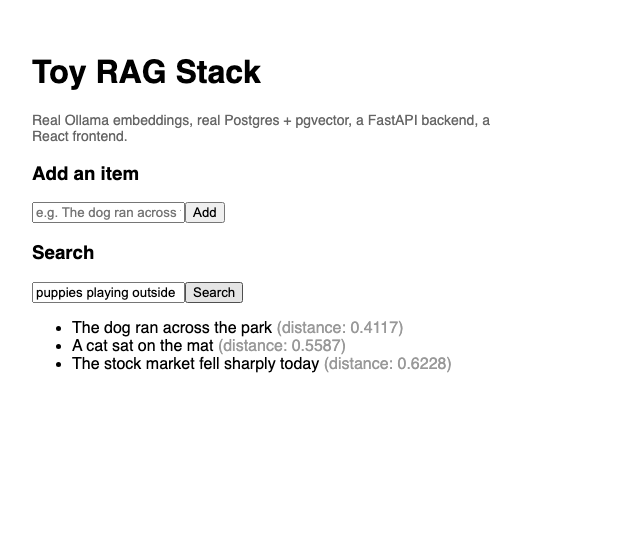
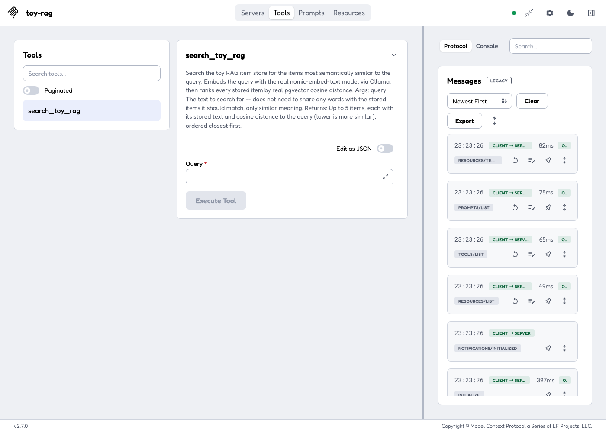
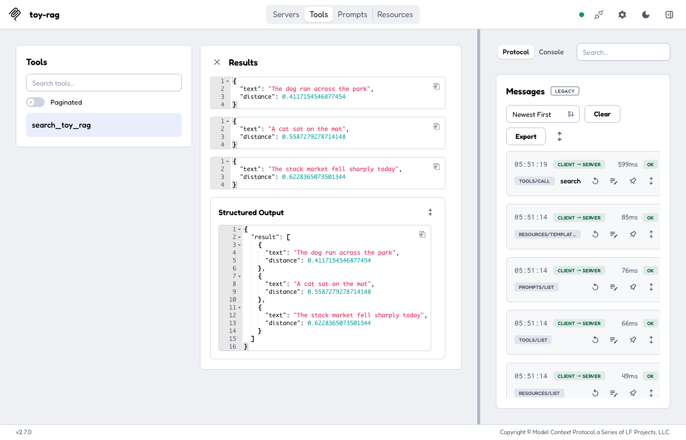
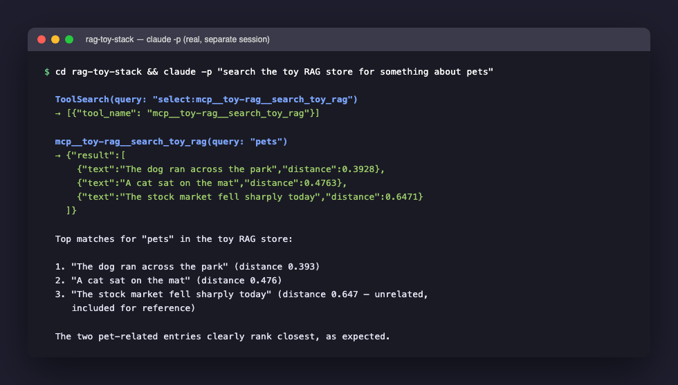

Retrieval-Augmented Generation, RAG for short, is the pattern behind most of the useful AI applications being built right now: instead of asking a language model to answer purely from what it happened to be trained on, you find the specific, real, relevant text first, hand that to the model as context, and ask it to answer from that. My [Agentic AI for Professionals](/posts/agenticaiforprofessionals5/) series traces this pattern in full inside a real, substantial application. This series is the opposite approach: the smallest possible version of the same pieces, built one at a time, so the mechanism itself is visible without a real app's features in the way.

Five phases, each one working and verified before moving to the next: Ollama answering from the command line, a real Postgres and pgvector container, a FastAPI backend that actually stores and searches real embeddings, a React frontend to use it from a browser, and finally exposing that same search function to Claude Code over MCP. Nothing here is simulated — every command below was actually run, and every output shown is the genuine result.

This post assumes very little prior knowledge. I explain what each command does, what each function does, and — just as important — why it exists at all. If a term shows up before I have explained it, I explain it at first use rather than assuming familiarity.

## What "Retrieval-Augmented Generation" actually means

Before touching a keyboard, it is worth being precise about the problem this whole series solves. A language model such as the ones Ollama runs locally, or the ones behind ChatGPT or Claude, only knows what was baked into it during training. It cannot see a file on my laptop, a row in my database, or a document I wrote yesterday, unless I put the actual text of that thing directly into the prompt I send it. RAG is the name for the pattern of doing that automatically: search for the handful of pieces of text most relevant to a question, and paste them into the prompt before asking the model to answer.

The word "retrieval" refers to that search step. The word "augmented" refers to the model's prompt being augmented — added to — with the retrieved text. "Generation" is just the model producing an answer, the same thing it always does. The interesting engineering problem, and the one this post is entirely about, is the retrieval step: given a question, how do you find the right piece of text out of a pile of thousands, without a human reading all of them first?

The answer this whole stack is built around is called a *vector embedding*, and Phase 1 below is where that idea gets made concrete rather than abstract.

## Phase 1 — Ollama, from the command line, no code at all

Before any Python or Docker, the one thing every later phase depends on: can a model on this machine turn text into a vector of numbers at all? [Ollama](https://ollama.com) is a local LLM host — already covered on this blog in an [earlier post about running DeepSeek locally](/posts/ollamadeepsekr1applemacbookinstall/) — and it exposes this over a plain local HTTP API, so the very first check needs nothing but `curl`.

`curl` is a command-line program for making HTTP requests — the same kind of request a web browser makes when it loads a page, except `curl` prints the raw response instead of rendering it. It ships on macOS and almost every Linux distribution by default, so no installation is needed here. Ollama, once installed and running, listens for HTTP requests on `localhost` (the machine's own network address, meaning "this computer, talking to itself") on port `11434`.

**Confirm Ollama is running and the embedding model is available:**

```bash
ollama list
```

`ollama` is Ollama's own command-line tool, separate from the HTTP API — it talks to the same background Ollama service, but through a friendlier interface than raw HTTP. `list` is a subcommand, the same way `git status` and `git commit` are both subcommands of `git`. This one asks the running Ollama service which models are currently downloaded onto this machine.

```
NAME                       ID              SIZE      MODIFIED
nomic-embed-text:latest    0a109f422b47    274 MB    4 minutes ago
qwen3.5:2b                 324d162be6ca    2.7 GB    26 hours ago
gemma4:12b                 4eb23ef187e2    7.6 GB    3 weeks ago
gemma4:26b                 5571076f3d70    17 GB     3 weeks ago
qwen2.5:14b                7cdf5a0187d5    9.0 GB    4 weeks ago
llama3.1:8b                46e0c10c039e    4.9 GB    4 weeks ago
```

Every row is a separate model file already downloaded to disk. The name before the colon is the model family; the part after the colon (`latest`, `2b`, `12b`) is a tag, usually describing a version or a parameter count — `2b` means roughly two billion parameters, a rough proxy for how large and capable, and how much memory-hungry, that model is. `nomic-embed-text` is the one this whole series depends on. The rest — `qwen3.5`, `gemma4`, `llama3.1` — are general-purpose chat models, unrelated to this post, left in the list only because they happen to already be installed on this machine.

If `nomic-embed-text` is not in that list, pull it: `ollama pull nomic-embed-text`. "Pull" is the same word Docker uses for downloading an image, and it means the same thing here — download this named artifact from a remote registry to local disk. It is a small (274 MB), fast, purpose-built embedding model — not a chat model, and not meant to answer questions, only to translate text into vectors. Feeding it a question and expecting a conversational answer back would not work; it has no capability to converse at all, only to embed.

**Ask it to actually embed something:**

```bash
curl -s http://localhost:11434/api/embeddings -d '{"model": "nomic-embed-text", "prompt": "hello world"}'
```

Breaking this command down piece by piece:

- `curl` — the program itself, as above.
- `-s` — "silent" mode: suppress `curl`'s own progress meter (the percentage/speed output it normally prints to the terminal), so only the actual server response appears. Without it, the output below would have a noisy progress bar mixed into it.
- `http://localhost:11434/api/embeddings` — the URL being requested. `localhost` means this machine; `11434` is the port Ollama's HTTP server listens on; `/api/embeddings` is the specific endpoint (a fixed, documented path) inside Ollama's API dedicated to turning text into a vector, as opposed to, say, `/api/generate`, which would ask a chat model to write a response.
- `-d '{"model": "nomic-embed-text", "prompt": "hello world"}'` — the `-d` flag tells `curl` to send this as the request body, and to automatically switch the HTTP method from `GET` (the default, used for simple "give me this page" requests with no body) to `POST` (used when the request is sending data, not just asking for something). The body itself is a JSON object — JSON, JavaScript Object Notation, is a plain-text way of writing structured data using `{}` for objects, `[]` for lists, and `"key": value` pairs inside them. This particular object has two fields: `model`, naming which model to use, and `prompt`, the actual text to embed.

The response is one JSON object with a single field, `embedding`, holding hundreds of floating-point numbers — long enough that reading its length and a preview is more useful than the raw output:

```
embedding length: 768
first 6 values: [-0.1523367315530777, -0.030708782374858856, -3.9119129180908203, 0.19170008599758148, 0.13367228209972382, 1.5930511951446533]
```

768 numbers, every time, for any input text — that fixed length is the entire contract this whole series is built on. Every one of those numbers is a floating-point number (a number with a decimal point, as opposed to an integer), and together the 768 of them describe one point in a 768-dimensional space. That is difficult to picture directly — humans reason comfortably in two or three dimensions — but the two-dimensional version is a fair mental model: imagine plotting every sentence as a dot on a page, positioned so that sentences about dogs cluster near each other, sentences about the stock market cluster somewhere else entirely, and the actual words used barely matter. `nomic-embed-text` is doing exactly that, just across 768 dimensions instead of two, which is what lets it capture far more nuance of meaning than a flat page ever could.

Two pieces of text with similar meaning end up as two vectors that are close together in that 768-dimensional space; two pieces of text with unrelated meaning end up far apart. Nothing about the numbers themselves means anything to a human reading them — there is no dimension labelled "dogginess" — what matters is only how close one vector sits to another, which is exactly what Phase 3 below asks Postgres to compute, using a specific mathematical definition of "close" called cosine distance, explained in full when it first appears.

## Phase 2 — a real, throwaway Postgres with pgvector

Postgres does not support the vector data type until the `pgvector` extension is enabled, and this needs a Postgres image that actually ships the extension's compiled binary — a plain `postgres` image is not enough. An "extension" in Postgres terms is an optional add-on package that adds new data types, functions, or operators to the database, without needing to modify Postgres's own source code — `pgvector` is one such package, adding a `vector` column type and the distance operators used later in this post.

Everything in this phase runs inside [Docker](https://www.docker.com), a tool for running software inside isolated, disposable "containers" — a container behaves like its own tiny virtual computer, with its own filesystem and processes, but starts in seconds and can be deleted and recreated at will without touching anything else on the host machine. That disposability is exactly why this post keeps calling the database "throwaway" — if anything goes wrong, the fix is to delete the container and start again, not to repair it.

**`docker-compose.yml`:**

```yaml
services:
  postgres:
    image: pgvector/pgvector:pg16
    container_name: rag-toy-postgres
    restart: unless-stopped
    environment:
      POSTGRES_USER: ${POSTGRES_USER:-rag}
      POSTGRES_PASSWORD: ${POSTGRES_PASSWORD:-rag}
      POSTGRES_DB: ${POSTGRES_DB:-rag_db}
    ports:
      - "5433:5432"
    volumes:
      - rag_pg_data:/var/lib/postgresql/data
      - ./db/init:/docker-entrypoint-initdb.d
    healthcheck:
      test: ["CMD-SHELL", "pg_isready -U ${POSTGRES_USER:-rag}"]
      interval: 5s
      timeout: 5s
      retries: 10

volumes:
  rag_pg_data:
```

`docker-compose.yml` is a configuration file read by `docker compose`, a tool for describing and running one or more related containers together as a single unit, rather than typing a long `docker run` command by hand for each one. Reading through every field:

- `services:` — the top-level list of containers this file describes. There is only one so far, named `postgres` — that name is how other services (added in later phases) will refer to it, and how commands like `docker compose up postgres` target it specifically.
- `image: pgvector/pgvector:pg16` — which pre-built container image to run, pulled from Docker Hub (a public registry of images, the same kind of registry Ollama's own model pulls come from) if not already present locally. This particular image is an official Postgres 16 build with the `pgvector` extension's binary already compiled in — using it saves having to compile `pgvector` from source inside a plain Postgres image.
- `container_name: rag-toy-postgres` — a fixed, human-readable name for the running container, used throughout this post in commands like `docker exec rag-toy-postgres ...`. Without this, Docker would generate a random name instead.
- `restart: unless-stopped` — tells Docker to automatically restart this container if it crashes, or after the host machine reboots, unless it was deliberately stopped by a person.
- `environment:` — environment variables passed into the container when it starts. Postgres's own startup scripts read `POSTGRES_USER`, `POSTGRES_PASSWORD`, and `POSTGRES_DB` specifically, and use them to create the first database user, its password, and the first database, the very first time the container starts against an empty volume (volumes are explained two bullets down). The `${POSTGRES_USER:-rag}` syntax means "use the value of the `POSTGRES_USER` environment variable from the host machine if one is set, otherwise fall back to the literal value `rag`" — a default that lets this file work out of the box with no extra setup, while still being overridable.
- `ports: - "5433:5432"` — maps port `5433` on the host machine to port `5432` inside the container, which is Postgres's own standard, fixed port. Anything connecting to `localhost:5433` from outside the container is transparently forwarded to port `5432` inside it. Port `5433`, not the default `5432`, is deliberate — it leaves the default port free for any other real Postgres already running on the same machine, which is a real, common situation on a development laptop.
- `volumes:` — two separate mappings, both in the form `host-side:container-side`. `rag_pg_data:/var/lib/postgresql/data` maps a Docker-managed named volume (persistent storage that survives the container being deleted and recreated, defined at the bottom of the file under the top-level `volumes:` key) onto the exact directory where Postgres stores all its actual data files — without this, every row of data would vanish the moment the container was removed. `./db/init:/docker-entrypoint-initdb.d` maps a local folder on the host straight into a special directory Postgres's own startup script watches: any `.sql` file placed there is run automatically, in filename order, but only the very first time the container starts against a brand-new, empty data volume.
- `healthcheck:` — a periodic command Docker itself runs *inside* the container to decide whether it is genuinely ready to accept connections yet, as opposed to merely "started" — a process can be running before it is actually able to do useful work. `test: ["CMD-SHELL", "pg_isready -U ${POSTGRES_USER:-rag}"]` runs Postgres's own `pg_isready` utility, which checks specifically whether the database is accepting connections. `interval: 5s` checks every five seconds; `timeout: 5s` gives each individual check five seconds to respond before counting it as a failure; `retries: 10` allows up to ten consecutive failures before Docker marks the container as unhealthy. This healthcheck becomes important in Phase 3, where the backend service is told to wait for it before starting.

**`db/init/001_enable_pgvector.sql`** — runs automatically, exactly once, the first time the container starts against an empty volume, because it lives inside the `./db/init` folder mapped above:

```sql
CREATE EXTENSION IF NOT EXISTS vector;
```

This is one line of plain SQL (Structured Query Language, the language used to talk to a relational database like Postgres). `CREATE EXTENSION` is a Postgres-specific SQL command that activates an installed extension package inside the current database — `vector` is the name `pgvector` registers itself under. `IF NOT EXISTS` makes the statement safe to run more than once: without it, running this same file again against a database that already has the extension enabled would raise an error and stop the initialization; with it, Postgres silently does nothing if the extension is already active.

Before running `docker compose up`, the folder on disk needs to look exactly like this — the `docker-compose.yml` file, sitting next to a `db/init/` folder containing the SQL file above:



If `db/init/` does not exist yet, or exists but is empty, Postgres has nothing to run: it starts up with the `vector` extension available (built into the image) but not activated in the database, and `\dx` will list only `plpgsql`, the same as any other Postgres, with no obvious error to point at the missing file. Creating the folder and the file, then bringing the container up, is not optional setup on the side — it is a required part of this step.

The filename itself does not matter to Postgres beyond one rule: every file directly inside `db/init/` matching `*.sql`, `*.sql.gz`, or `*.sh` runs automatically, in plain alphabetical order by filename, the first time the container starts against an empty data volume. `001_enable_pgvector.sql` could equally be named `enable-pgvector.sql` or `a.sql` and behave identically, since this folder only ever needs the one file. The numeric prefix matters only once more than one file is present — for example a second file named `002_seed_data.sql` — where the leading numbers guarantee it runs after `001_enable_pgvector.sql` rather than before it, which matters here because seed data referencing the `vector` type would fail if it ran before the extension existed. Adding more files this way is exactly how larger, real projects split their own database setup into ordered steps: one file per extension or table, run once, in a fixed sequence.

Bring it up and check the extension activated, independently of any application code:

```bash
docker compose up -d postgres
docker exec rag-toy-postgres psql -U rag -d rag_db -c "\dx"
```

`docker compose up -d postgres` starts the `postgres` service defined above. `up` means "create and start the containers described in this file"; `-d` stands for "detached" — run it in the background and return control of the terminal immediately, rather than staying attached and printing the container's logs directly into the current terminal session forever; `postgres` at the end names which single service to start, since later phases add others that should not necessarily start at the same time.

`docker exec rag-toy-postgres psql -U rag -d rag_db -c "\dx"` runs a brand-new command *inside* the already-running `rag-toy-postgres` container — `exec` is how you run a one-off command inside a container that is already up, as distinct from `docker run`, which would create a whole new container. The command being run inside it is `psql`, Postgres's own interactive command-line client, with `-U rag` selecting which database user to connect as (matching the `POSTGRES_USER` set above), `-d rag_db` selecting which database to connect to, and `-c "\dx"` telling `psql` to run one command non-interactively and then exit, rather than dropping into its interactive prompt. `\dx` is one of `psql`'s own special "meta-commands" (recognisable by the leading backslash, and understood by `psql` itself rather than being SQL sent to the server) — specifically, the one that lists every extension currently enabled in the connected database.

```
                             List of installed extensions
  Name   | Version |   Schema   |                     Description
---------+---------+------------+------------------------------------------------------
 plpgsql | 1.0     | pg_catalog | PL/pgSQL procedural language
 vector  | 0.8.6   | public     | vector data type and ivfflat and hnsw access methods
(2 rows)
```

`plpgsql` is a procedural language extension that ships enabled in every Postgres database by default, unrelated to this post. The `vector` row is the one that matters: it confirms `pgvector` version `0.8.6` genuinely activated, and its own description already hints at two indexing strategies, `ivfflat` and `hnsw`, that speed up similarity search on very large tables — not needed at this toy scale of a handful of rows, but the reason `pgvector` exists as a specialised extension rather than something achievable with plain SQL alone.

If `\dx` shows only `plpgsql`, with no `vector` row, the init script never ran — most likely because `db/init/` was missing or empty the first time the container started against an empty volume. The fix is not to add the file and restart the container: Postgres only ever runs those init scripts once, the very first time, against a data directory with nothing in it yet, and a container that already started once already has a non-empty data directory, so simply restarting it changes nothing. What is needed is to remove that data directory and let Postgres initialize from scratch, and the volume is exactly where that data directory lives:

```bash
docker compose down -v
docker compose up -d postgres
```

`docker compose down` stops and removes the containers for every service in `docker-compose.yml`, along with the network Compose created for them, but by default leaves named volumes — and therefore all stored data — untouched, so a plain `down` followed by `up` again would still skip the init scripts, for the same reason a restart would. The `-v` flag changes that: it additionally removes every named volume declared under this file's top-level `volumes:` key, which here means `rag_pg_data`, deleting the actual Postgres data directory along with it. The next `docker compose up -d postgres` then has to create that volume fresh and empty, which is precisely the condition that makes Postgres run everything in `db/init/` again. This is also the correct way to wipe this toy database back to empty at any point, not just to recover from a missed init file — there is no separate "reset" command, only delete the volume and let it be recreated.

A real, running database, with nothing in it yet, ready for Phase 3 to write to.

## Phase 3 — a minimal FastAPI backend, with real embeddings

Two endpoints: one to add a piece of text (embed it for real, store it), one to search (embed the query for real, ask Postgres which stored vectors are closest). [FastAPI](https://fastapi.tiangolo.com) is a Python web framework — a library that handles the mechanics of receiving HTTP requests and sending HTTP responses, so the application code only has to describe what should happen for each specific URL.

**`backend/main.py`:**

```python
import os
from contextlib import asynccontextmanager

import httpx
import psycopg
from fastapi import FastAPI
from fastapi.middleware.cors import CORSMiddleware
from pydantic import BaseModel

DATABASE_URL = os.environ["DATABASE_URL"]
OLLAMA_BASE_URL = os.environ.get("OLLAMA_BASE_URL", "http://host.docker.internal:11434")
EMBED_MODEL = "nomic-embed-text"
EMBED_DIM = 768


def embed(text: str) -> list[float]:
    with httpx.Client(timeout=30.0) as client:
        response = client.post(
            f"{OLLAMA_BASE_URL}/api/embeddings",
            json={"model": EMBED_MODEL, "prompt": text},
        )
        response.raise_for_status()
        return response.json()["embedding"]


def as_vector_literal(vec: list[float]) -> str:
    return "[" + ",".join(str(v) for v in vec) + "]"


@asynccontextmanager
async def lifespan(app: FastAPI):
    with psycopg.connect(DATABASE_URL) as conn:
        conn.execute(
            f"CREATE TABLE IF NOT EXISTS items (id serial PRIMARY KEY, text text NOT NULL, embedding vector({EMBED_DIM}) NOT NULL)"
        )
        conn.commit()
    yield


app = FastAPI(lifespan=lifespan)
app.add_middleware(CORSMiddleware, allow_origins=["*"], allow_methods=["*"], allow_headers=["*"])


class Item(BaseModel):
    text: str


@app.post("/items")
def add_item(item: Item) -> dict:
    vec = embed(item.text)
    with psycopg.connect(DATABASE_URL) as conn:
        conn.execute(
            "INSERT INTO items (text, embedding) VALUES (%s, %s::vector)",
            (item.text, as_vector_literal(vec)),
        )
        conn.commit()
    return {"text": item.text, "embedding_length": len(vec)}


@app.get("/search")
def search(q: str) -> list[dict]:
    vec = as_vector_literal(embed(q))
    with psycopg.connect(DATABASE_URL) as conn:
        rows = conn.execute(
            "SELECT text, embedding <=> %s::vector AS distance FROM items ORDER BY distance LIMIT 5",
            (vec,),
        ).fetchall()
    return [{"text": text, "distance": float(distance)} for text, distance in rows]
```

Working through this file top to bottom:

**Imports.** `os` is Python's standard library module for reading environment variables and other operating-system details. `asynccontextmanager` is a helper for writing a special kind of function, explained below, used for FastAPI's startup/shutdown logic. `httpx` is a third-party HTTP client library — the Python equivalent of the `curl` command from Phase 1, used here to make the exact same call to Ollama's `/api/embeddings` endpoint, but from inside Python code instead of a terminal. `psycopg` is the standard Python driver for talking to Postgres — the library responsible for actually opening a network connection to the database and sending it SQL. `FastAPI` is the web framework class itself; `CORSMiddleware` is explained below, at the point it is used. `BaseModel`, from the `pydantic` library, is explained below too.

**Configuration constants.** `DATABASE_URL = os.environ["DATABASE_URL"]` reads an environment variable named `DATABASE_URL` and crashes immediately, at import time, with a `KeyError`, if it is not set — a deliberate choice: this value is required for the application to function at all, so failing loudly and immediately is more useful than limping along with a missing setting. `OLLAMA_BASE_URL = os.environ.get("OLLAMA_BASE_URL", "http://host.docker.internal:11434")` uses `.get()` with a second argument instead, which supplies a default and does not crash if the variable is absent — appropriate here because a sensible default exists. `host.docker.internal` is a special hostname Docker Desktop provides specifically so that a process running inside a container can reach a service (Ollama, in this case) running on the host machine itself, outside any container — from inside a container, `localhost` would refer to the container itself, not the host, which is precisely why this special hostname needs to exist at all. `EMBED_MODEL` and `EMBED_DIM` are fixed constants matching Phase 1's findings exactly — `nomic-embed-text` always returns exactly 768 numbers, and that number is needed again below when creating the database table.

**`embed(text: str) -> list[float]`.** This function's type hints — `text: str` and `-> list[float]` — are Python's optional way of documenting that this function takes a string in and returns a list of floating-point numbers out; they are not enforced automatically at runtime by plain Python, but FastAPI and other tools read them to generate documentation and validation elsewhere in this stack. Inside, `with httpx.Client(timeout=30.0) as client:` opens an HTTP client configured to give up and raise an error if any request takes longer than 30 seconds, and — because of the `with` keyword — guarantees the client's underlying network resources are cleaned up automatically when the block ends, even if an error occurs partway through. `client.post(...)` sends an HTTP POST request — the exact same kind of request `curl -d` sent in Phase 1 — to Ollama's embeddings endpoint, with `json={"model": EMBED_MODEL, "prompt": text}` automatically converting that Python dictionary into a JSON request body, identical in shape to the JSON typed by hand into `curl` earlier. `response.raise_for_status()` checks the HTTP status code Ollama sent back, and raises a Python exception if it indicates an error (anything in the 400s or 500s), rather than silently continuing with a failed response. `response.json()["embedding"]` parses the JSON response body back into a Python dictionary and pulls out the `embedding` field — the same 768-number list Phase 1 first inspected by hand.

**`as_vector_literal(vec: list[float]) -> str`.** Postgres's `pgvector` extension expects a vector value written as a specific text format when it appears inside a SQL statement: square brackets around a comma-separated list of numbers, such as `[0.1,0.2,0.3]`. This function is a small, direct translation from Python's own list-of-floats representation into that exact text format, so it can be embedded into a SQL query string.

**`lifespan` and `@asynccontextmanager`.** `async def` defines an asynchronous function — one that can pause partway through (at an `await`, though this particular function has none) and let other work happen, rather than blocking the entire program while it waits. The `@asynccontextmanager` decorator (a decorator is a function that wraps another function to add behaviour to it, applied using the `@` syntax directly above a function definition) turns this particular async function into something usable in a `with`/`async with` block, split into a "before" half (everything above `yield`) and an "after" half (anything below it, though there is none here). FastAPI calls this specific function once when the application starts up, and again when it shuts down, because it was registered via `app = FastAPI(lifespan=lifespan)`. The body opens a database connection and runs `CREATE TABLE IF NOT EXISTS items (...)` — creating the one table this whole backend needs, but only if it does not already exist, making it safe to restart the backend repeatedly without ever wiping existing data. The table has three columns: `id serial PRIMARY KEY` (an auto-incrementing whole number, unique per row, and the table's primary key — the column Postgres uses internally to uniquely identify each row); `text text NOT NULL` (the actual stored sentence, required, never blank); and `embedding vector(768) NOT NULL` (a `pgvector` column fixed at exactly 768 numbers per row, matching `EMBED_DIM` — attempting to insert a vector of any other length into this column would be rejected by Postgres itself). `conn.commit()` finalises the change — Postgres transactions are not saved permanently until explicitly committed, a safety mechanism that allows multiple statements to be grouped and rolled back together if something goes wrong partway through. `yield` is the point where the "before" half ends and FastAPI actually starts serving requests; nothing runs after it here, but the syntax requires a `yield` regardless, marking where the application's running lifetime sits relative to this setup code.

**Middleware.** `app.add_middleware(CORSMiddleware, allow_origins=["*"], allow_methods=["*"], allow_headers=["*"])` — CORS, Cross-Origin Resource Sharing, is a browser security rule that blocks a web page loaded from one address (in Phase 4, the React app running on port `5174`) from making requests to a different address (this backend, on port `8001`), unless the server explicitly says it is allowed to. This line adds that explicit permission, configured here as wide open (`"*"` meaning "any origin, any method, any header") because this is a disposable, local-only toy — a real production service would list only the specific origins it actually expects requests from.

**`class Item(BaseModel): text: str`.** `pydantic`'s `BaseModel` is a base class for describing the exact shape of expected data. Declaring `text: str` here means: any request that FastAPI hands to a function expecting an `Item` must include a JSON object with a `text` field that is a string; if it is missing, or is a number instead of a string, FastAPI rejects the request automatically, before the application's own code ever runs, and returns a descriptive error to the caller.

**`@app.post("/items") def add_item(item: Item) -> dict:`.** `@app.post("/items")` is a decorator registering this function to run whenever an HTTP POST request arrives at the path `/items` — this is FastAPI's core mechanism: decorate a plain function with the HTTP method and path it should handle, and FastAPI takes care of routing incoming requests to it. Because the function's parameter is typed as `item: Item`, FastAPI automatically parses the incoming JSON request body against the `Item` model defined above, validates it, and hands back a ready-to-use Python object — none of that parsing or validation code needs to be written by hand. Inside the function, `vec = embed(item.text)` calls the function defined earlier to turn the submitted text into its 768-number embedding, for real, over the network, against the real Ollama server. `with psycopg.connect(DATABASE_URL) as conn:` opens a fresh database connection for this one request. `conn.execute("INSERT INTO items (text, embedding) VALUES (%s, %s::vector)", (item.text, as_vector_literal(vec)))` runs a parameterised SQL `INSERT` statement — the `%s` placeholders are filled in safely by `psycopg` from the tuple passed as the second argument, rather than the code building a raw SQL string by hand with the text pasted directly into it. This distinction matters for security: pasting user-supplied text directly into a SQL string is how SQL injection attacks happen, where malicious input is crafted to change the meaning of the query itself; parameterised queries like this one are immune to that, because the database driver keeps the query structure and the data cleanly separate no matter what the data contains. The `::vector` after the second placeholder is a Postgres type cast, telling Postgres to interpret that particular text value specifically as the `vector` type rather than a plain string. `conn.commit()` saves the insert permanently, as before. The function returns a plain Python dictionary, which FastAPI automatically converts into a JSON response — `{"text": item.text, "embedding_length": len(vec)}`, a small confirmation rather than echoing back all 768 numbers.

**`@app.get("/search") def search(q: str) -> list[dict]:`.** `@app.get("/search")` registers this one for HTTP GET requests instead — GET is the appropriate method here because searching does not change any stored data, only reads it, which is exactly the distinction GET versus POST is meant to signal. `q: str`, as a plain function parameter not wrapped in a Pydantic model, tells FastAPI to expect this value as a URL query parameter instead of a JSON body — the `?q=...` seen in every `curl` call against this endpoint later in this post. The function embeds the query text using the same `embed()` function used for stored items — critically the *same* function, the *same* model — which is what makes comparing the two vectors meaningful at all; embedding the query with a different model would produce numbers that are not comparable to the stored ones, even if both models nominally produce 768 dimensions. `conn.execute("SELECT text, embedding <=> %s::vector AS distance FROM items ORDER BY distance LIMIT 5", (vec,))` is the one line where all of the earlier setup pays off. `<=>` is `pgvector`'s cosine-distance operator — it takes two vectors and returns a single number describing how different their directions are: `0` means identical direction (as similar as two vectors can be), and larger numbers mean increasingly different. `ORDER BY distance` sorts every stored row by that number, smallest (most similar) first, and `LIMIT 5` caps the result at the five closest matches, even if the table holds far more rows than that. `.fetchall()` pulls every matching row back from the database into Python as a list of tuples. The final line, a list comprehension, reshapes each `(text, distance)` tuple into a small dictionary, converting `distance` explicitly to a plain Python `float` — `psycopg` can return database numeric types in a form that does not serialise cleanly to JSON on its own, so this conversion avoids a subtle serialisation error.

`OLLAMA_BASE_URL` defaults to `host.docker.internal` — the hostname Docker Desktop provides specifically so a container can reach a service (Ollama) running on the host machine rather than inside another container. `embed()` is a real HTTP call to the exact endpoint Phase 1 tested by hand; `add_item` and `search` both call it, so the query and every stored item are embedded by the identical model, which is what makes comparing them meaningful at all.

**`backend/requirements.txt`** — saved next to `main.py`, in the same `backend/` folder, since the `Dockerfile` below copies it from there:

```
fastapi==0.115.6
uvicorn[standard]==0.32.1
psycopg[binary]==3.2.3
httpx==0.28.1
```

One line per package, each pinned to an exact version with `==` — pinning matters here because an unpinned `pip install fastapi` would silently pull whatever the newest compatible release of every dependency happens to be on the day it runs, including `pydantic` itself (a dependency of `fastapi`, not listed here directly), which can quietly change behaviour between versions. `uvicorn[standard]` installs `uvicorn` with its optional "standard" extras (faster networking libraries, and support for auto-reload), rather than the bare minimum install. `psycopg[binary]` installs the pre-compiled binary build of the Postgres driver rather than one that compiles a C extension from source at install time, avoiding the need for system-level build tools inside the image. (Phase 5 adds one more line, `mcp==2.0.0`, to this same file.)

**`backend/Dockerfile`:**

```dockerfile
FROM python:3.12-slim
WORKDIR /app
COPY requirements.txt .
RUN pip install --no-cache-dir -r requirements.txt
COPY main.py .
EXPOSE 8000
CMD ["uvicorn", "main:app", "--host", "0.0.0.0", "--port", "8000", "--reload"]
```

A `Dockerfile` is a recipe for building a container image, read top to bottom as a sequence of steps. `FROM python:3.12-slim` starts from an existing, official base image that already has Python 3.12 installed, with `slim` indicating a smaller variant containing less bundled software than the default image, to keep the final image size down. `WORKDIR /app` sets the working directory inside the image for every subsequent instruction, creating the folder if it does not already exist. `COPY requirements.txt .` copies just that one file from the host into the image first, before the rest of the source code — a deliberate ordering, because Docker caches each step, and this means the (slow) dependency-installation step below only needs to re-run when `requirements.txt` itself actually changes, not every time application code changes. `RUN pip install --no-cache-dir -r requirements.txt` installs every Python package listed in that file — `fastapi`, `uvicorn`, `psycopg[binary]`, `httpx`, and (added in Phase 5) `mcp` — with `--no-cache-dir` telling `pip` not to keep its own download cache, again to keep the final image smaller. `COPY main.py .` copies the actual application code in, now that dependencies are already installed. `EXPOSE 8000` documents, for humans and tooling, that this container listens on port 8000 — it does not by itself make the port reachable from outside; that is `docker-compose.yml`'s job, done the same way Phase 2 mapped Postgres's port. `CMD [...]` is the command run when a container starts from this image: `uvicorn`, an ASGI server (a program whose job is to accept incoming HTTP connections and hand each one to Python application code — FastAPI itself does not listen on a network port directly), told to serve `app` (the `FastAPI` instance) found inside `main.py`, bound to `0.0.0.0` (meaning "accept connections from any network interface," required for other containers and the host to reach it, since `localhost` inside a container would only accept connections from within that same container) on port 8000, with `--reload` telling `uvicorn` to watch source files and restart automatically on changes.

That last flag comes with a real caveat specific to this setup: `--reload` only watches files *inside the container*, and nothing here keeps the container's copy in sync with an edit made on the host afterward — see "Making changes to the backend" at the end of this phase for exactly what that means and how to actually get an edit to take effect.

**`docker-compose.yml`, with `backend` added as a second service**, directly below the `postgres` service Phase 2 already defined:

```yaml
services:
  postgres:
    # ... unchanged from Phase 2 ...

  backend:
    build: ./backend
    container_name: rag-toy-backend
    restart: unless-stopped
    environment:
      DATABASE_URL: postgresql://${POSTGRES_USER:-rag}:${POSTGRES_PASSWORD:-rag}@postgres:5432/${POSTGRES_DB:-rag_db}
    ports:
      - "8001:8000"
    depends_on:
      postgres:
        condition: service_healthy

volumes:
  rag_pg_data:
```

`build: ./backend` tells Compose to build an image from the `Dockerfile` in that folder, rather than pulling a pre-built one the way `postgres` does. `DATABASE_URL` uses `postgres` — the *service name* — as the hostname, not `localhost` and not the `5433` port Phase 2 mapped: Compose places every service in one file on a shared internal network and gives each one a DNS name matching its service name, so from inside the `backend` container, `postgres:5432` (Postgres's normal internal port) reaches the database directly. The `5433:5432` mapping from Phase 2 only matters for reaching Postgres from the host machine — from one container to another, that mapping does not apply at all. `depends_on: postgres: condition: service_healthy` is exactly why Phase 2 defined a `healthcheck` at all — without it, `depends_on` could only wait for the postgres *container* to start, not for Postgres itself to actually be ready to accept connections, and the backend's very first startup query could fail with a connection error in that gap.

Brought up with `docker compose up -d --build backend`, where `--build` tells Docker Compose to build the image from the `Dockerfile` fresh — including re-running any changed steps — rather than reusing a previously built image; Compose starts `postgres` first automatically, because `backend` depends on it:

```bash
docker compose up -d --build backend
```

The `lifespan` function above runs the moment the backend container starts, before it accepts any requests, so the `items` table already exists at this point — nothing further needs to be run by hand to create it. Confirmed independently, the same way Phase 2 confirmed the extension activated, before trusting any application code:

```bash
docker exec rag-toy-postgres psql -U rag -d rag_db -c "\d items"
```

```
                                Table "public.items"
  Column   |    Type     | Collation | Nullable |              Default
-----------+-------------+-----------+----------+-----------------------------------
 id        | integer     |           | not null | nextval('items_id_seq'::regclass)
 text      | text        |           | not null |
 embedding | vector(768) |           | not null |
Indexes:
    "items_pkey" PRIMARY KEY, btree (id)
```

The table, its three columns, and the auto-incrementing sequence backing `id` all exist, all created by the backend's own startup code, with nothing inserted into it yet. Now tested with three genuinely different sentences and one query that names none of them directly:

```bash
curl -X POST localhost:8001/items -H "Content-Type: application/json" -d '{"text": "The dog ran across the park"}'
curl -X POST localhost:8001/items -H "Content-Type: application/json" -d '{"text": "A cat sat on the mat"}'
curl -X POST localhost:8001/items -H "Content-Type: application/json" -d '{"text": "The stock market fell sharply today"}'
curl "localhost:8001/search?q=puppies%20playing%20outside"
```

The first three commands each use `-X POST` (explicitly naming the HTTP method, needed here because, unlike Phase 1's call straight to Ollama, `curl -d` alone would still default the method to POST, but being explicit removes any ambiguity) together with `-d` to send one JSON body each to `/items`, triggering `add_item()` above three times, once per sentence — each one is genuinely, separately embedded by Ollama and genuinely, separately written to the `items` table. `-H "Content-Type: application/json"` is required here: `curl -d` on its own defaults to sending `Content-Type: application/x-www-form-urlencoded`, and FastAPI's body parsing needs the header to explicitly say `application/json` before it will parse the request body as the `Item` model at all — without it, the whole raw JSON text arrives as a single unparsed string, and FastAPI rejects it with a 422 error rather than a dictionary with a `text` field. The fourth command is a plain `GET` request (no `-X` or body needed, since GET is `curl`'s default and this one sends no data) against `/search`, with the query text placed directly in the URL after `?q=`. `%20` is a URL-encoded space — spaces are not valid characters inside a URL, so they must be escaped; `puppies%20playing%20outside` decodes back to `puppies playing outside` on the server side before ever reaching `embed()`.

```json
[
  {"text": "The dog ran across the park", "distance": 0.4117},
  {"text": "A cat sat on the mat", "distance": 0.5587},
  {"text": "The stock market fell sharply today", "distance": 0.6228}
]
```

Nothing in the query — "puppies playing outside" — shares a single word with "The dog ran across the park," and yet it ranks closest, by a real margin, over the cat sentence, which in turn ranks well ahead of the unrelated stock-market sentence. That ordering is not a coincidence or a cherry-picked result; it is the entire point of an embedding model — it is comparing meaning, not vocabulary, and `pgvector`'s `<=>` operator is doing real geometry on 768 real numbers to produce it.

### Making changes to the backend

Editing `main.py` on disk changes nothing about the running `backend` container by itself. `Dockerfile`'s `COPY main.py .` step only ever runs during a build, copying whatever the file contained at that moment into the image; the container then runs from that frozen copy, and `--reload` only watches files *inside* it, not the one being edited on the host. There is exactly one command that gets an edit from disk into the running app:

```bash
docker compose up -d --build backend
```

`--build` rebuilds the image first (re-running `COPY main.py .` with the file's current contents), and `up -d` then replaces the running container with a fresh one from that image. This is the same command used to bring `backend` up for the first time earlier in this phase — there is no separate "update" command, only this one, run again. It takes a few seconds, not the instant feedback `--reload` implies on its own, but it is the only path that actually works with this `docker-compose.yml`, since no `volumes:` entry bind-mounts `backend/` into the container. Restarting the container without `--build` (`docker compose restart backend`) is not enough either — a restart still boots from the same, already-stale image, not from the file as it currently is on disk.

## Phase 4 — a minimal React frontend

Two inputs, two buttons, one list — enough to drive the two endpoints above from a browser instead of `curl`. [React](https://react.dev) is a JavaScript library for building user interfaces out of small, reusable pieces called components, each one a plain function that describes what should appear on screen given its current data.

**`frontend/src/App.jsx`:**

```jsx
import { useState } from "react";

const API_BASE_URL = "http://localhost:8001";

export default function App() {
  const [text, setText] = useState("");
  const [query, setQuery] = useState("");
  const [results, setResults] = useState([]);

  async function addItem() {
    await fetch(`${API_BASE_URL}/items`, {
      method: "POST",
      headers: { "Content-Type": "application/json" },
      body: JSON.stringify({ text }),
    });
    setText("");
  }

  async function search() {
    const res = await fetch(`${API_BASE_URL}/search?q=${encodeURIComponent(query)}`);
    setResults(await res.json());
  }

  return (
    <div style={{ fontFamily: "sans-serif", maxWidth: 500, margin: "40px auto" }}>
      <h1>Toy RAG Stack</h1>
      <p style={{ color: "#555" }}>
        Real Ollama embeddings, real Postgres + pgvector, a FastAPI backend, a
        React frontend.
      </p>

      <h2>Add an item</h2>
      <input
        value={text}
        onChange={(e) => setText(e.target.value)}
        placeholder="e.g. The dog ran across the park"
        style={{ width: 260, marginRight: 8 }}
      />
      <button onClick={addItem}>Add</button>

      <h2>Search</h2>
      <input
        value={query}
        onChange={(e) => setQuery(e.target.value)}
        placeholder="e.g. puppies playing outside"
        style={{ width: 260, marginRight: 8 }}
      />
      <button onClick={search}>Search</button>

      <ul>
        {results.map((r, i) => (
          <li key={i}>
            {r.text} <span style={{ color: "#888" }}>(distance: {r.distance.toFixed(4)})</span>
          </li>
        ))}
      </ul>
    </div>
  );
}
```

The `.jsx` file extension signals that this file mixes ordinary JavaScript with JSX — an HTML-like syntax (the `<div>`, `<input>`, `<button>` seen in the `return (...)` block below) that is not valid JavaScript on its own, and gets translated into plain `React.createElement(...)` function calls by a build tool before it ever reaches a browser. That translation step, and exactly what goes wrong when it is misconfigured, is covered directly below the code.

`import { useState } from "react";` brings in one specific tool from the React library: `useState`, a *hook* — React's term for a special function, always starting with `use`, that lets a plain function-based component keep track of changing data between renders (a "render" being one execution of this function to decide what should currently appear on screen). `const API_BASE_URL = "http://localhost:8001";` is a fixed constant pointing at the FastAPI backend from Phase 3, matching the port that service was mapped to.

`export default function App() { ... }` declares the component itself — in React, a component is simply a JavaScript function that returns what should be displayed, and `export default` makes this particular function the one thing this file hands to whatever imports it (in this case, `main.jsx`, the file that actually mounts `App` onto the page).

`const [text, setText] = useState("");` is the pattern every use of `useState` follows: it returns a pair — the current value (`text`, starting at the empty string `""` passed in as the argument) and a function to update it (`setText`) — using array destructuring to name both at once. Calling `setText(...)` later does two things: it updates the stored value, and it tells React to re-run this component function again so the screen reflects the new value. Three separate pieces of state are declared this way: `text` (whatever is currently typed into the "add" box), `query` (whatever is currently typed into the "search" box), and `results` (the list of search results most recently returned by the backend, starting as an empty list `[]`).

`async function addItem() { ... }` — the `async` keyword marks this as an asynchronous function, meaning it can contain `await` expressions that pause its execution until a slow operation (here, a network request) finishes, without freezing the rest of the page while it waits. `await fetch(...)` calls the browser's built-in `fetch` function, JavaScript's standard way of making an HTTP request — the browser-native equivalent of `httpx` in Phase 3 or `curl` in Phase 1. The first argument, `` `${API_BASE_URL}/items` ``, is a template literal — backtick-delimited strings that allow `${...}` expressions to be interpolated directly inside them, here producing the full URL `http://localhost:8001/items`. The second argument is an options object: `method: "POST"` sets the HTTP method; `headers: { "Content-Type": "application/json" }` tells the server the request body is JSON-formatted text, so it knows how to parse it; `body: JSON.stringify({ text })` converts a JavaScript object into an actual JSON text string to send — `{ text }` is shorthand for `{ text: text }`, using the current value of the `text` state variable. After the request completes, `setText("")` clears the input box, giving immediate visual feedback that the item was submitted.

`async function search() { ... }` follows the same shape, but as a GET request, matching the backend's `@app.get("/search")` endpoint. `` `${API_BASE_URL}/search?q=${encodeURIComponent(query)}` `` builds the URL with the query text appended as a query-string parameter; `encodeURIComponent(query)` is the JavaScript equivalent of the `%20` seen earlier in the `curl` command — it escapes any character that is not valid directly inside a URL (spaces, punctuation, and so on), which matters here because, unlike the earlier hand-typed `curl` example, a real user could type absolutely anything into the search box. `const res = await fetch(...)` waits for the HTTP response itself; `await res.json()` is then a second, separate asynchronous step, parsing the response body's JSON text into a JavaScript value — `fetch` deliberately splits "the response has arrived" from "the response body has been fully read and parsed" into two separate awaited steps. `setResults(...)` stores that parsed list, triggering a re-render that displays it.

The `return (...)` block is the JSX mentioned above, describing the actual page content. The outer `<div style={{ fontFamily: "sans-serif", maxWidth: 500, margin: "40px auto" }}>` and the other `style={{...}}` props scattered through this block are JSX's way of writing inline CSS: unlike plain HTML, where a `style` attribute is one string (`style="color: #555"`), JSX expects a JavaScript object, with each CSS property written in `camelCase` (`marginRight` rather than `margin-right`) instead of hyphenated. These are the only styling this toy uses — no separate `.css` file, no design library — enough to turn a wall of unlabelled inputs into a page that reads clearly, and nothing more.

`<input value={text} onChange={(e) => setText(e.target.value)} placeholder="e.g. The dog ran across the park" ... />` is what React calls a *controlled* input: rather than letting the browser manage the text box's contents on its own, `value={text}` forces the box to always show exactly the current `text` state, and `onChange={(e) => setText(e.target.value)}` is an arrow function (a compact way of writing a small function) that runs on every keystroke, reading the box's new content (`e.target.value`, where `e` is the browser's own event object describing what just happened) and feeding it straight back into state — the box only appears to update because that state update triggers a re-render showing the new value. `placeholder="..."` is plain HTML, shown only when the input is empty, purely to hint at the kind of text expected — it is never read by `addItem` or `search`, only `value` is. `<button onClick={addItem}>Add</button>` wires the button's click event directly to the function defined above, with no arrow-function wrapper needed here because `addItem` takes no arguments that need supplying at click time. The search input and button repeat the identical pattern against `query` and `search`.

`{results.map((r, i) => (...))}` is how JSX embeds a JavaScript expression (anything inside curly braces) directly into markup — here, `.map()`, a standard JavaScript array method that runs a function against every item in `results` and collects the return values into a new array, is used to turn each `{text, distance}` result object into one `<li>` element. `key={i}` is a required piece of bookkeeping React needs whenever rendering a list this way, letting it efficiently detect which specific items changed between renders, rather than assuming the entire list is brand new every time — using the array index `i` as the key is an acceptable shortcut here only because this list is never reordered or edited in place, which is not true of every list in every React app. `r.distance.toFixed(4)` formats the raw floating-point distance to exactly four decimal places for display, matching the numbers already seen in this post's `curl` output; wrapping it in its own `<span style={{ color: "#888" }}>` renders it in a lighter grey than the item's own text, visually secondary to the result itself.

A plain Vite React project needs `@vitejs/plugin-react` (and a `vite.config.js` that loads it) for JSX to compile correctly. [Vite](https://vitejs.dev) is the build tool responsible for that JSX-to-`React.createElement`-calls translation mentioned earlier, plus serving the app during development and bundling it for production. Without the plugin, Vite falls back to a JSX transform that emits `React.createElement(...)` calls without ever importing `React`, so both files belong in the project from the start.

Four more files, all inside `frontend/`, alongside `src/App.jsx` above:

**`frontend/package.json`:**

```json
{
  "name": "frontend",
  "private": true,
  "type": "module",
  "scripts": {
    "dev": "vite"
  },
  "dependencies": {
    "react": "^18.3.1",
    "react-dom": "^18.3.1"
  },
  "devDependencies": {
    "@vitejs/plugin-react": "^4.3.4",
    "vite": "^6.0.5"
  }
}
```

`"type": "module"` tells Node.js to treat this project's JavaScript files as ES modules (using `import`/`export`) rather than Node's older `require(...)` style, which Vite itself expects. `"scripts": { "dev": "vite" }` defines the `npm run dev` command used below to actually start Vite's own development server. `dependencies` lists packages the running application itself needs — `react` and `react-dom` are separate packages: `react` defines components and state, `react-dom` is what actually renders them into a real browser page. `devDependencies` lists packages needed only to build or develop the app, never shipped to a browser — `vite` the build tool itself, and `@vitejs/plugin-react`, the plugin from the paragraph above. The `^` before each version number allows `npm install` to pick up newer compatible releases (matching major version) rather than the exact version pinned — a looser policy than `backend/requirements.txt`'s exact `==` pins, and one many JavaScript projects follow by convention, though it does mean the exact installed versions can differ slightly between two separate `npm install` runs.

**`frontend/vite.config.js`:**

```js
import { defineConfig } from "vite";
import react from "@vitejs/plugin-react";

export default defineConfig({
  plugins: [react()],
  server: {
    host: true,
    port: 5173,
  },
});
```

`defineConfig({...})` is a small helper Vite provides purely so editors can offer autocomplete on the configuration object; it does not change behaviour on its own. `plugins: [react()]` is the one line that actually activates `@vitejs/plugin-react` — this is what enables the JSX compilation mentioned above. `server: { host: true, port: 5173 }` configures Vite's own development server: `port: 5173` is Vite's conventional default port, made explicit here rather than left implicit; `host: true` tells Vite to listen on every network interface inside the container (the same reason `main.py`'s `uvicorn` was bound to `0.0.0.0` in Phase 3), not just the container's own internal `localhost` — without it, the port mapping in `docker-compose.yml` below would have nothing reachable behind it.

**`frontend/index.html`:**

```html
<!doctype html>
<html lang="en">
  <head>
    <meta charset="UTF-8" />
    <title>Toy RAG</title>
  </head>
  <body>
    <div id="root"></div>
    <script type="module" src="/src/main.jsx"></script>
  </body>
</html>
```

This is the one real HTML file a Vite React app ever ships — everything else on the page is generated by JavaScript. `<div id="root"></div>` is an empty placeholder element; React fills it with the actual interface at runtime. `<script type="module" src="/src/main.jsx">` loads the entry-point script as an ES module (required for `import` statements to work directly in the browser) — Vite intercepts this reference during development and serves `main.jsx` compiled on the fly, JSX and all.

**`frontend/src/main.jsx`** — the entry point `index.html` loads, responsible for actually attaching the `App` component from `App.jsx` to the page:

```jsx
import { StrictMode } from "react";
import { createRoot } from "react-dom/client";
import App from "./App.jsx";

createRoot(document.getElementById("root")).render(
  <StrictMode>
    <App />
  </StrictMode>
);
```

`createRoot(document.getElementById("root"))` finds the empty `<div id="root">` from `index.html` and turns it into a React-managed root — the one point where React takes over a real, plain DOM element. `.render(<App />)` draws the `App` component (imported directly from `App.jsx`) into that root for the first time; every update after this happens through `useState` calls inside `App` itself, not through calling `.render()` again. `<StrictMode>` wraps `App` in a development-only helper that deliberately double-invokes some functions to help surface accidental side effects — it adds no visible behaviour and is stripped out of a production build entirely.

**`frontend/Dockerfile`:**

```dockerfile
FROM node:22-slim
WORKDIR /app
COPY package.json .
RUN npm install
COPY . .
EXPOSE 5173
CMD ["npm", "run", "dev", "--", "--host", "0.0.0.0"]
```

The same shape as `backend/Dockerfile` in Phase 3, for the same reason: `COPY package.json .` before `COPY . .` so Docker's build cache only re-runs the slow `npm install` step when dependencies actually change, not on every source-code edit. `CMD ["npm", "run", "dev", "--", "--host", "0.0.0.0"]` runs the `dev` script defined in `package.json` above; the `--` separates arguments meant for `npm` itself from arguments to be passed straight through to the underlying `vite` command, and `--host 0.0.0.0` reinforces the same "listen on every interface" setting `vite.config.js` already sets, belt-and-braces for whichever one actually takes effect.

The same caveat from Phase 3's `--reload` applies here too, and matters more, since Vite's dev server is normally prized specifically for instant, save-and-see hot reloading — see "Making changes to the frontend" at the end of this phase for why that does not happen with this setup.

```bash
docker compose up -d --build frontend
```

**`docker-compose.yml`, with `frontend` added as a third service**, below `backend` from Phase 3:

```yaml
services:
  postgres:
    # ... unchanged from Phase 2 ...

  backend:
    # ... unchanged from Phase 3 ...

  frontend:
    build: ./frontend
    container_name: rag-toy-frontend
    ports:
      - "5174:5173"
    depends_on:
      - backend

volumes:
  rag_pg_data:
```

`ports: - "5174:5173"` maps host port `5174` to Vite's own port `5173` inside the container — a different host port from Vite's default so it does not collide with any other Vite project already running on `5173` on the same machine, the same reasoning behind Phase 2's `5433`. `depends_on: - backend`, with no `condition:` this time, only waits for the `backend` *container* to start, not for FastAPI inside it to actually be ready — acceptable here because a React app loading before its backend is fully warmed up simply shows empty results on the first search, rather than failing outright the way Phase 3's very first database write would have.

Brought up the same way as `backend`:

```bash
docker compose up -d --build frontend
```

Opened in a real browser at `http://localhost:5174`:


*The real, working result — typed into an actual browser, hitting the actual FastAPI backend, which called the actual Ollama embeddings endpoint Phase 1 tested by hand*

### Making changes to the frontend

The same fact from the backend applies here, and is easier to trip over, because Vite's dev server is normally known specifically for instant, save-and-see hot reloading during local development. None of that reloading happens with this setup. `frontend/Dockerfile`'s `COPY . .` step copies `App.jsx` and every other frontend file into the image once, at build time; the `rag-toy-frontend` container then runs `vite` against that frozen copy inside the image, not against the file currently sitting in `frontend/src/App.jsx` on disk. Editing that file and refreshing the browser changes nothing, because the browser is still talking to the same unchanged container. The fix is identical to the backend's:

```bash
docker compose up -d --build frontend
```

As with `backend`, this is the same command already used to bring `frontend` up for the first time — rebuild, every time, for every edit. A real Vite project run directly on the host (`npm run dev`, no Docker at all) would get genuine instant hot reloading, since Vite would then be watching the actual file being edited; inside this particular Docker setup, with no bind-mounted volume, a rebuild is the only mechanism that exists.

## Phase 5 — exposing it to Claude Code over MCP

Everything so far is reachable over HTTP — `curl`, or the React app. [MCP](https://modelcontextprotocol.io) (Model Context Protocol) is a third way in, specifically for AI coding agents: instead of a browser calling `GET /search`, Claude Code (or any MCP-compatible client) can call a named *tool* directly, over a local process boundary rather than a network request.

The cleanest way to expose it reuses the exact function `GET /search` already calls — no second implementation to keep in sync with the first:

**`backend/mcp_server.py`:**

```python
from mcp.server.mcpserver import MCPServer

from main import search

server = MCPServer("toy-rag")


@server.tool()
def search_toy_rag(query: str) -> list[dict]:
    """Search the toy RAG item store for the items most semantically similar
    to the query, using real Ollama embeddings and real pgvector cosine
    distance."""
    return search(q=query)


if __name__ == "__main__":
    server.run()
```

`from main import search` imports the exact same Python function `search()` defined and used by `@app.get("/search")` back in Phase 3's `main.py` — the same file this new file lives alongside. `server = MCPServer("toy-rag")` creates the MCP server object itself, given the fixed name `"toy-rag"`, used later to confirm, byte for byte, that a given running process really is this exact server. `@server.tool()` is MCP's equivalent of FastAPI's `@app.get(...)` — it registers a callable thing an AI agent can discover and invoke, over **stdio** (standard input/output, the same two plain text streams every command-line program already has for receiving input and printing output) rather than a network socket. The function's docstring — the triple-quoted string directly below its definition — is not a comment for human readers only; MCP clients, including Claude Code, read it directly and show it to the AI model as the description of what this tool does and when to use it, which is why it is written as a clear, complete sentence rather than a terse label. Inside the function, `return search(q=query)` simply calls straight through to Phase 3's original function — the tool adds no new logic of its own, it only adapts the existing `search()` function to MCP's calling convention. `if __name__ == "__main__": server.run()` is a standard Python idiom meaning "only run this when the file is executed directly, not when it is imported by something else" — `server.run()` starts the server and defaults to stdio transport, which is exactly what a locally-spawned tool like this needs.

**Add `mcp==2.0.0` to `backend/requirements.txt`.** No change to `docker-compose.yml` is needed for this phase — `mcp_server.py` runs inside the existing `backend` container via `docker compose exec`, further down this page, rather than as a separate service. `backend/Dockerfile` does need one change, though: Phase 3's version only ever copied `main.py`, and this new file needs to exist inside the image too —

```dockerfile
COPY main.py mcp_server.py mcp_smoke_test.py .
```

— replacing the single-file `COPY main.py .` line from Phase 3. Skipping this produces a real, confirmed failure: `docker compose exec -T backend python mcp_server.py` fails with `python: can't open file '/app/mcp_server.py': [Errno 2] No such file or directory`, because the file genuinely does not exist inside the built image without it. Rebuild after both changes:

```bash
docker compose up -d --build backend
```

Then verify it actually works before trusting it to Claude Code — a real client, over a real stdio connection, calling the real tool:

```python
# backend/mcp_smoke_test.py
import asyncio
import os

from mcp import ClientSession, StdioServerParameters
from mcp.client.stdio import stdio_client

QUERY = "puppies playing outside"


async def main() -> None:
    params = StdioServerParameters(command="python", args=["mcp_server.py"], env=dict(os.environ))
    async with stdio_client(params) as (read, write):
        async with ClientSession(read, write) as session:
            await session.initialize()

            tools = await session.list_tools()
            print("Tools exposed:", [t.name for t in tools.tools])

            result = await session.call_tool("search_toy_rag", {"query": QUERY})
            if result.is_error:
                raise RuntimeError(f"Tool call failed: {result.content[0].text}")
            items = result.structured_content["result"]
            print(f"\nQuery: {QUERY!r}")
            for item in items:
                print(f"  {item['text']!r}  (distance: {item['distance']:.4f})")


if __name__ == "__main__":
    asyncio.run(main())
```

This script plays the role of an MCP *client* — the same role Claude Code itself plays later in this post — talking to the server file above. `import asyncio` brings in Python's standard library for running asynchronous code; `asyncio.run(main())` at the bottom is the standard way to actually start an `async def` function from ordinary, synchronous Python. `StdioServerParameters(command="python", args=["mcp_server.py"], env=dict(os.environ))` describes exactly how to launch the server: run the command `python mcp_server.py`, and — critically — pass it `env=dict(os.environ)`, copying this script's own complete set of environment variables into the new process. `async with stdio_client(params) as (read, write):` actually spawns that subprocess and opens two communication streams to it, named `read` and `write`, matching the two directions stdio naturally provides. `async with ClientSession(read, write) as session:` wraps those two raw streams in a higher-level object that understands the MCP protocol itself, so the rest of the script can call named methods instead of manually formatting protocol messages. `await session.initialize()` performs the MCP handshake — the first message any MCP client and server exchange, agreeing on protocol version and capabilities before any real work happens, mirrored later in this post by a raw JSON-RPC `initialize` call run by hand. `await session.list_tools()` asks the server which tools it exposes, returning `tools.tools`, a list of tool descriptions — here narrowed down to just each one's `.name` for the printed summary. `await session.call_tool("search_toy_rag", {"query": QUERY})` actually invokes the tool, passing its one argument as a dictionary matching the function's own parameter name. `result.is_error` is a boolean flag the MCP protocol sets if the tool itself raised an exception while running, letting a client distinguish "the tool ran and returned an answer" from "the tool call failed," which is checked and turned into a normal Python exception via `raise RuntimeError(...)` if it was set. `result.structured_content["result"]` and the final `print` loop are explained in the note immediately below.

```bash
docker exec rag-toy-backend python mcp_smoke_test.py
```

Exactly the same `docker exec` pattern used in Phase 2 to run `psql` inside the Postgres container — here running `mcp_smoke_test.py` inside the already-running `backend` container, so it automatically has access to the same `DATABASE_URL` and `OLLAMA_BASE_URL` environment variables the FastAPI process itself was started with, since both processes exist inside the same container.

```
Tools exposed: ['search_toy_rag']

Query: 'puppies playing outside'
  'The dog ran across the park'  (distance: 0.4117)
  'A cat sat on the mat'  (distance: 0.5587)
  'The stock market fell sharply today'  (distance: 0.6228)
```

The exact same three distances as Phase 3's `curl` test — proof, not just an assumption, that the MCP tool is genuinely calling through to the identical `search()` function and the identical stored data, rather than some separate, parallel implementation.

Two details in `mcp_smoke_test.py` above matter for making this work at all:

- **`StdioServerParameters` does not inherit the parent process's environment by default.** `env=dict(os.environ)` is required — without it, the spawned `mcp_server.py` process has no `DATABASE_URL` and crashes on import.
- **A tool returning `list[dict]` does not land as one JSON blob in `result.content[0].text`.** `mcp==2.0.0` serializes each dict in the list as its own separate `TextContent` block instead. `result.structured_content["result"]` hands back the tool's actual return value already parsed, under a `"result"` key, regardless of how many separate blocks the plain-text version was split into.

## Checking it interactively with MCP Inspector

The smoke test above proves the server works, but only by reading printed text. [MCP Inspector](https://modelcontextprotocol.io/docs/tools/inspector) is the official tool for actually poking at an MCP server from a browser — point it at the same command `.mcp.json` will use, no code required:

```bash
npx -y @modelcontextprotocol/inspector docker compose exec -T backend python mcp_server.py
```

`npx` is a tool bundled with Node.js that downloads and runs a published package on demand, without needing to install it permanently first — appropriate here for a tool only being used once, briefly. `-y` answers "yes" automatically to `npx`'s own "okay to install this?" confirmation prompt, so the command can run non-interactively. `@modelcontextprotocol/inspector` is the package name itself, published by the same organisation that defines the MCP protocol. Everything after it — `docker compose exec -T backend python mcp_server.py` — is not an argument Inspector parses itself; it is the exact command Inspector should run and treat as an MCP server, which is why it deliberately matches what `.mcp.json` uses further down this post: proving Inspector talks to precisely the same server Claude Code will later, not a hand-simplified stand-in for it. The `-T` flag on `docker compose exec` disables allocating a pseudo-terminal for the executed command — appropriate for a process like this one that communicates over raw stdio rather than expecting an interactive terminal session, and necessary here because allocating one can interfere with the clean stdio byte stream MCP's protocol depends on.

This starts a local web UI (`http://127.0.0.1:6274`, with an auth token in the URL) and immediately spawns the server, ready to connect:


*Real Inspector, connected to the real `toy-rag` server — the tool's docstring rendered directly from `mcp_server.py`'s own source, and a form generated from `search_toy_rag`'s one parameter*

Filling in `puppies playing outside` and clicking **Execute Tool** sends a real `tools/call` request over the same stdio connection the smoke test used, and the result makes the earlier gotcha visible rather than just documented:


*Three separate result blocks — one per dict in the returned list — plus the clean, pre-parsed "Structured Output" section below them, and the real `tools/call` message logged on the right at 340ms*

Inspector shows the exact JSON-RPC traffic (the message log on the right, timestamped, every `initialize`, `tools/list`, and `tools/call` round trip). JSON-RPC is the specific message format MCP is built on top of — every request carries a method name (`initialize`, `tools/call`, and so on) and an `id` used to match each response back to the request that triggered it, seen directly in the raw `initialize` example below.

## Adding it to Claude Code

Two files, both in the project root (the `rag-toy-stack` directory itself, next to `docker-compose.yml`):

**`.mcp.json`:**

```json
{
  "mcpServers": {
    "toy-rag": {
      "command": "docker",
      "args": ["compose", "exec", "-T", "backend", "python", "mcp_server.py"]
    }
  }
}
```

`.mcp.json` is a file Claude Code itself looks for, specifically in the current project's root directory, listing MCP servers to make available inside that project. Each entry under `mcpServers` is a name (`toy-rag`, matching the name given to `MCPServer("toy-rag")` inside the Python code itself, though Claude Code does not strictly require the two to match) mapped to exactly how to launch it: `command` names the program to run, `args` is the list of arguments passed to it — together equivalent to typing `docker compose exec -T backend python mcp_server.py` directly into a terminal, the identical command MCP Inspector was pointed at moments earlier.

`docker compose exec` runs the command *inside* the already-running `backend` container, which is why no environment variables need repeating here — `DATABASE_URL` and `OLLAMA_BASE_URL` are already set on that container by `docker-compose.yml` itself, the same way they are for the FastAPI process already running in it. Confirmed directly, from the host, exactly as Claude Code itself would invoke it:

```bash
echo '{"jsonrpc":"2.0","id":1,"method":"initialize","params":{"protocolVersion":"2025-06-18","capabilities":{},"clientInfo":{"name":"test","version":"1.0"}}}' \
  | docker compose exec -T backend python mcp_server.py
```

This is the MCP handshake mentioned above, sent by hand instead of through a library, to see the raw protocol traffic with nothing hidden. `echo '...'` prints a single line of JSON text — a JSON-RPC `initialize` request, with `"jsonrpc":"2.0"` naming the protocol version, `"id":1"` a number this request's response will echo back so a real client could match the two up, `"method":"initialize"` naming which operation to perform, and `"params"` carrying the initiating client's own protocol version and an identifying name (`"test"`, arbitrary here). The `|` (pipe) character takes that printed line and feeds it directly into the standard input of the command on its right — `docker compose exec -T backend python mcp_server.py`, the exact same command `.mcp.json` and Inspector both use — rather than that command reading from a keyboard, exactly the way `mcp_server.py`'s stdio transport expects to receive requests.

```json
{"jsonrpc":"2.0","id":1,"result":{"capabilities":{"experimental":{},"prompts":{"listChanged":false},"resources":{"listChanged":false,"subscribe":false},"tools":{"listChanged":false}},"protocolVersion":"2025-06-18","serverInfo":{"name":"toy-rag","version":""}}}
```

A real JSON-RPC response, with `"id":1` matching the request that triggered it, and `serverInfo.name` reading back `"toy-rag"` — the exact string this post's `MCPServer("toy-rag")` set, confirming this is genuinely the same server the smoke test already exercised, just started the way an MCP client starts it rather than the way a Python script did. The `capabilities` object describes what optional protocol features this particular server supports — `tools`, `prompts`, and `resources` are the three main categories MCP defines, and this server only actually implements `tools`, matching the one `@server.tool()` function defined in its source.

**To actually connect it:** with the stack running (`docker compose up -d`), open Claude Code in the `rag-toy-stack` directory. A project-scoped `.mcp.json` it has not seen before prompts for approval before its tools become available — once approved, `/mcp` lists it as a connected server along with `search_toy_rag`. If Claude Code was already running in that directory before `.mcp.json` was added, restart the session (or reconnect MCP servers) to pick it up; it will not appear retroactively in an already-running session.

Rather than describe what happens next, here is a genuinely separate Claude Code session, started fresh in that exact directory, asked exactly this:

```bash
cd rag-toy-stack
claude -p "search the toy RAG store for something about pets"
```

`claude` is the Claude Code command-line tool itself. `-p` runs it in "print" mode: send one prompt, let it work autonomously to completion, print the result, and exit — rather than opening its normal interactive, conversational interface. The double-quoted text after it is that one prompt, in plain English, deliberately vague about exactly what to search for ("something about pets") to see whether Claude Code narrows it down sensibly on its own, which the transcript below shows it doing.


*A real, separate `claude -p` invocation — not this session, a distinct process, started fresh in the `rag-toy-stack` directory. It discovers the tool, calls it with `query: "pets"`, gets back the real Postgres/Ollama result, and reasons over it correctly*

Two things worth noticing in that transcript, both real rather than assumed: **`ToolSearch` runs first**, before the actual tool call — MCP tools, like a lot of tools available to Claude Code, are discovered on demand rather than all loaded up front, so the first step is finding `mcp__toy-rag__search_toy_rag` by name before it can be called; the `mcp__toy-rag__` prefix is how Claude Code namespaces every tool by the MCP server it came from, avoiding any collision with an unrelated tool that happened to share the plain name `search_toy_rag`. **The query Claude Code actually sent was `"pets"`**, not the full sentence it was asked — it distilled the request down to the search term itself before calling the tool, which is why the exact distances (0.393, 0.476) differ slightly from this post's earlier "puppies playing outside" run: a different embedded string produces a different, but still correctly-ranked, result. The tool itself, the function it calls, and the Postgres query underneath are identical either way.

## What actually got built

Five phases, each verified independently before the next one depended on it: Ollama answering a plain HTTP call with 768 real numbers; Postgres running a real vector similarity query against them; FastAPI gluing the two together behind two small endpoints; React giving it a face; MCP exposing the identical search function to an AI agent, no second implementation required. Every one of the three original "bits" — database, backend, frontend — is the same shape as the much larger [Agentic AI for Professionals](/posts/agenticaiforprofessionals5/) series traces through a real production application, just stripped down far enough to see the mechanism moving on its own, and the MCP layer is the same "same skill, two interfaces" pattern that series covers in far more depth. The next post in this series picks one of these five pieces and goes deeper.
