I used SharePoint site scripts and site designs to automate the provisioning of SharePoint sites with consistent configurations.

## Site scripts

Site scripts allow administrators to automate the provisioning of similar SharePoint sites.

Site scripts are JSON formatted files.

Site scripts include "actions" that modify a SharePoint site.

Site script actions include:

Add Nav Link
**Apply Theme****Create Content Type****Create Site Column****Create SharePoint List****Install Solution****Join Hub Site****Remove Nav Link****Set Regional Settings****Set Site Branding****Set Site Logo****Set Site External Sharing Capability****Trigger Flow**


## The full schema can be downloaded from here

[https://developer.microsoft.com/json-schemas/sp/site-design-script-actions.schema.json](https://developer.microsoft.com/json-schemas/sp/site-design-script-actions.schema.json).


## Add-SPOSiteScript

I added site scripts to the SharePoint tenant using the Add-SPOSiteScript command.

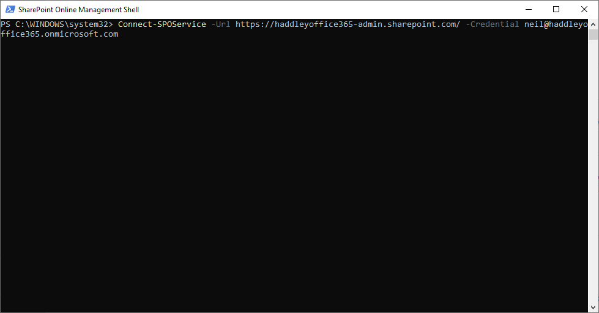
*I connected to the SharePoint administration site*

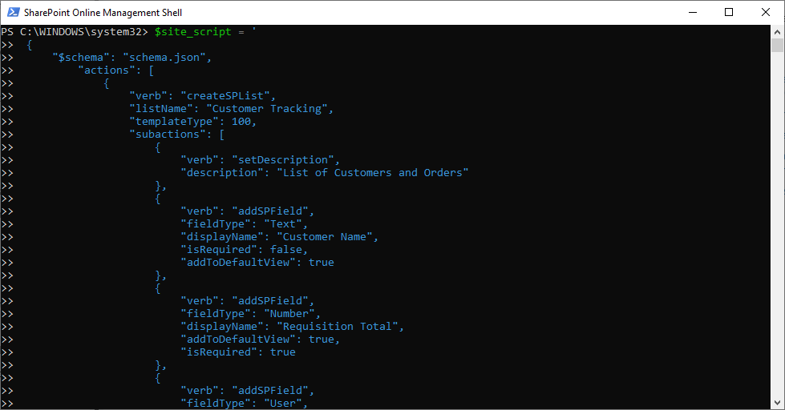
*I loaded the JSON text into a variable*


## Add-SPOSiteDesign

I created site designs that extend the SharePoint modern team site template (64) or the communication site template (68).

I added them to the tenant using the Add-SPOSiteDesign command, specifying one or more site script IDs.

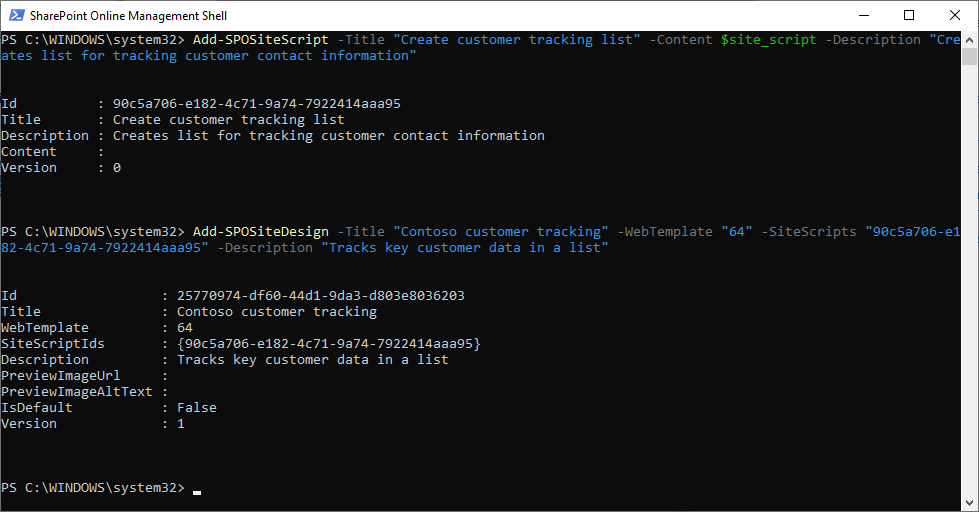
*I added the Site Script and Site Design*


## SharePoint Create a Site

Once I created the site design, it appeared in the out-of-the-box "Create a Site" experience.

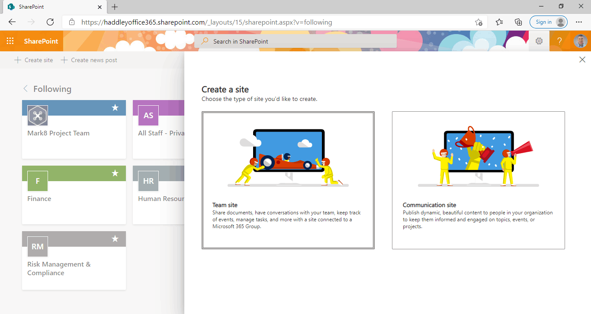
*I selected "Team Site" because the site design is based on the team site template (64)*

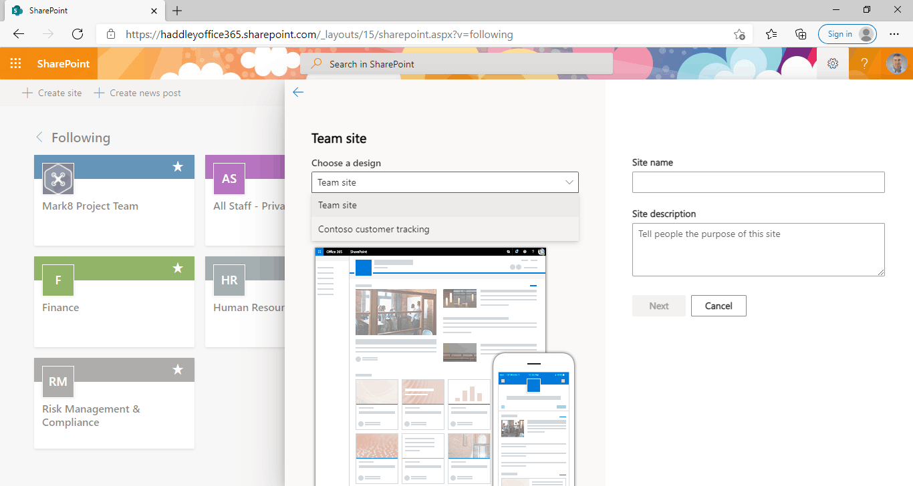
*The "Contoso customer tracking" Site Design is available in the "Choose a design" drop down list.*

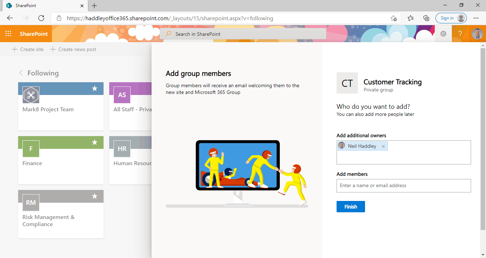
*I clicked Finish to create the new site and run the site scripts*

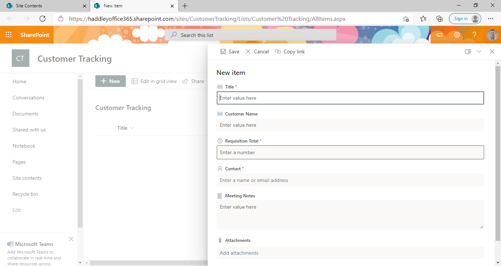
*The newly created site includes the "Customer Tracking" list*


## Applying a site design to an existing site

I used Get-SPOSiteDesign to list the installed site designs and their IDs.

I applied site designs to an existing SharePoint site using the Invoke-SPOSiteDesign command.

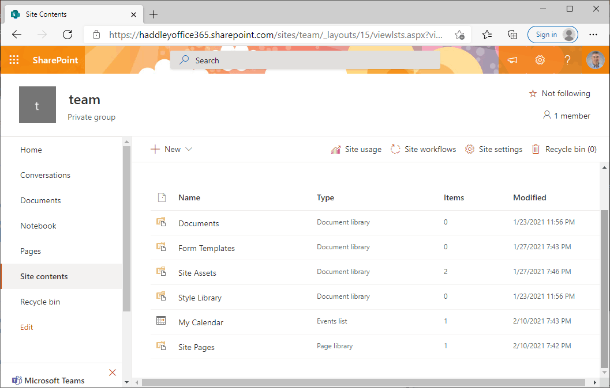
*Site contents before invoking site design*

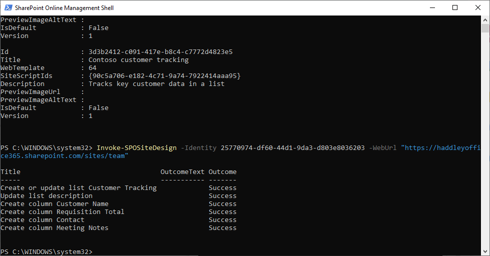
*I ran Invoke-SPOSiteDesign*

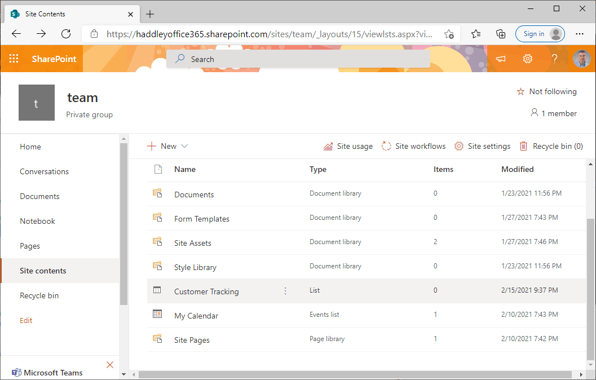
*Site contents after invoking site design*


## Get-SPOSiteScriptFromWeb

I used Get-SPOSiteScriptFromWeb to extract a site script from an existing SharePoint site.

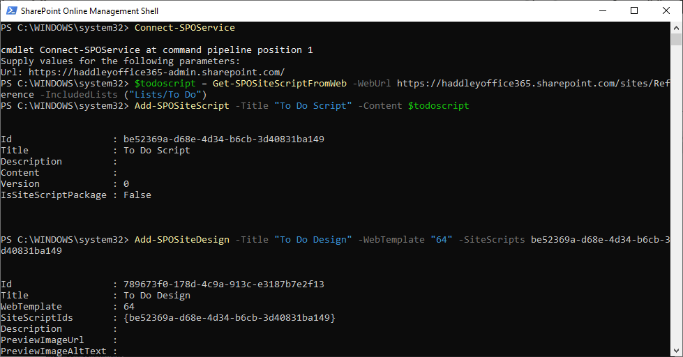
*I ran the Get-SPOSiteScriptFromWeb command*


## Example site script

```javascript
{
     "$schema": "schema.json",
         "actions": [
             {
                 "verb": "createSPList",
                 "listName": "Customer Tracking",
                 "templateType": 100,
                 "subactions": [
                     {
                         "verb": "setDescription",
                         "description": "List of Customers and Orders"
                     },
                     {
                         "verb": "addSPField",
                         "fieldType": "Text",
                         "displayName": "Customer Name",
                         "isRequired": false,
                         "addToDefaultView": true
                     },
                     {
                         "verb": "addSPField",
                         "fieldType": "Number",
                         "displayName": "Requisition Total",
                         "addToDefaultView": true,
                         "isRequired": true
                     },
                     {
                         "verb": "addSPField",
                         "fieldType": "User",
                         "displayName": "Contact",
                         "addToDefaultView": true,
                         "isRequired": true
                     },
                     {
                         "verb": "addSPField",
                         "fieldType": "Note",
                         "displayName": "Meeting Notes",
                         "isRequired": false
                     }
                 ]
             }
         ],
             "bindata": { },
     "version": 1
}
```

## Get-SPOSiteScriptFromWeb results

```javascript
{
  "$schema": "https://developer.microsoft.com/json-schemas/sp/site-design-script-actions.schema.json",
  "actions": [
    {
      "verb": "createSiteColumnXml",
      "schemaXml": "<Field ID=\"{c15b34c3-ce7d-490a-b133-3f4de8801b76}\" Name=\"TaskStatus\" Group=\"Core Task and Issue Columns\" Type=\"Choice\" DisplayName=\"Task Status\" SourceID=\"http://schemas.microsoft.com/sharepoint/v3/fields\" StaticName=\"TaskStatus\" DelayActivateTemplateBinding=\"GROUP,SPSPERS,SITEPAGEPUBLISHING\" Customization=\"\" AllowDeletion=\"TRUE\"><CHOICES><CHOICE>Not Started</CHOICE><CHOICE>In Progress</CHOICE><CHOICE>Completed</CHOICE><CHOICE>Deferred</CHOICE><CHOICE>Waiting on someone else</CHOICE></CHOICES><MAPPINGS><MAPPING Value=\"1\">Not Started</MAPPING><MAPPING Value=\"2\">In Progress</MAPPING><MAPPING Value=\"3\">Completed</MAPPING><MAPPING Value=\"4\">Deferred</MAPPING><MAPPING Value=\"5\">Waiting on someone else</MAPPING></MAPPINGS><Default>Not Started</Default></Field>",
      "pushChanges": true
    },
    {
      "verb": "createContentType",
      "name": "To Do Item",
      "id": "0x0100AC72E73DED8B1947B3AD265DD7CFCB4A",
      "description": "",
      "parentId": "0x01",
      "hidden": false,
      "group": "Custom Content Types",
      "subactions": [
        {
          "verb": "addSiteColumn",
          "internalName": "TaskStatus"
        }
      ]
    },
    {
      "verb": "createSPList",
      "listName": "To Do",
      "templateType": 100,
      "color": "2",
      "icon": "11",
      "subactions": [
        {
          "verb": "setDescription",
          "description": "To Do List"
        },
        {
          "verb": "addContentType",
          "name": "To Do Item"
        },
        {
          "verb": "addSPFieldXml",
          "schemaXml": "<Field ID=\"{fa564e0f-0c70-4ab9-b863-0177e6ddd247}\" Type=\"Text\" Name=\"Title\" DisplayName=\"Title\" Required=\"TRUE\" SourceID=\"http://schemas.microsoft.com/sharepoint/v3\" StaticName=\"Title\" FromBaseType=\"TRUE\" MaxLength=\"255\" />"
        },
        {
          "verb": "addSPFieldXml",
          "schemaXml": "<Field ID=\"{82642ec8-ef9b-478f-acf9-31f7d45fbc31}\" DisplayName=\"Title\" Description=\"\" Name=\"LinkTitle\" SourceID=\"http://schemas.microsoft.com/sharepoint/v3\" StaticName=\"LinkTitle\" Type=\"Computed\" ReadOnly=\"TRUE\" FromBaseType=\"TRUE\" Width=\"150\" DisplayNameSrcField=\"Title\" Sealed=\"FALSE\"><FieldRefs><FieldRef Name=\"Title\" /><FieldRef Name=\"LinkTitleNoMenu\" /><FieldRef Name=\"_EditMenuTableStart2\" /><FieldRef Name=\"_EditMenuTableEnd\" /></FieldRefs><DisplayPattern><FieldSwitch><Expr><GetVar Name=\"FreeForm\" /></Expr><Case Value=\"TRUE\"><Field Name=\"LinkTitleNoMenu\" /></Case><Default><HTML><![CDATA[<div class=\"ms-vb itx\" onmouseover=\"OnItem(this)\" CTXName=\"ctx]]></HTML><Field Name=\"_EditMenuTableStart2\" /><HTML><![CDATA[\">]]></HTML><Field Name=\"LinkTitleNoMenu\" /><HTML><![CDATA[</div>]]></HTML><HTML><![CDATA[<div class=\"s4-ctx\" onmouseover=\"OnChildItem(this.parentNode); return false;\">]]></HTML><HTML><![CDATA[<span>&nbsp;</span>]]></HTML><HTML><![CDATA[<a onfocus=\"OnChildItem(this.parentNode.parentNode); return false;\" onclick=\"PopMenuFromChevron(event); return false;\" href=\"javascript:;\" title=\"Open Menu\"></a>]]></HTML><HTML><![CDATA[<span>&nbsp;</span>]]></HTML><HTML><![CDATA[</div>]]></HTML></Default></FieldSwitch></DisplayPattern></Field>"
        },
        {
          "verb": "addSPView",
          "name": "All Items",
          "viewFields": [
            "LinkTitle",
            "TaskStatus"
          ],
          "query": "",
          "rowLimit": 30,
          "isPaged": true,
          "makeDefault": true,
          "replaceViewFields": true
        }
      ]
    }
  ]
}
```
## References

- [SharePoint site design and site script overview](https://docs.microsoft.com/en-us/sharepoint/dev/declarative-customization/site-design-overview)