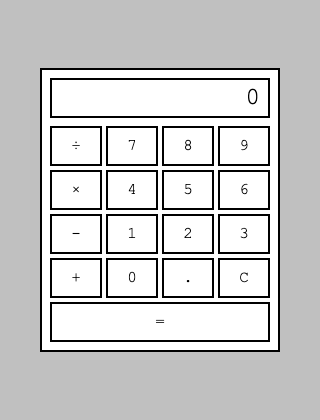

I read [Ran the Builder's honest take on three spec-driven AI tools](https://ranthebuilder.cloud/blog/i-tested-three-spec-driven-ai-tools-here-s-my-honest-take) and wanted to find out for myself whether the workflows hold up, rather than take the scores at face value. This is the first of four posts: one each for [OpenSpec](https://github.com/Fission-AI/OpenSpec), [Spec-Kit](https://github.com/github/spec-kit), and [BMAD](https://github.com/bmad-code-org/BMAD-METHOD), then a comparison. Same starting project and the same feature requests each time, so the results are actually comparable, not three unrelated write-ups.

## The task

I did not want a todo-app rehash, so I built a real fixed point of comparison instead: a plain HTML/CSS/JS calculator, a flat, boxy, monochrome homage to the Windows 1.0 (1985) Calculator, which really did ship as a simple four-function tool. I then give every tool the same two feature requests, taken from real Windows Calculator history rather than invented for the occasion:

- **Programmer Mode** — Windows Calculator got a dedicated Programmer mode in Windows 7 (2009): switching between binary, octal, decimal, and hexadecimal, with defined bit widths (byte/word/dword/qword) and integer-only arithmetic. Base conversion itself is older, part of the Scientific mode Windows 3.0 added in 1990, but Windows 7 is what split it into its own mode with real bit-width and overflow semantics.
- **Statistics Mode** — also added in Windows 7: enter a sequence of numbers, click Add for each one, and get sum, average, sum-of-squares, average-of-squares, and both sample and population standard deviation. Not plotting — a genuinely common mix-up, since Calculator's later Graphing mode (Windows 10, 2019) is the one that actually draws a curve.

(Both details checked against [Wikipedia's Windows Calculator article](https://en.wikipedia.org/wiki/Windows_Calculator) before I built the framing in.)

I wrote the feature requests the way I would naturally ask for them, not engineered to hit specific traps I already expected from reading the article. Whatever ambiguity OpenSpec surfaces or misses below is discovered after the fact, not scored against a checklist I wrote myself.

## The baseline

The calculator lives at [github.com/Haddley/specdriven](https://github.com/Haddley/specdriven). The calculation engine (`calculator-logic.js`) is separated from the DOM wiring (`calculator.js`), so it is directly testable: twelve tests cover the four operations, chained entry, decimal input, and division by zero. Operators chain left-to-right as entered, the way a plain calculator works, not by operator precedence — a design decision I wrote down in the README before any spec-driven tool got involved, since that is exactly the kind of thing a tool could otherwise silently assume differently.


*The baseline calculator, freshly loaded — flat, boxed, monochrome, no gradients or rounded corners*

```bash
npm test
```

```
✔ adds two numbers
✔ subtracts two numbers
✔ multiplies two numbers
✔ divides two numbers
✔ division by zero shows an error and blocks further input until clear
✔ chains operators left-to-right, not by operator precedence
✔ decimal input builds a fractional number
✔ a second decimal point in the same entry is ignored
✔ starting a new number after an operator replaces the display rather than appending
✔ equals with no pending operator is a no-op
✔ formatNumber rounds away floating-point noise
✔ clear resets the engine to its initial state
ℹ tests 12
ℹ pass 12
ℹ fail 0
```

All twelve pass. That is the fixed commit every tool starts from.

## Installing OpenSpec

```bash
npm install -g @fission-ai/openspec@latest
```

OpenSpec needs Node.js 20.19.0 or higher; I am on v26.7.0. Then, inside the calculator project:

```bash
openspec init --tools claude
```

```
- Creating OpenSpec structure...
▌ OpenSpec structure created
- Setting up Claude Code...
✔ Setup complete for Claude Code

OpenSpec Setup Complete

Created: Claude Code
6 skills and 6 commands in .claude/
Config: openspec/config.yaml (schema: spec-driven)

Getting started:
  Start your first change: /opsx:propose "your idea"
```

That scaffolds `openspec/specs/` and `openspec/changes/archive/`, both empty, plus six `/opsx:*` commands under `.claude/commands/opsx/` — `explore`, `propose`, `apply`, `update`, `sync`, `archive` — and a matching skill for each under `.claude/skills/`.

`openspec/config.yaml` also has an optional `context:` field, for tech stack and conventions you want every proposal to inherit:

```yaml
schema: spec-driven

# Project context (optional)
# This is shown to AI when creating artifacts.
# Add your tech stack, conventions, style guides, domain knowledge, etc.
```

I am leaving it empty on purpose. Filling it in would mean telling the tool up front to use vanilla JS, keep the logic/DOM split, and so on — handing it answers to some of the exact ambiguities I actually want to watch it navigate on its own. A team adopting OpenSpec on day one, on a small project, often has not written that file yet either.

Next: the first proposal, Programmer Mode.
