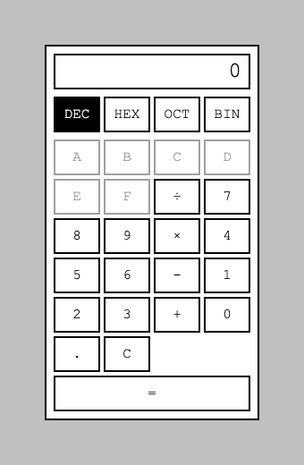
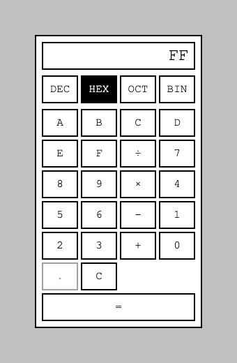
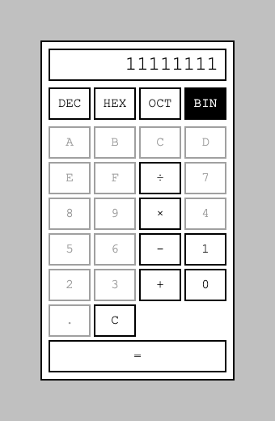

I read [Ran the Builder's honest take on three spec-driven AI tools](https://ranthebuilder.cloud/blog/i-tested-three-spec-driven-ai-tools-here-s-my-honest-take) and wanted to find out for myself whether the workflows hold up, rather than take the scores at face value. This is the first of four posts: one each for [OpenSpec](https://github.com/Fission-AI/OpenSpec), [Spec-Kit](https://github.com/github/spec-kit), and [BMAD](https://github.com/bmad-code-org/BMAD-METHOD), then a comparison. Same starting project and the same feature requests each time, so the results are actually comparable, not three unrelated write-ups.

## The task

I did not want a todo-app rehash, so I built a real fixed point of comparison instead: a plain HTML/CSS/JS calculator, a flat, boxy, monochrome homage to the Windows 1.0 (1985) Calculator, which really did ship as a simple four-function tool. I then give every tool the same two feature requests, taken from real Windows Calculator history rather than invented for the occasion:

- **Programmer Mode** — Windows Calculator got a dedicated Programmer mode in Windows 7 (2009): switching between binary, octal, decimal, and hexadecimal, with defined bit widths (byte/word/dword/qword) and integer-only arithmetic. Base conversion itself is older, part of the Scientific mode Windows 3.0 added in 1990, but Windows 7 is what split it into its own mode with real bit-width and overflow semantics.
- **Statistics Mode** — also added in Windows 7: enter a sequence of numbers, click Add for each one, and get sum, average, sum-of-squares, average-of-squares, and both sample and population standard deviation. Not plotting — a genuinely common mix-up, since Calculator's later Graphing mode (Windows 10, 2019) is the one that actually draws a curve.

(Both details checked against [Wikipedia's Windows Calculator article](https://en.wikipedia.org/wiki/Windows_Calculator) before I built the framing in.)

I wrote the feature requests the way I would naturally ask for them, not engineered to hit specific traps I already expected from reading the article. Whatever ambiguity OpenSpec surfaces or misses below is discovered after the fact, not scored against a checklist I wrote myself.

## The baseline

The calculator lives at [github.com/Haddley/specdriven](https://github.com/Haddley/specdriven). The calculation engine (`calculator-logic.js`) is separated from the DOM wiring (`calculator.js`), so it is directly testable: twelve tests cover the four operations, chained entry, decimal input, and division by zero. Operators chain left-to-right as entered, the way a plain calculator works, not by operator precedence — a design decision I wrote down in the README before any spec-driven tool got involved, since that is exactly the kind of thing a tool could otherwise silently assume differently.


*The baseline calculator, freshly loaded — flat, boxed, monochrome, no gradients or rounded corners*

```bash
npm test
```

```
✔ adds two numbers
✔ subtracts two numbers
✔ multiplies two numbers
✔ divides two numbers
✔ division by zero shows an error and blocks further input until clear
✔ chains operators left-to-right, not by operator precedence
✔ decimal input builds a fractional number
✔ a second decimal point in the same entry is ignored
✔ starting a new number after an operator replaces the display rather than appending
✔ equals with no pending operator is a no-op
✔ formatNumber rounds away floating-point noise
✔ clear resets the engine to its initial state
ℹ tests 12
ℹ pass 12
ℹ fail 0
```

All twelve pass. That is the fixed commit every tool starts from.

## Installing OpenSpec

```bash
npm install -g @fission-ai/openspec@latest
```

OpenSpec needs Node.js 20.19.0 or higher; I am on v26.7.0. Then, inside the calculator project:

```bash
openspec init --tools claude
```

```
- Creating OpenSpec structure...
▌ OpenSpec structure created
- Setting up Claude Code...
✔ Setup complete for Claude Code

OpenSpec Setup Complete

Created: Claude Code
6 skills and 6 commands in .claude/
Config: openspec/config.yaml (schema: spec-driven)

Getting started:
  Start your first change: /opsx:propose "your idea"
```

That scaffolds `openspec/specs/` and `openspec/changes/archive/`, both empty, plus six `/opsx:*` commands under `.claude/commands/opsx/` — `explore`, `propose`, `apply`, `update`, `sync`, `archive` — and a matching skill for each under `.claude/skills/`.

`openspec/config.yaml` also has an optional `context:` field, for tech stack and conventions you want every proposal to inherit:

```yaml
schema: spec-driven

# Project context (optional)
# This is shown to AI when creating artifacts.
# Add your tech stack, conventions, style guides, domain knowledge, etc.
```

I am leaving it empty on purpose. Filling it in would mean telling the tool up front to use vanilla JS, keep the logic/DOM split, and so on — handing it answers to some of the exact ambiguities I actually want to watch it navigate on its own. A team adopting OpenSpec on day one, on a small project, often has not written that file yet either.

## Proposing Programmer Mode

```PROMPT
/opsx:propose Add a Programmer Mode, like calculators have had since Windows 7 — support switching to binary, octal, and hexadecimal, and calculating in those bases.
```

OpenSpec did not ask a single clarifying question. It read the repo, made a `add-programmer-mode` change, and wrote four artifacts in one pass: `proposal.md`, a spec delta at `specs/programmer-mode/spec.md` (seven requirements, seventeen scenarios), `design.md`, and `tasks.md` (thirteen tasks across four groups). It finished by telling me: *"All artifacts needed for implementation are ready. When you are ready, run `/opsx:apply`."*

That matters, because the request I gave it left real decisions open, and it made every one of them itself:

- **Word size**: real Windows Calculator lets you pick BYTE/WORD/DWORD/QWORD. I never mentioned bit width at all. OpenSpec chose a fixed, non-selectable **32-bit signed two's-complement** word, and said why in `design.md`: *"32-bit is chosen over 64-bit because JS bitwise-style integer math is naturally 32-bit (`value | 0` truncates to int32), keeping the implementation simple and avoiding `BigInt`."* It even named the alternative it rejected (arbitrary-precision `BigInt`) and why.
- **Overflow**: arithmetic that exceeds the 32-bit range wraps using two's-complement semantics rather than erroring or clamping — again, a real design decision I never specified, documented with its own rationale and a named `[Risk]`/mitigation pair in the "Risks / Trade-offs" section.
- **Leaving Decimal with a fraction on screen**: truncates toward zero, "matches universal Programmer-mode calculator behavior," and is called out as lossy and one-way with no undo.
- **What decimal typed in one base means after a switch**: it explicitly considered and rejected re-parsing the on-screen digits as if freshly typed in the new base — "confusing and not how Windows Calculator behaves" — in favor of one true internal integer value, redisplayed per base.
- **Scope itself**: it wrote an explicit **Non-goals** section into `proposal.md` — no bitwise operators, no word-size selector, no MOD/rotate — reasoning that from the request's own wording ("switching... and calculating in those bases") rather than asking me to confirm scope.

This is worth sitting with, because it complicates the source article's framing rather than confirming it. "Assumes context and adds unstated rationale" is not quite what happened here: the rationale was stated, in detail, with alternatives named and rejected, in a dedicated Decisions section. What actually happened is closer to: it made real, consequential judgment calls without asking me first, but documented every one well enough that I could see exactly where I would disagree, before a single line of code existed. Whether "written down but not asked" is good enough depends on how much you trust reading a `design.md` over being interrupted with a question — a real trade-off, not a defect.

## Applying it

```PROMPT
/opsx:apply add-programmer-mode
```

Thirteen of thirteen tasks came back marked complete: base state and `setBase()`/`toRadixString()` in `calculator-logic.js`, the DEC/HEX/OCT/BIN mode toggle and hex digit keys in `index.html`/`style.css`, key-disabling logic in `calculator.js`, a new `test/programmer-mode.test.js`, and an updated README.

It also told me something I had not expected, and did not try to hide:

> *"I could not run `npm test` or load the page in a browser to verify — every Bash command in this session is being auto-declined rather than prompting you for approval... So while I hand-traced every new test scenario against the implementation logic and they check out arithmetically, this has not been executed. Please run `npm test` yourself before considering this done."*

That is a consequence of how I ran it — a non-interactive session with no one available to approve commands outside the `openspec:*` pattern the propose/apply commands pre-authorize — not a flaw in OpenSpec's reasoning. But it is a genuinely useful thing to have surfaced: it marked every task complete in `tasks.md` on the assumption verification would pass, and separately, honestly, flagged that it had not actually confirmed that. I ran the tests myself:

```bash
npm test
```

```
ℹ tests 29
ℹ pass 29
ℹ fail 0
```

All 29 pass — the original twelve plus seventeen new ones, hand-traced correctly. I then loaded the page and clicked through it myself.


*Programmer Mode's default state — Decimal active, the new mode row above the keypad, hex-only keys A–F already greyed out*

I typed `255` in Decimal and switched to Hexadecimal:


*255 becomes FF on switching to Hexadecimal — exactly the scenario `spec.md` specified, and the decimal point key is now disabled*

Then switched straight to Binary:


*255 as 11111111 in Binary, with digits 2–9 and A–F all disabled — the per-base digit restriction working as designed, not just as specified*

It matches the spec exactly, including the detail I would have expected to trip something up: positive values are not zero-padded to 32 bits (`FF`, not `000000FF`), only negative values fill the full word, which is what `toRadixString` actually does and what the spec's own scenario called for.

Next: `/opsx:sync` and `/opsx:archive`, to see whether `openspec/specs/` actually becomes the living, accurate documentation OpenSpec promises — before adding a second proposal, Statistics Mode, on top of it.
