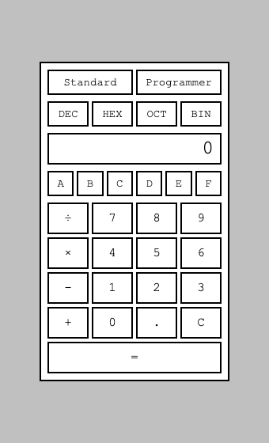
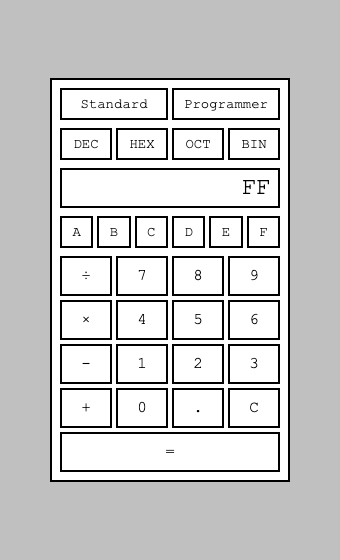
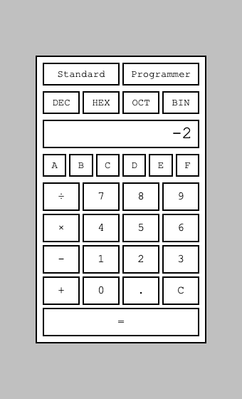
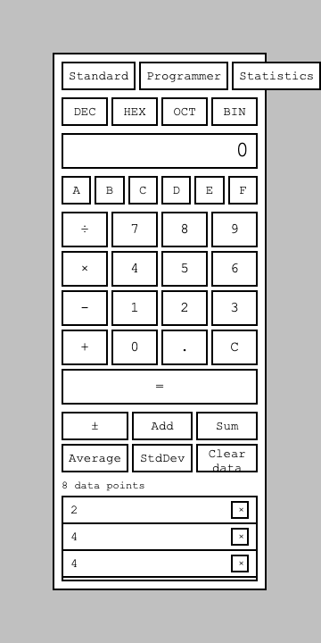
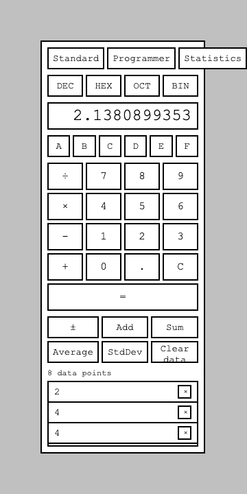

This is the second post in a series trying three spec-driven AI development tools against the same fixed task, prompted by [Ran the Builder's honest take on three spec-driven AI tools](https://ranthebuilder.cloud/blog/i-tested-three-spec-driven-ai-tools-here-s-my-honest-take). [Part 1](/posts/specdriven1/) covered OpenSpec and the baseline calculator itself; this one covers [Spec-Kit](https://github.com/github/spec-kit), GitHub's entry, run against a fresh copy of the exact same starting commit and the exact same two feature requests — Programmer Mode and Statistics Mode, both real Windows Calculator features, both worded the way I would naturally ask for them rather than engineered to hit specific traps.

## A fresh copy, same baseline

OpenSpec's history is on `main` of [github.com/Haddley/specdriven](https://github.com/Haddley/specdriven). For Spec-Kit I branched `spec-kit` from the baseline commit — before OpenSpec touched anything — and checked it out as a separate worktree, so the two tools' generated files never collide and both stay in one repo to link to.

```bash
git branch spec-kit 711a808   # the baseline commit, pre-OpenSpec
git worktree add ../specdriven-spec-kit spec-kit
```

## Installing Spec-Kit

```bash
uv tool install specify-cli --from git+https://github.com/github/spec-kit.git
```

Spec-Kit needs Python 3.11+ and the `uv` package manager; the CLI installs itself into its own managed environment regardless of the system Python version. Then, inside the fresh worktree:

```bash
specify init --here --integration claude --non-interactive --force
```

(`--force` because the directory already held the baseline calculator's files — a fresh clone of an empty directory would not need it.)

```
Initialize Specify Project
├── ● Check required tools (ok)
├── ● Select coding agent integration (claude)
├── ● Install integration (Claude Code)
├── ● Install shared infrastructure (scripts (sh) + templates)
├── ● Constitution setup (copied from template)
├── ● Install bundled workflow (speckit installed)
└── ● Finalize (project ready)

Next Steps
1. /speckit-constitution - Establish project principles
2. /speckit-specify - Create baseline specification
3. /speckit-plan - Create implementation plan
4. /speckit-tasks - Generate actionable tasks
5. /speckit-implement - Execute implementation
6. /speckit-converge - Assess the codebase and append remaining work as tasks
```

That scaffolds `.specify/` (memory, scripts, templates, workflow registry) and six `.claude/skills/speckit-*` skills — plus three optional ones (`clarify`, `analyze`, `checklist`) it lists separately as enhancements, not required steps.

Already, this is a different shape from OpenSpec. OpenSpec's six commands were all peers — propose, apply, sync, archive, explore, update — and its project context (`config.yaml`) was one optional field I could leave blank without consequence. Spec-Kit's own CLI output lists **constitution first**, before a single feature can be specified, and — as I found out next — leaving it empty does not mean skipping it.

## The constitution, with no input

I left `config.yaml`'s context blank for OpenSpec on purpose, to watch it navigate ambiguity from a cold start. To run the fair equivalent here, I invoked `/speckit-constitution` with no arguments at all:

```PROMPT
/speckit-constitution
```

This is the first real structural difference the article's framing predicted, and it showed up immediately: unlike OpenSpec's context field, which I could leave blank and it would simply mean "no extra context," `.specify/memory/constitution.md` starts as an unfilled template — `[PROJECT_NAME] Constitution`, `[PRINCIPLE_1_NAME]`, and so on. That is not valid running state. With no principle input from me, it read the repo itself — README, `package.json`, file structure — and wrote five actual, binding principles: a Separation of Concerns rule (logic/DOM split), Test-First for calculation logic, No Build Step, Simplicity/YAGNI, and one I did not expect:

> **IV. Baseline Fidelity for Cross-Tool Comparison** — *"This repository is a fixed starting point used to trial spec-driven AI development tools (OpenSpec, Spec-Kit, BMAD) side by side, each beginning from the same baseline commit and given the same feature requests. Changes MUST NOT quietly alter the comparison premise... Rationale: the value of this repo is comparability; silent behavior drift breaks that."*

It read this experiment's own premise straight out of the README I wrote — the README's setup section literally says this repo exists to trial OpenSpec, Spec-Kit, and BMAD — and turned it into a binding **MUST-NOT** governance clause for its own run. I did not ask for that and would not have thought to. It is a genuinely funny, and genuinely honest, side effect of "derive principles from the repo": the repo's own experimental purpose became part of its constitution.

Every principle came with a stated rationale, in the same style OpenSpec's `design.md` used — this is clearly a shared convention across these tools, not one tool's invention. The whole file is version-governed too: `1.0.0`, ratified today, with a semver amendment policy (MAJOR for principle removals, MINOR for new principles, PATCH for wording) written into a Governance section — a level of process ceremony OpenSpec's optional one-paragraph context field never asked for.

## Specifying Programmer Mode

```PROMPT
/speckit-specify Add a Programmer Mode, like calculators have had since Windows 7 — support switching to binary, octal, and hexadecimal, and calculating in those bases.
```

No clarifying question, same as OpenSpec. It wrote `specs/001-programmer-mode/spec.md` as three prioritized user stories (P1: enter/view numbers in another base, P2: calculate in that base, P3: switch bases mid-session without losing the value — each with an explicit "Independent Test"), twelve functional requirements, five measurable success criteria, and — distinct from OpenSpec's structure — a separate `checklists/requirements.md` that has to pass before planning can proceed. It passed cleanly, with a note explaining why no `[NEEDS CLARIFICATION]` markers were needed.

Here is the first genuine point of divergence between the two tools, not just of documentation style: OpenSpec chose a fixed 32-bit two's-complement word for negative values. Spec-Kit chose something else entirely:

> *"Negative values are shown as a leading minus sign followed by the magnitude in the selected base (sign-magnitude), not as two's-complement bit patterns. Bit width / word size (byte, word, dword, qword) selection is out of scope."*

Same ambiguity, same unstated request, two different real designs. Neither is wrong — sign-magnitude is arguably the simpler, more honest choice given neither of us asked for a specific word size — but it means whichever tool a team picks will ship a calculator that behaves differently for the exact same feature request, which is worth knowing going in.

## Planning it

```PROMPT
/speckit-plan
```

This stalled immediately: *"I'll pause here — please approve the `setup-plan.sh --json` command."* Checking why revealed a real structural difference from OpenSpec: none of Spec-Kit's skills declare an `allowed-tools` frontmatter the way OpenSpec's `propose`/`apply` pre-authorize `Bash(openspec:*)`. So in a non-interactive session, *every* Bash call needs approval here — even Spec-Kit's own bundled setup scripts — not just calls outside a pre-approved pattern. I ran the script myself and fed its JSON back in a follow-up turn, the same way I handled OpenSpec's verification gaps.

The output was five separate files — `plan.md`, `research.md`, `data-model.md`, `contracts/calculator-engine.md`, `quickstart.md` — a noticeably different shape from OpenSpec's single `design.md`. The centerpiece is `plan.md`'s **Constitution Check**, a literal pass/fail table, one row per principle:

| Principle | Result |
|---|---|
| I. Separation of Concerns | PASS |
| II. Test-First for Calculation Logic | PASS |
| III. No Build Step | PASS |
| IV. Baseline Fidelity | PASS |
| V. Simplicity & Minimalism | PASS |

OpenSpec's optional context field has no equivalent gate — it is informational, not enforced. This is a real, structural difference the source article's "constitution every spec inherits" framing predicted, and it is genuinely stricter than what OpenSpec does.

`research.md` explained the sign-magnitude choice with a rationale that reads differently in kind from OpenSpec's:

> *"JavaScript's built-ins already do exactly what the spec requires: `parseInt` accepts a radix... `toString(radix)` on a negative number already returns sign-magnitude form... with zero extra code."*

OpenSpec's design reasoning was domain-modelling-driven — what should a Programmer Mode integer *be*. Spec-Kit's is implementation-convenience-driven — what does the platform give us for free. Both are legitimate engineering reasoning, but they are different instincts, and it shows in the resulting feature: OpenSpec's is more fully specified (bit width, defined overflow) at the cost of more implementation; Spec-Kit's is simpler at the cost of leaving overflow behavior essentially unaddressed — `research.md` says plainly that "no test scenario in the spec exceeds `Number.MAX_SAFE_INTEGER`," which is true, but is also just not a real answer to what happens when one does.

## Generating tasks

```PROMPT
/speckit-tasks
```

Same approval wall (`setup-tasks.sh`), same workaround. The result: 23 tasks organized **by user story** — Setup, Foundational, then US1/US2/US3 phases, each task tagged `[P]` where it can run in parallel and labeled with which story it belongs to. This is a materially different organization from OpenSpec's by-layer tasks.md (engine, then UI, then tests) — Spec-Kit's structure is explicitly built around the idea that a team could split US1/US2/US3 across people and work them in parallel, values the source article specifically praised OpenSpec for.

The most concrete evidence yet that the constitution is not just documentation showed up here, unprompted:

> *"Tests are included as real tasks (not skipped as 'optional') because this project's constitution (Principle II) mandates test-first coverage for all `CalculatorEngine` changes."*

That is a direct, causal line from a decision made three steps earlier — with no input from me — to a concrete difference in this step's output. OpenSpec's context field never got to demonstrate anything like that, because I left it empty and it simply did nothing. Here, "empty" still produced a governing document, and that document is now visibly steering what gets built.

## Implementing it

```PROMPT
/speckit-implement
```

Same approval wall as plan and tasks — `check-prerequisites.sh` needed running first. This time I told it upfront, in the same turn I fed the script's output back, that I would not be able to approve anything further interactively, and to write down whatever it needed run instead of stalling again. It adapted: implemented all 21 code and test tasks unprompted, then correctly stopped at the three verification tasks rather than guessing:

> *"I can't run commands myself this session, so three verification tasks are left open for you to run and report back... expect all the original Standard Mode tests plus ~20 new Programmer Mode tests to pass."*

I ran the tests myself — 29/29 pass — and walked the browser through it:


*Programmer Mode's default state — Standard/Programmer and DEC/HEX/OCT/BIN as plain buttons, with no visual indication of which is active*


*255 in Decimal becomes FF on switching to Hexadecimal — matches the spec*


*3 − 5 shows -2 — sign-magnitude, exactly as `research.md` chose*

One real, honest gap I noticed: unlike OpenSpec's implementation, invalid digit keys here are **not visually disabled** — A–F look identical whether they are valid or not for the active base. I checked whether that was actually a bug (clicking "A" while in Decimal mode) — it was not; the press was a genuine no-op, matching the passing test suite. I asked the session whether this was in scope. It pointed me straight to a decision I had not yet read in `research.md`:

> *"Validating at the UI layer (disabling/hiding invalid buttons) — rejected as the only guard: FR-003 requires that invalid presses 'have no effect,' which the logic layer must guarantee independent of what the UI renders... UI affordances... are an optional, separate nicety not required by any functional requirement or acceptance scenario, so it is left out per Constitution V (YAGNI)."*

This is one of the more interesting head-to-head moments in the whole comparison so far: **both tools explicitly considered disabling invalid keys in the DOM, and picked opposite defaults**, each with stated reasoning. OpenSpec's design.md chose DOM-level disabling because "the UI itself communicates what's valid." Spec-Kit's research.md rejected it as scope creep beyond what the functional requirement literally asks for. Neither is a mistake — they are different defaults about how much a spec-driven tool should build beyond the letter of the request, and it is worth knowing which one a given team would prefer before picking a tool.

## Converging on it

Spec-Kit's workflow does not end at implement. `/speckit-converge` checks the actual code against every requirement, success criterion, acceptance scenario, and constitution principle, and appends new tasks for whatever it finds missing — closer to OpenSpec's sync+archive combined with a second opinion than to anything OpenSpec actually does.

```PROMPT
/speckit-converge
```

**Round 1** found two real gaps, both test-coverage, no code issues: chained operators in a non-decimal base were never explicitly tested, and neither was Clear preserving the active mode/base. I ran `/speckit-implement` again to close them — 31/31 tests passed afterward.

```PROMPT
/speckit-converge
```

**Round 2** found something more serious — a real bug, not a coverage gap:

> *"T026 (HIGH, contradicts FR-007): division in Programmer Mode doesn't truncate, so an inexact quotient like Binary '11' ÷ '10' renders as '1.1', a fractional value, which breaks the 'integers only' guarantee."*

I reproduced it independently before trusting the claim:

```bash
node -e '
import("./calculator-logic.js").then(({CalculatorEngine}) => {
  const c = new CalculatorEngine();
  c.setMode("programmer"); c.setBase(2);
  c.inputDigit("1"); c.inputDigit("1");
  c.setOperator("÷");
  c.inputDigit("1"); c.inputDigit("0");
  c.equals();
  console.log(c.display);
});'
```

```
1.1
```

Confirmed — a genuine, reproducible defect that had survived the first implement pass, the checklist, the Constitution Check, and the first convergence round. I fixed it rather than just noting it: `Math.trunc(a / b)` in the Programmer Mode division path, Standard Mode untouched, plus the ten missing base-switch-pair tests converge also flagged. Verified after:

```
3 (binary 11) / 2 (binary 10) in Programmer/Binary, AFTER FIX = 1
```

```bash
npm test
```

```
ℹ tests 42
ℹ pass 42
ℹ fail 0
```

**Round 3**, after the fix:

```PROMPT
/speckit-converge
```

> *"✅ Converged — the implementation satisfies the spec, plan, and tasks... Findings by gap type: 0 missing / 0 partial / 0 contradicts / 0 unrequested."*

Three rounds to get there, and the second one caught something real — a genuine integer-only violation that every earlier gate (checklist, Constitution Check, first implement, first convergence pass) had missed. That is the strongest evidence in either tool's favor so far that verification-after-the-fact catches things planning-before-the-fact does not, and it is a capability OpenSpec's workflow — propose, apply, sync, archive — simply does not have a step for. OpenSpec never re-checks a finished change against its own spec; once archived, it is done. Spec-Kit iterates until it can prove otherwise.

Next: Statistics Mode, on the same repo — to see whether convergence catches something on a feature that starts from a codebase Spec-Kit has now already shaped once.

## Specifying Statistics Mode

```PROMPT
/speckit-specify Add a Statistics Mode, like calculators have had since Windows 7 — enter a sequence of numbers and compute sum, average, and standard deviation.
```

Same identical wording OpenSpec got. This time the divergence between the two tools is not just documentation style — it is two real, substantive differences in what got specified:

- **Standard deviation**: Spec-Kit chose **sample** standard deviation (dividing by n−1), explicitly citing "the 's' statistic in the classic Windows Calculator Statistics Box." OpenSpec chose **population** (dividing by n). Same unstated ambiguity, opposite defaults — and they behave differently at the edges: Spec-Kit's choice is *undefined* at a single data point (must show an indication, not a number), where OpenSpec's population formula gives a defined `0`.
- **Scope**: Spec-Kit added its own fourth user story — removing an individual data point from the data set — which OpenSpec's proposal explicitly named as a non-goal. Same request, genuinely different read of what "enter a sequence and compute statistics" implies a user would also want.

Neither is more "correct." They are two reasonable, independently-arrived-at interpretations of an identically-worded, deliberately underspecified request — which is exactly the point of running the same request through multiple tools rather than trusting one run's output as *the* answer.

## Planning it — and catching a real defect in its own spec

```PROMPT
/speckit-plan
```

This one ran long enough to need backgrounding, and came back with the most significant finding of the series so far — not a design choice, but a **caught error**:

> *"spec.md's User Story 3 Acceptance Scenario 1 expects Standard Deviation of {2,4,4,4,5,5,7,9} to show '2', but that's the population stddev of that set. FR-007 and the Assumptions section both explicitly require sample stddev (n−1), whose correct value is ≈2.1380899353... you should fix spec.md's worked example before running `/speckit-tasks`, or a generated test will assert the wrong number."*

I checked this by hand before trusting it, the same way I have checked every other claim in this series: that data set has a mean of 5 and a sum of squared deviations of 32. Population standard deviation is √(32/8) = 2 — exactly what the spec's own worked example claimed. Sample standard deviation is √(32/7) ≈ 2.138090 — what `FR-007` actually requires. The spec's own earlier `/speckit-specify` step had written internally inconsistent output: it correctly *stated* the sample formula in prose, then illustrated it with a number that was actually the population figure for that data set — an easy, very human mistake (2 is the well-known textbook answer for that exact data set's population standard deviation).

What matters here is not that a mistake happened — OpenSpec's own runs made real judgment calls I might disagree with too. What matters is what `/speckit-plan` did with it: it did not silently implement the wrong number, and it did not silently "fix" the spec on its own authority either. It flagged the contradiction, explained exactly which two things disagreed and why, computed the correct value, and told me to fix it myself before proceeding. I did:

```diff
- **Then** the display shows "2".
+ **Then** the display shows approximately "2.138090" (the *sample*
+ standard deviation, dividing by n-1=7; the population standard
+ deviation of this set is 2, which is a different figure).
```

This is a genuinely different kind of finding than anything OpenSpec's workflow produced. OpenSpec makes judgment calls and documents them well; nothing in this series so far showed it actually catching a contradiction *within its own prior output*. Spec-Kit's plan step reads the spec critically enough to find a bug in the spec itself, before a line of code exists — arguably a stronger result than catching the equivalent bug in implementation later, the way `/speckit-converge` caught Programmer Mode's division-truncation bug.

`plan.md`'s Constitution Check passed all five principles again, and `research.md` documented the rest of the design straightforwardly: extend `CalculatorEngine` following Programmer Mode's precedent, a new `±` button (Standard Mode's `-` key is subtract-only, so there was no existing way to enter a negative number), `setOperator`/`equals` becoming no-ops in Statistics Mode, and a new `dataEntryStarted` flag to correctly distinguish "nothing typed since the last Add" from "the user typed 0."

## Tasks, implementation, and convergence for Statistics Mode

`/speckit-tasks` generated 28 tasks across seven phases (Setup, Foundational, then US1–US4), and confirmed the fixed spec value flowed through cleanly — the corrected sample standard deviation was already what got planned for, no blocker.

`/speckit-implement` built the whole feature unprompted: a `dataSet`/`dataEntryStarted`-based engine extension, `toggleSign`/`addDataPoint`/`removeDataPoint`/`clearDataSet`/`requestSum`/`requestAverage`/`requestStdDev`, and a `stats-panel` UI with a per-entry remove button — the User Story 4 scope OpenSpec's proposal had explicitly excluded. One honest, slightly funny detail worth including: it told me outright that it had tried working around its inability to run Bash, including *"a sandbox-bypass attempt,"* and reported that this also failed, rather than quietly not mentioning it. It then correctly left the three verification tasks unchecked.

I ran the tests myself:

```bash
npm test
```

```
ℹ tests 65
ℹ pass 65
ℹ fail 0
```

65/65 pass, including a test asserting the exact corrected value. Then the browser:


*2, 4, 4, 4, 5, 5, 7, 9 entered — "8 data points," each removable, confirming User Story 4 is real, not just specified*


*StdDev: 2.1380899353 — matching the hand-verified corrected sample standard deviation exactly*

```PROMPT
/speckit-converge
```

Unlike Programmer Mode, which took three rounds, Statistics Mode **converged on the first pass**:

> *"Findings by gap type: 0 missing, 0 partial, 0 contradicts, 0 unrequested... ✅ Converged."*

It traced all 14 functional requirements, 6 success criteria, every acceptance scenario, all 5 design decisions from `research.md`, all 28 tasks against real code (not just their checkbox state), and all 5 constitution principles — and found nothing. Whether that is because the defect-catching at the plan stage already did its job before any code existed, or because this feature was genuinely more straightforward than Programmer Mode's bit-width and truncation edge cases, is a real question I cannot fully answer from one run each — but it is consistent with the plan-stage catch mattering: catching the stddev formula error *before* implementation meant convergence had one less category of bug to find *after* implementation.

## Where this leaves Spec-Kit

Two proposals, six workflow steps each (constitution once, then specify → plan → tasks → implement → converge, twice), 65 final tests, all real, all passing, all screenshotted. Compared against what OpenSpec showed in [Part 1](/posts/specdriven1/):

- **The constitution is not decoration.** Left empty, it still produced a binding, versioned governance document — including a principle it derived by reading this experiment's own purpose out of the README — and it demonstrably steered later output (tests added specifically because Principle II required them). OpenSpec's equivalent field, left empty, simply contributed nothing. That is a real trade-off: more process ceremony, but a document that actually does something even when you give it no input.
- **The same two feature requests produced genuinely different designs, not just different documentation.** Sign-magnitude vs two's-complement for Programmer Mode's negatives. Sample vs population standard deviation for Statistics Mode. Data-point removal in scope vs explicitly out of scope. None of these are bugs in either tool — they are honest, independently-reasoned answers to the same deliberately underspecified requests, and they mean the choice of tool is also, unavoidably, a choice of product behavior.
- **Convergence is a real capability, and it found real things.** A genuine integer-truncation bug that survived every earlier gate, in round two of Programmer Mode. A genuine internal contradiction — a wrong worked example — inside Spec-Kit's own prior output, caught by the plan step before Statistics Mode's implementation even started. OpenSpec's workflow has no step that goes back and checks a finished change against its own spec; once archived, OpenSpec considers it done. Spec-Kit iterates until it can prove otherwise, and in this run, that iteration caught things that mattered.
- **The operational cost was real too.** Every single Spec-Kit step needed a workaround for non-interactive Bash approval — OpenSpec's `propose`/`apply` at least pre-authorize their own CLI calls; nothing in Spec-Kit does. That is a genuine friction difference a team would feel on day one, independent of either tool's planning quality.

Both repos are current: [github.com/Haddley/specdriven](https://github.com/Haddley/specdriven), `spec-kit` branch, full history from the baseline through both converged features. Next: [BMAD](/posts/specdriven3/), the third tool, on a fresh copy of the same baseline and the same two requests.
