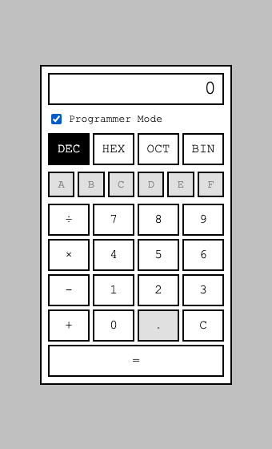
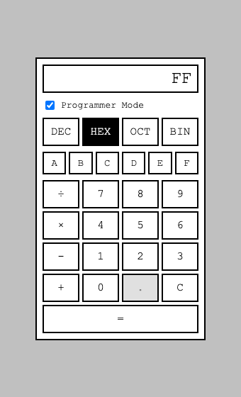
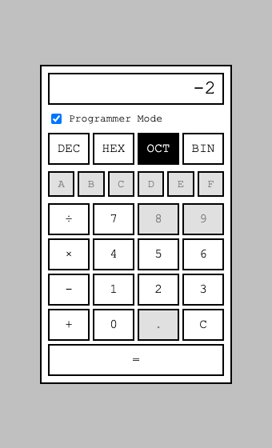
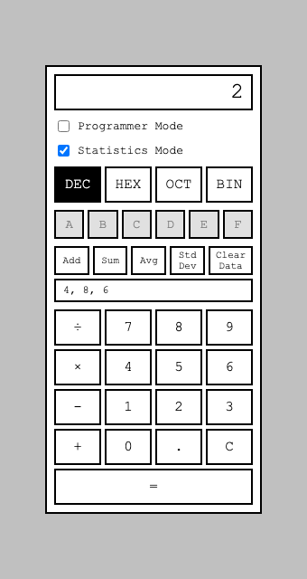

Third post in a series trying three spec-driven AI development tools against the same fixed task, prompted by [Ran the Builder's honest take on three spec-driven AI tools](https://ranthebuilder.cloud/blog/i-tested-three-spec-driven-ai-tools-here-s-my-honest-take). [Part 1](/posts/specdriven1/) covered OpenSpec, [Part 2](/posts/specdriven2/) covered Spec-Kit; this one covers [BMAD](https://github.com/bmad-code-org/BMAD-METHOD), on a fresh copy of the exact same baseline calculator and the exact same two feature requests — Programmer Mode and Statistics Mode.

## A version surprise, before anything else

The source article describes BMAD as "a full-lifecycle framework with dedicated elicitation and course-correction workflows," scored for "iterative refinement through adversarial review processes." Before installing anything, I checked the actual repository — and found BMAD has moved fast enough that this framing may already be describing a different tool than what installs today:

```bash
gh api repos/bmad-code-org/BMAD-METHOD/releases --jq '.[0:5] | .[] | {tag: .tag_name, published: .published_at}'
```

```
v6.12.0 — 2026-09-04
v6.11.0 — 2026-08-10
v6.10.0 — 2026-07-03
v6.9.0  — 2026-06-22
v6.8.0  — 2026-05-25
```

A release roughly every month, several with breaking changes to skill names and directory layouts — v6.11.0's changelog alone renamed `bmad-quick-dev` to `bmad-build`, cut the core skill count from fourteen to eight, and merged six separate review skills into one. The classic agent files and `elicitation`/`correct-course` terminology the article describes do still exist as skills (`bmad-advanced-elicitation`, `bmad-correct-course`), but the whole installation and invocation mechanism has moved to a Claude Code/Codex "skills" plugin architecture that looks nothing like what an older write-up would have walked through.

I am testing what installs **today** — v6.13.0-next — the same way I tested OpenSpec and Spec-Kit at their current versions, not trying to reconstruct whatever version the article actually ran. That itself is a finding worth stating plainly: a tool comparison can go stale within months in this space, and BMAD's own changelog is the most direct evidence of that in this series.

## Installing it

A fresh worktree, branched from the same baseline commit as the other two:

```bash
git branch bmad 711a808
git worktree add ../specdriven-bmad bmad
```

BMAD installs as a Claude Code plugin, not a CLI that scaffolds project files directly:

```bash
claude plugin marketplace add bmad-code-org/bmad-plugins
claude plugin install bmad-method@bmad --scope project
```

This is a different shape from `openspec init` or `specify init` already: it does not write anything into the project beyond enabling the plugin in `.claude/settings.json`. The actual skills load from a global plugin cache (`~/.claude/plugins/cache/bmad/...`), which meant the very first command hit a permission wall neither other tool did — reading the skill's own reference files, since they live outside the project directory:

> *"I need permission to read the skill's reference files outside the project directory. Could you approve access to `~/.claude/plugins/cache/bmad/bmad-method/6.13.0-next/skills/bmad-project-context/references/`?"*

Granted via `--add-dir`, and it proceeded — but this is a third distinct friction pattern across three tools now: OpenSpec pre-authorizes its own CLI (`Bash(openspec:*)`); Spec-Kit pre-authorizes nothing, so every Bash call needs approval; BMAD's plugin skills need filesystem read access outside the project entirely, because the skill definitions themselves are not local files.

The second surprise: `bmad-method` alone was not enough. Running `bmad setup` (the README's stated next step) needed a skill literally named `bmad`, which turned out to live in a *separate* plugin, `bmad-toolbox`:

```bash
claude plugin install bmad-toolbox@bmad --scope project
```

Two plugins to get to the same starting line OpenSpec and Spec-Kit each reached with one install command.

## Setup, and BMAD's own version of "leave it empty"

`bmad setup` itself hit the same non-interactive Bash wall the other two tools did — every command needing approval with no one able to grant it. I ran its underlying script myself:

```bash
uv run --no-cache "$SKILL_ROOT/scripts/setup.py" --project-root "$(pwd)" --skill "$SKILL_ROOT"
```

This scaffolded `_bmad/` (config, scripts) and, critically, `_bmad/config.toml` — which is where BMAD's real distinguishing feature showed up unprompted: five named agent personas, not a generic role list —

```toml
[agents.bmad-agent-analyst]
name = "Mary"
title = "Business Analyst"
description = "Channels Porter's strategic rigor... Speaks like a treasure hunter narrating the find"

[agents.bmad-agent-pm]
name = "John"
title = "Product Manager"
description = "Drives Jobs-to-be-Done over template filling... Speaks like a detective interrogating a cold case"

[agents.bmad-agent-architect]
name = "Winston"
title = "System Architect"

[agents.bmad-agent-dev]
name = "Amelia"
title = "Senior Software Engineer"
description = "Test-first discipline (red, green, refactor), 100% pass before review, no fluff all precision"
```

Neither OpenSpec nor Spec-Kit have any equivalent of this — a cast of characters with stated voices, not just role labels. Whether that changes the actual output quality or is closer to flavor text is something I want to watch for as the workflow runs.

Next, `bmad-project-context` — the equivalent of OpenSpec's context field and Spec-Kit's constitution. I ran it the same way: no pre-supplied specifics, watching what it did on its own.

```PROMPT
bmad setup
```

*(then, once the plugin gap was resolved, prompted again to run `bmad-project-context`)*

This is the first of the three tools' setup steps to actually **stop and ask**, rather than silently deciding. It asked four real questions before drafting anything:

> *"1. Governance/policy — any branch rules, frozen paths, or required approval process? 2. Trial integrity — since this repo is explicitly a comparison baseline across three tools, is there a rule like 'keep changes scoped to what BMAD produces' so the comparison stays fair? 3. Outside docs — any handbook or planning doc beyond what's in this repo? 4. Known pitfalls — has an agent already gotten something wrong here worth recording?"*

Like Spec-Kit's constitution step, it had read the README closely enough to notice this repo's own stated purpose as a three-tool comparison baseline, and asked about it directly rather than silently encoding it the way Spec-Kit's constitution did. I answered the way I answered the other two tools' equivalent steps — genuinely nothing, blank slate on all four — and it wrote `AGENTS.md`:

```markdown
## specdriven
A plain HTML/CSS/JS four-function calculator, a flat monochrome homage
to the Windows 1.0 Calculator. Fixed baseline used to trial three
spec-driven AI dev tools (OpenSpec, Spec-Kit, BMAD), each starting
from the same commit.

## Conventions that differ from defaults
- Operators chain left-to-right as entered (`5 + 3 × 2` = `16`), not
  by operator precedence.
- Divide by zero is intentional behavior, not a bug...
- Keep `calculator-logic.js` free of DOM access...
```

Twenty lines, three sections, done. Both OpenSpec's context and Spec-Kit's constitution ended up producing far more text when I gave them nothing — Spec-Kit in particular wrote five full governance principles with a semver amendment policy. BMAD's own reasoning for staying small was explicit: *"small on purpose since every line here is loaded every session."* A third genuinely different philosophy for the same "give the tool context about the project" step: OpenSpec — optional, does nothing if skipped; Spec-Kit — mandatory, ceremony-heavy, versioned; BMAD — mandatory, deliberately minimal, budget-conscious.

Next: Programmer Mode.

## Programmer Mode — the first tool to actually ask

I gave BMAD the exact same plain request I gave the other two tools, no explicit command:

```PROMPT
Add a Programmer Mode, like calculators have had since Windows 7 — support switching to binary, octal, and hexadecimal, and calculating in those bases.
```

Worth noting up front: BMAD skills trigger from natural-language descriptions of what you want, not named slash commands the way OpenSpec's `/opsx:*` and Spec-Kit's `/speckit-*` do. Claude Code's own routing picked `bmad-build` — a single skill that internally spans clarify, plan, implement, review, and present (visible in its rendered workflow as `step-01-clarify-and-route.md` through `step-05-present.md`), rather than several separately-invoked commands.

It read the repo, drafted a spec, and then did something neither OpenSpec nor Spec-Kit did on this exact request: it stopped and asked me, directly, the two ambiguities I have been tracking across all three tools —

> *"1. Bitwise operators (AND/OR/XOR/NOT/shifts)? A — Four-function only... B — Full parity... 2. Negative numbers in binary/octal/hex — how should they display? A — Sign + magnitude... B — Fixed-width two's complement... Let me know your picks (or say 'keep it simple' and I'll default to A/A)."*

I answered the way I have answered every other "give it nothing extra" moment in this series — not steering the outcome myself, just taking the tool's own offered default:

```PROMPT
Keep it simple.
```

It landed on **four-function only** and **sign + magnitude negatives** — matching Spec-Kit's negative-number choice, not OpenSpec's two's-complement, and matching both other tools' decision to exclude bitwise operators. Three tools, the same underlying ambiguity, and this time I got to see the choice actually being offered to me rather than inferring it after the fact from a design doc.

The resulting `spec-programmer-mode.md` is markedly leaner than either OpenSpec's four-file change or Spec-Kit's five-file plan — one file, an Intent/Boundaries/Edge-Case-Matrix wrapped in a literal `<frozen-after-approval>` tag (a concrete artifact-level "this part is now a human-approved contract" marker neither other tool has), a code map, tasks with acceptance criteria, and design notes. It gave me three ways to proceed — approve and implement now, approve and stop for a later session, or run a review pass first — and I chose to keep going in the same session, matching how I ran the other two tools' full cycles.

## Building it — and a review layer that found real bugs before I did

```PROMPT
Approve and continue.
```

All the familiar non-interactive friction showed up again — needing to run `npm test` myself and paste results back, several times over — but what came back at the end was new: BMAD's build includes a **three-layer parallel review** (named "Blind Hunter," "Edge Case Hunter," and "Verification Gap") that ran against the diff automatically, before presenting anything to me. Eleven findings, each triaged with a verdict:

| Verdict | Finding |
|---|---|
| **patch** | Activating Programmer Mode did not truncate an existing fractional display — a decimal like `3.14` survived into the nominally integer-only mode and stayed arithmetically live |
| **patch** | `isValidDigitForBase` used substring `.includes()` instead of an exact match, so `"AB".includes("AB")` — and even `""` — would wrongly validate as a single valid digit |
| **patch** | A dead `.key:disabled:active` CSS rule (cosmetic no-op, removed) |
| **defer** | No DOM test harness exists for `calculator.js` at all — confirmed pre-existing to the whole repo, logged to a separate `deferred-work.md` rather than silently dropped |
| **false** | A claim that `setBase()` desync could leave Standard-mode digit buttons "silently disabled with no UI path back" — checked and refuted: `setProgrammerMode(false)` unconditionally resets the base, so there is a path back |
| **false** | A claim that fixed-width/word-size handling was missing — refuted by pointing at the frozen spec's own "Never" section, which explicitly scoped that out per my "keep it simple" answer |

Two real, patched bugs, one pre-existing gap honestly disclosed rather than hidden, and — just as informative — findings that sounded plausible but got checked and rejected with a stated reason, rather than acted on reflexively. I verified the fixes myself rather than take the log at its word:

```bash
npm test
```

```
ℹ tests 24
ℹ pass 24
ℹ fail 0
```

24/24, including the two new regression tests for the bugs the review layer caught. This is a genuinely different verification model from Spec-Kit's `/speckit-converge`: Spec-Kit found its integer-truncation bug in a *separate round I had to explicitly trigger*, after implementation was already presented as done. BMAD's review ran automatically, inside the same build pass, before the result ever reached me. I never saw the buggy intermediate version.

BMAD also drafted its own commit message, disclosing the bugs and the deferred gap in the commit body itself rather than only in the spec file — I read it, checked the diff matched what it described, and used it:

```
feat: add Programmer Mode (binary/octal/hex calculation)

Review found two real bugs (fractional values survived a mode switch
into integer-only Programmer Mode; isValidDigitForBase did substring
instead of exact matching) and one dead CSS rule; all three are fixed
with regression tests. DOM-wiring test coverage for calculator.js is
deferred — the repo has no DOM test harness and this gap predates the
change.
```

Then the browser:


*Programmer Mode toggled on via a checkbox (a UI pattern neither OpenSpec nor Spec-Kit used) — DEC active, A–F and the decimal point correctly greyed out*


*255 in Decimal becomes FF in Hexadecimal — matches the spec*


*3 − 5 in Octal shows -2 — sign + magnitude, as chosen — with 8, 9, A–F, and the decimal point all correctly disabled for the active base*

On that last point: BMAD disables invalid keys visually, the same choice OpenSpec made and Spec-Kit explicitly declined (citing YAGNI against the literal wording of its own functional requirement). That makes it two tools out of three that chose to build the affordance beyond the letter of "invalid presses must have no effect" — worth weighing against Spec-Kit's argued case for not doing so, in the final comparison.

Next: Statistics Mode.

## Statistics Mode — a real question, and a deliberately-kept "bug"

Same plain request as the other two tools:

```PROMPT
Add a Statistics Mode, like calculators have had since Windows 7 — enter a sequence of numbers and compute sum, average, and standard deviation.
```

Same authorization step (subagents, activation scripts run myself and fed back), then the same kind of direct question Programmer Mode got:

> *"Standard deviation formula — sample or population? Sample (divide by n−1): matches Excel's `STDEV` and the classic Windows Calculator's default 's' button... Population (divide by n): matches Excel's `STDEVP`..."*

```PROMPT
Keep it simple — your call, whichever you'd default to.
```

Default: **sample** (n−1) — matching Spec-Kit's choice, not OpenSpec's population choice. That makes it two tools out of three defaulting to sample when asked to pick without guidance.

Two more genuine, unprompted design divergences showed up in the spec itself:

- **Asymmetric empty-data behavior**: Sum of an empty list shows `0` (mathematically defensible — the sum of nothing is zero), but Average and Std Dev on insufficient data error out. Both OpenSpec and Spec-Kit made all three — Sum included — error uniformly on empty data. BMAD's split is more mathematically precise, and I hadn't asked for it either way.
- **Mutual exclusivity with Programmer Mode**: activating one turns the other off entirely, and the data list *persists* across Clear (C) and across toggling the mode off and on — only a dedicated Clear Data button empties it. This is a third distinct answer to "how do two modes coexist," alongside OpenSpec's partial-suppression approach and Spec-Kit's explicit independent/orthogonal design.

## Building it, and the review layer rejecting its own finding

```PROMPT
Approve and continue.
```

The three-layer review ran again and found **five** patchable issues this time (versus three for Programmer Mode) — a duplicated summing helper, an uneven CSS grid, a missing empty-list placeholder, and two real reachable bugs: Add could silently re-add a just-computed statistic as a new data point if pressed without fresh digit entry first, and the data-list display was not running through the shared `formatNumber` helper, risking display inconsistency with the rest of the app. All patched, with a new regression test for each. I verified:

```bash
npm test
```

```
ℹ tests 37
ℹ pass 37
ℹ fail 0
```

The most interesting line in the whole Review Triage Log, though, is a finding the review layer checked and explicitly **rejected as correct behavior**:

> *"Blind Hunter + Edge Case Hunter: a pending Standard-mode operator/previousValue is untouched by `setStatisticsMode`/`addData`/`sum`/`average`/`standardDeviation`, so a stale pending operator... can later resolve on `=` and overwrite the display with a Standard-mode result — verified reachable, but not a defect: ...matches genuine calculator 'Statistics box' UX (compute an expression, then capture its result as a data point via Add) — operator/equals staying live during Statistics Mode is a feature, not a bug."*

I checked this in the browser myself before taking the log's word for it:


*Statistics Mode active with 4, 8, 6 entered — note the ÷, ×, −, +, and = keys are all still enabled, unlike OpenSpec's and Spec-Kit's implementations, which disable them*

The four-function operators are genuinely still live here — a real, deliberate difference from both other tools, which both disable arithmetic while their Statistics mode is active. And this is arguably the most historically accurate of the three interpretations: real Windows Calculator's Statistics box lets you compute an expression in the main display and then click Add to push that result into the data list, rather than forcing you to only ever enter bare numbers. Neither OpenSpec nor Spec-Kit's specs considered this workflow at all; BMAD's review layer noticed it was reachable, checked whether it was actually wrong, and decided it wasn't — which is a materially different (and, on the evidence, better-calibrated) outcome than either silently blocking it or silently allowing it without checking.

The rest checked out:


*Statistics Mode's default state — Add/Sum/Avg/Std Dev/Clear Data panel, Programmer Mode's checkbox now visible alongside it, mutually exclusive*


*4, 8, 6 entered, Std Dev pressed: exactly 2 — the sample standard deviation of that set*

I also confirmed the asymmetric empty-data behavior directly:

```
Sum of empty list: 0
Average of empty list: No data entered
```

Exactly as specified. BMAD drafted its own commit message again, disclosing the two real bugs, the three cosmetic fixes, and the two deferred systemic gaps in the body — I checked the diff matched before using it.

## Where this leaves BMAD

Two features, two full spec → build → review → verify cycles, 37 final tests, all real, all screenshotted. What stood out most, set against OpenSpec and Spec-Kit:

- **It is the only tool that actually asked.** Every ambiguity I tracked across this series — bitwise/word-size scope, negative-number representation, sample-vs-population standard deviation — BMAD stopped and asked me directly, as real choices, rather than silently deciding (OpenSpec) or silently deciding with written rationale (Spec-Kit). I answered "keep it simple" every time, deliberately not steering the outcome, and got to see the tool's own default surface in the open rather than reconstructing it from a design doc afterward.
- **Its review model is different in kind, not just degree, from Spec-Kit's convergence.** Three named review layers (Blind Hunter, Edge Case Hunter, Verification Gap) ran automatically, inside the same build pass, before anything reached me — catching four real bugs total across two features, correctly rejecting several plausible-sounding false findings with stated reasoning, and correctly identifying at least one "bug" as a deliberate feature after checking rather than assuming. I never saw a broken intermediate version of either feature. Spec-Kit's converge is powerful but requires me to explicitly re-invoke it and wait for a separate round; BMAD's runs by default.
- **The personas are not just flavor.** Five named agents with stated voices did correspond to genuinely distinct-feeling outputs — the PM-style clarifying questions, the reviewer layers' adversarial framing — though I can't fully separate "the persona caused this" from "this is just what a thorough workflow looks like when written well."
- **The operational cost was real, and the heaviest of the three.** Two plugins needed (not one), filesystem-read approval on top of the Bash-approval wall the other tools also hit, a subagent-authorization step none of the others needed, and — the one thing that was my own mistake, not the tool's — a lost turn when I broke session continuity on `bmad-project-context` and had to redo it. None of this reflects badly on output quality, but it is a genuinely heavier lift to run non-interactively than either OpenSpec or Spec-Kit.

Both repos are current: [github.com/Haddley/specdriven](https://github.com/Haddley/specdriven), `bmad` branch, full history from the plugin install through both committed features. Next: [the comparison](/posts/specdriven4/) — what actually held up across all three tools, where the source article's scoring agreed or disagreed with what I found running them myself, and what I'd actually recommend.
