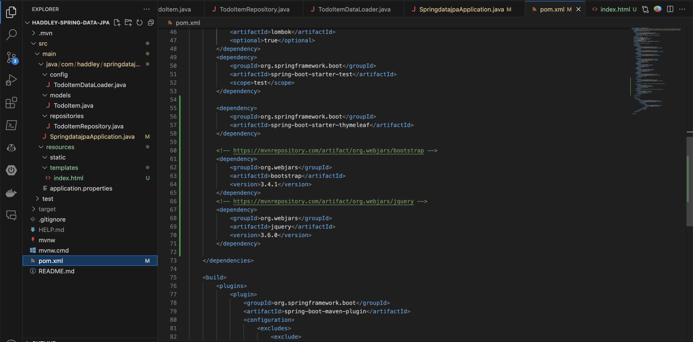
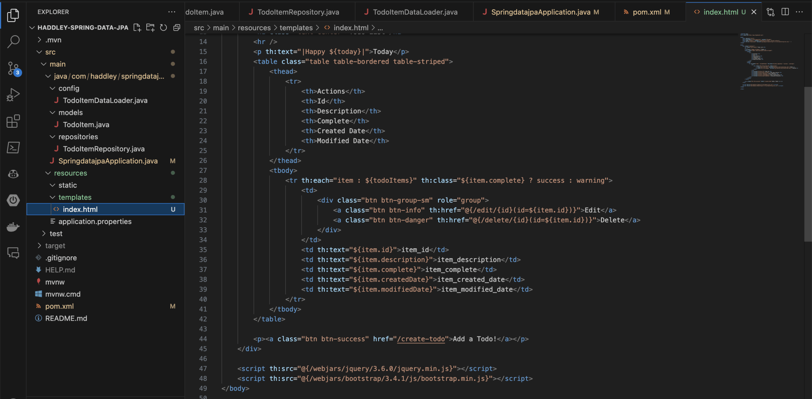
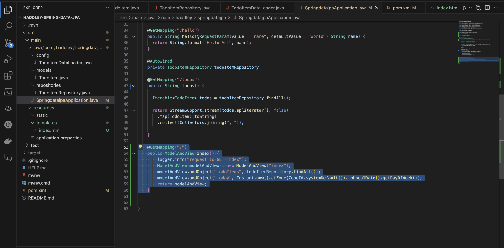
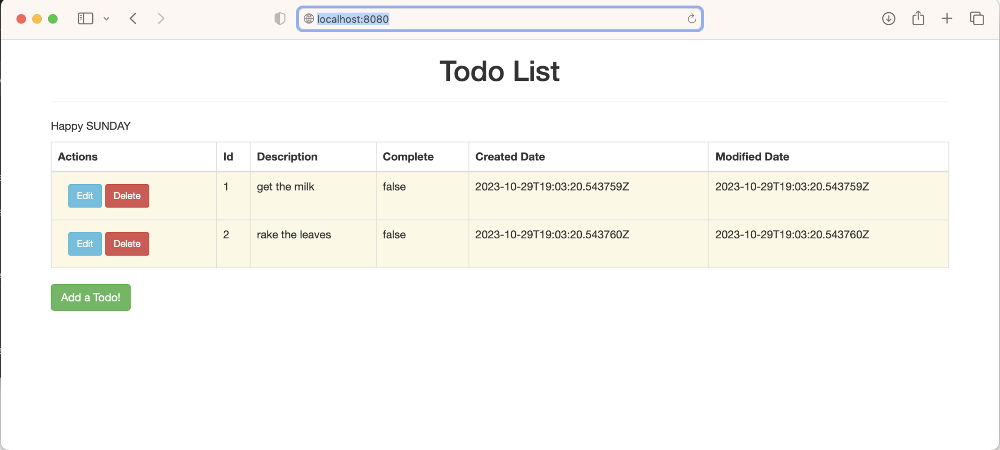
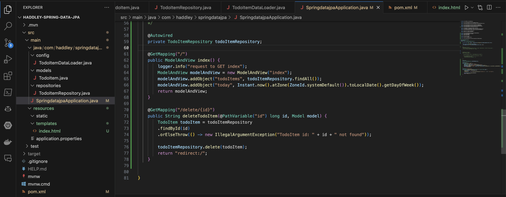
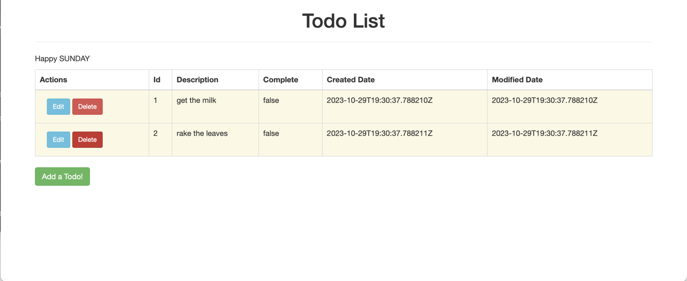
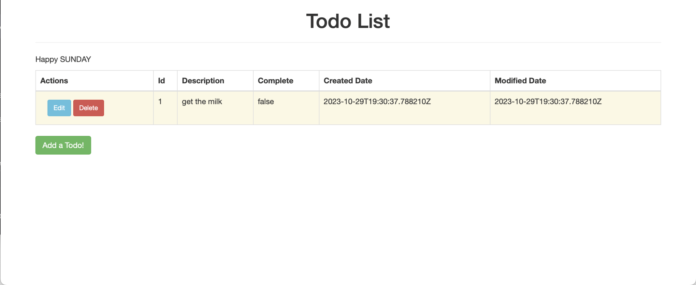

I used Spring MVC's ModelAndView class to pass model data to a Thymeleaf view template for rendering, adding a CRUD interface for the TodoItem application.


*I added thymeleaf, bootstrap and jquery as dependencies*


*I added a thymeleaf page (as an alternative to JSP)*


*I updated the controller to populate the fetch the todo items and to pass them and the current day of the week to the thymeleaf view.*


*The new home page displays the todo items*


*I updated the controller to handle a delete request*


*I clicked the Delete button on the second todo item*


*The second todo item was deleted*


## pom.xml

```xml
<?xml version="1.0" encoding="UTF-8"?>
<project xmlns="http://maven.apache.org/POM/4.0.0" xmlns:xsi="http://www.w3.org/2001/XMLSchema-instance"
	xsi:schemaLocation="http://maven.apache.org/POM/4.0.0 https://maven.apache.org/xsd/maven-4.0.0.xsd">
	<modelVersion>4.0.0</modelVersion>
	<parent>
		<groupId>org.springframework.boot</groupId>
		<artifactId>spring-boot-starter-parent</artifactId>
		<version>3.1.5</version>
		<relativePath/> <!-- lookup parent from repository -->
	</parent>
	<groupId>com.haddley</groupId>
	<artifactId>springdatajpa</artifactId>
	<version>0.0.1-SNAPSHOT</version>
	<name>springdatajpa</name>
	<description>Demo project for Spring Boot</description>
	<properties>
		<java.version>17</java.version>
	</properties>
	<dependencies>
		<dependency>
			<groupId>org.springframework.boot</groupId>
			<artifactId>spring-boot-starter-data-jpa</artifactId>
		</dependency>
		<dependency>
			<groupId>org.springframework.boot</groupId>
			<artifactId>spring-boot-starter-validation</artifactId>
		</dependency>
		<dependency>
			<groupId>org.springframework.boot</groupId>
			<artifactId>spring-boot-starter-web</artifactId>
		</dependency>

		<dependency>
			<groupId>org.springframework.boot</groupId>
			<artifactId>spring-boot-devtools</artifactId>
			<scope>runtime</scope>
			<optional>true</optional>
		</dependency>
		<dependency>
			<groupId>com.h2database</groupId>
			<artifactId>h2</artifactId>
			<scope>runtime</scope>
		</dependency>
		<dependency>
			<groupId>org.projectlombok</groupId>
			<artifactId>lombok</artifactId>
			<optional>true</optional>
		</dependency>
		<dependency>
			<groupId>org.springframework.boot</groupId>
			<artifactId>spring-boot-starter-test</artifactId>
			<scope>test</scope>
		</dependency>

		<dependency>
			<groupId>org.springframework.boot</groupId>
			<artifactId>spring-boot-starter-thymeleaf</artifactId>
		</dependency>

		<!-- https://mvnrepository.com/artifact/org.webjars/bootstrap -->
		<dependency>
			<groupId>org.webjars</groupId>
			<artifactId>bootstrap</artifactId>
			<version>3.4.1</version>
		</dependency>
		<!-- https://mvnrepository.com/artifact/org.webjars/jquery -->
		<dependency>
			<groupId>org.webjars</groupId>
			<artifactId>jquery</artifactId>
			<version>3.6.0</version>
		</dependency>

	</dependencies>

	<build>
		<plugins>
			<plugin>
				<groupId>org.springframework.boot</groupId>
				<artifactId>spring-boot-maven-plugin</artifactId>
				<configuration>
					<excludes>
						<exclude>
							<groupId>org.projectlombok</groupId>
							<artifactId>lombok</artifactId>
						</exclude>
					</excludes>
				</configuration>
			</plugin>
		</plugins>
	</build>

</project>
```

## SpringdatajpaApplication.java

```java
package com.haddley.springdatajpa;

import org.springframework.boot.SpringApplication;
import org.springframework.boot.autoconfigure.SpringBootApplication;

import org.springframework.web.bind.annotation.GetMapping;
import org.springframework.web.bind.annotation.RequestParam;
import org.springframework.web.bind.annotation.RestController;
import org.springframework.stereotype.Controller;

import com.haddley.springdatajpa.models.TodoItem;
import com.haddley.springdatajpa.repositories.TodoItemRepository;
import org.springframework.beans.factory.annotation.Autowired;

import java.util.stream.StreamSupport;
import java.util.stream.Collectors;

import org.springframework.web.servlet.ModelAndView;
import org.springframework.ui.Model;
import java.time.ZoneId;
import java.time.Instant;

import org.slf4j.Logger;
import org.slf4j.LoggerFactory;

import org.springframework.web.bind.annotation.PathVariable;

@SpringBootApplication
@Controller
public class SpringdatajpaApplication {

    private final Logger logger = LoggerFactory.getLogger(SpringdatajpaApplication.class);

    public static void main(String[] args) {
      SpringApplication.run(SpringdatajpaApplication.class, args);
    }

    @Autowired
    private TodoItemRepository todoItemRepository;
    
    @GetMapping("/")
    public ModelAndView index() {
        logger.info("request to GET index");
        ModelAndView modelAndView = new ModelAndView("index");
        modelAndView.addObject("todoItems", todoItemRepository.findAll());
        modelAndView.addObject("today", Instant.now().atZone(ZoneId.systemDefault()).toLocalDate().getDayOfWeek());
        return modelAndView;
    }

    @GetMapping("/delete/{id}")
    public String deleteTodoItem(@PathVariable("id") long id, Model model) {
        TodoItem todoItem = todoItemRepository
        .findById(id)
        .orElseThrow(() -> new IllegalArgumentException("TodoItem id: " + id + " not found"));
    
        todoItemRepository.delete(todoItem);
        return "redirect:/";
    }


}
```
## References

- [Spring Web MVC | 05 | The Model object](https://www.youtube.com/watch?v=lHucuG4jyU0&list=PLdW9lrB9HDw23SG-j-iOlQFGvdM7xU1fR&index=5)