I wanted to teach a Copilot Studio bot to answer "list of companies" by pulling live data from Dynamics 365 Business Central. By default the Copilot had no idea how to respond — so I built a custom Topic that called the Business Central Connector, retrieved the company list from my PRODUCTION environment, and returned the results to the user.

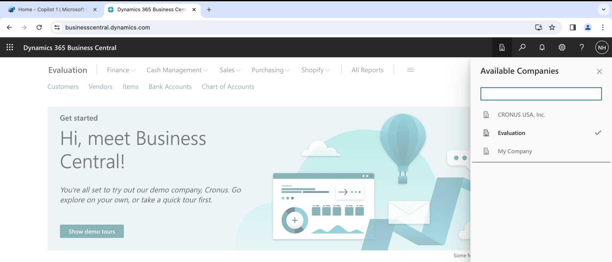
*I confirmed there were three Companies in my PRODUCTION environment*

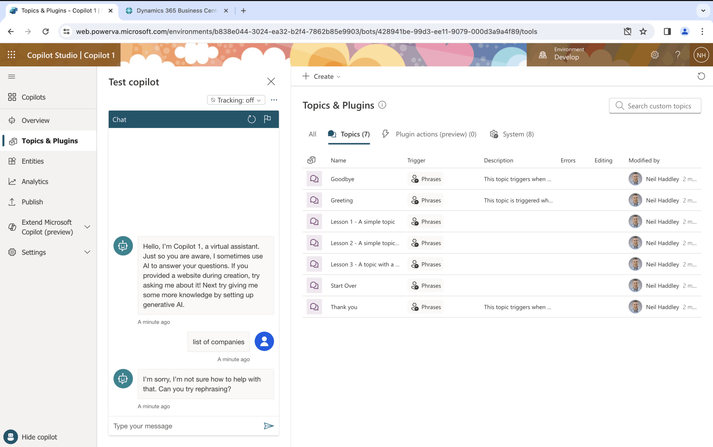
*I created a new Copilot and asked it to provide a "list of companies". It replied "I'm sorry, I'm not sure how to help with that."*

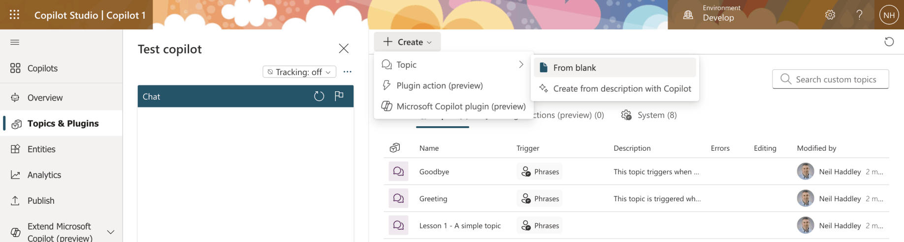
*I created a new Topic from blank*

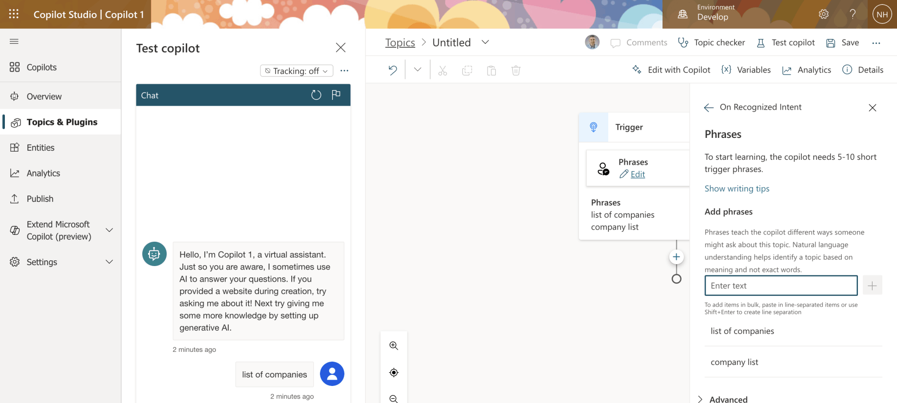
*I added the Phrases "list of companies" and "company list"*

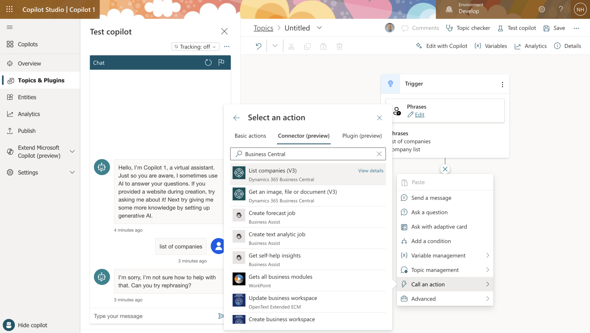
*I selected Call an action > Connector (preview) and chose the "List companies (V3)" action*

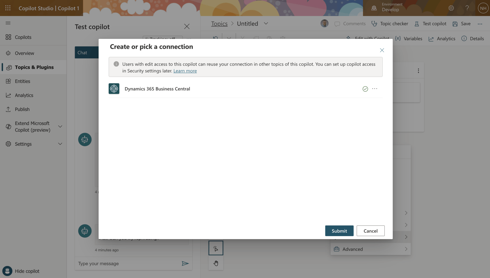
*I clicked the Submit button*

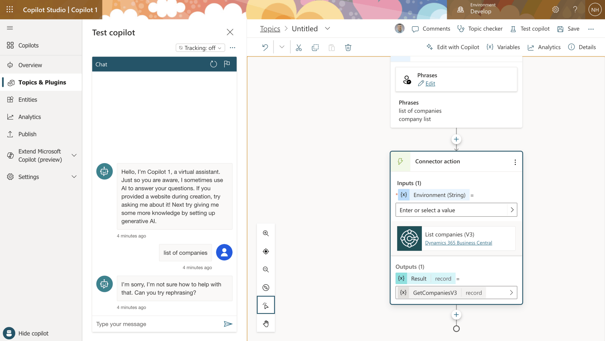
*The Connector action appeared in the Topic flow*

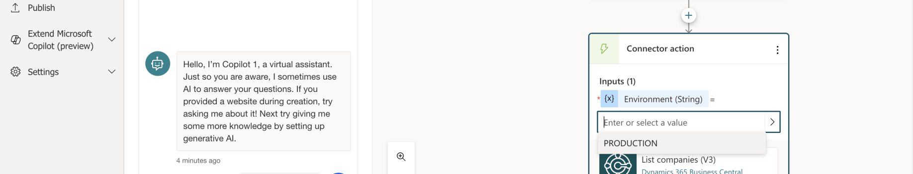
*I provided the Environment (String) PRODUCTION*

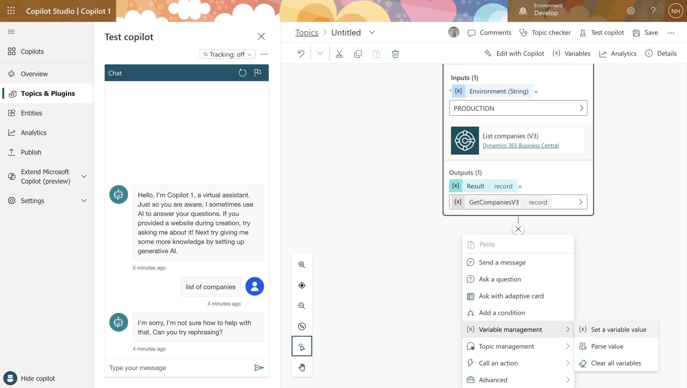
*I selected Variable management > Set a variable value*

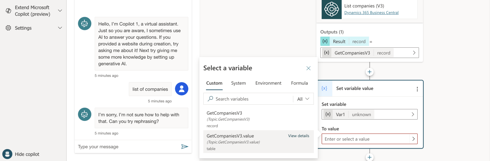
*I set the variable name to Var1 and the value to GetCompaniesV3.value*

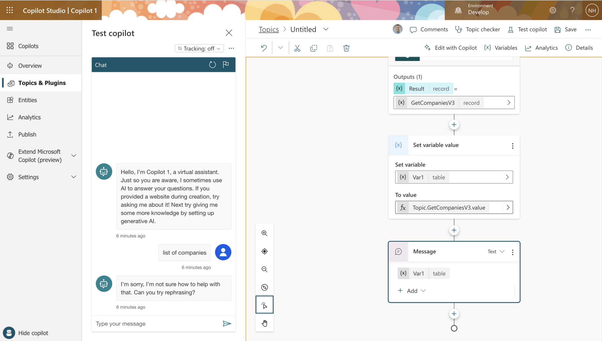
*I selected GetCompaniesV3.value from the variable picker, which set Var1's type to table*

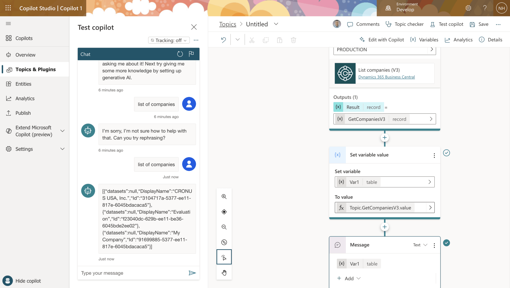
*I added Message to return the Var1 table to the user*

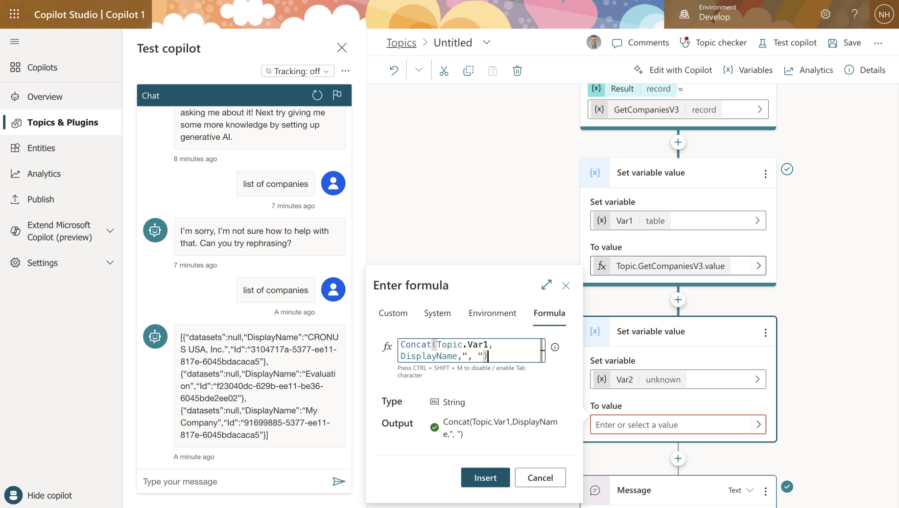
*I created a second variable Var2 and set its value to the list of Company DisplayNames separated by ", "*

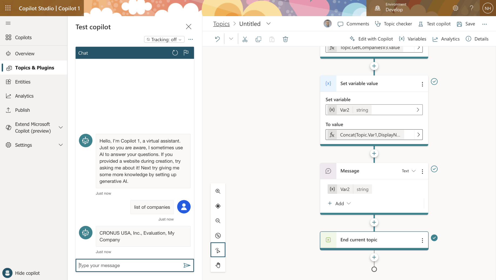
*I selected Topic management > End current topic*

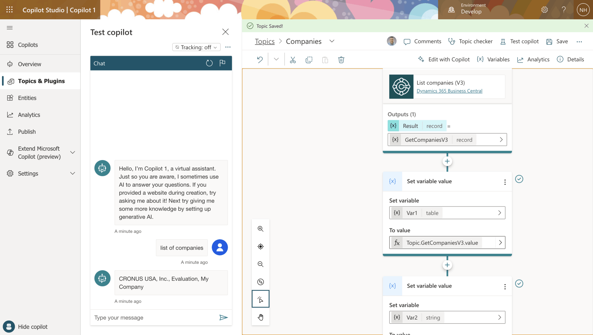
*I entered "list of companies" into the Copilot. It returned the three company names.*