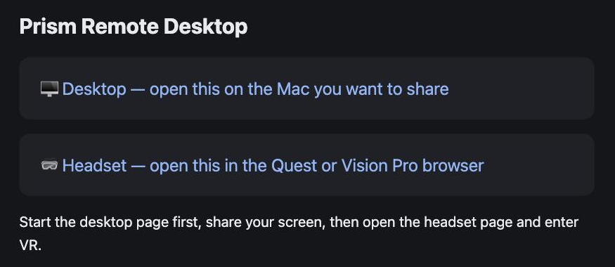
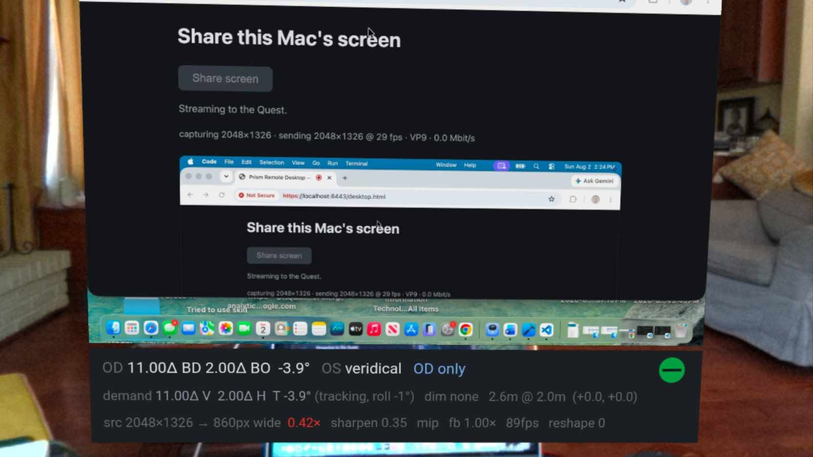
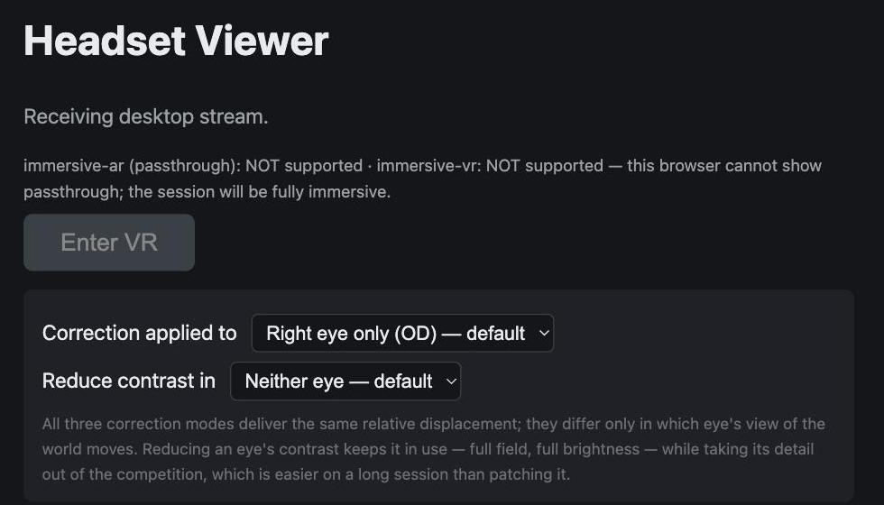
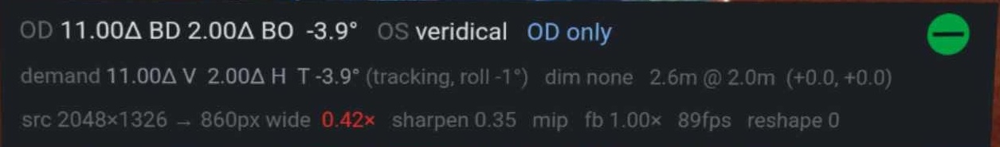

Yesterday I published [Between the shoulders](/posts/bielschowsky/), an interactive page explaining what my right fourth nerve palsy does to the two images my eyes send me, and why the correction has three components of which glass can only deliver two. This post is about the thing I built to *use* the third one all day: a remote desktop viewer that puts my Mac's screen on a large virtual display and pre-rotates it before I ever see it.

The combination I actually work in is a MacBook and a Quest, and the reason it works is that the Quest runs it in **AR**. The virtual screen hangs in front of me, but I can look *below* it and see my real keyboard and my real hands on it, and *past its edges* to the room I am sitting in. I am not in a headset pretending to be at a desk. I am at my desk, with a better screen in front of me.

The project is a private one, so there is no repository to link — but the interesting parts are all describable, and that is what this post is for.

## Why not just wear the glasses in the headset

Because you cannot, comfortably, and because they would only fix two thirds of it anyway. My prescription of record carries 11Δ of vertical prism split between the two eyes plus a small amount of base-out. What it does not carry is the *rotational* part — a prism bends light up, down or sideways, and no optic rolls a retinal image about the line of sight. In a headset I am not looking through glass at all; I am looking at two rendered images, and I can rotate either one of them by any amount I like before it is drawn.

So the whole prescription moves into software:

| | Relative demand | Equivalent spectacle pair |
|---|---|---|
| Vertical | 11.0Δ (6.29°) | OD 5.50Δ base down + OS 5.50Δ base up |
| Horizontal | 2.0Δ (1.15°) | OD 1.00Δ base out + OS 1.00Δ base out |
| Torsion | −4.0° | *no equivalent — glass cannot do this* |

One prism diopter is 1 cm of displacement at 1 m, which is `atan(Δ/100)` ≈ 0.573°. That makes the correction a per-eye rotation applied in eye space, slotted into the usual chain as `mvp = projection * prismMatrix * viewMatrix * model`. The matrices are hand-rolled column-major `Float32Array`s — there is no math library in the project, because at this size one would be more code than the four functions it replaced.

## It runs in the headset's browser

There is nothing to sideload. A Node server on the Mac captures the screen with `getDisplayMedia`, streams it over WebRTC, and serves a WebXR page that the Quest browser (or Safari on visionOS) opens directly. HTTPS is mandatory — both WebXR and screen capture require a secure context — so the server self-signs a certificate into `certs/` on first run and you accept the warning once at each end.

*The whole user interface, such as it is: two links. I open the first on the Mac and share my screen, then the second in the headset. The signaling relay holds one slot per role, and the newest connection wins — so opening the headset page on a second device silently evicts the first, which is worth knowing before you spend ten minutes wondering why the stream went away.*

I keep using the Mac's physical keyboard and mouse. The viewer is deliberately view-only: injecting input would mean a second channel, a permissions story, and a class of bug I did not want in something I use to work.

## The screen hangs in my actual room

This is the part I did not expect to matter as much as it does, and it is what makes the MacBook-and-Quest pairing the one I reach for.

The renderer asks the headset for an `immersive-ar` session and clears the framebuffer to transparent. Every pixel I do not draw is therefore the room — so the virtual screen is a rectangle floating at whatever distance I have set it, and everything around and below it is passthrough. I glance down and my hands are on the actual keyboard. I glance sideways and the room is where I left it. Nothing needs to be mirrored in, modelled, or represented; it is simply still there.

*A capture from inside the Quest, which is the only place any of this can actually be photographed. The virtual screen carries my Mac — here showing the desktop page looking at itself, hence the recursion — and everything around it is the room: curtains, sofa, fireplace, the pictures on the wall, my desk below the bottom edge. The screen and the readout strip beneath it are the only rendered things in the frame. Everything else is the world, arriving at my eyes uncorrected.*

That solves the problem that makes most VR desktops unusable for real work. Typing is fine when you can see your fingers, and it is miserable when you cannot. Being able to see the room means I do not have to break the session to answer somebody or find a coffee cup, and it means my sense of where I am does not have to be rebuilt every time I take the headset off. The virtual display is enormous and the correction is applied to it, but I am still visibly in my own room, at my own desk — and the correction only has to work on the screen, because everything else my eyes are getting is the real world.

Which is worth stating precisely, because it cuts both ways: **anything the system composites in bypasses the prism entirely.** The correction applies only to rendered content. The passthrough room arrives at my eyes uncorrected, exactly as it does when I am not wearing the headset — with the double vision I have had since 2018 and the head tilt I use to manage it. So I do not get a corrected *world*; I get a corrected screen inside an uncorrected world. For working at a desk, that turns out to be the trade I want, and my glasses handle the rest of the room the way they always have.

The distance and size controls matter more than I assumed for the same reason. Pushing the screen out to three or four metres and growing it puts the whole thing in the part of my field where the vertical demand is best characterised, and leaves the keyboard comfortably below the bottom edge rather than behind it.

## Storing the prescription as a difference, not a pair

The prescription started life in the code the way it appears on the card — two eyes, 5.50Δ each way. I changed it to store the *relative* demand instead, because that is what fusion actually depends on. The two eyes do not care how the 11Δ was divided; they care that the images arrive 11Δ apart.

Once it is stored that way, where the correction lands becomes a separate, switchable choice:

| Mode | What moves |
|---|---|
| **Right eye only (OD)** — the default | The whole correction goes on the affected eye; the left eye's view of the world is untouched |
| Split between both | Reproduces the spectacle prescription exactly |
| Left eye only (OS) | The same geometry with the roles swapped — a control condition |

All three deliver the same relative displacement to within about half a degree, which makes switching between them close to a clean A/B of *where* the correction is applied rather than *how much* of it there is.

*The headset page before entering the session, with the two mode selectors — which eye receives the correction, and which eye (if any) has its contrast reduced. I captured this in Chrome on the Mac rather than in the headset, which is why both XR modes report "NOT supported" and the button reads "Enter VR": that line is the page telling me what this browser can actually do. On the Quest it reports `immersive-ar` as supported and the button reads "Enter Passthrough".*

Right-only is the default because it won on measurement, not preference. In the measuring rig, right-only beat split in every battery it was tested in, and **split scored worse than applying no correction at all**. That result makes sense in hindsight: the palsy is in one eye, and putting half the roll on the sound eye rotates a world that was never tilted to begin with. Glass has no choice — it has to split, because 11Δ in a single lens is a wedge nobody would wear. Software has no such constraint, and it turns out the constraint was costing something.

## The rotation follows my head

The torsional demand is not a constant. It falls toward my left shoulder and grows toward my right — that is Bielschowsky's sign, and it is the reason my head has found a leftward tilt on its own. Measured nulls put the demand at about 4° with my head level and 1–2° at 40° of left roll. A fixed −4° would therefore *over*-correct by roughly 4° if I leaned left, which is outside my ±2.5° fusible range: it would fight me in exactly the posture I adopt to cope.

So the applied rotation tracks head roll:

| head roll | torsion applied |
|---|---|
| 30° left | −1.0° |
| level | −4.0° |
| 30° right | −7.0° |

Bounded on purpose, in three separate ways. The slope is the least stable number in the whole project — it has come out at +0.16, +0.140, +0.095, +0.056, +0.059 and +0.101 across sessions — so the roll input is clamped at ±30° and holds rather than extrapolating beyond that; the adjustment never moves more than ±4° from the null; and it is rate-limited to 4°/s, because cyclovergence is slow enough that a correction snapping to my head would outrun the eye that has to follow it.

*The calibration readout, sitting below the screen where I can check it without breaking off what I am doing. The top line is what is being applied: the whole 11.00Δ and 2.00Δ on the right eye, the left eye `veridical` — untouched — and `OD only` naming the mode. The second line shows the tracking working. My head was rolled 1° left, and against a slope of −0.10° per degree that lifts the torsion from its −4.0° null to −3.9°. Small enough to be invisible, which is the point: I can watch the number move with my head and satisfy myself it is tracking before I trust it with anything larger.*

Roll tracking ships on, which means an uncomfortable hour cannot be attributed on its own — it could be the −4° baseline or it could be the slope. Holding Y and pressing X turns tracking off, which is how I tell the two apart without leaving the desk.

The vertical and horizontal deliberately do *not* track. The vertical demand certainly varies with head roll, but that variation has never been measured here, and the model term that would predict it was fitted from a headset channel later shown to be synthesised from head pose rather than measured. Inventing a slope for the one number I have most reason to distrust would be the wrong kind of confidence.

## Reducing one eye instead of patching it

The newest control is a contrast reduction: it crushes one eye's image toward mid grey — what a Bangerter foil does to a spectacle lens — while leaving that eye its full field and full brightness. The attenuated eye keeps contributing peripheral fusion; its *detail* just stops competing with the other eye's.

The point is to have something between "both eyes working" and "one eye patched" for a long session at the edge of fusion. It is off by default and cycles with Y + X.

## Getting enough pixels through the air

Half the work in this project has nothing to do with optics. A remote desktop is only useful if the text is readable, and by default WebRTC will not give you that.

Three things were quietly throwing away detail:

**The capture was already half resolution.** `getDisplayMedia` on a Retina display hands back the *logical* resolution unless you ask otherwise — a 1512-pixel-wide frame of a 3024-pixel-wide screen. Every glyph had lost half its detail before the encoder ever saw it. Requesting `ideal` at the panel's physical pixel count fixes it.

**Congestion control was capping the link at a couple of megabits.** That is the polite default for a video call crossing the open internet. This is a Wi-Fi hop across one room, and 4K text while scrolling wants an order of magnitude more, so the ceiling goes to 40 Mbit/s with an 8 Mbit/s start rate rather than crawling up from 300 kbit/s.

**And the ceiling has to be written by the wrong end.** This is the part that cost me the most time. An encoder obeys the bandwidth line in the description it *receives* — so the `b=AS` line that actually unlocks the Mac's encoder is the one in the **answer**, which the headset sends. Setting it locally on the Mac does nothing at all. Both ends now shape the SDP, idempotently, because neither knows whether the far end is a current copy of the page.

I also pinned the frame rate to 30 fps, which is not just a bitrate trade. When the encoder cannot meet its target it first drops frames, and only once it has run out of frames to drop does it start scaling *resolution* — and every resolution step changes the decoded frame size, which the renderer turns into a change in the shape of the virtual screen. Halving the frame rate leaves a wide margin of frames to spend before the picture is ever allowed to resize. What it costs is some smoothness in the mouse cursor during a fast drag, which is a poor trade against a screen that changes size while you read.

VP9 is preferred first: it has intra prediction modes aimed at flat regions and hard edges, which is exactly what a desktop is, and the Quest decodes it in hardware. H.264 second, since it is hardware-decoded everywhere including Safari on visionOS.

The desktop page now prints a live line — what it is capturing, what it is sending, at what frame rate, in which codec, at how many megabits, and what the encoder says is limiting it. It is the first thing to read when the picture looks bad, and it turns "the text is blurry" into a specific fault every time.

And then the headset reports the half of the problem the Mac cannot see. The third line of the readout above says `src 2048×1326 → 860px wide 0.42×`, with the ratio in red — green above 0.9, amber above 0.5, red below. That is not a network complaint at all. It is telling me that a screen arriving 2048 pixels wide is being drawn across only 860 pixels of headset display, so well over half the detail I fought for is being thrown away at the last step, by geometry.

The fix is not more bitrate. It is a bigger or nearer virtual screen — or moving my head closer, which is free. It was worth building because I spent real time tuning encoder settings for a picture whose limit was that I had parked the screen too far away, and no amount of megabits was ever going to fix that. `reshape 0` on the same line is the counter of resolution changes, which is how I check that the 30 fps decision is doing its job: as long as it stays at zero, the screen has never once changed shape.

## Why the Vision Pro cannot do the same thing

The passthrough path above only ever engages on the Quest. **Safari on visionOS does not support `immersive-ar`** — `isSessionSupported` returns false, and while the WebKit flag exists it is non-functional. So the renderer asks for `immersive-ar`, does not get it, and falls back to `immersive-vr`, which is opaque. On the Vision Pro the room goes away.

That is correct behaviour rather than a bug, and the page prints both the supported modes and the resulting `environmentBlendMode` under the status line so I can check which one I landed in without guessing.

The Vision Pro is not left with nothing, though — it just comes from the system rather than from my code. visionOS 2's Keyboard Breakthrough composites a Magic Keyboard and my hands through fully immersive sessions, WebXR ones included. I confirmed it empirically: the hands break through. So I can still type. What I do not get is the rest of the room, which is precisely the thing I like most about running it on the Quest. A keyboard punched through a black void is a workable compromise; a screen hanging in my actual office is not a compromise at all.

## What this does and does not buy me

The point of the rotation is sustained comfort at a desk: being able to work without adopting a left head tilt or closing an eye. Whether it actually delivers that is **not yet demonstrated**. The "does it help?" question in the parent project remains untested, and is now known to have been *untestable* so far, because every previous attempt applied a bad vertical figure alongside the rotation.

So the −4° is the best available starting point, not a result. If a long session leaves me tilting anyway, that is data — and it is the reason the toggles exist.

One caution I have written into the README and will repeat here: I checked the sign of the rotation before trusting it. The renderer and the measuring rig were written independently, and a roll convention is easy to get backwards. If −4° makes the doubling worse rather than better, dialling to +4° makes that obvious within seconds. A sign error is precisely the failure that cost the parent project a session.

## Notes

- Check with your optometrist before extended use. This applies prescribed prism amounts faithfully, but VR viewing differs from real-world viewing — fixed focal distance, vergence–accommodation conflict — and the headset's own IPD setting affects eye alignment too.
- If the Mac's LAN IP changes, delete `certs/` so the certificate regenerates with the new address. A certificate that does not cover the address you are browsing to fails before anything else does.
- A `wss://` connection to a self-signed certificate fails **silently**, with no usable error. Visit `https://<your-mac-ip>:8443/` once in the same browser and accept the warning first.
