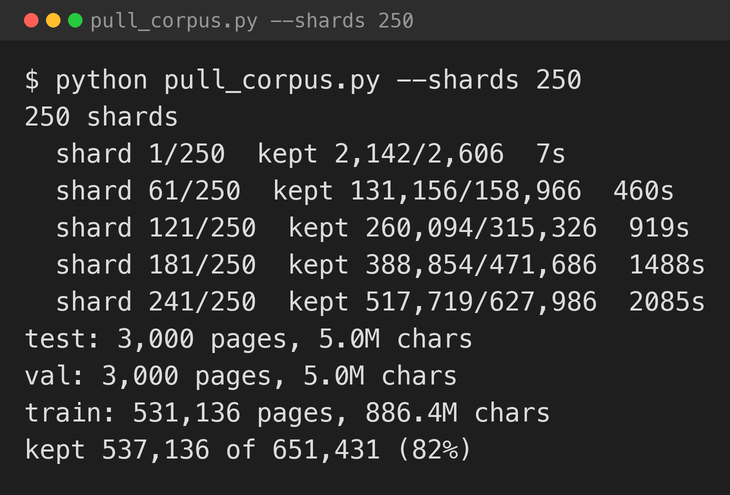
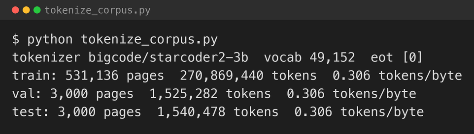
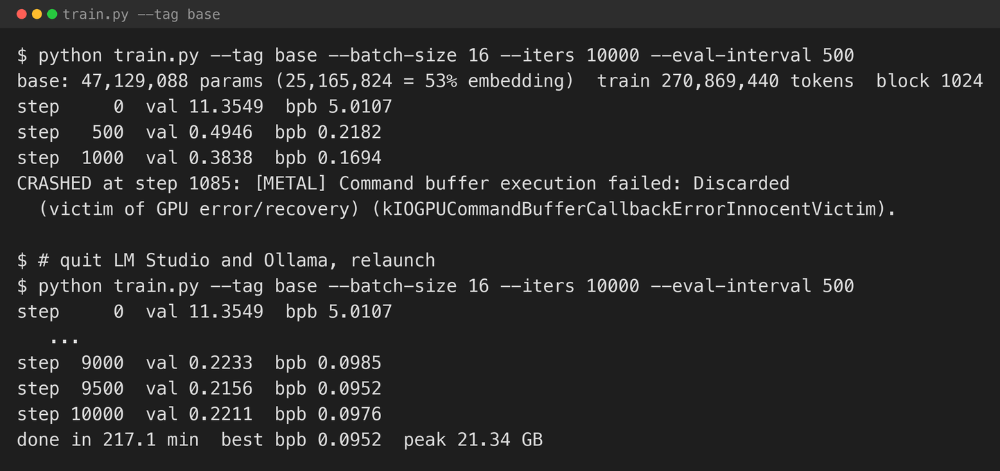
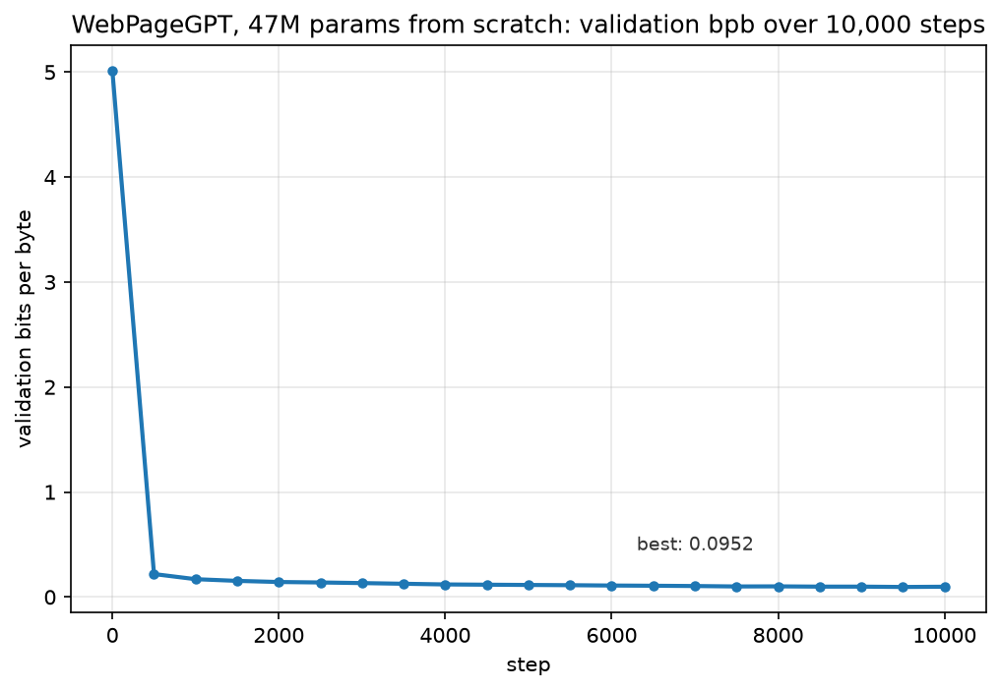

I wanted to show distillation [Part 5](/posts/minigpt5/) actually helping, at a scale I can run end to end on this machine. That meant picking a problem where a small student and a real teacher are both usable, and where I can see the win with my own eyes rather than read it off a loss curve. HTML pages fit all three. There is a natural teacher — [StarCoder2](https://huggingface.co/bigcode/starcoder2-3b), a 3B-parameter code model trained on permissively licensed source including huge amounts of HTML and CSS. There is a natural corpus of raw examples on Hugging Face. And the output renders in a browser, so I can look at a page and judge it, the way I could never really judge a paragraph of TinyStories prose against another.

So: **WebPageGPT**. Same machine as the MiniGPT series (2022 Mac Studio, Apple M1 Max, 64 GB RAM), same MLX training loop and modern Transformer block from [Part 4](/posts/minigpt4/), new domain. The plan is three posts: this one builds the corpus and trains a small model from scratch to see what raw next-token prediction gets you; the next scales the model and the context; the third distils from StarCoder2-3B and checks whether the distilled student beats the from-scratch model, or reaches the same quality in fewer steps. I do not know yet whether part three will work. That is the point of writing it as I go.

## The corpus

I do not need to train my own teacher for this — StarCoder2 already exists, was trained on far more code than I could gather, and is small enough to run on this machine. What I do need is raw training examples: real HTML documents, not code embedded in Q&A pairs or Stack Overflow snippets.

[HuggingFaceM4/WebSight](https://huggingface.co/datasets/HuggingFaceM4/WebSight) is a synthetic dataset of self-contained web pages: each row is a rendered screenshot paired with the HTML and Tailwind CSS that produced it, generated by prompting an LLM with a page idea and keeping the result if it rendered without errors. I only need the HTML, not the 400MB-per-shard screenshot images, so I read the corpus with DuckDB's Parquet support over HTTP and projected out just the `text` and `llm_generated_idea` columns:

```python
con.sql("""
  CREATE SECRET hf (TYPE huggingface, TOKEN '...');
  SELECT text, llm_generated_idea
  FROM read_parquet('hf://datasets/HuggingFaceM4/WebSight/v0.2/*.parquet')
""")
```

Not every generated page is usable. Some are truncated, some are one giant unbroken line, some are mostly non-ASCII noise from a prompt gone sideways. I kept a page if it was 600–6,000 bytes, contained proper `<html>`/`</html>`/`<body` tags, had at least four newlines, no single line longer than 400 characters, and at most 2% non-ASCII characters — then deduplicated by hashing the whitespace-stripped HTML, since the generator produces near-identical pages from similar prompts.


*Pulling 250 of WebSight's 738 shards. The filter keeps about 82% of pages.*

That left 531,136 training pages (886.4M characters), plus 3,000 held out each for validation and test.

## The tokeniser

I used StarCoder2's tokeniser rather than training my own: a 49,152-token byte-level BPE trained on [The Stack](https://huggingface.co/datasets/bigcode/the-stack), with dedicated tokens for indentation runs and common markup. Two reasons. First, it already understands the vocabulary of this domain — `<div`, `class=`, four-space indents — better than anything I would train on 531,000 pages myself. Second, and more important for where this series is going: using StarCoder2's own tokeniser now means Part 3's distillation from StarCoder2-3B lines up token-for-token with the student, with no vocabulary translation between teacher and student logits.

Each page is emitted as `<|endoftext|> <html>...</html>`, so the model learns where a document starts and ends the same way GPT-2 does.


*270.9M training tokens at 0.306 tokens per byte — HTML's angle brackets and repeated attribute names compress well under a code-aware BPE.*

## The model

I reused [Part 4](/posts/minigpt4/)'s modern block unchanged: RMSNorm, RoPE, SwiGLU, grouped-query attention. No architecture changes for this first pass — the point of Part 1 is to see what a known-good small Transformer does on a new domain, not to reintroduce every ablation.

| | |
|---|---|
| Parameters | 47,129,088 |
| Embedding share | 53% (25.2M of 47.1M — StarCoder2's 49,152-token vocabulary is the majority of this model) |
| Layers | 8 |
| Heads / KV heads | 8 / 2 |
| Context | 1,024 tokens |
| Norm / position / MLP | RMSNorm / RoPE / SwiGLU |

More than half the parameters are the token embedding table, which is the price of reusing a 49k-token vocabulary built for a 3B-parameter model on a 47M-parameter one. Part 2 is where I address that — either a longer context to amortise the fixed embedding cost over more tokens per document, or a larger transformer body to shift the ratio.

## Training, twice interrupted

I trained for 10,000 steps, batch size 16, 1,024-token context, AdamW with a cosine schedule — the same recipe as MiniGPT Part 4. Two runs crashed with the GPU error I have seen a few times through this series, a Metal command buffer killed by macOS to protect interactivity or recovered after another process's hang. This time the cause was concrete: I had LM Studio and Ollama both idling in the background, each holding a model on the same GPU this training run needed. Quitting both fixed it.


*The incremental history file means a crash costs minutes, not hours — the curve up to the crash point survives on disk.*

The third attempt ran clean for the full 217 minutes.


*Validation bits-per-byte from 5.01 (untrained) to 0.095 — a very steep drop, because HTML boilerplate (`<!DOCTYPE html>`, repeated Tailwind class names, closing tag structure) is far more predictable than natural-language prose.*

Bits-per-byte this low is expected here, not a sign the model has learned to reason about layout. A page with the same `<div class="...">` scaffolding repeated eight times only needs the model to predict "more of the same" to score well. The real test is not the number — it is what the model generates unprompted.

## What it renders

I generated ten pages from the prompt `<html>`, temperature 0.7, top-k 40, and rendered each one with headless Chrome. This model has seen 531,000 real (if synthetic) web pages and nothing else — no instructions, no chat template, just "predict the next token of a web page."


*A five-section non-profit landing page: hero, mission, get-involved, testimonials, donate — coherent structure the model was never told to produce.*


*A different sample: navigation bar with a placeholder logo image, centred hero heading and copy.*


*A two-column about/courses layout with a plausible contact email and phone number, and a footer copyright line.*


*A card component — image placeholder, heading, description — the kind of repeating unit WebSight's generator produces often, and the kind of unit this model has clearly learned as a pattern.*

None of these are pages I would ship. The copy is generic ("cutting-edge technology solutions," "committed to providing high-quality"), because that is what a synthetic, LLM-generated corpus sounds like, and a 47M-parameter model has no capacity to say anything more specific than what it has memorised the shape of. Some pages repeat a section twice, or have a component that does not quite land visually. But every one of them is a real, renderable page with sensible tag nesting, working Tailwind utility classes, and a structure a human would recognise as "a landing page" or "a course catalog" — from a model with no HTML syntax rules built in, trained from a random initialisation, on one machine, in under four hours.

## What I took from it

- **The corpus does the shaping.** I never told this model what a landing page looks like. WebSight's generator produces enough repeated structure (hero, three-feature-grid, footer) that the model absorbed the pattern as the statistically likely continuation of `<html>`.
- **Embedding-dominated models are a real cost of reusing a big tokeniser.** 53% of this model's parameters exist only to look up one of 49,152 token vectors — necessary for Part 3's alignment with StarCoder2, expensive for a 47M-parameter model. Part 2 has to address this ratio directly.
- **GPU contention is a training-time risk on a shared machine, not a fluke.** Two of three attempts here died to it. The fix was mundane — quit the other apps holding the GPU — but the incremental history dump from the MiniGPT series is what made the crashes cheap instead of costly.

## What's next

Part 2 scales the model and the context, to close the gap between "recognisable page structure" and "specific, sensible content." Part 3 caches StarCoder2-3B's logits over this same corpus and distils a student against them, to see whether a small model can get closer to StarCoder2's fluency than training on raw text alone gets it — and whether it gets there in fewer steps.

## Try it yourself

The code is in [github.com/Haddley/webpagegpt](https://github.com/Haddley/webpagegpt) under `part1/`:

```bash
python pull_corpus.py --shards 250      # ~35 min; text column only, screenshots skipped
python tokenize_corpus.py               # StarCoder2 tokeniser -> data/*.npy
python train.py --tag base --batch-size 16 --iters 10000
python generate.py --tag base --n 10 --render
```

Requires Apple Silicon for MLX, and a headless Chrome install to render generated pages.

## References

- [HuggingFaceM4/WebSight](https://huggingface.co/datasets/HuggingFaceM4/WebSight)
- [StarCoder2 — Lozhkov et al., 2024](https://arxiv.org/abs/2402.19173)
- [The Stack — Kocetkov et al., 2022](https://arxiv.org/abs/2211.15533)
- [MiniGPT series](/posts/minigpt/)
