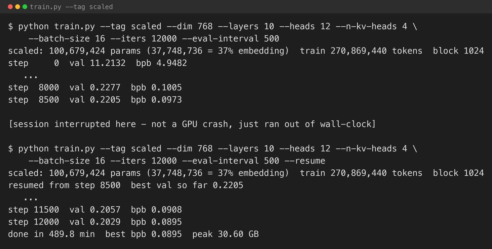
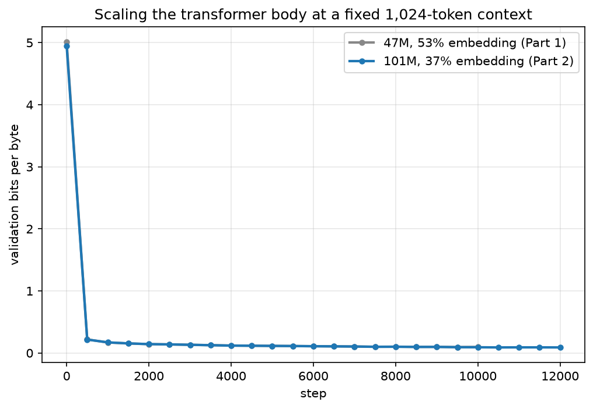

[Part 1](/posts/webpagegpt/) trained a 47M-parameter model on 531,000 web pages and got genuinely structured output — landing pages with hero sections, navigation, footers — but the copy was generic and the model's own parameter budget was working against it. Reusing StarCoder2's 49,152-token vocabulary meant the embedding table alone was 53% of the model. Only 22M parameters were actually doing the work of learning what a web page looks like.

This post fixes that ratio the direct way: scale the transformer body, keep the context and the vocabulary fixed, and see what a model with more room to think produces.

## The new config

Same corpus, same StarCoder2 tokeniser, same 1,024-token context, same [Part 4](/posts/minigpt4/) block (RMSNorm, RoPE, SwiGLU, grouped-query attention). Only the body changed.

| | Part 1 | Part 2 |
|---|---|---|
| Parameters | 47,129,088 | 100,679,424 |
| Embedding share | 53% | 37% |
| Layers | 8 | 10 |
| Dim | 512 | 768 |
| Heads / KV heads | 8 / 2 | 12 / 4 |
| Non-embedding parameters | 21.9M | 62.9M |

2.86x the non-embedding parameters, for 2.14x the total. The embedding table is fixed cost — 49,152 × 768 either way, since a bigger vocabulary was already the price of admission for Part 3's distillation — so every additional parameter here goes to the transformer body doing more with the same tokens.

I smoke-tested the config first: 20 steps at batch 16 peaked at 30.6GB, comfortably inside this machine's 64GB, so no need to shrink the batch size the way I might have for a bigger jump.

## Training, interrupted differently this time

I trained for 12,000 steps — about 0.9 epochs of the 270.9M-token corpus, versus Part 1's 0.6. This run's interruption was not a GPU crash; it was a session boundary in the middle of an unattended run, at step 8,500. Rather than start over, I added a `--resume` flag to `train.py`: it loads the last checkpoint (already the best-validation one, since bpb had been falling every eval) and the existing history file, and continues the same cosine schedule from the step it left off.


*A 47-minute-per-1,500-step training run does not need to survive in one sitting if the checkpoint and history both persist.*


*The 101M model tracks below the 47M model's curve throughout, and is still improving at step 12,000 — the smaller model had mostly flattened by 8,000.*

Final validation bits-per-byte: **0.0895**, against Part 1's 0.0952. A modest improvement in the metric — bits-per-byte on this corpus is dominated by boilerplate either model predicts well — but the more interesting difference is in what the two models actually write.

## What it renders now

I generated the same way as Part 1 — prompt `<html>`, temperature 0.7, top-k 40, ten samples, rendered with headless Chrome — and looked for the kind of specificity Part 1 did not have.


*"Automotive Company" — a topic Part 1 never produced. Full hero, nav bar, two-column about section with an image placeholder, a coloured call-to-action band with a working button style, and a footer.*


*"Food and Beverage Company" — and the nav bar has "Menu" instead of the generic "Services" every Part 1 page used. That is a detail specific to this business, not boilerplate.*


*A non-profit page with invented but plausible specifics: "provided over 1 million for various charities," "500 meals to over 500 families," a contact block with `info@ournonprofit.org` and a properly formatted phone number — where Part 1's equivalent page topped out at "we have helped many individuals and communities."*

None of this is factual — the numbers are fabricated, the way any of these WebSight-trained models fabricate everything, and the underlying non-profit does not exist. What changed is the model's willingness to commit to specifics at all, instead of retreating to the safest, most repeated phrasing in the corpus. That tracks with the parameter story: a model whose capacity is not half-consumed by an embedding lookup table has more room to represent "this is a food company, so use food words" rather than "this is A Company, use Company words."

## What I took from it

- **The embedding-ratio fix worked as predicted, not just on paper.** Cutting the embedding's share from 53% to 37% by growing the body, not the vocabulary, produced the qualitative change I was hoping for: more specific, more domain-consistent copy, not just a better bits-per-byte number.
- **A resumable training loop is worth building before you need it, not after.** The `--resume` flag took ten minutes to add and saved four and a half hours of otherwise-repeated compute. The incremental history and best-checkpoint saving from the MiniGPT series is what made resuming trivial — the state to resume from was already on disk.
- **Bits-per-byte undersells this comparison.** 0.0973 → 0.0895 does not look like a big jump on the chart. The rendered pages tell a different story, which is the whole reason this series is judging web pages by eye and not just by loss curve.

## What's next

Part 3 caches StarCoder2-3B's logits over this same corpus and distils a student against them — the actual point of this series. The question is whether distillation gets a small model closer to "Automotive Company, Menu, $500 to 500 families"-level specificity faster than more raw next-token training does, the way [Part 5](/posts/minigpt5/) showed for TinyStories at a much smaller scale, or whether — as the MiniGPT series' unpublished attempt found at frontier scale — the gap between teacher and student is still too wide to close here too.

## Try it yourself

The code is in [github.com/Haddley/webpagegpt](https://github.com/Haddley/webpagegpt) under `part1/`:

```bash
python train.py --tag scaled --dim 768 --layers 10 --heads 12 --n-kv-heads 4 \
    --batch-size 16 --iters 12000 --eval-interval 500
python generate.py --tag scaled --n 10 --render

# if a run gets interrupted, continue from the last checkpoint:
python train.py --tag scaled --dim 768 --layers 10 --heads 12 --n-kv-heads 4 \
    --batch-size 16 --iters 12000 --eval-interval 500 --resume
```

Requires Apple Silicon for MLX, and a headless Chrome install to render generated pages.

## References

- [HuggingFaceM4/WebSight](https://huggingface.co/datasets/HuggingFaceM4/WebSight)
- [StarCoder2 — Lozhkov et al., 2024](https://arxiv.org/abs/2402.19173)
- [WebPageGPT Part 1](/posts/webpagegpt/)
- [MiniGPT series](/posts/minigpt/)
