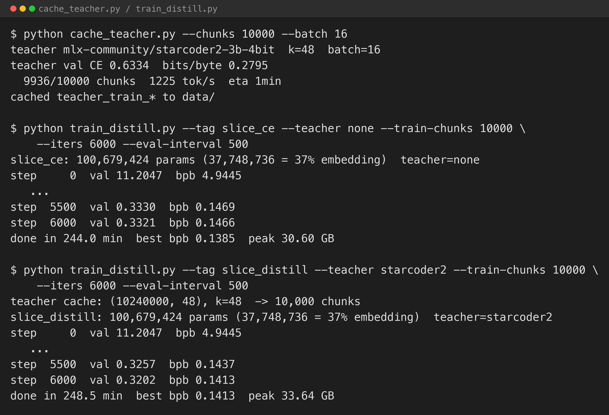
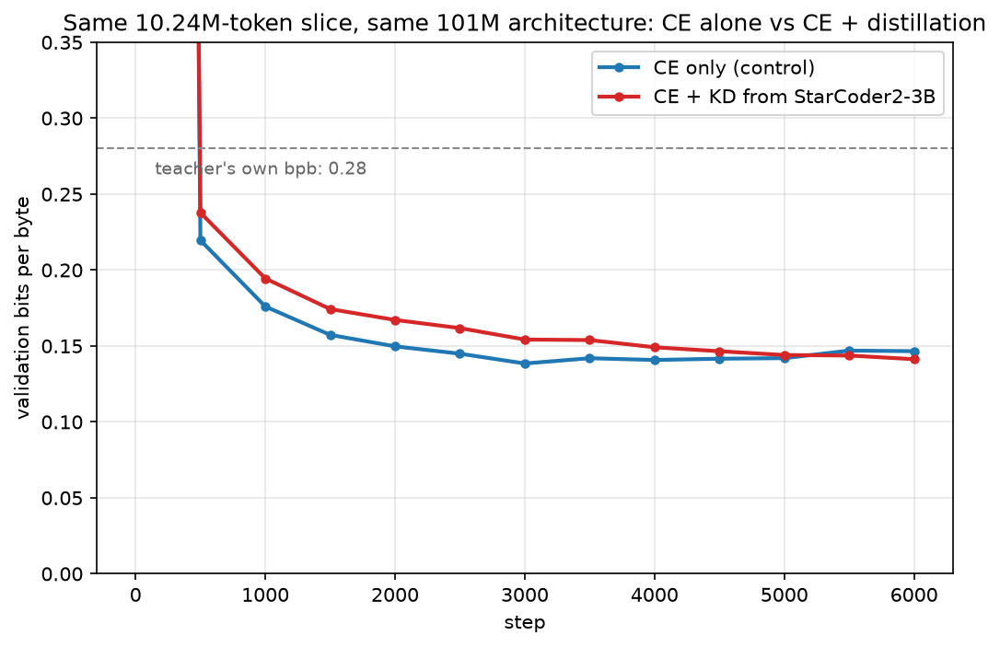

[Part 2](/posts/webpagegpt2/) scaled the transformer body to 101M parameters and got more specific, less repetitive pages. This post is the one the series has been building toward: distilling a student from [StarCoder2-3B](https://huggingface.co/bigcode/starcoder2-3b), the real teacher this domain has, and checking whether it helps.

## Caching the teacher

Distilling from a 3B-parameter model at every training step would mean running it forward on every batch — slow, and it ties every student experiment to keeping the teacher loaded. Instead I ran it once, offline, over a prefix of the training stream, and cached its top-48 next-token logits at every position, the same approach the MiniGPT series used in Parts 5 and 7.

I used [`mlx-community/starcoder2-3b-4bit`](https://huggingface.co/mlx-community/starcoder2-3b-4bit) — the same tokeniser and vocabulary as the student, so no translation between teacher and student logits is needed. Cutting the stream into non-overlapping 1,024-token chunks (the student's context length) and caching the top 48 logits per position over the first 10,000 chunks — 10.24M tokens — took about 2 hours on this machine at roughly 1,250 tokens/second.

Before caching, I measured the teacher's own bits-per-byte on held-out pages, the same way I score the students:

**StarCoder2-3B: 0.28 bits per byte. Part 2's from-scratch 101M student: 0.09.**

The teacher — thirty times the parameters, trained on vastly more code than this corpus contains — is worse at predicting WebSight's own pages than a model a fraction of its size that has simply seen 531,000 of them. That is not a bug in the measurement. It is the headline finding of this post, and it is worth understanding before looking at whether distillation helped.

## Why the teacher loses

StarCoder2 was trained on [The Stack](https://huggingface.co/datasets/bigcode/the-stack): real, messy, heterogeneous source code, in dozens of languages, written by humans for many different purposes. WebSight is the opposite kind of corpus — a single synthetic generator, prompted with a page idea and told to produce a self-contained Tailwind page, run over and over. Its output is narrow: the same `<!DOCTYPE html>` opening, the same CDN script tag, the same handful of section patterns, the same register of marketing copy, repeated across more than half a million pages with only the specifics changed. A model trained directly on that narrow distribution can get very close to its entropy floor. A model trained on the broad distribution of real-world code has never specialised on this generator's particular tics, and pays for that generality every time it has to predict the next token of a WebSight page specifically, rather than of code in general.

## What the literature says

This is not a surprising result once you look for it — it is a fairly well-established pattern, and this exercise is a small, concrete demonstration of it rather than a new finding.

**[TinyStories](https://arxiv.org/abs/2305.07759) (Eldan & Li, 2023)** is the direct ancestor of this observation, and of this series' whole approach: a model of a few million parameters, trained only on a narrow, synthetic, deliberately low-diversity corpus, produces fluent output within that corpus's distribution that is competitive with models orders of magnitude larger evaluated on the same narrow task. The paper's argument is that general fluency over open-domain text needs enormous capacity because the distribution is enormously diverse, while a narrow target distribution has a correspondingly lower entropy floor — a small model can get close to optimal on it without needing to also represent everything else language can do.

**["Textbooks Are All You Need"](https://arxiv.org/abs/2306.11644) (Gunasekar et al., 2023 — phi-1)** made a related case for code specifically: a 1.3B model trained on curated, narrow, textbook-quality data matched much larger general models on the benchmark that data targeted. The lever there is curation more than narrowness, but the mechanism overlaps with TinyStories and with this post: less capacity is needed when the training distribution is a close match to the evaluation distribution.

**[PubMedBERT](https://arxiv.org/abs/2007.15779) (Gu et al., 2020)** and **BioBERT (Lee et al., 2019)** showed the same thing in NLP, and predate the current wave of large language models: a smaller model pretrained from scratch only on in-domain biomedical text beat a general-purpose model fine-tuned on the same downstream tasks. **[Gururangan et al. (2020), "Don't Stop Pretraining"](https://arxiv.org/abs/2004.10964)**, generalised the finding — continued pretraining on domain text reliably improves in-domain performance, and the effect grows with the distance between the domain and the general model's original training distribution. WebSight's synthetic HTML style sits about as far from The Stack's real-world code as biomedical abstracts sit from general web text.

None of this means small beats big generally. It means a small model trained on enough in-domain data will out-predict a much larger general model *on that domain's own distribution* — which is a real, narrower, and well-supported claim. It says nothing about which model writes more correct, accessible, or idiomatic HTML in an absolute sense; matching WebSight's narrow synthetic style and writing genuinely good HTML are different things this corpus happens to conflate, and StarCoder2 almost certainly wins on the latter. The result also depends on having enough in-domain data to specialise on — 531,000 pages here, not a few hundred.

## What this predicts for distillation

A teacher that scores worse than the student on the exact distribution being trained on is close to a textbook setup for distillation to fail to help, or to actively hurt. **[Cho & Hariharan (2019), "On the Efficacy of Knowledge Distillation"](https://arxiv.org/abs/1910.01348)** is the standard reference for the general version of this: a large gap between teacher and student quality does not reliably transfer, and can make the student worse than training it directly. **[Mirzadeh et al. (2020)](https://arxiv.org/abs/1902.03393)** proposed inserting an intermediate "teacher assistant" specifically to bridge gaps like this. Most of that literature frames the gap as one of capacity or accuracy; the gap here is one of domain specialisation instead — the teacher is not weaker in general, only on this corpus specifically — but the predicted failure mode is the same: pulling the student's probability mass toward a distribution that itself does not fit the data well should not be expected to help fit the data.

This is, in effect, a smaller-scale echo of the unpublished MiniGPT experiment that started this whole series: a technically stronger teacher whose strength does not transfer to the specific target distribution.

## Testing it

I trained two students with identical architecture — Part 2's 101M-parameter config — on exactly the same 10.24M-token prefix of the corpus, so the only difference between them is the training signal:

- **`slice_ce`**: cross-entropy only, no teacher.
- **`slice_distill`**: `0.5 × CE + 0.5 × T² × KL(teacher‖student)` at temperature 2, against the cached top-48 StarCoder2 logits.

Both trained for 6,000 steps at batch size 16 — about ten epochs over the cached slice.


*Caching took about two hours; each training run took roughly four more.*

## The result

**Control (CE only): best bpb 0.1385. Distilled (CE + KD): best bpb 0.1413.**


*The distilled run tracks slightly above the control for the entire run, never catching up. Both stay far below the teacher's own 0.28 — expected, since both are specialising directly on the target distribution the teacher never saw.*

Distillation did not help. It made the student very slightly worse, by almost exactly the margin the literature above would predict for a teacher that is a worse fit than the student can already achieve on its own. This is not the dramatic failure Part 7 of the MiniGPT series produced — that teacher was catastrophic for the larger students. This is a small, clean, boring negative result, which is in some ways more useful: it is not a scale mismatch or a training instability, it is exactly the mechanism the theory predicts, at a scale small enough to see clearly.

Both numbers are worse than Part 2's 0.0895, which is not a fair comparison — Part 2 trained on the full 270.9M-token corpus for longer, not the 10.24M-token prefix this experiment fixed for a controlled comparison. The 0.1385-vs-0.1413 gap, on identical data and identical architecture, is the only comparison that isolates what distillation itself contributed here.

## What it renders

The bpb gap is small; the rendered pages show it more plainly. I generated eight pages from each model, same settings as the earlier posts.


*Control: a fluent, fully-styled "Travel Agency" page — coherent multi-sentence copy, consistent Tailwind classes throughout.*


*Control: a three-column layout with a quoted customer testimonial — a structure neither Part 1 nor Part 2 produced from this prompt.*


*Distilled: this one is fine — styled, coherent, on-topic for "the Automotive Industry."*


*Distilled: this one is not — no Tailwind classes took effect anywhere, default browser serif renders the whole page, and the "Our Faculty" section appears twice with near-duplicate text.*


*Distilled: a worse failure — a literal fragment of a class attribute, `antialiased text-gray-900 leading-normal tracking-normal">`, leaked out as visible page text, meaning the model emitted malformed markup around it.*

The distilled model is not uniformly broken. But across eight samples it produced two visibly degenerate pages — unstyled, or with broken tags — where the control produced none. That is consistent with the bpb gap: a teacher pulling the student toward a distribution that fits the data worse should be expected to occasionally pull it toward outputs the data itself would never have produced, and losing the discipline of "always emit the exact Tailwind boilerplate this generator always uses" is exactly the kind of narrow, specialised behaviour a broader-distribution teacher would not reinforce.

## What I took from it

- **The literature's prediction held.** A teacher that is a worse fit than the student can already achieve on the target distribution did not help, and mildly hurt — both in the aggregate metric and, more visibly, in the failure rate of the rendered output.
- **This is a different failure mode from Part 7's, and a more instructive one.** Part 7 paired a frontier teacher with students too small to absorb it, on a dataset the teacher barely fit better than the students did. This experiment used a teacher and student close in the metric that matters, on a domain the teacher was never near — a cleaner test of domain mismatch specifically, isolated from any capacity mismatch.
- **A negative result explained in advance by three separate literatures is worth publishing.** This is not a mysterious failure. It is what "Don't Stop Pretraining," the TinyStories argument, and the distillation capacity-gap papers all predict for this exact setup, and it happened.
- **The corpus, not the model, is still the ceiling.** Every post in this series has hit some version of this: a from-scratch model specialised directly on enough in-domain data does better than either a bigger from-scratch model on less of it (Part 2 vs this post's control) or a distillation signal from a model that has not seen this domain (this post's two runs).

## What's next

The series set out to demonstrate distillation actually winning at a workable scale, and on this corpus, with this teacher, it did not. The honest next experiment is the one this post's argument points to directly: a teacher that has itself been fine-tuned on WebSight-style pages first, closing the domain gap before distilling — or accepting that for a narrow, low-entropy, well-covered synthetic domain like this one, direct specialisation from enough raw examples is simply the better recipe, and distillation's real value lies elsewhere: broader domains, scarcer data, or teachers that already live in the target distribution.

## Try it yourself

The code is in [github.com/Haddley/webpagegpt](https://github.com/Haddley/webpagegpt) under `part1/`:

```bash
python cache_teacher.py --chunks 10000 --batch 16
python train_distill.py --tag slice_ce      --teacher none        --train-chunks 10000 --iters 6000
python train_distill.py --tag slice_distill --teacher starcoder2  --train-chunks 10000 --iters 6000
python generate.py --tag slice_ce      --n 8 --render
python generate.py --tag slice_distill --n 8 --render
```

Requires Apple Silicon for MLX, and a headless Chrome install to render generated pages.

## References

- [TinyStories — Eldan & Li, 2023](https://arxiv.org/abs/2305.07759)
- ["Textbooks Are All You Need" — Gunasekar et al., 2023](https://arxiv.org/abs/2306.11644)
- [PubMedBERT — Gu et al., 2020](https://arxiv.org/abs/2007.15779)
- ["Don't Stop Pretraining" — Gururangan et al., 2020](https://arxiv.org/abs/2004.10964)
- ["On the Efficacy of Knowledge Distillation" — Cho & Hariharan, 2019](https://arxiv.org/abs/1910.01348)
- ["Improved Knowledge Distillation via Teacher Assistant" — Mirzadeh et al., 2020](https://arxiv.org/abs/1902.03393)
- [StarCoder2 — Lozhkov et al., 2024](https://arxiv.org/abs/2402.19173)
- [WebPageGPT Part 1](/posts/webpagegpt/) · [Part 2](/posts/webpagegpt2/)
- [MiniGPT series](/posts/minigpt/)
