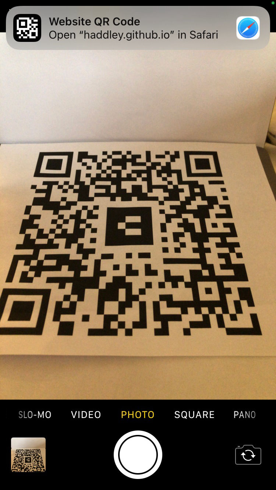
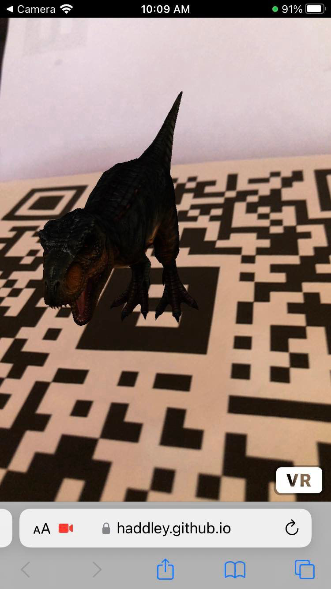

I used [WebXR](https://github.com/immersive-web), which supports both Virtual Reality (VR) and Augmented Reality (AR) and replaces the [WebVR](/posts/webvr/) standard.


## Scene with markers

I created a scene with two Augmented Reality markers. A sphere appears in the camera output when the Hiro marker is recognised, and a dinosaur when the '6' barcode marker is recognised. I added the barcode marker to a QR Code for convenience.


*I created a QR Code*


*I used a barcode marker*


*I used the Augmented Reality Marker*


*I used a Barcode Marker*


*I embedded a Barcode Marker in a QR Code*


## Scene

```html
<!DOCTYPE html>
<html>
<script src="https://aframe.io/releases/1.0.4/aframe.min.js"></script>
<script src="https://raw.githack.com/AR-js-org/AR.js/master/aframe/build/aframe-ar.js"></script>

<body style="margin : 0px; overflow: hidden;">
    <a-scene embedded arjs="detectionMode: mono_and_matrix; matrixCodeType: 3x3;">

        <a-marker preset="hiro">
            <a-sphere position='0 0.5 0' material="opacity: 0.5" radius="1"></a-sphere>
        </a-marker>

        <a-marker type="barcode" value="6">
            <a-entity position="0 0 0" scale="0.05 0.05 0.05"
                gltf-model="https://arjs-cors-proxy.herokuapp.com/https://raw.githack.com/AR-js-org/AR.js/master/aframe/examples/image-tracking/nft/trex/scene.gltf">
            </a-entity>
        </a-marker>
        <a-entity camera></a-entity>
    </a-scene>
</body>

</html>
```