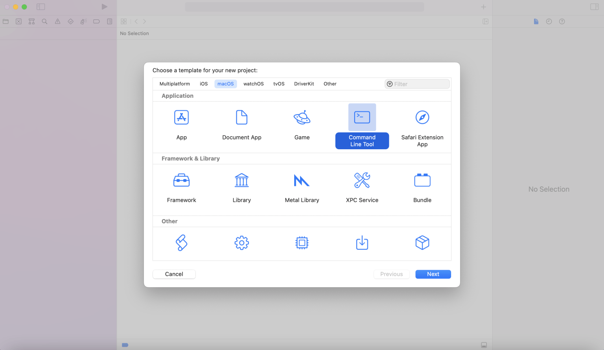
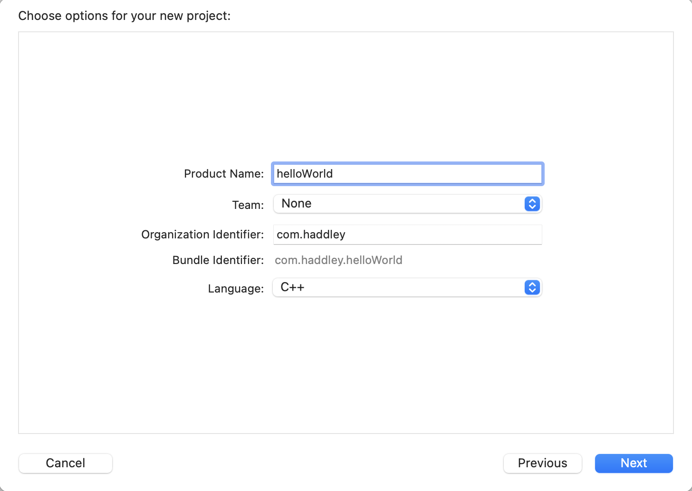
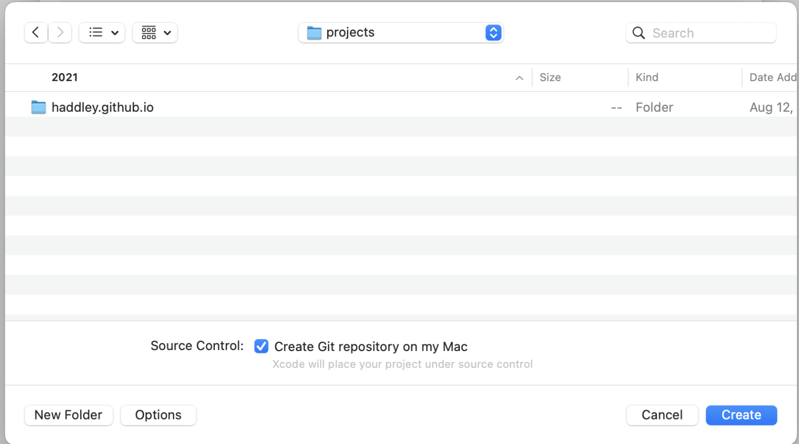
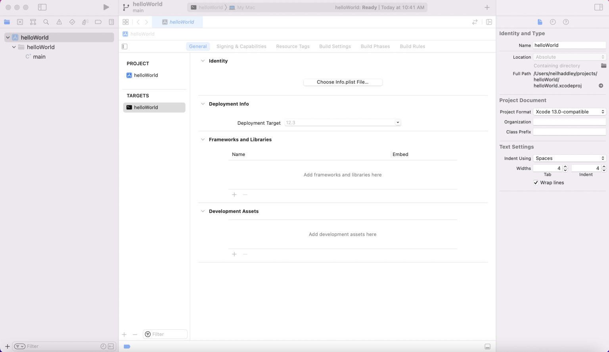
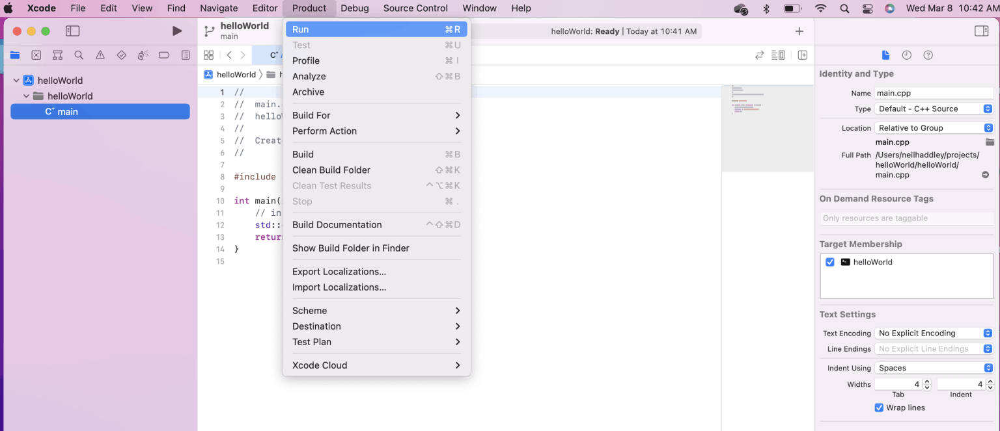
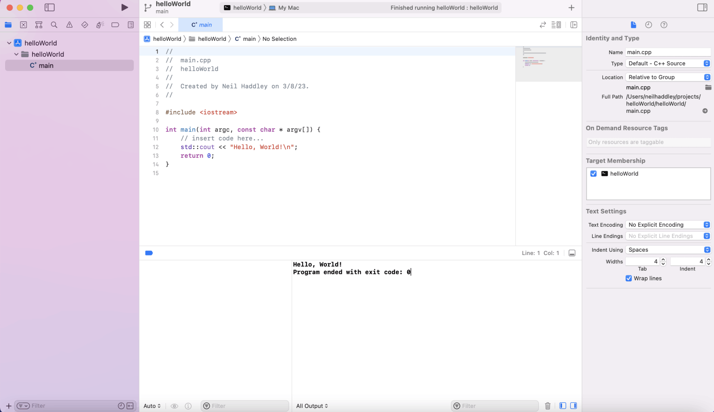
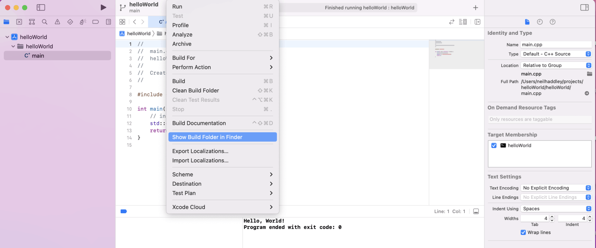
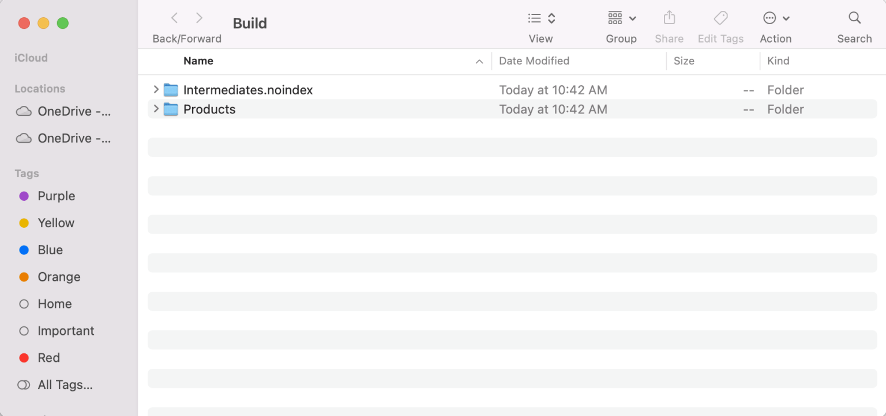
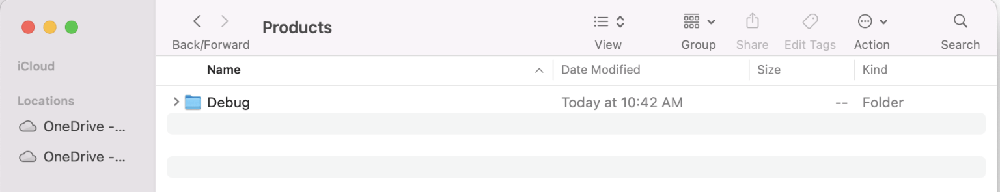
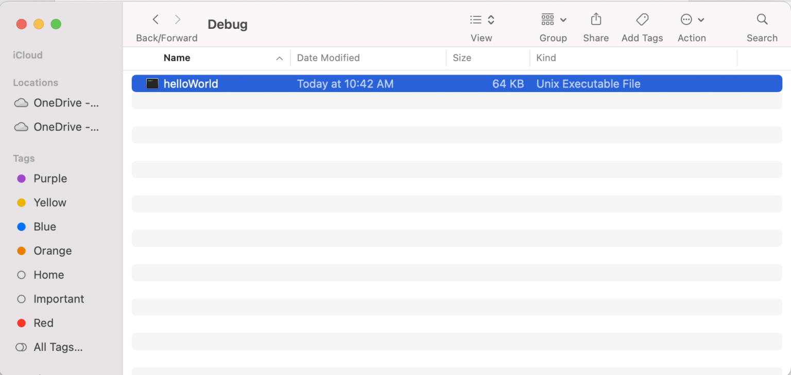

How I built hello world on my M1 MacBook Air


*I created a new Command Line Tool project*


*I set the Product Name to helloWorld and the Language to C++*


*I selected the Source Code location*


*I reviewed the General project settings*


*I built and ran the project*


*The program ended*


*I showed the Build Folder in Finder*


*I reviewed the Build Folder*


*I examined the Debug Build folder*


*I reviewed the Unix Executable File*


## main.cpp

```text
//
//  main.cpp
//  helloWorld
//
//  Created by Neil Haddley on 3/8/23.
//

#include <iostream>

int main(int argc, const char * argv[]) {
    // insert code here...
    std::cout << "Hello, World!\n";
    return 0;
}
```