## Building an OpenGL application using C++ and XCode

I compiled a minimal OpenGL on my M1 MacBook Air.

I used GLFW (a cross platform library for OpenGL).


## Overview

I used GLFW to create an application window with a given width and height and the title "Hello World". In a loop, the SwapBuffers function is called until the window is closed.

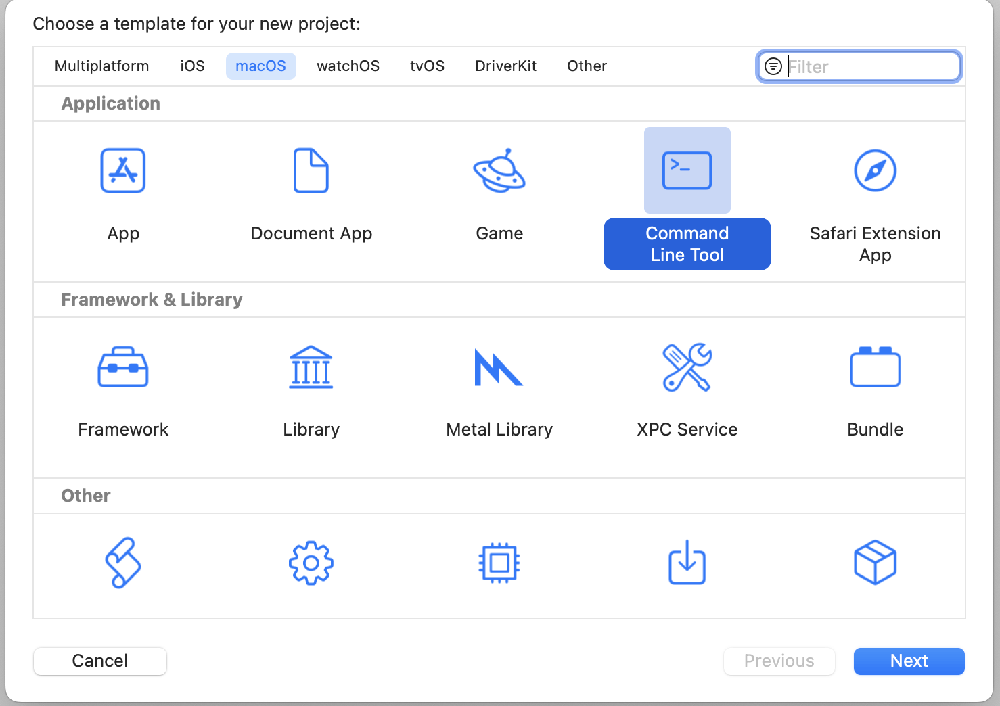
*I created a new Command Line Tool project*

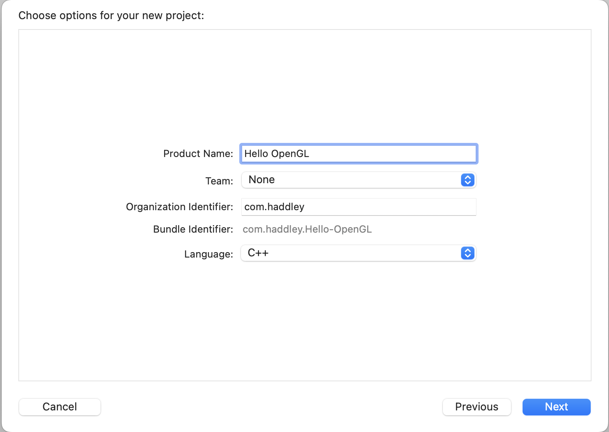
*I named the project Hello OpenGL*

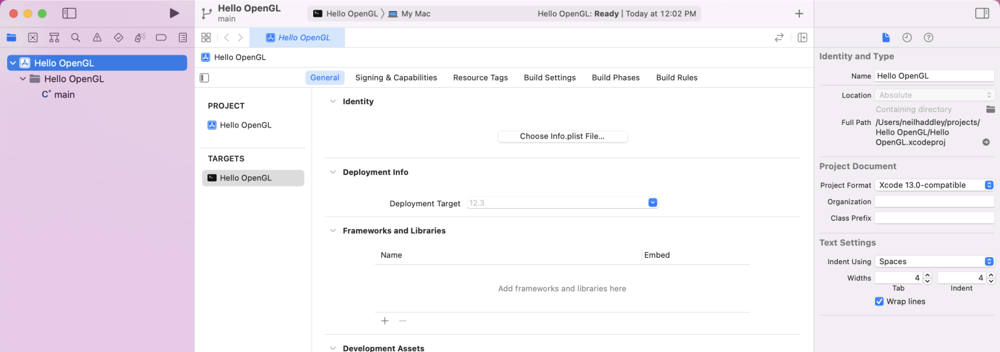
*I reviewed the General Settings*

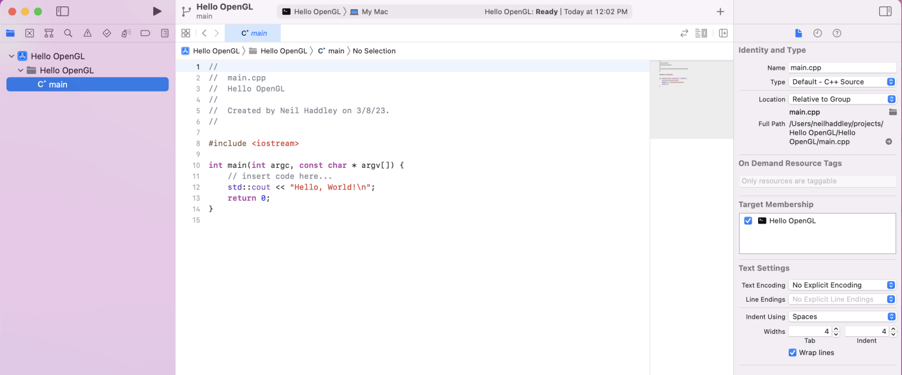
*I reviewed the default hello world code*

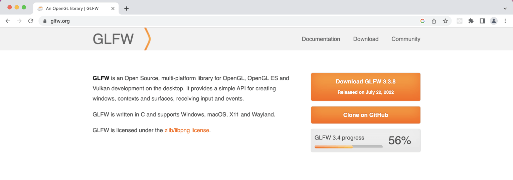
*I visited the GLFW web site*

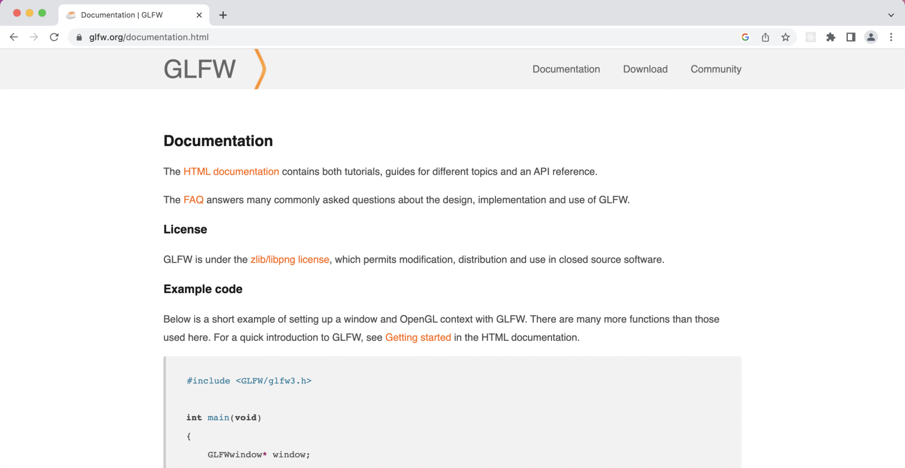
*I reviewed the Hello OpenGL example*

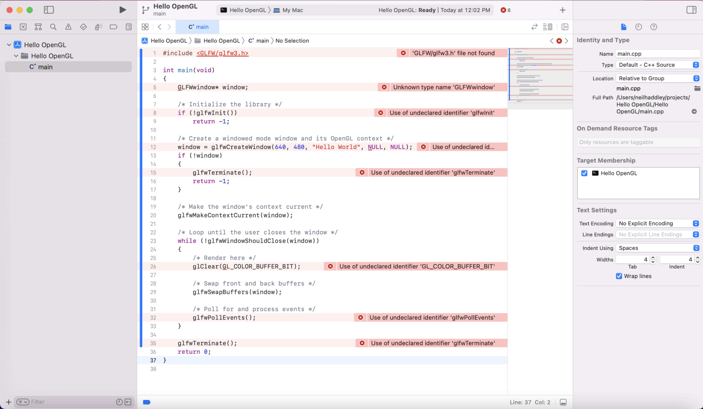
*I saw missing library/header files*

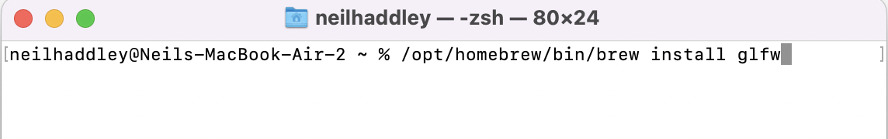
*brew install glfw*

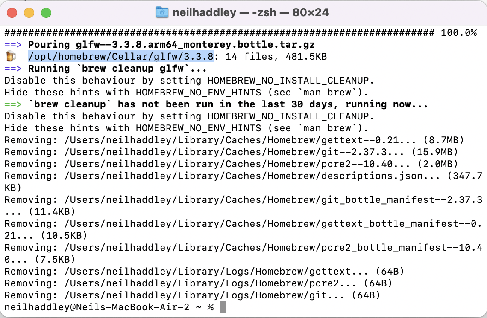
*installed to folder /opt/homebrew/Cellar/glfw/3.3.8*

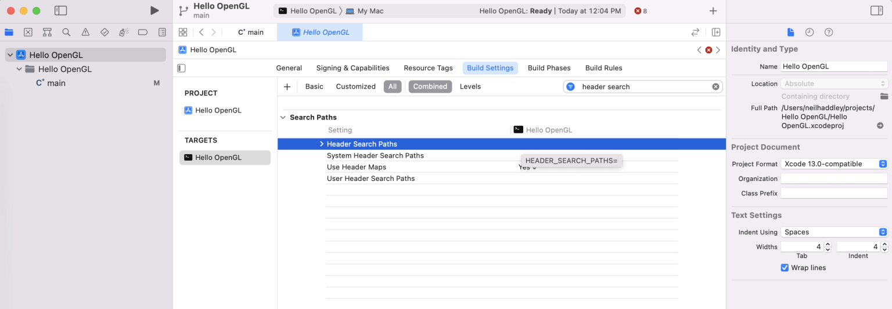
*I added a reference to /opt/homebrew/Cellar/glfw/3.3.8/ header files*

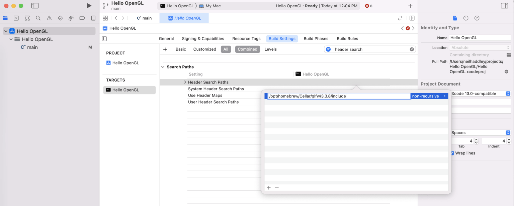
*/opt/homebrew/Cellar/glfw/3.3.8/include*

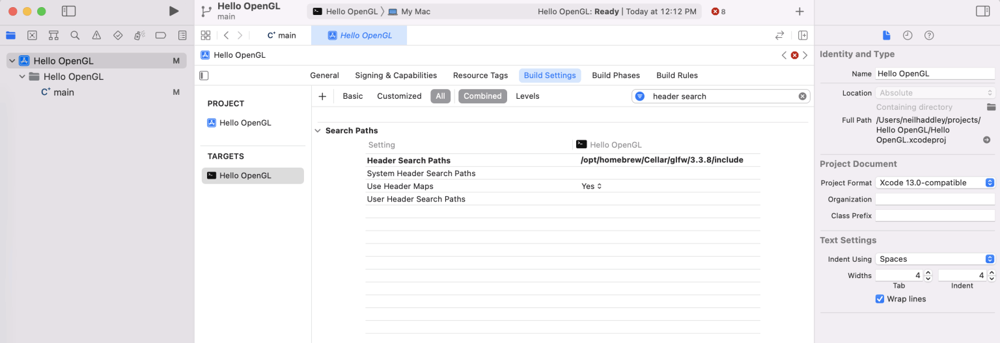
*I added the /opt/homebrew/Cellar/glfw/3.3.8/include reference*

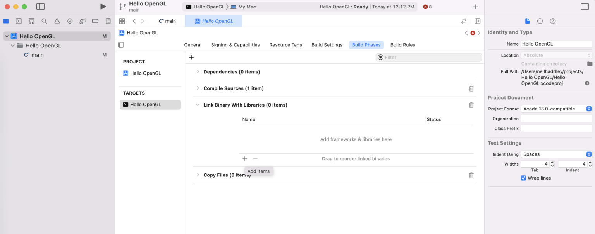
*I added a reference to libraries*

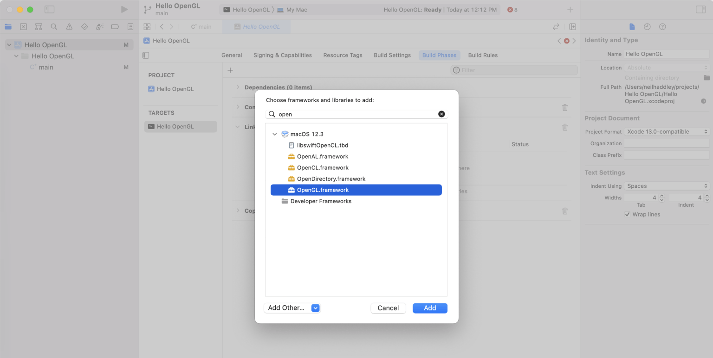
*I selected OpenGL.framework*

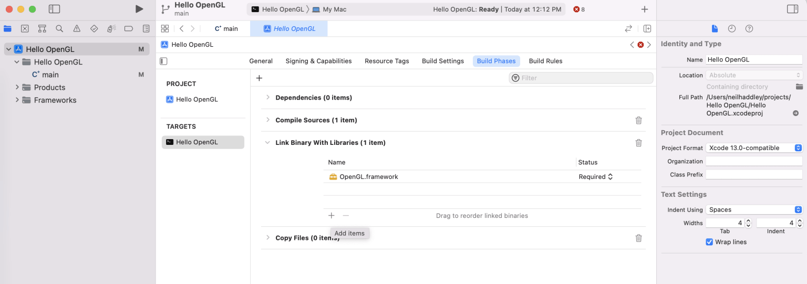
*I added items*

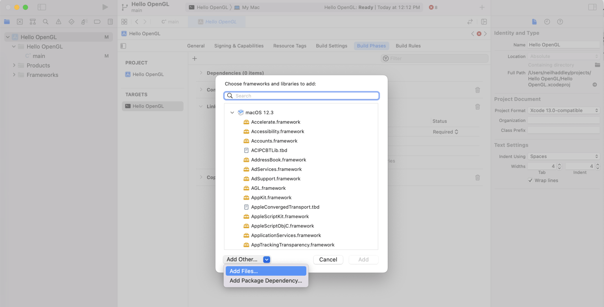
*I added files*

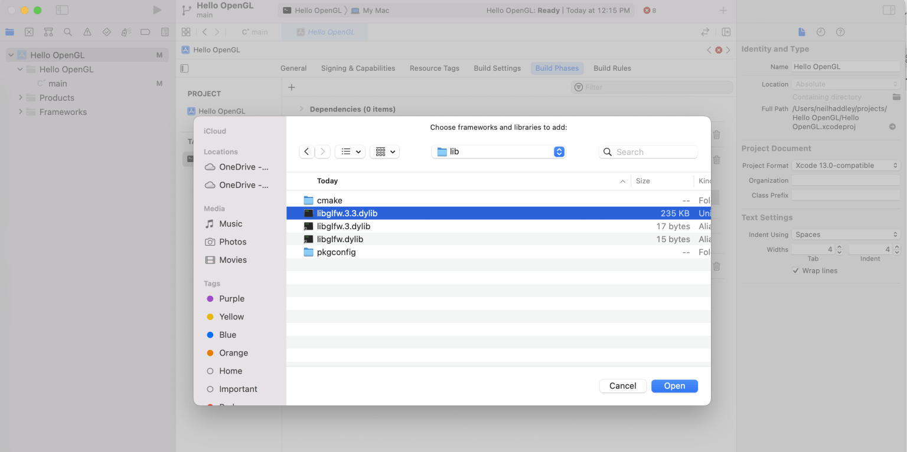
*I added a reference to the dynamically loaded library /opt/homebrew/Cellar/glfw/3.3.8/lib/libglfw.3.3.dylib*

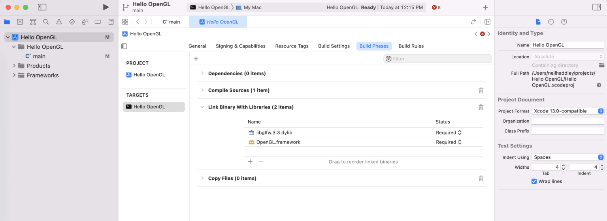
*I updated the library references*

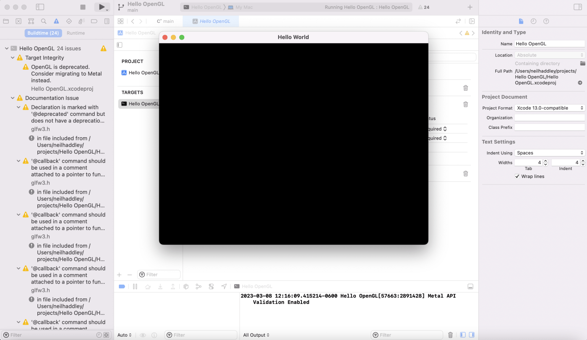
*I ran the Hello OpenGL application*


## main.cpp

```text
#include <GLFW/glfw3.h>

int main(void)
{
    GLFWwindow* window;

    /* Initialize the library */
    if (!glfwInit())
        return -1;

    /* Create a windowed mode window and its OpenGL context */
    window = glfwCreateWindow(640, 480, "Hello World", NULL, NULL);
    if (!window)
    {
        glfwTerminate();
        return -1;
    }

    /* Make the window's context current */
    glfwMakeContextCurrent(window);

    /* Loop until the user closes the window */
    while (!glfwWindowShouldClose(window))
    {
        /* Render here */
        glClear(GL_COLOR_BUFFER_BIT);

        /* Swap front and back buffers */
        glfwSwapBuffers(window);

        /* Poll for and process events */
        glfwPollEvents();
    }

    glfwTerminate();
    return 0;
}
```
## References

- [OpenGL GLFW Hello World: M1 Macbook Pro + Xcode](https://www.youtube.com/watch?v=MHlbNbWlrIM)
- [OpenGL GLFW Windows Visual Studio](https://www.youtube.com/watch?v=OR4fNpBjmq8)